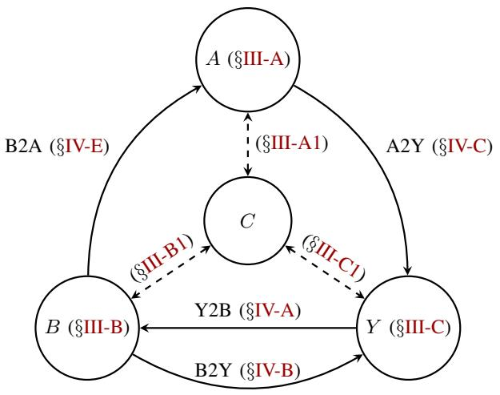
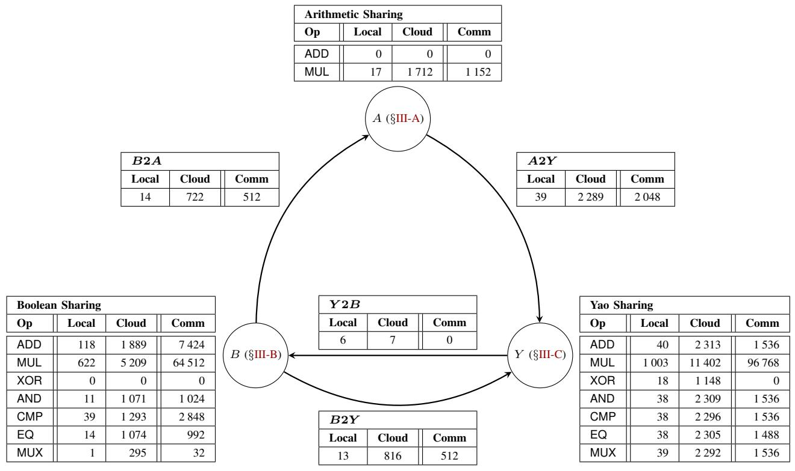
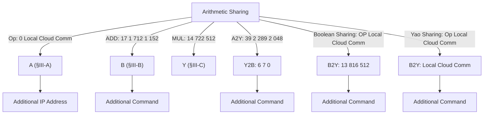
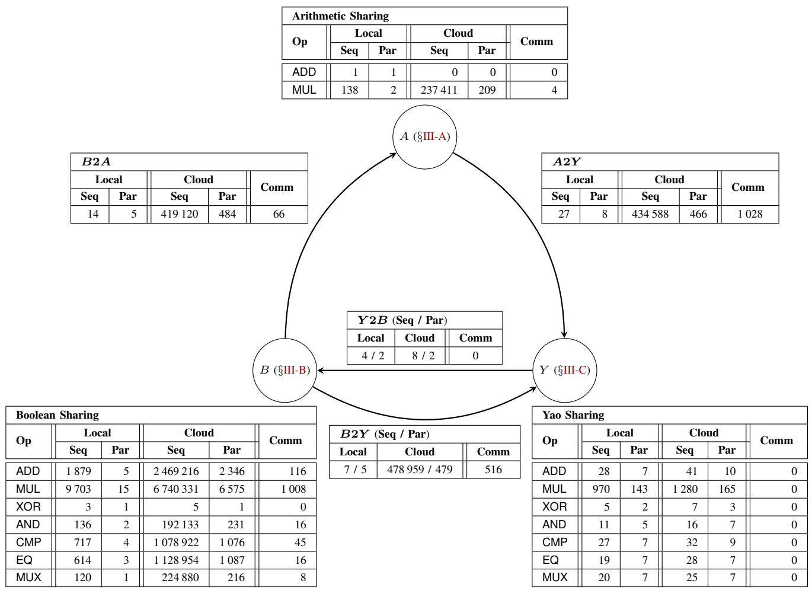

# ABY – A Framework for Efficient Mixed-Protocol Secure Two-Party Computation

Daniel Demmler, Thomas Schneider, Michael Zohner

Engineering Cryptographic Protocols Group

Technische Universitat Darmstadt, Germany ¨

{daniel.demmler,thomas.schneider,michael.zohner}@ec-spride.de

Abstract—Secure computation enables mutually distrusting parties to jointly evaluate a function on their private inputs without revealing anything but the function’s output. Generic secure computation protocols in the semi-honest model have been studied extensively and several best practices have evolved. In this work, we design and implement a mixed-protocol framework, called ABY, that efficiently combines secure computation schemes based on Arithmetic sharing, Boolean sharing, and Yao’s garbled circuits and that makes available best practice solutions in secure two-party computation. Our framework allows to pre-compute almost all cryptographic operations and provides novel, highly efficient conversions between secure computation schemes based on pre-computed oblivious transfer extensions. ABY supports several standard operations and we perform benchmarks on a local network and in a public intercontinental cloud. From our benchmarks we deduce new insights on the efficient design of secure computation protocols, most prominently that oblivious transfer-based multiplications are much more efficient than multiplications based on homomorphic encryption. We use ABY to construct mixed-protocols for three example applications – private set intersection, biometric matching, and modular exponentiation – and show that they are more efficient than using a single protocol.

Keywords—secure two-party computation; mixed-protocols; efficient protocol design

# I. INTRODUCT ION

Secure computation has come a long way from the first theoretical feasibility results in the eighties [34], [74]. Ever since, several secure computation schemes have been introduced and repeatedly optimized, yielding a large variety of different secure computation protocols and flavors for several functions and deployment scenarios. This variety, however, has made the development of efficient secure computation protocols a challenging task for non-experts, who want to choose an efficient protocol for their specific functionality and available resources. Furthermore, since at this point it is unclear which protocol is advantageous in which situation, a developer would first need to prototype each scheme for his specific requirements before he can start implementing the chosen scheme. This Permission to freely reproduce all or part of this paper for noncommercial purposes is granted provided that copies bear this notice and the full citation on the first page. Reproduction for commercial purposes is strictly prohibited without the prior written consent of the Internet Society, the first-named author (for reproduction of an entire paper only), and the author’s employer if the paper was prepared within the scope of employment. NDSS ’15, 8-11 February 2015, San Diego, CA, USA Copyright 2015 Internet Society, ISBN 1-891562-38-X http://dx.doi.org/10.14722/ndss.2015.23113

task becomes even more tedious, time-consuming, and errorprone, since each secure computation protocol has its own representation in which a functionality has to be described, e.g., Arithmetic vs. Boolean circuits.

The development of efficient secure computation protocols for a particular function and deployment scenario has recently been addressed by IARPA in a request for information (RFI) [40]. Part of the vision that is given in this RFI is the automated generation of secure computation protocols that perform well for novel applications and that can be used by a non-expert in secure computation. Several tools, e.g., [8], [13], [24], [36], [48], [53], [68], [75], have started to bring this vision towards reality by introducing an abstract language that is compiled into a protocol representation, thereby relieving a developer from having to specify the functionality in the protocol’s (often complex) underlying representation. These languages and compilers, however, are often tailored to one particular secure computation protocol and translate programs directly into the protocol’s representation. The efficiency of protocols that are generated by these compilers is hence bounded by the possibility to efficiently represent the function in the particular representation, e.g., multiplication of two \`-bit numbers has a very large Boolean circuit representation of size O(\`2 ).

To overcome the dependence on an efficient function representation and to improve efficiency, several works proposed to mix secure computation protocols based on homomorphic encryption with Yao’s garbled circuits protocol, e.g., [3], [10], [14], [31], [39], [46], [59], [60], [71]. The general idea behind such mixed-protocols is to evaluate operations that have an efficient representation as an Arithmetic circuit (i.e., additions and multiplications) using homomorphic encryption and operations that have an efficient representation as a Boolean circuit (e.g., comparisons) using Yao’s garbled circuits. These previous works show that using a mixed-protocol approach can result in better performance than using only a single protocol. Several tools have been developed for designing mixed-protocols, e.g., [11], [12], [35], [72], which allow the developer to specify the functionality and the assignment of operations to secure computation protocols. The assignment can even be done automatically as shown recently in [44]. However, since the conversion costs between homomorphic encryption and Yao’s garbled circuits protocol are relatively expensive and the performance of homomorphic encryption scales very poorly with increasing security parameter, these mixed-protocols achieve only relatively small run-time improvements over using a single protocol.

# A. Overview and Our Contributions

In this work we present ABY(for Arithmetic, Boolean, and Yao sharing), a novel framework for developing highly efficient mixed-protocols that allows a flexible design process. We design ABY using several state-of-the-art techniques in secure computation and by applying existing protocols in a novel fashion. We optimize sub-routines and perform a detailed benchmark of the primitive operations. From these results we derive new insights for designing efficient secure computation protocols. We apply these insights and demonstrate the design flexibility of ABY by implementing three privacy-preserving applications: modular exponentiation, private set intersection, and biometric matching. We give an overview of our framework and describe our contributions in more detail next. ABY is intended as a base-line on the performance of privacy-preserving applications, since it combines several state-of-the-art techniques and best practices in secure computation. The source code of ABY is freely available online at http://encrypto.de/code/ABY.

The ABY Framework. On a very high level, our framework works like a virtual machine that abstracts from the underlying secure computation protocols (similar to the Java Virtual Machine that abstracts from the underlying system architecture). Our virtual machine operates on data types of a given bit-length (similar to 16-bit short or 32-bit long data types in the C programming language). Variables are either in Cleartext (meaning that one party knows the value of the variable, which is needed for inputs and outputs of the computation) or secret shared among the two parties (meaning that each party holds a share from which it cannot deduce information about the value). Our framework currently supports three different types of sharings (Arithmetic, Boolean, and Yao) and allows to efficiently convert between them, cf. Fig. 1. The sharings support different types of standard operations that are similar to the instruction set of a CPU such as addition, multiplication, comparison, or bitwise operations. Operations on shares are performed using highly efficient secure computation protocols: for operations on Arithmetic sharings we use protocols based on Beaver’s multiplication triples [4], for operations on Boolean sharings we use the protocol of Goldreich-Micali-Wigderson (GMW) [34], and for operations on Yao sharings we use Yao’s garbled circuits protocol [74].

Flexible Design Process. A main goal of our framework is to allow a flexible design of secure computation protocols.

1) We abstract from the protocol-specific function representations and instead use standard operations. This allows to mix several protocols, even with different representations, and allows the designer to express the functionality in form of standard operations as known from high-level programming languages such as C or Java. Previously, designers had to manually compose (or automatically generate) a compact representation for the specific protocol, e.g., a small Boolean circuit for Yao’s protocol. As we focus on standard operations, high-level languages can be compiled into our framework and it can be used as backend in several existing secure computation tools, e.g., L1 [44], [71], [72], SecreC [11], [12], or PICCO [75].   
2) By mixing secure computation protocols, our framework is able to tailor the resulting protocol to the resources available in a given deployment scenario. For example, the GMW protocol allows to pre-compute all cryptographic operations, but



<details>
<summary>flowchart</summary>

```mermaid
graph TD
    A["A (§III-A)"] -->|B2A (§IV-E)| B["B (§III-B)"]
    A -->|A2Y (§IV-C)| Y["Y (§III-C)"]
    B -->|Y2B (§IV-A)| Y
    C["C"] -->|B2Y (§IV-B)| Y
    C -.->|§III-A1| A
    C -.->|§III-B1| B
    C -.->|§III-C1| Y
```
</details>

Fig. 1: Overview of our ABY framework that allows efficient conversions between Cleartexts and three types of sharings: Arithmetic, Boolean, and Yao.

the online phase requires several rounds of interaction (which is bad for networks with high latency), whereas Yao’s protocol has a constant number of rounds, but requires symmetric cryptographic operations in the online phase.

Efficient Instantiation and Improvements. Each of the secure computation techniques is implemented using most recent optimizations and best practices such as batch precomputation of expensive cryptographic operations [19], [27], [69]. For Arithmetic sharing (§III-A4) we generate multiplication triples via Paillier with packing [62], [66] or DGK with full decryption [22], [32], for Boolean sharing (§III-B) we use the multiplexer of [54] and OT extension [1], [41], and for Yao sharing (§III-C) we use fixed-key AES garbling [7]. As novel contributions and advances over state-of-the-art techniques for efficient protocol design, we combine existing approaches in a novel way. For Arithmetic sharing, we show how to multiply values using symmetric key cryptography which allows faster multiplication by one to three orders of magnitude (§III-A5). We outline how to efficiently convert from Boolean respectively Yao sharing to Arithmetic sharing (§IV-E and §IV-F), and show how to combine Boolean and Yao sharing to achieve better runtime compared to a pure Boolean or Yao instantiation (§VI-B). Finally, we outline how to modify the fixed-key AES garbling of [7] to achieve better performance in OT extension (§V-A).

Feedback on Efficient Protocol Design. We perform benchmarks of our framework from which we derive new best-practices for efficient secure computation protocols. We show that for multiplications it is more efficient to use OT extensions for pre-computing multiplication triples than homomorphic encryption (§V-C). With our OT-based conversion protocols, converting between different share representations is considerably cheaper than the methods used in previous works, e.g., [35], [44], and scales well with increasing security parameter. In fact, on a low latency network, the conversion costs between different share representations are so cheap that already for a single multiplication it pays off to convert into a more suited representation, perform the multiplication, and convert back into the source representation.

Applications. We show that our ABY framework and techniques can be used to implement and improve performance of several privacy-preserving applications. More specifically, we present mixed-protocols for modular exponentiation, where we combine all three sharings and show the corresponding functionality description (§VI-A), for private set intersection (§VI-B) (combining for the first time Yao with Boolean sharing), and for biometric matching (combining Arithmetic with Boolean and Yao sharing, respectively) whose total run-time is up to 13 times faster than using a single protocol (§VI-C).

# B. Related Work

We separate related work into three categories: mixedprotocols, automated mixed-protocol generation, and other secure computation languages and compilers. Further stateof-the-art for single protocols is summarized in §III.

Mixed-Protocols. Combining two secure computation protocols to utilize the advantages of each of the protocols was used in several works. To the best of our knowledge, the first work that combined Yao’s garbled circuits and homomorphic encryption was [14] who used this technique to evaluate branching programs with applications in remote diagnostics. The framework of [46], implemented in the TASTY compiler [35], combines additively homomorphic encryption with Yao’s garbled circuits protocol and was used for applications such as face-recognition. The L1 language [72] is an intermediate language for the specification of mixed-protocols that are compiled into Java programs. Sharemind [13] uses a high-level language called SecreC and was recently extended to mixed-protocols in [11], [12]. Mixed-protocols have been used for several privacy-preserving applications, such as medical diagnostics [3], fingerprint recognition [39], iris- and fingercode authentication [10], ridge-regression [60], computation on non-integers and Hidden Markov Models [31], and matrix factorization [59]. A system for interpolating between somewhat homomorphic encryption and fully homomorphic encryption was presented in [20]. A system for switching between somewhat homomorphic encryption and fully homomorphic encryption was presented and implemented in [51].

We provide an improved framework that allows to mix multiple protocols, shifts expensive parts of the protocol into a setup phase, and even eliminates the need to use expensive homomorphic encryption operations. Compared to existing mixed-protocol frameworks, ABY provides more flexibility in the design of protocols, more efficient multiplication, and more efficient conversions between different protocols.

Automated Mixed-Protocol Generation. The work we see as most relevant to ours is [44]. In this work, the authors propose to express the function to be computed as a sequence of primitive operations that are then assigned to different secure computation protocols (either homomorphic encryption or garbled circuits). To do so, the authors propose two algorithms that aim to minimize the overall run-time of the resulting mixed-protocol, one based on integer programming that finds an optimal solution and another one based on a heuristic. The run-time is estimated using a performance model, introduced in [71], that is parameterized by factors such as execution times of cryptographic primitives, bandwidth, and latency of the network. The authors perform their protocol selection for several functionalities over LAN and WAN networks and report run-time improvements over a pure Yao-based protocols by 31% for several example protocols that mix homomorphic encryption with Yao’s garbled circuits.

We see the work of [44] as complementary to ours. In particular, while [44] focuses on finding the best performing assignment of operations to secure computation protocols, we increase the degrees of freedom in the design space, making the selection process slightly more complicated, but also resulting in more efficient protocols. Our framework can be combined with the techniques of [44] to automatically generate more efficient mixed-protocols (cf. §VII).

Other Secure Computation Languages and Compilers. The Fairplay framework [53] was the first implementation of Yao’s garbled circuits protocol and allows a developer to specify the function to be computed in a high-level language called Secure Function Definition Language (SFDL), which is compiled into a Boolean circuit. FairplayMP [8] extended the original Fairplay framework, SFDL, and compiler to multiple parties. Optimization techniques and a compiler that optimizes programs written in SFDL by automatically inferring which parts of the computation can be performed on plaintext values, was presented in [43]. A memory-efficient compiler that allows to compile SFDL programs into circuits even on resourceconstrained mobile phones was presented in [55]. The VIFF framework [24] provides a secure computation language and uses a scheduler, which executes operations when operands are available. The CBMC-GC compiler [36] allows to compile a C program into a size-optimized Boolean circuit. The Portable Circuit Format (PCF) [48] represents Boolean circuits as a sequence of instructions and can be compiled from a C program. The PICCO compiler [75] performs a source-to-source compilation, supports parallelization of operations to decrease the number of communication rounds, and generates secure multi-party computation protocols based on linear secret sharing. Wysteria [68] is a strongly typed high-level language for the specification of secure multi-party computation protocols.

Our framework allows to specify and efficiently evaluate mixed-protocols using primitive operations and can be integrated as backend for several existing secure computation languages and compilers.

# C. Outline

The remainder of this paper is organized as follows: In §II we give preliminaries and notations used. We then detail the general concept of our ABY framework by describing the underlying types of sharings in §III and conversions among different types of sharings in §IV, see also Fig. 1 for an overview. In §V we detail the design choices and the implementation of our framework and perform a benchmark of the primitive operations. In §VI we demonstrate the applicability of our framework to several secure computation functionalities. Finally, in §VII we conclude and present directions for future work.

# I I . P R E L I M I NA R I E S

In this section we define our setting (§II-A) and security definitions (§II-B). We then introduce the notation used in our paper (§II-C) and summarize oblivious transfer, the main building block of our framework (§II-D).

# A. Two-Party Setting

In this work we consider protocols for secure two-party computation that can be used for a large variety of privacypreserving applications as described in the following.

Naturally, such protocols can be used for client-server applications where both parties provide their private inputs (e.g., for services on the Internet).

However, the protocols can also be used for multi-party applications where an arbitrary number of input players provide their confidential inputs and an arbitrary number of output players receive the outputs of the secure computation (e.g., for auctions, surveys, etc.), cf. [30]. For this, each input player secret-shares its inputs among the two computation servers (that are assumed to not collude). Then, the two computation servers run the secure computation protocol on the input shares during which they do not learn any intermediate information. Finally, they send the output shares to the output players who can reconstruct the outputs.

As all protocols in our ABY framework operate on shares, this also allows reactive computations where the two computation servers keep secure state information among multiple executions (e.g., for a secure database system).

# B. Security Against Semi-Honest Adversaries

We use the semi-honest (passive) adversary model, where we assume a computationally bounded adversary who tries to learn additional information from the messages seen during the protocol execution. In contrast to the stronger malicious (active) adversary, the semi-honest adversary is not allowed to deviate from the protocol. Although more restrictive than the malicious model, the semi-honest model has many applications, e.g., to protect against passive insider attacks by administrators or government agencies, or where the parties can be trusted to not actively misbehave. The semi-honest model enables the development of highly efficient secure computation protocols and is therefore widely used to realize privacy-preserving applications. Our work concentrates on the design and implementation of efficient mixed-protocol secure two-party computation in the semi-honest adversary model.

# C. Notation

We denote the two parties among which the secure computation protocol is run as $P _ { 0 }$ and $P _ { 1 }$ .

We write $x \oplus y$ for bitwise XOR and $x \wedge y$ for bitwise AND. We use the list operator $x [ i ]$ to refer to the i-th element of a list x. In particular, if x is a sequence of bits, $x [ i ]$ is the i-th bit of x and x[0] is the least-significant bit of x.

κ denotes the symmetric security parameter and $\varphi$ denotes the public-key security parameter, with $\kappa \in \{ 8 0 , 1 1 2 , 1 2 8 \}$ and $\varphi \in \{ 1 0 2 4 , 2 0 4 8 , 3 0 7 2 \}$ for legacy (until 2010), medium (2011-2030), and long-term (after 2030) security in accordance with the recommendations of NIST [61]. We set the statistical security parameter σ to 40. We denote public-key encryption with the public key of party $P _ { i }$ as $c = \mathtt { E n c } _ { i } ( m )$ and the corresponding decryption operation as $m = { \mathsf { D e c } } _ { i } \left( c \right)$ with $m = \bar { \mathsf { D e c } } _ { i } \left( \mathsf { E } \bar { \mathsf { n c } } _ { i } \left( m \right) \right)$ .

We denote a shared variable x as $\langle x \rangle ^ { t }$ . The superscript $t \in \{ A , B , Y \}$ indicates the type of sharing, where A denotes Arithmetic sharing, B denotes Boolean sharing, and Y denotes Yao sharing. The semantics of the different sharing types and operations are defined in §III. We refer to the individual share of $\langle x \rangle ^ { t }$ that is held by party $P _ { i }$ as $\langle x \rangle _ { i } ^ { t }$ . In a similar fashion, we define a sharing operator $\langle x \rangle ^ { t } \stackrel { \cdot } { = } \mathsf { S h r } _ { i } ^ { t } \left( x \right)$ meaning that $P _ { i }$ shares its input value x with $P _ { 1 - i }$ and a reconstruction operator $x = \mathsf { R e c } _ { i } ^ { t } \left( \langle x \rangle ^ { t } \right)$ meaning that $P _ { i }$ obtains the value of x as output. When both parties obtain the value of x, we write $\mathsf { R e c } ^ { t } \left( \langle x \rangle ^ { t } \right)$ . We denote the conversion of a sharing of representation $\langle x \rangle ^ { s }$ into another representation $\langle x \rangle ^ { d }$ with $s , d \in$ $\{ { \dot { A } } , B , Y \}$ and $s \neq d$ as $\langle x \rangle ^ { d } = s \dot { 2 } d ( \langle x \rangle ^ { s } )$ , e.g., A2B converts an Arithmetic share into a Boolean share. Note that we require that no party learns any additional information about x during this conversion. When performing an operation  on shares, we write $\langle z \rangle ^ { t } = \langle x \rangle ^ { t } \odot \langle y \rangle ^ { t } , \mathrm { f o r ~ \bar { \odot } ~ } \colon \langle \hat { x } \rangle ^ { t } \times \langle y \rangle ^ { t } \mapsto \langle z \rangle ^ { t }$ and $t \in \{ A , B , \dot { Y } \} , { \mathrm { e . g . ~ } } \langle z \rangle ^ { A } = \langle x \rangle ^ { A } + \langle y \rangle ^ { A }$ adds two Arithmetic shares and returns an Arithmetic share.

# D. Oblivious Transfer

The main building block we use in our work is oblivious transfer (OT). We use 1-out-of-2 OT, where the sender inputs two \`-bit strings $\left( { { s _ { 0 } } , { s _ { 1 } } } \right)$ and the receiver inputs a bit $c \in \{ 0 , 1 \}$ and obliviously obtains $s _ { c }$ as output, such that the receiver learns no information about $s _ { 1 - c }$ and the sender learns no information about c.

To maximize the performance of the online phase, our implementation uses OT pre-computations [5]. While OT protocols require costly public-key cryptography, OT extension [1], [6], [41] allows to extend a few base OTs (for which we use [56] in our experiments) using only symmetric cryptographic primitives and a constant number of rounds. To further increase efficiency, special OT flavors such as correlated OT (C-OT) [1] and random OT (R-OT) [1], [58] were introduced. In C-OT, the sender inputs a correlation function $f _ { \Delta } ( \cdot )$ and obtains a random $s _ { 0 }$ and a correlated $s _ { 1 } = f _ { \Delta } ( s _ { 0 } )$ . In R-OT, the sender has no inputs and obtains random $\left( { { s _ { 0 } } , { s _ { 1 } } } \right)$ . The random $s _ { 0 }$ in C-OT and $( s _ { 0 } , s _ { 1 } )$ are output by a correlation robust one-way function H [41], which can be instantiated using a hash function. Throughout the paper we use the short notation OTn (resp. C-OTn, R-$\mathrm { O T } _ { \ell } ^ { n } )$ to refer to n parallel (C-/R-)OTs on \`-bit strings. For OT extension, the communication for OTn\` , C-OTn\` , and R-$\mathrm { O T } _ { \ell } ^ { n }$ , which was shown to be the main performance bottleneck in [1], is $n ( \kappa + 2 \ell )$ , n(κ + \`), and nκ bits, respectively. The computation for $\mathrm { O T } _ { \ell } ^ { n } , \dot { \mathbf { C } } \ – \mathbf { O T } _ { \ell } ^ { n }$ , and R-OTn\` is 3n evaluations of symmetric cryptographic primitives for each party.

# I I I . S H A R I N G T Y P E S

In this section we detail the sharing types that our ABY framework uses: Arithmetic sharing (§III-A), Boolean sharing (§III-B), and Yao sharing (§III-C). For each sharing type we describe the semantics of the sharing, standard operations, and the state of the art in the respective sub-sections.

# A. Arithmetic Sharing

For the Arithmetic sharing an \`-bit value x is shared additively in the ring $\mathbb { Z } _ { 2 ^ { \ell } }$ (integers modulo $2 ^ { \ell } )$ as the sum of two values. The protocols described in the following are based on [2], [44], [67]. First we define the sharing semantics (§III-A1) and operations (§III-A2) and give an overview over related work on secure computation based on Arithmetic sharing (§III-A3). Then we detail how to generate Arithmetic multiplication triples using homomorphic encryption (§III-A4) or OT (§III-A5); we experimentally compare the performance of both approaches later in §V-C. In the following, we assume all Arithmetic operations to be performed in the ring $\mathbb { Z } _ { 2 ^ { \ell } }$ , i.e., all operations are (mod 2\`).

1) Sharing Semantics: Arithmetic sharing is based on additively sharing private values between the parties as follows.

Shared Values. For an \`-bit Arithmetic sharing $\langle x \rangle ^ { A }$ of x we have $\langle x \rangle _ { 0 } ^ { A } + \langle x \rangle _ { 1 } ^ { A } \equiv x$ (mod $2 ^ { \ell } )$ with $\langle x \rangle _ { 0 } ^ { A } , \langle \overline { { x } } \rangle _ { 1 } ^ { A } \in \mathbb { Z } _ { 2 ^ { \ell } }$ .

Sharing. $\mathsf { S h r } _ { i } ^ { A } \left( x \right) : P _ { i }$ chooses $r \in _ { R } \mathbb { Z } _ { 2 ^ { \ell } }$ , sets $\langle x \rangle _ { i } ^ { A } = x - r ,$ and sends r to $P _ { 1 - i }$ , who sets $\langle x \rangle _ { 1 - i } ^ { A } = r .$ .

Reconstruction. $\mathsf { R e c } _ { i } ^ { A } \left( x \right) : P _ { 1 - i }$ sends its share $\langle x \rangle _ { 1 - i } ^ { A }$ to $P _ { i }$ who computes $x = \langle x \rangle _ { 0 } ^ { A } + \langle x \rangle _ { 1 } ^ { A }$ .

2) Operations: Every Arithmetic circuit is a sequence of addition and multiplication gates, evaluated as follows:

Addition. $\langle z \rangle ^ { A } = \langle x \rangle ^ { A } { + } \langle y \rangle ^ { A } { : } P _ { i }$ locally computes $\langle z \rangle _ { i } ^ { A } =$ $\langle x \rangle _ { i } ^ { A } + \langle y \rangle _ { i } ^ { A }$ .

Multiplication. $\langle z \rangle ^ { A } ~ = ~ \langle x \rangle ^ { A } ~ \cdot ~ \langle y \rangle ^ { A }$ : multiplication is performed using a pre-computed Arithmetic multiplication triple [4] of the form $\langle c \rangle ^ { A } \ = \ \langle a \rangle ^ { A } \cdot \langle b \rangle ^ { A } \colon P _ { i }$ sets $\langle e \rangle _ { i } ^ { A } =$ $\langle x \rangle _ { i } ^ { A } - \langle a \rangle _ { i } ^ { A }$ and $\langle f \rangle _ { i } ^ { A } \equiv \langle y \rangle _ { i } ^ { A } \ - \langle b \rangle _ { i } ^ { A }$ , both parties perform $\mathsf { R e c } ^ { A } \left( e \right)$ a nd $\mathsf { R e c } ^ { A } \left( \overset { \cdot } { \boldsymbol { f } } \right)$ , and $P _ { i }$ sets $\langle z \rangle _ { i } ^ { A } = i \cdot e \cdot f + f \cdot \langle a \rangle _ { i } ^ { A } +$ $e \cdot \langle b \rangle _ { i } ^ { \dot { A } } + \langle c \rangle _ { i } ^ { A }$ . We give protocols to pre-compute Arithmetic multiplication triples in §III-A4 and §III-A5.

3) State-of-the-Art: The protocols we employ in Arithmetic sharing use additive sharing in the ring $\mathbb { Z } _ { 2 ^ { \ell } }$ . They were described in [2], [44], [67], and provide security in the semi-honest setting. The BGW protocol [9] was the first protocol for secure multi-party computation of Arithmetic circuits that is secure against semi-honest parties for up to $\mid t < n / 2$ corrupt parties and secure against malicious adversaries for up to $t < n / 3$ corrupt parties. The Virtual Ideal Function Framework (VIFF) [24] is a generic software framework for secure computation schemes in asynchronous networks and implemented secure computation using pre-computed Arithmetic multiplication triples. The SPDZ protocol [27], [28] allows secure computation in the presence of $t = n - 1$ corrupted parties in the malicious model; a run-time environment for the SPDZ protocol was presented in [42]. Arithmetic circuits for computing various primitives have been proposed in [17], [18].

4) Generating Arithmetic Multiplication Triples via $A d d i -$ tively Homomorphic Encryption: Typically, Arithmetic multiplication triples of the form $\langle a \rangle ^ { A } \cdot \dot { \langle b \rangle } ^ { A } = \dot { \langle c \rangle } ^ { A }$ are generated in the setup phase using an additively homomorphic encryption scheme as shown in Protocol 1. This protocol for generating multiplication triples was mentioned as “well known folklore” in [2, Appendix A]. For homomorphic encryption we use either the cryptosystem of Paillier [25], [26], [62], or the one of Damgard-Geisler-Krøigaard (DGK) [ ˚ 22], [23] with full decryption using the Pohlig-Hellman algorithm [65] as described in [10], [32], [52]. In Paillier encryption, the plaintext space is $Z _ { N }$ and we use statistical blinding with parameter r; in DGK encryption we set the plaintext space to be $\mathbb { Z } _ { 2 ^ { 2 \ell + 1 } }$ and

use perfect blinding with parameter r. For proofs of security and correctness we refer to [67] and [66].

Complexity. To generate an \`-bit multiplication triple, $P _ { 0 }$ and $P _ { 1 }$ exchange 3 ciphertexts, each of length $2 \varphi$ bits for Paillier (resp. $\varphi$ bits for DGK), resulting in a total communication of $6 \varphi$ bits (resp. $3 \varphi$ bits). For Paillier encryption we also use the packing optimization described in [67] that packs together multiple messages from $P _ { 1 }$ to $P _ { 0 }$ into a single ciphertext, which reduces the number of decryptions and reduces communication per multiplication triple to $\bar { 4 } \varphi + 2 \varphi / \lfloor \varphi / ( 2 \ell + 1 + \sigma ) \rfloor$ bits.

Protocol 1 Generating Arithmetic MTs via HE   
$\begin{array}{rl} & P_0:\langle a\rangle_0^A,\langle b\rangle_0^A\in_R\mathbb{Z}_{2^\ell}\\ & P_1:\langle a\rangle_1^A,\langle b\rangle_1^A\in_R\mathbb{Z}_{2^\ell}\\ & \qquad r\in_R\mathbb{Z}_{2^{2\ell +1 + \sigma}}\text{for Paillier (resp.} r\in_R\mathbb{Z}_{2^{2\ell +1}}\text{for DGK)}\\ & \qquad \langle c\rangle_1^A = \langle a\rangle_1^A\cdot \langle b\rangle_1^A -r\pmod {2^\ell}\\ & P_0\to P_1:\mathsf{Enc}_0\left(\langle a\rangle_0^A\right),\mathsf{Enc}_0\left(\langle b\rangle_0^A\right)\\ & P_1\to P_0:d = \mathsf{Enc}_0\left(\langle a\rangle_0^A\right)^{\langle b\rangle_1^A}\cdot \mathsf{Enc}_0\left(\langle b\rangle_0^A\right)^{\langle a\rangle_1^A}\cdot \mathsf{Enc}_0(r)\\ & P_0:\langle c\rangle_0^A = \langle a\rangle_0^A\cdot \langle b\rangle_0^A +\mathsf{Dec}_0(d)\pmod {2^\ell} \end{array}$

5) Generating Arithmetic Multiplication Triples via Oblivious Transfer: Instead of using homomorphic encryption, Arithmetic multiplication triples can be generated based on OT extension. The protocol was proposed in [33, Sect. 4.1] and used in [15]. It allows to efficiently compute the product of two secret-shared values using OT. In the following we describe a slight variant of the protocol that uses more efficient correlated OT extension. Overall, an \`-bit multiplication triple can be generated using 2\` correlated OTs on \`-bit strings, i.e., C-OT2\`\` (or even on shorter strings, as described below).

To generate an Arithmetic multiplication triple $\langle a \rangle ^ { A } \cdot \langle b \rangle ^ { A } =$ $\langle c \rangle ^ { A }$ , observe that we can write $\langle a \dot { \rangle } ^ { A } \cdot \langle b \rangle ^ { A } = \dot { ( } \langle a \dot { \rangle } _ { \boldsymbol { 0 } } ^ { \dot { A } } + \dot { \langle a \rangle } _ { \boldsymbol { 1 } } ^ { A } )$ · $\begin{array} { r } { ( \langle \dot { b } \rangle _ { 0 } ^ { A } + \langle b \rangle _ { 1 } ^ { A } ) = \langle a \rangle _ { 0 } ^ { A } \langle b \rangle _ { 0 } ^ { A } + \langle a \rangle _ { 0 } ^ { A } \langle \dot { b } \rangle _ { 1 } ^ { A } + \langle a \rangle _ { 1 } ^ { A } \langle \dot { b } \rangle _ { 0 } ^ { A ^ { \prime } } + \langle a \rangle _ { 1 } ^ { \dot { A } } \langle \dot { b } \rangle _ { 1 } ^ { A } } \end{array}$ . Let $P _ { 0 }$ randomly generate $\langle a \rangle _ { 0 } ^ { A } , \langle b \rangle _ { 0 } ^ { A } \in _ { R } \mathbb { Z } _ { 2 ^ { \ell } }$ and $P _ { 1 }$ randomly generate $\langle a \rangle _ { 1 } ^ { A } , \langle \bar { b } \rangle _ { 1 } ^ { \ A } \in _ { R } \mathbb { Z } _ { 2 ^ { \ell } }$ . The terms $\langle \bar { a } \rangle _ { 0 } ^ { \bar { A } } \langle b \rangle _ { 0 } ^ { A }$ and $\langle a \rangle _ { 1 } ^ { A } \langle b \rangle _ { 1 } ^ { \check { A } }$ can be computed locally by $P _ { 0 }$ and $P _ { 1 }$ , respectively. The mixedterms $\langle a \rangle _ { 0 } ^ { A } \langle b \rangle _ { 1 } ^ { A }$ and $\langle \bar { a } \rangle _ { 1 } ^ { A } \bar { \langle { b } \rangle _ { 0 } ^ { A } }$ are computed as described next. We detail only the computation of $\langle a \rangle _ { 0 } ^ { \mathrm { \Delta } A } \langle b \rangle _ { 1 } ^ { A }$ , since $\langle a \rangle _ { 1 } ^ { A } \langle b \rangle _ { 0 } ^ { A }$ can be computed symmetrically by reversing the parties’ roles.

Note that, since $\langle a \rangle _ { 0 } ^ { A } \langle b \rangle _ { 1 } ^ { A }$ leaks information if known in plain by a party, we compute the sharing $\langle u \rangle ^ { A } = \langle \langle a \rangle _ { 0 } ^ { A } \langle b \rangle _ { 1 } ^ { A } \rangle ^ { A }$ securely, such that $P _ { 0 }$ holds $\langle u \rangle _ { 0 } ^ { A }$ and $\bar { P _ { 1 } }$ holds $\langle u \rangle _ { 1 } ^ { A }$ . We have $P _ { 0 }$ and $P _ { 1 }$ engage in a C-OT\`, where $P _ { 0 }$ is the sender and $P _ { 1 }$ is the receiver. In the i-th C-OT, $P _ { 1 }$ inputs $\langle b \rangle _ { 1 } ^ { A } [ i ]$ as choice bit and $P _ { 0 }$ inputs the correlation function $f _ { \Delta _ { i } } ( \dot { x } ) = ( \langle a \rangle _ { 0 } ^ { A } \cdot 2 ^ { i } - x )$ mod $2 ^ { \ell }$ . As output from the i-th C-OT, $\dot { P _ { 0 } }$ obtains $\left( { { s _ { i , 0 } } , { s _ { i , 1 } } } \right)$ with $s _ { i , 0 } \in _ { R } \ \mathbb { Z } _ { 2 ^ { \ell } }$ and $s _ { i , 1 } = f _ { \Delta _ { i } } ( s _ { i , 0 } ) = ( \langle a \rangle _ { 0 } ^ { A } \cdot 2 ^ { i } - s _ { i , 0 } )$ mod $2 ^ { \ell }$ and $P _ { 1 }$ obtains $s _ { i , \langle b \rangle _ { 1 } ^ { A } [ i ] } = ( \langle b \rangle _ { 1 } ^ { A } [ i ] \cdot \langle a \rangle _ { 0 } ^ { A } \cdot 2 ^ { i } - s _ { i , 0 } )$ mod $2 ^ { \ell } . ~ P _ { 0 }$ sets $\begin{array} { r } { \langle u \rangle _ { 0 } ^ { A } = ( \sum _ { i = 1 } ^ { \ell } s _ { i , 0 } ) } \end{array}$ mod $2 ^ { \ell }$ and $P _ { 1 }$ sets $\begin{array} { r } { \langle u \rangle _ { 1 } ^ { A } = ( \sum _ { i = 1 } ^ { \ell } s _ { i , \langle b \rangle _ { 1 } ^ { A } [ i ] } ) } \end{array}$ mod $2 ^ { \ell } .$ .

Analogously, $P _ { 0 }$ and $P _ { 1 }$ compute $\langle v \rangle ^ { A } = \langle \langle a \rangle _ { 1 } ^ { A } \langle b \rangle _ { 0 } ^ { A } \rangle ^ { A }$ Finally, $\bar { P _ { i } }$ sets $\langle c \rangle _ { i } ^ { A } = \langle a \rangle _ { i } ^ { A } \langle b \rangle _ { i } ^ { A } \dot { + } \langle u \rangle _ { i } ^ { A } \dot { + } \langle v \rangle _ { i } ^ { A }$ .

Correctness and security of the protocol directly follow from the protocol and proof in [33, Sect. 4.1].

Complexity. To generate an \`-bit multiplication triple, $P _ { 0 }$ and $P _ { 1 }$ run $\mathrm { C } { \cdot } \mathrm { \overset { \partial } { O } T } _ { \ell } ^ { 2 \ell }$ , where each party evaluates 6\` symmetric cryptographic operations and sends $2 \dot { \ell } ( \kappa + \ell )$ bits. The communication can be further decreased by sending only the $\ell - i$ least significant bits in the i-th C-OT, since the i most significant bits are cut off by the modulo operation anyway. This reduces the communication to $\mathrm { C } { \cdot } \mathrm { O } \mathrm { T } _ { \ell } ^ { 2 } + \mathrm { C } { \cdot } \mathrm { O } \mathrm { T } _ { \ell - 1 } ^ { 2 } . . . + \mathrm { \bar { C } { - } O \mathrm { T } _ { 1 } ^ { 2 } }$ , which averages to C-OT2\`(\`+ $\mathrm { C - O T } _ { ( \ell + 1 ) / 2 } ^ { 2 \ell } .$ 1)/2. Note that we also need a constant number of public-key operations for the base OTs. Although our framework uses OT in both Boolean and Yao sharings, we only compute the base OTs for the whole framework once.

# B. Boolean Sharing

The Boolean sharing uses an XOR-based secret sharing scheme to share a variable. We evaluate functions represented as Boolean circuits using the protocol by Goldreich-Micali-Wigderson (GMW) [34]. In the following, we first define the sharing semantics (§III-B1), describe how operations are performed (§III-B2), and give an overview over related work (§III-B3).

1) Sharing Semantics: Boolean sharing uses an XOR-based secret sharing scheme. To simplify presentation, we assume single bit values; for \`-bit values each operation is performed \` times in parallel.

Shared Values. A Boolean share $\langle x \rangle ^ { B }$ of a bit x is shared between the two parties, such that $\begin{array} { r } { \dot { \langle \boldsymbol { x } \rangle } _ { 0 } ^ { B } \oplus \langle \boldsymbol { x } \rangle _ { 1 } ^ { B } = \boldsymbol { x } } \end{array}$ with $\langle x \rangle _ { 0 } ^ { B } , \langle x \rangle _ { 1 } ^ { B } \in \mathbb { Z } _ { 2 }$ .

Sharing. $\mathsf { S h r } _ { i } ^ { B } \left( x \right) : \ P _ { i }$ chooses $r \in \scriptscriptstyle R \{ 0 , 1 \}$ , computes $\langle x \rangle _ { i } ^ { B } = x \bar { \oplus } r$ , and sends r to $P _ { 1 - i }$ who sets $\langle x \rangle _ { 1 - i } ^ { B } = r$ .

Reconstruction. Re ${ \mathsf { c } } _ { i } ^ { B } \left( x \right) : P _ { 1 - i }$ sends its share $\langle x \rangle _ { 1 - i } ^ { B }$ to $P _ { i }$ who computes $x = \langle \overset { \cdot } { x } \rangle _ { 0 } ^ { B } \oplus \langle x \rangle _ { 1 } ^ { B }$ .

2) Operations: Every efficiently computable function can be expressed as a Boolean circuit consisting of XOR and AND gates, for which we detail the evaluation in the following.

XOR. $\langle \underline { { { z } } } \rangle ^ { B } = \langle \underline { { { x } } } \rangle ^ { B } \oplus \langle \underline { { { y } } } \rangle ^ { B }$ : Pi locally computes $\langle z \rangle _ { i } ^ { B } =$ $\langle \boldsymbol { x } \rangle _ { i } ^ { B } \oplus \langle \boldsymbol { y } \rangle _ { i } ^ { B ^ { \prime } }$ .

AND. $\langle z \rangle ^ { B } = \langle x \rangle ^ { B } \wedge \langle y \rangle ^ { B }$ : AND is evaluated using a precomputed Boolean multiplication triple $\langle c \rangle ^ { B } = \langle a \rangle ^ { B } \wedge \langle \bar { b } \rangle ^ { B }$ as follows: $P _ { i }$ computes $\langle e \rangle _ { i } ^ { B } = \langle a \rangle _ { i } ^ { B } \oplus \langle x \rangle _ { i } ^ { B }$ and $\langle f \rangle _ { i } ^ { B } = $ $\langle b \rangle _ { i } ^ { B } \oplus \langle y \rangle _ { i } ^ { B }$ , both parties perform Rec $\boldsymbol { \cdot } ^ { B } \left( \boldsymbol { e } \right)$ and $\mathsf { R e c } ^ { B } \left( \mathsf { \bar { f } } \right)$ , and $P _ { i }$ sets $\ddot { \langle z \rangle } _ { i } ^ { B } = i \cdot \dot { e } \cdot f \oplus f \dot { \cdot } \langle a \rangle _ { i } ^ { B } \oplus e \cdot \langle b \rangle _ { i } ^ { B } \oplus \langle c \rangle _ { i } ^ { B }$ . As described in [1], a Boolean multiplication triple can be pre-computed efficiently using R-OT21.

MUX. For multiplexer operations we use a protocol proposed in [54] that requires only $\mathrm { R - O T } _ { \ell } ^ { 2 }$ , whereas evaluating a MUX circuit with \` AND gates requires $\mathbf { R - O T } _ { 1 } ^ { 2 \ell }$ (cf. vector multiplication triples in [64]).

Others. For standard functionalities we use the depthoptimized circuit constructions summarized in [69].

3) State-of-the-Art: The first implementation of the GMW protocol for multiple parties and with security in the semihonest model was given in [19]. Optimizations of this framework for the two-party setting were proposed in [69] and further improvements to efficiently pre-compute multiplication triples using R-OT extension were given in [1]. These works show that the GMW protocol achieves good performance in low-latency networks. TinyOT [50], [58] extended the GMW protocol to the covert and malicious model.

# C. Yao Sharing

In Yao’s garbled circuits protocol [74] for secure two-party computation, one party, called garbler, encrypts a Boolean function to a garbled circuit, which is evaluated by the other party, called evaluator. More detailed, the garbler represents the function to be computed as Boolean circuit and assigns to each wire w two wire keys $( k _ { 0 } ^ { w } , k _ { 1 } ^ { w } )$ with $k _ { 0 } ^ { w } , k _ { 1 } ^ { w } \in \{ \breve { 0 } , 1 \} ^ { \kappa }$ . The garbler then encrypts the output wire keys of each gate on all possible combinations of the two input wire keys using an encryption function Gb (cf. AND in §III-C2 for details). He then sends the garbled circuit (consisting of all garbled gates), together with the corresponding input keys of the circuit to the evaluator (cf. Sharing in §III-C1). The evaluator iteratively decrypts each garbled gate using the gate’s input wire keys to obtain the output wire key (cf. AND in §III-C2) and finally reconstructs the cleartext output of the circuit (cf. Reconstruction in §III-C1).

In the following we assume that $P _ { 0 }$ acts as garbler and $P _ { 1 }$ acts as evaluator and detail the Yao sharing assuming a garbling scheme that uses the free-XOR [47] and point-and-permute [53] optimizations. Using these techniques, the garbler randomly chooses a global κ-bit string R with $R [ 0 ] = 1$ . For each wire $w ,$ the wire keys are $k _ { 0 } ^ { w } \in _ { R } \{ 0 , 1 \} ^ { \kappa }$ and $k _ { 1 } ^ { w } = k _ { 0 } ^ { w } \oplus R$ . The least significant bit $k _ { 0 } ^ { w } [ 0 ]$ resp. $k _ { 1 } ^ { w } [ 0 ] = \bar { 1 } - k _ { 0 } ^ { w } [ 0 ]$ is called permutation bit. We point out that the Yao sharing can also be instantiated with other garbling schemes.

1) Sharing Semantics: Intuitively, $P _ { 0 }$ holds for each wire w the two keys $k _ { 0 } ^ { w }$ and $k _ { 1 } ^ { w }$ and $P _ { 1 }$ holds one of these keys without knowing to which of the two cleartext values it corresponds. To simplify presentation, we assume single bit values; for \`-bit values each operation is performed \` times in parallel.

Shared Values. A garbled circuits share $\langle x \rangle ^ { Y }$ of a value x is shared as $\langle x \rangle _ { 0 } ^ { Y } = \overline { { k } } _ { 0 }$ and $\langle x \rangle _ { 1 } ^ { Y } = k _ { x } = k _ { 0 } ^ { \cdot } \bar { \oplus } x R$ .

Sharing. $\mathsf { S h r } _ { 0 } ^ { Y } \left( x \right) : P _ { 0 }$ samples $\langle x \rangle _ { 0 } ^ { Y } = k _ { 0 } \in _ { R } \{ 0 , 1 \} ^ { \kappa }$ an d sends $k _ { x } = k _ { 0 } \Phi \overset { \cdot } { x } R$ to $P _ { 1 } . { \mathsf { S h r } } _ { 1 } ^ { Y } \left( x \right)$ : both run $\mathrm { C - O T _ { \kappa } ^ { 1 } }$ where $P _ { 0 }$ acts as sender, inputs the correlation function $f _ { R } ( x ) { \overset { \vartriangle } { = } } ( x \oplus R )$ and obtains $( k _ { 0 } , \bar { k } _ { 1 } = k _ { 0 } \oplus R )$ with $k _ { 0 } \in _ { R } \{ 0 , 1 \} ^ { \mathrm { { \acute { \kappa } } } }$ and $P _ { 1 }$ acts as receiver with choice bit x and obliviously obtains $\langle x \rangle _ { 1 } ^ { Y } = k _ { x }$

Reconstruction. $\mathsf { R e c } _ { i } ^ { Y } \left( x \right) : P _ { 1 - i }$ sends its permutation bit $\pi = \langle x \rangle _ { 1 - i } ^ { Y } [ 0 ]$ to $P _ { i }$ who computes $x = \pi \oplus \langle \bar { x } \rangle _ { i } ^ { Y } [ 0 ]$ .

2) Operations: Using Yao sharing, a Boolean circuit consisting of XOR and AND gates is evaluated as follows:

XOR. $\langle z \rangle ^ { Y } = \langle x \rangle ^ { Y } \oplus \langle y \rangle ^ { Y }$ is evaluated using the free-XOR technique [47]: $P _ { i }$ locally computes $\langle z \rangle _ { i } ^ { Y } = \langle \breve { x } \rangle _ { i } ^ { Y } \oplus \langle y \rangle _ { i } ^ { Y }$ .

AND. $\langle z \rangle ^ { Y } = \langle x \rangle ^ { Y } \wedge \langle y \rangle ^ { Y }$ is evaluated as follows: $P _ { 0 }$ creates a garbled table using $\mathsf { G b } _ { \langle z \rangle _ { 0 } ^ { Y } } \left( \langle x \rangle _ { 0 } ^ { Y } , \langle y \rangle _ { 0 } ^ { Y } \right)$ , where Gb is a garbling function as defined in $[ 7 ] . ~ P _ { 0 }$ sends the garbled table to $P _ { 1 }$ , who decrypts it using the keys $\langle x \rangle _ { 1 } ^ { Y }$ and $\backslash y \rangle _ { 1 } ^ { Y }$ .

Others. For standard functionalities we use the sizeoptimized circuit constructions summarized in [45].

3) State-of-the-Art: Beyond the optimizations mentioned above, several further improvements for Yao’s garbled circuits protocol exist: garbled-row reduction [57], [63] and pipelining [38], where garbled tables are sent in the online phase. A popular implementation of Yao’s garbled circuits protocol in the semi-honest model was presented in [38]. A formal definition for garbling schemes, as well as an efficient instantiation of Gb using fixed-key AES was given in [7]. In our implementation we use these state-of-the-art optimizations of Yao’s garbled circuits protocol except pipelining (we want to minimize the complexity of the online phase and hence generate and transfer garbled circuits in the setup phase). To achieve security against covert and malicious adversaries, some implementations use the cut-and-choose technique, e.g., [16], [49], [73].

# IV. SHAR ING CONVER S ION S

In this section we detail methods to convert between different sharings. We start by explaining already existing or straight-forward conversions: Y 2B (§IV-A), B2Y (§IV-B), $A 2 Y \ ( { \bar { \ S } } \mathbf { \bar { I } } \mathbf { V } \mathbf { - } \mathbf { C } )$ , and A2B (§IV-D). We then detail our improved constructions for B2A (§IV-E) and Y 2A (§IV-F). We summarize the complexities of the sharing, reconstruction, and conversion operations in Tab. I.

<table><tr><td></td><td>Comp. [#sym]</td><td>Comm. [bits]</td><td>#Msg</td></tr><tr><td>Y2B</td><td>0</td><td>0</td><td>0</td></tr><tr><td> $Shr_{*}^{A/B}, Rec_{*}^{*}$ </td><td>0</td><td> $l$ </td><td>1</td></tr><tr><td> $Shr_{0}^{Y}$ </td><td> $l$ </td><td> $l\kappa$ </td><td>1</td></tr><tr><td>B2A, Y2A</td><td>6 $l$ </td><td> $l\kappa + (\ell^{2} + \ell)/2$ </td><td>2</td></tr><tr><td>B2Y,  $Shr_{1}^{Y}$ </td><td>6 $l$ </td><td>2 $l\kappa$ </td><td>2</td></tr><tr><td>A2Y, A2B</td><td>12 $l$ </td><td>6 $l\kappa$ </td><td>2</td></tr></table>

TABLE I: Total computation (# symmetric cryptographic operations), communication, and number of messages in online phase for sharing, reconstruction, and conversion operations on \`-bit values. κ is the symmetric security parameter.

# A. Yao to Boolean Sharing (Y2B)

Converting a Yao share $\langle x \rangle ^ { Y }$ to a Boolean share $\langle x \rangle ^ { B }$ is the easiest conversion and comes essentially for free. The key insight is that the permutation bits of $\langle \dot { x } \rangle _ { 0 } ^ { Y }$ and $\langle x \rangle _ { 1 } ^ { Y }$ already form a valid Boolean sharing of x. Thus, $P _ { i }$ locally sets $\langle \dot { x } \rangle _ { i } ^ { B } = Y 2 B ( \langle x \rangle _ { i } ^ { Y } ) = \langle x \rangle _ { i } ^ { Y } [ 0 ]$ .

# B. Boolean to Yao Sharing (B2Y)

Converting a Boolean share $\langle x \rangle ^ { B }$ to a Yao share $\langle x \rangle ^ { Y }$ is very similar to the $\mathsf { S h r } _ { 1 } ^ { Y }$ operation (cf. §III-C1): In the following we assume that x is a single bit; for \`-bit values, each operation is done \` times in parallel. Let $x _ { 0 } = \langle x \rangle _ { 0 } ^ { B }$ and $x _ { 1 } = \langle \bar { x } \rangle _ { 1 } ^ { B } . \ P _ { 0 }$ samples $\langle x \rangle _ { 0 } ^ { Y } = k _ { 0 } ^ { \bullet } \in _ { R } \{ 0 , 1 \} ^ { \kappa }$ . Both parties run $\mathrm { O T } _ { \kappa } ^ { 1 }$ where $P _ { 0 }$ acts as sender with inputs $( k _ { 0 } \oplus x _ { 0 } \cdot R ; k _ { 0 } \oplus ( 1 - \stackrel { \cdot \cdot } { x } _ { 0 } ) \cdot R )$ , whereas $P _ { 1 }$ acts as receiver with choice bit $x _ { 1 }$ and obliviously obtains $\langle x \rangle _ { 1 } ^ { Y } = k _ { 0 } \oplus ( x _ { 0 } \oplus x _ { 1 } ) \cdot R = k _ { x }$ .

# C. Arithmetic to Yao Sharing (A2Y)

Converting an Arithmetic share $\langle x \rangle ^ { A }$ to a Yao share $\langle x \rangle ^ { Y }$ was outlined in [35], [44], [46] and can be done by securely evaluating an addition circuit. More precisely, the parties secret share their Arithmetic shares $x _ { 0 } = \langle x \rangle _ { 0 } ^ { A }$ and $\bar { x _ { 1 } } = \langle x \rangle _ { 1 } ^ { A }$ as $\langle x _ { 0 } \rangle ^ { Y } = \mathsf { S h r } _ { 0 } ^ { Y } ( x _ { 0 } )$ and $\langle x _ { 1 } \rangle ^ { Y } = \dot { \mathsf { S h r } } _ { 1 } ^ { Y } ( x _ { 1 } )$ and compute $\dot { \langle x \rangle } ^ { Y } = \langle x _ { 0 } \rangle ^ { Y } + \dot { \langle x _ { 1 } \rangle } ^ { Y }$ .

# D. Arithmetic to Boolean Sharing (A2B)

Converting an Arithmetic share $\langle x \rangle ^ { A }$ to a Boolean share $\langle x \rangle ^ { B }$ can either be done using a Boolean addition circuit (similar to the A2Y conversion described in §IV-C) or by using an Arithmetic bit-extraction circuit [17], [18], [21], [70]. As summarized in [69], a Boolean addition circuit can either be instantiated as size-optimized variant with O(\`) size and depth, or as depth-optimized variant with $O ( \ell \log _ { 2 } \ell )$ size and $O ( \log _ { 2 } \ell )$ depth. In our framework, where the Y2B conversion is for free, we simply compute $\langle x \rangle ^ { B } = A 2 B ( \langle x \rangle ^ { A } ) = Y 2 B ( A 2 Y ( \langle x \rangle ^ { A } ) )$ , as our evaluation in $\ S ^ { \mathrm { v - D } }$ shows that addition in Yao sharing is more efficient than in Boolean sharing.

# E. Boolean to Arithmetic Sharing (B2A)

A simple solution to convert an \`-bit Boolean share $\langle x \rangle ^ { B }$ into an Arithmetic share $\langle x \rangle ^ { A }$ is to evaluate a Boolean subtraction circuit where $P _ { 0 }$ inputs $\langle x \rangle _ { 0 } ^ { B }$ and a random $r \ \in _ { R } \ \{ 0 , 1 \} ^ { \ell }$ and sets $\langle x \rangle _ { 0 } ^ { A } = \bar { r }$ and $P _ { 1 }$ inputs $\langle x \rangle _ { 1 } ^ { B }$ and obtains $\langle x \rangle _ { 1 } ^ { A } = x - r$ . However, evaluating such a Boolean subtraction circuit would either have $O ( \ell )$ size and depth or $O ( \ell \log _ { 2 } \ell )$ size and $O ( \log _ { 2 } \ell )$ depth (cf. [69]).

To improve the performance of the conversion, a technique similar to the Arithmetic multiplication triple generation described in §III-A5 can be used. The general idea is to perform an OT for each bit where we obliviously transfer two values that are additively correlated by a power of two. The receiver can obtain one of these values and, by summing them up, the parties obtain a valid Arithmetic share.

More detailed, $P _ { 0 }$ acts as sender and $P _ { 1 }$ acts as receiver in the OT protocol. In the i-th OT, P0 randomly chooses $r _ { i } \in _ { R }$ $\{ 0 , 1 \} ^ { \ell }$ and inputs $( s _ { i , 0 } , s _ { i , 1 } )$ with $s _ { i , 0 } = \left( 1 - \stackrel { \cdot } { \langle x \rangle } _ { 0 } ^ { B } [ i ] \right) \cdot 2 ^ { i } - r _ { i }$ and $s _ { i , 1 } = \langle x \rangle _ { 0 } ^ { B } [ i ] \cdot 2 ^ { i } - r _ { i }$ , whereas $\dot { P _ { 1 } }$ inputs $\langle \overset { \cdot } { x } \rangle _ { 1 } ^ { B } [ i ]$ as choice bit and receives $s _ { \langle x \rangle _ { 1 } ^ { B } [ i ] } = \big ( \langle x \rangle _ { 0 } ^ { B } [ i ] \bar { \oplus \langle x \rangle _ { 1 } ^ { B } [ i ] \big ) ^ { \hat { . } } \hat { 2 } ^ { i } } -$ $r _ { i }$ as output. Finally, mputes $\begin{array} { r } { \langle x \rangle _ { 1 } ^ { A } = \sum _ { i = 1 } ^ { \ell } s _ { \langle x \rangle _ { 1 } ^ { B } [ i ] } = \sum _ { i = 1 } ^ { \ell } \left( \langle x \rangle _ { 0 } ^ { B } [ i ] \bar { \oplus } \langle x \rangle _ { 1 } ^ { B } [ i ] \right) } \end{array}$ $P _ { 0 }$ computes $\textstyle \langle x \rangle _ { 0 } ^ { A } = \sum _ { i = 1 } ^ { \ell } r _ { i }$ and $P _ { 1 }$ 1 · $\begin{array} { r } { 2 ^ { i } - \sum _ { i = 1 } ^ { \ell } r _ { i } = \sum _ { i = 1 } ^ { \ell } x [ i ] \cdot 2 ^ { i } - \sum _ { i = 1 } ^ { \ell } r _ { i } = x - \langle x \rangle _ { 0 } ^ { A } } \end{array}$ . Security5.

Complexity. Observe that, since we transfer one random element and the other as correlation and only require the $\ell - i$ least significant bits in the i-th OT, we can use C-OT and $\mathbf { C } { \cdot } \mathbf { O } \mathbf { T } _ { ( \ell + 1 ) / 2 } ^ { \ell }$ ck outlined in §III-A5, resulting in (on average)and a constant number of rounds. In comparison,ting a subtraction circuit using Boolean sharing, the parties would need to evaluate $O ( \ell \log _ { 2 } \ell )$ R-OTs for a circuit with depth $O ( \log _ { 2 } \ell )$ or 2\` R-OTs for a circuit with depth \`. Our conversion method is also cheaper than converting to Yao shares (which already requires 2\` OTs) and doing the subtraction within a garbled circuit.

# F. Yao to Arithmetic Sharing (Y2A)

A conversion from a Yao share $\langle x \rangle ^ { Y }$ to an Arithmetic share $\langle x \rangle ^ { A }$ was described in [35], [44], [46]: $P _ { 0 }$ randomly chooses $r \in _ { R } \mathbb { Z } _ { 2 ^ { \ell } }$ , performs $\mathsf { S h r } _ { 0 } ^ { Y } \left( r \right)$ , and both parties evaluate a Boolean subtraction circuit with $\langle \dot { d } \rangle ^ { \dot { Y } } = \langle x \rangle ^ { Y } - \langle r \rangle ^ { Y }$ to obtain their Arithmetic shares as $\langle x \rangle _ { 0 } ^ { A } = { \dot { r } }$ and $\langle \dot { \boldsymbol { x } } \rangle _ { 1 } ^ { A } = \mathsf { \dot { R e c } } _ { 1 } ^ { Y } \left( \langle \boldsymbol { d } \rangle ^ { Y } \right)$ .

However, since we get Y 2B for free and B2A is cheaper in terms of computation and communication, we propose to compute $\langle x \rangle ^ { A } = \stackrel { \bf \hat { \cal Y } } { \cal Y } 2 A \left( \langle x \rangle ^ { \cal Y } \right) = B 2 A \left( { \cal Y } 2 B \left( \langle x \rangle ^ { \cal Y } \right) \right)$ .

# V. IM PLEMENTAT ION & BENCHMARK S

In the following section, we detail the implementation of our ABY framework and our design choices (§V-A). We then outline the local and cloud deployment scenarios, on which we run our benchmarks (§V-B). We perform a theoretical and empirical comparison of the multiplication triple generation using Paillier, DGK, and OT (§V-C). Finally, we benchmark the sharing transformations and primitive operations (§V-D). We give one-time initialization costs in Appendix §A.

# A. Design and Implementation

The main design-goal of our ABY framework is to achieve an efficient online phase, which is why we batch pre-compute all cryptographic operations in parallel in the setup phase (the only remaining cryptographic operations in the online phase is symmetric crypto for evaluating garbled circuits). If pre-computation is not possible, the setup and online phase could be interleaved to decrease the total computation time. Our framework has a modular design that can easily be extended to additional secure computation schemes, computing architectures, and new operations, while also allowing specialpurpose optimizations on all levels of the implementation. Our framework allows to focus on applications by abstracting from internal representations of sharings and protocol details.

We build on the C++ GMW and Yao’s garbled circuits implementation of [19] with the optimized two-party GMW routines of [69], the fixed-key AES garbling routine of [7], and the OT extension implementation of [1]. However, instead of instantiating the correlation robust one-way function H (cf. §II-D) using a hash function, we use fixed-key AES. In particular, we compute: ${ \cal H } ( x , t ) = \mathrm { A E S } _ { K } ( x \oplus t ) \oplus \dot { x } \oplus t ,$ , where K is a fixed AES key, and t is a (unique) monotonically increasing counter (similar to [7]). The generation of Arithmetic multiplication triples using Paillier and DGK is written in C using the GNU Multiple Precision Arithmetic Library (GMP) and was inspired by libpaillier.1 We include several algorithmic optimizations for Paillier’s cryptosystem as proposed in [26] and use packing [62], [66] to combine several multiplication triples into one Paillier ciphertext. Our implementation optimizations for both Paillier and DGK include encryption using fixedbase exponentiation and the Chinese remainder theorem (CRT), as well as decryption using CRT. In the multiplication triple protocol we use double-base exponentiations.

For Boolean and Yao sharings, we implement addition (ADD), multiplication (MUL), comparison (CMP), equality test (EQ), and multiplexers (MUX) using optimized circuit constructions described in [45], [54], [69]. We benchmark the Boolean sharing on depth-optimized circuits and the Yao sharing on size-optimized circuits. For arithmetic sharing, we only implement addition and multiplication. Protocols for bitwise operations on arithmetic sharings can be realized using bit-decomposition. More efficient protocols for EQ and ${ \mathsf { C M P } }$ on Arithmetic shares were proposed in [17], but they either require O(\`) multiplications of ciphertexts in an orderq subgroup (i.e., q is a prime of 2κ-bit-length) and constant rounds or $O ( \ell )$ multiplications of cipher-texts with elements in a small field $\left( \mathbf { e . g . , \ Z _ { 2 ^ { 8 } } } \right)$ and $O ( \log _ { 2 } \ell )$ rounds. In contrast, the EQ and CMP we use need only $O ( \ell )$ symmetric cryptographic operations and constant rounds: we transform the Arithmetic share into a Yao share and perform the operations with Yao.

# B. Deployment Scenarios

For the performance evaluation of our framework, we use two deployment scenarios: a local setting (with a low-latency, high-bandwidth network) and an intercontinental cloud setting (with a high-latency network). These two scenarios cover two extremes in the design space w.r.t. latency that affects the performance of Boolean and Arithmetic sharings.

Local setting. In the local setting, we run the benchmarks on two Desktop PCs, each equipped with an Intel Haswell i7-4770K CPU with 3.5 GHz and 16 GB RAM, that are connected via Gigabit-LAN. The average run-time variance in the local setting was 15%. For algorithms which use a pipelined computation process (e.g., the multiplication triple generation algorithms), we send packets of size 50 kB.

Cloud setting. In the cloud setting, we run the benchmarks on two Amazon EC2 c3.large instances with a 64-bit Intel Xeon dualcore CPU with 2.8 GHz and 3.75 GB RAM. One virtual machine is located at the US east coast and the other one in Japan. The average bandwidth in this scenario was 70 MBit/s, while the latency was 170 ms. In our measurements we rarely encountered outliers with more than twice of the average run-time, probably caused by the network, which we omit from the results. The resulting average run-time variance in the cloud setting was 25%. For algorithms which use a pipelined computation process, we operate on larger blocks compared to the local setting and send packets of size 32 MB to achieve a lower number of communication rounds.

We run all benchmarks using two threads in the setup phase (except for Yao’s garbled circuits, which we run with one thread as its possibility to parallelize depends on the circuit structure) and one thread in the online phase. All machines use the AES new-instruction set (AES-NI) for maximum efficiency of symmetric cryptographic operations. All experiments are the average of 10 executions unless stated otherwise.

# C. Efficient Multiplication Triple Generation

We benchmark the generation of Arithmetic multiplication triples (used for multiplication in Arithmetic sharing, cf. §III-A) for legacy-, medium-, and long-term security parameters (cf. §II-C) and for typical data type sizes used in programming languages $( \ell \in \{ \bar { 8 , } 1 6 , 3 2 , 6 4 \}$ bits) using two threads. We measure the generation of 100 000 multiplication triples excluding the time for the base-OTs and generation of public and private keys, which we depict separately in Appendix §A, since they only need to be computed once and amortize fairly quickly. The communication costs and average run-times for generating one multiplication triple are depicted in Tab. II.

<table><tr><td></td><td colspan="4">Communication [Bytes]</td><td colspan="8">Time [μs]</td></tr><tr><td></td><td colspan="4"></td><td colspan="4">Local</td><td colspan="4">Cloud</td></tr><tr><td>Bit-length l</td><td>8</td><td>16</td><td>32</td><td>64</td><td>8</td><td>16</td><td>32</td><td>64</td><td>8</td><td>16</td><td>32</td><td>64</td></tr><tr><td colspan="13">Paillier-based (§III-A4)</td></tr><tr><td>legacy</td><td>528</td><td>531</td><td>541</td><td>555</td><td>245</td><td>246</td><td>278</td><td>328</td><td>842</td><td>867</td><td>990</td><td>1 139</td></tr><tr><td>medium</td><td>1 039</td><td>1 043</td><td>1 051</td><td>1 067</td><td>1 430</td><td>1 475</td><td>1 572</td><td>1 748</td><td>4 485</td><td>4 654</td><td>5 198</td><td>5 669</td></tr><tr><td>long</td><td>1 551</td><td>1 555</td><td>1 563</td><td>1 579</td><td>4 309</td><td>4 374</td><td>4 565</td><td>4 957</td><td>12 990</td><td>13 080</td><td>13 805</td><td>14 614</td></tr><tr><td colspan="13">DGK-based (§III-A4)</td></tr><tr><td>legacy</td><td>384</td><td>384</td><td>384</td><td>384</td><td>94</td><td>104</td><td>151</td><td>322</td><td>449</td><td>464</td><td>572</td><td>1 134</td></tr><tr><td>medium</td><td>768</td><td>768</td><td>768</td><td>768</td><td>259</td><td>313</td><td>465</td><td>1 020</td><td>971</td><td>1 128</td><td>1 651</td><td>3 107</td></tr><tr><td>long</td><td>1 152</td><td>1 152</td><td>1 152</td><td>1 152</td><td>534</td><td>629</td><td>929</td><td>2 005</td><td>1 894</td><td>2 118</td><td>3 049</td><td>6 319</td></tr><tr><td colspan="13">Oblivious Transfer Extension-based (§III-A5)</td></tr><tr><td>legacy</td><td>169</td><td>354</td><td>772</td><td>1 800</td><td>3</td><td>4</td><td>8</td><td>20</td><td>39</td><td>62</td><td>86</td><td>170</td></tr><tr><td>medium</td><td>233</td><td>482</td><td>1 028</td><td>2 312</td><td>3</td><td>6</td><td>10</td><td>24</td><td>44</td><td>77</td><td>107</td><td>219</td></tr><tr><td>long</td><td>265</td><td>546</td><td>1 156</td><td>2 568</td><td>3</td><td>6</td><td>11</td><td>27</td><td>46</td><td>82</td><td>110</td><td>224</td></tr></table>

TABLE II: Overall amortized complexities for generating one \`-bit multiplication triple using Homomorphic Encryption (§III-A4) or Oblivious Transfer Extension (§III-A5) with two threads. Smallest values marked in bold.

The OT-based protocol (§III-A5) is always faster than the Paillier-based and the DGK-based protocols (§III-A4): in the local setting by a factor of 15 to 1 400 for Paillier and by a factor of 15 to 180 for DGK and in the cloud setting by a factor of 6 to 280 for Paillier and by a factor of 6 to 40 for DGK. DGK is more efficient than Paillier for all parameters due to the shorter exponents for encryption and smaller ciphertext size. The run-time of DGK depends heavily on the bit-length \` of the multiplication triples, such that for very large values of \` Paillier might be preferable. In terms of communication, the DGK-based protocol is better than the OT-based protocol for longer bit-lengths (\` = 32 and \` = 64), at most by factor 4, while for short bit-lengths it is the opposite.

Overall, our experiments demonstrate that using OT to precompute multiplication triples is substantially faster than using homomorphic encryption and scales much better to higher security levels. Moreover, for homomorphic encryption our method of batching together all homomorphic encryption operations in the setup phase allows to make full use of optimizations such as packing. In contrast, when using homomorphic encryption for additions/multiplications during the online phase of the protocol, as it was used in previous works (cf. §I), such optimizations can only be done when the same homomorphic operations are computed in parallel, which depends on the application. This gives strong evidence that using OT and multiplication triples is much more efficient than using homomorphic encryption.

# D. Benchmarking of Primitive Operations

We benchmark the costs for evaluating 1 000 primitive operations of each sharing and all transformations in our framework by measuring the run-time in the local and cloud scenario and depict the asymptotic communication for \` = 32- bit operands. Here we use long-term security parameters (cf. §II-C). For the online phase, we build two versions of the circuit. In the first version (Seq), we run the 1 000 operations sequentially to measure the latency of operations; in the second version (Par) we run 1 000 operations in parallel to measure the throughput of operations. The benchmark results are given in Fig. 2 for the setup phase and in Fig. 3 for the online phase.

The first and most crucial observation we make from the results in the local setting is that the conversion costs between the sharings are so small that they even allow a full round of conversion for a single operation. For instance, for multiplication, where the best representation is Arithmetic sharing, converting from Yao shares to Arithmetic shares, multiplying, and converting back to Yao shares is more efficient than performing multiplication in Yao sharing (76 µs vs. 1 003 µs setup time and 183 µs vs. 970 µs sequential online time). The most prominent operations for which a conversion can pay off are multiplication (MUL), comparison (CMP), and multiplexer (MUX), for which we depict for each sharing the size (a measure for the number of crypto operations needed in the setup phase and also for Yao in the online phase) and number of communication rounds in Tab. III. The lowest size in Tab. III (marked in bold) matches with the lowest setup and parallel online time in the local setting. Comparison is best done in Yao sharing, because the Boolean sharing requires a logarithmic number of rounds. Multiplexer operations can be evaluated very efficiently with Boolean sharing, especially when multiple multiplexer operations are performed in parallel, since their size and number of rounds are constant. Note that the setup time for multiplication is higher compared to the evaluation of multiplication protocols in §V-C since we amortize over less multiplication triples.

Latency (Seq): The best performing sharing for sequential functionalities depends on the latency of the deployment scenario. While in the local setting a conversion from Yao sharing to Arithmetic sharing for performing multiplication is more efficient than performing the multiplication in Yao sharing, multiplication in Yao sharing becomes more efficient in the cloud setting. This can be explained by the impact of the high latency on the communication rounds, which have to be performed in Arithmetic and Boolean sharing. In contrast, Yao sharing has a constant number of interaction rounds and is hence better suited for higher latency networks.

<table><tr><td rowspan="2">Sharing</td><td colspan="2">MUL</td><td colspan="2">CMP</td><td colspan="2">MUX</td></tr><tr><td>size</td><td>rounds</td><td>size</td><td>rounds</td><td>size</td><td>rounds</td></tr><tr><td>Arithmetic</td><td> $\ell$ </td><td>1</td><td>—</td><td>—</td><td>—</td><td>—</td></tr><tr><td>Boolean</td><td> $2\ell^{2}$ </td><td> $\ell$ </td><td> $3\ell$ </td><td> $\log_{2}\ell$ </td><td>1</td><td>1</td></tr><tr><td>Yao</td><td> $2\ell^{2}$ </td><td>0</td><td> $\ell$ </td><td>0</td><td> $\ell$ </td><td>0</td></tr></table>

TABLE III: Asymptotic complexities of selected operations in each sharing on \`-bit values; smallest numbers in bold. Currently not implemented operations marked with — (cf. §V-A).

Throughput (Par): The parallel instantiation of operations in a circuit greatly improves the online run-time in the Arithmetic and Boolean sharing, mainly because the number of rounds is the same as doing a single operation. While the Yao sharing also benefits from the parallel circuit instantiations, these benefits are mainly due to the fact that only one small circuit is constructed and evaluated multiple times in parallel. Hence, if the same circuit is evaluated several times in parallel, Arithmetic and Boolean sharing benefit more than Yao sharing.

# V I . A P P L I C AT I O N S

We demonstrate that our ABY framework can be used for several privacy-preserving applications by implementing three example applications. We first use modular exponentiation as an example for describing how secure computation functionalities can be implemented in ABY (§VI-A). We then demonstrate that we achieve performance improvements by mixing Yao and Boolean sharing for private set intersection (§VI-B). To the best of our knowledge, this is the first application that uses a combination of Yao’s garbled circuits and the GMW protocol. Finally, we investigate the performance benefits of computing the minimum squared Euclidean distance (§VI-C), which is frequently used in applications such as biometric matching. There we combine Arithmetic sharing with Boolean and Yao sharing, respectively. For all applications we use long-term security parameters (cf. §II-C).

# A. Modular Exponentiation

In this section, we give an example for the functionality description in our ABY framework by implementing modular exponentiation using the square-and-multiply algorithm. We instantiate the functionality as a mixed (A+B+Y) and a pure Yao (Y-only) protocol, and benchmark both. The functionality description for the mixed-protocol is depicted in Listing 1 and the results are given in Tab. IV.

In our protocol description, we need to explicitly instantiate an object for each sharing that is used: Arithmetic sharing as, Boolean sharing bs, and Yao sharing ys. These objects provide an interface to the atomic operations in each sharing and abstract from the underlying representation. The corresponding share types are denoted ashr, bshr, and yshr. The modular exponentiation functionality takes as input a base base, an exponent exp, a modulus mod, and the bit-length of the inputs len. We designed the mixed-protocol in Listing 1 such that multiplication (MUL) is performed in Arithmetic sharing, the reduction (rem) is performed in Yao sharing, and the conditional multiply (MUX) is performed in Boolean sharing. Hence, we share the base in Arithmetic sharing, the exponent in Boolean sharing, and the modulus in Yao sharing. Note that during the modular multiplication we have to convert the product from Arithmetic sharing to Yao sharing (A2Y) and back again (Y2A) once the reduction has been performed. We added the subtraction primitive SUB to ABY. To change the protocol instantiation to Y-only, one would only need to replace all ashr and bshr types by yshr, all as and bs invocations to ys, and leave out the A2Y and Y2A conversions.

```c
ArithmeticSharing as;
BooleanSharing bs;
YaoSharing ys;

//modular exponentiation, returns (base^exp)%mod
ashr mod_exp(ashr base, bshr exp, yshr mod, uint32_t len) {
    ashr res, cnd_mul;
    int i;

    //res = 1
    res = as->put_constant<uint64_t>(1);
    for (i=len-1; i >= 0; i--) {
    //res = res^2
    res = mul_mod(res, res, mod);

    //if (exp[i] == 1) res = res * base;
    cnd_mul = mul_mod(res, base, mod);
    res = bs->MUX(res, cnd_mul, exp[i]);
    }

    return res;
}

//modular multiplication, returns (mul1*mul2)%mod
ashr mul_mod(ashr mul1, ashr mul2, yshr mod) {
    ashr aprod;
    yshr yprod;

    aprod = as->MUL(mul1, mul2);
    //convert product from Arithmetic to Yao sharing
    yprod = A2Y(aprod);
    yprod = rem(yprod, mod);

    //convert the remainder from Yao to Arithmetic sharing
    return Y2A(yprod);
}

//remainder (implements long division), returns val%mod
yshr rem(yshr val, yshr mod) {
    yshr rem, ge, dif;
    int i;

    //rem = 0
    rem = ys->put_constant<uint64_t>(0);
    for(i = val.size()-1; i >= 0; i--) {
    //rem = rem << 1
    rem = ys->lshift(rem, 1);
    rem[0] = val[i];

    //if (rem >= mod) rem - mod
    ge = ys->GE(rem, mod);
    dif = ys->SUB(rem, mod);
    rem = ys->MUX(rem, dif, ge);
    }

    return rem;
} 
```  
Listing 1: Functionality description for privacy-preserving modular exponentiation in ABY on len-bit inputs.



<details>
<summary>flowchart</summary>


</details>

Fig. 2: Setup time (in µs) and communication (in Bytes) for a single atomic operation on \` = 32-bit values in a local and cloud scenario, averaged over 1 000 operations using long-term security parameters.

From the benchmark results in Tab. IV we can observe that the A+B+Y protocol has a large number of communication rounds which is due to the high number of A2Y and Y 2A transformations. Thereby, it performs better than the Y-only protocol in the local setting, but worse in the cloud setting with higher network latency. The communication complexity of both protocols is also similar, which is due to the rem operation, which is evaluated in Yao sharing and is the main communication bottleneck.

<table><tr><td rowspan="2"></td><td colspan="3">Local</td><td colspan="3">Cloud</td><td rowspan="2">Comm. [MB]</td><td rowspan="2">#Msg</td></tr><tr><td>S</td><td>O</td><td>T</td><td>S</td><td>O</td><td>T</td></tr><tr><td>Y-only</td><td>0.9</td><td>0.4</td><td>1.3</td><td>5.8</td><td>0.9</td><td>6.7</td><td>27.1</td><td>2</td></tr><tr><td>A+B+Y</td><td>0.6</td><td>0.3</td><td>0.9</td><td>5.6</td><td>29.5</td><td>35.1</td><td>18.7</td><td>353</td></tr></table>

TABLE IV: Modular Exponentiation: Setup, Online, and Total run-times (in s), communication, and number of messages for the modular exponentiation in Listing 1 on len= 32-bit inputs and long-term security. Smallest entries marked in bold.

# B. Private Set Intersection

In the private set intersection application, two parties want to identify the intersection of their n-element sets, without revealing the elements that are not contained in the intersection. Boolean circuits that compute the private set intersection functionality were described in [37] and evaluated using Yao’s garbled circuits protocol. For bigger sets with elements of longer bit-lengths, the sort-compare-shuffle set intersection circuit was shown to be most efficient; for sets with n \`-bit elements this circuit has O(\`n log2 n) AND gates. A comparison between existing PSI protocols that are based on various techniques was given in [64]. Amongst others, they perform PSI using pure Yao’s garbled circuits and pure GMW and compare their performance in different settings.

We implement the sort-compare-shuffle circuit of [37] in our ABY framework and instantiate it in three versions: a Yao-only instantiation (Y-only), a Boolean-only instantiation (B-only), and a mixed-instantiation (B+Y) that evaluates the sort and compare parts using the Yao sharing and the shuffle part using the Boolean sharing.2 The Boolean sharing benefits from the improved evaluation of MUX operations that frequently occur in the shuffle part of the circuit. The Y-only and B-only instantiations correspond exactly to the instantiations of [64].

We run all three instantiations in the local and cloud setting and compare their setup, online, and total run-time as well as their communication complexity and number of rounds in Tab. V. The total amount of communication is similar for all approaches. The Y-only approach has the fastest online time in the cloud setting, as its lowest number of rounds is beneficial in networks with high latency. The B-only approach has the lowest communication complexity and the lowest online- and total run-time in the local setting. The mixed approach Y+B is a good balance between the two pure approaches and has the lowest total run-time in the cloud setting. Note that, for larger set sizes n, the B-only approach achieves better total run-time than the Y-only and mixed Y+B approaches in the cloud setting as the number of communication rounds increases only logarithmically in n and the communication dominates the run-time of the protocols.

  
Fig. 3: Online time (in µs) and communication (in Bytes) for one atomic operation on \` = 32-bit values in a local and cloud scenario, averaged over 1 000 sequential / parallel operations using long-term security parameters.

<table><tr><td rowspan="2"></td><td colspan="3">Local</td><td colspan="3">Cloud</td><td rowspan="2">Comm. [MB]</td><td rowspan="2">#Msg</td></tr><tr><td>S</td><td>O</td><td>T</td><td>S</td><td>O</td><td>T</td></tr><tr><td>Y-only</td><td>3.5</td><td>0.7</td><td>4.3</td><td>32.2</td><td>1.8</td><td>34.0</td><td>247</td><td>2</td></tr><tr><td>B-only</td><td>2.0</td><td>0.6</td><td>2.6</td><td>11.5</td><td>22.6</td><td>34.1</td><td>163</td><td>123</td></tr><tr><td>B+Y</td><td>2.6</td><td>0.7</td><td>3.3</td><td>23.4</td><td>7.1</td><td>30.0</td><td>182</td><td>27</td></tr></table>

TABLE V: PSI: Setup, Online, and Total run-times (in s), communication, and number of messages for the Private Set Intersection application on n = 4 096 elements of length $\ell =$ 32-bits and long-term security. Smallest entries marked in bold.

# C. Biometric Matching

In privacy-preserving biometric matching applications, one party wants to determine whether its biometric sample matches one of several biometric samples that are stored in a database held by another party. Several protocols for privacypreserving biometric matching have been proposed, e.g., for face-recognition [29], [35] or fingerprint-matching [10], [39]. A

fundamental building block of these protocols is to compute the squared Euclidean distance between the query and all biometrics in the database and afterwards determine the minimum value among these distances. For our experiments we use similar parameters as [44]: each sample has d = 4 dimensions and each element is 32-bit long, but we increase the database size to n = 512 entries. More specifically, we securely compute min $\begin{array} { r } { \left( \sum _ { i = 1 } ^ { d } ( S _ { i , 1 } - C _ { i } ) ^ { 2 } , \cdots , \sum _ { i = 1 } ^ { d } ( S _ { i , n } - C _ { i } ) ^ { 2 } \right) } \end{array}$ where $P _ { 0 }$ inputs the database $S _ { i , j }$ and $P _ { 1 }$ inputs the query $C _ { i }$ (cf. [44]).

We benchmark four different instantiations: a pure Yaobased variant (Y-only), a pure Boolean-based variant (B-only), a mixed-protocol that uses Arithmetic sharing for the distance computation and Yao sharing for the minimum search (A+Y), and a mixed-instantiation that uses Arithmetic sharing for the distance computation and Boolean sharing for the minimum search (A+B). For each instantiation, we give the setup, online, and total run-time, overall communication, and number of rounds in the online phase in Tab. VI.

As expected, the mixed-protocols perform significantly better than the pure instantiations. The communication of the mixed-protocols improves over the pure Yao or Boolean protocols by at least a factor of 20. The mixed-protocol A+Y has the lowest online and total run-time among all protocols; its total run-time is faster than Y-only and B-only by at least factor 7 (in the cloud setting) up to factor 13 (in the local setting). In comparison, the experiments in [44] showed that combining homomorphic encryption with Yao in this application has only slightly faster total run-time than a Yao-only variant (factor 1.5 for legacy security and factor 1.1 for long-term security), which shows that using Arithmetic sharing (based on OTs) is much more efficient than using homomorphic encryption. The mixed-protocol A+B has the lowest amount of communication. However, due to its relatively high number of rounds its online time in the cloud setting is very high.

<table><tr><td rowspan="2"></td><td colspan="3">Local</td><td colspan="3">Cloud</td><td rowspan="2">Comm. [MB]</td><td rowspan="2">#Msg</td></tr><tr><td>S</td><td>O</td><td>T</td><td>S</td><td>O</td><td>T</td></tr><tr><td>Y-only</td><td>2.24</td><td>0.31</td><td>2.55</td><td>23.78</td><td>0.84</td><td>24.62</td><td>147.7</td><td>2</td></tr><tr><td>B-only</td><td>2.15</td><td>0.28</td><td>2.43</td><td>10.34</td><td>29.07</td><td>39.41</td><td>99.9</td><td>129</td></tr><tr><td>A+Y</td><td>0.14</td><td>0.05</td><td>0.19</td><td>2.98</td><td>0.44</td><td>3.42</td><td>5.0</td><td>8</td></tr><tr><td>A+B</td><td>0.08</td><td>0.13</td><td>0.21</td><td>2.34</td><td>24.07</td><td>26.41</td><td>4.6</td><td>101</td></tr></table>

TABLE VI: Biometric Identification: Setup, Online, and Total run-times (in s), communication, and number of messages for biometric identification on n = 512, \` = 32-bit elements with dimension d = 4 and long-term security. Smallest entries marked in bold.

# V I I. CONCLU S ION AND FUTURE WORK

In this work, we presented the ABY framework, a framework for mixed-protocol secure computation that uses and advances state-of-the-art techniques and best practices in secure computation. ABY outperforms existing mixed-protocol frameworks, such as [35], [44], [46], by using more efficient methods for multiplication (cf. §V-C), faster conversion techniques between secure computation protocols (cf. §IV), and by batchpre-computing cryptographic operations. We evaluated the performance of ABY and demonstrated improvements for several applications including biometric matching (cf. §VI-C).

We finally describe three directions for future work on ABY: increasing the scalability, automating the protocol selection, and extension to malicious adversaries.

Scalability. The current version of ABY focuses on an efficient online phase at the cost of scalability. In particular, since the garbled circuit in Yao sharing is built and sent in the setup phase, the size of the functionality that can be evaluated is limited by the available memory. To increase scalability, we plan to implement the pipelining optimization of [38], which shifts the garbled circuit generation and transfer into the online phase and allows the parties to iteratively evaluate the circuit.

Automated Protocol Compiler. One main goal for future work is to enable the automatic assignment of secure computation protocols to primitive operations such that the resulting protocol achieves a good run-time in a given scenario. A first step towards such an automated compiler was described in [44], where the authors investigated the performance benefits of combining homomorphic encryption with garbled circuits. However, their automatic selection process is based on a forecast of the expected run-time, based on performance benchmarks of primitive operations. The authors describe that, due to the high conversion overhead, a combination of protocols results only in small run-time improvements. Future work can implement the automatic protocol assignment of [44] in our ABY framework to enable the automatic protocol generation. We see this combination of the two works as natural, since our performance benchmarks can replace the performance estimations and our efficient transformations allow more flexible assignments.

Extension to Malicious Adversaries. Another direction for future work is to extend ABY to malicious adversaries that can arbitrarily deviate from the protocol. The combination of malicious secure computation protocols is a non-trivial problem, since it is not known how to efficiently convert shares from one malicious secure computation protocol to another. One promising direction is to investigate the malicious secure SPDZ protocol [27], [28], which uses Arithmetic circuits, and TinyOT [58], which uses Boolean circuits. Both protocols use information-theoretic MACs to achieve malicious security and work in the pre-computation model.

# ACKNOWLEDGMENT S

We thank Marina Blanton for sharing the Miracl-based DGK code from [10] with us (we used this code as a baseline for our GMP-based DGK implementation), Claudio Orlandi for pointing us to the OT-based multiplication protocol of [33], and all anonymous reviewers for their helpful comments. This work has been co-funded by the DFG as part of project E3 within the CRC 1119 CROSSING, by the European Union’s 7th Framework Program (FP7/2007-2013) under grant agreement n. 609611 (PRACTICE), by the German Federal Ministry of Education and Research (BMBF) within EC SPRIDE, and by the Hessian LOEWE excellence initiative within CASED.

# RE FERENCE S

[1] G. Asharov, Y. Lindell, T. Schneider, and M. Zohner, “More efficient oblivious transfer and extensions for faster secure computation,” in ACM CCS’13. ACM, 2013, pp. 535–548.   
[2] M. J. Atallah, M. Bykova, J. Li, K. B. Frikken, and M. Topkara, “Private collaborative forecasting and benchmarking,” in Workshop on Privacy in the Electronic Society (WPES’04). ACM, 2004, pp. 103–114.   
[3] M. Barni, P. Failla, V. Kolesnikov, R. Lazzeretti, A.-R. Sadeghi, and T. Schneider, “Secure evaluation of private linear branching programs with medical applications,” in ESORICS’09, ser. LNCS, vol. 5789. Springer, 2009, pp. 424–439.   
[4] D. Beaver, “Efficient multiparty protocols using circuit randomization,” in CRYPTO’91, ser. LNCS, vol. 576. Springer, 1991, pp. 420–432.   
[5] , “Precomputing oblivious transfer,” in CRYPTO’95, ser. LNCS, vol. 963. Springer, 1995, pp. 97–109.   
[6] ——, “Correlated pseudorandomness and the complexity of private computations,” in STOC’96. ACM, 1996, pp. 479–488.   
[7] M. Bellare, V. Hoang, S. Keelveedhi, and P. Rogaway, “Efficient garbling from a fixed-key blockcipher,” in Symposium on Security and Privacy (S&P’13). IEEE, 2013, pp. 478–492.   
[8] A. Ben-David, N. Nisan, and B. Pinkas, “FairplayMP: a system for secure multi-party computation,” in ACM CCS’08. ACM, 2008, pp. 257–266.   
[9] M. Ben-Or, S. Goldwasser, and A. Wigderson, “Completeness theorems for non-cryptographic fault-tolerant distributed computation,” in STOC’88. ACM, 1988, pp. 1–10.   
[10] M. Blanton and P. Gasti, “Secure and efficient protocols for iris and fingerprint identification,” in ESORICS’11, ser. LNCS, vol. 6879. Springer, 2011, pp. 190–209.   
[11] D. Bogdanov, P. Laud, and J. Randmets, “Domain-polymorphic language for privacy-preserving applications,” in PETShop@ACM CCS’13. ACM, 2013, pp. 23–26.

[12] ——, “Domain-polymorphic programming of privacy-preserving applications,” Cryptology ePrint Archive, Report 2013/371, 2013.   
[13] D. Bogdanov, S. Laur, and J. Willemson, “Sharemind: A framework for fast privacy-preserving computations,” in ESORICS’08, ser. LNCS, vol. 5283. Springer, 2008, pp. 192–206.   
[14] J. Brickell, D. E. Porter, V. Shmatikov, and E. Witchel, “Privacypreserving remote diagnostics,” in ACM CCS’07. ACM, 2007, pp. 498–507.   
[15] J. Bringer, H. Chabanne, A. Patey, M. Favre, T. Schneider, and M. Zohner, “GSHADE: Faster privacy-preserving distance computation and biometric identification,” in Workshop on Information Hiding and Multimedia Security (IH&MMSec’14). ACM, 2014, pp. 187–198.   
[16] H. Carter, B. Mood, P. Traynor, and K. Butler, “Secure outsourced garbled circuit evaluation for mobile phones,” in USENIX Security’13. USENIX, 2013, pp. 289–304.   
[17] O. Catrina and S. Hoogh, “Improved primitives for secure multiparty integer computation,” in Security and Cryptography for Networks (SCN’10), ser. LNCS, vol. 6280. Springer, 2010, pp. 182–199.   
[18] O. Catrina and A. Saxena, “Secure computation with fixed-point numbers,” in Financial Cryptography and Data Security (FC’10), ser. LNCS, vol. 6052. Springer, 2010, pp. 35–50.   
[19] S. G. Choi, K.-W. Hwang, J. Katz, T. Malkin, and D. Rubenstein, “Secure multi-party computation of Boolean circuits with applications to privacy in on-line marketplaces,” in CT-RSA’12, ser. LNCS, vol. 7178. Springer, 2012, pp. 416–432.   
[20] A. Choudhury, J. Loftus, E. Orsini, A. Patra, and N. P. Smart, “Between a rock and a hard place: Interpolating between MPC and FHE,” in ASIACRYPT’13 (2), ser. LNCS, vol. 8270. Springer, 2013, pp. 221– 240.   
[21] I. Damgard, M. Fitzi, E. Kiltz, J. B. Nielsen, and T. Toft, “Uncondi-˚ tionally secure constant-rounds multi-party computation for equality, comparison, bits and exponentiation,” in TCC’06, ser. LNCS, vol. 3876. Springer, 2006, pp. 285–304.   
[22] I. Damgard, M. Geisler, and M. Krøigaard, “Homomorphic encryption ˚ and secure comparison,” International Journal of Applied Cryptography, vol. 1, no. 1, pp. 22–31, 2008.   
[23] ——, “A correction to ’Efficient and secure comparison for on-line auctions’,” International Journal of Applied Cryptography, vol. 1, no. 4, pp. 323–324, 2009.   
[24] I. Damgard, M. Geisler, M. Krøigaard, and J. B. Nielsen, “Asynchronous ˚ multiparty computation: theory and implementation,” in PKC’09, ser. LNCS, vol. 5443. Springer, 2009, pp. 160–179.   
[25] I. Damgard and M. Jurik, “A generalisation, a simplification and some ˚ applications of Paillier’s probabilistic public-key system,” in PKC’01, ser. LNCS, vol. 1992. Springer, 2001, pp. 119–136.   
[26] I. Damgard, M. Jurik, and J. B. Nielsen, “A generalization of Paillier’s ˚ public-key system with applications to electronic voting,” International Journal of Information Security, vol. 9, no. 6, pp. 371–385, 2010.   
[27] I. Damgard, M. Keller, E. Larraia, V. Pastro, P. Scholl, and N. P. Smart, ˚ “Practical covertly secure MPC for dishonest majority - or: breaking the SPDZ limits,” in ESORICS’13, ser. LNCS, vol. 8134. Springer, 2013, pp. 1–18.   
[28] I. Damgard, V. Pastro, N. P. Smart, and S. Zakarias, “Multiparty ˚ computation from somewhat homomorphic encryption,” in CRYPTO’12, ser. LNCS, vol. 7417. Springer, 2012, pp. 643–662.   
[29] Z. Erkin, M. Franz, J. Guajardo, S. Katzenbeisser, I. Lagendijk, and T. Toft, “Privacy-preserving face recognition,” in Privacy Enhancing Technologies Symposium (PETS’09), ser. LNCS, vol. 5672. Springer, 2009, pp. 235–253.   
[30] J. Feigenbaum, B. Pinkas, R. S. Ryger, and F. Saint-Jean, “Secure computation of surveys,” in EU Workshop on Secure Multiparty Protocols. ECRYPT, 2004.   
[31] M. Franz, B. Deiseroth, K. Hamacher, S. Jha, S. Katzenbeisser, and H. Schroder, “Secure computations on non-integer values with appli-¨ cations to privacy-preserving sequence analysis,” Information Security Technical Report, vol. 17, no. 3, pp. 117–128, 2013.   
[32] M. Geisler, “Cryptographic protocols: Theory and implementation,” Ph.D. dissertation, Aarhus University, February 2010.

[33] N. Gilboa, “Two party RSA key generation,” in CRYPTO’99, ser. LNCS, vol. 1666. Springer, 1999, pp. 116–129.   
[34] O. Goldreich, S. Micali, and A. Wigderson, “How to play any mental game or a completeness theorem for protocols with honest majority,” in STOC’87. ACM, 1987, pp. 218–229.   
[35] W. Henecka, S. Kogl, A.-R. Sadeghi, T. Schneider, and I. Wehrenberg, ¨ “TASTY: Tool for Automating Secure Two-partY computations,” in ACM CCS’10. ACM, 2010, pp. 451–462.   
[36] A. Holzer, M. Franz, S. Katzenbeisser, and H. Veith, “Secure two-party computations in ANSI C,” in ACM CCS’12. ACM, 2012, pp. 772–783.   
[37] Y. Huang, D. Evans, and J. Katz, “Private set intersection: Are garbled circuits better than custom protocols?” in NDSS’12. The Internet Society, 2012.   
[38] Y. Huang, D. Evans, J. Katz, and L. Malka, “Faster secure two-party computation using garbled circuits,” in USENIX Security’11. USENIX, 2011, pp. 539–554.   
[39] Y. Huang, L. Malka, D. Evans, and J. Katz, “Efficient privacy-preserving biometric identification,” in NDSS’11. The Internet Society, 2011.   
[40] IARPA, “Security and Privacy Assurance Research-Multiparty Computation (SPAR-MPC) Program,” 2014, solicitation Number: IARPA-RFI-14-03. Intelligence Advanced Research Projects Activity (IARPA). [Online]. Available: https://www.fbo.gov/index?s=opportunity&mode= form&id=d0a1775911a2ed551406d9e5dd58a281&tab=core& cview=0   
[41] Y. Ishai, J. Kilian, K. Nissim, and E. Petrank, “Extending oblivious transfers efficiently,” in CRYPTO’03, ser. LNCS, vol. 2729. Springer, 2003, pp. 145–161.   
[42] M. Keller, P. Scholl, and N. P. Smart, “An architecture for practical actively secure MPC with dishonest majority,” in ACM CCS’13. ACM, 2013, pp. 549–560.   
[43] F. Kerschbaum, “Automatically optimizing secure computation,” in ACM CCS’11. ACM, 2011, pp. 703–714.   
[44] F. Kerschbaum, T. Schneider, and A. Schropfer, “Automatic protocol ¨ selection in secure two-party computations,” in Applied Cryptography and Network Security (ACNS’14), ser. LNCS, vol. 8479. Springer, 2014, pp. 566–584, extended abstract published in NDSS’13.   
[45] V. Kolesnikov, A.-R. Sadeghi, and T. Schneider, “Improved garbled circuit building blocks and applications to auctions and computing minima,” in Cryptology And Network Security (CANS’09), ser. LNCS, vol. 5888. Springer, 2009, pp. 1–20.   
[46] ——, “A systematic approach to practically efficient general two-party secure function evaluation protocols and their modular design,” Journal of Computer Security, vol. 21, no. 2, pp. 283–315, 2013.   
[47] V. Kolesnikov and T. Schneider, “Improved garbled circuit: Free XOR gates and applications,” in ICALP’08, ser. LNCS, vol. 5126. Springer, 2008, pp. 486–498.   
[48] B. Kreuter, B. Mood, A. Shelat, and K. Butler, “PCF: a portable circuit format for scalable two-party secure computation,” in USENIX Security’13. USENIX, 2013, pp. 321–336.   
[49] B. Kreuter, A. Shelat, and C.-H. Shen, “Billion-gate secure computation with malicious adversaries,” in USENIX Security’12. USENIX, 2012, pp. 285–300.   
[50] E. Larraia, E. Orsini, and N. P. Smart, “Dishonest majority multi-party computation for binary circuits,” in CRYPTO’14 (2), ser. LNCS, vol. 8617. Springer, 2014, pp. 495–512.   
[51] H. W. Lim, S. Tople, P. Saxena, and E.-C. Chang, “Faster secure arithmetic computation using switchable homomorphic encryption,” Cryptology ePrint Archive, Report 2014/539, 2014.   
[52] M. X. Makkes, “Efficient implementation of homomorphic cryptosystems,” Master’s thesis, Technische Universiteit Eindhoven, June 2010.   
[53] D. Malkhi, N. Nisan, B. Pinkas, and Y. Sella, “Fairplay – a secure two-party computation system,” in USENIX Security’04. USENIX, 2004, pp. 287–302.   
[54] P. Mohassel and S. S. Sadeghian, “How to hide circuits in MPC an efficient framework for private function evaluation,” in EUROCRYPT’13, ser. LNCS, vol. 7881. Springer, 2013, pp. 557–574.   
[55] B. Mood, L. Letaw, and K. Butler, “Memory-efficient garbled circuit generation for mobile devices,” in Financial Cryptography and Data Security (FC’12), ser. LNCS, vol. 7397. Springer, 2012, pp. 254–268.

[56] M. Naor and B. Pinkas, “Efficient oblivious transfer protocols,” in Symposium on Discrete Algorithms (SODA’01). Society for Industrial and Applied Mathematics, 2001, pp. 448–457.   
[57] M. Naor, B. Pinkas, and R. Sumner, “Privacy preserving auctions and mechanism design,” in Electronic Commerce (EC’99). ACM, 1999, pp. 129–139.   
[58] J. B. Nielsen, P. S. Nordholt, C. Orlandi, and S. S. Burra, “A new approach to practical active-secure two-party computation,” in CRYPTO’12, ser. LNCS, vol. 7417. Springer, 2012, pp. 681–700.   
[59] V. Nikolaenko, S. Ioannidis, U. Weinsberg, M. Joye, N. Taft, and D. Boneh, “Privacy-preserving matrix factorization,” in ACM CCS’13. ACM, 2013, pp. 801–812.   
[60] V. Nikolaenko, U. Weinsberg, S. Ioannidis, M. Joye, D. Boneh, and N. Taft, “Privacy-preserving ridge regression on hundreds of millions of records,” in Symposium on Security and Privacy (S&P’13). IEEE, 2013, pp. 334–348.   
[61] NIST, “NIST Special Publication 800-57, Recommendation for Key Management Part 1: General (Rev. 3),” 2012, National Institute of Standards and Technology (NIST).   
[62] P. Paillier, “Public-key cryptosystems based on composite degree residuosity classes,” in EUROCRYPT’99, ser. LNCS, vol. 1592. Springer, 1999, pp. 223–238.   
[63] B. Pinkas, T. Schneider, N. P. Smart, and S. C. Williams, “Secure twoparty computation is practical,” in ASIACRYPT’09, ser. LNCS, vol. 5912. Springer, 2009, pp. 250–267.   
[64] B. Pinkas, T. Schneider, and M. Zohner, “Faster private set intersection based on OT extension,” in USENIX Security’14. USENIX, 2014, pp. 797–812.   
[65] S. C. Pohlig and M. E. Hellman, “An improved algorithm for computing logarithms over GF(p) and its cryptographic significance (corresp.),” IEEE Transactions on Information Theory, vol. 24, no. 1, pp. 106–110, 1978.   
[66] P. Pullonen, “Actively secure two-party computation: Efficient Beaver triple generation,” Master’s thesis, University of Tartu, May 2013.   
[67] P. Pullonen, D. Bogdanov, and T. Schneider, “The design and implementation of a two-party protocol suite for SHAREMIND 3,” CYBERNETICA Institute of Information Security, Tech. Rep., 2012, t-4-17.   
[68] A. Rastogi, M. A. Hammer, and M. Hicks, “Wysteria: A programming language for generic, mixed-mode multiparty computations,” in Symposium on Security and Privacy (S&P’14). IEEE, 2014, pp. 655–670.   
[69] T. Schneider and M. Zohner, “GMW vs. Yao? Efficient secure two-party computation with low depth circuits,” in Financial Cryptography and Data Security (FC’13), ser. LNCS, vol. 7859. Springer, 2013, pp. 275–292.   
[70] B. Schoenmakers and P. Tuyls, “Efficient binary conversion for Paillier encrypted values,” in EUROCRYPT’06, ser. LNCS, vol. 4004. Springer, 2006, pp. 522–537.   
[71] A. Schropfer and F. Kerschbaum, “Forecasting run-times of secure two-¨ party computation,” in Quantitative Evaluation of Systems (QEST’11). IEEE, 2011, pp. 181–190.   
[72] A. Schropfer, F. Kerschbaum, and G. M ¨ uller, “L1 - an intermediate ¨ language for mixed-protocol secure computation,” in IEEE Computer Software and Applications Conference (COMPSAC’11). IEEE, 2011, pp. 298–307.   
[73] A. Shelat and C.-H. Shen, “Fast two-party secure computation with minimal assumptions,” in ACM CCS’13. ACM, 2013, pp. 523–534.

[74] A. C. Yao, “Protocols for secure computations,” in FOCS’82. IEEE, 1982, pp. 160–164.   
[75] Y. Zhang, A. Steele, and M. Blanton, “PICCO: a general-purpose compiler for private distributed computation,” in ACM CCS’13. ACM, 2013, pp. 813–826.

# AP PEND IX A IN IT IAL IZAT ION CO ST S

In Tab. VII we give the initialization costs for the Paillierbased, DGK-based (§III-A4), and OT-based (§III-A5) multiplication triple generation. For Paillier and DGK, these costs include key generation, key exchange and pre-computations for fixed-base exponentiations. The key generation (given in parentheses) has to be done only once by the server, as keys can be re-used for multiple clients. The key exchange and fixed-base pre-computation have to be performed per-client. The depicted values are for \` = 64-bit multiplication triples. Smaller multiplication triple sizes will result in slightly faster key generation for DGK. For OT, the initialization costs include the Naor-Pinkas base-OTs [56], which have to be performed once between each client and server. Note that the base-OTs are also required for Boolean and Yao sharing, but only need to be computed once.

<table><tr><td>Security Level</td><td>Paillier-based (§III-A4)</td><td>DGK-based (§III-A4)</td><td>OT-based (§III-A5)</td></tr><tr><td colspan="4">Communication [Bytes]</td></tr><tr><td>legacy</td><td>384</td><td>392</td><td>10 496</td></tr><tr><td>medium</td><td>768</td><td>776</td><td>29 184</td></tr><tr><td>long</td><td>1 152</td><td>1 160</td><td>49 920</td></tr><tr><td colspan="4">Local Run-time [ms] (one-time key generation)</td></tr><tr><td>legacy</td><td>34 (22)</td><td>42 (232)</td><td>12</td></tr><tr><td>medium</td><td>114 (192)</td><td>12 (10 868)</td><td>62</td></tr><tr><td>long</td><td>581 (788)</td><td>22 (104 432)</td><td>164</td></tr><tr><td colspan="4">Cloud Run-time [ms] (one-time key generation)</td></tr><tr><td>legacy</td><td>346 (32)</td><td>287 (284)</td><td>412</td></tr><tr><td>medium</td><td>357 (296)</td><td>217 (16 066)</td><td>657</td></tr><tr><td>long</td><td>754 (1 258)</td><td>288 (130 173)</td><td>989</td></tr></table>

TABLE VII: Initialization costs for homomorphic encryption and OT-based protocols for different security parameters and \` = 64-bit multiplication triples.