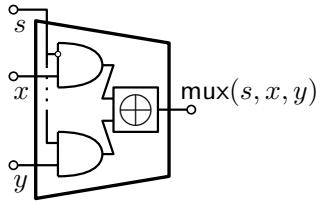
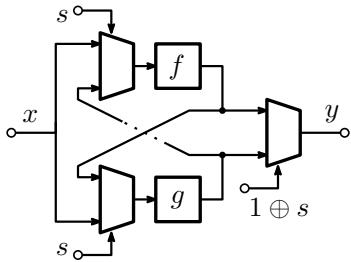
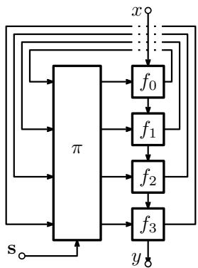

# Garbled RAM CS 507, Topics in Cryptography: Secure Computation

David Heath

Fall 2025

Last time, we saw an eficient, statistically-secure ORAM compiler: the Path ORAM construction. We also discussed how to plug ORAM into an interactive, secret-share-based MPC protocol. Recall that the main idea there was to (1) instantiate the ORAM client as a Boolean circuit and (2) instantiate the ORAM server by means of looking up data from a secret-shared memory. Thus, we can easily combine ORAM with, say, the GMW protocol to attain an interactive, secure protocol for programs that manipulate arrays/data structures.

One of our strategies throughout this course has been to first achieve a technique in the interactive setting, then to port the same technique to the constant-round garbled circuit setting. Can we do the same thing for RAM programs? Indeed, we can, and the resulting technique is called Garbled RAM, or GRAM [LO13]. Unfortunately, as we will see next, this translation of ORAM to the garbled circuit is not straightforward.

## The challenge of Garbled RAM

The main reason that Garbled RAM is significantly harder than secret-share-based RAM programs is that, unlike in the context of an interactive protocol, the garbler G is simply not available when the program is running.

Indeed, in the secret-shared setting, it is easy to emulate ORAM server behavior, because the parties emulate the ORAM server memory as a secret-shared array [A]. When the computation requests a memory address i, the parties simply read their respective share of the i-th index of the array, and the result is $[ A _ { i } ]$

In the garbled circuit setting, we can similarly consider garbling an array $\{ A \}$ . Moreover, it is not hard to arrange that while the garbled circuit is running, it can reveal an array index i to the evaluator (by means of the evaluator decrypting that index). Using Free XOR labels, the array slot $\left\{ A _ { i } \right\}$ is as follows:

$$
(K _ {i}, K _ {i} \oplus A _ {i} \Delta)
$$

Here, $K _ { i }$ is some random key known to the garbler, and $K _ { i } \oplus A _ { i } \Delta$ is the evaluator’s key. So it easy for the evaluator to fetch $K _ { i } \oplus A _ { i } \Delta$

Is not enough for only the evaluator to fetch her label; the garbler needs to hold the matching key $K _ { i }$ But the garbler does not know what i is! Indeed, i is an array index that was generated by the program execution; that is, it is some runtime value. So there is no way for the garbler to know which K to fetch. The reason this matters is that ultimately we wish to use the result of the array read $A _ { i }$ as input to some subsequent computation. So we wish to pass it as input to some Boolean gate. But the garbler does not know which key to encrypt that gate with!

We could arrange that the evaluator simply sends i to the garbler. If we did that, then the garbler could easily fetch $K _ { i }$ and use that key to garble the subsequent gate. But then this would incur a round of communication, and every time we accessed an array we would need to communicate. Thus, this would lead to an ineficient interactive protocol, eliminating the most important property of garbled circuits.

What we want from garbled RAM is a truly non-interactive mechanism by which the evaluator can indeed read array indices as specified by the program execution, without needing to talk to the garbler. To achieve this, we will need a diferent approach.

## RAM is a Cyclic Circuit

The key idea that enables garbled RAM is the following: a random-access array can be eficiently described as a circuit, if we slightly change the rules for what a circuit is [HKO23]. Indeed, recall earlier that we discussed that a Boolean circuit cannot eficiently express the interface of an array, and the best we could do was to implement linear scans.

However, if we reflect on a linear scan, we can see that what it does is implement a linear amount of hardware, almost all of which is completely useless. In particular, only a single memory slot of the array is actually read. What we want is some mechanism by which we can “re-use” those parts of our circuit that were not used before.

Namely, perhaps there is a way by which we can build a single, large circuit. The first time we access memory, we consume some parts of that circuit, but the other parts of the circuit are unused. The second time we access memory, we somehow use the same circuit again, consuming some of the parts of the circuit that were not yet used, and so on. If we could achieve something like this, we might have hope to construct a single circuit structure that supports, say, T accesses to an array, and whose size is ${ \tilde { O } } ( T )$ , where ${ \tilde { O } } ( \cdot )$ hides log T factors.

The reason this is not possible in a vanilla Boolean circuit is that there is no way to encode the idea of “returning to an unused part of the circuit”. Indeed, Boolean circuits are acylic graphs by definition. So all computation proceeds monotonically forward through the gates, and there is no way to go “backwards” to reclaim unused portions of the circuit.

So let us relax this requirement! We can define a sensible notion of a Boolean circuit with cycles. As a first step, we can simply remove the restriction that circuits be acyclic.

The way to make this change meaningful is to also slightly change the behavior of our gates. In particular, we will ensure that an AND gate is eager. Specifically, we will consider AND gates $z \gets x \cdot y$ where the first input x is treated specially. In particular, if the wire x is zero, then the AND gate will set z to zero immediately, perhaps before y is ever computed.

This combination of changes—allowing circuit cycles and making AND gates eager—turns out to significantly strengthen the circuit model. This is best seen by an example.

Suppose that we have two subcircuits f and $^ { g , }$ and suppose that f and g are complicated (i.e., have large numbers of gates) functions of their inputs. Suppose further that our circuit has (1) some input x and (2) a selection bit s; we wish to compute the following function:

$$
\operatorname{goal} (x) = \left\{ \begin{array}{l l} g (f (x)) & \text { if } s = 0 \\ f (g (x)) & \text { if } s = 1 \end{array} \right.
$$

Now, even with a standard acyclic circuit we can technically compute this function. The key ingredient is a multiplexer, which we can draw this way:

I.e., the mux computes the following:

$$
\operatorname{mux} (s, x, y) = \left\{ \begin{array}{l l} x & \text { if } s = 0 \\ y & \text { if } s = 1 \end{array} \right.
$$

Now, to implement goal, we can do the following:

• Feed x into both f and g to obtain both $f ( x )$ and $g ( x )$

• Use a multiplexer, based on s, to select one of these computations.

• Feed the multiplexed result into new copies of f and $g .$

• Use a multiplexer, based on s, to select one of these computations.

If we do this, we can indeed implement goal. However, this schematic is problematic because it includes two copies of $f$ and two of $^ { g , }$ i.e. four total expensive subcircuits. If we are a bit more careful, we can reduce this to only three expensive subcircuits. However, what we really want, and what seems intuitively possible, is that we want to include only a single copy of $f$ and a single copy of $g .$ After all, we know statically that goal does not “use” more than one call to $f \ ( \mathrm { r e s p . } \ g )$

But if our circuits are acyclic, it is not possible to achieve goal with only two subcircuits. The reason is simply one of topology: Our circuit must include a path from $f$ to $^ { g , }$ to handle the case where $s = 0$ Thus, if $f$ and $g$ are included only once each, then $f$ must be topologically before $g .$ . And our circuit must also include a path from $g$ to $f ,$ to handle the case where $s = 1$ . Thus, if $f$ and $g$ are included only once each, then $g$ must be topologically before $f .$ But both of the above cannot be simultaneously achieved in an acyclic circuit; one subcircuit must come before the other.

However, once we relax our circuit definition, we can meaningfully draw the following circuit:

The claim is that this circuit—which includes only one copy of $f$ and one of $g -$ —indeed implements goal. We can see this by just considering what happens when we set s to 0 (resp. to 1).

When $s = 0 ,$ we can simply trace execution. First, the top-left MUX eagerly reads and outputs $x ,$ due to the way that we stated AND gates now work. Thus, we can compute $f ( x )$ , which is then routed backwards into the bottom-left MUX. That MUX feeds $f ( x )$ into $^ { g , }$ and we get $g ( f ( x ) )$ ). If instead we set $s = 1$ initially the top-left MUX cannot execute, but the bottom-left one can. Again tracing execution, the circuit computes $f ( g ( x ) )$ ), exactly as desired.

Generalizing to RAM. Our example circuit can be generalized from running two subcircuits in some order $\mathrm { t o }$ running any polynomial number of subcircuits in some arbitrary order by means of a permutation/sorting network. As we have mentioned earlier in this course, sorting networks of size ${ \tilde { O } } ( n )$ are well-known. This arrangement starts to closely resemble random access memory when we additionally glue those subcircuits together sequentially:

Here, we glue n subcircuits $f _ { i }$ together sequentially, and we also feed them output of a permutation network, and allow them to feed input into that same network. Feeding wires from $f _ { i }$ into the network is analogous to writing to the array, and feeding output of the network into $f _ { i }$ is analogous to reading to that array.

Indeed, there are only two gaps between the above picture and full-fledged RAM:

• The above network is a permutation, so each “memory slot” can only be read once. Full RAM, of course, allows arbitrary numbers of reads to each memory slot. It is not hard to compile RAM to this style of read-once memory. Indeed, we have already essentially seen the solution in our discussion of ORAM: write the read value to a new location, and keep track of where it lives in a recursively instantiated position map.

• In the above network, all routing decisions are made by some global string s, whereas in true RAM, each subcircuit $f _ { i }$ should decide locally which memory slot it will read. This is achieved by using a so-called “self-routing” permutation network. See [HKO23] for more details.

## Cyclic Circuits can be Garbled

With this perspective on RAM as a circuit, it is actually not hard to get some version of Garbled RAM. We just need to show how to garble the gates in our model.

But our gates are just standard Boolean circuits, except that AND gates now need this “eager” behavior on their first input. Actually, we have already seen how to achieve this! If we reflect on the half-gates optimization we saw earlier in this course, we can observe that a half-AND gate is precisely what is needed to achieve an AND gate.

Indeed, consider an eager AND gate $z  x \cdot y .$ Recall that in half-gates, the garbler proceeds as follows:

$$
\begin{array}{l} k _ {z} ^ {0} \leftarrow H (k _ {x} ^ {0}, \mathsf {g i d}) \\ k _ {z} ^ {1} \leftarrow k _ {z} ^ {0} \oplus \Delta \\ r \leftarrow H (k _ {x} ^ {1}, \mathsf {g i d}) \oplus k _ {y} ^ {0} \oplus k _ {z} ^ {0} \end{array}
$$

Notice that when the garbler defines the output wire keys $k _ { z } ^ { 0 } , k _ { z } ^ { 1 }$ , it is not necessary to know $k _ { y } ^ { 0 } !$ Similarly, when the evaluator evaluates this circuit, if $x = 0$ , then she can immediately use $k _ { x } ^ { 0 }$ to decrypt the gate output, without knowing a key on the y wire. One crucial detail here is that we must tell the evaluator what x is for her to behave properly.

Thus, the garbling procedure for a cyclic circuit is to simply (1) use Free XOR to encode wire values and (2) garble eager AND gates using the half-AND technique, leaking the first input of each AND gate to the evaluator.

Roughly, the evaluator just evaluates gates in any order that makes sense at runtime, and hence she can, for example, indeed evaluate our example circuits above. Note that the evaluator learns the order in which gates evaluate.

## Cyclic Circuits can be made Oblivious

As written above, our GC evaluator will learn the first input wire value on each AND gate, and hence the order in which all gates evaluate. This is potentially problematic for privacy.

However, recall that when we discussed the half-gates technique, we were able to remove this leakage by means of combining two half AND gates to make a whole one. Indeed, while we revealed both first inputs to the underlying half gates, those first inputs were one-time-pad masked, and so gave no useful information to the evaluator.

In line with this, we can define a notion of an oblivious cyclic circuit, where all of the AND gate’s socalled control wires can be simulated. In the case of RAM, the key observation is that the order in which the evaluator reads the permutation can be made oblivious by using an oblivious RAM compiler to obfuscate that access pattern.

## Wrapping Up

We have now seen the main ideas underlying GRAM:

• Construct RAM as a circuit.

• Make that circuit “oblivious” by means of an ORAM compiler.

• Garble that oblivious circuit in a relatively obvious way.

These techniques combined yield a GC with total cost O˜(T ) that implements a T -step RAM program.

## References

[HKO23] David Heath, Vladimir Kolesnikov, and Rafail Ostrovsky. Tri-state circuits - A circuit model that captures RAM. In Helena Handschuh and Anna Lysyanskaya, editors, CRYPTO 2023, Part IV, volume 14084 of LNCS, pages 128–160. Springer, Cham, August 2023.

[LO13] Steve Lu and Rafail Ostrovsky. How to garble RAM programs. In Thomas Johansson and Phong Q. Nguyen, editors, EUROCRYPT 2013, volume 7881 of LNCS, pages 719–734. Springer, Berlin, Heidelberg, May 2013.