New Directions in Garbled Circuits

A Dissertation Presented to

The Academic Faculty

by

David A. Heath

In Partial Fulfillment

of the Requirements for the Degree Doctor of Philosophy in Computer Science School of Computer Science

Georgia Institute of Technology

May, 2022

Copyright © David Anthony Heath 2022

## New Directions in Garbled Circuits

Approved by:

Dr. Vladimir Kolesnikov

Dr. Daniel Genkin

School of Cybersecurity and Privacy

School of Cybersecurity and Privacy

Georgia Institute of Technology

Georgia Institute of Technology

Dr. Mustaque Ahamad

Dr. Rafail Ostrosky

School of Cybersecurity and Privacy

School of Engineering

Georgia Institute of Technology

University of California, Los Angeles

Dr. Alexandra Boldyreva

School of Cybersecurity and Privacy

Date Approved April 22, 2022

Georgia Institute of Technology

## ACKNOWLEDGMENTS

Earning a Ph.D. is such a rewarding process. At the same time, it is dificult – far more dificult than I realized at the start. There were many moments over the past years where I felt like quitting, and I would never have gotten this far without support from my colleagues and my loved ones. I am so grateful for the people that helped to support me along this journey.

I’d like to thank my beautiful wife, Krista. Krista has supported and encouraged me through my entire Ph.D. process. She remained patient even when I spent days on end absorbed in paper writing. She has shared in all of the highs and lows of the past years. Most importantly, life with her is fun and happy. I would never have succeeded without Krista.

I’d like to thank my advisor, Vlad Kolesnikov. Vlad is not only the exemplar of a supportive advisor, not only a patient and hard-working colleague, but also a cherished friend. Early in my degree, my former advisor left academia for industry. When this happened, I nearly gave up. Without Vlad’s many words of encouragement, I would have moved on years ago and missed the amazing opportunities that came since. Vlad’s open enthusiasm about MPC sparked my own interest in the subject.

I’d like to thank my parents, John and Juliet, and my brothers, Chris and Andrew. As the youngest in my family, I was lucky to grow up with four role models. I am luckier still that my family has supported me throughout my degree. I am sincerely grateful that they understand my commitment, and that they even try to understand some of the technical detail of my work.

I’d like to thank Rafi Ostrovsky, who is a long time collaborator, and who has acted as a valued mentor over the past few years. I’d also like to thank the other members of my Ph.D. committee, Mustaque Ahamad, Sasha Boldyreva, and Daniel Genkin. Finally, I’d like to thank the faculty, students, and researchers who have supported me or have collaborated with me. To Dan Boneh, David Darais, Ryan Estes, Abida Haque, Bill Harris, Mike Hicks, Yuval Ishai, Steve Lu, Stan Peceny, Akash Shah, Elaine Shi, Ian Sweet, Caleb Voss, Yibin Yang, and Qi Zhou: thank you!

## TABLE OF CONTENTS

ACKNOWLEDGMENTS iii   
LIST OF FIGURES vii   
SUMMARY xi   
NOMENCLATURE xiii   
1 INTRODUCTION AND BACKGROUND 1   
1.1 A Basic Garbled Circuit Construction . . . . . . . . . . . . . . . . . . . . . . . . . . . . . . . . . . . . . . . . . . . . . . . . . . . . . . . . . . . . . . . . . . . . . . . . . . . . . . . . 4   
1.2 Garbled Circuit Cost. . . . . . . . . . . . . . . . . . . . . . . . . . . . . . . . . . . . . . . . . . . . . . . . . . . 11   
1.3 Free XOR, Half-Gates, and Garbling Notation. 15   
1.4 Our Approach to Proving Security. 24   
2 ONE HOT GARBLING 29   
2.1 Introduction. 30   
2.2 Notation. 31   
2.3 Overview. 32   
2.4 Approach. 33   
2.5 Applications and Performance. 39   
2.6 Simulator. 52   
3 STACKED GARBLING 57   
3.1 Introduction. 58   
3.2 Preliminaries. 59   
3.3 Notation. 63   
3.4 Overview. 64   
3.5 Improving Computation. 71

3.6 Performance ..... 85
3.7 Stackability ..... 89
3.8 Simulator ..... 90
4 GARBLED RAM 93
4.1 Introduction ..... 94
4.2 Overview ..... 96
4.3 Prior GRAMs ..... 109
4.4 Preliminaries ..... 110
4.5 Approach ..... 110
4.6 Performance ..... 124
4.7 Simulators ..... 132
5 A LANGUAGE FOR GARBLED PROGRAMS 139
5.1 Syntax ..... 139
5.2 Semantics ..... 143
5.3 Valid Programs ..... 145
5.4 Garbled Evaluation ..... 147
5.5 Simulator ..... 151
5.6 Garbling Scheme ..... 154
REFERENCES 163

## LIST OF FIGURES

1.1 Garbled Evaluation ..... 5
1.2 A Garbled Gate ..... 10
1.3 Free XOR ..... 17
1.4 Half AND ..... 22
1.5 Full AND ..... 23
1.6 Half AND Simulator ..... 26
2.1 One-Hot Improvements ..... 31
2.2 One-Hot Helper Procedure ..... 34
2.3 The One-Hot Outer Product ..... 35
2.4 Small Domain Outer Product ..... 40
2.5 Small Domain Outer Product Performance ..... 41
2.6 General Outer Product ..... 42
2.7 General Outer Product Performance ..... 43
2.8 Binary Matrix Multiplication Performance ..... 44
2.9 Binary Field Inverse ..... 47
2.10 Modular Reduction ..... 49
2.11 Exponentiation ..... 51
2.12 One-Hot Helper Simulator ..... 53
2.13 One-Hot Outer Product Simulator ..... 54
3.1 Standard Conditional Branching ..... 58
3.2 Branch Garbling ..... 62
3.3 Branch Evaluation ..... 63
3.4 Conditionally Composed Circuits ..... 66
3.5 Demultiplexer ..... 68

3.6 Multiplexer ..... 69
3.7 Stacked Garbling ..... 70
3.8 Tree of Branches Example ..... 73
3.9 The Sorting Hat ..... 75
3.10 Garbling Subtrees ..... 80
3.11 Evaluating Subtrees ..... 81
3.12 Computing Garbage Outputs ..... 83
3.13 LogStack ..... 84
3.14 LogStack's Performance ..... 86
3.15 LogStack's Performance against Stacked Garbling ..... 87
4.1 Lazy Permutation Network Inner Node ..... 97
4.2 Permuting RAM Elements ..... 110
4.3 Efficient Scalar Multiplication ..... 111
4.4 Scaling by G's Chosen Bit ..... 112
4.5 Garbled Stack Interface ..... 113
4.6 Inner Node ..... 114
4.7 Leaf Node ..... 115
4.8 Lazy Permutation Network Initialization ..... 116
4.9 Routing the Lazy Permutation Network ..... 117
4.10 GRAM Initialization ..... 121
4.11 GRAM Access ..... 122
4.12 GRAM Flush ..... 123
4.13 Scheduling the GRAM ..... 124
4.14 Shuffling the GRAM ..... 125
4.15 Hiding the Real Index ..... 126
4.16 GRAM Performance ..... 127
5.1 Syntax ..... 140
5.2 AND Module ..... 143
5.3 Semantics ..... 144
5.4 Garbled Evaluation ..... 148
5.5 Expression-Compatible Stacked Garbling ..... 149

5.6 Garbling Scheme Decoding 155  
5.7 Choosing the Decoding String 156

## SUMMARY

The Garbled Circuit (GC) technique is foundational in secure multiparty computation (MPC). GC allows parties to jointly and securely compute functions of their private inputs while revealing nothing but the output. GC is unique in that it achieves secure computation while using only a constant number of rounds of communication. This property makes GC a distinctly flexible and powerful technology. When Andrew Yao originally explained GC, he described a way to encrypt a Boolean circuit by representing each gate as four encryptions; these encryptions together encode the logic of the gate by hiding keys used as input to future gates. One party – the circuit generator – methodically encrypts each gate, then sends the encryptions to the second party – the circuit evaluator. The evaluator is given input keys and then propagates keys gate-by-gate through the circuit and eventually obtains output keys. Despite the fact that the evaluator correctly computes the circuit, she remains oblivious to the cleartext value on each circuit wire. Although powerful, Yao’s technique is expensive: each gate uses four ciphertexts, and complicated functions can have billions of gates or more. Thus, researchers sough – and still seek – cheaper gates. Significant efort has been put into this line, to modest ends. Today, XOR gates are communication-free, but each AND gate still requires 1.5 ciphertexts. From a certain perspective, the focus on fan-in two gates is ad hoc; there is no rule that states fan-in two gates are the only – or even the best – fit for GC. Indeed, one can imagine that there might exist other computations that are naturally encoded such that cost is greatly diminished. This dissertation focuses on this relatively unexplored dimension of GC. We present three classes of improved GC computations that go beyond fan-in two Boolean gates: – One-hot garbling [HK21a]. This technique provides new GC gates that eficiently compute over short vectors of bits, as opposed to only two bits. One-hot garbling improves the GC cost of many important primitives, such as integer multiplication and matrix multiplication.

– Stacked garbling [HK20a, HK21b]. Traditionally, it was assumed that GC necessarily incurs communication cost proportional to the entire function description. My work on ‘stacked garbling’ shows that this assumption is wrong. Stacked garbling improves the communication consumption of functions with conditional behavior: we only need suficient communication to represent the single longest execution path of the function, not the function in its entirety.

– Garbled RAM [HKO21]. Many computations are best described as RAM programs, not as circuits, and the reduction from RAM programs to circuits is expensive. Thus, it is natural to consider adding a sublinear cost RAM to GC. Techniques that achieve this are called Garbled RAMs (GRAMs). Prior to our work, GRAMs were known, but were prohibitively expensive. This dissertation presents new GC primitives that allow for a dramatically improved GRAM construction.

This dissertation presents these three advances in technical detail. The advances are carefully designed such that they can be used separately or in composition to greatly accelerate GC-based secure computation.

Together, these advances improve GC to the point that the cumulative change is qualitative. There are many computations that were previously infeasibly expensive and that are now well within scope. It is now realistic to consider, for example, a GC-embedded processor that conditionally executes complex instructions and that repeatedly accesses a large main memory. Thus, the techniques in this dissertation lay the groundwork for shifting away from the circuit model of computation and towards the more powerful RAM model of computation. This shift enables GC to handle new classes of complex secure computations, and hence enables a variety of interesting privacy-preserving and authenticated applications.

# NOMENCLATURE

– κ denotes the computational security parameter and can be understood as the length of encryption keys (e.g. 128).

– G is the GC generator. We refer to G by he/him.

– E is the GC evaluator. We refer to E by she/her.

$- \ x \triangleq y$ denotes that x is equal to y by definition.

$- \ x \overset { c } { = } y$ denotes that x is computationally indistinguishable from y.

– x ← y denotes that variable x is assigned to value $y ; x$ can later be reassigned.

– We work with vectors and matrices:

• If v is a vector, then $v _ { i }$ denotes the ith entry in v. If m is a matrix, then $m _ { i , j }$ , denotes the entry at the ith row and jth column. We use zero-based indexing.

• m<sup>|</sup> denotes the transpose of m.

$x \otimes y$ denotes the outer product of vectors x and y. The outer product can be defined as follows: x $\otimes y \triangleq x \cdot y ^ { \intercal }$

$\textsuperscript { - } \left. x , y \right.$ is a distributed pair (Definition 1.2) where G holds x and E holds $y .$

– {{x}} denotes a garbling of x (Definition 1.3).

– x denotes a sharing of x (Definition 1.4).

– We frequently deal with values that are known to a particular party. We write $x ^ { G }$ $( \exp . \ x ^ { E } )$ to denote that x is a value known to G (resp. to E) in cleartext. $\mathrm { E . g . }$ $\{ \{ x ^ { E } \} \}$ indicates a garbling of x where E knows x.

– lsb denotes the function that takes the least significant bit of a bitstring.

– Let D be a distribution. We write $x \in _ { \mathbb { S } } { \mathcal { D } }$ to denote that x is drawn from D.

– If A is a set (not an explicit distribution), then we write $x \in { \mathfrak { s } }$ A to denote that x is drawn uniformly from A.

– We sometimes work with explicit sources of randomness. We write $a \in _ { \mathfrak { S } { \cal S } } \mathcal { D }$ to indicate that we pseudorandomly draw a value from D using S as a PRG seed.

– [n] denotes the sequence of natural numbers 0, $1 , . . . , n - 1$

– x | y denotes the concatenation of strings x and y.

– We refer to the GC encryptions needed to evaluate as material.

– H is a circular correlation robust hash function (Definition 1.1). In mentioned implementations, we instantiate H AES [BHKR13, GKWY20].

This dissertation presents modular procedures that together instantiate a garbling scheme (see Chapter 5). That is, our constructions are simple procedures, not protocols. These procedures can be plugged into GC protocols. However, it is often easier to think of G and E as participating in a semi-honest protocol. Thus, we often write that the parties “send messages”. We make two notes about this phrasing:

– We will never write that E sends a message to G: all information flows from G to E. In this way, we preserve the constant round nature of GC.

– ‘G sends x to E’ formally means that (1) our garbling procedure appends x to the material and (2) our evaluation procedure extracts x from the material.

## Chapter 1

## INTRODUCTION AND BACKGROUND

Shared information is a key component of transactions of all kinds, so we are incentivized to share information. At the same time, data is valuable and often sensitive, so we are incentivized to control and protect information. There seems to be an inherent tension between protecting our data and using it.

Amazingly, there exist technological solutions that circumvent this tension: we can protect our information without surrendering the benefits of sharing it. Secure multiparty computation (or MPC) is a subfield of cryptography that, roughly speaking, allows parties to compute programs under encryption.

Suppose that a number of mutually untrusting parties wish to join their private data as input to some interesting computation. Suppose further that the parties have access to a trusted and incorruptible third party. Incorruptible parties do not exist in the real world, but if they did, the parties could simply send their data to this third party, the third party could run the interesting computation, and then the third party could send the answer back. Notice that in this interaction, the private information of one party is protected from the others: the untrusted parties never see this one party’s input, they only see the output sent by the trusted party. MPC shows that, while incorruptible parties do not exist, the parties can jointly emulate an incorruptible party. Thus, the parties can indeed run their interesting computation while preserving privacy: they simply instantiate a trusted party via cryptography.

There exist several basic techniques for achieving MPC with varying tradeofs. This dissertation focuses on and improves the Garbled Circuit (GC) technique [Yao86], which is one of the most basic and one of the most interesting MPC techniques.

## GC’s useful properties

Roughly speaking, GC allows two parties to securely evaluate a program in two steps. First, one party encrypts, or garbles, the program, and sends it to the other party, along with encrypted inputs to the program. Second, the other party runs this garbled program under encryption, correctly computing the program output without learning any intermediate values.

This approach to MPC is powerful for a number of reasons:

– Constant round. GC allows us to securely run arbitrary programs via a protocol that uses only a constant number of rounds. This makes GC a great fit for settings where latency is high, such as when the parties are geographically far apart.

– Preprocessing friendly. GC allows us to ofload most of the work to a preprocessing phase: the first party can garble and send before input data is known. This makes the technique highly flexible. For instance, two parties can accumulate a large number of garbled programs, each ready to handle a transaction. Once an input becomes available, the second party uses one of the garbled programs to compute quickly and easily.

– Computationally cheap. GC uses encryption to garble and run the program. Modern GC relies primarily on symmetric key encryption and can be implemented using AES. Today, commodity hardware features accelerated AES instructions, allowing for concretely performant GC implementations.

Relatively simple. Basic GC is reasonably simple to explain, understand, and implement.

GC is simple, fast, and flexible, and it serves as the backbone of a significant portion of MPC. Indeed, GC has become so central to the field that many cryptographers now consider GC a basic cryptographic primitive from which to build more sophisticated techniques [BHR12].

## The problem with GC and the contribution of this dissertation

The problem with GC is in the technique’s name: GC allows us to run arbitrary programs, but only if that program is expressed as a circuit <sup>1</sup>. In some sense, this is fine, since we can compile arbitrary bounded programs to Boolean circuits.

The problem is eficiency. In GC, we pay cost both in the form of communication (i.e., bandwidth consumption) and computation (primarily from symmetric key primi tives). Both costs are roughly proportional to the size of the circuit we wish to compute. Unfortunately, compiling an arbitrary program often results in a staggeringly large cir cuit, which then incurs impractical cost. It is not feasible to use circuits to handle of-the-shelf programs. Despite this, GC, and most of MPC, is deeply rooted in the circuit model of computation.

There is no fundamental reason that we need represent programs as circuits. The reasons that the community has so far limited itself to circuits are inessential:

– First, circuits are convenient for theory.

– Second, and most importantly, we know how to securely handle circuits.

A GC technique that eficiently handles RAM programs, not circuits, would be interesting, powerful, and useful. There is no rule that states such techniques are not possible; indeed, they are possible, and we will show you how they can be achieved.

This dissertation presents new techniques that allow GC to escape the tradition of Boolean circuits. We show that there are a variety of interesting computations that can be handled directly inside GC, without compiling to a circuit. By handling these computations directly, we significantly reduce cost.

We present three new directions in Garbled Circuits. Each highlights GC’s previously unknown ability to directly handle powerful and useful kinds of computations:

– One-hot garbling (Chapter 2) augments GC with the ability to more eficiently handle vector operations. We asymptotically improve the cost of vector operations like outer products and matrix multiplications, and we also improve important primitives like integer multiplication and field arithmetic.

– Stacked garbling (Chapter 3) augments GC with the ability to eficiently handle conditional branching. One of the major deficiencies of the circuit model of computation is that every single gate is evaluated. Contrast this with high level programs, where we use control flow to execute only small portions of the possible paths through our program. Stacked garbling brings GC closer to this level of expressivity. In stacked garbling, the parties use communication suficient for only one control flow path, not for all of them.

– Garbled RAM (Chapter 4) augments GC with the ability to eficiently handle random access arrays. The inability to eficiently handle arrays is arguably the most significant shortcoming of the circuit model of computation. This shortcoming is a barrier to wide adoption of GC because it is dificult to handle end user programs, which often use arrays, data structures, and pointers. Garbled RAM removes this deficiency. Garbled RAM techniques were known prior to the techniques presented here, but all were extremely expensive. The techniques in this dissertation improve Garbled RAM by three to four orders of magnitude.

Each of these new directions is unified by a single vision: escape the circuit paradigm.

In Chapter 5, we package these three new directions into a small programming language that allows us to compose and interleave our improvements. Then, we plug this programming lanuage into a garbling scheme [BHR12] and prove it secure. This scheme can be plugged into cryptographic protocols that use GC as a blackbox, enabling the new directions to be used across the field. The sum contribution is a qualitative step forward in MPC. No longer is GC limited to simple circuits; instead, it is now empowered to handle expressive and interesting programs.

## 1.1 A Basic Garbled Circuit Construction

We introduce GC in detail via a simple construction. The construction we give here is not novel. It is intended only as a formal introduction to GC. The remainder of this dissertation is concerned with meaningfully improving GC; this simple construction can be viewed as a starting comparison point.

Garbled Circuit (GC) allows two parties to securely evaluate an arbitrary function f over their private inputs. Given input x from one party and input y from the other, the parties compute and learn $f ( x , y )$ , but nothing more. In particular, the input of one party is protected from the other; for example, the first party learns nothing about y except what is implied by $f ( x , y )$

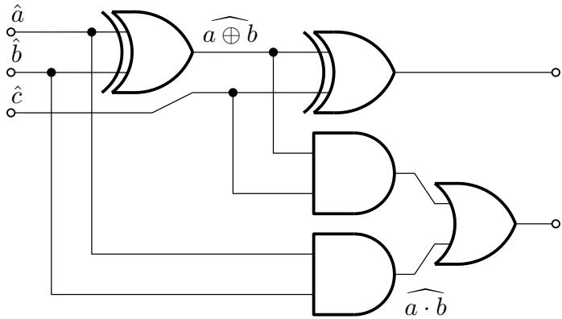  
Figure 1.1: Basic GC allows us to securely compute arbitrary functions expressed as Boolean circuits. The technique starts from encoded input wire values $\mathrm { ( e . g . , ~ } \hat { a }$ is an encoding of the cleartext value a) and at each gate propagates encoded inputs to encoded outputs. We depict a partially evaluated circuit where one XOR and one AND gate have been run. The key property of GC is that each encoding hides the encoded value, and hence seeing the encoding reveals nothing about cleartext values.

Roughly speaking, the parties compute f under encryption. Namely, the inputs and outputs of f will not be cleartext, but rather will be encoded. The encodings hide the cleartext values from the parties, which preserves privacy.

The crucial challenge is that of propagating encodings through f. We must somehow transform encoded inputs into encoded outputs. Basic GC addresses this challenge by representing f as a circuit composed from many small gates. If we can propagate encodings through a single gate, then we can securely compute an entire circuit simply by evaluating gates one-by-one in a topological order (see Figure 1.1). Because each gate implements simple logic, it is relatively cheap to propagate encodings through each gate, as we will see shortly. In this manner, given encoded input to the overall function, we can correctly compute output encodings while hiding all intermediate cleartext values. Later, the parties can jointly decrypt the encoded output as part of a cryptographic protocol. This is how GC achieves secure computation.

In more detail, the GC technique assigns to each party a role. One party will play the GC generator, G. G’s task is to set up cryptographic strings that will allow the GC to propagate encodings through gates. The second party will play the GC evaluator,

E. E’s task is to actually evaluate the circuit: she is given encoded inputs and $G \mathrm { { ^ { \circ } s } }$ strings. At each gate, E uses gate input encodings and some of G’s strings to compute gate output encodings. By repeating this process for each gate, E eventually obtains encodings of the circuit output.

## GC Material

We refer to G’s cryptographic strings as material. In traditional GC, the material is simple. Each Boolean gate requires some amount of material, and, at runtime, E starts at the beginning of the material and uses it from left to right.

In this dissertation we break this tradition. Our techniques allow the parties to operate on material and to use material in dynamic order. Operating on material adds a new dimension to GC procedure design. This is one of the key sources of our improvement.

## GC labels

To formalize a GC scheme, we must first choose the format for our encodings. Our basic scheme will elect the following encoding: Let κ denote the computational security parameter (e.g., 128). For each circuit wire w, G uniformly samples two security-parameter length strings $A _ { 0 } , A _ { 1 } \in _ { \mathfrak { s } } \{ 0 , 1 \} ^ { \kappa }$ . As an added step, $G$ conditionally flips the least significant bit of $A _ { 1 }$ to ensure that the least significant bits of the two strings difer:

$$
l s b (A _ {0}) \neq l s b (A _ {1})
$$

We will see why this is useful later.

We refer to $A _ { 0 } , A _ { 1 }$ as labels. Label $A _ { 0 }$ is an encoding for the case where wire w holds $0 ;$ label $A _ { 1 }$ is for the case where wire w holds 1.

Suppose that at $\mathrm { r u n t i m e ^ { 2 } }$ wire $w$ should encode the value a. Our key invariant is that E will hold the specific label $A _ { a }$ . Crucially, E will never learn $A _ { \bar { a } }$ . Notice that because both $A _ { 0 }$ and $A _ { 1 }$ are uniform strings, E cannot distinguish one of these labels from the other. Hence, holding a particular label $A _ { a }$ does not reveal to E the value a. GC propagates encodings through individual Boolean gates. Thus, we must convert

## 1.1. A Basic Garbled Circuit Construction

a gate’s input labels into an output label. Consider an AND gate with input labels $A _ { 0 } / A _ { 1 }$ and $B _ { 0 } / B _ { 1 }$ and with output labels $C _ { 0 } / C _ { 1 }$ . At runtime, E will enter the gate holding labels $A _ { a }$ and $B _ { b } ,$ , and she must compute $C _ { a b }$ . The crucial observation is that there are only four possible scenarios. Hence, the gate can be described by a small table:

<table><tr><td colspan="2">input</td><td>output</td></tr><tr><td> $A_0$ </td><td> $B_0$ </td><td> $C_0$ </td></tr><tr><td> $A_0$ </td><td> $B_1$ </td><td> $C_0$ </td></tr><tr><td> $A_1$ </td><td> $B_0$ </td><td> $C_0$ </td></tr><tr><td> $A_1$ </td><td> $B_1$ </td><td> $C_1$ </td></tr></table>

We can implement each row of this table with an encryption: for each row, we encrypt the output label according to the corresponding input labels. Let F be a pseudorandom function family. Let H be a function defined as follows:

$$
H (A) \triangleq F _ {A} (n)
$$

where n is a nonce agreed upon by G and E

G could send to E the following four encryptions, sometimes referred to as garbled rows (we revise these rows shortly):

$$
\begin{array}{l} R _ {0, 0} \triangleq H (A _ {0}) \oplus H (B _ {0}) \oplus C _ {0} \\ R _ {0, 1} \triangleq H (A _ {0}) \oplus H (B _ {1}) \oplus C _ {0} \\ R _ {1, 0} \triangleq H (A _ {1}) \oplus H (B _ {0}) \oplus C _ {0} \\ R _ {1, 1} \triangleq H (A _ {1}) \oplus H (B _ {1}) \oplus C _ {1} \end{array}
$$

The idea here is that if E holds, say, $A _ { 0 }$ and $B _ { 1 }$ , and if she somehow knew which row to decrypt (addressed shortly), then she could decrypt the second row and recover $C _ { 0 }$ . In this same scenario, E knows nothing about $A _ { 1 }$ or $B _ { 0 }$ , so she cannot compute $H ( A _ { 1 } ) , H ( B _ { 0 } )$ and cannot decrypt the other three rows. Since $E$ views only $C _ { 0 }$ and since both $C _ { 0 }$ and $C _ { 1 }$ are uniformly random, E cannot deduce the cleartext value by observing $C _ { 0 }$ . Nevertheless, E has correctly computed the gate’s encoded output.

## Point-and-permute

The above encrypted table is not a finished construction. There are two important questions that remain to be answered:

1. How does E know which row to decrypt?

## 2. If E does know which row to decrypt, doesn’t this reveal a and b?

The technique used to answer these questions is called point-and-permute [BMR90a]. Recall that for each pair of labels $L _ { 0 } , L _ { 1 }$ , we ensured that $l s b ( L _ { 0 } ) \neq l s b ( L _ { 1 } )$ . Note that $l s b ( L _ { 0 } )$ is unrelated to the encoded value: $l s b ( L _ { 0 } )$ is uniformly random. Point-andpermute instructs us to permute our garbled rows according to the least significant bits. Point-and-permute technique addresses both above questions:

1. E uses the least significant bits of $A _ { a }$ and $B _ { b }$ as pointers to choose the row to decrypt.

2. Because the rows are permuted, the identity of the decrypted row is uniform and independent of a and $b ,$ and hence nothing is revealed to $E$

More formally, let $\alpha \triangleq l s b ( A _ { 0 } )$ and let $\beta \triangleq l s b ( B _ { 0 } )$ . We modify our scheme such that G constructs garbled rows as follows:

$$
\begin{array}{l} R _ {0, 0} \triangleq H (A _ {\alpha}) \oplus H (B _ {\beta}) \oplus C _ {\alpha \beta} \\ R _ {0, 1} \triangleq H (A _ {\alpha}) \oplus H (B _ {\bar {\beta}}) \oplus C _ {\alpha \bar {\beta}} \\ R _ {1, 0} \triangleq H (A _ {\bar {\alpha}}) \oplus H (B _ {\beta}) \oplus C _ {\bar {\alpha} \beta} \\ R _ {1, 1} \triangleq H (A _ {\bar {\alpha}}) \oplus H (B _ {\bar {\beta}}) \oplus C _ {\bar {\alpha} \bar {\beta}} \end{array}
$$

We stress that these more complex expressions are the same garbled rows as before; the rows have simply been permuted according to α and $\beta$

Note that for each $i , j \in \{ 0 , 1 \}$

$$
R _ {i, j} = H (A _ {\alpha \oplus i}) \oplus H (B _ {\beta \oplus j}) \oplus C _ {(\alpha \oplus i) (\beta \oplus j)}\tag{1.1}
$$

This fact is useful for arguing correctness.

Recall that at runtime E holds $A _ { a }$ and $B _ { b }$ . She computes ${ l s b ( A _ { a } ) }$ . Note the following equality:

$$
\begin{array}{l} l s b (A _ {a}) \\ = \left\{ \begin{array}{l l} l s b (A _ {0}) & \text { if } a = 0 \\ l s b (A _ {1}) & \text { otherwise } \end{array} \right. \\ = \left\{ \begin{array}{l l} \alpha & \text { if } a = 0 \\ \alpha \oplus 1 & \text { otherwise } \end{array} \right. \\ = \left\{ \begin{array}{l l} \alpha \oplus a & \text { if } a = 0 \\ \alpha \oplus a & \text { otherwise } \end{array} \right. \\ = \alpha \oplus a \end{array}
$$

case analysis

definition α

Similarly, E computes $l s b ( B _ { b } ) = \beta \oplus b$ . Next, E computes $H ( A _ { a } )$ , computes $H ( B _ { b } )$ 2 reads row $R _ { \alpha \oplus a , \beta \oplus b }$ , and decrypts the correct gate output label as follows:

$$
\begin{array}{l} H (A _ {a}) \oplus H (B _ {b}) \oplus R _ {\alpha \oplus a, \beta \oplus b} \\ = H (A _ {a}) \oplus H (B _ {b}) \oplus H (A _ {\alpha \oplus (\alpha \oplus a)}) \oplus H (B _ {\beta \oplus (\beta \oplus b)}) \oplus C _ {(\alpha \oplus (\alpha \oplus a)) (\beta \oplus (\beta \oplus b))} \quad \text { Equation   (1.1) } \\ = H (A _ {a}) \oplus H (B _ {b}) \oplus H (A _ {a}) \oplus H (B _ {b}) \oplus C _ {a b} \\ = C _ {a b} \end{array}
$$

By computing the gate in this manner, E obtains the proper AND gate output label $C _ { a b }$ , but remains oblivious as to the value of a and b.

## Arbitrary gates and a template GC construction

So far, we have presented a GC AND gate. Figure 1.2 generalizes our approach to arbitrary Boolean gates with two inputs and one output.

As an aside, note that we could generalize Figure 1.2 further to handle arbitrary functions with n bits of input and m bits of output. This is possible because Figure 1.2 is agnostic to the gate function that it implements: it acts directly on the gate’s truth table. We could easily generalize to handle gates with larger truth tables. This generalization

<div class="mineru-algorithm" style="white-space: pre-wrap; font-family:monospace;">
INPUT:
- Parties agree on a two-input, one-output Boolean function $f: \{0,1\}^2 \to \{0,1\}$.
- $G$ inputs two possible labels for each of the two inputs $A_0, A_1, B_0, B_1 \in \{0,1\}^\kappa$ such that $lsb(A_0) \neq lsb(A_1)$ and $lsb(B_0) \neq lsb(B_1)$.
- $E$ inputs $A_a$ and $B_b$ where $a, b \in \{0,1\}$ denote the cleartext inputs to the function.

OUTPUT:
- Let $C_0, C_1 \in \{0,1\}^\kappa$ be two strings (defined by this procedure) such that $lsb(C_0) \neq lsb(C_1)$.
- $G$ outputs $C_0$ and $C_1$.
- $E$ outputs $C_{f(a,b)}$. I.e., she outputs a label that encodes output of the function.

PROCEDURE:
- $G$ uniformly samples $C_0, C_1 \in \$\{0,1\}^\kappa$. He optionally flips the least significant bit of $C_1$ to ensure it is different from that of $C_0$.
- Let $\alpha \triangleq lsb(A_0)$. Let $\beta \triangleq lsb(B_0)$.
- $G$ computes and sends to $E$ the following four ciphertexts:
$R_{0,0} \triangleq H(A_\alpha) \oplus H(B_\beta) \oplus C_{f(\alpha,\beta)} \quad R_{0,1} \triangleq H(A_\alpha) \oplus H(B_\bar{\beta}) \oplus C_{f(\alpha,\bar{\beta})}$ $R_{1,0} \triangleq H(A_\bar{\alpha}) \oplus H(B_\beta) \oplus C_{f(\bar{\alpha},\beta)} \quad R_{1,1} \triangleq H(A_\bar{\alpha}) \oplus H(B_\bar{\beta}) \oplus C_{f(\bar{\alpha},\bar{\beta})}$

Note, $R_{i,j} = H(A_{\alpha\oplus i}) \oplus H(B_{\beta\oplus j}) \oplus C_{f(\alpha\oplus i,\beta\oplus j)}$.

- $E$ computes $lsb(A_a) = \alpha \oplus a$. Similarly, $E$ computes $lsb(B_b) = \beta \oplus b$.
- Consider ciphertext $R_{\alpha\oplus a,\beta\oplus b}$:
$R_{\alpha\oplus a,\beta\oplus b} = H(A_{\alpha\oplus (\alpha\oplus a)}) \oplus H(B_{\beta\oplus (\beta\oplus b)}) \oplus C_{f(\alpha\oplus (\alpha\oplus a),\beta\oplus (\beta\oplus b))} = H(A_a) \oplus H(B_b) \oplus C_{f(a,b)}$
- $G$ outputs $C_0$ and $C_1$. $E$ computes and outputs:
$R_{\alpha\oplus a,\beta\oplus b} \oplus H(A_a) \oplus H(B_b) = C_{f(a,b)}$
</div>

Figure 1.2: A simple four-ciphertext garbled gate. This garbled gate maps two input labels to a single output label. To correctly map input labels to output labels, the gate includes four ciphertexts, one per row of the gate’s truth table. E can decrypt only one ciphertext, and the ciphertext she decrypts contains a label that encodes the appropriate output. G permutes the ciphertexts according to the least significant bits of the input labels such that E learns nothing from the identity of the ciphertext that she decrypts.

## 1.2. Garbled Circuit Cost

would use $m \cdot 2 ^ { n }$ ciphertexts, proportional to the truth table. This approach is infeasible for large n. Hence, as we build higher level computations within GC, must resort to more sophisticated methods.

## Reading procedures in this dissertation

Figure 1.2 serves as a formalization of basic GC gates, but it should also be viewed as a template for understanding procedures throughout this dissertation. Our procedures follow the same basic template. First, an interface to the construction is given. This interface specifies the inputs and outputs of each party. Then, a formal procedure is listed.

Procedures in this dissertation discuss G’s and E’s actions as if they happen as part of an interactive protocol, where messages are sent. This is merely a convenience of notation. Technically, each box presents two procedures, one run by G and one by E. These two procedures need not be run at the same time: G’s procedure simply states how he constructs the GC material, and E’s states how she uses material to evaluate gates. Our formal procedures will never state that E sends a message to G.

## 1.2 Garbled Circuit Cost

GC incurs two primary costs:

– Communication, in the form of bandwidth consumed by messages from G to E.

– Computation, primarily in the form of calls to symmetric key primitives.

Our basic GC construction (Section 1.1, Figure 1.2) clearly exhibits these two costs:

– G sends four ciphertexts.

– G evaluates H eight times; E evaluates H twice. In practice, we instantiate H with AES.

Originally, computation was the GC bottleneck. Each gate used only a few ciphertexts, but required the parties to repeatedly evaluate expensive cryptographic primitives. However, modern hardware support for AES led to the first GC implementations that could be argued suitable to practice. Each gate can now be handled by a small number of processor instructions, and these instructions can be pipelined, vectorized, and parallelized. Even on a commodity laptop, we can evaluate tens of millions of gates per second.

Today, communication is the GC bottleneck. Simple experimentation shows that a commodity laptop running a basic, unparallelized GC implementation will generate GC material at around 3× the rate it can be transmitted, even over a fast 1Gbps LAN. Of course, slower networks further exacerbate the gap between computation and communication.

It is interesting to improve both communication and computation, and some constructions in this dissertation improve both. Still, our focus is communication improvement.

## 1.2.1 How to Reduce Cost

Improving cost primarily involves shrinking the GC material so that less communication is needed.

Notice that Figure 1.2, which roughly captures the original GC technique as described by Yao, uses 4κ bits of communication per AND gate. While communication has improved, improvements have been frustratingly small: despite significant efort and the combined contribution of several important and highly nontrivial works [NPS99, PSSW09, KMR14, ZRE15, RR21], we still use 1.5κ bits of communication per AND gate.

It is discouraging that there is little evidence that we can use o(κ) bits per gate (without resorting to exotic and extremely expensive cryptography). Indeed, [ZRE15] posed a lower bound that stated GC techniques would require at least 2κ bits to garble an AND gate. [RR21] circumvented the [ZRE15] model to achieve 1.5κ, but their approach does not clearly imply further improvement. In short, it is not clear that we can hope to substantially improve arbitrary fan-in two Boolean gates.

In their seminal work on Free XOR [KS08], Kolesnikov and Schneider proposed a diferent approach to improving GC. Rather than attempt to improve an arbitrary gate, why not focus on a specific and useful computation? Their idea was to leverage the structure of the GC encoding itself, such that a certain operation, namely XOR, was naturally supported. The construction, as will be explained in Section 1.3, gives XOR gates that require no communication and no calls to symmetric key primitives (hence,

## 1.2. Garbled Circuit Cost

“free”). To XOR two encoded values, E simply XORs the encodings. Kolesnikov and Schneider went on to demonstrate that we can replace many gates with XORs, allowing us to lean into the strength of this greatly improved primitive. It is now widely accepted that Free XOR is a crucial GC ingredient.

This idea of focusing on a specific computation and exploiting its structure is the kernel of this dissertation. We show that, rather surprisingly, there are a variety of very useful computations whose GC cost can be dramatically improved.

## Leaving Circuits Behind

Our new GC techniques go beyond circuits. In a circuit, we use a small number of gate types (e.g., AND and XOR), and we compose gates sequentially. The gates are evaluated in a static topological order, and each gate handles the same type of data (e.g., bits). In short, circuits are simple.

Simplicity makes circuits excellent for theory. We can easily reason about and prove properties of circuit-based constructions. Simplicity also means that circuit-based garbling is easy to implement. For instance, GC material is arranged in the most straightforward way imaginable. As G garbles each gate, he appends new material to the end of his string; As E evaluates each gate, she pops material from the front of her string.

On the other hand, circuits are limiting, and their limitations make it dificult to innovate. If our goal is not just simplicity and ease of implementation, but also to build powerful cryptography, then circuits will not sufice.

If we wish to improve the foundations of GC and MPC, then we must leave circuits behind. We must search for new techniques that break the rules and that enable new kinds of computations:

– New kinds of composition. Sequential composition is just one way computational objects can be combined. We should search for other means of composition that yield techniques that are more than the sum of their parts. In stacked garbling (Chapter 3), we demonstrate that conditional composition can be achieved in GC. Our conditional composition breaks the straightforward handling of material: in stacked garbling, we no longer simply concatenate material together, we also operate on it.

– New kinds of data. In basic GC, each wire holds a length-κ label such that neither party knows the value on the wire. We should search for other encodings that yield diferent performance and that enable diferent operations. Throughout this dissertation, we work with a variety of encodings. We use encodings where each bit is a length-κ label, but where E knows the value on the wire. We use encodings where the parties hold a garbled one-hot vector of bits. We use encodings where the parties hold not long length-κ labels, but instead hold short XOR secret shares of data. We use encodings that encode no information at all, but where E cannot distinguish this from a diferent encoding. And, we use encodings where the parties hold entire data structures.

Each of these encodings can be used in diferent settings and with diferent tradeofs. By using them in concert, we can build powerful systems.

– Out of order execution. A statically chosen topological evaluation order is incredibly limiting. We should search for techniques that allow us to use computational objects in arbitrary and runtime-dependent orders. In Garbled RAM (Chapter 4), we introduce a mechanism by which we can fire large numbers of garbled procedures in an arbitrary order.

This out-of-order execution, again, breaks the straightforward handling of material. In our GRAM, E does not use material from left to right, but instead jumps around arbitrarily through the material, using parts of the GC as needed.

Of course, it is not desirable to completely throw away simplicity in the name of increased expressive power. Thus, as we build new techniques, we focus on modularity. Any new GC technique should have a well defined interface such that it can be plugged together with both existing and future techniques.

In the end, we modularly compose the new directions of this dissertation into a small-but-powerful programming language. This is our vision of the future of garbled computation: not a limited class of circuits, but an expressive language of computation.

## 1.3 Free XOR, Half-Gates, and Garbling Notation

In this section, we explain Free XOR [KS08] and half-gates [ZRE15], which are GC techniques that are more modern than those covered in Section 1.1. We explain these GC improvements because we later build on and generalize them.

This section also defines garbling and sharing notation, which are used throughout this dissertation.

## 1.3.1 Free XOR

Recall that in our basic scheme, G encoded each wire’s value by sampling two uniform values $A _ { 0 } , A _ { 1 } \in _ { \mathfrak { s } } \{ 0 , 1 \} ^ { \kappa }$ . Free XOR adjusts this encoding slightly. In Free XOR, G starts by sampling a single secret $\Delta \in _ { \mathbb { S } } \{ 0 , 1 \} ^ { \kappa - 1 } 1$ . I.e., $\Delta$ is a length-κ uniform string except that its least significant bit is a one. $\Delta$ , sometimes called the GC ofset, is a single value that is global to the entire GC computation. Now, for each input to the circuit, G does not sample two values. Instead, G samples one label $A _ { 0 } \in _ { \mathfrak { F } } \{ 0 , 1 \} ^ { \kappa }$ . Then, G simply defines $A _ { 1 } \triangleq A _ { 0 } \oplus \Delta$ . Setting $l s b ( \Delta ) = 1$ ensures that $l s b ( A _ { 0 } ) \neq l s b ( A _ { 1 } )$ , so Free XOR is compatible with point-and-permute.

Recall from earlier that E will at runtime hold $A _ { a } .$ . Under Free XOR, note that $A _ { a } = A _ { 0 } \oplus a \Delta$ (where $a \Delta$ denotes scaling $\Delta$ by the bit a).

Suppose that as part of the overall computation, the parties wish to compute the XOR of two bits. Let $A _ { a } , B _ { b }$ be E’s input labels. Define the output’s zero label as follows: ${ \cal C } _ { 0 } \triangleq A _ { 0 } \oplus B _ { 0 }$ . Consider what happens if E simply XORs her two labels together:

$$
\begin{array}{l l} A _ {a} \oplus B _ {b} \\ = (A _ {0} \oplus a \Delta) \oplus (B _ {0} \oplus b \Delta) & \text { Free XOR encoding } \\ = (A _ {0} \oplus B _ {0}) \oplus (a \oplus b) \Delta & \text { Properties of } \oplus \\ = C _ {0} \oplus (a \oplus b) \Delta & \text { Definition of } C _ {0} \\ = C _ {a \oplus b} & \text { Free XOR encoding } \end{array}
$$

By simply XORing the encoded inputs together, E computes a correct output! Free XOR completely eliminates the need for communication and symmetric key primitives

when evaluating XORs.

Prior work, e.g. [KS08, HEKM11, $\mathrm { B D P ^ { + } 2 0 } ]$ , showed that we can exploit Free XOR to improve cost by rewriting circuits, replacing AND/OR gates with XOR gates when possible, even if this means introducing many more XORs. These works lean into the strength of Free XOR. In this dissertation we take this idea of replacing operations by XORs to an extreme degree. We achieve this not simply by applying circuit rewriting, but rather by introducing new cryptographic primitives that heavily exploit the linearity of Free XOR encodings. The techniques presented here unlock the potential of Free XOR.

## A Free-XOR-friendly cryptographic primitive

Suppose we wish to mix XOR gates with AND gates. We might hope to handle AND gates by simply using Figure 1.2 without modification. Unfortunately, this does not quite work. The problem is one of security. If we unpack our definition of H, we can see that G invokes two PRF calls of the following form:

$$
\begin{array}{l l} F _ {A _ {0}} (n _ {0}) & \text { where } n _ {0} \text { is a nonce } \\ F _ {A _ {0} \oplus \Delta} (n _ {1}) & \text { where } n _ {1} \text { is a nonce } \end{array}
$$

That is, the evaluator observes multiple encryptions under correlated keys. This is outside the security of a PRF, so we require a stronger cryptographic assumption if we wish to use Free XOR.

Throughout this dissertation, we assume access to a cryptographic primitive called a circular correlation robust hash function [CKKZ12, ZRE15]:

Definition 1.1 (Circular Correlation Robustness). Let H be a function. We define two oracles:

$$
- c i r c _ {\Delta} (x, i, b) \triangleq H (x \oplus \Delta , i) \oplus b \Delta \text {   where   } \Delta \in \{0, 1 \} ^ {\kappa - 1} 1.
$$

$\mathbf { \chi } _ { - } \ \mathcal { R } ( \boldsymbol { x } , i , b )$ is a random function with κ-bit output.

A sequence of oracle queries $( x , i , b )$ is legal when the same value $( x , i )$ is never queried with diferent values of b. H is a circular correlation robust hash function if for all

## 1.3. Free XOR, Half-Gates, and Garbling Notation

<div class="mineru-algorithm" style="white-space: pre-wrap; font-family:monospace;">
INPUT:
- A garbled bit  $\{a\}$ .
- A garbled bit  $\{b\}$ .
OUTPUT:
- The garbled bit  $\{a \oplus b\}$ 
PROCEDURE:
- Let  $\langle A, A \oplus a\Delta \rangle = \{a\}$ .
- Let  $\langle B, B \oplus b\Delta \rangle = \{b\}$ .
- Parties compute and output:
 $\langle A \oplus B, (A \oplus a\Delta) \oplus (B \oplus b\Delta) \rangle$ $= \langle A \oplus B, A \oplus B \oplus (a \oplus b)\Delta \rangle$  Associativity, commutativity
 $= \{a \oplus b\}$  Definition 1.3
</div>

Figure 1.3: Free XOR allows us to XOR two garbled bits with no added communication.

poly-time adversaries A:

$$
\left| P r _ {\Delta} \left[ \mathcal {A} ^ {c i r c _ {\Delta}} (1 ^ {\kappa}) = 1 \right] - P r _ {\mathcal {R}} \left[ \mathcal {A} ^ {\mathcal {R}} (1 ^ {\kappa}) = 1 \right] \right| i s n e g l i g i b l e.
$$

I.e., the outputs from R and from circ<sub>∆</sub> are computationally indistinguishable. Roughly speaking, this definition requires that our primitive remain secure even when E views multiple encryptions under keys related by a correlation, and even when the encrypted value involves the same correlation. Circular correlation robust hash functions can be eficiently instantiated using AES [GKWY20].

If in Figure 1.2 we substitute the PRF-based H by a circular correlation robust hash function (where parties agree upon fresh nonces for each second input to H), then the modified construction is secure, even when using Free XOR encodings.

While we freely use a circular correlation robust hash function, it is of course interesting to provide security assuming only one-way functions. [GLNP18], for example, showed that some benefits of Free XOR can be obtained from one-way functions. Security under one-way functions is not our goal here.

## 1.3.2 Garbling Notation

Free XOR enables a convenient notation for GC encodings. Suppose a GC holds some cleartext value a; our notation will denote the encoding of this value by $\{ \{ a \} \}$

First, it is convenient to make explicit G’s and $E \mathrm { { ^ { * } s } }$ knowledge. We define the notion of a distributed pair:

Definition 1.2 (Distributed Pair). Let $a , b$ be two values. We write $\langle a , b \rangle$ to group the two values and to denote that a is known to G while b is known to E.

Definition 1.3 (Garbling). Let $a \in \{ 0 , 1 \}$ be a bit. Let $A \in \{ 0 , 1 \} ^ { \kappa }$ be a bitstring held by G. The pair $\langle A , A \oplus a \Delta \rangle$ is a garbling of a over $\Delta \in \{ 0 , 1 \} ^ { \kappa - 1 } 1$ . We denote this garbling by writing $\{ \{ a \} \}$ :

$$
\{\{a \} \} \triangleq \langle A, A \oplus a \Delta \rangle
$$

We refer to A as the garbling’s language.

Figure 1.3 formalizes Free XOR using garbling notation.

We also extend garbling notation to vectors and matrices of bits. The garbling of a vector (resp. matrix) is simply a vector (resp. matrix) of garblings:

$$
\left\{\left\{x _ {0}, \dots , x _ {n - 1} \right\} \right\} \triangleq \left\{\left\{x _ {0} \right\}, \dots , \left\{\left\{x _ {n - 1} \right\} \right. \right.
$$

Given this extension, we can view Free XOR from a linear-algebraic persepective. Namely, we overload function application syntax for distributed pairs:

$$
f (\langle a, b \rangle) \triangleq \langle f (a), f (b) \rangle
$$

That ${ \mathrm { i s } } ,$ the parties apply f to a distributed pair by locally applying f to their respective parts. Due to Free XOR, we can apply arbitrary linear maps to garblings.

Lemma 1.1 (Free XOR). Let $f : \{ 0 , 1 \} ^ { n }  \{ 0 , 1 \} ^ { m }$ be a linear map and let $a \in \{ 0 , 1 \} ^ { n }$ be a bitstring. Then:

$$
f (\{a \}) = \{f (a) \}
$$

Proof.

${ \begin{array} { r l } & { \quad f ( \{ a \} ) } \\ & { = f ( \langle A , A \oplus a \Delta \rangle ) } \\ & { = \langle f ( A ) , f ( A \oplus a \Delta ) \rangle } \\ & { = \langle f ( A ) , f ( A ) \oplus f ( a ) \Delta \rangle } \\ & { = \ P f ( A ) , f ( A ) \oplus f ( a ) \Delta \rangle } \\ & { = \ P f ( a ) \ P } \end{array} }$ Definition 1.3 application to distributed pair f is linear Definition 1.3 □

## Garbled constants and $G \mathbf { \ ' } _ { \mathbf { s } }$ input

Garblings allow the parties to easily inject constants into the GC. Suppose that the parties agree to introduce a constant a to the computation. To do so, they simply construct the following pair:

$$
\langle a \Delta , 0 \rangle = \{a \}
$$

Notice that in the above definition, $E \mathrm { { ^ { * } s } }$ value is independent of $a .$ . Hence, we can use exactly the same technique to allow G to input values of his choice. This simple mechanism is broadly useful.

## 1.3.3 Sharing Notation

A garbling is a long κ-bit encoding of a single bit. We need long encodings because we pass them as arguments to our hash function H.

It is also often helpful to use a second type of encoding that we call a sharing. A sharing a is a short, single-bit encoding of a bit a. As we will discuss shortly, we have already seen sharings in the form of least significant bits.

Definition 1.4 (Sharing). Let $x , X \in \{ 0 , 1 \}$ be two bits. We say that the pair $\langle X , X \oplus x \rangle$ is a sharing of x. We denote a sharing of x by writing $[ [ x ] ]$ :

$$
[   [ x ]   ] \triangleq \langle X, X \oplus x \rangle
$$

Like garblings, we extend sharing notation to vectors (and matrices) of values. That

is, a sharing of a vector (resp. matrix) is a vector (resp. matrix) of sharings:

$$
\llbracket a _ {0}, \dots , a _ {n - 1} \rrbracket \triangleq \left(\llbracket a _ {0} \rrbracket , \dots , \llbracket a _ {n - 1} \rrbracket\right)
$$

Free XOR holds for sharings:

$$
[ [ a ] ] \oplus [ [ b ] ] = [ [ a \oplus b ] ]
$$

Or, more generally:

Lemma 1.2 (Free XOR, sharings). Let $f : \{ 0 , 1 \} ^ { n }  \{ 0 , 1 \} ^ { m }$ be a linear map and let $a \in \{ 0 , 1 \}$ be a bitstring. Then:

$$
f (\llbracket a \rrbracket) = \llbracket f (a) \rrbracket
$$

Proof.

$$
\begin{array}{l} f (\llbracket a \rrbracket) \\ = f (\langle A, A \oplus a \rangle) \\ = \langle f (A), f (A \oplus a) \rangle \\ = \langle f (A), f (A) \oplus f (a) \rangle \\ = \llbracket f (a) \rrbracket \end{array}
$$

Remark 1.1 (Length of garblings/sharings). Garblings are longer than sharings. I.e., let $x \in \{ 0 , 1 \}$ be a bit. Then $\{ \{ x \} \}$ is a pair of length-κ strings held by G and E. Meanwhile, x is a pair of bits held by G and E.

Remark 1.2 (Sharings contain garblings). The space of sharings contains the space of garblings. Indeed, this will be important later: we will in certain instances reinterpret a garbling $\{ \{ x \} \}$ as a sharing $[ [ x \Delta ] ]$ . This will allow us to operate on the garbling as if it is a sharing.

## Converting garblings to sharings

As we have already seen, the classic point-and-permute technique [BMR90b] allows E to use the least significant bits of her labels to decrypt appropriate garbled rows. The lsb operation is useful because it acts as a natural transformation that maps garblings to sharings.

Recall, we ensure that $l s b ( \Delta ) = 1$ . Consider what happens if both parties apply lsb to their parts of a garbling:

$$
\begin{array}{r l r} & {l s b (\{\{a \} \})} \\ & {= l s b (\langle A, A \oplus a \Delta \rangle)} & {\mathrm{Definition1.3}} \\ & {= \langle l s b (A), l s b (A \oplus a \Delta) \rangle} & {\mathrm{applicationtodistributedpair}} \\ & {= \langle l s b (A), l s b (A) \oplus a (l s b (\Delta)) \rangle} \\ & {= \langle l s b (A), l s b (A) \oplus a \rangle} & {l s b (\Delta) = 1} \\ & {= [ [ a ] ]} & {\mathrm{Definition1.4}} \end{array}
$$

If the parties compute lsb of a garbling, the result is a sharing of the encoded value. When convenient, we extend lsb over vectors and matrices: the least significant bits of a garbled matrix is the matrix of least significant bits of its elements.

## Shared constants and G’s input

Just as with garblings, the parties can easily construct sharings of constants and/or G’s input:

$$
\langle a, 0 \rangle = [   [ a ]   ]
$$

## 1.3.4 Knowledge Notation

In some cases, it will be convenient to make explicit that one party knows a value in cleartext. We denote a value x known to G (resp. E) by writing $x ^ { G } \ ( \mathrm { r e s p . } x ^ { G } )$ . For example, $\{ \{ x ^ { E } \} \}$ is a garbling of x, and E knows x.

<div class="mineru-algorithm" style="white-space: pre-wrap; font-family:monospace;">
INPUT:
- A garbled bit known to E:  $\{a^{E}\}$ .
- A garbled bit  $\{b\}$ .
OUTPUT:
- A garbling of the product  $\{ab\}$ .
PROCEDURE:
- Let  $\langle A, A \oplus a\Delta\rangle = \{a^{E}\}$ .
- Let  $\langle B, B \oplus b\Delta\rangle = \{b\}$ .
- G and E agree on a gate-specific nonce  $\nu$ .
- G sends to E row  $\triangleq H(A \oplus \Delta, \nu) \oplus H(A, \nu) \oplus B$ .
- We emphasize that E knows a. She computes the following:
 $H(A \oplus a\Delta, \nu) \oplus a \cdot (row \oplus (B \oplus b\Delta))$ $=\left\{\begin{aligned}&amp;H(A \oplus \Delta, \nu) \oplus row \oplus B \oplus b\Delta &amp; if a=1 \\&amp;H(A, \nu)\end{aligned}\right.$  otherwise
 $=\left\{\begin{aligned}&amp;H(A, \nu) \oplus b\Delta &amp; if a=1 \\&amp;H(A, \nu)\end{aligned}\right.$  otherwise
 $=H(A, \nu) \oplus (ab)\Delta$ 
- Parties output  $\langle H(A, \nu), H(A, \nu) \oplus (ab)\Delta\rangle = \{ab\}$ .
</div>

Figure 1.4: Half AND allows the parties to compute $\{ \{ a ^ { E } \} \} , \{ \{ b \} \} \mapsto \{ a b \} $ for only one ciphertext.

## 1.3.5 Half-Gates

While we have shown how to improve XOR, we still require four ciphertexts per AND operation (Figure 1.2). The half-gates technique [ZRE15] reduces this to two ciphertexts. We review half-gates both because it remains state-of- $\mathrm { - t h e \mathrm { - a r t } ^ { 3 } }$ and because constructions in this dissertation generalize the technique.

Zahur et al.’s crucial insight was to take advantage of information known to E. They considered the following simplification of an AND gate. Let $\{ \{ a ^ { E } \} \} , \{ \{ b \} \}$ be two garbled bits. Crucially, E knows a. The parties wish to compute $\{ a \cdot b \}$

This special case turns out to be substantively easier than general AND. The key

## 1.3. Free XOR, Half-Gates, and Garbling Notation

<div class="mineru-algorithm" style="white-space: pre-wrap; font-family:monospace;">
INPUT:
- A garbled bit  $\{a\}$ .
- A garbled bit  $\{b\}$ .
OUTPUT:
- A garbling of the product  $\{ab\}$ .
PROCEDURE:
- Let  $\langle A, A \oplus a \rangle = \llbracket a \rrbracket = lsb(\{a\})$ .
- Let  $\langle B, B \oplus b \rangle = \llbracket b \rrbracket = lsb(\{b\})$ .
- Note that E knows  $A \oplus a$  and  $B \oplus b$ .
- G introduces constants  $\{A\}$ ,  $\{B\}$ , and  $\{AB\}$ .
- Parties compute and output the following (via Figure 1.4):
( $\{A\}\oplus\{a\}$ ) ·  $\{b\}\oplus\{A\}\cdot(\{B\}\oplus\{b\})\oplus\{A\cdot B\}$ 
=  $\{(A \oplus a)^{E}\}\cdot\{b\}\oplus\{A\}\cdot\{(B \oplus b)^{E}\}\oplus\{AB\}$ 
=  $\{Ab \oplus ab \oplus AB \oplus Ab \oplus AB\}$  two half AND gates
=  $\{ab\}$
</div>

Figure 1.5: Parties can compute an AND using two half ANDs (Figure 1.4) and XORs (Figure 1.3). This operation computes $\{ \{ a \} \} , \{ \{ b \} \} \mapsto \{ \{ a b \} \}$ for two ciphertexts.

observation is that since E knows a, she can act conditionally depending on the value of a. Figure 1.4 gives a procedure that computes this ‘half’ AND gate for only a single ciphertext. Let $\langle A , A \oplus a \Delta \rangle = \{ a ^ { E } \} \mathrm { , ~ } \langle B , B \oplus b \Delta \rangle = \{ b \}$ . G’s single ciphertext allows E to authentically obtain $[ [ a B ] ]$ ; More precisely, if $a = 0$ , then E cannot decrypt the ciphertext, but can obtain $H ( A , \nu )$ . If a = 1, E then E decrypts the ciphertext and obtains $H ( A , \nu ) \oplus B$ . Since E knows in cleartext whether she holds 0 or B , she can conditionally add $B \oplus b \Delta$ only in the second case, which correctly evaluates the AND gate.

[ZRE15] then demonstrated that two of these half ANDs can be combined together to form a general purpose AND gate. We give their procedure in Figure 1.5. Because the parties use two half AND gates, the full AND gate consumes two ciphertexts.

## 1.4 Our Approach to Proving Security

To complete any cryptographic construction, we must prove it secure. In Chapter 5, we formalize a single garbling scheme [BHR12] that packages our new directions. However, we do not wish to provide a single monolithic proof. Instead, we wish to modularly prove each of our constructions secure in isolation, then compose these proofs into the proof of security for our garbling scheme. Our proof of the composition of our techniques is in Chapter 5; here, we give an outline, informally explaining our approach to proving security.

The key challenge in proving a GC construction secure is in demonstrating that E learns nothing from the GC material and her encodings. We argue this via standard simulation-based proofs.

In general, our procedures map input encodings and material to output encodings. For each construction, we give a simulator. Our simulators each take input encodings and produce a simulation of E’s view. The key property is that, assuming H is a circular correlation robust hash function (Definition 1.1), E’s view in the real execution is computationally indistinguishable from the simulated view.

Interface to our simulators. Usually, simulators take as input the real world output. The simulators for our intermediate constructions do not need to do this since we know the output distributions of our subcomponents precisely: our outputs are always randomized encodings. Hence, our simulators can simulate the output of our subcomponents. This can be viewed as a simple restriction of the traditional simulation of a semi-honest secure protocol.

As an additional simplification, note that our individual GC components compute randomized procedures (encodings are randomized); typically in proofs of security against semi-honest adversaries for randomized functionalities, we must prove indistinguishability in the context of each party’s output. In the context of GC components, this is unnecessary: G’s view is always trivial because he receives no messages from E.

The fact that each of our subcomponents can output simulated output encodin is convenient, because it leads to very simple hybrid simulator arguments: we can one-for one substitute calls to real subcomponents by their simulator without restructuring any

## 1.4. Our Approach to Proving Security

code in the hybrids.

This is also why our simulators have two outputs (e.g., see Figure 1.6). One (Generated Simulated String) is the actual simulation of E’s view and is what must be proved indistinguishable from real. The second (Output) is E’s output under the simulated material; this second output allows for simple composed simulators since we can simply replace calls to procedures by their simulator.

Garbling Notation in Simulators. We use garbling/sharing notation in our simulators. This said, we only simulate E’s view, so each distributed pair $\langle \cdot , b \rangle$ has an empty left hand component. This use of garbling/sharing notation is meant to clearly show the relationship between the simulator and the procedure it simulates. We intend for the reader to inspect each simulator alongside the procedure it simulates.

Note our simulators do not maintain explicit internal state that is threaded from one simulator to another as part of our composition. This is not a limitation of our proof approach; we simply do not need state. The simulators in this dissertation are, on the whole, simple. Simulated values are drawn uniformly from simple sets, and our component simulators cleanly compose to a global proof of security in Chapter 5.

## 1.4.1 A sample proof of half AND security

For reference and to complete our review of basic Boolean circuit techniques, we provide a proof for the half AND construction (Figure 1.4). Of course, [ZRE15] proved their construction secure. Our intent in providing this simulator is not to claim it as a contribution, but rather to give an example of how we will simulate later components.

Lemma 1.3. Let $\{ \boldsymbol { a } ^ { E } \} \} , \{ \boldsymbol { b } \}$ be two garbled bits. Let row be the message E receives from the call $\{ a ^ { E } \} \} , \{ b \}  \{ a b \} \ ( \mathrm { F i g u r e \ 1 . 4 } )$ . There exists a simulator ${ \mathcal { S } } ( \{ \{ a ^ { E } \} \} , \{ b \} )$ that outputs material row <sup>0</sup> such that:

$$
\left(\{\{a ^ {E} \}, \{\{b \}, r o w ^ {\prime}\right) \stackrel {{c}} {{=}} \left(\{\{a ^ {E} \}, \{\{b \}, r o w\right)
$$

Proof. By construction of a simulator (Figure 1.6). Indistinguishability is argued inline.

<div class="mineru-algorithm" style="white-space: pre-wrap; font-family:monospace;">
INPUT:
- (E's part of) a garbled bit known to E:  $\{a^{E}\}$ . Note, since E knows a in cleartext, a is available to S.
- (E's part of) a garbled bit  $\{b\}$ .
OUTPUT:
- E's simulated part of the product  $\{ab\}$ .
GENERATED SIMULATED STRING:
- A simulated garbled row  $row' \in \{0,1\}^{\kappa}$ .
SIMULATOR:
- Let  $\langle\cdot,A\oplus a\Delta\rangle=\{a^{E}\}$  and let  $\langle\cdot,B\oplus b\Delta\rangle=\{b\}$ .
- Let  $\nu$  be the gate-specific nonce. Note that choosing  $\nu$  as a nonce ensures that each call to H is legal (Definition 1.1).
- S simulates row by uniformly sampling  $r \in_{\S} \{0,1\}^{\kappa}$  and computing  $row' \triangleq r \oplus H(A \oplus a\Delta,\nu)$ . This is indistinguishable from the real row:

 $row' = r \oplus H(A \oplus a\Delta,\nu)$ $= (r \oplus B) \oplus H(A \oplus a\Delta,\nu) \oplus B$ $B \oplus B = 0$ $\stackrel{c}{=} R(A \oplus a\Delta,\nu,0) \oplus H(A \oplus a\Delta,\nu) \oplus B$ 

R is a random function

 $\stackrel{c}{=} circ_{\Delta}(A \oplus a\Delta,\nu,0) \oplus H(A \oplus a\Delta,\nu) \oplus B$ 

Definition 1.1

 $= H(A \oplus a\Delta \oplus \Delta,\nu) \oplus H(A \oplus a\Delta,\nu) \oplus B$ 

Definition 1.1

 $= H(A \oplus \Delta,\nu) \oplus H(A,\nu) \oplus B$ 

= row

- S outputs  $\langle\cdot,H(A\oplus a\Delta,\nu)\oplus a\cdot(row'\oplus B\oplus b\Delta)\rangle$ . Here, E's simulated share is indistinguishable from E's real output share by construction.
</div>

Figure 1.6: The simulator for the half AND procedure (Figure 1.4). Essentially, we simulate the single garbled row by uniformly sampling a string. This is suficient thanks to the properties of H. Each of our simulators generates two outputs: the simulated material, which is a part of $E \mathrm { { ^ { * } s } }$ view, and a simulated output of the corresponding procedure.

## 1.4. Our Approach to Proving Security

We need not carefully simulate the XOR gate (Figure 1.3) because XOR is computed locally and hence E’s view is trivial.

## 1.4.2 A sample proof by composition

In Chapter 5, we plug many GC constructions into a single scheme. There, we prove that the composition of these constructions is secure. This proof is given by a standard hybrid argument.

Here, we preview that proof, showing how our simulators easily compose. We prove Figure 1.5 secure by the composition of the security of two half ANDs.

Lemma 1.4. Let $\{ [ a \} \} , \{ b \} \}$ be two garbled bits. Let M be the material E receives from the call $\{ \{ a \} \} , \{ \{ b \} \} \mapsto \{ \{ a b \} \}$ (Figure 1.5). There exists a simulator ${ \mathcal { S } } ( \{ \{ a \} \} , \{ \{ b \} \} )$ that outputs material $M ^ { \prime }$ such that:

$$
(\{a \}, \{b \}, M ^ {\prime}) \stackrel {{c}} {{=}} (\{a \}, \{b \}, M)
$$

Proof. By construction of a simulator.

S is identical to $E \ ' \mathrm { s }$ procedure in Figure 1.5 except that we replace each call to a half AND gate by the half AND simulator (Figure 1.6). S outputs $M ^ { \prime }$ by concatenating the material from the two half AND simulators.

We prove indistinguishability by a hybrid argument. Let $h y b r i d _ { 0 }$ denote $E '$ s view as generated by Figure 1.5 and let $h y b r i d _ { 2 }$ denote E’s view as simulated by S. Let hybrid be $E \mathrm { { ^ { * } s } }$ view as generated by the procedure in Figure 1.5 except that we replace the first half AND by its simulator Figure 1.6.

$- \ h y b r i d _ { 0 } \overset { c } { = } h y b r i d _ { 1 }$ . E’s view from the call to the half AND gate that we replaced is, crucially, independent of her view from the second AND gate; this is ensured by the properties of H (Definition 1.1) and from the fact that we ensure that the parties use fresh nonces for each gate. More precisely, even when we compose the two half AND gates, each call to H is legal (Definition 1.1). Since the view is independent, Lemma 1.4 implies this indistinguishability.

$- \ h y b r i d _ { 1 } \ \triangleq \ h y b r i d _ { 2 }$ . This indistinguishability follows same logic as above: $E \mathrm { { ^ { * } s } }$ view from the second half AND gate is independent of the rest of the gate, and

Lemma 1.4 therefore implies indistinguishability.

Hence, the simulation is indistinguishable from the real world view. □

Our proof in Chapter 5, while larger and involving more components, follows the same basic argument. We compose a top level simulator from component simulators, then argue indistinguishability via a hybrid argument. We are careful that the composition of simulators is a valid simulation by ensuring that each component produces material such that it is safe to simulate each component independently, in large part thanks to the properties of H.

## 1.4.3 Garbled Circuit Protocols

This dissertation does not present full GC-based protocols. Instead, we formalize a garbling scheme [BHR12]. See Chapter 5 for our formal scheme.

A garbling scheme is a tuple of procedures that together specify how G and E evaluate the GC. The idea is that protocol designers can use the garbling scheme abstraction as a black box, and hence existing protocols can automatically inherit GC improvements.

Garbling-scheme-based GC can easily instantiate a two party computation protocol that is secure against semihonest adversaries. Additionally, by using cut-and choose [ZHKs16], we can build covert and maliciously secure protocols.

We note that garbling-scheme-based protocols are not the state of the art in the malicious setting. Instead, state-of-the-art malicious GC is based on authenticated garbling [WRK17]. Such techniques customize the low level handling of each gate with the malicious setting in mind. This said, improvements to garbling-scheme-based GC has in the past led to corresponding improvements to malicious techniques, e.g. [KRRW18]. This order of events is sensible: first find the core idea of a GC improvement, then upgrade it to work eficiently in the context of malicious adversaries. This dissertation focuses on the first step.

Finally, we mention that it is interesting to upgrade GC techniques to handle adaptive adversaries, see e.g. [HJO<sup>+</sup>16, GOS18a]. These schemes allow the adversary to choose their input after having seen the GC material. This is not our focus here.

## Chapter 2

## ONE HOT GARBLING

Our first new direction is a technique that we call one-hot garbling. We start here because one-hot garbling is our most direct extension to the techniques presented in Sec tion 1.3. As we will see, one-hot garbling generalizes half-gates, upgrading ANDs into outer products:

$$
\{\{a \} \}, \{\{b \} \} \mapsto \{\{a \cdot b \} \}
$$

$$
\text { where } a, b \in \{0, 1 \}
$$

$$
\{\{a \} \}, \{\{b \} \} \mapsto \{\{a \otimes b \} \}
$$

$$
\text { where } a \in \{0, 1 \} ^ {n}, b \in \{0, 1 \} ^ {m}
$$

This outer product gate takes two small vectors<sup>1</sup> and for each i, j, computes the AND operation $\{ a _ { i } \cdot b _ { j } \}$ . Despite the fact that this operation simultaneously computes n · m AND operations, it uses only $O ( n + m ) \kappa$ bits of material, far better than the $O ( n \cdot m ) \kappa$ that would have been consumed by ANDs. Outer products are just one application of the one-hot garbling technique; there are several others.

At an informal level, one-hot garbling achieves improved performance by unlocking a surprising capability: one-hot garbling essentially allows the GC to securely outsource computations to E. E performs these computations locally, then feeds results back to the GC. We achieve this outsourcing while keeping GC’s important constant round property. Although E computes procedures locally, we preserve the authenticity of GC; namely, E cannot substitute the prescribed procedure by some diferent procedure, and her local computations ultimately produce garblings that can be directly fed into further

GC components.

This outsourcing is the source of our improved performance. For many important tasks, we can replace large Boolean circuits with an outsourced call to E. This leads to signficant concrete and, in some cases, asymptotic improvement.

## 2.1 Introduction

A number of useful functions can be greatly improved by operating over a garbled onehot encoding.

Suppose the GC holds two bit vectors $a \in \{ 0 , 1 \} ^ { n }$ and $b \in \{ 0 , 1 \} ^ { m }$ . Moreover, suppose E knows a in cleartext. We present a new primitive that allows G and $E$ to quickly compute the following $2 ^ { n } \times m$ matrix inside the GC:

$$
\left[ \begin{array}{c c c c} 0 & 0 & \dots & 0 \\ & & \vdots \\ 0 & 0 & \dots & 0 \\ b _ {0} & b _ {1} & \dots & b _ {m - 1} \\ 0 & 0 & \dots & 0 \\ & & \vdots \\ 0 & 0 & \dots & 0 \end{array} \right]\tag{2.1}
$$

In this matrix, row a, viewed as $a \in \{ 0 , 2 ^ { n - 1 } \}$ , is the only non-zero row.

At first glance, this primitive, which we call a one-hot outer product, may seem contrived and niche. It is not.

One-hot outer products can implement a number of important functions. We use them to improve matrix multiplication, integer multiplication, field multiplication, field inverses and AES S-Boxes, integer exponents, and more. We believe other eficient applications of the technique are likely.

## 2.1.1 Contribution

In this chapter, we:

1. Introduce a new GC primitive that computes a garbled one-hot outer product (see

## 2.2. Notation

<table><tr><td>Application</td><td>Comm. Improvement</td></tr><tr><td>128 × 128 binary matrix mult.</td><td>6.2×</td></tr><tr><td>32-bit mult.</td><td>1.5×</td></tr><tr><td>GF(28) mult.</td><td>2.2×</td></tr><tr><td>AES S-Box</td><td>1.1×</td></tr><tr><td>32-bit  $x^{y}$  for public  $x$ </td><td>11.8×</td></tr><tr><td>32-bit  $x$  mod  $p$  for public  $p$ </td><td>3.3×</td></tr></table>

Figure 2.1: Use cases that we implemented where a one-hot encoding improves over a standard Boolean circuit implemented with [ZRE15]. We list communication reduction as compared to a standard circuit. See Section 2.5.

Equation (2.1)) for only $2 ( n - 1 ) + m$ ciphertexts.

2. Provide numerous constructions that utilize this new primitive to implement improved GC modules (see Figure 2.1 and Section 2.5).

3. Provide an experimental evaluation of our C++ implementation (see Section 2.5).

One-hot garbling unlocks greater potential of the Free XOR technique. E locally computes outsourced procedures via many XORs.

## 2.2 Notation

Definition 2.1 (One-hot encoding). Let $a \in \{ 0 , 1 \} ^ { n }$ be a length-n bitstring. The onehot encoding of a is a length-2<sup>n</sup> bitstring denoted $\mathcal { H } ( a )$ such that for all $i \in [ n ]$

$$
\mathcal {H} (a) _ {i} \triangleq \left\{ \begin{array}{l l} 1 & \text { if   i = a } \\ 0 & \text { otherwise } \end{array} \right.
$$

Definition 2.2 (Truth table). Let $f : \{ 0 , 1 \} ^ { n }  \{ 0 , 1 \} ^ { m }$ be a function. The truth table for $f ,$ denoted $\mathcal T ( f )$ , is a $2 ^ { n } \times m$ matrix of bits such that:

$$
\mathcal {T} (f) _ {i, j} \triangleq f (i) _ {j}
$$

That is, the ith row of $\mathcal T ( f )$ is the bitstring $f ( i )$

We use the following simple lemma that relates truth tables and one-hot encodings:

Lemma 2.1 (Evaluation by truth table). Let $f : \{ 0 , 1 \} ^ { n }  \{ 0 , 1 \} ^ { m }$ be an arbitrary

function. Let $a \in \{ 0 , 1 \} ^ { n }$ be a bitstring:

$$
\mathcal {T} (f) ^ {\intercal} \cdot \mathcal {H} (a) = f (a)
$$

Proof. Straightforward from Definitions 2.1 and 2.2. Informally, the one-hot vector selects row a of the truth table. □

## 2.3 Overview

Let $a \in \{ 0 , 1 \} ^ { n }$ and $b \in \{ 0 , 1 \} ^ { m }$ be two bit vectors and suppose G and $E$ hold $\{ \{ a ^ { E } \} \} , \{ \{ b \} \}$ Our new primitive eficiently computes the following garbled matrix (see also Equation (2.1)):

$$
\{\{a ^ {E} \} \}, \{\{b \} \} \rightarrow \{\{\mathcal {H} (a) \otimes b \} \}
$$

where $\otimes$ denotes the vector outer product operation. This matrix has dimension $2 ^ { n } \times m$ , yet the parties use only $O ( n + m ) \kappa$ bits of material.

Our primitive does have one limitation: E must know a. Nevertheless, we build a number of useful GC constructions from this low-level primitive, even if E does not know the input.

Our constructions use two key ideas:

The first key idea is that the garbled one-hot encoding of a value is, in a sense, fully homomorphic. Namely, consider an arbitrary function $f .$ Lemma 2.1 and Free XOR (Lemma 1.1) together imply:

$$
\mathcal {T} (f) ^ {\intercal} \cdot \{\{\mathcal {H} (a) \} \} = \{\{f (a) \} \}
$$

Thus, if f is public and E knows $^ { a , }$ then we can map a garbling $\textstyle \left\{ { \mathcal { H } } ( a ) \right\}$ to a garbling of $\{ f ( a ) \}$ without communication.

In a sense, this local computation allows the GC to outsource computation to E. The GC sends a particular value to E by placing it in a row of the one-hot outer product matrix. Then, E directly runs the desired computation on that row. E is fully constrained in that she cannot choose which procedure she runs on each row. If she attempts to deviate, she will compute garblings that will not match the language computed by G. The fact that E knows a simply helps E to correctly construct the

## 2.4. Approach

garbling f(a), but does not allow her to compute labels corresponding to some diferent procedure. When the GC is viewed as a third party, this very much introduces a flavor that the GC outsources a computation to E (note, G is also involved as he appropriately generates garblings).

The second key point is that, we can reveal in cleartext to E masked intermediate values. This way, E learns nothing, yet can use our one-hot primitive to compute f of masked a. In many useful cases we can use simple algebra to cheaply remove the mask and obtain f(a) inside GC, where E does not know a.

## 2.4 Approach

## 2.4.1 Garbled One-Hot Encoding

We first describe how to compute $\{ \{ a ^ { E } \} \} \mapsto \{ \mathcal { H } ( a ) \}$ when E knows a. The idea marries GC with a well-known puncturable PRF built from the classic GGM PRF [GGM84]. Puncturable PRFs are useful in a number of settings, see e.g. [BW13, KPTZ13, BGI14, Ds17, BCG<sup>+</sup>19, SGRR19]. The technique is well known, but we nevertheless sketch it here and emphasize its natural compatibility with garblings.

G first generates a full binary tree of PRG seeds with 2<sup>n</sup> leaves in the natural manner. Namely, each node’s seed is derived by evaluating a PRG on its parent’s seed. Let $S _ { i , j }$ denote the jth seed on level i. Let the root of the overall tree reside in level −1. Let $L _ { j }$ be a pseudonym for the jth leaf seed: $L _ { j } \triangleq S _ { n - 1 , j }$

Our goal is to deliver to $E$ each leaf seed $\ b { L } _ { j \neq a }$ . Recall that G and E hold the garbling $\{ \{ a ^ { E } \} \}$ . Let $\{ \{ a _ { i } \} \} = \langle A _ { i } , A _ { i } \oplus a _ { i } \Delta \rangle$ be the shares of the individual bits in a. E knows each $a _ { i }$ in cleartext but does not know ∆. We can use these shares to encrypt values that help E recover each seed in the binary tree, except the seeds along the path to $L _ { a }$ .

As a base case, G simply defines the seeds on level zero as follows:

$$
S _ {0, 0} \triangleq A _ {0} \oplus \Delta \quad S _ {0, 1} \triangleq A _ {0}
$$

Thus, E trivially obtains exactly one seed on level zero.

Now, consider arbitrary level i. Assume E has all seeds on level i except for the one

<div class="mineru-algorithm" style="white-space: pre-wrap; font-family:monospace;">
INPUT:
- Parties input $\{a^E\}$ where $a \in \{0,1\}^n$.

OUTPUT:
- Let $R \in \{0,1\}^{2^n \times \kappa}$ denote a randomly chosen (by the procedure) bit matrix.
- Parties output a shared matrix $\llbracket \mathcal{H}(a) \odot R \rrbracket$ where $\odot$ denotes the element-wise product of bits in $\mathcal{H}(a)$ with rows of $R$. I.e., at each index $i \neq a$, the parties hold a $\kappa$-bit share of zero; at index $a$, the parties hold a share of a random $\kappa$-bit value.

PROCEDURE:
- For each $i$, let $\langle A_i, A_i \oplus a_i \Delta \rangle = \{a_i\}$.
- $G$ and $E$ consider a full binary tree with $2^n$ leaves. Let $N_{i,j}$ be the $j$th node on level $i$ and let the root reside on level $-1$.
- $G$ and $E$ label nodes from level 1 down with agreed-upon nonces $\nu_{i,j}$.
- $G$ labels each node (except the root) with a $\kappa$-bit string $S_{i,j}$:
- $G$ sets $S_{0,0} \triangleq A_0 \oplus \Delta$ and $S_{0,1} \triangleq A_0$.
- Node $N_{i,j}$ has parent $N_{i-1,\lfloor j/2\rfloor}$. $G$ sets $S_{i,j} = H(S_{i-1,\lfloor j/2\rfloor}, \nu_{i,j})$.
- For each level $i &gt; 0$, $G$ XORs all odd and all even labels:

Even $\triangleq \bigoplus_{j=0}^{2^{i}-1} S_{i,2j}$ Odd $\triangleq \bigoplus_{j=0}^{2^{i}-1} S_{i,2j+1}$

- For each level $i &gt; 0$, the parties agree on two nonces $\nu_{i,even}$ and $\nu_{i,odd}$. $G$ sends to $E$:

row$_{i,0} \triangleq H(A_i \oplus \Delta, \nu_{i,even}) \oplus Even$ row$_{i,1} \triangleq H(A_i, \nu_{i,odd}) \oplus Odd$

- $E$ recovers each label $S_{i,j}$ except the labels along the path to leaf $a$:
- $E$ labels $N_{0,1}$ with $A_0$ if $a_0 = 0$; otherwise she labels $N_{0,0}$ with $A_0 \oplus \Delta$ (recall, her share is $A_0 \oplus a_0 \Delta$).
- On each level $i &gt; 0$, there are two sibling nodes that do not have a labeled parent. Consider nodes $N_{i,j}$ that do have labeled parents. $E$ computes $S_{i,j} = H(S_{i-1,\lfloor j/2\rfloor}, \nu_{i,j})$.
- For each level $i &gt; 0$, $E$ decrypts Even if $a_i = 1$ or Odd if $a_i = 0$; $E$ XORs this with her $2^i - 1$ even (resp. odd) labels, yielding the last even (resp. odd) label.

- $G$ outputs each leaf node $S_{n-1,i}$.
- For each $i$, $E$ outputs a string: if $i \neq a$, $E$ outputs $S_{n-1,i}$. If $i = a$, $E$ outputs $0^\kappa$.
</div>

Figure 2.2: This helper procedure allows G and E to eficiently construct a sharing of $2 ^ { n }$ diferent random strings such that E holds all such strings except for one. This procedure is crucial to constructing the one-hot outer product (Figure 2.3).

## 2.4. Approach

<div class="mineru-algorithm" style="white-space: pre-wrap; font-family:monospace;">
INPUT:
- Parties input $\{a^E\}$ and $\{b\}$ where $a \in \{0,1\}^n, b \in \{0,1\}^m$.

OUTPUT:
- Parties output a garbled matrix $\{\mathcal{H}(a) \otimes b\}$.

PROCEDURE:
- Parties compute $[\mathcal{H}(a) \odot R]$ where $R$ is a randomly chosen $2^n \times \kappa$ bit matrix (Figure 2.2).
- For each row $i \neq a$, $G$ and $E$ hold $[0 \cdot R_i] = [0] = \langle R_i, R_i \rangle$. I.e., they each hold $R_i$.
- For row $a$, $G$ and $E$ hold $[1 \cdot R_a] = [R_a] = \langle R_a, 0 \rangle$.
- For each bit $b_j$ of $b$:
- Let $\langle B_j, B_j \oplus b_j \Delta \rangle = \{b_j\}$
- $E$ and $G$ agree on $2^n$ fresh nonces $\nu_i$.
- For each leaf $i$, $G$ sets $X_{i,j} \triangleq H(R_i, \nu_i)$. $G$ sends to $E$:
$row_j \triangleq \left( \bigoplus_i X_{i,j} \right) \oplus B_j$
- For each leaf $i \neq a$, $E$ computes $X_{i,j} = H(R_i, \nu_i)$.
- $E$ computes:
$\left( \bigoplus_{i \neq a} X_{i,j} \right) \oplus \left( \left( \bigoplus_i X_{i,j} \right) \oplus B_j \right) \oplus (B_j \oplus b_j \Delta) = X_{a,j} \oplus b_j \Delta$

- Thus, for each column $j$ of $X$, $E$ and $G$ hold $2^n$ values equal everywhere (i.e., each is a garbling of zero) except at index $a$, where the parties hold an XOR share of $b_j \Delta$: the computation outputs a garbled one-hot outer product.
- $G$ outputs his matrix share $X$; $E$ outputs her matrix share $X \oplus (\mathcal{H}(a) \otimes b) \Delta$
</div>

Figure 2.3: The one-hot outer product primitive. For inputs $a \in \{ 0 , 1 \} ^ { n }$ and $b \in \{ 0 , 1 \} ^ { m }$ G sends to $\textit { E } 2 ( n - 1 )$ + m ciphertexts.

along the path to $L _ { a }$ . By applying a PRG to these seeds, E can recover all seeds in level i + 1 save two.

To deliver to E the missing seed just of the path to $L _ { a }$ , G sends two encrypted values. Let Even (resp. Odd) denote the XOR sum of all seeds $S _ { i + 1 , j }$ for even $j$ (resp. for odd j). G sends to E Even encrypted by $A _ { i } \oplus \Delta$ and Odd encrypted by $A _ { i }$ . Thus, E can decrypt Even if the seed just of the path to $L _ { a }$ is even (resp. for odd). E can then XOR in the even seeds (resp. odd seeds) she already holds and recover the missing seed.

By induction, G now holds each seed $L _ { i }$ and E holds each $\ b { L } _ { i \neq a }$ . By Definition 1.4, the parties hold garblings of zero at all points $i \neq a$ . To complete the garbled one-hot vector, we must convey to E a valid garbling of one at position a. G thus sends the following value to E:

$$
\left(\bigoplus_ {i} L _ {i}\right) \oplus \Delta
$$

E XORs this value with the leaves she already holds and hence extracts $L _ { a } \oplus \Delta \colon$ a share of one.

Thus, the two parties compute $\{ \mathcal { H } ( a ) \}$ via $2 ( n - 1 ) + 1$ ciphertexts.

## 2.4.2 Garbled One-Hot Outer Product

We now generalize the above approach to compute $\{ a ^ { E } \} \{ , \{ b \} \} \mapsto \{ \mathcal { H } ( a ) \otimes b \}$

Let us back up to the point where the two parties each hold each $L _ { i }$ except that E does not hold $L _ { a }$ . For each $j ,$ , the parties hold a garbling $\{ { b } _ { j } \} \} = \langle { B } _ { j } , { B } _ { j } \oplus { b } _ { j } \Delta \rangle$

For each $j \in [ m ]$ the parties act as follows. Both parties apply a PRG to each of their leaf seeds $L _ { i }$ and hence obtain strings $X _ { i , j }$ . Now, G sends to E the following value:

$$
\left(\bigoplus_ {i} X _ {i, j}\right) \oplus B _ {j}
$$

E XORs this with her $2 ^ { n } - 1$ values $X _ { i \neq a , j }$ and with her share of $b _ { j }$ :

$$
\left(\bigoplus_ {i \neq a} X _ {i, j}\right) \oplus \left(\left(\bigoplus_ {i} X _ {i, j}\right) \oplus B _ {j}\right) \oplus (B _ {j} \oplus b _ {j} \Delta) = X _ {a, j} \oplus b _ {j} \Delta
$$

In other words, at index a, E obtains a share of $b _ { j }$ .

Thus, the parties now hold a sharing of a $2 ^ { n }$ × m matrix where each row is all zeros except row a: row a holds the vector b. We have constructed $\ P \mathcal { H } ( a ) \otimes b \}$

The full construction, formalized in Figures 2.2 and 2.3, requires G send to $E 2 ( n -$ $1 ) + m$ ciphertexts.

## 2.4.3 Applying the One-Hot Encoding

We now give an example of how the one-hot outer product can be used. We greatly expand on this topic in Section 2.5.

Recall that garblings support linear maps (Lemma 1.1) and that for any function f

## 2.4. Approach

the following equality holds:

$$
\mathcal {T} (f) ^ {\intercal} \cdot \mathcal {H} (a) = f (a)
$$

Since our one-hot outer product primitive requires E to know the argument a, we must reveal a to E in cleartext. Of course, we cannot arbitrarily reveal cleartext values to $E \colon$ this would not be secure. Instead, we are careful to only reveal values that have a mask applied such that the cleartext value remains protected.

We illustrate this idea by example. Let $a \in \{ 0 , 1 \} ^ { n }$ and $b \in \{ 0 , 1 \} ^ { m }$ be two bitstrings. Moreover, let n, m be small. (Formally, let n, m be at most logarithmic in the overall circuit input size. This restriction avoids exponential-time computation.)

Suppose the parties hold two garblings $\{ \{ a \} \}$ and $\big \{ b \big \}$ and wish to compute the (non-one-hot) outer product $\{ a \otimes b \}$ . Outer products are broadly useful: they can be leveraged to compute matrix products, integer products, and more (see Section 2.5).

First, G chooses two uniform masks $\alpha \in \{ 0 , 1 \} ^ { n }$ and $\beta \in \{ 0 , 1 \} ^ { m }$ . The parties compute $\{ a \oplus \alpha \}$ and $\{ b \oplus \beta \}$ inside GC. Now, it is safe to reveal the values $a \oplus \alpha$ and $b \oplus \beta$ to $E$ in cleartext. These values are revealed by G sending his least significant bits to $E ^ { 2 }$

From here, the parties use the following lemma:

Lemma 2.2. Let $x \in \{ 0 , 1 \} ^ { n } , y \in \{ 0 , 1 \} ^ { m }$ be two bitstrings and let $i d : \{ 0 , 1 \} ^ { n } \to \{ 0 , 1 \} ^ { n }$ denote the identity function:

$$
\mathcal {T} (i d) ^ {\intercal} \cdot (\mathcal {H} (x) \otimes y) = x \otimes y
$$

Proof.

$$
\begin{array}{r l r} \mathcal {T} (i d) ^ {\intercal} \cdot (\mathcal {H} (x) \otimes y) & = \mathcal {T} (i d) ^ {\intercal} \cdot (\mathcal {H} (x) \cdot y ^ {\intercal}) & \text {Definition} \otimes \\ & = (\mathcal {T} (i d) ^ {\intercal} \cdot \mathcal {H} (x)) \cdot y ^ {\intercal} & \text {Associativity} \\ & = i d (x) \cdot y ^ {\intercal} & \text {Lemma 2.1} \\ & = x \cdot y ^ {\intercal} & \text {Definition id} \\ & = x \otimes y & \text {Definition} \otimes \end{array}
$$

The parties compute the following two values:

$$
\begin{array}{l} \mathcal {T} (i d) ^ {\intercal} \cdot \{\{\mathcal {H} (a \oplus \alpha) \otimes b \} \} = \{\{(a \oplus \alpha) \otimes b \} \} \\ \mathcal {T} (i d) ^ {\intercal} \cdot \{\{\mathcal {H} (b \oplus \beta) \otimes \alpha \} \} = \{\{(b \oplus \beta) \otimes \alpha \} \} \end{array}
$$

Finally, the parties compute the following:

$$
\begin{array}{l} \{\{(a \oplus \alpha) \otimes b \} \} \oplus \{\{(b \oplus \beta) \otimes \alpha \} ^ {\intercal} \oplus \{\{\alpha \otimes \beta \} \} \\ = \{\{a \otimes b \} \} \oplus \{\{\alpha \otimes b \} \} \oplus \{\{b \otimes \alpha \} ^ {\intercal} \oplus \{\{\beta \otimes \alpha \} ^ {\intercal} \oplus \{\{\alpha \otimes \beta \} \} \\ = \{\{a \otimes b \} \} \oplus \{\{\alpha \otimes b \} \} \oplus \{\{\alpha \otimes b \} \} \oplus \{\{\alpha \otimes \beta \} \} \oplus \{\{\alpha \otimes \beta \} \} \\ = \{\{a \otimes b \} \end{array}
$$

(G knows $\alpha \otimes \beta ,$ so he can inject this value as a GC constant.)

Thus, E and G can compute the outer product $\{ a \otimes b \}$ using two one-hot outer products. In total, G sends to $E 3 ( n + m )$ − 4 ciphertexts. This is a significant improvement compared to computing the outer product via ANDs, which would consume 2nm ciphertexts.

As an interesting aside, the above technique is a strict generalization of the [ZRE15] half-gates technique. Namely, if we consider length one inputs a and $b ,$ the above technique computes Boolean AND using only two ciphertexts. Moreover, the numbers of per-party calls to H match the half-gates technique.

While we have shown here only how to compute an outer product, our technique improves other functions as well (see Section 2.5). We highlight the key ideas common

## 2.5. Applications and Performance

to our constructions:

1. Apply a mask to a garbled value so that it is safe to reveal the masked value to E.

2. Use the revealed value as input to a one-hot outer product.

3. Apply a function, via truth table, to this outer product matrix.

4. Use simple algebra to remove the masks and obtain the desired garbling.

## 2.5 Applications and Performance

In this section, we use our one-hot outer product primitive to instantiate a number of useful applications. We implemented these applications in C++, and we evaluate the concrete performance.

## 2.5.1 Experimental Setup

Implementation Details. We implemented our technique and benchmarks in ∼2000 lines of C++. Garblings are 128 bits long. Hence our security parameter $\kappa = 1 2 7 ;$ the 128th bit is reserved for the least significant bit.

We compare our implementation against half-gates [ZRE15]. We refer to half-gates based implementations of our experiments as ‘standard’. We do not compare in detail to [RR21] since their technique has not been implemented. For many of our applications, our improvement will be slightly diminished given a fast [RR21] implementation. Our work improves over [RR21] for all considered applications except for the AES S-Box.

Computation Setup. For each experiment, we ran both G and E on a single commodity laptop: a MacBook Pro with an Intel Quad-Core i7 2.3GHz processor and 16GB of RAM. The two parties run in parallel on separate processes on the same machine.

Communication Setup. G and E communicate over a simulated 100Mbps WAN.

In our experiments, we record bandwidth consumption and wall clock time. For each experiment, we build a top-level circuit that repeatedly uses the target procedure 1000 times; our presented measurements divide total communication/total wall clock time by 1000 to approximate the cost of a single instance.

<div class="mineru-algorithm" style="white-space: pre-wrap; font-family:monospace;">
INPUT:
- Parties input $\{a\}, \{b\}$ where $a \in \{0,1\}^n$ and $b \in \{0,1\}^m$.

OUTPUT:
- Parties output a garbled matrix $\{a \otimes b\}$.

PROCEDURE:
- Let $\langle \alpha, a \oplus \alpha \rangle = [[a]] = lsb\{a\}$. Let $\langle \beta, b \oplus \beta \rangle = [[b]] = lsb\{b\}$.
- $G$ locally computes and injects as input $\{\alpha\}$, $\{\beta\}$, and $\{\alpha \otimes \beta\}$.
- Parties compute $\{(a \oplus \alpha)^E\}$ and $\{(b \oplus \beta)^E\}$ via Free XOR.
- Parties compute $\{\mathcal{H}(a \oplus \alpha) \otimes b\}$ via a one-hot outer product.
- Parties compute $\{\mathcal{H}(b \oplus \beta) \otimes \alpha\}$ via a one-hot outer product.
- Parties compute the following two outer products:

$\mathcal{T}(id)^\top \cdot \{\mathcal{H}(a \oplus \alpha) \otimes b\} = \{(a \oplus \alpha) \otimes b\}$ Lemma 2.2

$\mathcal{T}(id)^\top \cdot \{\mathcal{H}(b \oplus \beta) \otimes \alpha\} = \{(b \oplus \beta) \otimes \alpha\}$ Lemma 2.2

- Parties compute and output:

$\{(a \oplus \alpha) \otimes b\} \oplus \{(b \oplus \beta) \otimes \alpha\}^\top \oplus \{\alpha \otimes \beta\} = \{a \otimes b\}$

See Section 2.4.3 for a correctness argument.
</div>

Figure 2.4: Our eficient small domain outer product computes $\{ \{ a \} \} , \{ \{ b \} \} \mapsto \{ \{ a \otimes b \} \}$

## 2.5.2 Small Domain Binary Outer Products

Our first application follows naturally from our one-hot primitive. Let $a \in \{ 0 , 1 \} ^ { n }$ and $b \in \{ 0 , 1 \} ^ { m }$ be two bitstrings and let $n , m$ be small (formally, at most logarithmic in the overall circuit input size). The procedure maps two input garblings $\left\{ \left[ a \right\} \right\} , \left\{ \left\{ b \right\} \right\}$ to the outer product $\{ a \otimes b \}$ . This procedure was explained in Section 2.4 and is formalized in Figure 2.4. We implemented our procedure and experimented with its performance. Figure 2.5 plots the results.

## 2.5.3 General Binary Outer Products

We have shown how to compute the outer product of two short vectors. We are, so far, limited to short vectors because of the exponential computation scaling of our one-hot technique. It is interesting to compute the outer product of vectors of all sizes, not just short ones. Here, we give an eficient construction of general outer products.

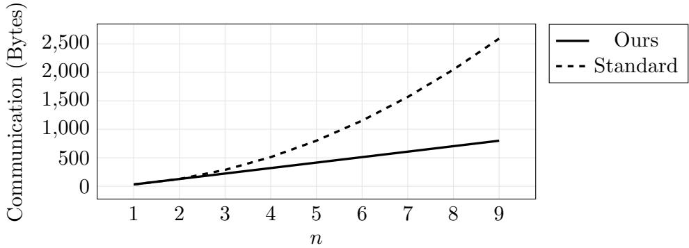

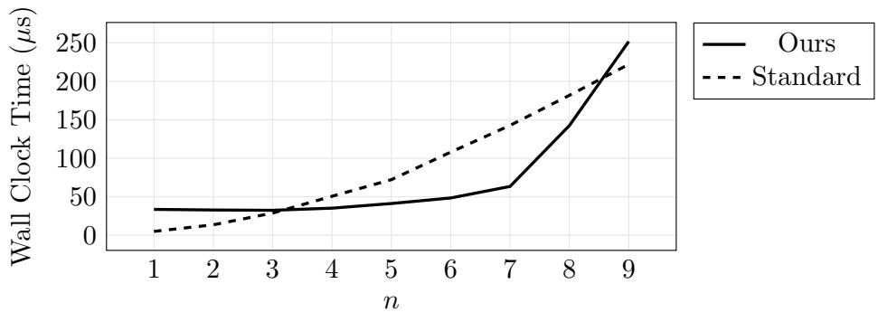  
Figure 2.5: Bandwidth consumption (top) and wall clock time (bottom) when computing the outer product of two n-bit vectors. We varied n from 1 to 9. The standard method computes the outer product using ANDs. Our technique’s computation scales exponentially in $n ,$ , but is more eficient for vectors between lengths 4 and 8.

In Section 2.5.2 we decomposed $a \otimes b$ into three summands:

$$
(a \otimes b) = ((a \oplus \alpha) \otimes b) \oplus ((b \oplus \beta) \otimes \alpha) ^ {\intercal} \oplus (\alpha \otimes \beta)
$$

The third term is known to G and is free. The other two terms must be computed inside the GC.

Consider the term $( a \oplus \alpha ) \otimes b$ . In Section 2.5.2 we insisted that this outer product be computed by a single one-hot outer product. More generally, we can tile together multiple one-hot outer products. We ensure the tiles are small enough that computation remains polynomial in the input size.

Each tile computes the outer product of a k-bit chunk of $a \oplus \alpha$ with b, yielding a $k \times m$ submatrix of the full outer product $( a \oplus \alpha ) \otimes b$ . Vertically concatenating the $\lceil n / k \rceil$ submatrices yields the correct result. We use the same idea to compute $( b \oplus \beta ) \otimes \alpha$ Figure 2.6 formalizes the procedure.

<div class="mineru-algorithm" style="white-space: pre-wrap; font-family:monospace;">
INPUT:
- Parties input bitstrings $\{a\}$, $\{b\}$ where $a \in \{0,1\}^n$ and $b \in \{0,1\}^m$.

OUTPUT:
- Parties output a garbled matrix $\{a \otimes b\}$.

PROCEDURE:
- Let $\langle \alpha, a \oplus \alpha \rangle = [[a]] = lsb\{a\}$. Let $\langle \beta, b \oplus \beta \rangle = [[b]] = lsb\{b\}$.
- $G$ locally computes and injects as input $\{\alpha\}$, $\{\beta\}$, and $\{\alpha \otimes \beta\}$.
- Parties compute $\{(a \oplus \alpha)^E\}$ and $\{(b \oplus \beta)^E\}$ via Free XOR.
- Parties agree on a chunk size $k$ which is at most logarithmic in the overall circuit input size. The parties split the input vectors into $\lceil n/k \rceil$ $k$-bit subvectors to avoid expensive exponential scaling.
- For each $k$-bit subvector $\{(a \oplus \alpha)^E\}_{i..i+k}$, the parties compute:
$\mathcal{T}(id)^\top \cdot \{\mathcal{H}((a \oplus \alpha))_{i..i+k} \otimes b\} = \{(a \oplus \alpha)_{i..i+k} \otimes b\}$
via a one-hot outer product (by Lemma 2.2). The parties do not split $b$ into chunks. The parties vertically concatenate the $\lceil n/k \rceil$ resultant matrices into $\{(a \oplus \alpha) \otimes b\}$.
- Parties symmetrically compute $\{(b \oplus \beta) \otimes \alpha\}$ by splitting $\{b \oplus \beta\}$ into $\lceil n/k \rceil$ $k$-bit chunks.
- Parties compute and output:
$\{(a \oplus \alpha) \otimes b\} \oplus \{(b \oplus \beta) \otimes \alpha\}^\top \oplus \{\alpha \otimes \beta\} = \{a \otimes b\}$
See Section 2.4.3 for a correctness argument.
</div>

Figure 2.6: Our eficient general outer product computes $\{ \{ a \} \} , \{ \{ b \} \} \mapsto \{ a \otimes b \}$ . Unlike Figure 2.4, this procedure handles outer products for input vectors of arbitrary length.

If the chosen chunk size k is logarithmic in the size of input, then the parties compute $a \otimes b$ in polynomial time. In terms of communication, the parties use $O ( n m / k )$ ciphertexts a factor k improvement over the standard method. Formally, we improve outer product communication by a logarithmic factor; in practice we choose constants k that yield good performance.

Figure 2.7 plots the practical eficiency we obtained when implementing general outer products with diferent values of k. The results show that our approach significantly improves outer products over prior state-of-the art.

## 2.5. Applications and Performance

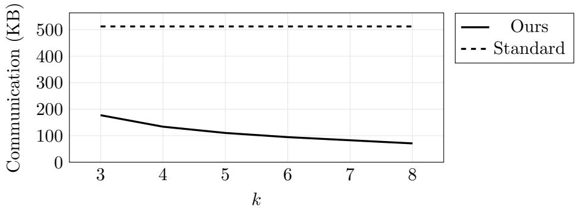

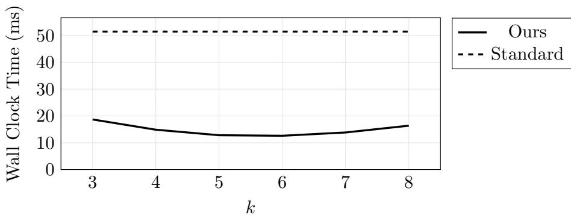  
Figure 2.7: We used our implementation to compute the bitwise outer product of two 128 bit vectors. We instantiated our approach with various chunking factors k (see Section 2.5.3). Increasing k decreases communication but increases computation, due to the exponential computation scaling of our one-hot operation. The standard method computes outer products by simply ANDing pairs of values. At $k = 6$ , we improve ove standard by $6 . 2 \times$ (communication) and 4.1× (time).

## 2.5.4 Binary Matrix Multiplication

It is well known that outer products can be used to eficiently compute matrix products. Specifically, the binary matrix product of input matrices a and b can be expressed by (1) for each i taking the outer product of column i of a with row i of b and (2) XORing the resulting matrices.

Because our technique reduces the cost of outer products by factor k (see Section 2.5.3), we similarly reduce the cost of binary matrix multiplication by factor k. For input matrices with dimension $n \times m$ and $m \times \ell ,$ , we require $O ( n m \ell / k )$ ciphertexts rather than the standard $O ( n m \ell )$ . Formally, k is a logarithmic factor; in practice we instantiate k with small constants.

We implemented matrix multiplication; Figure 2.8 plots our improvement.

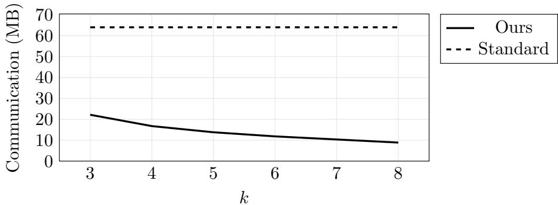

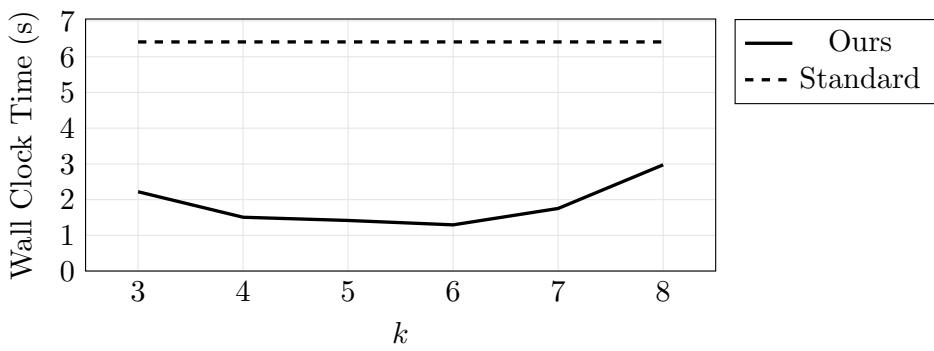  
Figure 2.8: We used our implementation to compute the bitwise matrix product of two 128×128 square bit matrices. We plot total communication consumption (top) and wall clock runtime (bottom). We instantiated our approach with various chunking factors k (see Figure 2.6). At $k = 6$ , we improve over standard by 6.2× (communication) and 5× (time).

## 2.5.5 Integer Multiplication

Consider bit vectors $a , b \in \{ 0 , 1 \} ^ { n }$ that each represent n-bit numbers. The outer product $a \otimes b$ can help to calculate the integer product $a \cdot b$

Standard GC techniques multiply numbers using the schoolbook method [WMK16]. For sake of example, consider $n = 4$ and examine the computation done by the schoolbook method:

$$
\begin{array}{c c c c c c} & a _ {0} \cdot ( & b _ {3} & b _ {2} & b _ {1} & b _ {0} \\ & a _ {1} \cdot ( & b _ {2} & b _ {1} & b _ {0} & 0 \\ & a _ {2} \cdot ( & b _ {1} & b _ {0} & 0 & 0 \\ + & a _ {3} \cdot ( & b _ {0} & 0 & 0 & 0 \\ \hline & & (a b) _ {3} & (a b) _ {2} & (a b) _ {1} & (a b) _ {0} \end{array}
$$

Each row can be expressed by bits in the outer product of a and b. Hence, we improve multiplication by using our general outer product (Section 2.5.3). The rows still must be added inside GC; we do so by traditional GC means. Addition is now the multiplication bottleneck. We leave potential improvements, perhaps by incorporating

## 2.5. Applications and Performance

arithmetic GC techniques [BMR16], to future work.

We implemented 32-bit integer multiplication using our technique and the standard method (our standard circuit is inspired by [WMK16]). Best performance was achieved with chunking factor (see Section 2.5.3) k = 6:

<table><tr><td></td><td>Standard</td><td>Ours</td><td>Improvement</td></tr><tr><td>Comm. (KB)</td><td>32.0</td><td>21.3</td><td>1.51×</td></tr><tr><td>Time (ms)</td><td>3.20</td><td>2.32</td><td>1.38×</td></tr></table>

As compared to outer products and matrix multiplication, our improvement here is less substantial: after the outer product is computed, our technique adds values using standard techniques. Still, we achieve improvement to an important primitive.

In the GC setting, the Karatsuba fast multiplication method improves over standard multiplication even for small 20-bit integers $[ \mathrm { H K S ^ { + } 1 0 } ]$ . Karatsuba is a recursive divide-and-conquer algorithm. At the leaves of the recursion (i.e. for 19-bit numbers or less), it is best to use standard multiplication. Our improved multiplication accelerates Karatsuba-based multiplication.

## 2.5.6 Binary Field Multiplication

Consider an arbitrary binary field GF(2<sup>n</sup>). In such fields, multiplication can be understood as polynomial multiplication modulo an irreducible polynomial p(x). By representing elements $a , b \in \operatorname { G F } ( 2 ^ { n } )$ as vectors of bits, we can easily compute the product of the two polynomials from the vector outer product. Once computed, the product can be reduced modulo $p ( x )$ by a linear function [GKPP06]. Thus, our outer product construction improves binary field multiplication by the chunking factor k (see Section 2.5.3).

We implemented both our approach and a standard circuit for $\mathrm { G F } ( 2 ^ { 8 } )$ (modulo $x ^ { 8 } + x ^ { 4 } + x ^ { 3 } + x + 1 )$ . We used the best available standard circuit for this field [BDP<sup>+</sup>20]. We ran our version with chunking factor k = 4 and k = 8. We list communication, wall clock time, and corresponding improvement over standard:

<table><tr><td></td><td>Standard</td><td colspan="2">k=4</td><td colspan="2">k=8</td></tr><tr><td>Comm. (Bytes)</td><td>1536</td><td>896</td><td>1.71×</td><td>704</td><td>2.18×</td></tr><tr><td>Time (μs)</td><td>146</td><td>80</td><td>1.82×</td><td>111</td><td>1.3×</td></tr></table>

Despite the fact eficient hand-tuned circuits are available, we improve communication consumption by more than 2×.

## 2.5.7 Binary Field Inverses and the AES S-Box

One-hot garbling can accelerate cbinary field inverses. Consider a field ${ \mathrm { G F } } ( 2 ^ { n } )$ where n is small (formally, logarithmic in the circuit input size). Let $a \in \mathrm { G F } ( 2 ^ { n } )$ be a field element and suppose $a \neq 0$ (we handle zero separately). Suppose we wish to compute a<sup>−1</sup> inside GC.

Our procedure follows from a technique given by [BIB89]. For non-zero input a, we first compute $a \cdot \alpha$ for uniform non-zero mask α. Then, we reveal $a \cdot \alpha$ to E. With this done, we use a one-hot outer product to eficiently compute $( a \cdot \alpha ) ^ { - 1 } \cdot \alpha = a ^ { - 1 }$

In more detail, we first compute and reveal to $E a \cdot \alpha$ . To do so, G samples uniform non-zero mask $\alpha \in _ { \mathfrak { S } } \mathrm { G F } ( 2 ^ { n } ) ^ { \times }$ . Then, the parties use the technique described in Section 2.5.6 to reduce field multiplication to an outer product. Because G knows α, we can compute the outer product $\{ a \otimes \alpha \}$ more eficiently than as described in Section 2.5.2.

With $\left\{ \left. a \cdot \alpha \right\} \right\}$ computed, G reveals $a \cdot \alpha$ to E by sending his least significant bits. This transmission is secure because α is a uniform non-zero field element, because a is assumed nonzero, and because $\operatorname { G F } ( 2 ^ { n } )$ is a field. The value revealed to E is indistinguishable from a uniform non-zero field element.

Now that the parties hold $\left\{ ( a \cdot \alpha ) ^ { E } \right\}$ , they can pass it as an argument to a one-hot outer product. They use the one-hot encoding to eficiently invert $a \cdot \alpha$ . Let (·)<sup>−1</sup> denote the function that takes the field inverse of its argument. The parties use a one-hot outer product to compute the following:

$$
\mathcal {T} ((\cdot) ^ {- 1}) ^ {\intercal} \cdot \{\{\mathcal {H} (a \cdot \alpha) \otimes \alpha \} \} = \{\{(a \cdot \alpha) ^ {- 1} \otimes \alpha \} \}
$$

Lemma 2.1

The parties use the reduction described in Section 2.5.6 to compute from the outer product the field product $\left\{ ( a \cdot \alpha ) ^ { - 1 } \cdot \alpha \right\} ] = \left\{ \left[ a ^ { - 1 } \right\} \right\}$

So far, we have assumed that $a \neq 0 .$ . Our approach must account for the possibility that a is zero. The typical approach, which we also adopt, is to map input zero to output zero. We first compute an auxiliary bit z that indicates if $a = 0$ . At the top-level, we compute the following expression:

$$
\left\{\left(a \oplus z\right) ^ {- 1} \oplus z \right\}
$$

## 2.5. Applications and Performance

<div class="mineru-algorithm" style="white-space: pre-wrap; font-family:monospace;">
INPUT:
- Parties input $\{(a)\}$ where $a \in \{0,1\}^n$.

OUTPUT:
- Parties output:
    $\left\{\begin{array}{ll}\{0\}\} &amp; \text{if } a = 0 \\ \{a^{-1}\}\end{array}\right.$ otherwise

PROCEDURE:
- The parties compute $\{z\} \triangleq \{a \stackrel{?}{=} 0\}$. This is achieved by a circuit with $n - 1$ AND gates.
- $G$ uniformly samples non-zero $\alpha \in_{\mathbb{S}} \mathrm{GF}(2^n)^{\times}$ and injects $\{\alpha\}$ as input.
- The parties compute $\{(a \oplus z) \cdot \alpha\}$ where $\cdot$ denotes field multiplication:
    - Let $\langle \gamma, (a \oplus z) \oplus \gamma \rangle = [\bar{a} \oplus z] = lsb(\{a \oplus z\})$.
    - $G$ injects inputs $\{\gamma\}$ and $\{\gamma \otimes \alpha\}$.
    - The parties compute $\{(a \oplus z) \otimes \alpha\}$ via one-hot outer product:
    $\mathcal{T}(id)^{\intercal} \cdot \{\mathcal{H}((a \oplus z) \oplus \gamma) \otimes \alpha\} \oplus \{\gamma \otimes \alpha\} = \{(a \oplus z) \otimes \alpha\}$
    - The parties compute $\{(a \oplus z) \cdot \alpha\}$ via a linear function (see Section 2.5.6).
- Let $\langle \delta, \delta \oplus ((a \oplus z) \cdot \alpha) \rangle = [\bar{a} (a \oplus z) \cdot \alpha] = lsb(\{\{(a \oplus z) \cdot \alpha\}\})$. $G$ sends $\delta$ to $E$, revealing $(a \oplus z) \cdot \alpha$ to $E$.
- It is safe for $G$ to send $\delta$ because $\alpha$ acts as a uniform mask that hides $a \oplus z$. Formally, we can simulate by uniformly sampling a non-zero value $r \in_{\mathbb{S}} \mathrm{GF}(2^n)^{\times}$. Because $\alpha$ is from the same distribution and because GF(2^n) is a field, $r \stackrel{c}{=} (a \oplus z) \cdot \alpha$. We simulate the message $\delta$ as $r$ XORed with $E$'s share of $(a \oplus z) \cdot \alpha$.
- Now that $E$ knows $(a \oplus z) \cdot \alpha$, the parties compute the following:
    $\mathcal{T}((\cdot)^{-1})^{\intercal} \cdot \{\mathcal{H}((a \oplus z) \cdot \alpha) \otimes \alpha\} = \{\{(a \oplus z) \cdot \alpha)^{-1} \otimes \alpha\}$
- Finally, the parties compute the following via a linear function (see Section 2.5.6) and output the result:
    $\{[(a \oplus z) \cdot \alpha)^{-1} \cdot \alpha) \oplus z\}$
    = $\{(a \oplus z)^{-1} \oplus z\}$
    = $\left\{\begin{array}{ll}\{1^{-1} \oplus 1\} &amp; if a = 0 \\ a^{-1}\end{array}\right.$ otherwise
    $z = 1\Leftrightarrow a = 0$
    = $\left\{\begin{array}{ll}\{0\} &amp; if a = 0 \\ a^{-1}\end{array}\right.$ otherwise
</div>

Figure 2.9: Our binary field inverse procedure.

If a is indeed zero, then this expression takes the inverse of one, which is itself one, and then XORs one, resulting in the desired output zero. Otherwise, this expression computes $a ^ { - 1 }$

S-Boxes. The AES S-Box, which is the only non-linear component of the AES block cipher, performs a single inversion in $\mathrm { G F } ( 2 ^ { 8 } )$ . The state-of-the-art Boolean circuit S-Box uses 32 ANDs [BP10]. Thus, with the half-gates technique, this implementation consumes 64 ciphertexts.

Our full 8-bit inverse operation consumes 58 ciphertexts: 22 to compute $\left\{ \left\{ a \cdot \alpha \right\} \right\}$ , 22 to then compute the inverse, and 14 to handle the case where a = 0. This improves communication by ∼ 10%.

We implemented the [BP10] S-Box and our one-hot version:

<table><tr><td></td><td>Standard</td><td>Ours</td><td>Improvement</td></tr><tr><td>Comm. (Bytes)</td><td>1024</td><td>929</td><td>1.10×</td></tr><tr><td>Time (μs)</td><td>103.6</td><td>105.8</td><td>0.98×</td></tr></table>

On a WAN, our implementation is slightly slower than the standard S-Box. This can likely be improved by low-level code optimization.

16-bit S-Boxes, based on an inversion in $\mathrm { G F } ( 2 ^ { 1 6 } )$ , have also been proposed for some applications $[ \mathrm { K K K ^ { + } 1 5 } ]$ . The state-of-the-art Boolean circuit uses 226 ciphertexts (113 ANDs) [BMP13]. Our approach produces an S-Box that consumes only 122 ciphertexts, $a \sim 4 5 \%$ improvement. Unfortunately, this application is less practical in terms of wall clock time since the parties must each compute a $2 ^ { 1 6 } \times 1 6$ one-hot outer product matrix.

It may be possible to further apply our technique to block ciphers, perhaps by codesigning with our new cost structure in mind. We leave such fine-grained approaches to future work.

## 2.5.8 Modular Reduction

Let x mod y denote a function that computes the remainder of x divided by y. Suppose the parties hold a sharing $\{ \{ a \} \}$ and wish to compute $\{ a$ mod $\ell \mathfrak { Y }$ where \` is a public constant. Such computation is potentially useful, e.g. to compute in an arithmetic field $\mathbb { Z } _ { p }$

<div class="mineru-algorithm" style="white-space: pre-wrap; font-family:monospace;">
INPUT:
- Parties input $\{a\}$ where $a \in \{0,1\}^n$.
- Parties agree on a constant $\ell$.

OUTPUT:
- Parties output $\{a \bmod \ell\}$.

PROCEDURE:
- Parties agree on a parameter $m$ such that $m \cdot \ell &gt; 2^n$.
- $G$ samples uniform mask $\alpha \in_{\S} \mathbb{Z}_{m \cdot \ell}$ and injects $\{\alpha\}$ as input.
- The parties compute $\{a - \alpha \bmod m \cdot \ell\}$ via a circuit. $G$ sends his least significant bits of the result to reveal $a - \alpha \bmod m \cdot \ell$ to $E$. It is secure to open this value because $\alpha$ acts as a uniform mask.
- The parties view $\{a - \alpha \bmod m \cdot \ell\}$ as the concatenation of $k$-bit chunks. I.e., the parties choose values $c_i$ such that:

$\left( \sum_i (c_i \ll (i \cdot k)) \right) = a - \alpha \bmod m \cdot \ell$

Where $\ll$ denotes a left bit shift. Because $\{a - \alpha \bmod m \cdot \ell\}$ is represented bitwise inside GC, the parties construct each $\{c_i\}$ just by projecting out $k$ bits.
- For each chunk $\{c_i\}$, the parties compute:

$\mathcal{T}((\cdot) \ll (i \cdot k)) \bmod \ell) \cdot \{\mathcal{H}(c_i) \otimes 1\}$ $= \{(c_i \ll (i \cdot k)) \bmod \ell\}$

That is, the parties compute ($\cdot$) mod $\ell$ on each $k$-bit chunk of the masked input.
- The parties compute and output:

$\left( \left( \sum_i \{(c_i \ll (i \cdot k)) \bmod \ell\} \right) + \{\alpha\} \right) \bmod \ell$ $= \{(a - \alpha) + \alpha) \bmod \ell\}$ $= \{a \bmod \ell\}$

Each addition is computed by a circuit that efficiently computes ($x + y$) mod $\ell$ for $x, y$ strictly less than $\ell$.
</div>

Figure 2.10: Our improved approach to modular reduction.

The Boolean circuit that computes (·) mod \` is an expensive quadratic construction. One-hot outer products improve the cost. Figure 2.10 lists our modular reduction technique. The technique uses two key ideas:

1. Consider x and y that are both statically known to be less than \`. In this case, the operation $( x + y )$ mod \` is a special case and can be computed using linear communication: simply add the numbers, compare the sum to $\ell ,$ and conditionally subtract \`.

2. We use the two following equalities:

$$
\begin{array}{c} (x + y) \bmod \ell = ((x \bmod \ell) + (y \bmod \ell)) \bmod \ell \\ x \bmod \ell = (x \bmod (m \cdot \ell)) \bmod \ell \end{array}
$$

Based on these ideas, we split the input a into chunks, reduce each chunk modulo $\ell ,$ and then eficiently add the results.

In more detail, we first subtract a random mask α from a and reveal $a - \alpha$ to $E .$ . We then split a into small k-bit chunks and, for each chunk, compute (·) mod \` using a onehot outer product. The reduced chunks can then be recombined and the mask stripped of using addition mod \`. Crucially, the number of needed additions is proportional only to the number of chunks.

For our concrete experiment, we implemented modular reduction for 32-bit numbers using the prime modulus $p = 6 5 5 2 1$ (the largest 16-bit prime). Our standard implementation conditionally subtracts $p \cdot 2 ^ { k }$ for $k \in [ 1 6 ]$ ; thus 16 conditional subtractions are needed. Our optimized version uses chunking factor $k = 8$ . The technique requires only six additions/subtractions and hence substantially improves performance:

<table><tr><td></td><td>Standard</td><td>Ours</td><td>Improvement</td></tr><tr><td>Comm. (KB)</td><td>35.1</td><td>10.5</td><td>3.3×</td></tr><tr><td>Time (ms)</td><td>3.75</td><td>1.08</td><td>3.5×</td></tr></table>

## 2.5.9 Exponentiation

Suppose the parties hold a sharing $\{ \{ a \} \}$ and wish to compute $\{ \ell ^ { a } \} _ { \ell }$ where \` is a publicly agreed constant. For special cases of $\ell \ ( \mathrm { e . g . } , \ell = 2 )$ , there are fast circuits that

## 2.5. Applications and Performance

<div class="mineru-algorithm" style="white-space: pre-wrap; font-family:monospace;">
INPUT:
- Parties input $\{a\}$ where $a \in \{0,1\}^n$.
- Parties agree on a constant $\ell$.

OUTPUT:
- Parties output $\{\ell^a \bmod 2^n\}$.

PROCEDURE:
- $G$ samples a uniform mask $\alpha \in \mathbb{Z}^{2^n}$ and injects $\{\alpha\}$ as input.
- The parties compute $\{a - \alpha\}$ via Boolean circuit. $G$ reveals $a - \alpha$ to $E$ by sending his least significant bits. It is secure to reveal this value because $\alpha$ is uniform.
- The parties view $\{a - \alpha\}$ as the concatenation of $\lceil n / k \rceil$ $k$-bit chunks. I.e., the parties choose values $c_i$ such that:

$\left( \sum_{i} (c_i \ll (i \cdot k)) \right) = a - \alpha$

Because $\{a - \alpha\}$ is represented bitwise inside GC, the parties construct each $\{c_i\}$ just by projecting out $k$ bits.
- For each $i$th chunk $\{c_i\}$, the parties compute:

$\mathcal{T}(\ell^{(\cdot) \ll (i \cdot k)}) \cdot \{\mathcal{H}(c_i) \otimes 1\} = \{\ell^{c_i \ll (i \cdot k)}\}$

- The parties compute and output:

$\left( \prod_{i} \{\ell^{c_i \ll (i \cdot k)}\} \right) \cdot \{\ell^\alpha\} = \{\ell^{a - \alpha}\} \cdot \{\ell^\alpha\} = \{\ell^a\}$

Note $\ell^\alpha$ is a constant known to $G$. Each multiplication is computed via the technique described in Section 2.5.5.
</div>

Figure 2.11: Our improved exponentiation approach.

compute $\{ \{ \ell ^ { a } \} \}$ . However, for arbitrary \` we need to repeatedly multiply inside GC, which is expensive. We can use one-hot garbling to greatly reduce the number of needed multiplications. To do so, we take advantage of the following property of exponents:

$$
x ^ {y} \cdot x ^ {z} = x ^ {y + z}
$$

The approach is formalized in Figure 2.11.

We first subtract a uniform additive mask α from a and then reveal $a - \alpha$ to $E .$ Then, we split $\{ a - \alpha \}$ into small k-bit chunks and, for each chunk $c ,$ computes $\{ \ell ^ { c } \} _ { }$ using a one-hot outer product. These intermediate values can be combined and the mask stripped of using multiplication. We use our improved multiplication technique (Section 2.5.5) to further improve cost.

We implemented exponents for 32-bit numbers using a standard technique (which consumes 31 standard multiplications) and our technique (with chunking factor k = 8, which consumes only 4 improved multiplications):

<table><tr><td></td><td>Standard</td><td>Ours</td><td>Improvement</td></tr><tr><td>Comm. (KB)</td><td>1024</td><td>87</td><td>11.8×</td></tr><tr><td>Time (ms)</td><td>101</td><td>10.6</td><td>9.52×</td></tr></table>

## 2.6 Simulator

We prove our one-hot technique secure. Recall (Section 1.4) that we prove our constructions secure via modular simulators. We prove that our constructions can be composed with themselves and with each other in Chapter 5.

We prove that E’s view of our one-hot outer product primitive (Figure 2.3) can be simulated:

Lemma 2.3. Let $\{ \boldsymbol { a } ^ { E } \} \} , \{ \boldsymbol { b } \}$ be two garbled strings such that $a \in \{ 0 , 1 \} ^ { n } , b \in \{ 0 , 1 \} ^ { m }$ Let M denote the sequence of rows generated by the call to $\{ a ^ { E } \} , \{ b \}  \{ \mathcal { H } ( a ) \otimes b \}$ Assuming H is a circular correlation robust hash function (Definition 1.1), there exists a simulator ${ \mathcal { S } } ( \{ \{ a ^ { E } \} \} , \{ b \} )$ that outputs M <sup>0</sup> such that:

$$
\left(\{\{a ^ {E} \}, \{b \}, M ^ {\prime}\right) \stackrel {{c}} {{=}} \left(\{\{a ^ {E} \}, \{b \}, M\right)
$$

Proof. By construction of a simulator (Figures 2.12 and 2.13). Indistinguishability of the rows is argued inline.

At a high level, it is easy to simulate each row by sampling a uniform string. This is suficient because we ensure that each row involves a call $H ( x , \nu )$ such that E has no information about x and such that ν is a fresh nonce. □

Security of our one-hot applications. Many of our applications (outer products, binary field multiplication, integer multiplication, matrix multiplication, see Section 2.5)

## 2.6. Simulator

<div class="mineru-algorithm" style="white-space: pre-wrap; font-family:monospace;">
INPUT:
- A garbled bitstring $\{a^E\}$ where $a \in \{0,1\}^n$.

OUTPUT:
- $\mathcal{S}$ simulates a shared matrix $[\mathcal{H}(a) \odot R]$ where $\odot$ denotes the element-wise product of bits in $\mathcal{H}(a)$ with rows of $R$.

GENERATED SIMULATED STRING:
- $\mathcal{S}$ simulates $2n - 2$ garbled rows: $row_{i,0}', row_{i,1}'$.

SIMULATOR:
- For each $i \in [n]$ let $\langle \cdot, A_i \oplus a_i \Delta \rangle = \{\{a_i^E\}\}$.
- If $a_0 = 0$, $\mathcal{S}$ sets $S_{0,1} = A_0$. Otherwise, $\mathcal{S}$ sets $S_{0,0} = A_0 \oplus \Delta$. ($E$, and hence $\mathcal{S}$, knows $a_0$.) We emphasize that $E$ does not know $S_{0,a_0}$.
- $\mathcal{S}$ populates $E$'s tree of labels, simulating each message $row_{i,0}, row_{i,1}$ along the way.
- $\mathcal{S}$ mirrors $E$'s actions in constructing each $S_{i,j}$ except the two missing sibling labels. For the missing labels, $\mathcal{S}$ uniformly samples two $\kappa$-bit strings. This is a good simulation because, by induction, $E$ knows nothing about the parent node of these two siblings and because in the real world these strings are derived via a call to $H$ (Definition 1.1). Hence, $\mathcal{S}$ now holds a value for each $S_{i,j}$.
- $\mathcal{S}$ simulates $Even$ and $Odd$:
$Even' \triangleq \bigoplus_{j=0}^{2^i - 1} S_{i,2j} \quad Odd' \triangleq \bigoplus_{j=0}^{2^i - 1} S_{i,2j+1}$
- $\mathcal{S}$ simulates the two rows for this level. Wlog, suppose $a_i = 1$ ($a_i = 0$ is symmetric). I.e., $E$ (and therefore $\mathcal{S}$) holds $A_i \oplus \Delta$, but not $A_i$. $\mathcal{S}$ uniformly samples a string $r \in \{\overline{0,1}\}^\kappa$. $\mathcal{S}$ simulates:
$row_{i,0}' \triangleq H(A_i \oplus \Delta, \nu_{i,even}) \oplus Even' \quad row_{i,1}' \triangleq r \oplus Odd'$

Here, $row_{i,0}'$ is trivially indistinguishable from $row_{i,0}$ since $Even'$ is indistinguishable as already argued. $row_{i,1}' \stackrel{c}{=} row_{i,1}$ by the properties of $H$:

$row_{i,1}' = r \oplus Odd'$ $\stackrel{c}{=} \mathcal{R}(A_i, \nu_{i,even}, 0) \oplus Odd'$ $\mathcal{R}$ is a random function
$\stackrel{c}{=} circ_\Delta(A_i, \nu_{i,even}, 0) \oplus Odd'$    Definition 1.1
$= H(A_i, \nu_{i,even}) \oplus Odd'$    Definition 1.1
$= row_{i,1}$

- $\mathcal{S}$ populates $S_{n-1,a}$ with zero and then outputs each $S_{n-1,i}$. I.e., $\mathcal{S}$ outputs [$\mathcal{H}(a) \odot R$] where $R$ is a uniform bit matrix.
</div>

Figure 2.12: This helper procedure simulates E’s view in Figure 2.2. See Figure 2.13 for the top level simulator of one-hot outer products.

<div class="mineru-algorithm" style="white-space: pre-wrap; font-family:monospace;">
INPUT:
- A garbled bitstring $\{a^E\}$ where $a \in \{0,1\}^n$.
- A garbled bitstring $\{b\}$ where $b \in \{0,1\}^m$.

OUTPUT:
- A simulated garbling of the product $\{\mathcal{H}(a) \otimes b\}$.

GENERATED SIMULATED STRING:
- $S$ simulates $2n - 2$ garbled rows: $row_{i,0}', row_{i,1}'$ (via Figure 2.12).
- $S$ simulates $m$ garbled row $row_j'$.

SIMULATOR:
- $S$ constructs $[\mathcal{H}(a) \odot R]$ via Figure 2.12. I.e., $S$ computes $2^n - 1$ random strings $R_{i \neq a}$.
- For each $j \in [m]$ $S$ proceeds as follows:
- Let $\langle \cdot, B_j \oplus b_j \Delta \rangle = \{b_j\}$.
- For each $i \neq a$, $S$ computes $X_{i,j} = H(R_i, \nu_i)$.
- $S$ samples uniform string $X_{a,j}' \in \{0,1\}^\kappa$.
- $S$ sets:
$row_j' \triangleq \left( \bigoplus_{i \neq a} X_{i,j} \right) \oplus X_{a,j}'$

This is indistinguishable from $row_j$ by the properties of $H$:

$row_j' = \left( \bigoplus_{i \neq a} X_{i,j} \right) \oplus X_{a,j}'$
= $\left( \bigoplus_{i \neq a} X_{i,j} \right) \oplus (X_{a,j}' \oplus B_j) \oplus B_j$ $B_j \oplus B_j = 0$ $\stackrel{c}{=} \left( \bigoplus_{i \neq a} X_{i,j} \right) \oplus \mathcal{R}(R_a, \nu_a, 0) \oplus B_j$ $\mathcal{R}$ is a random function
$\stackrel{c}{=} \left( \bigoplus_{i \neq a} X_{i,j} \right) \oplus circ_\Delta(R_a, \nu_a, 0) \oplus B_j$    Definition 1.1
= $\left( \bigoplus_{i \neq a} X_{i,j} \right) \oplus H(R_a, \nu_a) \oplus B_j$    Definition 1.1
= $\left( \bigoplus_{i \neq a} X_{i,j} \right) \oplus X_{a,j} \oplus B_j$    Definition $X_{a,j}$ (Figure 2.3)
= $\left( \bigoplus_i X_{i,j} \right) \oplus B_j$
= $row_j$

- $S$ computes $\{\mathcal{H}(a) \otimes b\}$ by applying $E$'s actions (Figure 2.3) to the simulated material.
</div>

Figure 2.13: The simulator for the one-hot outer product (Figure 2.3). This simulator uses Figure 2.12 as a subprocedure. At a high level, it sufices to simulate each garbled row by a simple uniform random string.

## 2.6. Simulator

merely compose our one-hot outer product primitive with XORs. However, other ap plications (field inverses, modular reduction, exponentiation) reveal values to E. In Chapter 5, we discuss and prove secure a general technique for building applications that securely reveal values to E. For now, we note that our applications are secure because the revealed values are masked by one-time pads. In each such application, we argue this fact inline.

## Chapter 3

## STACKED GARBLING

Our second new direction is a technique that we call stacked garbling. Stacked garbling is a powerful GC extension that greatly improves the handling of programs with conditional branching.

Recall the half-gates technique (Chapter 1), and recall how it was limited to ANDs and XORs. Now, consider a function with conditional behavior, e.g:

$$
f (x, s) \triangleq \left\{ \begin{array}{l l} f _ {0} (x) & \text { if } s = 0 \\ f _ {1} (x) & \text { otherwise } \end{array} \right.
$$

How might we compute this function using only Boolean operations? Unfortunately, we must fully evaluate each branch, then clean up the output of those branches (see Figure 3.1). This standard solution leaves much to be desired: the output of $f$ depends only on $f _ { s } ,$ , but the standard strategy wastefully computes $f _ { \bar { s } }$ anyway.

In some sense, this waste seems essential; the parties must not learn which branch is active. To mask the active branch, we evaluate each branch and then obliviously discard the output from inactive branches. In terms of cost (Section 1.2), this means that we pay computation and communication proportional to each of the conditional’s branches. Indeed, it was widely believed necessary to transmit GC material for inactive conditional branches.

This belief was false.

Stacked garbling demonstrates that we can use far less communication than previously believed: G can transmit a single piece of material that is large enough for only a single branch. E can then re-use this single piece of material across each branch.

<div class="mineru-algorithm" style="white-space: pre-wrap; font-family:monospace;">
INPUT:
- Parties agree on functions $f_0$ and $f_1$ each with $n$ inputs and $m$ outputs:
$f_0, f_1 : \{0, 1\}^n \to \{0, 1\}^m$
- Parties input a garbled string $\{x\}$ where $x \in \{0, 1\}^n$.
- Parties input a garbled bit $\{s\}$ that indicates which branch to evaluate.
OUTPUT:
- The garbled output of the selected function $\{f_s(x)\}$
PROCEDURE:
- Parties compute $\{f_0(x)\}$ via Boolean operations.
- Parties compute $\{f_1(x)\}$ via Boolean operations.
- Parties propagate the output from branch $s$ and discard the output from branch $\bar{s}$. They compute and output:
$\{\bar{s} \cdot f_0(x) \oplus s \cdot f_1(x)\} = \{f_s(x)\}$
</div>

Figure 3.1: The standard method for computing a conditional with branches $f _ { 0 }$ and $f _ { 1 }$ requires G and E to handle each branch in its entirety. Crucially, G and E consume bandwidth proportional to the material for each branch.

This yields asymptotic communication improvement. Prior to stacked garbling (also sometimes called stacked garbled circuit, SGC), for a conditional with b branches each requiring $O ( n )$ bits of material, the parties needed $O ( b \cdot n )$ bits of material.<sup>1</sup> SGC improves this to only O(n) bits.

## 3.1 Introduction

SGC allows G to bitwise XOR, or stack, branch material together. By stacking material, G sends much shorter messages to E, improving communication and overall performance. To correctly evaluate, E must somehow recover the correct material for the active branch. We arrange this by allowing E to reconstruct (starting from short PRG seeds) the material for each inactive branch. E can use these reconstructed materials to unstack, recovering material for the active branch

## 3.2. Preliminaries

Of course, E should not learn the identity of the active branch, so we must arrange that E’s actions do not reveal the active branch. See Section 3.4 for greater detail.

## 3.1.1 Contribution

We refute the widely held belief that inactive GC branches must be transmitted.

We start by presenting a technique for the improved handling of two branches, showing how we can stack GC material. This technique can be used recursively to handle arbitrary numbers of branches. For a conditional with b branches, each requiring $O ( n )$ bits of material, this technique improves communication from $O ( n \cdot b )$ bits to $O ( n )$ bits.

Unfortunately, while this recursive technique reduces communication cost, it also significantly increases computation cost. Each party consumes more than $O ( n \cdot b ^ { 2 } )$ computation. Thus, we also present LogStack, an improved technique for handling vectors of branches. LogStack retains the $O ( n )$ communication advantage, but reduces computation to only $O ( n \cdot b \log b )$ . LogStack also reduces the original technique’s space complexity from $O ( n \cdot b )$ to only $O ( n \cdot \log b )$

We implemented SGC in $\mathrm { C } + + ;$ see Section 3.6 for our performance evaluation. Our evaluation confirms that SGC indeed reduces communication over the prior state-of-theart by the branching factor. Despite the extra log b factor in computation consumption, SGC significantly improves wall-clock time, especially on slower networks.

## 3.2 Preliminaries

Two prior works also address GC conditionals, but both focus on special cases where one party knows the active branch. Specifically, [Kol18] requires that G knows the active branch, while [HK20b] requires that E knows the active branch. Our approach uses key ideas from both works to eficiently handle conditionals without either party knowing the active branch, so we review both.

## 3.2.1 ‘Free If ’ Review [Kol18]

Consider a program with conditional branching. If G knows the active branch, then [Kol18] reduces communication needed to run the program inside GC by combining two keys ideas:

1. The branch functions (the topologies) can be separated from material, and material can be used with a non-matching topology.

2. Material can be re-used if it is used at most once with valid garblings (Definition 1.3). The same material can be re-used with garbage labels. Garbage labels are not valid garblings , but are instead pseudorandom strings. Put another way, E may ‘decrypt’ a gate table with keys unrelated to the table encryption multiple times. Successful and unsuccessful decryption attempts must be indistinguishable.

The [Kol18] approach is as follows:

Let $\left\{ f _ { 0 } , . . . , f _ { b - 1 } \right\}$ be a set of branches. For simplicity, suppose each branch $f _ { i }$ requires material $M _ { i }$ of the same size. Let $f _ { s }$ be the active branch, and let G know s.

G garbles $f _ { s }$ but does not garble the other n−1 circuits. Let M be the material constructed by garbling $f _ { s }$ . G sends only M to E. Furthermore, G conveys to E input labels for each circuit via oblivious transfer.

E knows the topology of each branch, but does not know and must not learn s. Therefore, she evaluates each branch $f _ { i } ,$ , interpreting M as the material for that branch. When she evaluates $f _ { s } ,$ she therefore obtains correct output garblings. But M is valid material for $f _ { s }$ only, not for the other branches. The input labels that E uses for all $f _ { i \neq s }$ are garbage with respect to M, and E obtains garbage labels for each wire. [Kol18] demonstrates it is possible to re-use material in this way without compromising security. Namely, E cannot distinguish garbage labels from the valid garblings and hence does not learn s.

G and E obliviously discard garbage labels from $f _ { i \neq s }$ and propagate the output garblings from $f _ { s }$ via a simple interactive protocol. In this manner, the parties compute the correct output for branch $f _ { s }$

Thus, the two parties securely evaluate 1-out-of-b branches while transmitting material for only 1 branch rather than for all b. This reduces communication and hence improves performance.

SGC also optimizes conditional branching and also relies on the key idea of re-using material to evaluate diferent branches. SGC difers from [Kol18] in two key respects:

1. [Kol18] relies on G knowing the active branch. We consider the general case where neither G nor E know which branch is active. Despite this generalization, we

## 3.2. Preliminaries

similarly avoid transmitting separate material for each branch.

2. [Kol18] requires the parties to interact to discard garbage labels. We discard garbage labels without interaction.

## 3.2.2 ‘Privacy-Free Stacked Garbling’ Review [HK20b]

[HK20b] is in a line of work that uses GC to construct zero-knowledge proofs [JKO13, FNO15]. While [HK20b] is motivated by the ZK setting, its core ideas do not actually require it. In our review, we ignore the ZK-specific details, and we treat the approach as a standard GC technique. [HK20b] difers from [Kol18] in that E knows the active branch rather than G. This is a critical distinction that requires a diferent approach. [HK20b] builds this new approach on two key ideas:

1. Material can be managed as a bitstring. In particular, material from diferent branches can be XORed together.

2. Material can be viewed as the expansion of a pseudorandom seed. Garbling is a pseudorandom process, but if all random choices are derived from a seed, then material is the deterministic expansion of that seed. Hence, material can be compactly sent via a seed.

In general, it is not safe to send material via a seed, as the seed also includes $G \mathrm { { ^ { \circ } s } }$ share of each garbled value. [HK20b] shows that it is secure to reveal a seed to E if the seed only generates material for an inactive branch.

Let $\left\{ f _ { 0 } , . . . , f _ { b - 1 } \right\}$ be a set of conditional branches. Let $f _ { s }$ be the active branch and let E know s. G knows each branch $f _ { i } ,$ but does not know and must not learn s. G uses b diferent seeds to construct material for each branch $f _ { i }$ . He stacks these b strings by XORing them together and sends the result to E. E selects the active branch during b instances of 1-out-of-2 oblivious transfer. In each instance $i \neq s ,$ she selects the first secret and receives the ith seed. In instance s, she chooses the second secret and so does not receive the seed for $f _ { s }$ . E uses the b−1 seeds to reconstruct material for branches $f _ { i \neq s }$ and uses the result to ‘undo’ the stacking. As a result, she obtains material needed to evaluate $f _ { s }$ . From here, E can evaluate $f _ { s }$ normally.

By running this protocol, G and E handle 1-out-of-b branches, but only at the communication cost of one branch.

<div class="mineru-algorithm" style="white-space: pre-wrap; font-family:monospace;">
INPUT:
- A function $f : \{0,1\}^n \to \{0,1\}^m$ with a corresponding GC procedure.
- A pseudorandom seed $S$.

OUTPUT:
- Material $M$.
- A global offset $\Delta \in \{0,1\}^{\kappa-1} 1$.
- Input language $X \in \{0,1\}^{\kappa \cdot n}$.
- Output language $Y \in \{0,1\}^{\kappa \cdot m}$.

PROCEDURE Garble:
- Use $S$ as a PRG seed to uniformly sample $\Delta$ and $X$.
- Set up $G$'s half of a garbling $\langle X, \cdot \rangle = \{x\}$.
- Run $G$'s GC procedure for $f$ on input $\{x\}$, yielding $\{y\} = \langle Y, \cdot \rangle$. Collect all implied messages into a string of material $M$.
- Crucially, in the context of a conditional we pad $M$ with uniform bits drawn from $S$ until $M$ has length equal to the longest material from any one branch. We package this handling here for simplicity.
- Output $(M, \Delta, X, Y)$.
</div>

Figure 3.2: In SGC, we garble branches starting from seeds. The Garble procedure formalizes what it means to garble a branch from a seed. Essentially, we sample an input language, compute G’s GC procedure, and return all resulting objects. Note that we start from a fresh global ofset $\Delta .$

SGC leverages key ideas from [HK20b]. We also stack cryptographic material using XOR and also allow E to expand seeds for inactive branches. SGC difers from [HK20b] in that:

1. [HK20b] relies on E knowing the active branch. Our approach assumes that neither G nor E knows the active branch.

2. [HK20b] requires G to send pseudorandom seeds to E via oblivious transfer. SGC embeds the seeds in the material and does not require additional interaction.

## 3.3. Notation

<div class="mineru-algorithm" style="white-space: pre-wrap; font-family:monospace;">
INPUT:
- A function $f: \{0,1\}^n \to \{0,1\}^m$ with a corresponding GC procedure.
- A string $X \in \{0,1\}^{n \cdot \kappa}$.
- Material $M$.
OUTPUT:
- A string $Y \in \{0,1\}^{m \cdot \kappa}$.
PROCEDURE Evaluate:
- Interpret $X$ as $E$'s half of a garbling: $\langle \cdot, X \rangle = \{\{x\}\}$.
- Run $E$'s GC procedure for $f$ on input $\{\{x\}\}$ and material $M$, yielding $\{\{y\}\} = \langle \cdot, Y \rangle$.
- Output $Y$.
</div>

Figure 3.3: The Evaluate procedure formalizes what it means to evaluate a branch. We simply run E’s GC procedure for f.

## 3.3 Notation

## Garbling and Evaluating

In SGC, we treat branches as black boxes: a branch is a function that can be garbled and evaluated. When we say that a party garbles a branch from a seed, we mean that he/she uses that seed to derive a uniform input language X and a global ofset ∆, then runs G’s specified garbled procedure to generate material and output language Y . See Figure 3.2. We similarly define a procedure that formalizes how to evaluate a branch (Figure 3.3).

## Garbage

In SGC, we evaluate GCs with inputs that are generated independently of the GC. I.e., these independent labels are not the garblings (Definition 1.3) that match the GC. We call such labels garbage labels. During GC evaluation, garbage labels propagate and must eventually be obliviously dropped in favor of valid labels. We call the process of canceling out garbage labels garbage collection.

We also work with GC material that arises from XORing GC material derived from the wrong seeds. We refer to such material as garbage material.

## Binary tree notation

We work with complete binary trees. Let t denote a complete binary tree. We use subscript notation $t _ { i }$ to denote the ith leaf of t. We use pairs of indices to denote internal nodes of the tree. I.e., $t _ { i , j }$ is the root of the subtree containing the leaves $t _ { i } . . . t _ { j }$

Note, $t _ { i , i }$ (the node containing only i) and $t _ { i }$ both refer to the leaf: $t _ { i , i } = t _ { i }$ . It is sometimes convenient to refer to a (sub)tree index abstractly. For this, we write $\mathcal { N } _ { i , j }$ or, when clear from context, simply write ${ \mathcal { N } } .$

Consider a leaf \`. Consider the logarithmic number of nodes on the path from the tree’s root to \`. Each of these nodes is an ancestor of \`. Consider the immediate sibling of each ancestor. These nodes just of the path to \` are called the sibling roots of \`. Consider the subtree rooted at a sibling root; we call this subtree a sibling subtree of \`. Notice that the sibling subtrees of \` together include every leaf node except for \`.

Example 3.1 (Sibling roots/subtrees). Looking forward, Figure 3.8 depicts a binary tree with eight leaves. Here, leaf $\mathcal { N } _ { 0 }$ has sibling roots $\mathcal { N } _ { 1 } , \mathcal { N } _ { 2 , 3 }$ , and $\mathcal { N } _ { 4 , 7 }$ . The sibling subtrees of $\mathcal { N } _ { 0 }$ include each leaf $\mathcal { N } _ { 1 } . . . \mathcal { N } _ { 7 }$

## 3.4 Overview

Section 3.2 covered four key ideas from prior work regarding material. Material can be:

1. Separated from topology.

2. Used with garbage input labels.

3. Stacked with XOR.

4. Compactly transmitted as a seed.

To this list, we add one additional key idea that allows us to obliviously and without interaction discard garbage labels that emerge from the evaluation of inactive branches: we ensure that all garbage is predictable to G. G precomputes the possible garbage values and uses this knowledge to garble GC procedures that collect garbage obliviously. We begin with a high level approach that omits garbage collection (which is explained later):

Let $f _ { 0 }$ and $f _ { 1 }$ be two functions that are conditionally composed as part of some larger function. Let the two functions have input $\{ \{ x \} \}$ . Let there be a bit s that

## 3.4. Overview

encodes the branch condition, and let G and E hold $\{ \{ s \} \} = \langle S , S \oplus s \Delta \rangle$ i. The parties wish conditionally evaluate:

$$
\{\{f _ {s} (x) \} \} = \left\{ \begin{array}{l l} \{\{f _ {0} (x) \} \} & \text { if } s = 0 \\ \{\{f _ {1} (x) \} \} & \text { otherwise } \end{array} \right.
$$

Suppose neither G nor E knows s and hence neither party knows the active branch. Our approach is as follows:

1. G uses $S \oplus \Delta$ as a PRG seed to derive all randomness while garbling the function $f _ { 0 }$ . As we will see, this allows $E$ to evaluate $f _ { 1 }$ . Symmetrically, he uses $S$ as a seed to garble $f _ { 1 }$ . Let $M _ { 0 } , M _ { 1 }$ be the respective resultant material.

2. G uses XOR to stack the material: $M _ { c o n d } \triangleq M _ { 0 } \oplus M _ { 1 }$ . G sends $M _ { c o n d }$ to $E .$ .

3. E holds $S \oplus s \Delta$ . She assumes $s = 0$ and uses $S \oplus s \Delta$ to garble $f _ { 1 }$ .

(a) Suppose that $E ^ { \prime }$ s assumption is correct. Then since she garbles starting from the same seed S as $G ,$ she constructs $M _ { 1 }$ . She computes $M _ { c o n d } \oplus M _ { 1 } = M _ { 0 }$ the correct material for $f _ { 0 }$ . She evaluates $f _ { 0 }$ and obtains valid output.

(b) Suppose that $E ' s$ assumption is not correct, i.e. $s = 1$ . Then she constructs garbage material instead of $M _ { 1 }$ . Correspondingly, she computes $M _ { c o n d } \oplus$ $M _ { 1 } ^ { \prime }$ , yielding garbage material for $f _ { 0 }$ . E correspondingly computes garbage output.

Critically, E cannot distinguish between her correct and incorrect assumptions. That is, she cannot distinguish valid material/labels from garbage: from E’s perspective both valid and garbage material/labels are indistinguishable from random strings.

4. E symmetrically assumes $s = 1$ , garbles $f _ { 0 }$ , and evaluates $f _ { 1 }$ .

Since s must be either 0 or 1, one of $E \mathrm { { ^ { * } s } }$ assumptions is right and one is wrong. She computes valid output from one branch and garbage output from the other.

The remaining task is to obliviously discard the garbage output. This could be achieved using an interactive protocol [Kol18], but our goal is to discard garbage noninteractively. To realize this goal, we introduce two new GC ‘gadgets’: a demultiplexer gadget (demux) and a multiplexer gadget (mux). The demux ensures that when E makes the wrong assumption, her garbage labels are predictable to $G .$ The mux disposes of predictable output garbage labels. In practice, the demux and mux are built from garbled tables (Section 3.4.1).

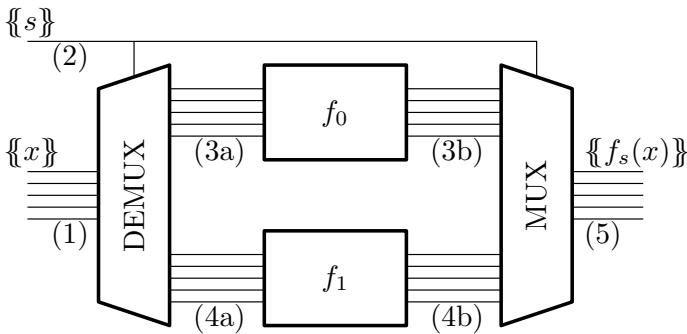  
Figure 3.4: The conditional composition of functions $f _ { 0 }$ and $f _ { 1 }$ depicted as a circuit. The bit $\{ \{ s \} \}$ is the branch condition; the branch condition decides which conditional branch is active. Our approach introduces garbage labels, and the demux and mux collect garbage.

## Additional details and garbage collection

We rewind and present E’s actions at a lower level of detail, including her handling of the demux and mux. Assume $s = 0$ . The symmetric scenario (s = 1) has a symmetric explanation. We stress that the approach is unchanged, and only the explanation is afected by the assumption.

Figure 3.4 depicts a conditional that includes a demux and mux. Wirings in the diagram are numbered. Each of the following numbered steps refers to a correspondingly numbered wiring.

1. The input $\{ \{ x \} \}$ is passed to the demux.

2. $\{ \{ s \} \}$ is the garbled branch condition. Both the demux and the mux take $\{ \{ s \} \}$ as an argument that controls their operation.

3. E assumes $s = 0$ and evaluates $f _ { 0 }$ as already described.

(a) Since this is a correct assumption (we assumed $s = 0 )$ , the demux yields valid garbled input for $f _ { 0 }$ .

(b) As before, E garbles $f _ { 1 }$ using S, computes $M _ { c o n d } \oplus M _ { 1 } = M _ { 0 }$ , evaluates $f _ { 0 } ,$ , and obtains valid garbled output.

## 3.4. Overview

4. E symmetrically assumes that $S = 1$ and evaluates $f _ { 1 }$ .

(a) Since this is an incorrect assumption, the demux yields garbage input for $f _ { 1 }$ . One challenge is that there are an exponential number of possible inputs con figurations to $f _ { 1 }$ . The demux eliminates this uncertainty by processing $\{ \{ x \} \}$ bit-by-bit, where there are only two options for a bit. The demux obliviously translates both possible input garblings to the same garbage label. There is a corresponding translation performed for the active branch $f _ { 0 }$ , but in that case the demux keeps the labels distinct. The demux uses $\{ \{ s \} \}$ to control which branch receives valid labels and which receives garbage. One can think of this as obliviously multiplying the inputs by either 0 or 1 depending on s.

(b) As before, E computes garbage outputs by attempting to evaluate $f _ { 1 }$ . The output garbage labels are independent of the input x because (1) the demux ensures there is only one possible garbage input and (2) the evaluator’s actions are deterministic. That is, we have guaranteed that $f _ { 1 }$ has only one possible garbage label per output bit, and these garbage labels can be computed/predicted by $G .$

5. Garbage collection. E passes both sets of output labels to the mux, along with $\{ \{ s \} \}$ . The mux collects garbage and yields valid outputs.

Garbage collection is possible because $G$ predicts the garbage output from $f _ { 1 } . ~ G$ predicts this garbage by emulating $E { ^ \circ } \mathrm { s }$ actions when making a bad assumption. More precisely, he predicts both possible wrong assumptions:

1. G emulates E in the case where she assumes $s = 1$ , while in fact $s = 0$ . G encrypts $f _ { 0 }$ with $S ,$ yielding garbage material $M _ { 0 } ^ { \prime }$ , and evaluates $f _ { 1 }$ using $M _ { c o n d } \oplus M _ { 0 } ^ { \prime }$

2. $G$ emulates E in the case where she assumes $s = 0$ , while in fact $s = 1$ . G encrypts $f _ { 1 }$ with $S \oplus \Delta$ and evaluates $f _ { 0 }$ using $M _ { c o n d } \oplus M _ { 1 } ^ { \prime }$

These emulations compute the possible garbage output from each branch. $G$ uses the garbage output labels to garble the mux.

By our approach, $G$ and $E$ compactly represent the conditional composition of $f _ { 0 }$ and $f _ { 1 }$ . In particular, G sends $M _ { c o n d } = M _ { 0 } \oplus M _ { 1 }$ instead of $M _ { 0 } \mid M _ { 1 }$ . The XOR-stacked material is shorter than the concatenated material and hence more eficient to transmit.

<div class="mineru-algorithm" style="white-space: pre-wrap; font-family:monospace;">
INPUT:
- Parties input branch condition $\{s\}$ and input string $\{x\}$ where $x \in \{0,1\}^n$.
- $G$ inputs information needed to translate $E$'s shares to a format suitable to either of the two possible branches. He inputs GC languages $X_0$ and $X_1$ where $X_0, X_1 \in \{0,1\}^{\kappa \cdot n}$, and he inputs GC offsets $\Delta_0$ and $\Delta_1$ where $\Delta_0, \Delta_1 \in \{0,1\}^\kappa$.
OUTPUT:
- $E$ outputs (1) garbled input for branch $s$ and (2) garbage input for branch $\bar{s}$. More precisely, she outputs $X_s \oplus x\Delta_s$ and $\perp_{\bar{s}}$ where $\perp_{\bar{s}} \in \{0,1\}^{\kappa \cdot n}$.
- $G$ outputs both possible garbage inputs $\perp_0$ and $\perp_1$.
PROCEDURE:
- Assume that $x$ has length one. For longer inputs, the parties repeat $n$ times:
- $G$ and $E$ compute the following function via a simple garbled table:

condition input $f_0$ label $f_1$ label
S X $X_0$ $\perp_1$
S X ⊕ Δ $X_0$ ⊕ Δ₀ ⊥₁
S ⊕ Δ X ⊥₀ X₁
S ⊕ Δ X ⊕ Δ ⊥₀ X₁ ⊕ Δ₁

I.e., for each row of the table, $G$ encrypts the outputs (using $H$ and fresh nonces) according to the appropriate combinations of inputs. The rows of the table are permuted according to least significant bits. Since the handling is simple, we do not describe in further detail. See Section 1.1 for an example of implementing a garbled (truth) table.
- Each garbled table requires that $G$ send to $E$ eight ciphertexts.
</div>

Figure 3.5: The demultiplexer (demux) feeds valid garbled input to the active branch and garbage input to the inactive branch. By providing fixed garbage input to the inactive branch, we ensure that G can predict the garbage output from that branch.

Both the demux and mux require additional material, but the amount required is linear in the number of inputs/outputs and is usually small compared to the amount of material needed for the branches.

## 3.4.1 Procedures

We formalize the SGC procedures that G and E use to evaluate two branches.

<div class="mineru-algorithm" style="white-space: pre-wrap; font-family:monospace;">
INPUT:
- Parties input garbled indicator bit $\{s\}$.
- $G$ inputs output languages of the branches: $Y_0, Y_1, \Delta_0$, and $\Delta_1$ where $Y_0, Y_1 \in \{0, 1\}^{\kappa \cdot m}$.
- $G$ also inputs $E$'s possible garbage outputs: $\perp_0'$ and $\perp_1'$ where $\perp_0', \perp_1' \in \{0, 1\}^{\kappa \cdot m}$.
- $E$ inputs two strings $Y_0^E$ and $Y_1^E$ such that:
$Y_s^E = Y_s \oplus y\Delta_s$ for $y \in \{0, 1\}^m$ $Y_{\bar{s}}^E = \perp_{\bar{s}}'$

OUTPUT:
- Parties output $\{y\}$.
PROCEDURE:
- Assume that $y$ has length one. For longer outputs, the parties repeat $m$ times:
- $E$ XORs her labels $Y_s \oplus y\Delta_s \oplus \perp_{\bar{s}}'$.
- $G$ and $E$ compute the following function via a simple garbled table:

condition input output
S $Y_0 \oplus \perp_1'$ Y
S $Y_0 \oplus \Delta_0 \oplus \perp_1'$ Y ⊕ Δ
S ⊕ Δ $\perp_0' \oplus Y_1$ Y
S ⊕ Δ $\perp_0' \oplus Y_1 \oplus \Delta_1$ Y ⊕ Δ

I.e., for each row of the table, $G$ encrypts the outputs (using $H$ and fresh nonces) according to the appropriate combinations of inputs. The rows of the table are permuted according to least significant bits. Since the handling is simple, we do not describe in further detail. See Section 1.1 for an example of implementing a garbled (truth) table.
- Each garbled table requires that $G$ send to $E$ four ciphertexts.
</div>

Figure 3.6: The multiplexer (mux) collects garbage output from the inactive branch. We can collect garbage because G can precompute the possible garbage outputs $\perp _ { 0 } ^ { \prime } , \perp _ { 1 } ^ { \prime }$ and hence he can garble simple tabulated functions of these garbage output values.

<div class="mineru-algorithm" style="white-space: pre-wrap; font-family:monospace;">
INPUT:
- Parties agree on two branch circuits $f_0, f_1$ each with $n$ inputs and $m$ outputs.
- Parties input a garbled string $\{x\}$ where $x \in \{0, 1\}^n$ and
- Parties input a garbled bit $\{s\}$ that indicates which branch to evaluate.

OUTPUT:
- The garbled output of the selected function $\{f_s(x)\}$

PROCEDURE:
- Let $\langle S, S \oplus s\Delta\rangle = \{s\}$. Parties agree on nonces $\nu_0$ and $\nu_1$.
- $G$ computes two seeds $S_0 = H(S \oplus \Delta, \nu_0)$ and $S_1 = H(S, \nu_1)$.
- $G$ uses $S_0, S_1$ as PRG seeds to respectively derive all randomness while garbling $f_0, f_1$:
    $(M_0, \Delta_0, X_0, Y_0) \leftarrow Garble(f_0, S_0)$ $(M_1, \Delta_1, X_1, Y_1) \leftarrow Garble(f_1, S_1)$
- $G$ sends $M_0 \oplus M_1$ to $E$.
- The parties invoke a demultiplexer (Figure 3.5) with inputs $\{s\}$ and $\{x\}$. As auxiliary input, $G$ passes $X_0, X_1, \Delta_0$, and $\Delta_1$. As output, $E$ obtains $X_s^E = X_s \oplus x\Delta_s$ and pseudorandom string $X_{\bar{s}}^E = \bot_{\bar{s}}$; i.e., $E$ obtains a valid garbling for branch $s$ but garbage labels for branch $\bar{s}$. $G$ obtains the two possible garbage inputs $\bot_0$ and $\bot_1$.
- $E$ computes seeds $S_0^E \triangleq H(S \oplus s\Delta, \nu_0)$ and $S_1^E \triangleq H(S \oplus s\Delta, \nu_1)$ and garbles the branches:
    $(M_0^E, \cdot, \cdot, \cdot) \leftarrow Garble(f_0, S_0^E)$ $(M_1^E, \cdot, \cdot, \cdot) \leftarrow Garble(f_1, S_1^E)$
    Note, $S_{\bar{s}}^E = S_{\bar{s}}$, but $S_s^E \neq S_s$, and so $M_{\bar{s}}^E = M_{\bar{s}}$, but $M_s^E \neq M_s$.
- $E$ attempts to evaluate each $f_i$:
    $Y_0^E \leftarrow Evaluate(f_0, (M_0 \oplus M_1) \oplus M_1^E)$ $Y_1^E \leftarrow Evaluate(f_1, (M_0 \oplus M_1) \oplus M_0^E)$
    If $i = s$, this correctly yields $Y_i^E = Y_i \oplus f_i(x) \cdot \Delta_i$. Otherwise, it yields a garbage $Y_i^E = \bot_i'$.
- $G$ predicts the possible garbage outputs $\bot_0'$ and $\bot_1'$:
    $(M_1', \cdot, \cdot, \cdot) \leftarrow Garble(f_1, H(S \oplus \Delta, \nu_1)$ $\bot_0' \leftarrow Evaluate(f_0, \bot_0, (M_0 \oplus M_1) \oplus M_1')$ $(M_0', \cdot, \cdot, \cdot) \leftarrow Garble(f_0, H(S, \nu_0))$ $\bot_1' \leftarrow Evaluate(f_1, \bot_1, (M_0 \oplus M_1) \oplus M_0')$
- Parties discard the garbage output labels $\bot_{\bar{s}}'$ by invoking a multiplexer (Figure 3.6). As input, the parties pass $\{s\}$. $E$ also inputs $Y_0^E$ and $Y_1^E$. $G$ also inputs $Y_0, Y_1, \Delta_0, \Delta_1, \bot_0'$, and $\bot_1'$. The multiplexer outputs $\{f_s(x)\}$, and the parties output the resulting shares.
</div>

Figure 3.7: The stacked garbling procedure. The parties correctly compute function $f _ { s }$ while using only enough communication to garble one function.

## 3.5. Improving Computation

## Demux and mux

Recall, E evaluates the active branch by reconstructing material for the inactive branch. However, we must prevent E from learning which branch is active, so we require E to evaluate both branches. When E attempts to evaluate the inactive branch she obtains garbage outputs. To collect garbage, we must ensure these outputs are fixed and independent of the conditional’s overall input. We achieve this by fixing the garbage inputs. Garbage inputs are computed by a demux and garbage outputs are discarded by the mux (Figures 3.5 and 3.6). Both of these gadgets are implemented as simple tabulated functions.

Later, we use generalizations of the demux and mux that can handle b branches rather than just two. These are also implemented as tabulated functions, so we do not describe them further.

## Garbled branching

Figure 3.7 lists G’s and E’s procedures for handling two conditionally composed branches. Notice that for a conditional: (1) G garbles each branch twice, (2) G evaluates each branch once, (3) E garbles each branch once, and (4) E evaluates each branch once.

## 3.5 Improving Computation

Consider G’s and E’s computation cost from Figure 3.7. To garble a conditional, G garbles each branch twice and evaluates each branch once. To evaluate, E garbles each branch once and garbles each branch once.

Consider what happens if the parties use this procedure recursively to handle more than two branches. I.e., the parties arrange b branches into a binary tree such that at the top level conditional, the two branches each hold a conditional with $b / 2$ branches.

G’s and $E \mathrm { { ^ { * } s } }$ procedures are mutually recursive. Therefore, E ends up recursively emulating herself to properly garble the branches. This mutual recursion has problematic cost.

Suppose there are b branches. Let g, e respectively denote functions that summarize the cost of G’s (resp. E’s) handling of b branches. The cost of each function can be

summed up as follows:

$$
g (b) = O \left(4 g \left(\frac {b}{2}\right) + 2 e \left(\frac {b}{2}\right)\right)
$$

$$
e (b) = O \left(2 g \left(\frac {b}{2}\right) + 2 e \left(\frac {b}{2}\right)\right)
$$

Solving these equations, we find<sup>2</sup>:

$$
e (b) = O (g (b)) = O (b ^ {2. 3 8 9})
$$

For high branching factor b, this overhead quickly becomes unacceptable.

In this section, we present a modified approach that handles large numbers of branches far more elegantly. We call this new approach LogStack because each party requires only O(b log b) computation.

## 3.5.1 A Case for High Branching Factor

Branching is ubiquitous in programming, and LogStack significantly improves the secure evaluation of programs with branching. The eficient support of high branching factor is more important than it may first appear.

Eficient branching enables optimized handling of arbitrary control flow, including repeated and/or nested loops. Specifically, we can repeatedly refactor the rogram until the program is a single loop whose body conditionally dispatches over straightline fragments of the original program.<sup>3</sup> However, these types of refactorings often lead to conditionals with high branching factor.

As an example, consider a program P consisting of a loop $L _ { 1 }$ followed by a loop $L _ { 2 }$ . Assume the total number of loop iterations T of P is known, as is usual in MPC. For security, we must protect the number of iterations $T _ { 1 }$ of $L _ { 1 }$ and $T _ { 2 }$ of $L _ { 2 }$ . Implementing such a program with standard Yao GC requires us to execute loop $L _ { 1 } ~ T$ times and then to execute $L _ { \mathrm { 2 } } T$ times. SGC can stack the loop bodies $L _ { 1 }$ and $L _ { \mathrm { 2 } } T$ times, a circuit with a

## 3.5. Improving Computation

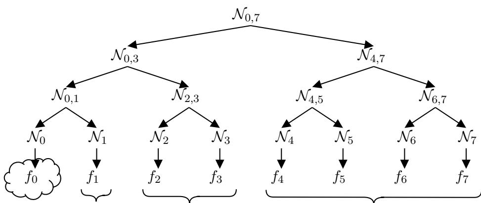  
Figure 3.8: Suppose there are eight branches $f _ { 0 }$ through $f _ { 7 }$ , and suppose $E$ guesses that $f _ { 0 }$ is active. If the active branch is in the subtree $\mathcal { N } _ { 4 , 7 } , E$ will generate the same garbage material for the entire subtree, regardless of which specific branch $f _ { 4 } , . . . , f _ { 7 }$ is active. By extension, $f _ { 0 }$ can only be evaluated against log $8 = 3$ garbage material strings: one for each sibling subtree (sibling subtrees are bracketed). Hence $f _ { 0 }$ has only three possible sets of garbage output labels.

significantly smaller garbling. This observation corresponds to the following refactoring:

$$
\begin{array}{c} \text {while} (e _ {0}) \{s _ {0} \}; \text {while} (e _ {1}) \{s _ {1} \} \\ \implies \\ \text {while} (e _ {0} \lor e _ {1}) \{\text {if} (e _ {0}) \{s _ {0} \} \text {else} \{s _ {1} \} \} \end{array}
$$

where $s _ { i }$ are nested programs and $e _ { i }$ are predicates on program variables.<sup>4</sup> The right hand side is friendlier to SGC, since it substitutes a loop by a conditional. Now, consider that $s _ { 0 }$ and $s _ { 1 }$ might themselves have conditionals that can be flattened into a single conditional with all branches. By repeatedly applying such refactorings, even modest programs can have conditionals with high branching factors. High-performance branching, enabled by our approach, allows the eficient and secure evaluation of such programs.

## 3.5.2 O(b log b) Stacked Garbling

LogStack reduces SGC computation to $O ( b \log b )$ . The constants are also low: altogether (1) G garbles ${ \frac { 3 } { 2 } } b$ log b + b branches, (2) G evaluates b log b branches, (3) E garbles b log b branches, and (4) E evaluates b branches.

A strawman for comparison. As a strawman (and as presented in [HK20a]), suppose we do not handle branches $f _ { 0 } , . . . , f _ { b - 1 }$ recursively, but we instead arrange the branches into a vector. G garbles each branch, yielding materials $M _ { 0 } , . . . , M _ { b - 1 }$ . He then computes:

$$
M _ {c o n d} \triangleq \bigoplus_ {i} M _ {i}
$$

G sends $M _ { c o n d }$ to $E .$ .

At runtime, exactly one branch will be active. Per the stacked garbling technique, we can arrange that E will one-by-one guess which branch is active. Consider the instance where E guesses that branch guess is active. E will garble each branch $f _ { i \neq g u e s s }$ and attempt to unstack the material $M _ { g u e s s }$

Since E incorrectly garbles the active branch, the garbage from branch guess depends on the identity of the active branch. Namely, E computes the following garbage material:

$$
M _ {t r u t h} \oplus M _ {t r u t h} ^ {\prime} \oplus M _ {g u e s s}
$$

Where truth denotes the active branch. Each distinct garbage material for branch guess will lead E to compute distinct garbage output. There are a quadratic number of possible (truth, guess) pairs, and hence $O ( b ^ { 2 } )$ possible garbage outputs, each of which G must be precompute.

Our strategy. Instead, suppose we organize the b branches $f _ { 0 } , . . . , f _ { b } .$ <sub>−1</sub> into a binary tree. The tree groups branches and unifies processing.

Fix one of b choices for guess. In contrast with the strawman approach, which considers b choices for truth independently from guess, we define truth in relation to guess, and consider fewer truth options. Namely, we let truth denote the sibling subtree (see notation in Section 4.4) of guess that contains the active branch. Given a fixed incorrect guess, there are only log b choices for truth.<sup>5</sup> While we have redefined truth, the active branch ID s continues to point to the single active branch. Our garbled gadgets compute functions of s.

For concreteness, consider the illustrative example of an 8-leaf tree in Figure 3.8 where guess = 0. Our discussion generalizes to arbitrary b and guess.

## 3.5. Improving Computation

<div class="mineru-algorithm" style="white-space: pre-wrap; font-family:monospace;">
INPUTS
- Parties input the active branch id {{s}}.
- Parties agree on the number of branches b.
OUTPUT:
- G outputs a sequence of seeds that form a binary tree:
 $S_{0,b-1}, S_{0,\frac{b-1}{2}}, S_{\frac{b-1}{2}+1,b-1}, \ldots, S_{0}, S_{1}, \ldots S_{b-1} \in \{0,1\}^{\kappa}$ 
Here,  $S_{0,b-1}$  is chosen uniformly; every other seed is derived from its parent by a PRG.
- G outputs a sequence of garbage seeds that form a binary tree.
 $S_{0,b-1}^{\prime}, S_{0,\frac{b-1}{2}}^{\prime}, S_{\frac{b-1}{2}+1,b-1}^{\prime}, \ldots, S_{0}^{\prime}, S_{1}^{\prime}, \ldots S_{b-1}^{\prime} \in \{0,1\}^{\kappa}$ 
- E outputs a sequence of seeds that form a binary tree:
 $S_{0,b-1}^{E}, S_{0,\frac{b-1}{2}}^{E}, S_{\frac{b-1}{2}+1,b-1}^{E}, \ldots, S_{0}^{E}, S_{1}^{E}, \ldots S_{b-1}^{E} \in \{0,1\}^{\kappa}$ 
such that for each node N:
 $S_{N}^{E} = \begin{cases} S_{N}, &amp; \text{if } N \text{ is a sibling root of } s \\ S_{N}^{\prime}, &amp; \text{otherwise} \end{cases}$ 
where  $S_{N}^{\prime}$  is a uniform string indistinguishable from  $S_{N}$ .
PROCEDURE:
- The Sorting Hat is straightforwardly implemented from Boolean operations and encryptions of the output seeds. We accordingly do not elaborate further.
- The Sorting Hat requires that G send to  $E O(b \cdot \kappa)$  bits of material, proportional to the binary tree.
</div>

Figure 3.9: The Sorting Hat is responsible for conveying only the sibling root seeds of s to E. For every other node, E obtains a diferent, but indistinguishable, seed that, when garbled, generates garbage material. Sorting Hat is easily implemented as a GC gadget (i.e., built from garbled rows).

Consider the four scenarios where one of the branches $f _ { 4 } - f _ { 7 }$ is active. These four scenarios each correspond to $t r u t h = 1 \colon f _ { 4 } - f _ { 7 }$ each belong to the level-1 sibling subtree of $f _ { 0 }$ . We ensure that $E { ^ \circ } \mathrm { s }$ unstacking and evaluation in each of these four cases is identical, and hence she evaluates to the same garbage output labels in these four cases. In general, for each sibling subtree we achieve identical processing for each leaf.

## G’s Actions

In the context of Figure 3.8, G garbles branches $f _ { 0 } , . . . , f _ { 7 }$ as follows. G chooses a uniform seed for the root of the tree and uses it to pseudorandomly derive seeds for each tree node. This is done in the standard manner: Let F denote a PRF. The immediate children of a seed $S$ are chosen as $F _ { S } ( 0 )$ and $F _ { S } ( 1 )$ ). G uses each leaf seed $S _ { i }$ to garble the corresponding branch $f _ { i }$ and stacks the resulting material: $M = \oplus _ { i } M _ { i }$ . This material M is the large string that G ultimately sends across the network to E. We note two facts about M and about the active branch s.

– Correctness: If E obtains the log b seeds of the sibling roots of s, then she can recursively derive the seeds for each other leaf $S _ { i \neq s }$ , reconstruct material $M _ { i \neq s }$ unstack $M \oplus M _ { i \neq s } = M _ { s }$ , and correctly evaluate $f _ { s }$

– Security: E must not obtain correct seeds corresponding to any ancestor of s. Otherwise, E could derive $G \mathrm { { } s }$ shares of garbled values, allowing her to decode values in $f _ { s }$

G generates and sends to E a small (linear in the number of branches with small constants) garbled gadget that we call the Sorting Hat.<sup>6</sup> The Sorting Hat helps E to reconstruct branch material. The Sorting Hat takes as input $\{ \{ s \} \}$ and produces for E candidate seeds for each node in the tree. For each node ${ \mathcal { N } } ,$ E is given a correct seed $S _ { \mathcal { N } }$ if and only if $\mathcal { N }$ is a sibling root of the leaf s (see Figure 3.9). Importantly, for each other node ${ \mathcal { N } } ,$ E will node obtain $S _ { \mathcal { N } }$ , but will instead obtain some distinct but indistinguishable uniform string.

Example 3.2 (The Sorting Hat’s behavior). Suppose that in Figure 3.8 the active branch is $s = 4$ . In this case, the Sorting Hat outputs to E correct seeds $S _ { 0 , 3 } , S _ { 6 , 7 } , S _ { 5 }$ For each other node, the Sorting Hat outputs garbage seeds. If instead $s = 3$ , then the Sorting Hat outputs the correct seeds $S _ { 4 , 7 } , S _ { 0 , 1 } , S _ { 2 }$ . The garbage seeds in both cases, e.g. for node $\mathcal { N } _ { 4 , 5 } ,$ , are the same.

## 3.5. Improving Computation

## Actions of E

E uses the Sorting Hat to obtain a tree of random-looking seeds; in the tree, only log b seeds just of the path to s (corresponding to s’s sibling roots) are correct. E guesses that branch guess is active; she uses only the sibling seeds of guess to derive all $b - 1$ leaf seeds not equal to guess. She then garbles the b − 1 branches $f _ { i }$ and unstacks the corresponding materials $M _ { i }$

If guess = s, E derives the intended leaf seeds $S _ { i \neq s }$ , unstacks the intended materials $M _ { i \neq s }$ , and obtains the correct material $M _ { s }$ . If guess 6= s, then E reconstructs the wrong branch material from the wrong seeds. Since E never receives any additional valid seeds, there is no security loss. We next see that the number of diferent garbage labels we must collect is small, and further that they can be collected eficiently.

## Counting cost

Let us count how many times each party must garble/evaluate a branch. Consider branch $f _ { i }$ . E garbles this branch log b times, once with a seed (ultimately) derived from each seed on the path to the root. E evaluates $f _ { i }$ exactly once. In total, E garbles b log b times and evaluates b times.

To construct the garbage collecting multiplexer, G must precompute all possible garbage outputs. We demonstrate that the total cost to the generator is O(b log b).

Recall that our goal was to ensure that E constructs the same garbage output for a branch $f _ { i }$ in each scenario where s is in some fixed sibling subtree of $f _ { i }$ . The Sorting Hat ensures that E obtains the same sibling root seeds in each of these scenarios, and therefore she constructs the same material. Since there are log b sibling subtrees of $f _ { i }$ , $f _ { i }$ has only log b possible garbage output labels. To emulate E in all settings and obtain all possible garbage output labels, G must garble and evaluate each branch log b times.

## A note on nesting

Nested branches with complex sequencing of instructions emerge naturally in many programs. LogStack operates over vectors of branches and treats them as binary trees. This may at first seem like a disadvantage, since at the time the first nested branching decision is made, it may not yet be possible to make all branching decisions. There are two natural ways LogStack can be used in such contexts:

1. Although we advocate for vectorized branching, LogStack does support nested evaluation. Nesting is secure and correct, but we do not necessarily recommend it. Using LogStack in this recursive manner reintroduces the high computation complexity of Figure 3.7.

2. Refactorings can be applied to ensure branches are vectorized. For example, consider the following refactoring:

$$
\begin{array}{r l} & i f (e _ {0}) \{s _ {0}; i f (e _ {1}) \{s _ {1} \} e l s e \{s _ {2} \} \} e l s e \{s _ {3}; s _ {4} \} \\ & \qquad \Longrightarrow \\ & i f (e _ {0}) \{s _ {0} \} e l s e \{s _ {3} \}; s w i t c h (e _ {0} + e _ {0} e _ {1}) (s _ {4}; s _ {2}; s 1) \end{array}
$$

Where $s _ { i }$ are programs, $e _ { i }$ are predicates on program variables, and where $s _ { 0 }$ , s<sub>3</sub> do not modify variables in $e _ { 0 }$ . This refactoring replaces a nested conditional by a sequence of two ‘vectorized’ conditionals. Hence, the output is amenable to LogStack’s eficient procedure.

## 3.5.3 Memory Eficiency

Consider b branches, each of which requires $O ( n )$ bits of material. Because of LogStack’s binary tree structure, we can arrange that only $O ( n \cdot \log b )$ space is needed. This is in contrast with [HK20a]’s vectorized approach, where $O ( n \cdot b )$ space is needed.

In short, LogStack saves space by eagerly stacking material as it is constructed. Consider again the example in Figure 3.10 where $E$ guesses that $f _ { 0 }$ is active. Recall that she garbles the entire right subtree starting from her seed for node $\mathcal { N } _ { 4 , 7 }$ , and $G$ emulates this same behavior with a garbage seed. In this scenario, the material of each individual branch, say $M _ { 4 }$ , is not interesting or useful. Only the stacked material $M _ { 4 } \oplus . . . \oplus M _ { 7 }$ is useful for handling $f _ { 0 }$ (and, indeed, for handling each branch in the subtree $\mathcal { N } _ { 0 , 3 } )$ . Thus, instead of storing each branch’s material, the parties XOR material as soon as it is available. This trick is the basis for our low space requirement.

There is one caveat to this trick: the ‘good’ garbling of each branch $f _ { i }$ is useful throughout $G \mathrm { { } s }$ emulation of E. Hence, the straightforward approach would be for G

## 3.5. Improving Computation

to once and for all compute the good garblings of each branch and store them in a vector, consuming $O ( n \cdot b )$ space. This is viable, and indeed has lower runtime constants than presented elsewhere: G would garble only b log b + b times. We instead trade in some concrete time complexity in favor of dramatically improved space complexity. G garbles the branches using good seeds an extra ${ \frac { 1 } { 2 } } b \log$ b times, and hence garbles a total of ${ \frac { 3 } { 2 } } b \log b + b$ times. This extra work allows G to avoid storing a large vector of materials, so G’s procedures run in $O ( n \log b )$ space.

## 3.5.4 Procedures

We formalize LogStack’s procedures for evaluating vectors of branches. Unlike other procedures in this dissertation, G’s and E’s high level actions difer quite significantly. Thus, we start by presenting their procedures separately. We then unify the separate procedures into a top level garbled procedure.

## Garbling subtrees

We start with a broadly useful procedure that is used by both parties. Recall, we organize branches into binary trees. For each tree node, G and E each perform a common task: they garble each branch in the subtree rooted at that node and stack together all material. These subtrees are garbled according to seeds given by the Sorting Hat, which was formally defined in Figure 3.9. GarbleSubtree (Figure 3.10) performs the basic task of garbling and stacking an entire subtree.

GarbleSubtree recursively descends through the subtree starting from its root, uses a PRF to derive child seeds from the parent seed. At the leaves, GarbleSubtree garbles the branches. As the recursion propagates back up the tree, the procedure stacks the branch materials together (and concatenates input/output encoding information).

Both G and E invoke GarbleSubtree at each node. This entails that each party garbles each branch $f _ { i }$ more than once, but with diferent seeds. As discussed in Section 3.5.2, this repeated garbling is key to reducing the total number of garbage outputs that E can compute.

<div class="mineru-algorithm" style="white-space: pre-wrap; font-family:monospace;">
INPUT:
- A tree node $\mathcal{N}_{i,j}$ where the leaves of the tree store branches of a conditional.
- A seed $S_{i,j} \in \{0,1\}^n$.

OUTPUT:
- Stacked material $M_i \oplus \ldots \oplus M_j$ for the branches.
- Global offsets $\Delta_i \ldots \Delta_j$, input languages $X_i \ldots X_j$, and output languages $Y_i \ldots Y_j$ for each branch.

PROCEDURE GarbleSubtree:
- If $\mathcal{N}_{i,j}$ is a leaf ($i = j$), garble the stored branch $f_i$ and output the result:
$(M_i, \Delta_i, X_i, Y_i) \leftarrow Garble(f_i, S_{i,j})$
- Let $\mathcal{N}_{i,k}, \mathcal{N}_{k+1,j}$ denote the left and right child of $\mathcal{N}_{i,j}$.
- Generate seeds for the children:
$S_{i,k} \triangleq F_S(0)\quad S_{k+1,j} \triangleq F_S(1)$
- Recursively garble the children:
$(M_L, \Delta_L, X_L, Y_L) \leftarrow GarbleSubtree(\mathcal{N}_{i,k}, S_{i,k})$ $(M_R, \Delta_R, X_R, Y_R) \leftarrow GarbleSubtree(\mathcal{N}_{k+1,j}, S_{k+1,j})$
- XOR the material, concatenate the language components, and output:
$(M_L \oplus M_R, \Delta_L \mid \Delta_R, X_L \mid X_R, Y_L \mid Y_R)$
</div>

Figure 3.10: The helper procedure GarbleSubtree starts from a single seed at the root of a subtree $\mathcal { N } _ { i , j } ,$ derives all seeds in the subtree, garbles all branches in the subtree, and stacks (using XOR) all resultant material. The procedure also outputs the input/output languages for all branches.

<div class="mineru-algorithm" style="white-space: pre-wrap; font-family:monospace;">
INPUT:
- A tree node $\mathcal{N}_{i,j}$ where the leaves of the tree store branches of a conditional. Each tree node is labelled by $E$'s seed $S_{i,j}$.
- Input labels $X_i, ..., X_j$ for each branch in the subtree.
- Material $M$, which $E$ interprets as the XOR of material in this subtree $M_i \oplus ... \oplus M_j$.

OUTPUT:
- A sequence of labels $Y_i^E, ..., Y_j^E$ that together encode $E$'s output from each branch.

PROCEDURE EvaluateSubtree:
- If $\mathcal{N}_{i,j}$ is a leaf, evaluate branch $f_i$ and output the result:
$Y_i^E \leftarrow Evaluate(f_i, X_i, M)$
- Let $\mathcal{N}_{i,k}, \mathcal{N}_{k+1,j}$ denote the left and right child of $\mathcal{N}_{i,j}$. Let $S_{i,k}, S_{k+1,j}$ denote the seeds corresponding to these child subtrees.
- Garble the right subtree and recursively evaluate the left child subtree:
$(M_R, \cdot, \cdot, \cdot) \leftarrow GarbleSubtree(\mathcal{N}_{k+1,j}, S_{k+1,j})$ $Y_L^E \leftarrow EvaluateSubtree(\mathcal{N}_{i,k}, (X_i, ..., X_k), M \oplus M_R)$

Note that if $S_{k+1,j}$ is a valid seed, then $M_R$ is indeed the stacked material from branches in the right subtree, so $M \oplus M_R$ is indeed stacked material from branches in the left subtree.
- Symmetrically evaluate the right child subtree:
$(M_L, \cdot, \cdot, \cdot) \leftarrow GarbleSubtree(\mathcal{N}_{i,k}, S_{i,k})$ $Y_R^E \leftarrow EvaluateSubtree(\mathcal{N}_{k+1,j}, (X_{k+1}, ..., X_j), M \oplus M_L)$
- Concatenate and output: $Y_L^E \mid Y_R^E$
</div>

Figure 3.11: The helper procedure EvaluateSubtree starts from a stacked piece of material and a tree of seeds given by the Sorting Hat. It recursively descends the branch tree, at each node recursively evaluating the left (resp. right) child by first garbling the right (resp. left) child. At the leaves, EvaluateSubtree evaluates normally. The procedure returns the concatenation of all outputs from each branch in the subtree.

## Evaluating conditionals

We formalize E’s primary subprocedure for evaluating conditions, EvaluateSubtree (Figure 3.11). EvaluateSubtree carefully manages material and uses the garblings of sibling subtrees to evaluate each branch while limiting the possible number of garbage outputs. EvaluateSubtree is a formalization of the high level procedure described in Section 3.5.2: E recursively descends through the tree, constructing and unstacking garblings of sub trees in the general case. When she finally reaches the leaf nodes, she evaluates.

In the crucial case $i = s$ , E will have correctly unstacked all material except $M _ { s }$ because she holds valid seeds for the sibling roots of s. Hence, she evaluates correctly. All other cases $i \neq s$ will lead to garbage outputs that G must also compute.

## Predicting garbage

G must predict all possible garbage outputs that E could compute. He achieves this by running the ComputeGarbage procedure (Figure 3.12). This procedure recursively descends the tree while maintaining two key variables: (1) M holds the correct material for the current subtree $\mathcal { N } _ { i , j }$ and (2) M<sup>0</sup> holds a vector of garbage materials of the incorrectly garbled sibling roots of $\mathcal { N } _ { i , j }$ . In the general case, these variables are simply appropriately updated via calls to GarbleSubtree.

Once we reach a leaf, the garbage material for each sibling root of the considered leaf is available. Additionally, all garbage inputs into each branch are available. So, at the leaves we can compute all garbage outputs for each branch by evaluating the branch with proper combinations of garbage material and labels. Ultimately, ComputeGarbage outputs the concatenation of all garbage outputs from each branch.

## The garbled procedure

Finally, we compose our subprocedures into the top level procedure for handling conditionals (Figure 3.13). This procedure is a relatively straightforward composition of the Sorting Hat, a demultiplexer, a multiplexer, and the other procedures in this section.

<div class="mineru-algorithm" style="white-space: pre-wrap; font-family:monospace;">
INPUT:
- A tree node $\mathcal{N}_{i,j}$ where the leaves of the tree store branches of a conditional. Each node in the tree is labelled by (1) a valid seed $S_{i,j}$ and (2) a garbage seed $S_{i,j}^{\prime}$. Additionally, each leaf $\mathcal{N}_i$ is labelled by a garbage input $\bot_i$.
- A vector of a logarithmic number of materials $M'$ where $M_i'$ is the garbage material derived from the $i$-th sibling subtree of $\mathcal{N}_{i,j}$.
- Material $M$ which is the XOR of all valid materials from the subtree $\mathcal{N}_{i,j}$.

OUTPUT:
- A vector $\bot'$ of each possible garbage output from each branch in the subtree.

PROCEDURE ComputeGarbage:
- If this is a leaf, evaluate on all possible combinations of garbage material. I.e., consider the logarithmic possible positions of the sibling root that holds the active branch $s$. For each possible level $i$, construct and evaluate with the following material:

$M \oplus \left( \bigoplus_{j \geq i} M_j' \right)$

Let $\bot_i$ denote the vector of the resulting logarithmic number of garbage outputs.
- Let $\mathcal{N}_{i,k}, \mathcal{N}_{k+1,j}$ denote the left (resp. right) child of $\mathcal{N}_{i,j}$. Let $S_{i,k}', S_{k+1,j}'$ denote the garbage seeds for these children. Let $S_{i,k}$ denote the valid seed for the left child.
- Compute valid material for each subtree:

$(M_L, \cdot, \cdot, \cdot) \leftarrow GarbleSubtree(\mathcal{N}_{i,k}, S_{i,k}) \quad M_R \leftarrow M \oplus M_L$

- Compute the garbage material for each subtree:

$(M_L', \cdot, \cdot, \cdot) \leftarrow GarbleSubtree(\mathcal{N}_{i,k}, S_{i,k}')$ $(M_R', \cdot, \cdot, \cdot) \leftarrow GarbleSubtree(\mathcal{N}_{k+1,j}, S_{k+1,j}')$

- Recursively generate all possible garbage outputs from each subtree:

$\bot_L \leftarrow ComputeGarbage(\mathcal{N}_{i,k}, M' \mid M_R', M_L)$ $\bot_R \leftarrow ComputeGarbage(\mathcal{N}_{k+1,j}, M' \mid M_L', M_R)$

- Concatenate and output $\bot_L \mid \bot_R$.
</div>

Figure 3.12: G’s procedure for emulating $E \mathrm { { ^ { * } s } }$ garbage evaluation. This subprocedure eficiently constructs each of $E \mathrm { { ^ { * } s } }$ garbage outputs for each branch.

<div class="mineru-algorithm" style="white-space: pre-wrap; font-family:monospace;">
INPUT:
- $b = 2^k$ branch functions $f_{i \in [b]}$ each with $n$ inputs and $m$ outputs:
$f_i : \{0,1\}^n \to \{0,1\}^m$
- A garbled string $\{x\}$ where $x \in \{0,1\}^n$.
- A garbled selection string $\{s\}$ where $s \in \{0,1\}^k$.
OUTPUT:
- The garbled output of the $s$-th function $\{f_s(x)\}$
PROCEDURE:
- $G$ and $E$ place the $b$ branches at the leaves of a binary tree $\mathcal{N}_{0,b-1}$.
- $G$ and $E$ evaluate a Sorting Hat on $\{s\}$ (Figure 3.9). Let $S_{i,j}, S_{i,j}'$ denote $G$'s valid/garbage seed for each node. Let $S^E$ denote $E$'s seeds.
- $G$ garbles the conditional using valid seeds:
$(M_{cond}, \Delta_i, X_i, Y_i) \leftarrow GarbleSubtree(\mathcal{N}_{0,b-1}, S_{0,b-1})$
- $G$ sends $M_{cond}$ to $E$.
- Parties evaluate a demultiplexer on $\{s\}$ and $\{x\}$ (simple generalization of Figure 3.5). $G$ passes each input language $X_i$ and each global offset $\Delta_i$ as auxiliary input. Let $X_i^E$ denote $E$'s resulting input labels for each branch. Let $\bot_i^G$ denote the garbage into each branch. Note that $X_s^E$ is a valid encoding; all other branches receive garbage input.
- $E$ evaluates based on her tree of seeds. She labels the tree with her seeds, then calls:
$Y_i^E \leftarrow EvaluateSubtree(\mathcal{N}_{0,b-1}, (X_0^E, ..., X_{b-1}^E), M_{cond})$
- $G$ predicts all possible garbage outputs $E$ could have computed. He labels the tree with his valid and garbage seeds, labels each leaf $i$ with the garbage input $\bot_i$, and calls:
$\bot' \leftarrow ComputeGarbage(\mathcal{N}_{0,b-1}, M_{cond}, M_{cond})$ $G$ and $E$ evaluate a multiplexer (simple generalization of Figure 3.6). As input, they pass $\{s\}$; $G$ passes each $Y_i$, each $\Delta_i$, and all garbage $\bot'$; $E$ passes her branch outputs $Y_i^E$. $G$ and $E$ receive $\{f_s(x)\}$, and they output this garbling.
</div>

Figure 3.13: The LogStack procedure for handling one out of b branches where neither party knows the executed branch. LogStack allows G to XOR material from each branch. In contrast to Figure 3.7, these procedures keep the number of possible garbage output labels under control by grouping branches into a binary tree. For b branches that each require $O ( n )$ bits of material, these procedures require $O ( n )$ bits of material and run in $O ( n \cdot b \log b )$ time and $O ( n \cdot \log b )$ space.

## 3.6 Performance

## 3.6.1 Experimental Setup

We implemented LogStack in ∼ 2000 lines of C++. Our branches are composed from ANDs and XORs implemented via the half-gates technique [ZRE15]. Garblings are 128 bits long. Hence our security parameter $\kappa = 1 2 7 ;$ ; the 128th bit is reserved for the least significant bit. We compare LogStack to two baselines:

– Basic half-gates (Section 1.3, [ZRE15]): Here, we implement conditionals by the standard strategy (Figure 3.1). This baseline shows the communication advantage of SGC.

– Basic SGC (Section 3.4): We implemented [HK20a]’s extension of (Figure 3.7) to vectors of branches. For branches that each use O(N ) bits of material, this approach uses only O(n) communication, but uses $O ( n \cdot b ^ { 2 } )$ computation. This baseline shows the improvement given by the techniques in Section 3.5.

Our implementation takes advantage of inherent parallelism: while garbling/evaluating branches, we spawn additional threads.

Computation Setup. For each experiment, we ran both G and E on a single commodity laptop: a MacBook Pro laptop with an Intel Dual-Core i5 3.1 GHz processor and 8GB of RAM. The two parties run in parallel on separate processes on the same machine.

We ran experiments on three simulated network settings: (1) a WAN with 100Mbps bandwidth and 20ms latency, (2) a WAN with 300Mbps bandwidth and 20ms latency, and (3) a LAN with 1Gbps bandwidth and 2ms latency.

## 3.6.2 Experimental Performance

We constructed an experiment that conditionally composes copies of the SHA-256 function (47, 726 ANDs per branch). The material for each branch is thus 1.45 MB long. While a more realistic conditional would include a variety of branches, our goal is to isolate a precise performance impact. We varied the number of branches between 1 and 64 and measured communication, wall-clock time, and memory consumption. Results from each experiment were averaged over 10 runs and are plotted in Figures 3.14 and 3.15.

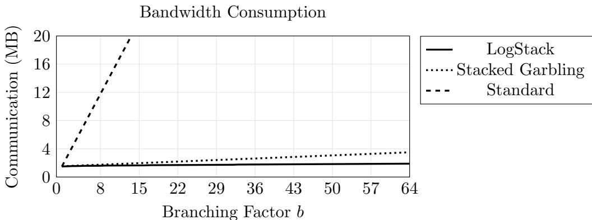

100Mbps Bandwidth Channel  
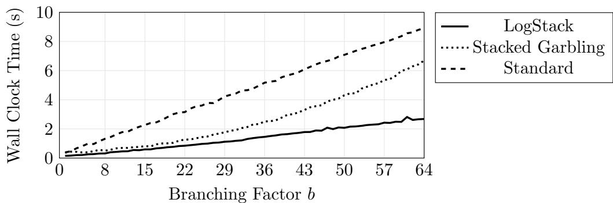

300Mbps Bandwidth Channel  
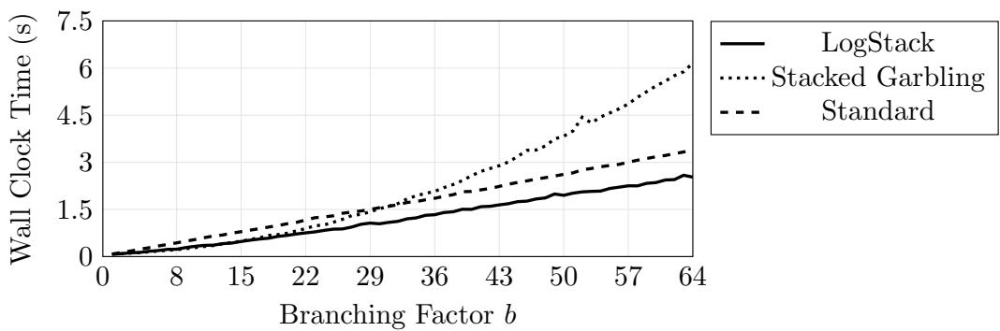

1Gbps Bandwidth Channel  
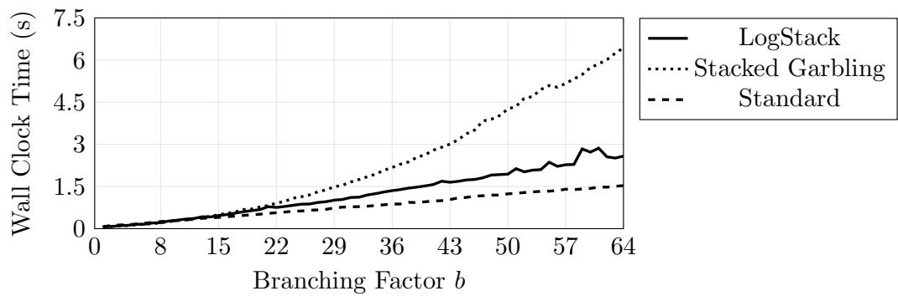  
Figure 3.14: Experimental evaluation of LogStack as compared to [HK20a]’s vectorized SGC approach and to basic half-gates [ZRE15]. We compare both in terms of communication and in terms of wall-clock time on diferent network settings.

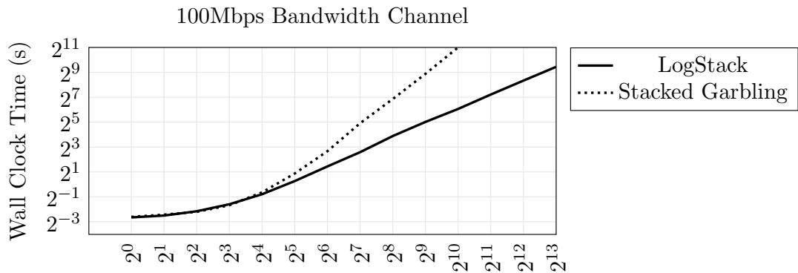

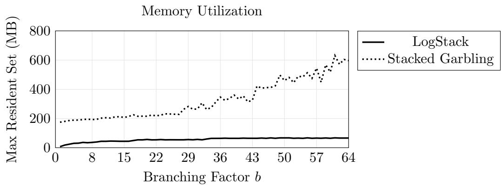  
Figure 3.15: Comparing LogStack to [HK20a]’s vectorized SGC approach. These results show LogStack’s improved space complexity and its ability to scale to large numbers of branches.

Bandwidth consumption. As expected, SGC communication remains almost constant, while the standard approach requires communication that grows linearly and immediately dominates. LogStack is slightly leaner than the SGC baseline because of low-level improvements to the demultiplexer. This small improvement should not be counted as a significant advantage.

Wall-clock time. We plot three charts for 1 to 64 branches (on networks with 100, 300, and 1000 Mbps bandwidth) comparing each of the three approaches.

– In the 1Gbps network setting standard GC leads. The two cores on our laptop cannot keep up with the available network capacity. However, doubling the number of cores would already put us ahead of standard, and any further computation would improve our advantage.

– In the 300Mbps network setting, we outperform standard.

– The 100Mbps setting clearly shows the advantage of SGC. Both SGC-based approaches handily beat the standard approach

We also explored larger branching factors, running conditionals with branching factors at every power of 2 from $2 ^ { 0 }$ to $2 ^ { 1 3 }$ in the 100Mbps setting. LogStack scales well; we ran up to 8192 branches as it was suficient to show a trend. Due to its logarithmic space complexity, LogStack would run on a practically arbitrary number of branches. In contrast, the SGC baseline does not scale well. We ran up to 1024 branches with, enough to show a trend, and after which our experiments started to take too long. LogStack ran a 1024-branch conditional in $\sim 6 7 s$ , while the SGC baseline took ∼ 2050s. Here, the LogStack optimizations give a ∼ 31× improvement.

Memory utilization. We compare LogStack’s memory utilization to the SGC baseline (the standard technique can use constant memory, since material can be streamed across the network and immediately discarded). Our chart shows [HK20a]’s linear and LogStack’s logarithmic space space complexity. In settings with many branches, improved space consumption is essential. For example, we ran LogStack on a conditional

## 3.7. Stackability

with 8192 SHA-256 branches, a program that uses 385 million ANDs. Our peak memory usage was ∼ 100MB, while [HK20a] would require more than 12GB to run this experiment.

## 3.7 Stackability

SGC allows us to stack together branch material. However, not all material can be stacked. There is a security concern that arises if we are not careful.

Recall that E both correctly and incorrectly handles branches. When she incorrectly handles a branch, she will incorrectly unstack material, resulting in a string that is the XOR of diferent branch materials derived from various seeds. For security, it is crucial that E cannot distinguish her correct from her incorrect handling. Otherwise, E would learn the identity of the active branch. Thus, we must ensure that when E correctly unstacks material, it looks the same as if she had incorrectly unstacked material.

We define a stackability property that specifies which garbled procedures produce material that can be safely stacked. Any such procedure can be used inside an SGC conditional branch. In short, a procedure is stackable if it produces material that appears uniformly random. This is suficient because both a correctly unstacked material and an incorrectly unstacked XOR of various materials will both be indistinguishable from a uniform string, and hence indistinguishable from one another:

Definition 3.1 (Stackability). Let f be a garbled procedure that maps input {{x}} for $x \in \{ 0 , 1 \} ^ { n }$ to {{y}} for $y \in \{ 0 , 1 \} ^ { m }$ . Let M denote the material that G sends to E due to f . We say that f is stackable if M is indistinguishable from a uniform string. I.e., let $M ^ { \prime } \in _ { \mathfrak { s } } \{ 0 , 1 \} ^ { | M | }$ :

$$
(\{\{x \} \}, M ^ {\prime}) \stackrel {c} {=} (\{\{x \} \}, M)
$$

Remark 3.1. Definition 3.1 syntactically difers from the strong stackability property given in [HK21b]. We can provide a simpler definition here because in this dissertation we limit ourselves to procedures that manipulate garblings (Definition 1.3). See [HK21b] for a definition that works for any GC technique, including those which may not explicitly manage Free XOR style garblings.

Remark 3.2. Not every procedure in this dissertation meets Definition 3.1. All of our procedures involve material that can be simulated, but there are some cases where pieces of the material are simulated by a distribution that is not a uniform string. For example, our one-hot based binary field inverse procedure (Figure 2.9) involves revealing to E a value from ${ \mathrm { G F } } ( 2 ^ { n } ) ^ { \times }$ . This revealed value is distinguishable from a uniformly random $\mathrm { s t r i n g } ^ { 7 }$ , so we cannot use our inverse procedure inside a conditional branch. In Chapter 5, we provide a full GC language. There, we categorize the techniques in this dissertation into those that can and cannot appear inside an SGC conditional.

Lemma 3.1. (One-hot stackability) The one-hot outer product procedure (Figure 2.3) is stackable.

Proof. Immediate from the definition the one-hot outer product simulator (see Lemma 2.3). The simulator simulates all material by sampling uniform strings. □

Lemma 3.1 implies that a variety of techniques from Chapter 2 are stackable. Indeed, the following can be safely stacked: XORs, outer products (and therefore ANDs), matrix products, binary field products, and accelerated integer products.

When we compose together many GC procedures, we simply concatenate material. Hence, it trivially holds that an arbitrary composition of stackable procedures is itself stackable. This allows us to build up complex branches that use a variety of low level operations.

## 3.8 Simulator

We prove SGC secure. Recall (Section 1.4) that we prove our constructions secure via modular simulators. We prove that our constructions can be composed with themselves and with each other in Chapter 5.

We prove that the LogStack procedure (Figure 3.13) can be simulated.

Lemma 3.2. Let $f _ { 0 } , . . . , f _ { b - 1 }$ be b functions for $b = 2 ^ { k }$ , each of which is handled by a stackable procedure (Definition 3.1). Let $\{ \{ x \} \}$ for $x \in \{ 0 , 1 \} ^ { n }$ be a garbled input. Let $\{ \{ s \} \}$ for $s \in \{ 0 , 1 \} ^ { k }$ be a garbled branch condition. Let M denote the material generated while evaluating $\{ f _ { s } ( x ) \}$ } (Figure 3.13). Assuming H is a circular correlation

## 3.8. Simulator

robust hash function (Definition 1.1), there exists a simulator $S ( ( f _ { 0 } , . . . , f _ { b - 1 } ) , \{ \{ x \} \} , \{ s \} )$ that outputs $M ^ { \prime }$ such that:

$$
(\{x \}, \{s \}, M ^ {\prime}) \stackrel {{c}} {{=}} (\{x \}, \{s \}, M)
$$

Proof. By construction of a simulator S.

S is notationally complex, but conceptually simple. Therefore, we simply explain S rather than exhaustively listing its formal procedure.

At a high level, S tracks E’s handling in Figure 3.13, copying each of E’s actions, but simulating material as it goes. The only interesting steps are as follows:

– Simulating the demux, the mux, and the Sorting Hat. Each of these gadgets (Figures 3.5, 3.6 and 3.9) is implemented by garbled tables. The material for each of these tables can be simulated by uniform material, thanks to the properties of H. See Section 1.4 for an example of how these gadgets can be simulated.

– Simulating the conditional material. In the real world procedure, G sends to E the XOR stacked material $M _ { c o n d }$ from GarbleSubtree. By the definition of GarbleSubtree, this material is simply the XOR of material produced by garbling each branch. We have assumed that each branch is garbled by a stackable procedure. Hence, each XORed material is indistinguishable from a uniform string, and so $M _ { c o n d }$ is also indistinguishable from a uniform string. S accordingly simulates $M _ { c o n d } ^ { \prime }$ by sampling a uniform string of the appropriate length.

This simulation is indistinguishable from real by a straightforward hybrid argument. Each piece of material is simulated by a uniform string and each is independent, thanks to H. □

Support for recursion. Notice that Lemma 3.2 simulates all material via uniform strings. Hence, the following is immediate:

Corollary 3.1. The LogStack procedure (Figure 3.13) is stackable (Definition 3.1).

Notice that this means we can use SGC recursively. I.e., we can safely use SGC conditional branching inside an SGC conditional branch. While this is safe, we do not necessarily recommend it, as discussed in Section 3.5.2. Using LogStack recursively incurs high computation.

## Chapter 4

## GARBLED RAM

So far, the techniques we have presented have been limited in that G and E must statically agree on how data flows through the program.

In real programs, this static information is not always available. Real programs manipulate pointers, arrays, and data structures, and the flow of data through these constructs is decided at runtime. If we wish to raise GC to the level of user programs, we must support these features.

Supporting these features requires eficient random access arrays. We need a block of memory from which the GC can quickly and dynamically read garbled values.

Given only the Boolean techniques from Chapter 1, it is possible to implement a garbled array. Boolean-circuit-based array accesses are called linear scans. Linear scans involve scaling each array element by zero/one such that when the scaled elements are XORed, the result is the desired array element. Unfortunately, linear scans are infeasibly expensive because we must operate on each array slot on each array access. Hence each array access incurs cost linear in the size of the array. For programs that require significant memory, this cost is impractical. If we are to make garbled arrays practical, more sophisticated techniques are required.

In this chapter, we present a new direction in Garbled RAM (GRAM). GRAM, originally presented by Lu and Ostrovsky [LO13], shows that it is possible to emulate RAM access inside GC while incurring only sublinear cost. Unfortunately, these initial attempts at GRAM introduce staggeringly high constant costs. Thus, while the approach was interesting, it was not eficient enough for practice.

Here, we present new insights into the GRAM problem. Our combined insights reduce the cost of GRAM by multiple orders of magnitude. This improved cost opens the door to GRAM implementations and to the first implementable constant round protocols for RAM programs.

## 4.1 Introduction

A GRAM implements two procedures. First, it implements a procedure that builds a fresh array with initial contents. Then, it implements an access procedure that allows the GC to read/write slots of the array. This second procedure should require only sublinear amortized resources.

While GRAM constructions are known [LO13, GHL<sup>+</sup>14, GLOS15, GLO15], none are suitable for practice: existing constructions simply cost too much. All existing GRAMs sufer from at least two of the following problems:

– Use of non-black-box cryptography. [LO13] showed that GRAM can be achieved by evaluating a PRF inside GC in a non-black-box way. Unfortunately, this non-black-box cryptography is extremely expensive, and on each access the construction must evaluate the PRF repeatedly. [LO13] requires a circular-security assumption on GC and PRFs. Follow-up works removed this circularity by replacing the PRF with even more expensive non-black-box techniques [GHL<sup>+</sup>14, GLOS15].

– Factor-κ blowup. Let κ denote the computational security parameter. In practical GC, we generally assume that we will incur factor κ overhead due to the need to represent each bit as a length-κ garbling. However, existing GRAMs sufer from yet another factor κ. This overhead follows from the need to represent GC languages (which have length κ) inside the GC such that we can manipulate them with Boolean operations. The garbling of a GC language has total length $\kappa ^ { 2 }$ . In practice, where we generally use κ = 128, this overhead is intolerable.

– High factor scaling. Existing GRAMs operate as follows. First, they give an array construction that leaks access patterns to E. This leaky array already has high cost. Then, they compile this array access into GRAM using of-theshelf ORAM. This compilation is problematic: of-the-shelf ORAMs require that,

## 4.1. Introduction

on each access, E access the leaky array a polylogarithmic (or more) number of times. Thus, existing GRAMs incur multiplicative overhead from the composition of the leaky array with the ORAM construction.

Prior GRAM works do not attempt to calculate their concrete or even asymptotic cost, other than to claim cost sublinear or polylogarithmic in n. However, a conservative estimate of existing GRAM cost (see [HKO21]) shows that the best prior GRAM breaks even with trivial linear-scan based GRAM when the RAM size reaches ≈ $2 ^ { 2 0 }$ elements. By the time it is worthwhile to use existing GRAM, each and every access uses 4GB of material.

## 4.1.1 Contribution

This chapter presents <sup>EpiGRAM</sup> a GRAM that uses only $O ( w \cdot \log ^ { 2 } n \cdot \kappa )$ computation and communication per access. <sup>EpiGRAM</sup> circumvents all three of the above problems:

– No use of non-black-box cryptography. We route array elements using lightweight, black-box cryptography.

– No factor-κ blowup. While we, like prior GRAMs, represent GC languages inside the GC itself, we give a novel generalization of the half AND gate (Figure 1.4) that eliminates the factor κ overhead.

– Low polylogarithmic scaling. Like prior GRAMs, we present a leaky construction that reveals access patterns to E. However, we do not compile this into GRAM using of-the-shelf ORAM. Instead, we give a custom construction designed with GC in mind. The result is a highly eficient technique.

In the remainder of this chapter we:

– Informally and formally describe <sup>EpiGRAM</sup>. For an array with n elements each of size w such that $w = \Omega ( \log ^ { 2 } n )$ , the construction incurs amortized $O ( w \cdot \log ^ { 2 } n \cdot \kappa )$ communication and computation per access.

– Analyze <sup>EpiGRAM</sup>’s asymptotic and concrete cost. Our analysis shows that <sup>EpiGRAM</sup> outperforms trivial linear-scan based RAM for as few as 512 128-bit elements.

– Prove <sup>EpiGRAM</sup> secure by constructing simulators. In Chapter 5, we integrate <sup>EpiGRAM</sup> into a garbling scheme [BHR12].

## 4.2 Overview

In this section, we explain our construction informally but with suficient detail to understand our approach. This overview covers four topics:

– First, we explain a problem central to GRAM: language translation.

– Second, we informally explain our lazy permutation network, which is a construction that eficiently solves the language translation problem.

– Third, as a stepping stone to our full construction, we explain how to construct leaky arrays from the lazy permutation network. This informal construction securely implements an array with the caveat that we let E learn the array access pattern.

– Fourth, we upgrade the leaky array to full-fledged GRAM: the presented construction hides the access pattern from E.

## 4.2.1 The language translation problem

Recall that for each bit x in a garbled computation, the parties must hold $\{ \{ x \} \} =$ $\langle X , X \oplus x \Delta \rangle$ . Notice that this means that the parties must in some sense agree on the language X. Normally this is not a problem: the structure of the computation is decided statically, and G can easily track which languages go where.

However, suppose we represent an array as a collection of garblings $\vartriangle { \mathbb { X } } _ { 0 } \ v y _ { 1 } . . . \ v y _ { \mathbb { X } ^ { } { n - 1 } } \ v y$ Suppose that at runtime the GC requests access to a particular index $\{ \alpha \}$ . We could use a combination of XORs and ANDs to compute $\{ x _ { \alpha } \}$ , but this would require an expensive linear-cost circuit. A diferent method is required to achieve the desired sublinear access costs.

Instead, suppose we disclose α to E in cleartext – we later add mechanisms that hide RAM indices from E. Since she knows α, E can directly access her α-th share $X _ { \alpha } \oplus x _ { \alpha } \Delta$ Unfortunately, it is not possible for G to predict the language $X _ { \alpha } .$ : α is computed at runtime and, due to the constant round requirement, E cannot send messages to G.

## 4.2. Overview

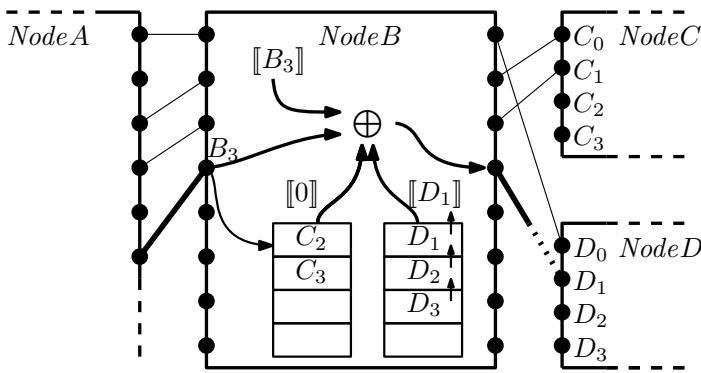  
Figure 4.1: An internal node of our lazy permutation network. We depict the fourth access to this node. The encoded input uses language $B _ { 3 }$ . We interpret the first encoded input bit as a flag that indicates to proceed left or right. Our objective is to forward the remaining input to either the left or right node. Each node stores two oblivious stacks that hold encodings of the unused languages of the two children. We conditionally pop both stacks. In this case, the left stack is unchanged whereas the right stack yields $D _ { 1 }$ the next language for the target child. Due to the pop, the remaining elements in the right stack move up one slot. $\mathrm { B y }$ XORing these values with an encoding of the input language, then opening the resulting value to $E _ { \mathrm { { i } } }$ , we convert the message to the language of the target child, allowing E to solder a wire to the child.

However, suppose we allow G to select a fresh language Y . If we can somehow convey to E the value $Y \oplus x _ { \alpha } \Delta$ , then the parties can construct $\langle Y , Y \oplus x _ { \alpha } \Delta \rangle = \{ \{ x _ { \alpha } \} \}$

Thus, our new goal is to translate $E \ ' \mathrm { s }$ share $X _ { \alpha } \oplus x _ { \alpha } \Delta$ to $Y \oplus x _ { \alpha } \Delta$ . Mechanically, this translation involves giving to E the value $X _ { \alpha } \oplus Y$ . Given this, E simply XORs the translation value with her label and obtains $Y \oplus x _ { \alpha } \Delta$ . In the circuit metaphor, providing such translation values to E allows her to take two wires – the wire out of the RAM and the wire into the next gate – and to solder these wires together at runtime. However, the problem of eficiently conveying translation values remains.

## 4.2.2 Lazy Permutations

Our current goal is to translate GC languages. Suppose that the GC issues n accesses over its runtime. Further suppose that the GC accesses a distinct location on each access – in the end we reduce general RAM to a memory with this restriction. To handle the n accesses, we wish to convey to E n translation values $X _ { i } \oplus Y _ { j }$ where $Y _ { j }$ is $G \mathrm { { } s }$ selected language for the jth access.

What we need then is essentially a permutation on n elements that routes between RAM locations (with language $X _ { i } )$ and accesses (with language $Y _ { j } )$ ). However, a simple permutation network will not sufice, since at the time of RAM access $j$ , the location of each subsequent access will, in general, not yet be known. Therefore, we need a lazy permutation whereby we can decide and apply the routing of the permutation one input at a time. We remind the reader that we assume that E knows each value α. I.e., we need only achieve a lazy permutation where E learns the permutation.

We give a construction that solves this problem for $O ( \kappa \cdot n \cdot \mathrm { p o l y l o g } ( n ) )$ cost, and hence only amortized $O ( \kappa \cdot \mathrm { p o l y l o g } ( n ) )$ cost per access. However, our solution requires that we apply this lazy permutation to the GC languages themselves, not to garbled bits stored in the RAM. Thus, we must manipulate GC languages inside GC.

Unfortunately, garbling a GC language leads to a highly objectionable factor κ blowup in the size of the GC: the garbling of a length-w language has length $w \cdot \kappa .$ We later show that the factor κ blowup is unnecessary. Under particular conditions, the half AND gate (Figure 1.4) can be generalized such that we can replace garblings of GC languages by sharings (Definition 1.4) of GC languages. I.e., a length-w language can be encoded by a length-w encoding. These special GC gates sufice to build the gadgetry we need. We formalize the needed gate in Section 4.5.1.

The ability to encode languages inside GC is powerful. Notice that since we can dynamically solder GC wires, and since wires can hold languages needed to solder other wires, we can arrange for E to repeatedly and dynamically lay down new wiring in nearly arbitrary ways.

## Lazy permutation network

With this high level intuition, we now informally describe our lazy permutation network. Let n be a power of two. Our objective is to route between the languages of n array accesses and the languages of n array elements.

G first lays out a full binary tree with n leaves. Each node in this tree is a circuit with static structure. However, the inputs and outputs to these circuits are loose wires, ready to be soldered at runtime by E.

Suppose that the GC wishes to access index $\{ \alpha \}$ and that we reveal α in cleartext to E. She looks up her share $X _ { \alpha } \oplus x _ { \alpha } \Delta$ . From here, our goal is to translate to a language Y chosen by G:

$$
\langle ????, X _ {\alpha} \oplus x _ {\alpha} \Delta \rangle \longrightarrow \langle Y, Y \oplus x _ {\alpha} \Delta \rangle
$$

## 4.2. Overview

E begins at the root of the tree where G has injected a sharing Y . Based on the GC encoding of the first bit of the index $\{ \alpha _ { 0 } \}$ , E is able to dynamically decrypt a translation value to either the left or the right child node. Now, E can solder wires to this child, allowing her to send to the child circuit both Y  and the remaining bits of $\{ \alpha \}$ . E repeatedly applies this strategy until she reaches the α-th leaf node. This leaf node is a special circuit that computes $\mathcal { C } ( [ [ x ] ] ) = [ [ x \oplus X _ { \alpha } ] ]$ and then reveals the output to $E . ^ { 1 }$ Since we have pushed Y all the way to this leaf, E obtains $Y \oplus X _ { \alpha }$ , the translation value that she needs to complete the garbling $\langle Y , Y \oplus x _ { \alpha } \Delta \rangle = \{ \{ x _ { \alpha } \} \}$

In yet more detail, each internal node on level k of the tree is a static circuit with 2<sup>log</sup> <sup>n−k</sup> loose sets of input wires. Each node maintains two stacks [ZE13]. The first stack stores sharings of the languages for the $2 ^ { \log n - k - 1 }$ loose input wires of the left child, and the second stack similarly stores languages for the right child (see Figure 4.1). On the j-th access and seeking to compute $Y _ { j } \oplus X _ { \alpha }$ , E dynamically traverses the tree to leaf α (recall, we assume E knows α in cleartext), forwarding $[ [ Y _ { j } ] ]$ all the way to the α-th leaf. At each internal node, she uses a bit of $\{ \alpha \}$ to conditionally pop the two stacks, yielding a sharing of the language of the correct child. The static circuit uses this sharing to compute a translation value to the appropriate child.

By repeatedly routing inputs over the course of n accesses, we achieve a lazy permutation. Crucially, the routing between nodes is not decided until runtime.

This construction is afordable. Essentially the only cost comes from the stacks. For a stack that stores languages of length w, each pop costs only $O ( w \cdot \log n )$ communication and computation (Section 4.5.2). Thus, the full lazy permutation costs only $O ( w \cdot n$ $\log ^ { 2 } n )$ communication, which amortizes to sublinear cost per access. We describe our lazy permutation network in full formal detail in Section 4.5.3.

Our lazy permutation networks route the language of each RAM slot to the access where it is needed, albeit in a setting where E views the routing in cleartext. Crucially, the lazy permutation network avoids factor κ additional overhead that is common in GRAM approaches. To construct a secure GRAM, we build on this primitive and hide the RAM access pattern.

## 4.2.3 Pattern-Leaking (Leaky) Arrays

As a stepping stone to full GRAM, we informally present an intermediate array which leaks access patterns. For brevity, we refer to it as leaky array. This construction handles arbitrary array accesses in a setting where E is allowed to learn the access pattern. We demonstrate a reduction from this problem to our lazy permutation network.

We never formally present the resulting construction. Rather, we explain the construction now for expository reasons: we decouple our explanation of correctness from our explanation of obliviousness. The ideas for this leaky construction carry to our secure GRAM (Section 4.2.4).

Suppose the GC wishes to read index α. Recall that our lazy permutation network is a mechanism that can help translate GC languages: E can dynamically look up a sharing of the language $[ [ X _ { \alpha } ] ]$ . However, because the network implements a permutation, it alone does not solve our problem: an array should allow many accesses to the same index, but the permutation can route each index to only one access. To complete the reduction, more machinery is needed.

To start, we simplify the problem: consider an array that handles at most n accesses. We describe an array that works in this restricted setting and later upgrade it to handle arbitrary numbers of accesses.

## Logical indices → one-time indices

The key idea is to introduce a level of indirection. While the GC issues queries via logical indices $\alpha ,$ our array stores its content according to a diferent indexing system: the content for each logical index α is stored at a particular one-time index p. As the name suggests, each one-time index may be written to and read at most once. This limitation ensures compatibility with a lazy permutation: since each one-time index is read only once, a permutation sufices to describe the read pattern.

Each one-time index can be read only once, yet each logical index can be read many times. Thus, over the course of n accesses, a given logical index might correspond to many one-time indices.

Neither party can a priori know the mapping between logical indices and one-time indices. However, to complete an access the GC must compute the relevant one-time

## 4.2. Overview

index. Thus, we implement the mapping as a recursively instantiated index $m a p . ^ { 2 }$ The index map is itself a leaky array where each index α holds the corresponding one-time index p. We are careful that the index map is strictly smaller than the array itself, so the recursion terminates; when the next needed index map is small enough, we instantiate it via simple linear scans.

A leaky array with n elements each of size w and that handles at most n accesses is built from three pieces:

1. A block of $2 n \mathrm { \ G C }$ encodings each of size w called the one-time array. We index into the one-time array using one-time indices.

2. A size-2n lazy permutation $\tilde { \pi }$ where each leaf i stores the language for one-time array slot i.

3. The recursively instantiated index map.

Suppose the parties start with a collection of n garbled values $\left\{ \left\{ x _ { 0 } \right\} \right\} , . . . , \left\{ \left\{ x _ { n - 1 } \right\} \right\}$ which they would like to use as the array content. The parties begin by sequentially storing each value $\left\{ \left\{ { { x } _ { i } } \right\} \right\}$ in the corresponding one-time index i. The initial mapping from logical indices to one-time indices is thus statically decided: each logical index i maps to one-time index i. The parties recursively instantiate the index map with content $\big \{ 0 \big \} \mu , . . . , \big \{ \mu - 1 \big \}$

When the GC performs its j-th access to logical index $\{ \alpha \}$ , we perform the following steps:

1. The parties recursively query the index map using input $\{ \alpha \}$ . The result is a one-time index $\{ p \}$ . The parties simultaneously write back into the index map $\lbrace n + j \rbrace$ , indicating that α will next correspond to one-time index $n + j$

2. The GC reveals p to $E$ in cleartext. This allows $E$ to use the lazy permutation network $\tilde { \pi }$ to find a translation value for the $p -$ th slot of the one-time array.

3. E jumps to the $p { \mathrm { - t h } }$ slot of the array and translates its language, soldering the value to the GC and completing the read. Note that the GC may need to access index α again, so the parties perform the next step:

4. The parties write back to the $( n + j )$ -th slot of the one-time array. If the access is a read, they write back the just-read value. Otherwise, they write the written value.

In this way, the parties can eficiently handle n accesses to a leaky array.

## Handling more than n accesses

If the parties need more than n accesses, a reset step is needed. Notice that after n accesses, we have written to each of the 2n one-time indices (n during initialization and one per access), but we have only read from n one-time indices. Further notice that on an access to index α, we write back a new one-time index for α; hence, it must be the case that the n remaining unread one-time array slots hold the current array content.

Going beyond n accesses is simple. First, we one-by-one read the n array values in the sequential logical order (i.e. with $\alpha = 0 , 1 , . . , n - 1 )$ , flushing the array content into a block $\left\{ \left[ x _ { 0 } \right] \right\} , . . . , \left\{ \left[ x _ { n - 1 } \right] \right\}$ . Second, we initialize a new leaky array data structure, using the flushed block as its initial content. This new data structure can handle n more accesses. By repeating this process every n accesses, we can handle arbitrary numbers of accesses.

## Summarizing the leaky array

Thus, we can construct an eficient leaky array. Each access to the leaky array costs amortized $O ( w \cdot \log ^ { 2 } n \cdot \kappa )$ bits of communication, due to the lazy permutation network. We emphasize the key ideas that carry to our secure GRAM:

– We store the array data according to one-time indices, not according to logical indices. This ensures compatibility with our lazy permutation network.

– We recursively instantiate an index map that stores the mapping from logical indices to one-time indices.

– We store the GC languages of the underlying data structure in a lazy permutation network such that E can dynamically access slots.

– Every n accesses, we flush the current array and instantiate a fresh one.

## 4.2.4 Garbled RAM

In Section 4.2.3 we demonstrated that we can reduce random access arrays to our lazy permutation network, so long as E is allowed to learn the access pattern. In this section we strengthen that construction by hiding the access patterns, achieving secure GRAM.

Note that this strengthening is clearly possible, because we can simply employ ofthe-shelf ORAM. In ORAM, the server learns a physical access pattern, but the ORAM protocol ensures that these physical accesses together convey no information about the logical access pattern. Thus, we can use our leaky array to implement physical ORAM storage, implement the ORAM client inside the GC, and the problem is solved.

We are not content with this solution. The problem is that our leaky array already consumes $O ( \log ^ { 2 } n )$ overhead, due to lazy permutations. In ORAM, each logical access is instantiated by at least a logarithmic number of physical reads/writes. Thus, compiling our leaky array with of-the-shelf ORAM incurs at least an additional O(log n) multiplicative factor. In short, this of-the-shelf composition is expensive.

We instead directly improve the leaky array construction (Section 4.2.3) and remove its leakage. This modification incurs only additive overhead, so our GRAM has the same asymptotic cost as the leaky array: $O ( w \cdot \log ^ { 2 } n \cdot \kappa )$ bits per access.

The key idea of our full GRAM is as follows: In regular ORAM, we assume that the client is significantly weaker than the server. In our case, too, the GC – which plays the client – is much weaker than E – who plays the server. However, we have a distinct advantage: the GC generator G can act as a powerful advisor to the GC, directly informing most of its decisions.

More concretely, our GRAM carefully arranges that the locations of almost all of the physical<sup>3</sup> reads and writes are decided statically and are independent of the logical access pattern. Thus, G can a priori track the static schedule and prepare for each of the static accesses. Our GRAM incurs $O ( \log ^ { 2 } n )$ physical reads/writes per logical access. However, only a constant number <sup>4</sup> of these reads cannot be predicted by G, as we will soon show.

Each physical read/write requires that G and E agree on the GC language of the accessed element. For each statically decided read/write, this agreement is reached trivially. Therefore, we only need our lazy permutation network for reads that G cannot predict. There are only a constant number of these, so we only need a constant number of calls to the lazy permutation network.

## Upgrading the leaky array

We now describe our GRAM. Our description is made by comparison to the leaky array described in Section 4.2.3.

In the leaky array, we stored all 2n one-time indices in a single block. In our GRAM, we instead store the 2n one-time indices across O(log n) levels of exponentially increasing size: each level i holds 2<sup>i+1</sup> elements, though some levels are vacant. As we will describe later, data items are written to the smallest level and then slowly move from small levels to large levels. Each populated level of the GRAM holds $2 ^ { i }$ one-time-indexed data items and $2 ^ { i }$ dummies. Dummies are merely garblings of zero. Each level of the GRAM is stored shufled. The order of items on each level is unknown to E but, crucially, is known to G. This means that at all times G knows which one-time index is stored where, and he knows which elements are dummies.

In the leaky array, E was pointed directly to the appropriate one-time index. In our GRAM, we need to hide the identity of the level that holds the appropriate index. Otherwise, since elements slowly move to larger levels, E will learn an approximation of the time at which the accessed element was written. We arrange that E will read from each level on each access. However, all except one of these accesses will be to a dummy, and the indices of the accessed dummies are statically scheduled by G. More precisely, G a priori chooses one dummy on each populated level and injects their addresses as garbled input to the GC. The GC then conditionally replaces one dummy address by the real address, then reveals each address to E. (Note that G does not know which dummy goes unaccessed – we discuss this later.)

In the leaky array and when accessing logical index α, we used the index map to find corresponding one-time index p. p was then revealed to E. In our GRAM, it is not secure for $E$ to learn one-time indices corresponding to accesses. Thus, we introduce a new uniform permutation π of size 2n that is held by G and secret from E. Our index map now maps each index $\{ \alpha \}$ to the corresponding permuted one-time index $\nparallel \pi ( p ) \nparallel$

## 4.2. Overview

We can safely reveal $\pi ( p )$ to E – the sequence of such revelations is indistinguishable from a uniform permutation.

In the leaky array, we used the lazy permutation network ˜π to map each one-time index p to a corresponding GC language. Here, we need two changes:

1. Instead of routing p to the metadata corresponding to p, we instead route $\pi ( p )$ to the metadata corresponding to p. G can arrange this by initializing the lazy permutation in permuted order.

2. We slowly move one-time indexed array elements from small levels to large levels (we have not yet presented how this works). Thus, each one-time index no longer corresponds to a single physical address. Instead, each one-time index now corresponds to a collection of physical addresses. Moreover, each time we move a one-time index to a new physical address, it is crucial to security that we encode the data with a diferent GC language. Fortunately, we ensure that G knows the entire history of each one-time index. Thus, he can garble a circuit that takes as input the number of accesses so far and outputs the current physical address and GC language. We place these per-one-time-index circuits at the leaves of a lazy permutation network.

Remark 4.1 (Indices). Our GRAM features three kinds of indices:

– Logical indices α refer to simple array indices. The purpose of the GRAM is to map logical indices to values.

– Each time we access a logical index, we write to a fresh one-time index p. Thus, each logical index corresponds to many one-time indices. The mapping from logical indices to one-time indices is implemented by the recursively instantiated index map.

– One-time indices are not stored sequentially, but rather are stored permuted such that we hide access patterns from E. A physical address @ denotes the place where a one-time index p is currently held. Because we repeatedly move and permute one-time indices, each one-time index corresponds to many physical addresses. The mapping from one-time indices to physical addresses is known to G and is stored in a lazy permutation network.

In the leaky array and on access $j ,$ we write back an element to one-time index $n + j$ In our GRAM, we similarly perform this write. We initially store this one-time index in the smallest level. Additionally, the parties store a fresh dummy in the smallest level. After each write, the parties permute a subset of the levels of RAM using a traditional permutation network. The schedule of permutations – see next – is carefully chosen such that the access pattern is hidden but cost is low. Over the course of n accesses, the n permutations together consume only $O ( n \cdot \log ^ { 2 } n )$ overhead.

## The permutation schedule

Recall that we arrange the RAM content into $O ( \log n )$ levels of exponentially increasing size. After each access, G applies a permutation to a subset of these levels. These permutations prevent E from learning the access pattern.

Recall that on each access, E is instructed to read from each populated level. All except one of these reads is to a dummy. Further recall that after being accessed once, a one-time index is never used again. Thus, it is important that each dummy is similarly accessed at most once. Otherwise, E will notice that doubly-accessed addresses must hold dummies.

Since we store only $2 ^ { i }$ dummies on level $i ,$ level i can only support $2 ^ { i }$ accesses: after $2 ^ { i }$ accesses it is plausible that all dummies have been exhausted. To continue processing, G therefore re-permutes the level, mixing the dummies and real elements such that the dummies can be safely reused. More precisely, on access $j$ we collect those levels i such that $2 ^ { i }$ divides $j .$ . Let k denote the largest such i. We concatenate each level $i \leq k$ together into a block of size $2 ^ { k + 1 }$ and permute its contents into level $k + 1$ (this level is guaranteed to be vacant). This leaves each level $i \leq k$ vacant and ready for new data to flow up. Now that the data has been permuted, it is safe to once again use the shufled dummies.

As a security argument, consider E’s view of a particular level i over all $2 ^ { i }$ accesses between permutations. Each such access could be to a dummy or to a real element, but these elements are uniformly shufled. Hence, $E " \mathrm { s }$ view can be simulated by uniformly sampling, without replacement, a sequence of $2 ^ { i }$ indices.

Remark 4.2 (Permutations). Our RAM features three kinds of permutations:

## 4.2. Overview

– π˜ is a lazy permutation whose routing is revealed to E over the course of n accesses. The lazy permutation allows E to eficiently look up the physical address and language for the target one-time index.

– π is a uniform permutation chosen by G whose sole purpose is to ensure that ˜π does not leak one-time indices to E. Let $\pi ^ { \prime }$ denote the actual routing from RAM accesses to one-time indices. E does not learn $\pi ^ { \prime } ,$ but rather learns $\tilde { \pi } = \pi ^ { \prime } \circ \pi$ Since π is uniform, ˜π is also uniform.

$- \pi _ { 0 } , . . . , \pi _ { n - 1 }$ is a sequence of permutations chosen by G and applied to levels of GRAM. These ensure that the physical access pattern leaks nothing to E.

## Accounting for the last dummy per access

One small detail remains. Recall that on each access, G statically chooses a dummy on each of the O(log n) levels. E is pointed to each of these dummies, save one: E does not read the dummy on the same level as the real element. The identity of the real element is dynamically chosen, so G cannot know which dummy is not read. The parties must somehow account for the GC language of the unread dummy to allow E to proceed with evaluation. (We expand on this need in a moment.)

This accounting is easily handled by a simple circuit $\mathcal { C } _ { h i d e } . ~ \mathcal { C } _ { h i d e }$ takes as input an encoding of the real physical address and outputs an encoding of the language of the unaccessed dummy.

We now provide more detail (which can be skipped at the first reading) explaining why E must recover an encoding of the language of the unaccessed dummy. Suppose the real element is on level j. G selects $O ( \log n )$ dummy languages $D _ { i }$ for this access, and E reads one label in each language $D _ { i \neq j }$ , and reads the real value. To proceed, G and E must obtain the real value in some agreed language, and this language must depend on all languages $D _ { i }$ (since G cannot know which dummy was not read). Therefore, $D _ { j }$ must be obtained and used by E as well. In even more detail, in the mind of G, the output language includes the languages $D _ { i }$ XORed together; to match this, in addition to XORing all labels she already obtained, E XORs in the encoding of the missing dummy language. The validity of this step relies heavily on Free XOR [KS08].

## The high level procedure

To conclude our overview, we enumerate the steps of the RAM. Consider an arbitrary access to logical index α.

1. E first looks up α’s current one-time index p by consulting the index map. The index map returns an encoding of $\pi ( p )$ where π is a uniform permutation that hides one-time indices from E.

2. The GC reveals $\pi ( p )$ to E in cleartext such that she can route the lazy permutation π˜. E uses ˜π to route the current RAM time to a leaf circuit that computes garblings of the appropriate physical address @ and GC language. Let \` denote the RAM level that holds address @.

3. A per-access circuit $\mathcal { C } _ { h i d e }$ is used to compute (1) garblings of physical addresses of dummies on each populated level i $\neq \ell$ and (2) the GC language of the dummy that would have been accessed on level \`, had the real element been on some other level.

4. The GC reveals addresses to E and E reads each address. E XORs the results together. (Recall, dummies are garblings of zero.) Each read value is a GC label with a distinct language. To continue, G and E must agree on the language of the resulting GC label. G can trivially account for the GC language of each dummy except for the unaccessed dummy. E XORs on the encoded language for the accessed element and the encoded language for the unaccessed dummy. This allows E to solder the RAM output to the GC such that computation can continue.

5. Parties write back an encoding either of the just-accessed-element (for a read) or of the written element (for a write). This element is written to the smallest level. Parties also write a fresh dummy to the smallest level.

6. G applies a permutation to appropriate RAM levels.

7. After the n-th access, E flushes the RAM by reading each index without writing anything back, then initializes a new RAM with the flushed values.

We formalize our GRAM in Section 4.5.4.

## 4.3 Prior GRAMs

[LO13] were the first to achieve sublinear random access in GC. As already mentioned, their GRAM evaluates a PRF inside the GC and also requires a circular-security assumption.

This circularity opened the door to further improvements. [GHL<sup>+</sup>14] gave two constructions, one that assumes identity-based-encryption and a second that assumes only one-way functions, but that incurs super-polylogarithmic overhead. [GLOS15] improved on this by constructing a GRAM that simultaneously assumes only one-way functions and that achieves polylog overhead. Both of these works avoid the [LO13] circularity assumption, but are expensive because they repeatedly evaluate cryptographic primitives inside the GC.

[GLO15] were the first to achieve a GRAM that makes only black-box use of cryptoprimitives. Our lazy permutation network is inspired by [GLO15]: the authors describe a network of GCs, each of which can pass program control flow to one of several other circuits. In this way, they translate GC languages. Our approach improves over the [GLO15] approach in several ways:

– The [GLO15] GRAM incurs factor κ blowup when passing messages through their network of GCs. Our lazy permutation network avoids this blowup.

– [GLO15] uses a costly probabilistic argument. Each node of their network is connected to a number of other nodes; this number scales with the statistical security parameter. The authors show that the necessary routing can be achieved at runtime with overwhelming probability. This approach uses a network that is significantly larger than is needed for any particular routing, and most nodes are ultimately wasted. In contrast, our lazy permutation network is direct. Each node connects to exactly two other nodes, and all connections are fully utilized over n accesses.

– [GLO15] compile their GRAM using of-the-shelf ORAM, incurring multiplicative overhead between their network of GCs and the ORAM. We build a custom RAM that makes minimal use of our lazy permutation network.

Our focus is the standard GC setting. A number of other works have explored other dimensions of GRAM, such as parallel RAM, adaptivity, and succinctness [CCHR16, CH16, LO17, GOS18b].

<div class="mineru-algorithm" style="white-space: pre-wrap; font-family:monospace;">
INPUT:
- G inputs a permutation on n elements  $\pi$ .
- n garbled elements  $\{x_{0},...,x_{n-1}\}$  where  $x_{i}\in\{0,1\}^{w}$ .
OUTPUT:
- The elements in permuted order  $\{\pi(x_{0},...,x_{n-1})\}$ .
</div>

Figure 4.2: Interface to the procedure G-permute which permutes n values using a permutation π chosen by G. For power of two n, permuting n garbled values each of length w costs w · (n log $n - n + 1 )$ · κ bits of communication via a permutation network [Wak68].

## 4.4 Preliminaries

## Permutation networks

We permute garbled arrays using permutations chosen by G. A permutation on $n = 2 ^ { k }$ width-w elements can be implemented using w(n log n − n + 1) AND gates via a classic construction [Wak68]. Figure 4.2 lists the interface to this procedure.

## Garbled data structures

In this chapter, we manipulate garbled stacks and garbled arrays. For a data structure S, we extend our garbling notation {{S}} to denote a garbled version of that data structure. In Section 4.5 we explain in detail the operations on garbled stacks and garbled arrays.

## 4.5 Approach

In this section we formalize the approach described in Section 4.2. Our formalism covers four topics:

– Section 4.5.1 formalizes our generalized GC gates. These gates allow us to avoid the factor-κ blowup that is common to prior GRAMs.

– Section 4.5.2 uses these new gates to modify an existing stack construction [ZE13]. Our modified stacks leak their access pattern to E but can eficiently store GC

## 4.5. Approach

<div class="mineru-algorithm" style="white-space: pre-wrap; font-family:monospace;">
INPUT:
- A garbled bit known to $E$: $\{x^{E}\}$.
- A shared vector $[y]$ for $y \in \{0,1\}^{\kappa}$.
OUTPUT:
- A sharing of the scaled vector $[x \cdot y]$.
PROCEDURE:
- Parties agree on a gate-specific nonce $\nu$.
- Let $\langle X, X \oplus x\Delta \rangle = \{x^{E}\}$.
- Let $\langle Y, Y \oplus y \rangle = [y]$.
- $G$ computes and sends to $E$ row $\triangleq H(X \oplus \Delta, \nu) \oplus H(X, \nu) \oplus Y$.
- $E$ computes the following:
$H(X \oplus x\Delta, \nu) \oplus x \cdot (row \oplus (Y \oplus y))$ $= H(X \oplus x\Delta, \nu) \oplus \begin{cases} row \oplus (Y \oplus y) &amp; \text{if } x = 1 \\ 0 &amp; \text{otherwise} \end{cases}$ $= \begin{cases} H(X \oplus \Delta, \nu) \oplus (H(X \oplus \Delta, \nu) \oplus H(X, \nu) \oplus Y) \oplus Y \oplus y &amp; \text{if } x = 1 \\ H(X, \nu) &amp; \text{otherwise} \end{cases}$ $= H(X, \nu) \oplus x \cdot y$
- Parties output (respective shares of) $\langle H(X, \nu), H(X, \nu) \oplus x \cdot y \rangle = [x \cdot y]$.
</div>

Figure 4.3: Scaling a shared κ-bit vector by a garbling where E knows in cleartext the scalar. Scaling a κ-bit sharing requires that G send to E κ bits. We prove the construction secure when $G \mathrm { { s } }$ share of the vector y is either (1) a uniform bitstring Y or (2) a bitstring $z \Delta$ for $z \in \{ 0 , 1 \}$ . The latter case arises when G introduces garbled input.

languages.

– Section 4.5.3 uses stacks to formalize our lazy permutation network.

– Section 4.5.4 builds on the lazy permutation network to formalize <sup>EpiGRAM</sup>.

## 4.5.1 Avoiding Factor κ Blowup

Recall from Section 4.2 that we avoid the factor-κ overhead that is typical in GRAMs. We now give the crucial operation that enables this improvement.

Our operation scales a vector of κ sharings by a garbled bit whose value is known to E. The scaled vector remains hidden from E. The operation computes $\left\{ \left\{ x ^ { E } \right\} \right\} \cdot \left[ \left[ y \right] \right] \mapsto$ $[ [ x \cdot y ] ]$ for $y \in \{ 0 , 1 \} ^ { \kappa }$ (see Figure 4.3). Crucially, the operation only requires that G send to E κ total bits. While this presentation is novel, the procedure in Figure 4.3 is a simple generalization the half AND gate (Figure 1.4). This generalization allows us to scale an encoded GC language of length w (when $w = c \cdot \kappa$ for some c) for only w bits. This is how we avoid factor-κ blowup.

<div class="mineru-algorithm" style="white-space: pre-wrap; font-family:monospace;">
INPUT:
- A garbled bit:  $\{x\}$ .
- G inputs a vector  $y^{G}$  for  $y \in \{0,1\}^{\kappa}$ .
OUTPUT:
- A sharing of the scaled vector  $[x \cdot y]$ .
PROCEDURE  $\{x\} \cdot y^{G}$ :
- Parties compute  $lsb(\{x\}) = [x] = \langle X, X \oplus x \rangle$ .
- G introduces inputs  $\{X\}, [y]$  and  $[X \cdot y]$ .
- Parties compute  $\{X\} \oplus \{x\} = \{X \oplus x\}$ . Note that E knows  $X \oplus x$ .
- Parties compute (using Figure 4.3) and output:
 $\{(X \oplus x)^{E}\} \cdot [y] \oplus [X \cdot y] = [(X \oplus x) \cdot y] \oplus [X \cdot y] = [x \cdot y]$
</div>

Figure 4.4: Scaling G’s chosen vector y by a garbling $\{ \{ x \} \}$ . Note that neither party knows x.

Formally, we have a vector space where the vectors are sharings and the scalars are garblings whose value is known to E. Vector space operations cannot compute arbitrary functions of sharings, but they can arbitrarily move sharings around. These data movements sufice to build our lazy permutation network.

Given Figure 4.3, we can also compute $\{ \{ x \} \} \cdot y ^ { G } \mapsto [ [ x \cdot y ] ]$ for $y \in \{ 0 , 1 \} ^ { \kappa }$ : This procedure is useful in our lazy permutation network and in the $\mathcal { C } _ { h i d e }$ circuit.

## 4.5.2 Pop-only Garbled Stacks

Our lazy permutation network uses pop-only oblivious stacks [ZE13], a data structure with a single pop operation controlled by a garbled bit. If the bit is one, then the stack indeed pops. Otherwise, the stack returns an encoded zero and is left unchanged. Typically, both the data stored in the stack and the access pattern are hidden. For our

## 4.5. Approach

<div class="mineru-algorithm" style="white-space: pre-wrap; font-family:monospace;">
INPUT:
- n values  $\left[x_{0},...,x_{n-1}\right]$  where  $x_{i}\in\{0,1\}^{w}$ .
OUTPUT:
- A capacity-n garbled stack  $\{\{stack(x_{0},...,x_{n-1})\}$ .
INPUT:
- A size-n garbled stack  $\{\{stack(x_{0},...,x_{n-1})\}$ .
- A garbled bit known to E  $\{p^{E}\}$  that indicates whether or not to pop.
OUTPUT:
- The popped value  $\left[p\cdot x_{0}\right]$ .
- The updated stack:
 $\left\{\begin{matrix}\{\{stack(x_{1},...,x_{n-1},0^{w})\}\end{matrix}\right\}$  if p=1
 $\left\{\begin{matrix}\{stack(x_{0},...,x_{n-1})\}\end{matrix}\right\}$  otherwise
</div>

Figure 4.5: Interface to stack procedures stack-init (top) and pop (bottom). For a stack of size n with width-w entries, parties locally initialize using $O ( w \cdot n )$ computation; each pop costs amortized $O ( w \cdot \log n )$ communication and computation.

purposes, we only need a stack where the stored data is hidden from E, but where E learns the access pattern.

[ZE13] gave an eficient circuit-based stack construction that incurs only $O ( \log n )$ overhead per pop. This construction stores the data across $O ( \log n )$ levels of exponentially increasing size; larger levels are touched exponentially less often than smaller levels, yielding low logarithmic overhead.

If E is allowed to learn the access pattern, we can implement the [ZE13] construction where the stack holds arbitrary sharings, not just garblings. This is done by replacing AND gates – which move data towards the top of the stack – with our scaling gate (Figure 4.3). Since we simply replace ANDs, we do not further specify. A modified stack with n elements each of width w costs amortized $O ( w \cdot \log n )$ bits of communication per pop.

Definition 4.1 (Garbled Stack). Let $x _ { 0 } , . . . , x _ { n - 1 } \in \{ 0 , 1 \} ^ { w }$ be n elements. $\left\{ \{ s t a c k ( x _ { 0 } , . . . , x _ { n - 1 } ) \} \right\}$ is a garbled pop-only stack of elements $x _ { 0 } , . . . , x _ { n - 1 }$ . Pop-only stacks support the procedures stack-init and pop (Figure 4.5).

```prolog
- Let \(i\) be the node id and \(k\) be the tree level. Level 0 holds leaves; level \(\log n\) holds the root.
- Parties input two stacks \(\{s_0\} = \{stack(L_{2i}^\ell, \ldots)\}\) and \(\{s_1\} = \{stack(L_{2i+1}^r, \ldots)\}\) such that each language \(L_a^b\) is an independent uniform string unknown to \(E\).
- Parties input message \([m]\) such that \(m \in \{0,1\}^{k \cdot \kappa + w}\)
- \(E\) inputs a bit \(d\) indicating if \(m\) should be sent to the left or right child.

OUTPUT:
- \(E\) outputs \(L_{2i+d}^{(\bar{d}\ell + dr)} \oplus m'\) for \(m' \in \{0,1\}^{(k-1)\kappa + w}\). I.e., she outputs a sharing of the last \((k-1)\kappa + w\) bits of \(m\), encoded by a language for child \(d\).
- Parties output updated stacks \(\{stack(L_{2i}^{\ell + \bar{d}}, \ldots)\}\) and \(\{stack(L_{2i+1}^{r+d}, \ldots)\}\).

PROCEDURE inner(\(\{s_0\}, \{s_1\}, [m], d\)):
- Parties parse \([m]\) as \(\{d^E\}, [m']\).
- Parties pop both stacks (Figure 4.5):
\(([\bar{d} \cdot L_{2i}^\ell], \{s_0'\}) = pop(\{s_0\}, \{\bar{d}\}) ([d \cdot L_{2i+1}^r], \(\{s_1'\}) = pop(\{s_1\}, \{d\})\)
- Parties compute:
\([\bar{d} \cdot L_{2i}^\ell \oplus d \cdot L_{2i+1}^r \oplus m'] = [L_{2i+d}^{(\bar{d}\ell + dr)} \oplus m']\)
- \(G\) opens his share to \(E\) and \(E\) outputs \(L_{2i+d}^{(\bar{d}\ell + dr)} \oplus m'\).
- Parties output \(\{s_0'\}\) and \(\{s_1'\}\).
```  
Figure 4.6: Procedure for inner nodes of a lazy permutation network.

## 4.5.3 Lazy Permutations

Recall from Section 4.2 that our lazy permutation network allows E to look up an encoded physical address and an encoded language for the needed RAM slot. The network is a binary tree where each inner node holds two pop-only oblivious stacks. Each inner node forwards messages to its children. Once a message is forwarded all the way to a leaf, the leaf node interprets the message as (1) an encoding of the current RAM time and (2) an encoding of an output language. This leaf node accordingly computes encodings of the appropriate physical address and language, then translates these to the output language. The encoded address and language are later used to allow E to read from RAM.

<div class="mineru-algorithm" style="white-space: pre-wrap; font-family:monospace;">
- Let this node be leaf $\pi(p)$ where $\pi$ is a permutation chosen by $G$.
- $G$ inputs the storage metadata (Definition 4.2) $\mathcal{M}_p$ for one-time index $p$.
- Parties input $\{T\}$, a garbling of the current RAM time.
- Parties input $[Y]$, a sharing of an output language such that $Y$ is uniform.

OUTPUT:
- Let $(t_i^p, @_i^p, X_i^p)_{i \in [\log n]} = \mathcal{M}_p$. Let $t_j^p$ be the largest metadata timer such that $t_j^p \leq T$. $E$ outputs $Y \oplus (@_j^p \cdot \Delta, X_j^p)$. I.e., she outputs a sharing of the appropriate physical address and language for one-time index $p$.

PROCEDURE leaf($\mathcal{M}_p$, $\{T\}$, $[Y]$):
- Parties set $\{[@]\} \leftarrow \{@_0^p\}$ and $[X] \leftarrow [X_0^p]$.
- For each $i \in \{1..\log n - 1\}$ parties compute $\{t_i^p \leq T\}$ via a Boolean circuit.
- For each $i \in \{1..\log n - 1\}$ the parties update $[X]$:
    $[X] \leftarrow [X] \oplus \{t_i^p \leq T\} \cdot (X_{i-1}^p \oplus X_i^p)$
    = $[X \oplus (t_i^p \leq T) \cdot (X_{i-1}^p \oplus X_i^p)]$ $G$ knows ($X_{i-1}^p \oplus X_i^p$)
    = $\begin{cases} [[X \oplus X \oplus X_i^p]] &amp; \text{if } t_i^p \leq T \\ [[X]] &amp; \text{otherwise} \end{cases}$    ($t_i^p \leq T$) $\Rightarrow$ ($t_{i-1}^p \leq T$) (Definition 4.2)
    = $\begin{cases} [[X_i^p]] &amp; \text{if } t_i^p \leq T \\ [[X]] &amp; \text{otherwise} \end{cases}$

We elaborate the above step carefully to show this conditional update can be achieved using efficient sharing procedures given in Section 4.5.1.
- For each $i \in \{1..\log n - 1\}$ the parties update $\{[@]\}$ via a Boolean circuit:
    $\{[@]\} \leftarrow \begin{cases} [(@_i^p)] &amp; \text{if } t_i^p \leq T \\ [(@)] &amp; \text{otherwise} \end{cases}$

- Let $[m] \triangleq [@], [X]$ be the concatenated output. Then parties compute $[m \oplus Y]$ and $G$ opens his share to $E$.
- $E$ outputs $m \oplus Y = Y \oplus (@_j^p \cdot \Delta, X_j^p)$.
</div>

Figure 4.7: Procedure for leaf nodes of a lazy permutation network.

<div class="mineru-algorithm" style="white-space: pre-wrap; font-family:monospace;">
INPUT:
- G inputs a uniform size-n permutation  $\pi$ .
- G inputs storage metadata  $M_{p}$  (Definition 4.2) for each one-time index p.
OUTPUT:
- Parties output a size-n lazy permutation  $\tilde{\pi}$ .
PROCEDURE  $\tilde{\pi}-init(\pi, \mathcal{M}_{p\in[n]})$ :
- G and E consider a full binary tree with n leaves.
- For each node i on tree level k, G uniformly samples  $2^{k}$  languages  $L_{i}^{j\in[2^{k}]}$ .
- For each inner node i on level k of the tree, G and E initialize two stacks:
 $\{\{s_{i}^{\ell}\}\} \triangleq stack-init\left(L_{2i}^{j\in[2^{k-1}]} \right)$ $\{\{s_{i}^{r}\}\} \triangleq stack-init\left(L_{2i+1}^{j\in[2^{k-1}]} \right)$ 
- For each inner node i on level k of the tree and for each  $j \in [2^{k}]$  G runs the inner node (Figure 4.6):
 $(\cdot, \{\{s_{i}^{\ell}\}, \{\{s_{i}^{r}\}\}) \leftarrow inner(\{\{s_{i}^{\ell}\}, \{\{s_{i}^{r}\}, L_{i}^{j}, \cdot)$ 
E does not run these procedures. Instead, she receives and stores the  $2^{k}$  GCs.
- For each leaf node i, parses  $L_{i}^{0}$  into strings  $L_{T}, L_{Y}$  of appropriate length. G runs the leaf (Figure 4.7):
 $leaf(\mathcal{M}_{\pi^{-1}(i)}, L_{T}, L_{Y})$ 
E does not run this procedure. Instead, she receives and stores the GC.
- The parties output  $\tilde{\pi} \triangleq ([L_{0}^{j\in[n]}], (\{\{s_{i\in[n-1]}^{\ell}\}, \{\{s_{i\in[n-1]}^{r}\}\}))$
</div>

Figure 4.8: Lazy permutation network initialization. When initializing with leaves that store languages of length w, G sends to E a GC of size $O ( w \cdot n \cdot \log ^ { 2 } n )$ bits.

## Inner nodes

For simplicity of notation, let level 0 denote the tree level that holds the leaves; level log n holds the root. Consider an arbitrary inner node i on level k. This node can $2 ^ { k }$ times receive a message m of a fixed, arbitrary length. On each message, the node strips the first κ bits from the message and interprets them as the garbling of a bit {{d}}. d is a direction indicator: if $d = 0$ , then the node forwards the remaining message to its left child; otherwise it forwards to its right child. Over its lifetime, the inner node forwards $2 ^ { k - 1 }$ messages to its left child and $2 ^ { k - 1 }$ messages to its right child. Crucially, the order in which a node distributes its $2 ^ { k }$ messages to its children is not decided until runtime.

<div class="mineru-algorithm" style="white-space: pre-wrap; font-family:monospace;">
INPUT:
- A size n lazy permutation network  $\tilde{\pi}$ .
- A garbled index  $\{\pi(p)\}$  such that  $\pi(p)$  has not yet been routed.
- The current RAM time T.

OUTPUT:
- A physical address  $\{@^{p}\}$ .
- A shared language  $[X^{p}]$ .
- The updated lazy permutation network (i.e., where  $\pi(p)$  has been routed).

PROCEDURE route( $\tilde{\pi},\{\pi(p)\},T$ ):
- Let v denote the number of times  $\tilde{\pi}$  has already been used.
- G and E parse the input lazy permutation network:
    $\left(\llbracket L_{0}^{j\in[n]}\rrbracket,(s_{i\in[n-1]}^{\ell},s_{i\in[n-1]}^{r})\right)=\tilde{\pi}$ 
- G samples a uniform value Y with length appropriate for the output; the parties trivially hold  $[Y]$ . The parties also hold  $[L_{0}^{v}]$ .
- Parties collect  $[m]\triangleq\{\pi(p)\},\{T\},[Y]$  and then compute  $[L_{0}^{v}\oplus m]$ ; G opens his share to E such that E holds  $L_{0}^{v}\oplus m$ .
- Recall from Figure 4.8 that at initialization, E stored  $2^{k}$  GCs for each level k node. Let E initialize  $M\leftarrow L_{0}^{v}\oplus m$ . E now traverses the tree from root to leaf  $\pi(p)$ . At each node i on the path to  $\pi(p)$ , G invokes:
    $(M,s_{j}^{\ell},s_{j}^{r})\leftarrow\text{inner}(s_{j}^{\ell},s_{j}^{r},M,d)$ 
    where j is the id of the ith node on the path to  $\pi(p)$  and d is the ith bit of  $\pi(p)$ . To perform each invocation, E loads in the jth GC stored at initialization. This propagates E's share of  $\{T\}$  and  $[Y]$  to leaf  $\pi(p)$ .
- E invokes (using the appropriate GC) the leaf node procedure:
    $Y\oplus(@^{p}\cdot\Delta,X^{p})\leftarrow leaf(\cdot,\{T\},[Y])$ 
- The parties output the updated  $\tilde{\pi}$ .
- The parties compute and output:
    $\langle Y,Y\oplus(@^{p}\cdot\Delta,X^{p})\rangle=[@^{p}\cdot\Delta,X^{p}]=\{\@^{p}\},[X^{p}]$
</div>

Figure 4.9: Procedure to route one value through a lazy permutation network.

Each of the $2 ^ { k }$ messages are sharings with a particular language. I.e., the jth message $[ [ m _ { j } ] ]$ has form $\langle L _ { j } , L _ { j } \oplus m _ { j } \rangle$ where each language $L _ { j }$ is distinct. The node must convert each message to a language next expected by the target child.

Assume that a particular node has so far forwarded \` messages to its left child and r messages to its right child. Let $L _ { a } ^ { b }$ denote the bth input language for node a. Note that the current language is thus $L _ { i } ^ { \ell + r }$ and the language expected by the left (resp. right) child is $L _ { 2 i } ^ { \ell }$ (resp. $L _ { 2 i + 1 } ^ { r } )$

To forward $m _ { j }$ based on $d ,$ the node computes the following translation value:

$$
\left[ \bar {d} \cdot L _ {2 i} ^ {\ell} \oplus d \cdot L _ {2 i + 1} ^ {r} \right] = [   [ L _ {2 i + d} ^ {(\bar {d} \ell + d r)} ]   ]\tag{4.1}
$$

To compute the above, node i maintains two oblivious pop-only stacks (see Section 4.5.2) of size $2 ^ { k - 1 }$ . The first stack stores, in order, sharings of the $2 ^ { k - 1 }$ languages for the left child. The second stack similarly stores languages for the right child. By popping both stacks based on $\{ d \}$ , the node computes Equation (4.1). Figure 4.6 specifies the formal procedure for inner nodes.

## Leaf nodes

Once a message has propagated from the root node to a leaf, we are ready to complete a lookup. Each leaf node of the lazy permutation network is a static circuit that outputs the encoding of a physical address and a language.

As the parties access RAM, G repeatedly permutes the physical storage to hide the access pattern from E. Each one-time index p has $O ( \log n )$ diferent physical addresses and languages; the needed address and language depends on how many accesses have occurred. Thus, each leaf node must conditionally output one of $O ( \log n )$ values depending on how many accesses have occurred.

G chooses all permutations and storage languages before the first RAM access. Hence, G can precompute metadata indicating which one-time index will be stored where and with what language at which point in time:

## 4.5. Approach

Definition 4.2 (Storage Metadata). Consider a one-time index $p .$ . The storage metadata $\mathcal { M } _ { p }$ for one-time index p is a sequence of log n three-tuples:

$$
\mathcal {M} _ {p} \triangleq (t _ {i} ^ {p}, @ _ {i} ^ {p}, L _ {i} ^ {p}) _ {[ i \in \log n ]}
$$

where each $t _ { i } ^ { p }$ is a natural number that indicates a point in time, ${ \mathbb { \underline { { a } } } _ { i } ^ { p } }$ is a physical address, and $L _ { i } ^ { p }$ is a uniform language. Each time $t _ { i } \leq t _ { i + 1 }$

In our construction, each one-time index p may have fewer than log n corresponding physical addresses. G pads storage metadata by repeating the last entry until all log n slots are filled. G uses the storage metadata for each one-time index to configure each leaf. Figure 4.7 specifies the procedure for leaf nodes.

## Putting the network together

We now formalize the top level lazy permutation network. To instantiate a new network, G and E agree on a size n and a width w and G provides storage metadata, conveying the information that should be stored at the leaves of the network. From here, G proceeds node-by-node through the binary tree, fully garbling each node. E receives all such GCs from G, but crucially she does not yet begin to evaluate. Instead, she stores the GCs for later use, remembering which GCs belong to each individual node.

Recall that G selects a uniform permutation π that prevents E from viewing the one-time index access pattern: when the GC requests access to one-time index p, E is shown $\pi ( p )$ . Now, let us consider the i-th access to the network. At the time of this access, a garbled index $\{ \pi ( p ) \}$ is given as input by the parties.

G selects a uniform language Y to use as the output language, and the parties trivially construct the sharing Y . The parties then concatenate the message $[ [ m _ { i } ] ] \triangleq$ $\{ \pi ( p ) \} , \{ \mathcal { T } \} , [ [ Y ] ]$ where $T$ is the number of RAM writes performed so far. Let $L _ { 0 } ^ { i }$ denote the ith input language for the root node 0. The parties compute $[ [ L _ { 0 } ^ { i } ] ] \oplus [ [ m _ { i } ] ]$ and G sends his resulting share, giving to E a valid share of $m _ { i }$ with language configured for the root node. E now feeds this value into the the tree, starting from the root node and traversing the path to leaf $\pi ( p )$ . Note that G does not perform this traversal, since he already garbled all circuits.

Each inner node strips of one garbled bit of $\pi ( p )$ . This propagates the message to leaf $\pi ( p )$ . Finally, the leaf node computes the appropriate physical address and language for one-time index p and translates them to language Y . Let $Y \oplus ( \ @ ^ { p } \cdot \Delta , L ^ { p } )$ denote E’s output from the leaf node. The parties output:

$$
\langle Y, Y \oplus (\mathbb {@} ^ {p} \cdot \Delta , L ^ {p}) \rangle = [   [ \mathbb {@} ^ {p} \cdot \Delta , L ^ {p} ]   ] = \{\{\mathbb {@} ^ {p} \} \}, [   [ L ^ {p} ]   ]
$$

Thus, the parties successfully read an address and a language from the network.

Definition 4.3 (Lazy Permutation Network). Let n be a power of two. A size-n lazy permutation network π˜ is a two-tuple consisting of:

1. Sharings of the input languages to the root node $[ [ L _ { 0 } ^ { j \in [ n ] } ] ]$ . item $2 n - 2$ stacks belonging to the $n - 1$ inner nodes, $\{ \mathscr { s } _ { i \in [ n - 1 ] } ^ { \ell } \}$ and $\{ \big < s _ { i \in [ n - 1 ] } ^ { r } \big \}$

Here, each input language $L _ { 0 } ^ { j \in [ n ] }$ and each language stored in each stack is an independently sampled uniform string. Lazy permutation networks support initialization (Figure 4.8) and routing of a single input (Figure 4.9).

## 4.5.4 Our GRAM

We formalize our GRAM on top of our lazy permutation network:

Definition 4.4 (GRAM). Let n – the RAM size – be a power of two and let $w -$ the word size – be a positive integer. Let $x _ { 0 } , . . . , x _ { n - 1 }$ be n values such that $x _ { i } \in \{ 0 , 1 \} ^ { w }$ Then $\left\{ a r r a y [ n , w ] ( x _ { 0 } , . . . , x _ { n - 1 } ) \right\}$ denotes a size-n garbled array. Concretely, a garbled array is a tuple consisting of:

1. A timer T denoting the number of writes performed so far.

2. A sequence of languages X held by G and used as the languages for the permuted RAM content. Each language has length $w \cdot \kappa ,$ suficient to encode a single garbled word.

3. A size-2n uniform permutation π held by G.

4. A sequence of $n { \mathrel { + { 1 } } }$ uniform permutations $\pi _ { 0 } , . . . , \pi _ { n }$ held by G and used to permute the physical storage. These hide the RAM access pattern from E.

## 4.5. Approach

<div class="mineru-algorithm" style="white-space: pre-wrap; font-family:monospace;">
INPUT:
- Let n denote a number of elements and let w denote the width of each element.
The parties input a vector  $\{x_{0},...,x_{n-1}\}$  where  $x_{i}\in\{0,1\}^{w}$ 

OUTPUT:
- A length n random access array  $\{\text{array}[n,w](x_{i\in[n]})\}$ .

PROCEDURE  $\text{array-init}(\{\{x_{i\in[n]}\})$ ):
- Parties initialize the timer T to n, indicating the n initial writes.
- G schedules all accesses and computes his needed metadata:
 $(\mathcal{X},\mathcal{M}_{p\in[2n]},\pi_{i\in[n+1]})\leftarrow G\text{-schedule}(n,w)$ 
- G uniformly samples a size-2n permutation  $\pi$ .
- Parties instantiate the lazy permutation network:  $\tilde{\pi}\leftarrow\tilde{\pi}\text{-init}(\pi,\mathcal{M}_{p\in[2n]})$ 
- G and E recursively initialize the index map with content  $\{0,1,...,n-1\}$ , indicating that each index i starts in one-time index i:
index-map  $\leftarrow$  array-init( $\{0,1,...,n-1\}$ )
- Parties zero initialize the stash and each of the  $\log n+2$  levels of storage.
- Parties store the initial data  $\{\{x_{i\in[n]}\}$  on level  $\log n-1.^{a}$ $^{a}$ This is a simple trick. On each access, we shuffle RAM levels (see Figures 4.11 and 4.14). By initializing the content on level  $\log n-1$ , we ensure that the first access will shuffle the n items with n dummies and place them on level  $\log n$ .
</div>

Figure 4.10: RAM initialize.

## 5. A size-2n lazy permutation ˜π.

6. A recursively instantiated array called the index map that maps each logical index α to $\pi ( p )$ : the (permuted) one-time index where α is currently saved. For each recursive RAM of size n, we instantiate the index map with word size $w = 2 ( \log n +$ 1). To bound recursion, we use a linear-scan based RAM when instantiating a index map that stores only $O ( w \cdot \log ^ { 2 } n )$ bits.

7. log n + 2 levels of physical storage where level i is a garbling of size $w \cdot 2 ^ { i + 1 }$ . Each level i is either vacant or stores $2 ^ { i }$ real elements and $2 ^ { i }$ dummies. The physical storage is permuted according to permutations $\pi _ { 0 } , . . . , \pi _ { n }$

8. A garbling of size 2w called the stash. Parties write back to the stash; on each access, items are immediately moved from the stash into a level of storage.

<div class="mineru-algorithm" style="white-space: pre-wrap; font-family:monospace;">
INPUT:
- A length n array  $\{A\} = \{\text{array}[n, w](x_0, ..., x_{n-1})\}$ .
- A garbled index  $\{\alpha\}$  such that  $\alpha \in \{0, 1\}^{\log n}$ .
- A garbled bit  $\{r\}$  that indicates if this is a read; a value  $\{y\}$  to store if r = 0.
OUTPUT:
-  $\{x_\alpha\}$  and the updated array  $\{\text{array}[n, w](x_0, ..., x_{\alpha-1}, (r \cdot x_\alpha \oplus \bar{r} \cdot y), x_{\alpha+1}, ..., x_{n-1})\}$ .
PROCEDURE access( $\{A\}$ ,  $\{\alpha\}$ ,  $\{y\}$ ,  $\{r\}$ ):
- Parties permute levels of storage:  $\{A\} \leftarrow shuffle(\{A\})$ 
- If T = 2n then the parties reinitialize and try again, returning that result:
    access(array-init.flush( $\{A\}$ )),  $\{\alpha\}$ ,  $\{y\}$ ,  $\{r\}$ )
- Parties recursively access the index map and update the one-time index for index  $\alpha$  by writing back a garbling  $\{\pi(T)\}$  (G knows  $\pi(T)$ ):
    $\{\pi(p)\} \leftarrow access(index-map, \{\alpha\}, \{\pi(T)\}, \{0\})$ 
- G opens his share of  $\{\pi(p)\}$  to reveal  $\pi(p)$  to E. E uses  $\tilde{\pi}$  to route time T to leaf  $\pi(p)$ . This returns the current physical address and language corresponding to p.
    ( $\{\@\}$ ,  $[X]$ )  $\leftarrow route(\tilde{\pi}, \{\pi(p)\}, T)$ 
- For each populated storage level i, G uniformly chooses a previously unaccessed dummy element with address  $@'_{i}$  and language  $D_{i}$ .
- Let j denote the level that holds @. Parties compute (Figure 4.15):
    ( $\{\@_{i}\}, [D_{j}]$ )  $\leftarrow hide(@_{i}', D_{i}, \{\@\})$ 
I.e., hide computes one physical address per populated storage level.
- G reveals to E each physical address  $@_{i}$ . E reads each address and XORs the values together. I.e., E reads each dummy language  $D_{i \neq j}$  and the desired element  $X \oplus x_{\alpha}\Delta$ :
    $(\bigoplus_{i \neq j} D_{i}) \oplus X \oplus x_{\alpha}\Delta$ 
- Let  $\langle L, L \oplus X\rangle = [X]$  and  $\langle L', L' \oplus D_{j}\rangle = [D_{j}]$ . Parties compute and output:
    $\left\langle L \oplus L' \oplus (\bigoplus_{i} D_{i}), L \oplus X \oplus L' \oplus D_{j} \oplus (\bigoplus_{i \neq j} D_{i}) \oplus X \oplus x_{\alpha}\Delta\right\rangle = \{\{x_{\alpha}\}$ 
- Parties compute  $\{r \cdot x_{\alpha} \oplus \bar{r} \cdot y\}$  and place their shares in the first slot of the stash. Parties place  $\{0\}$ , a fresh dummy, in the second slot of the stash. Parties increment the timer T.
</div>

Figure 4.11: <sup>EpiGRAM</sup>’s access procedure.

## 4.5. Approach

<div class="mineru-algorithm" style="white-space: pre-wrap; font-family:monospace;">
INPUT:
- A length n array  $\{A\} = \{array[n, w](x_0, ..., x_{n-1})\}$ .
OUTPUT:
- The flushed content  $\{x_0, ..., x_{n-1}\}$ .
PROCEDURE flush( $\{A\}$ ):
- Parties recursively flush the index map:
 $\{\pi(p_0), ..., \pi(p_{n-1})\} \leftarrow flush(index-map)$ 
- For each  $i \in [n]$  the parties route time T to leaf  $\pi(p_i)$ , returning the current physical address and language corresponding to  $p_i$ :
 $(\{\@i\}, [\X_i]) \leftarrow route(\tilde{\pi}, \{\pi(p_i)\}, T)$ 
When flushing, each level  $i \neq \log n + 1$  is vacant, so we need not use extra machinery to hide the accessed level: E knows each item is on level  $\log n + 1$ .
- G reveals to E each physical address @i by sending his share.
- E reads each address @i, yielding  $X_i \oplus x_i \Delta$ .
- For each i, let  $\langle L_i, L_i \oplus X_i \rangle = [\X_i]$ . Parties compute and output:
 $\langle L_i, L_i \oplus X_i \oplus X_i \oplus x_i \Delta \rangle = \{\{x_i\}$
</div>

Figure 4.12: flush is a helper procedure used to reset the array after n accesses. flush recovers the n array elements and places them into a contiguous block.

GRAMs support initialization (Figure 4.10) and access (Figure 4.11).

Our top level garbling scheme is defined with respect to this data structure; <sup>Epi-</sup> <sup>GRAM</sup> makes explicit calls to array-init (Figure 4.10) and access (Figure 4.11).

We define helper procedures to G-schedule, shufle, flush, and hide:

– G-schedule (Figure 4.13) is a local procedure run by G where he plans ahead for the next n accesses. Specifically, G selects uniform permutations on storage, chooses uniform languages with which to store the RAM content, and computes the storage metadata $\mathcal { M } _ { p }$ for each one-time index $p \in [ 2 n ]$

– shufle (Figure 4.14) describes how $G$ permutes levels of storage. By doing so, we ensure that the revealed physical addresses give no information to E. shufle is a straightforward formalization of the permutation schedule given in Section 4.2.4.

<div class="mineru-algorithm" style="white-space: pre-wrap; font-family:monospace;">
INPUT:
- A length RAM size n.
- A bit width for RAM entries w.

OUTPUT:
- A sequence of languages X. X stores  $O(n \log n)$  languages each of length w.
- The storage metadata  $M_{p \in [2n]}$  corresponding to each one-time index.
-  $n + 1$  uniform permutations  $\pi_{i \in [n+1]}$  to apply to physical storage.

PROCEDURE G-schedule(n, w):
- For brevity and because it is computed locally by G, we do not explicitly list the G-schedule procedure. The high level idea is that G uniformly samples each  $\pi_i$  in his head, then uses these to track which one-time index is stored where and with which language (drawn from X). This tracking allows G to assemble the storage metadata for each one-time index.
</div>

Figure 4.13: G-schedule is a helper procedure that describes how G chooses all of the metadata he needs to garble the a GRAM.

– After each n-th access, we invoke flush (Figure 4.12) to reinitialize GRAM.

– On each access, hide (Figure 4.15) picks a dummy on each storage level, then conveys to E (1) a physical address on each level of storage and (2) a sharing of the language of the unaccessed dummy.

With these four helper procedures defined, we formalize GRAM initialization (Figure 4.10) and GRAM access (Figure 4.11). Initialization is straightforward, and GRAM access is a formalization of the high level procedure given in Section 4.2.4.

## 4.6 Performance

In this section, we analyze <sup>EpiGRAM</sup>’s performance. We leave implementation and low-level optimization as important future work.

## 4.6.1 Estimated Concrete Performance

To estimate cost, we implemented a program that modularly computes the communication cost of each of <sup>EpiGRAM</sup>’s subcomponents. E.g., a permutation network on n width- welements uses $w \cdot ( n \log n - n + 1 )$ ciphertexts [Wak68].

## 4.6. Performance

```txt
- INPUT:
  - A length n array {{array[n,w](x0,...,xn-1)}}. 
- OUTPUT:
  - The array {{array[n,w](x0,...,xn-1)} where some levels of physical storage have been shuffled. 
- PROCEDURE shuffle({{array[n,w](xi∈[n])}}): 
  - Let 2i+1 ≤ 2n be the highest power of two that divides the RAM time T. 
  - Let πT be G's T-th chosen permutation (Figure 4.13). 
  - Parties concatenate together each storage level ℓ ∈ [i + 1]. If i = -1 this concatenation is empty. They concatenate this with the stash. Let {to-permute} denote the concatenated garbling. πT is a permutation on 2i+2 elements. 
  - Parties compute: 
    {{permuted}} ← G-permute(πT, {{to-permute}}) 
    - G splits off the first 2i+2 languages from X: (target-languages, X) ← X Parties trivially hold [[target-languages]]. 
    - Parties compute {{permuted}} ⊕ [[target-languages]], then G opens his shares, ensuring the parties now hold a new garbling {{permuted'}} where the chosen languages are stored in the leaves of the lazy permutation network π̃.
    - Parties save {{permuted'}} in level i + 1 of physical storage.
```  
Figure 4.14: shufle is a helper procedure that describes how G applies uniform permutation networks to the levels of physical storage.

Figure 4.16 fixes the word size w to 128. That is, each RAM slot stores 128 garbled bits. We plot the estimated communication cost as a function of n. For comparison, we also plot the cost of a linear scan; a linear scan on n elements of width w and while using [ZRE15] ANDs can be achieved for (slightly more than) 2 · w · (n − 1) ciphertexts. We also plot the function $2 ^ { 1 5 } \log ^ { 2 }$ n bytes, a close approximation of <sup>EpiGRAM</sup>’s cost for $w = 1 2 8$

Figure 4.16 clearly demonstrates <sup>EpiGRAM</sup>’s low polylogarithmic scaling. Note that our communication grows slightly faster than the function $2 ^ { 1 5 } \log ^ { 2 } n$ . This can be explained by the fact that we fixed a relatively low and constant word size $w = 1 2 8 ;$ recall that to achieve $O ( \log ^ { 2 } n )$ scaling, we must choose $w = \Omega ( \log ^ { 2 } n )$ . Still, our cost is closely modeled by $O ( \log ^ { 2 } n )$

<sup>EpiGRAM</sup> is practical even for small n. The breakeven point with trivial GRAM

```txt
INPUT:
- For each populated level of physical storage i, G inputs @'i: a physical address that holds a dummy.
- For each address @', G inputs Di, the language for that physical address.
- {@}, a garbling of the physical address of the accessed RAM element.

OUTPUT:
- Let j denote the storage level that holds address @.
- For each populated level of physical storage i, parties output {@i}, a physical address on that level. In particular, @j = @ and for each i ≠ j, @i = @'.
- Parties output [Dj], a sharing of language of the unaccessed dummy.

PROCEDURE hide(@', Di, {@}):
- For each populated level i, parties compute {herei}, a bit that indicates if @ is stored on level i. {herei} is computed by comparing @ to two constants that indicate the highest and lowest address on level i.
- For each populated level i, the parties compute (via simple Boolean circuit) and output an address:

    {@i} ≜ {{@}}    if herei = 1
    {@'i}    otherwise

- Parties set [D] ← [0].
- For each populated level i, the parties update [D]:
    [D] ← [D] ⊕ ( {herei} · Di) = [D] ⊕ [herei · Di]    Section 4.5.1
    = {[0] ⊕ [Di]}    if herei = 1
    [D]    otherwise    only one bit herei is 1

- Parties output [D].
```

Figure 4.15: When E accesses physical storage, we ensure that she accesses an element on each nonempty level of storage. This prevents E from learning which level of storage holds the accessed element. This hide procedure accounts for the single dummy element that E does not read from storage (see Section 4.2.4).

(i.e., GRAM implemented by linear scans) is only $n = 5 1 2$ elements. Even non-garbled ORAMs have similar breakeven points. For example, Circuit ORAM [WCS15] gives the breakeven point $w = 1 2 8 , n = 1 2 8 .$ . At $n = 2 ^ { 2 0 }$ , <sup>EpiGRAM</sup> consumes $\approx 2 0 0 \times$ less communication than trivial GRAM.

## 4.6. Performance

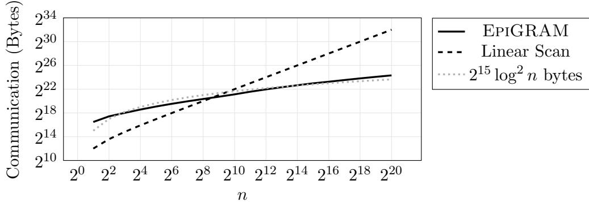  
Figure 4.16: Estimated concrete communication cost of our GRAM. We fix the word size $w = 1 2 8$ and plot per-access amortized communication as a function of n. For reference, we plot the function $2 ^ { 1 5 } \log ^ { 2 } n$ , which closely approximates our communication consumption.

## 4.6.2 Asymptotic Performance

We analyze <sup>EpiGRAM</sup>’s asymptotic cost and prove it achieves $O ( \log ^ { 2 } n )$ overhead. To prove this, we derive costs for the various components of our RAM. In particular, we:

1. Remind the reader of the cost of our scaling procedure (Figure 4.3).

2. Derive the cost of stacks internal to our lazy permutation network.

3. Use the cost of stacks to derive the total cost of a lazy permutation network.

4. Derive the cost of all permutations applied to physical storage by G.

5. Derive the cost of the helper procedure hide (Figure 4.15).

6. Show that the index map, which is instantiated by a recursive chain of RAMs, incurs total $O ( \log ^ { 4 } { n \cdot \kappa } )$ amortized cost per access (if the index map stores entries of size $w = 2 \log n )$

7. Prove that, for $w = \Omega ( \log ^ { 2 } n )$ , EpiGRAM incurs $O ( w \cdot \log ^ { 2 } n \cdot \kappa )$ amortized cost per access.

## 4.6.3 Costs of Subcomponents

We start by reminding the reader that our scaling procedure (Figure 4.3) avoids factor κ overhead:

Lemma 4.1 (Scaling Cost). Let $\{ \{ x ^ { E } \} \}$ be a garbled bit and let $[ [ y ] ]$ for $y \in \{ 0 , 1 \} ^ { \kappa }$ be a shared vector. Parties compute $[ [ x \cdot y ] ]$ (Figure 4.3) for κ bits of communication and $O ( \kappa )$ computation.

Proof. Trivial from Figure 4.3. G sends only a single length-κ string row . □

Based on the above lemma, we briefly observe that pop-only stacks consume amortized $O ( \log n )$ overhead per pop:

Lemma 4.2 (Stack Cost). Let $s = s t a c k ( x _ { 0 } , . . . , x _ { n - 1 } )$ be a size-n stack (Definition 4.1) with w-bit entries. Let $m = O ( n )$ be a number of pops linear in the stack size. For each $i \in [ m ]$ let $\{ p _ { i } ^ { E } \}$ be a garbled bit. Consider a sequence of m calls to pop:

$$
(\cdot , s) \leftarrow p o p (s, \{\{p _ {i} ^ {E} \} \})
$$

The above calls incur total $O ( w \cdot n \cdot \log n )$ communication and computation.

Proof. By analysis given by [ZE13] and because we replace AND gates – which have factor κ overhead – with our scaling gates – which do not (Lemma 4.1). □

Based of stack costs, we calculate the cost of our lazy permutation network. A fully routed lazy permutation network incurs $O ( w \cdot n \cdot \log ^ { 2 } n )$ cost:

Lemma 4.3 (Lazy Permutation Network Cost). Let $\tilde { \pi }$ be a lazy permutation network on n elements where each leaf node p is configured by storage metadata (Definition 4.2) $\mathcal { M } _ { p }$ with $O ( \log n )$ entries each with language of width w. Let π be an arbitrary permutation on n elements. For each $i \in [ n ]$ let the parties hold $\{ \pi ( i ) \}$ . Suppose the parties fully route $\tilde { \pi } .$ . I.e., for each $i \in [ n ]$ they call:

$$
(\cdot , \cdot , \tilde {\pi}) \leftarrow r o u t e (\tilde {\pi}, \{\{\pi (i) \} \}, 0)
$$

If $w = \Omega ( \log n \cdot \kappa )$ then the parties consume total $O ( w \cdot n \cdot \log ^ { 2 } n )$ communication and computation.

Proof. By totaling the cost of stacks in $\tilde { \pi }$ .

First, we show that each leaf node costs only $O ( w \cdot \log n + \log ^ { 2 } n \cdot \kappa )$ , and hence all leaf nodes together cost $O ( w \cdot n \cdot \log n + n \log ^ { 2 } n \cdot \kappa ) = O ( w \cdot n \cdot \log ^ { 2 } n )$ . Each leaf performs

## 4.6. Performance

$O ( \log n )$ comparisons on an integer of length log n. Each integer comparison can be implemented using a circuit with $O ( \log n )$ gates, hence total $O ( \log ^ { 2 } n \cdot \kappa )$ cost. With the comparisons computed, the leaf then computes $O ( \log n )$ scalings, each incurring cost w.

Now, ˜π internally holds $2 n - 2$ stacks, though these stacks decrease in size towards the leaves of the network. I.e., the network has log n levels, and each inner node on level i has two stacks of size $2 ^ { i - 1 }$ . Recall from Lemma 4.3 that $2 ^ { i }$ calls to pop on a stack with $2 ^ { i - 1 }$ elements of width $O ( w )$ costs total $O ( w \cdot 2 ^ { i } \cdot \log 2 ^ { i } )$ . For each of the $2 ^ { i + 1 }$ stacks on level i, a fully utilized lazy permutation issues $2 ^ { \log n - i }$ calls to $p o p$ . Thus we can sum up costs as follows:

$$
\begin{array}{l} \sum_ {i = 0} ^ {\log n - 1} 2 ^ {i + 1} \cdot O \left(w \cdot 2 ^ {\log n - i} \cdot \log 2 ^ {\log n - i}\right) \\ = O \left(\sum_ {i = 0} ^ {\log n - 1} 2 ^ {i + 1} \cdot \left(w \cdot \frac {2 ^ {\log n}}{2 ^ {i}} \cdot \log \left(\frac {2 ^ {\log n}}{2 ^ {i}}\right)\right)\right) \\ = O \left(\sum_ {i = 0} ^ {\log n - 1} w \cdot n \cdot \log \left(\frac {n}{2 ^ {i}}\right)\right) \\ = O \left(w \cdot n \cdot \left(\sum_ {i = 0} ^ {\log n - 1} \log n - i\right)\right) \\ = O (w \cdot n \cdot \log^ {2} n) \end{array}
$$

The total costs of inner and leaf nodes therefore sum to $O ( w \cdot n \cdot \log ^ { 2 } n )$

Lemma 4.4 (Traditional Permutation Network Cost). Let $( \pi _ { 0 } , . . . , \pi _ { n } )$ be a sequence of $n + 1$ permutations chosen by $G \mathrm { - } s c h e d u l e ( n , w )$ and let $\left\{ \left\{ x _ { 0 } \right\} \right\} , . . . , \left\{ \left\{ x _ { n } \right\} \right\}$ be n garbled arrays such that each $x _ { i }$ has length appropriate for permutation $\pi _ { i }$ . Let each element of each array $x _ { i }$ have width w. Suppose the parties permute each array using G-permute (Figure 4.2):

$$
\{\{\pi (x _ {i}) \} \} \leftarrow G \text {-permute} (\pi_ {i}, \{\{x _ {i} \} \})
$$

Then the parties use $O ( w \cdot n \cdot \log ^ { 2 } n \cdot \kappa )$ communication and computation.

Proof. By totalling the cost of each permutation network.

Recall that a permutation network on $2 ^ { i }$ garbled elements each of width w incurs $O ( w \cdot 2 ^ { i } \log 2 ^ { i } \cdot \kappa )$ cost (Figure 4.2). Recall also that for each $i \in [ n ]$ , the procedure G-schedule samples a permutation of size 2k such that $k \leq n$ and such that k is the largest power of two that divides i. Additionally, G-schedule appends a final permutation of size 4n.

By the above strategy, for each $i \in [ \log n ]$ there are $2 ^ { \log n - i - 1 }$ permutations of size $2 \cdot 2 ^ { i }$ . Additionally, there is one permutation of size 2n and one of size 4n. These two large permutations have total cost $O ( w \cdot n \cdot \log ^ { 2 } n \cdot \kappa )$ . We summarize the costs of all smaller permutations as follows:

$$
\begin{array}{l} \sum_ {i = 0} ^ {\log n - 1} 2 ^ {\log n - i - 1} \cdot O (w \cdot 2 ^ {i} \cdot \log 2 ^ {i} \cdot \kappa) \\ = O \left(w \cdot \kappa \cdot 2 ^ {\log n} \cdot \left(\sum_ {i = 0} ^ {\log n - 1} \frac {i \cdot 2 ^ {i}}{2 ^ {i - 1}}\right)\right) \\ = O \left(w \cdot \kappa \cdot n \cdot \left(\sum_ {i = 0} ^ {\log n - 1} i\right)\right) \\ = O (w \cdot n \cdot \log^ {2} n \cdot \kappa) \end{array}
$$

The total cost of permutations assigned by G-schedule is $O ( w \cdot n \cdot \log ^ { 2 } n \cdot \kappa )$ □

Before we explore the amortized cost of RAM accesses, we quickly derive the cost of the hide helper procedure:

Lemma 4.5 (Hide Procedure Cost). Let ${ \mathbb { Q } } _ { i } ^ { \prime }$ be $O ( \log n )$ physical addresses each of length $O ( \log n )$ bits. Let $D _ { i }$ be $O ( \log n )$ languages each of length w. Let $\{ \ @ \}$ be a garbled physical address. Suppose the parties invoke hide:

$$
h i d e (\@ _ {i} ^ {\prime}, D _ {i}, \{\@ \})
$$

If $w = \Omega ( \kappa )$ then the parties consume total $O ( w \cdot \log ^ { 2 } n )$ communication and computation.

Proof. hide uses $O ( \log n )$ integer comparisons for integers of size $O ( \log n )$ . Each integer comparison can be implemented using a circuit with $O ( \log n )$ gates, hence total $O ( \log ^ { 2 } n$ $\kappa ) = O ( w \cdot \log ^ { 2 } n )$ cost. Additionally, hide involves $O ( \log n )$ vector scalings, each of cost w. Hence total cost is bounded by $O ( w \cdot \log ^ { 2 } n )$ □

## 4.6.4 Costs of RAM

Now that we have derived the costs of the subcomponents of our RAM, we derive the amortized cost of our core access procedure.

Recall that the RAM recursively instantiates a index map which maps each logical index to a one-time index. Because of the recursive instantiation, we are at risk of incurring an additional factor log n overhead. To circumvent this, we use a trick given by $[ \mathrm { S v S ^ { + } 1 3 } ]$ : we instantiate the top level RAM with substantially wider entries than the index map. I.e., we store blocks of width $w = \Omega ( \log ^ { 2 } n )$ in the top level RAM and blocks of width $w = 2 \cdot ( \log n + 1 )$ in lower levels of RAM.

In practice, we play with constants for the top level RAM. For example, we store blocks of size, say 128, in the top level.

We show that the top-level index map has total cost $O ( \log ^ { 4 } n \cdot \kappa )$ . Then, we show that the top level RAM has total cost $O ( w \cdot \log ^ { 2 } n \cdot \kappa )$

Lemma 4.6 (Index Map Eficiency). Let $\left\{ a r r a y [ n , w ] ( x _ { 0 } , . . . , x _ { n - 1 } ) \right\}$ be a size-n array with entries of width $w = 2 \cdot ( \log n + 1 )$ ). Then each call to access (Figure 4.11) consumes amortized $O ( \log ^ { 4 } n \cdot \kappa )$ communication and computation.

Proof. By amortizing the cost of the lazy permutation network (Lemma 4.3) and tradi tional permutations (Lemma 4.4).

n accesses to a size-n RAM together utilize:

– A size-2n lazy permutation where the leaves store languages of size $w \cdot \kappa$

$- \ n + 1$ traditional permutations.

By amortizing the costs of these components to each access, we see that each access incurs $O ( w \cdot \log ^ { 2 } n \cdot \kappa )$ cost. The hide procedure – which is called once per access – also has cost bounded by $O ( w \cdot \log ^ { 2 } n \cdot \kappa )$ (Lemma 4.5).

Crucially, each RAM access requires exactly one recursive access to its index map. The index map for each level of RAM must uniquely identify one out of 2n one-time indices, and hence we must look up an index of size log n+1. We pack $2 ( \log n + 1 )$ bits into each word of the index map, allowing us to store two indices per word. This ensures that each recursively instantiated RAM is (less than) half the size of its parent. Thus, we have at most log n levels of RAM (recall that the bottom-most level of RAM is instantiated by simple linear scans). Since the cost of each level of RAM is bounded by $O ( w \cdot \log ^ { 2 } n \cdot \kappa )$ and there are $O ( \log n )$ levels of RAM, the total cost is $O ( w \cdot \log ^ { 3 } n \cdot \kappa ) = O ( \log ^ { 4 } n \cdot \kappa )$ . □

Theorem 4.1 (Access Eficiency). Let $\left\{ a r r a y [ n , w ] ( x _ { 0 } , . . . , x _ { n - 1 } ) \right\}$ be a size-n array with entries of width $w = \Omega ( \log ^ { 2 } n )$ . Then each call to access (Figure 4.11) consumes amortized $O ( w \cdot l o g ^ { 2 } n \cdot \kappa )$ communication and computation.

Proof. By amortizing the cost of the lazy permutation network (Lemma 4.3) and traditional permutations (Lemma 4.4) and because the index map has total cost $O ( \log ^ { 4 } n \cdot \kappa )$ (Lemma 4.6)

The proof is nearly identical to that of Lemma 4.6, except that we ignore recursive RAM instantiation since we have already proved the index map has cost $O ( \log ^ { 4 } n \cdot \kappa )$ per access.

<sup>EpiGRAM</sup> achieves $O ( \log ^ { 2 } n )$ overhead.

## 4.7 Simulators

In this section, we construct simulators that simulate E’s view of <sup>EpiGRAM</sup> procedures. In particular, our goal is to construct two simulators:

$- \ S _ { a r r a y - i n i t }$ simulates $E \mathrm { { ^ { * } s } }$ view of array initialization. On input $\{ \{ x \} \}$ , the simulator outputs simulated GC material $M ^ { \prime }$ and a simulated garbled array $\{ a r r a y [ n , w ] ( x ) \}$ }} such that:

$$
(\{\{x \} \}, M ^ {\prime}) \stackrel {{c}} {{=}} (\{\{x \} \}, M)
$$

where M is the real material from array initialization.

$\boldsymbol { S } _ { a c c e s s }$ simulates E’s view of an array access. On input $\{ \mathbb { A } \} _ { \sharp } ^ { \sharp } , \{ \mathbb { \alpha } \} _ { \sharp } ^ { \sharp } , \{ \mathbb { \ - } y \} , \{ \mathbb { \ - } r \} _ { \sharp }$ , the simulator simulates an update to $\{ A \}$ , simulates output $\{ \{ x _ { \alpha } \} \}$ , and simulates material $M ^ { \prime }$ such that:

$$
\left(\{\{A \} \}, \{\{\alpha \} \}, \{\{y \} \}, \{\{r \} \}, M ^ {\prime}\right) \stackrel {{c}} {{=}} \left(\{\{A \} \}, \{\{\alpha \} \}, \{\{y \} \}, \{\{r \} \}, M\right)
$$

At a high level, each of the following simulators is formed by composing simpler simulators. Hence, the validity of each simulation follows from a simple hybrid argument, with the exception of two crucial points:

## 4.7. Simulators

1. We reveal to E permuted one-time indices $\pi ( p )$ and we reveal physical addresses $@ _ { i }$ . However, G applies uniform permutations to these values, so each is easily simulated.

2. G opens various sharings to E. We are careful that whenever G opens such a value, $G \mathrm { { ^ { \circ } s } }$ transmitted share is itself masked by a uniform string that is independent of all other openings. Hence, we can simulate each opening with a uniform string.

We build up these two simulators modularly, starting by proving that our generalization of half AND can be simulated, then moving to higher level constructions, such as our lazy permutation network. Finally, we construct $\mathcal { S } _ { a r r a y - i n i t }$ and $\mathcal { S } _ { a c c e s s }$ . In Chapter 5, we use these two simulators as modules to prove that a complete GC language with array accesses can be simulated.

## Sharing scale simulator

We construct a simulator for our scaling procedure (Figure 4.3). We prove security when G’s share of the vector y is either (1) a uniform bitstring Y or (2) a bitstring $z \Delta$ for $z \in \{ 0 , 1 \}$ . The latter case arises when G introduces a garbled input.

<sub>–</sub> Simulator $S _ { s c a l e } ( \{ { x } ^ { E } \} ) _ { } , [ { y } ] )$

• Let $\langle \cdot , X ^ { \prime } \rangle = \ P x ^ { E } \}$ and let $\langle \cdot , Y ^ { \prime } \rangle = [ [ y ] ]$

• Let ν be the gate-specific nonce.

• Simulate row by uniformly sampling $r \in _ { \mathbb { S } } \{ 0 , 1 \} ^ { \kappa }$ then computing $r o w ^ { \prime } \triangleq$ $r \oplus H ( X ^ { \prime } , \nu )$ . This is indistinguishable from the real row:

$$
\begin{array}{l l} r o w ^ {\prime} = r \oplus H (X ^ {\prime}, \nu) \\ = (r \oplus Y) \oplus H (X ^ {\prime}, \nu) \oplus Y \\ \stackrel {{c}} {{=}} \mathcal {R} (X ^ {\prime}, \nu , 0) \oplus H (X ^ {\prime}, \nu) \oplus Y & \mathcal {R} \text { is   a   random   function } \\ \stackrel {{c}} {{=}} c i r c _ {\Delta} (X ^ {\prime}, \nu , 0) \oplus H (X ^ {\prime}, \nu) \oplus Y & \text { Definition   1.1 } \\ = H (X ^ {\prime} \oplus \Delta , \nu) \oplus H (X ^ {\prime}, \nu) \oplus Y = r o w \end{array}
$$

• The simulator outputs $H ( X ^ { \prime } , \nu ) \oplus x \cdot ( r o w ^ { \prime } \oplus Y ^ { \prime } )$ . Here, E’s simulated share is indistinguishable from E’s real output share by construction.

## Pop-only stack simulators

Note that – due to space and because they are simple – we elided formal stack procedures stack -init and pop (Figure 4.5 lists the interface to these procedures). We similarly elide their simulators and instead simply claim that there exist simulators $ { S _ { s t a c k - i n i t } }$ and $ { \boldsymbol { S } } _ { p o p }$ that properly simulate E’s view during these two procedures. Formally, both of these simulators simulate each of their gates, and the simulation is secure by a simple and unsurprising hybrid argument.

## Lazy permutation network simulators

Next, we simulate E’s view of our lazy permutation network.

We start by constructing simulators for inner and leaf nodes (Figures 4.6 and 4.7). Both inner and leaf are simple static circuits built from Boolean gates and Figure 4.3. Thus, we do not exhaustively list the simulators for these procedures. We do note one non-trivial detail: in both procedures, G opens a share to E. This is made simulatable by the fact that each nodes’ input languages are chosen uniformly. Hence, G’s opening can be simulated by uniform bits. Let $S _ { i n n e r } ~ ( \mathrm { r e s p . } ~ S _ { l e a f } )$ be the simulator for procedure inner (resp. leaf ).

With simulators for the network nodes specified, we now construct simulators for the overall lazy permutation newtwork. We start by simulating the initialization of a network:

<sub>–</sub> Simulator $S _ { \tilde { \pi } - i n i t } ( \cdot , \cdot )$

• Consider a full binary tree with n leaves.

• For each node i in level k of the tree, trivially instantiate E’s share of $2 ^ { k }$ languages of appropriate length $\mathbb { [ } L _ { i } ^ { j \in [ 2 ^ { k } ] } \mathbb { I }$ . I.e., each language $L _ { i } ^ { j } \triangleq \langle \cdot , 0 \rangle$

• For each internal node i on level k of the tree, simulate the initialization of two stacks (Figure 4.5):

$$
\{\{s _ {i} ^ {\ell} \} \} \triangleq \mathcal {S} _ {i n i t - s t a c k} (\llbracket L _ {2 i} ^ {j \in [ 2 ^ {k - 1} ]} \rrbracket) \quad \{\{s _ {i} ^ {r} \} \} \triangleq \mathcal {S} _ {i n i t - s t a c k} (\llbracket L _ {2 i + 1} ^ {j \in [ 2 ^ {k - 1} ]} \rrbracket)
$$

## 4.7. Simulators

• Output E’s simulated share of the lazy permutation network:

$$
\tilde {\pi} = \left(\llbracket L _ {0} ^ {j \in [ n ]} \rrbracket , (\{\{s _ {i \in [ n - 1 ]} ^ {\ell} \}, \{\{s _ {i \in [ n - 1 ]} ^ {r} \} \})\right)
$$

The above simulation is indistinguishable from real by a trivial hybrid argument. Note that we defer simulation of the GCs for each of permutation nodes until we actually route the inputs:

<sub>–</sub> Simulator $S _ { r o u t e } ( \tilde { \pi } , \{ \alpha ^ { E } \} , \{ \it { \Psi } x \} )$

• Let v denote the number of times $\tilde { \pi }$ has already been used.

• Parse the lazy permutation into its parts:

$$
\left(\llbracket L _ {0} ^ {j \in [ n ]} \rrbracket , (\{\{s _ {i \in [ n - 1 ]} ^ {\ell} \}, \{\{s _ {i \in [ n - 1 ]} ^ {r} \} \})\right) = \tilde {\pi}
$$

• Trivially construct E’s share of uniform language $[ [ Y ] ] = \langle \cdot , 0 \rangle$

• Collect $[ m ] \triangleq \{ \alpha \} , \{ x \} , [ Y ]$

• Simulate the opening of $G \mathrm { { ^ { \circ } s } }$ share by sampling a uniform string row $\in$ $\{ 0 , 1 \} ^ { | m | }$ . Note that this is indistinguishable from real because $L _ { 0 } ^ { v }$ is an inde pendently sampled uniform value that is unknown to $E .$

• Set $[ [ m ^ { \prime } ] ]  [ [ m ] ] \oplus [ [ L _ { 0 } ^ { v } ] ] \oplus r o w$ . I.e., m<sup>0</sup> is simulated input to the first internal node.

• Traverse the tree from root to leaf α. At each internal leaf $i ,$ simulate the internal node procedure by invoking:

$$
(\llbracket m ^ {\prime} \rrbracket , \{\{s _ {i} ^ {\ell} \} \}, \{\{s _ {i} ^ {r} \} \}) \leftarrow \mathcal {S} _ {i n n e r} (\{\{s _ {i} ^ {\ell} \} \}, \{\{s _ {i} ^ {r} \} \}, \llbracket m ^ {\prime} \rrbracket , \alpha_ {i})
$$

• Parse m<sup>0</sup> as $( \ P T \ P , \mathbb { \mathbb { V } } ] )$ . Simulate the leaf by invoking $S _ { l e a f } ( \cdot , \{ \boldsymbol { T } \} , \{ \mathbf { \mathbb { Y } } \} )$ ; output the result and the updated lazy permutation.

• To match the real world arrangement of GCs, the simulator rearranges the simulated GCs according to node ids.

The above simulator is indistinguishable from real by a simple hybrid argument. Note that $S _ { r o u t e }$ assumes that α is part of E’s cleartext input. This is consistent with the fact that our lazy permutation network leaks values to E. We postpone simulating RAM indices to the simulation of our top level GRAM.

We note a tedious but important detail regarding the simulation of our lazy permutation network. In our simulation, we postponed the simulation of the node GCs until $S _ { r o u t e }$ . This is sensible, because the moment when E calls route is the moment when she has the most information that could help her to distinguish the simulation from real. I.e., she holds an input to the root of the lazy permutation.

While this choice is natural, it has a problem. Suppose that a GC program uses a lazy permutation network of size n, but routes fewer than n inputs through the network. This can occur, e.g., when a GRAM of size n is accessed a number of times that is not a multiple of n. In such cases, there will be a number of GCs in the lazy permutation network that are not yet simulated. Thus, we must separately simulate the unused GCs in the permutation network. We simply mention this and do not fully flesh out such a simulator; we can clearly simulate node GCs where E does not receive input, since we can simulate the GCs even when E does receive input.

## GRAM simulators

Now that we have constructed simulators for the lazy permutation network, we move on to our GRAM procedures. We start with simulators for the helper procedures (Figures 4.12 to 4.15):

– G-schedule (Figure 4.13) is local to G. We need not simulate.

– shufle is easily simulated. First, $\mathcal { S } _ { s h u f f l e }$ simulates the call to G-permute by simulating the permutation network. This is done by simulating each constituent Boolean gate. Then, $\mathcal { S } _ { s h u f f l e }$ simulates G opening his share of the output. This is simulatable by a uniform string because target-languages is a uniform string chosen by G and independent of all other messages.

– We for now postpone discussion of flush (Figure 4.12).

– hide (Figure 4.15) is a simple circuit built from other gadgets, and so $S _ { h i d e }$ is simply constructed by simulating each of the constituent gates.

With these set, we focus on simulating GRAM initialization (Figure 4.10) and access (Figure 4.11). Simulating initialization is straightforward: $\mathcal { S } _ { a r r a y - i n i t }$ first simulates the

## 4.7. Simulators

initialization ˜π by calling $S _ { \tilde { \pi } - i n i t }$ . Then it recursively simulates initialization of the index map.

Array access is more detailed, and must handle important revelations to E. We fully formalize this simulator:

– <sup>Simulator</sup> S<sub>access</sub>({{A}}, {{α}}, {{y}}, {{r}}):

• Simulate permutation of levels of storage: $\{ \boldsymbol { A } \} _ { \mathcal { Y } } ^ { }  S _ { s h u f f e } ( \{ \boldsymbol { A } \} _ { \mathcal { Y } } ^ { } )$

• If $T = 2 n$ reinitialize and try again, returning that result:

$$
\mathcal {S} _ {\text {access}} \left(\mathcal {S} _ {\text {array - init}} \left(\mathcal {S} _ {\text {flush}} (\{\{A \} \})\right), \{\{\alpha \}, \{\{y \}, \{\{r \} \}\right)
$$

Otherwise, continue as follows:

• Recursively simulate access to the index map:

$$
\{\{\pi (p) \} \} \leftarrow \mathcal {S} _ {\text {access}} (\{\{i n d e x - m a p \} \}, \{\{\alpha \} \}, \{\{\pi (T) \} \}, \{\{0 \} \})
$$

• Simulate $G ^ { \prime }$ ’s opening of $\pi ( p )$ . This is one of the most important points of our simulation. Let $\langle \cdot , P \rangle = [ \pi ( p ) ] ] = l s b ( \{ \pi ( p ) \} )$ . The simulator uniformly samples a value $R \in [ 2 n ]$ without replacement. I.e., each time the simulator reaches this point it ensures that it samples a fresh value. (After array reinitialization, the simulator forgets which values it has shown to $E ;$ this allows us to simulate more than n accesses.) The simulator sends to E $R \oplus P ,$ , revealing the value R. This is indistinguishable from real: in the real world, E views a value $\pi ( p )$ , but π is a uniform permutation and each p over the course of n accesses is distinct. Hence, each such $\pi ( p )$ appears uniformly chosen without replacement.

• Simulate routing of the permutation network.

$$
(\{\{\@ \} \}, [ X ]) \leftarrow \mathcal {S} _ {r o u t e} (\tilde {\pi}, \{\{\pi (p) \} \}, T)
$$

• Simulate the hide procedure (Figure 4.15):

$$
(\{\{\@ _ {i} \}, [ [ D _ {j} ] ]) \leftarrow \mathcal {S} _ {h i d e} (\@ _ {i} ^ {\prime}, D _ {i}, \{\{\@ \})
$$

• Simulate $G ^ { \prime }$ s opening of each physical address on each populated level. This is one of the most important points of our simulation. For each populated level i let $\langle \cdot , A _ { i } \rangle = [ [ \mathbb { Q } _ { i } ] ] = l s b ( \{ \mathbb { Q } _ { i } \} )$ . For each such level, the simulator uniformly samples a value $R _ { i } \in [ 2 ^ { i + 1 } ]$ without replacement. I.e., the simulator never reveals to $E$ the same physical address more than once. (After a level is permuted, the simulator forgets which addresses it revealed on that level.) The simulator sends to $E \ A _ { i } \oplus R _ { i }$ , revealing to E the value $R _ { i }$ . This is indistinguishable from real: Recall that the levels of RAM are permuted according to uniform permutations $\pi _ { 0 } , . . . , \pi _ { n }$ . Hence, each level i is uniformly shufled. Since all $2 ^ { i + 1 }$ elements are uniformly shufled, the real value $@ _ { i }$ is indistinguishable from a uniformly sampled (without replacement) index.

• Read each simulated address $R _ { i }$ and XOR the values together. XOR with this result the values $[ [ D _ { j } ] ]$ and X . Let $\{ x _ { \alpha } \}$ denote the result. Output $\{ x _ { \alpha } \}$

• Simulate the Boolean circuit $\{ r \cdot x _ { \alpha } \oplus \bar { r } \cdot y \}$ and place the result in the first slot of the stash. Place the trivial share of {{0}}, a fresh dummy, in the second slot of the stash.

• Increment the timer: $T \gets T + 1$

As a final detail, we now revisit the simulator $\mathcal { S } _ { f l u s h }$ . Just like the above $\mathcal { S } _ { a c c e s s }$ simulator, $\mathcal { S } _ { f l u s h }$ must take care when revealing physical addresses to $E .$ . But using the same argument as above, the flush simulator can just choose locations uniformly without replacement and reveal these to $E$ .

## Chapter 5

## A LANGUAGE FOR GARBLED PROGRAMS

In this chapter, we combine our new directions into a unified formalism. This formalism describes how our garbled procedures can be composed and interleaved.

We present our unified formalism as a language that we call <sup>gcl</sup> (GC language). <sup>gcl</sup>’s syntax and semantics formalize the rules by which our new directions can be composed, and we leverage the formalism to construct a security proof.

In the end, we incorporate <sup>gcl</sup> into a garbling scheme [BHR12] (see Section 5.6). The garbling scheme definition is a widely accepted abstraction that serves as a barrier between the handling of GC primitives (i.e., the topics discussed in this dissertation) and the protocols that leverage GC as a black box. By incorporating <sup>gcl</sup> in a garbling scheme, we enable GC protocols to handle <sup>gcl</sup> programs, and hence enable protocols to utilize the new directions in this dissertation.

<sup>gcl</sup> is intended as a formalism, not as a user-friendly programming language; <sup>gcl</sup> is a minimal language that incorporates one-hot garbling, stacked garbling, and garbled RAM. Valid <sup>gcl</sup> programs can be securely evaluated inside GC, so <sup>gcl</sup> provides an interface to garbled computation.

## 5.1 Syntax

<sup>gcl</sup> programs are written as inductively defined expressions. We first define the syntax of these expressions.

Definition 5.1 (<sup>gcl</sup> Expressions). The space of <sup>gcl</sup> expressions is defined inductively and is listed in Figure 5.1.

<table><tr><td>e ≜</td><td>GCL expressions support... basic variable manipulation</td></tr><tr><td>| let x = e in e</td><td>save an intermediate value in a variable</td></tr><tr><td>| x</td><td>retrieve the value saved in a variable bitstrings and Free XOR (Chapter 1)</td></tr><tr><td>| e | e</td><td>concatenate two bitstrings</td></tr><tr><td>| A · e</td><td>multiply matrix A by a bitstring (Lemma 1.1)Stacked Garbling (Chapter 3)</td></tr><tr><td>| switch e (e; ...; e)</td><td>conditionally evaluate one of b expressionsGarbled RAM (Chapter 4)</td></tr><tr><td>| array-init[n, w] from e</td><td>initialize a fresh array of n w-bit elements</td></tr><tr><td>| read e from e</td><td>array read (Figure 4.11)</td></tr><tr><td>| write e to e at e</td><td>array write (Figure 4.11)One-hot Garbling (Chapter 2)</td></tr><tr><td>| H(e) ⊗ e</td><td>the one-hot outer product of bitstrings (Figure 2.3)and modules (see Section 5.1.1)</td></tr><tr><td>| sample D</td><td>G inputs a value sampled from D</td></tr><tr><td>| lsb e</td><td>G injects his lsbs of a garbling as input</td></tr><tr><td>| reveal[D] e</td><td>G reveals a value to E; the value must be from D</td></tr><tr><td>| apply (x ∈ {0, 1}n → e) to e</td><td>use a module that reveals values to E</td></tr></table>

Figure 5.1: The syntax of <sup>gcl</sup> expressions. Variable e ranges over expressions, x ranges over program variables, n and w range over the natural numbers, A ranges over bit matrices, and D ranges over distributions.

Every valid <sup>gcl</sup> expression ultimately simplifies to a value. <sup>gcl</sup> values include bitstrings and random access arrays (supported by GRAM):

Definition 5.2 (<sup>gcl</sup> Values). The space of <sup>gcl</sup> values is defined as follows. In the following, n and w range over the natural numbers:

$$
\begin{array}{l l} v \triangleq \\ | \{0, 1 \} ^ {n} & \text {length n bitstring} \\ | a r r a y [ n, w ] (\{0, 1 \} ^ {w},..., \{0, 1 \} ^ {w}) & \text {an array of n length - w bitstrings} \end{array}
$$

Before we give further details and formally define the semantics, we give example expressions. These examples both show how programs can be built up from expressions and will be useful later.

We start with examples that show <sup>gcl</sup> provides the basic tools needed to manipulate

## 5.1. Syntax

bitstrings. For instance, notice that we do not provide primitives that (1) implement XOR or (2) decompose bitstrings into bits. These are unnecessary, as they can be implemented in terms of the primitives we already have.

Example 5.1 (XOR). Let $e _ { 0 } , e _ { 1 }$ be two expressions that each evaluate to a single bit. To XOR a and $b ,$ first concatenate them into a length two bitstring, then multiply them by the appropriate $1 \times 2$ matrix. I.e., evaluate the following expression:

$$
e _ {0} \oplus e _ {1} \triangleq [ 1 \quad 1 ] \cdot (e _ {0} \mid e _ {1})
$$

Example 5.2 (Extracting a bit from a bitstring). Let e be an expression that evaluates to a length-n bitstring. The parties can extract the i-th bit from e as follows. First, they construct a $1 \times n$ matrix A such that the i-th column holds 1 and all other columns hold 0. The parties compute the following expression:

$$
e _ {i} \triangleq A \cdot e
$$

## 5.1.1 Modules

More interesting computations are also needed. For instance, AND is not included as a primitive expression, so we must somehow compose AND from primitives.

As shown in Chapter 2, we can reduce AND to our one-hot outer product operation which is included as a primitive. However, formalizing this reduction as an expression requires more sophisticated techniques than earlier examples: G must introduce constants that depend on the least significant bits of his labels. This reduction is qualitatively diferent from our first two examples, because it involves introducing GC-specific values, namely lsbs, to the program. More generally, we may also wish to reveal values to E so that they can be passed as arguments to one-hot outer products. To use the our powerful one-hot primitive efectively, the GC must reveal values to E.

Allowing the programmer to reveal values is inherently double-edged. On the one hand, we allow the programmer to build powerful custom procedures; the applications in Section 2.5 demonstrate how this can be done. On the other hand, we introduce a risk that some programs may compromise security.

One direction we could take, but which we do not take, would be to directly expose one-hot expressions to the end user and to allow her to manage (e.g., via masking) the information release associated with its eficient use in GC. This would not be ideal, since each new program would require a new proof of security.

Instead, we do not allow our one-hot primitive to be used by top level expressions. Rather, these primitives must be packaged into so-called modules. One-hot expressions, reveal expressions, lsb expressions, and sample expressions are syntactically prohibited outside of modules. Inside a module, the programmer is free to use these powerful primitives, but takes on the responsibility to prove that the module does not compromise security. Once the module is proved secure, the programmer may freely use the module as if it were primitive via apply syntax. New modules require security proofs, the top level programs that use modules do not.

A module has the following syntactic form:

$$
x \in \{0, 1 \} ^ {n} \mapsto e
$$

Here, we refer to the expression e as the module expression. The module expression may contain subexpressions that manipulate GC-specific values and that even reveal values to E. Consider the following expression:

## reveal[D] e

This expression states that the parties will first evaluate $e ,$ then G will reveal the resulting value to E. For security, this syntactic form is only allowed as a subexpression of a module expression. Additionally, the revealed value must be indistinguishable from a value drawn from the distribution D, and it is the programmer’s responsibility to prove this. Moreover, the top level module expression e must compute a deterministic function of the bitstring argument x.

These requirements ensure that GC-specific values introduced by the module (1) can be simulated and (2) are ultimately eliminated and cannot leak into the top level expression. I.e., GC-specific values are encapsulated by modules. This way, top level expressions can be written without concern about security requirements. We formalize module requirements in Section 5.3.

## 5.2. Semantics

<div class="mineru-algorithm" style="white-space: pre-wrap; font-family:monospace;">
$e_0 \cdot e_1 \triangleq apply (x \in \{0, 1\}^2 \mapsto$ let $a = x_0$ in Example 5.2 let $b = x_1$ in Example 5.2 let $\alpha = lsb$ a in let $\beta = lsb$ b in let $\gamma = sample constant(\alpha \cdot \beta)$ in let $c_0 = \mathcal{T}(id) \cdot \mathcal{H}(a \oplus \alpha) \otimes b$ in simplifies to $(a \oplus \alpha)b$ let $c_1 = \mathcal{T}(id) \cdot \mathcal{H}(b \oplus \beta) \otimes \alpha$ in simplifies to $(b \oplus \beta)\alpha$ $c_0 \oplus c_1 \oplus \gamma$ simplifies to $ab$ ) to $(e_0 \mid e_1)$
</div>

Figure 5.2: The above expression uses a module to AND together subexpressions $e _ { 0 }$ and $e _ { 1 }$ . For a correctness argument, see Section 1.3. In the above expression, G knows α and $\beta$ in cleartext (they are his least significant bits), so he can indeed sample from the distribution constant $( \alpha \cdot \beta )$ . We use Examples 5.1 and 5.2 respectively to XOR bits and to extract bits from bitstrings.

We show how AND can be formalized and used as a module:

Example 5.3 (AND gate). Let $e _ { 0 } , e _ { 1 }$ be two expressions that each evaluate to one bit. Let constant(x) denote a distribution that when sampled always returns x. The expression in Figure 5.2 uses a module to $\mathrm { A N D ~ } e _ { 0 }$ with $e _ { 1 }$

Indeed, each application in Section 2.5 can be formalized as a module (that handles a fixed size input), though we do not exhaustively list them here.

## 5.2 Semantics

While we have already shared a few examples, we have not yet formally stated what a <sup>gcl</sup> program means. We now specify the semantics of <sup>gcl</sup> programs. The semantics will be useful when proving our GC implementation of <sup>gcl</sup> correct.

Every <sup>gcl</sup> program is evaluated in some environment. An environment stores the value of each program variable.

Definition 5.3 (<sup>gcl</sup> Environment). An environment η is a data structure that maps program variables to values (Definition 5.2). We assume that we can both search for a variable in the environment and that we can update the environment by storing new values.

<div class="mineru-algorithm" style="white-space: pre-wrap; font-family:monospace;">
INPUT:
- An expression e (Definition 5.1).
- An environment η (Definition 5.3).

OUTPUT:
- A value v (Definition 5.2).

PROCEDURE (proceeds by case analysis on e):
- let $x = e_0$ in $e_1$: Recursively evaluate $e_0$, yielding $v_0$. Update the environment η by mapping x to $v_0$. Recursively evaluate $e_1$ using updated η and return the result.
- x: Search for x in the environment η and return the result.
- $e_0 \mid e_1$: Recursively evaluate $e_0$ and $e_1$, yielding bitstrings $v_0, v_1$. Concatenate the two bitstrings and return the result.
- $A \cdot e_0$: Let $A \in \{0, 1\}^{m \times n}$ be a matrix. Recursively evaluate $e_0$, yielding bitstring $v_0 \in \{0, 1\}^n$. Multiply $A \cdot v_0$ and return the resulting length-m bitstring.
- switch $e_{cond}$ ($e_0; ...; e_{b-1}$): Recursively evaluate $e_{cond}$ yielding bitstring s. Recursively evaluate branch $e_s$ and return the result.
- array-init[n, w] from $e_0$: Recursively evaluate $e_0$ yielding length n·w bitstring a. Split a into n length-w words $a_i$. Construct and return array[n, w]($a_0, ..., a_{n-1}$).
- read $e_0$ from $e_1$: Recursively evaluate $e_0$, yielding index i. Recursively evaluate $e_1$, yielding array[n, w]($a_0, ..., a_{n-1}$). Return the length-w bitstring $a_i$.
- write $e_0$ to $e_1$ at $e_2$: Recursively evaluate $e_0$, yielding v. Recursively evaluate $e_1$, yielding array[n, w]($a_0, ..., a_{n-1}$). Recursively evaluate $e_2$, yielding index i. Update the array by overwriting $a_i$ with v. Return a bit 1, indicating success.
- $\mathcal{H}(e_0) \otimes e_1$: Recursively evaluate $e_0$ and $e_1$, yielding bitstrings $v_0, v_1$. Compute $\mathcal{H}(v_0) \otimes v_1$ and return the result.
- sample D: Sample a value $v \in_{\$} D$. Return v encoded as a bitstring.
- lsb $e_0$: Recursively evaluate $e_0$, yielding bitstring $v_0$. Return a uniformly random bitstring with the same length as $v_0$.
- reveal[D] $e_0$: Recursively evaluate $e_0$ and return the result.
- apply ($x \in \{0, 1\}^n \mapsto e_0$) to $e_1$. Recursively evaluate $e_1$, yielding bitstring $v_1 \in \{0, 1\}^n$. Construct an environment η' that is empty except that x maps to $v_1$. Recursively evaluate $e_0$ using η' and return the result.
</div>

Figure 5.3: The semantics of <sup>gcl</sup> expressions. We evaluate each expression by recursively evaluating its parts, then applying some primitive operation. As we evaluate, we maintain an environment η that stores values corresponding to each variable. The result of evaluating an expression is a value.

## 5.3. Valid Programs

We mention now and later restate a simple convention: top level program expressions will be evaluated in an environment that is empty except that there is a single conventional variable input that maps to a bitstring of the overall GC input. This convention allows the expression to manipulate GC input.

With environments defined, we give the program semantics:

Definition 5.4 (<sup>gcl</sup> Semantics). Figure 5.3 lists the procedure that defines the semantics of <sup>gcl</sup> expressions. The procedure maps an expression e and an environment η to a value v.

## 5.3 Valid Programs

Not all Definition 5.1 expressions are valid <sup>gcl</sup> programs. There are certain additional rules for forming expressions that prevent semantically incoherent programs. For example, the programmer should not be allowed to perform a random access read on a bitstring, only on an array.

A formal specification of which expressions are valid and which are invalid could be achieved by a type system. For simplicity, we instead simply state the requirements on expressions. We place requirements on each syntactic form. We use bold for requirements that are particularly interesting:

$- \ l e t \ x = e _ { 0 }$ in $e _ { 1 }$ : No requirements.

$- \textit { \textbf { x } }$ The program variable x must be stored in the environment at the time it is evaluated.

$\ - \ e _ { 0 } \ | \ e _ { 1 } ;$ Both $e _ { 0 }$ and $e _ { 1 }$ must evaluate to bitstrings, not to arrays.

– A · e: e must evaluate to a bitstring, not to an array, and its dimension must be consistent with A. I.e., if $A \in \{ 0 , 1 \} ^ { n \times m }$ , then e must evaluate to a length-m bitstring.

– switch $\textit { e } \left( { { e } _ { 0 } } ; . . . { { e } _ { b - 1 } } \right)$ : b must be a power of two. e must evaluate to a length-(log b) bitstring. Each branch expression $e _ { i }$ may not contain any of the following keywords: reveal, array-init, read, write.

– array-init[n, w] from e: n must be a power of two. e must evaluate to a length-nw bitstring.

– read $e _ { 0 }$ from $\textstyle e _ { 1 } \colon \ e _ { 1 }$ must evaluate to a size n array with words of arbitrary size. $e _ { 0 }$ must evaluate to a length-(log n) bitstring.

– write $e _ { 0 }$ to $e _ { 1 }$ at e<sub>2</sub>: e<sub>1</sub> must evaluate to a size-n array with length-w words. $e _ { 0 }$ must evaluate to a length-w bitstring. $e _ { 2 }$ must evaluate to a length-(log n) bitstring.

$\mathcal { H } ( e _ { 0 } ) \otimes e _ { 1 } \colon e _ { 0 }$ and $e _ { 1 }$ must each evaluate to a bitstring. This expression may appear only in a module. The value of $e _ { 0 }$ must be known to E at the time of evaluation. This can be arranged via lsb or reveal expressions.

– sample D: This expression may appear only in a module. The distribution D must be know publicly, but can mention program variables stored in the environment, so long as $G$ knows their values. This allows G to introduce constants, such as is done in Example 5.3.

– lsb e: e must evaluate to a bitstring. This expression may appear only in a module.

– reveal[D] e: e must evaluate to a bitstring. This expression may appear only in a module. The revealed value must be indistinguishable from a value drawn from D (see apply requirements for the formal requirement).

– apply $( x \in \{ 0 , 1 \} ^ { n } \mapsto e _ { 0 } )$ to $\begin{array} { r l } { e _ { 1 } \colon } & { { } e _ { 1 } } \end{array}$ must evaluate to a length-n bitstring. The module expression $e _ { 0 }$ must evaluate to a bitstring. Evaluating $e _ { 0 }$ must compute a deterministic function of its formal parameter x. Let k denote the number of reveal subexpressions in $e _ { 0 }$ . Let reveal[D<sub>i</sub>] $r _ { i }$ denote the i-th reveal expression in $e _ { 0 }$ . Let $v _ { i }$ denote the value from evaluating $r _ { i }$ . Let $v _ { i } ^ { \prime } \in _ { \mathbb { S } } \mathcal { D } _ { i }$ denote a value drawn from i-th distribution. The following indistinguishability must hold:

$$
(x, v _ {0} ^ {\prime}, \dots , v _ {k - 1} ^ {\prime}) \stackrel {{c}} {{=}} (x, v _ {0}, \dots , v _ {k - 1})
$$

$\operatorname { I . e . }$ , the real revealed values must match the specified distributions of revealed values, even in the context of the module’s input x.

## 5.4. Garbled Evaluation

Definition 5.5 (Valid Expression). An expression e is valid if each of its subexpressions satisfies the requirements above. The single top-level expression is a valid expression if it evaluates to a bitstring (not to an array).

A valid expression has sensible semantics and, as we prove later, its garbled evaluation can be simulated. We briefly restate the most interesting parts of the validity requirements:

– One-hot outer products require that E know the left hand argument in cleartext. This is needed to correctly evaluate the primitive (Chapter 2) and motivates the inclusion of reveal expressions, sample expressions, lsb expressions, and modules (apply expressions).

– Many syntactic forms are valid only inside modules. Modules must compute a deterministic function, and the sequence of revealed values in a module must be simulatable. These requirements ensure that we can properly simulate garbled evaluation of a module, even if that module involves revealing values to E.

– Several syntactic forms are banned inside of conditional branches. This is due to the stackability requirement (Definition 3.1) of stacked garbling. The banned syntactic forms introduce material that cannot be simulated by uniform strings, and hence cannot be stacked.

## 5.4 Garbled Evaluation

We now present the procedures by which G and E evaluate <sup>gcl</sup> expressions inside GC.

First, we define garbled counterparts to values and environments (Definitions 5.2 and 5.3).

Definition 5.6 (Garbled Value). A garbled value is either a garbled bitstring or a garbled array (supported via GRAM):

$$
\{\{v \} \} \triangleq \{\{\{0, 1 \} ^ {n} \} \} \mid \{\{a r r a y [ n, w ] (\{0, 1 \} ^ {w},..., \{0, 1 \} ^ {w}) \} \}
$$

<div class="mineru-algorithm" style="white-space: pre-wrap; font-family:monospace;">
INPUT:
- An expression e (Definition 5.1).
- A garbled environment {η} (Definition 5.7).

OUTPUT:
- A garbled value {v} (Definition 5.6).

PROCEDURE (proceeds by case analysis on e):
- let $x = e_0$ in $e_1$: Parties (1) recursively evaluate $e_0$, yielding {v₀}; (2) update {η} by mapping x to {v₀}; and (3) evaluate $e_1$ with {η}.
- x: Parties search for x in the environment {η} and return the result.
- $A \cdot e_0$: Parties evaluate $e_0$, yielding {v₀} where $v_0 \in \{0,1\}^n$. Parties multiply $A \cdot v_0$ (Lemma 1.1) and return the result.
- $e_0 \mid e_1$: Parties evaluate $e_0$ and $e_1$, yielding {v₀}, {v₁}, concatenate the two garbled bitstrings, and return the result.
- $\mathcal{H}(e_0) \otimes e_1$: Parties evaluate $e_0$ and $e_1$, yielding {v₀}, {v₁}. E computes the lsbs of {v₀} and interprets this as the cleartext value (the fact that E's lsbs encode $v_0$ should have been arranged, perhaps by revealing values as part of a module). Parties compute {H(v₀) ⊗ v₁} (Figure 2.3) and return the result.
- switch $e_{cond}$ ($e_0;...;e_{b-1}$): Parties recursively evaluate $e_{cond}$ yielding bitstring {s}. Parties conditionally evaluate $e_s$ via stacked garbling (see Figure 5.5).
- apply ($x \in \{0,1\}^n \mapsto e_0$) to $e_1$. Parties recursively evaluate $e_1$, yielding bitstring {v₁} ∈ {0,1}^n. They construct an environment {η'} that is empty except that x maps to {v₁}. Parties evaluate $e_0$ using {η'} and return the result.
- array-init[n,w] from $e_0$: Parties evaluate $e_0$, yielding {a}. They split {a} into n length-w words {a_i}. Parties construct and return {array[n,w](a₀,...,a_{n-1})} (Figure 4.10).
- read $e_0$ from $e_1$: Parties (1) evaluate $e_0$, yielding index {i}; (2) evaluate $e_1$, yielding {array[n,w](a₀,...,a_{n-1})}; (3) return the length-w bitstring {a_i} via Figure 4.11.
- write $e_0$ to $e_1$ at $e_2$: Parties (1) evaluate $e_0$, yielding {v}; (2) evaluate $e_1$, yielding {array[n,w](a₀,...,a_{n-1})}; (3) evaluate $e_2$, yielding index {i}; (4) update the array by overwriting {a_i} with {v} via Figure 4.11; and (5) return {1}, indicating success.
- sample D: G samples $v \in_S D$. The parties construct and return {v}.
- lsb e: Parties evaluate e, yielding {v} = ⟨V,V ⊕ vΔ⟩. G injects and the parties return {lsb(V)}. item reveal[D] e₀: Parties evaluate e₀, yielding {v₀}. Let ⟨V,V ⊕ v₀⟩ = [v₀] = lsb({v₀}) (Section 1.3.3). G sends V to E, revealing v₀. G and E copy {v₀} except that G sets his lsbs to zero and E XORs her lsbs with V. This ensures that E's lsbs indeed encode v₀. The parties return this new garbling of {v₀}.
</div>

Figure 5.4: The procedure for evaluating expressions inside GC.

5.4. Garbled Evaluation

<div class="mineru-algorithm" style="white-space: pre-wrap; font-family:monospace;">
INPUT:
- A garbled bitstring  $\{s\}$  where  $s \in \{0,1\}^{\log b}$ .
- b branch expressions  $e_{0}, \ldots, e_{b-1}$ .
- A garbled environment  $\{\eta\}$ .
OUTPUT:
- The garbled value  $\{v\}$  that results from evaluating (Figure 5.4) expression  $e_{s}$  with  $\{\eta\}$ .
PROCEDURE:
- Let  $X \triangleq \bigcup_{i} free(e_{i})$  denote the union of all free variables (Definition 5.9) across branches.
- The parties unpack  $\{\eta\}$  into a bitstring so that it is compatible with the SGC procedures. For each  $x \in X$ , parties look up the corresponding bitstring  $\{v\}$  from  $\eta$ . The parties concatenate each of these values into a single garbled bitstring  $\{V\}$ .
- The parties define functions compatible with SGC. For each  $e_{i}$ , the parties define a procedure  $f_{i}$ . On input  $\{V\}$ ,  $f_{i}$  (1) packs  $\{V\}$  into a fresh environment  $\{\eta'\}$ , (2) evaluates  $e_{i}$  with  $\{\eta'\}$  (Figure 5.4), and (3) returns the resulting garbled value.
- The parties invoke SGC with each procedure  $f_{i}$  and input  $\{V\}$  (Figure 3.13) and return the resulting garbled bitstring.
</div>

Figure 5.5: Apply stacked garbling to b expressions. The key challenge in applying SGC to an expression-based language is that SGC’s procedures expect input to be formatted as a garbled bitstring, but expressions accept “input” in the form free variables whose values are stored in an environment. For compatibility, we unpack the environment into a bitstring, feed the bitstring into SGC, then pack the bitstring back into an environment inside each branch.

Definition 5.7 (Garbled Environment). A garbled environment $\{ \eta \}$ is a data structure that maps program variables to garbled values. We assume that we can both search for a variable in the environment and that we can update the environment by storing new garbled values.

## 5.4.1 The evaluation procedures and SGC handling

Figures 5.4 and 5.5 formally specify $G \mathrm { { ^ { \circ } s } }$ and $E \mathrm { { ^ { * } s } }$ procedures for evaluating expressions inside GC. For most syntactic forms, the parties evaluate the expression by first evaluating the parts, then delegating to a GC primitive defined earlier in this dissertation.

One noteworthy exception is the switch syntactic form. Here, extra (but simple)

work is required to properly interface our expression-based language with the primitives in Chapter 3. Figure 5.5 specifies the details. This handling makes use of the definition of free variables. In short, the free variables in an expression are those variables that are used but not bound:

Definition 5.8 (Bound Variables). Consider the following expression:

$$
l e t x = e _ {0} i n e _ {1}
$$

We say that each occurrence of program variable x in the expression $e _ { 1 }$ is bound.

Definition 5.9 (Free Variables). Let e denote an expression. Then, free(e) denotes the set of program variables X in e such that each $x \in X$ is not bound (Definition 5.8).

## Reading and writing arrays

In Chapter 4, we technically present only a single array access procedure, not separate reads and writes. It is trivial to implement reads and write from our access procedure:

$$
\operatorname{read} \left(\{\{A \}, \{\{i \} \}\right) \triangleq \operatorname{access} \left(\{\{A \}, \{\{i \}, \{\{0 \}, \{\{1 \} \}\right)
$$

$$
w r i t e (\{\{A \} \}, \{\{i \} \}, \{\{x \} \}) \triangleq a c c e s s (\{\{A \} \}, \{\{x \} \}, \{\{0 \} \}, \{\{x \} \})
$$

Technically, our garbled evaluation procedure (Figure 5.4) and our simulator, which we define later, use this simple reduction.

## 5.4.2 Correctness

Crucially, by running the procedures in Figure 5.4, the parties preserve the semantics of expressions. More formally:

Lemma 5.1 (Correctness). Let e denote a valid expression (Definition 5.5) and let η denote an environment. Let v denote the result of evaluating e with η (Figure 5.3). Let $\{ \eta \}$ denote the garbled environment obtained by constructing a garbling of each value in η. When the parties evaluate e with $\{ \eta \}$ under GC (Figure 5.4), they output $\{ \{ v \} \}$ Proof. By induction on the structure of e.

In short, each case of GC evaluation either (1) trivially matches the semantics $( \mathrm { e . g . }$ , let expressions, concatenation, etc.) or (2) follows from the correctness of procedures

## 5.5. Simulator

listed throughout this dissertation (e.g., correctness of Free XOR, our one-hot outer product, stacked garbling, and Garbled RAM). We focus on the non-trivial aspects of correctness.

The handling of switch expressions (Figure 5.5) is correct because (1) all inputs to a branch are captured in the free variables (indeed, all input to any expression is passed via free variables), (2) because we convert the content of the free variables into a string, and (3) because in each branch we pack the content of the free variables back into an environment.

Our proof by induction fails in the context of a module: lsb expressions and sample expressions introduce random values to the garbled evaluation that may difer from the semantics. This is why we require modules implement a deterministic function of their input. Since the output of a module is deterministic, it must be independent of all introduced randomness. Thus, correctness is restored upon exiting the module.

Figure 5.4 properly implements <sup>gcl</sup> semantics and is correct.

## 5.5 Simulator

We now argue security of the garbled evaluation procedures (Figure 5.4). When the parties evaluate an expression by running these procedures, G sends to E the string of material accumulated by calls to various GC primitives. We argue that this string of material is simulatable, so E learns nothing when she receives it:

Lemma 5.2 (Simulation of E’s view). Let e denote a valid expression (Definition 5.5) and let $\{ \eta \}$ denote E’s share of a garbled environment (Definition 5.7). Let M denote the material that E receives as a result of evaluating e under $\{ \eta \}$ (Figure 5.4). If H is a circular correlation robust hash function (Definition 1.1), then there exists a simulator $\boldsymbol { \mathcal { S } } ( \boldsymbol { e } , \{ \boldsymbol { \eta } \} )$ ) that outputs simulated material $M ^ { \prime }$ such that:

$$
(\{\{\eta \} \}, M ^ {\prime}) \stackrel {c} {=} (\{\{\eta \} \}, M)
$$

Proof. By construction of a simulator ${ \mathcal { S } } .$

S is identical to E’s procedure from Figure 5.4 except that we replace each garbled procedure by its corresponding simulator. When S invokes another simulator, it attaches the resulting material to the simulation of E’s overall view.

Our indistinguishability argument proceeds by induction on the structure of the expression e. Technically, we prove indistinguishability of the handling of each syntactic form by a simple hybrid argument. Each intermediate hybrid simply substitutes one instance of real-world handling of a subexpression or GC primitive by its corresponding primitive. Each such substitution trivially supports indistinguishability (see Section 1.4), so we do not mention the hybrids further, and we instead focus on the interesting details of the proof.

Variable manipulation, string concatenation, and multiplication by a public matrix (Section 1.3) trivially match the handling described in Figure 5.4, so we do not describe them further. For the other syntactic forms we describe $s { : }$ ’s actions in more detail and argue indistinguishability.

– switch $\boldsymbol { e } \left( \boldsymbol { e } _ { 0 } ; . . . \boldsymbol { e } _ { b - 1 } \right)$ : First, note that when S simulates each branch $e _ { i } .$ , its output material is indistinguishable from a uniform string. This is guaranteed (1) by induction on the structure of the branch and (2) by the fact that each syntactic form whose material is simulated by something other than a uniform string is banned inside the branches (Definition 5.5). Namely, reveal expressions and array handling are banned. Thus, the simulated material for each branch satisfies the stackability requirement (Definition 3.1). S recursively simulates e, then uses the stacked garbling simulator (Lemma 3.2) to simulate the switch statement; the branch functions passed to the simulator are those constructed in Figure 5.5. By Lemma 3.2, this simulation is indistinguishable from real.

– array-init[n, w] from e: S recursively simulates e. It then passes $E \mathrm { { ^ { * } s } }$ resulting share of the output bitstring as input to $\mathcal { S } _ { a r r a y } .$ <sub>-init</sub> (see Section 4.7 for the simulator and an indistinguishability argument).

– read $e _ { 0 }$ from $e _ { 1 } \colon s$ recursively simulates $e _ { 0 }$ and $e _ { 1 }$ . As a result, S constructs $E \mathrm { { ^ { * } s } }$ simulated share of (1) an index $\{ i \}$ and (2) an array $\left\{ a r r a y [ n , w ] ( a _ { 0 } , . . . , a _ { n - 1 } ) \right\}$ $s$ passes these as input to $\mathcal { S } _ { a c c e s s }$ (see Section 4.7 for the simulator and an indistinguishability argument).

– write $e _ { 0 }$ to $e _ { 1 }$ at $e _ { 2 } \colon$ S recursively simulates $e _ { 0 } , e _ { 1 }$ , and $e _ { 2 }$ . As a result, $s$ constructs $E \mathrm { { ^ { * } s } }$ simulated share of (1) a value $\{ \{ x \} \}$ , (2) an array $\left\{ a r r a y [ n , w ] ( a _ { 0 } , . . . , a _ { n - 1 } ) \right\}$

## 5.5. Simulator

and (3) an index {{i}}. S passes these inputs to $\boldsymbol { S _ { a c c e s s } }$ (see Section 4.7 for the simulator and an indistinguishability argument).

$- \ \mathcal { H } ( e _ { 0 } ) \otimes e _ { 1 } \colon S$ recursively simulates e and $e _ { 1 }$ . As a result, S constructs E’s simulated share of two bitstrings $\{ \{ a \} \}$ and $\big \{ b \big \}$ . S passes these as input to Figure 2.13. By Lemma 2.3, this is indistinguishable from real.

– sample D: The sample expression simply allows G to inject a constant sampled from a distribution. In the real world, E uses all zeros as her share, so simulation is trivial. Let n denote the bit length of values drawn from D. S outputs n all-zero shares.

– lsb e: The lsb expression simply injects G’s garbled least significant bits as a constant. In the real world, E uses all zeros as her share, so simulation is trivial. S recursively simulates e. Let $\{ \{ x \} \}$ be E’s simulated share of the garbled output. S constructs and outputs an all-zeros garbled share of the same length as {{x}}.

– reveal[D] e: For reveal expressions, S must correctly sample material that reveals to E a value drawn from D. S recursively simulates e. Let $\{ \{ x \} \}$ be E’s share of the resulting garbled bitstring. Let $l s b ( ⨏ { \{ x \} } ) = [ [ x ] ] = \langle \cdot , X \oplus x \rangle$ i be E’s least significant bits. S samples a value $y \in _ { \mathbb { S } } \mathcal { D }$ . S computes $r \triangleq ( X \oplus x ) \oplus y$ and attaches r to E’s simulated material. Note that this is consistent with the real world where G sends his least significant bits and where $G \mathrm { { s } }$ and $E \ ' \mathrm { s }$ least significant bits XOR to a value drawn from D. The indistinguishability of this simulation from real is ensured by validity (Definition 5.5): even the joint distribution of all revealed values is indistinguishable from values sampled from the specified distributions.

– apply $( x \in \{ 0 , 1 \} ^ { n } \mapsto e _ { 0 } )$ to e : S recursively simulates e , then uses E’s simulated share of the output as input when recursively simulating $e _ { 0 } .$ . The indistinguishability of the simulation of the module expression $e _ { 0 }$ is given by validity (Definition 5.5). In particular, all internally revealed values are simulatable.

In sum, S simulates most expressions by delegating to other simulators. Each sim ulated piece of material remains indistinguishable from real even when concatenated together. This fact holds because the material appears independent, in large parts thanks to the properties of H (Definition 1.1) and because we carefully use fresh nonces for each call to H.

E’s view of garbled evaluation is simulatable.

## 5.6 Garbling Scheme

In this section, we incorporate <sup>gcl</sup> into a garbling scheme [BHR12]. A garbling scheme is a method for securely evaluating programs in constant rounds. A garbling scheme is not a protocol; rather, it is a tuple of procedures that can be plugged into a variety of protocols. Thus, by incorporating <sup>gcl</sup> into a garbling scheme, we enable others to use our work.

We recall [BHR12]’s definition, adjusted to our notation:

Definition 5.10 (Garbling Scheme). A garbling scheme for a language L is a tuple of procedures:

$$
(e v, G b, E n, E v, D e)
$$

– ev defines the semantics of L programs.

– Gb maps a program $P \in { \mathcal { L } }$ to material M, an input encoding string enc, and an output decoding string dec.

– En maps an input encoding string enc and an input x to an encoded input.

– Ev maps a program P , garbled material M, and encoded input to encoded output.

– De maps an output decoding string dec and an encoded output to an output string.

Loosely speaking, En, Gb, Ev, and De should together perform the same task as ev while preventing E from learning G’s inputs.

A garbling scheme must be correct and may satisfy any combination of the security properties of obliviousness, privacy, and authenticity [BHR12]. We define each of these properties shortly. Our scheme satisfies each definition and hence can be plugged into GC protocols.

## 5.6. Garbling Scheme

<div class="mineru-algorithm" style="white-space: pre-wrap; font-family:monospace;">
INPUT:
- A sequence of m labels  $Y_{i}$ .
- The output decoding string dec, which is sequence 2m labels.
OUTPUT:
- Either (1) m bits y,
- Or (2) the symbol ⊥, indicating a failure.
PROCEDURE:
- For each  $i \in [m]$ , select two fresh nonces  $\nu_{0}$  and  $\nu_{1}$ , then compute:
 $y_{i} \triangleq \begin{cases} 0 &amp; \text{if } H(X_{i}, \nu_{0}) = dec_{i} \\ 1 &amp; \text{if } H(X_{i}, \nu_{1}) = dec_{i+m} \\ \bot &amp; \text{otherwise} \end{cases}$ 
- If any  $y_{i} = \bot$ , we propagate ⊥ as the overall procedure output. Otherwise, we return the decoded string y.
</div>

Figure 5.6: Our garbling scheme procedure De. We use Free XOR-based labels (Definition 1.3), so each output label should be either a string $Y _ { i }$ or $Y _ { i } \oplus \Delta$ . For privacy (Definition 5.14) the output decoding string dec must not reveal $\Delta$ . De breaks the correlation between labels by applying H.

## 5.6.1 The Scheme

We formalize our garbling scheme. In short, our scheme essentially delegates to the semantics of <sup>gcl</sup> and to the garbled evaluation procedures we have already given. The following definition essentially acts as an adapter, porting the expression-based procedures of <sup>gcl</sup> to the bitstring-based definitions of [BHR12].

Definition 5.11 (The <sup>gcl</sup> Garbling Scheme). Each of our input encoding strings enc is formatted as a GC ofset $\Delta$ concatenated with a uniform language X. For lengthm output, our output decoding string dec is a sequence of 2m κ-bit uniform labels. The language of programs in our garbling scheme is the space of valid expressions e (Definition 5.5). Our garbling scheme procedures are defined as follows:

$\ - \textit { \textbf { e } } v \colon$ On input $( e , x )$ , initialize an environment η that is empty except that we map input to x. Evaluate (Figure 5.3) e with η yielding bitstring y. Output y.

– Gb: On input e, G samples $\Delta \in \{ 0 , 1 \} ^ { \kappa - 1 } 1$ and samples language X with length suficient for the program input. G initializes his half of the garbling $\{ \boldsymbol { x } \} \} = \langle \boldsymbol { X } , \cdot \rangle$

<div class="mineru-algorithm" style="white-space: pre-wrap; font-family:monospace;">
INPUT:
- A GC offset  $\Delta$ .
- A sequence of m labels  $Y_{i}$ .

OUTPUT:
- An output decoding string dec.

PROCEDURE:
- For each  $i \in [m]$ , select two fresh nonces  $\nu_{0}$  and  $\nu_{1}$ , then compute:
 $dec_{i} \triangleq H(X_{i}, \nu_{0})$ $dec_{i+m} \triangleq H(X_{i} \oplus \Delta, \nu_{1})$ 
- Output dec.
</div>

Figure 5.7: $G \mathrm { { s } }$ procedure for setting up the output decoding string dec. The resulting string is intended as input to Figure 5.6. Per-index nonces chosen here should be the same as those chosen in Figure 5.6.

G sets up a garbled environment $\{ \eta \}$ that is empty except that he maps the conventional variable input to $\{ \{ x \} \}$ . G runs his garbled evaluation procedure (Figure 5.4) on e with $\{ \eta \}$ . Let $\{ \boldsymbol { y } \} \equiv \langle \boldsymbol { Y } , \cdot \rangle$ denote the garbled output string. Let M denote material accumulated by running $G \mathrm { { } s }$ garbled procedures. G sets enc ${ \triangleq \Delta | X }$ . G defines dec by invoking Figure 5.7 on input $( \Delta , Y )$ . G outputs (M, enc, dec).

## – En: On input $( e n c , x ) = ( ( \Delta \mid X ) , x )$ , compute and output $X \oplus x \Delta$

– Ev: On input $( e , M , X \oplus x \Delta )$ , E initializes her half of the garbling $\{ \boldsymbol { x } \}   \cdot , \boldsymbol { X } \oplus $ $x \Delta \rangle$ . E sets up a garbled environment $\{ \eta \}$ that is empty except that she maps the conventional variable input to $\{ \{ x \} \}$ . E runs her garbled evaluation procedure (Figure 5.4) on e with $\{ \eta \}$ . She uses M as the material for this evaluation. Let $\{ \{ y \} \} = \langle \cdot , Y \oplus y \Delta \rangle$ be the resulting bitstring. E outputs $Y \oplus y \Delta$

$\mathrm { ~ - ~ } D e $ : On input $( d e c , Y )$ , invoke the procedure listed in Figure 5.6.

## 5.6.2 Proofs

We prove that Definition 5.11 meets the [BHR12] security properties.

## 5.6. Garbling Scheme

Definition 5.12 (Correctness). A garbling scheme is correct if for all programs $P \in { \mathcal { L } }$ and all input strings x:

$$
D e (d e c, E v (P, M, E n (e n c, x))) = e v (P, x) \quad \text { where } (M, e n c, d e c) \leftarrow G b (P)
$$

Correctness requires the scheme to realize the semantics specified by ev. That is, the implementation matches the specification.

Theorem 5.1. <sup>gcl</sup> is correct.

Proof. Correctness follows straightforwardly from the fact that our garbled evaluation procedures realize the <sup>gcl</sup> semantics (Lemma 5.1).

More precisely:

$- \ G \mathrm { : } \mathrm { s }$ choice of $e n c = \Delta \mid X$ and the definition of En together ensure the parties will jointly hold $\langle X , X \oplus x \Delta \rangle = \{ x \}$

– Lemma 5.1 ensures Gb and Ev together compute $\left\{ { e v ( e , x ) } \right\} = \left. { Y , Y \oplus e v ( e , x ) \Delta } \right.$

– G’s choice of dec (Figure 5.7) and the definition of De (Figure 5.6) together ensure that E’s output ${ Y \oplus e v ( e , x ) } \Delta$ properly decodes to $e v ( e , x )$

<sup>gcl</sup> is correct.

Definition 5.13 (Obliviousness). A garbling scheme is oblivious if there exists a simulator $ { \boldsymbol { S } } _ { o b v }$ such that for any program P and all inputs x, the following are indistinguishable:

$$
(M, X) \stackrel {{c}} {{=}} \mathcal {S} _ {o b v} (P) \quad \text { where } (M, e n c, \cdot) \leftarrow G b (P) \text { and } X \leftarrow E n (e n c, x)
$$

Obliviousness ensures that material M and the encoded input X convey no information to E.

Theorem 5.2. If H is a circular correlation robust hash function, then <sup>gcl</sup> is oblivious.

Proof. By construction of a simulator $ { \boldsymbol { S } } _ { o b v }$

Given the work we have done already to ensure each of our garbled procedures can be simulated, proving this property is straightforward. Indeed, our simulators essentially give us obliviousness directly, so $ { \boldsymbol { S } } _ { o b v }$ and its indistinguishability follow from Lemma 5.2.

Let $\{ \{ x \} \} = \langle \cdot , X \oplus x \Delta \rangle$ denote $E \ ' \mathrm { s }$ real world encoded input. Let x be a length-n bitstring. $ { \boldsymbol { S } } _ { o b v }$ simulates $X ^ { \prime } \in _ { \mathfrak { s } } \{ 0 , 1 \} ^ { n \cdot \kappa }$ uniformly at random. It holds that $X \oplus x \Delta \stackrel { c } { = }$ $X ^ { \prime }$ because En draws X uniformly at random.

$ { \boldsymbol { S } } _ { o b v }$ then simulates Ev. Namely, $ { \boldsymbol { S } } _ { o b v }$ sets up a simulated environment $\lbrace \lbrace \eta ^ { \prime } \rbrace \rbrace$ that is empty except that $ { \boldsymbol { S } } _ { o b v }$ maps the conventional variable input to $X ^ { \prime }$

Let e denote the program. $ { \boldsymbol { S } } _ { o b v }$ invokes the garbled evaluation simulator (Lemma 5.2) with input $( e , \{ \} \eta ^ { \prime } \} )$ . Let $M ^ { \prime }$ denote the resulting simulated material. $ { \boldsymbol { S } } _ { o b v }$ outputs $( M ^ { \prime } , X ^ { \prime } )$

The following holds by a simple hybrid argument:

$$
(M, X) \stackrel {c} {=} (M ^ {\prime}, X ^ {\prime})
$$

Our first hybrid is the real world evaluation, our second hybrid substitutes garbled evaluation by its simulator, and the third hybrid is $ { \boldsymbol { S } } _ { o b v }$ . The output of the first hybrid is indistinguishable from the second by Lemma 5.2. The output of the second hybrid is indistinguishable from the third because $X \oplus x \Delta \stackrel { c } { = } X ^ { \prime }$ . Thus, by transitivity the real world execution is indistinguishable from the simulation.

<sup>gcl</sup> is oblivous.

Definition 5.14 (Privacy). A garbling scheme is private if there exists a simulator $ { \boldsymbol { S } } _ { p r v }$ such that for any program P and all inputs x, the following are computationally indistinguishable:

$$
(M, X, d e c) \stackrel {{c}} {{=}} \mathcal {S} _ {p r v} (P, y) \text {where} (M, e n c, d e c) \leftarrow G b (P), X \leftarrow E n (e n c, x), \text {and} y \leftarrow e v (P, x)
$$

Privacy ensures that E, who is given $( M , X , d e c )$ , learns nothing about the input x except what can be inferred from the program output y.

Theorem 5.3 (Privacy). If H is a circular correlation robust hash function, then <sup>gcl</sup> is private.

Proof. By construction of a privacy simulator $ { \boldsymbol { S } } _ { p r v }$ . Privacy follows from obliviousness (Theorem 5.2) and the definition of De (Figure 5.6).

Let e denote the program. The privacy simulator $ { \boldsymbol { S } } _ { p r v }$ performs the following actions:

– Simulate material and encoded input by calling $( M ^ { \prime } , X ^ { \prime } )  S _ { o b v } ( e )$

## 5.6. Garbling Scheme

– Run $E \mathrm { { ^ { * } s } }$ procedure to obtain encoded output: $Y ^ { \prime } \gets E v ( e , M ^ { \prime } , X ^ { \prime } )$

– Simulate an output decoding string $d e c ^ { \prime }$ that ensures $Y ^ { \prime }$ properly decodes to $y .$ Let m denote the length of $y .$ . For each $i \in [ m ]$ , let $\nu _ { 0 } , \nu _ { 1 }$ be two nonces that match those used in $D e$ and let $r _ { i } \in _ { \mathfrak { s } } \{ 0 , 1 \} ^ { \kappa }$ be a uniform string. $ { \boldsymbol { S } } _ { p r v }$ simulates $d e c ^ { \prime }$ as follows:

$$
d e c _ {i} ^ {\prime} \triangleq \left\{ \begin{array}{l l} H (Y _ {i} ^ {\prime}, \nu_ {0}) & \text { if } y _ {i} = 0 \\ r _ {i} & \text { otherwise } \end{array} \right. \quad d e c _ {i + m} ^ {\prime} \triangleq \left\{ \begin{array}{l l} r _ {i} & \text { if } y _ {i} = 0 \\ H (Y _ {i} ^ {\prime}, \nu_ {1}) & \text { otherwise } \end{array} \right.
$$

– Output $( M ^ { \prime } , X ^ { \prime } , d e c ^ { \prime } )$

We argue:

$$
(M, E n (e n c, x), d e c) \stackrel {{c}} {{=}} (M ^ {\prime}, X ^ {\prime}, d e c ^ {\prime}) \qquad \text { where } (M, e n c, d e c) \leftarrow G b (e)
$$

First, when evaluated, the simulated GC correctly outputs $y \colon$ the decoding string $d e c ^ { \prime }$ is precisely chosen such that this holds. Second, note that each entry $d e c _ { i } ^ { \prime }$ is indistinguishable from real. Namely, for each i consider the pairs $( d e c _ { i } , d e c _ { i + m } )$ and $( d e c _ { i } ^ { \prime } , d e c _ { i + m } ^ { \prime } )$ . The real entries are as follows:

$$
(H (Y _ {i}, \nu_ {0}), H (Y _ {i} \oplus \Delta , \nu_ {1}))
$$

Note the following indistinguishability argument:

$$
\begin{array}{l} (d e c _ {i}, d e c _ {i + m}) \\ = (H (Y _ {i}, \nu_ {0}), H (Y _ {i} \oplus \Delta , \nu_ {1})) \\ = \left\{ \begin{array}{l l} (H (Y _ {i}, \nu_ {0}), H (Y _ {i} \oplus \Delta , \nu_ {1})) & \text {if y_{i} = 0} \\ (H (Y _ {i}, \nu_ {0}), H (Y _ {i} \oplus \Delta , \nu_ {1})) & \text {otherwise} \end{array} \right. \\ = \left\{ \begin{array}{l l} (H (Y _ {i}, \nu_ {0}), c i r c _ {\Delta} (Y _ {i}, \nu_ {1}, 0)) & \text {if y_{i} = 0} \\ (c i r c _ {\Delta} (Y _ {i} \oplus \Delta , \nu_ {0}, 0), H (Y _ {i} \oplus \Delta , \nu_ {1})) & \text {otherwise} \end{array} \right. \\ \stackrel {{c}} {{=}} \left\{ \begin{array}{l l} (H (Y _ {i}, \nu_ {0}), \mathcal {R} (Y _ {i}, \nu_ {1}, 0)) & \text {if y_{i} = 0} \\ (\mathcal {R} (Y _ {i} \oplus \Delta , \nu_ {0}, 0), H (Y _ {i} \oplus \Delta , \nu_ {1})) & \text {otherwise} \end{array} \right. \\ \stackrel {{c}} {{=}} \left\{ \begin{array}{l l} (H (Y _ {i}, \nu_ {0}), r _ {i}) & \text {if y_{i} = 0} \\ (r _ {i}, H (Y _ {i} \oplus \Delta , \nu_ {1})) & \text {otherwise} \end{array} \right. \\ \stackrel {{c}} {{=}} (d e c _ {i} ^ {\prime}, d e c _ {i + m} ^ {\prime}) \end{array}
$$

Definition 1.1

Definition 1.1

R is a random function

Because of the indistinguishability given by $ { \boldsymbol { S } } _ { o b v }$ and because dec is constructed using a circular correlation robust hash function, the joint distribution of GC, encoded input, and decoding string dec is indistinguishable.

<sup>gcl</sup> is private.

Definition 5.15 (Authenticity). A garbling scheme is authentic if for all programs P , all inputs x of appropriate length, and all poly-time adversaries A the following probability is negligible in κ:

$$
\begin{array}{l} P r (Y ^ {\prime} \neq E v (P, M, E n (e n c, x)) \wedge D e (d e c, Y ^ {\prime}) \neq \bot) \\ \text { where } (M, e n c, d e c) \leftarrow G b (P) \text { and   where } Y ^ {\prime} \leftarrow \mathcal {A} (P, M, E n (e n c, x)) \end{array}
$$

Authenticity ensures that even an adversarial E cannot construct shares that successfully decode except by running Ev as intended.

Theorem 5.4 (Authenticity). If H is a circular correlation robust hash function, then <sup>gcl</sup> is authentic.

## 5.6. Garbling Scheme

Proof. Authenticity holds by the definition of the privacy simulator (Theorem 5.3) and by our choice of De (Figure 5.6).

Authenticity allows A access to material M and encoded input X. To derive a contradiction, let $( M ^ { \prime } , X ^ { \prime } , d e c ^ { \prime } )$ be a garbling constructed by the privacy simulator $ { \boldsymbol { S } } _ { p r v }$ Now, suppose A is instead given $( M ^ { \prime } , X ^ { \prime } )$ . Notice that it is infeasible for A to forge an encoded output $Y ^ { \prime }$ that $D e ( d e c ^ { \prime } , Y ^ { \prime } )$ successfully decodes. Indeed, suppose A is able to flip even a single bit $y _ { i }$ of the output. But by the definition of the privacy simulator, this would require that A guess a uniform value $r _ { i } \in \{ 0 , 1 \} ^ { \kappa }$ that was sampled by the simulator and that is independent of A’s view, which is clearly infeasible. A cannot forge an output when given a simulated GC.

If A can forge an output when given a real GC, then we can construct a poly-time privacy distinguisher. Let e denote the program. On input $( M , X , d e c )$ , the distinguishe performs the following operations:

– Compute $Y \gets E v ( e , M , X )$ to evaluate the GC normally.

– Compute $Y ^ { \prime } \gets \mathcal { A } ( e , M , X )$ to forge an output.

– Compute and output the following bit:

$$
D e (d e c, Y ^ {\prime}) \neq \bot \land D e (d e c, Y ^ {\prime}) \neq D e (d e c, Y)
$$

Assume that the above procedure outputs 1 with non-negligible probability when given real-world input, corresponding to the fact that A can forge an output with nonnegligible probability. Then the above procedure is indeed a distinguisher, since we already concluded A cannot succeed in forging an output (except with negligible probability) when given simulated input. But <sup>gcl</sup> is private, so no such privacy distinguisher should exist. We have reached a contradiction. It must be that A cannot forge an output given a real-world input (except with negligible probability).

<sup>gcl</sup> is authentic.

## REFERENCES

[BCG<sup>+</sup>19] Elette Boyle, Geofroy Couteau, Niv Gilboa, Yuval Ishai, Lisa Kohl, and Peter Scholl. Eficient pseudorandom correlation generators: Silent OT extension and more. In Alexandra Boldyreva and Daniele Micciancio, editors, CRYPTO 2019, Part III, volume 11694 of LNCS, pages 489–518. Springer, Heidelberg, August 2019.

[BDP<sup>+</sup>20] Joan Boyar, Morris Dworkin, Rene Peralta, Meltem Turan, Cagdas Calik, and Luis Brandao. Circuit Minimization Work. http://cs-www.cs.yale. edu/homes/peralta/CircuitStuff/CMT.html, 2020.

[BGI14] Elette Boyle, Shafi Goldwasser, and Ioana Ivan. Functional signatures and pseudorandom functions. In Hugo Krawczyk, editor, PKC 2014, volume 8383 of LNCS, pages 501–519. Springer, Heidelberg, March 2014.

[BHKR13] Mihir Bellare, Viet Tung Hoang, Sriram Keelveedhi, and Phillip Rogaway. Eficient garbling from a fixed-key blockcipher. In 2013 IEEE Symposium on Security and Privacy, pages 478–492. IEEE Computer Society Press, May 2013.

[BHR12] Mihir Bellare, Viet Tung Hoang, and Phillip Rogaway. Foundations of garbled circuits. In Ting Yu, George Danezis, and Virgil D. Gligor, editors, ACM CCS 2012, pages 784–796. ACM Press, October 2012.

[BIB89] Judit Bar-Ilan and Donald Beaver. Non-cryptographic fault-tolerant computing in constant number of rounds of interaction. In Piotr Rudnicki, editor, 8th ACM PODC, pages 201–209. ACM, August 1989.

[BMP13] Joan Boyar, Philip Matthews, and Ren´e Peralta. Logic minimization techniques with applications to cryptology. Journal of Cryptology, 26(2):280– 312, April 2013.

[BMR90a] Donald Beaver, Silvio Micali, and Phillip Rogaway. The round complexity of secure protocols. In 22nd Symposium on Theory of Computing, 1990.

[BMR90b] Donald Beaver, Silvio Micali, and Phillip Rogaway. The round complexity of secure protocols (extended abstract). In 22nd ACM STOC, pages 503–513. ACM Press, May 1990.

[BMR16] Marshall Ball, Tal Malkin, and Mike Rosulek. Garbling gadgets for Boolean and arithmetic circuits. In Edgar R. Weippl, Stefan Katzenbeisser, Christopher Kruegel, Andrew C. Myers, and Shai Halevi, editors, ACM CCS 2016, pages 565–577. ACM Press, October 2016.

[BP10] Joan Boyar and Ren´e Peralta. A new combinational logic minimization technique with applications to cryptology. Experimental Algorithms Lecture Notes in Computer Science, page 178–189, 2010.

[BW13] Dan Boneh and Brent Waters. Constrained pseudorandom functions and their applications. In Kazue Sako and Palash Sarkar, editors, ASI-ACRYPT 2013, Part II, volume 8270 of LNCS, pages 280–300. Springer, Heidelberg, December 2013.

[CCHR16] Ran Canetti, Yilei Chen, Justin Holmgren, and Mariana Raykova. Adaptive succinct garbled RAM or: How to delegate your database. In Martin Hirt and Adam D. Smith, editors, TCC 2016-B, Part II, volume 9986 of LNCS, pages 61–90. Springer, Heidelberg, October / November 2016.

[CH16] Ran Canetti and Justin Holmgren. Fully succinct garbled RAM. In Madhu Sudan, editor, ITCS 2016, pages 169–178. ACM, January 2016.

[CKKZ12] Seung Geol Choi, Jonathan Katz, Ranjit Kumaresan, and Hong-Sheng Zhou. On the security of the “free-XOR” technique. In Ronald Cramer, editor, TCC 2012, volume 7194 of LNCS, pages 39–53. Springer, Heidelberg, March 2012.

[Ds17] Jack Doerner and abhi shelat. Scaling ORAM for secure computation. In Bhavani M. Thuraisingham, David Evans, Tal Malkin, and Dongyan Xu, editors, ACM CCS 2017, pages 523–535. ACM Press, October / November 2017.

[FNO15] Tore Kasper Frederiksen, Jesper Buus Nielsen, and Claudio Orlandi. Privacy-free garbled circuits with applications to eficient zero-knowledge. In Elisabeth Oswald and Marc Fischlin, editors, EUROCRYPT 2015, Part II, volume 9057 of LNCS, pages 191–219. Springer, Heidelberg, April 2015.

[GGM84] Oded Goldreich, Shafi Goldwasser, and Silvio Micali. How to construct random functions (extended abstract). In 25th FOCS, pages 464–479. IEEE Computer Society Press, October 1984.

[GHL<sup>+</sup>14] Craig Gentry, Shai Halevi, Steve Lu, Rafail Ostrovsky, Mariana Raykova, and Daniel Wichs. Garbled RAM revisited. In Phong Q. Nguyen and Elisabeth Oswald, editors, EUROCRYPT 2014, volume 8441 of LNCS, pages 405–422. Springer, Heidelberg, May 2014.

[GKPP06] Jorge Guajardo, Sandeep S. Kumar, Christof Paar, and Jan Pelzl. Eficient software-implementation of finite fields with applications to cryptography. In Acta Applicandae Mathematica, 2006.

[GKWY20] Chun Guo, Jonathan Katz, Xiao Wang, and Yu Yu. Eficient and secure multiparty computation from fixed-key block ciphers. In 2020 IEEE Symposium on Security and Privacy, pages 825–841. IEEE Computer Society Press, May 2020.

[GLNP18] Shay Gueron, Yehuda Lindell, Ariel Nof, and Benny Pinkas. Fast garbling of circuits under standard assumptions. Journal of Cryptology, 31(3):798–844, July 2018.

[GLO15] Sanjam Garg, Steve Lu, and Rafail Ostrovsky. Black-box garbled RAM. In Venkatesan Guruswami, editor, 56th FOCS, pages 210–229. IEEE Computer Society Press, October 2015.

[GLOS15] Sanjam Garg, Steve Lu, Rafail Ostrovsky, and Alessandra Scafuro. Garbled RAM from one-way functions. In Rocco A. Servedio and Ronitt Rubinfeld, editors, 47th ACM STOC, pages 449–458. ACM Press, June 2015.

[GOS18a] Sanjam Garg, Rafail Ostrovsky, and Akshayaram Srinivasan. Adaptive garbled RAM from laconic oblivious transfer. In Hovav Shacham and Alexandra Boldyreva, editors, CRYPTO 2018, Part III, volume 10993 of LNCS, pages 515–544. Springer, Heidelberg, August 2018.

[GOS18b] Sanjam Garg, Rafail Ostrovsky, and Akshayaram Srinivasan. Adaptive garbled RAM from laconic oblivious transfer. Cryptology ePrint Archive, Report 2018/549, 2018. https://eprint.iacr.org/2018/549.

[HEKM11] Yan Huang, David Evans, Jonathan Katz, and Lior Malka. Faster secure two-party computation using garbled circuits. In USENIX Security 2011. USENIX Association, August 2011.

[HJO<sup>+</sup>16] Brett Hemenway, Zahra Jafargholi, Rafail Ostrovsky, Alessandra Scafuro, and Daniel Wichs. Adaptively secure garbled circuits from one-way functions. In Matthew Robshaw and Jonathan Katz, editors, CRYPTO 2016, Part III, volume 9816 of LNCS, pages 149–178. Springer, Heidelberg, August 2016.

[HK20a] David Heath and Vladimir Kolesnikov. Stacked garbling - garbled circuit proportional to longest execution path. In Daniele Micciancio and Thomas Ristenpart, editors, CRYPTO 2020, Part II, volume 12171 of LNCS, pages 763–792. Springer, Heidelberg, August 2020.

[HK20b] David Heath and Vladimir Kolesnikov. Stacked garbling for disjunctive zero-knowledge proofs. In Anne Canteaut and Yuval Ishai, editors, EURO-CRYPT 2020, Part III, volume 12107 of LNCS, pages 569–598. Springer, Heidelberg, May 2020.

[HK21a] David Heath and Vladimir Kolesnikov. One hot garbling. pages 574–593. ACM Press, 2021.

[HK21b] David Heath and Vladimir Kolesnikov. LogStack: Stacked garbling with O(b log b) computation. In Anne Canteaut and Fran¸cois-Xavier Standaert, editors, EUROCRYPT 2021, Part III, volume 12698 of LNCS, pages 3–32. Springer, Heidelberg, October 2021.

[HKO21] David Heath, Vladimir Kolesnikov, and Rafail Ostrovsky. Practical garbled RAM: GRAM with $O ( \log ^ { 2 } n )$ overhead. Cryptology ePrint Archive, Report 2021/1519, 2021. https://eprint.iacr.org/2021/1519.

[HKS<sup>+</sup>10] Wilko Henecka, Stefan K¨ogl, Ahmad-Reza Sadeghi, Thomas Schneider, and Immo Wehrenberg. TASTY: tool for automating secure two-party computations. In Ehab Al-Shaer, Angelos D. Keromytis, and Vitaly Shmatikov, editors, ACM CCS 2010, pages 451–462. ACM Press, October 2010.

[JKO13] Marek Jawurek, Florian Kerschbaum, and Claudio Orlandi. Zero-knowledge using garbled circuits: how to prove non-algebraic statements eficiently. In Ahmad-Reza Sadeghi, Virgil D. Gligor, and Moti Yung, editors, ACM CCS 2013, pages 955–966. ACM Press, November 2013.

[KKK<sup>+</sup>15] Matthew Kelly, Alan Kaminsky, Michael Kurdziel, Marcin Lukowiak, and Stanis law Radziszowski. Customizable sponge-based authenticated encryption using 16-bit s-boxes. In MILCOM 2015 - 2015 IEEE Military Communications Conference, pages 43–48, 2015.

[KMR14] Vladimir Kolesnikov, Payman Mohassel, and Mike Rosulek. FleXOR: Flexible garbling for XOR gates that beats free-XOR. In Juan A. Garay and Rosario Gennaro, editors, CRYPTO 2014, Part II, volume 8617 of LNCS, pages 440–457. Springer, Heidelberg, August 2014.

[Kol18] Vladimir Kolesnikov. Free IF: How to omit inactive branches and implement S-universal garbled circuit (almost) for free. In Thomas Peyrin and Steven Galbraith, editors, ASIACRYPT 2018, Part III, volume 11274 of LNCS, pages 34–58. Springer, Heidelberg, December 2018.

[KPTZ13] Aggelos Kiayias, Stavros Papadopoulos, Nikos Triandopoulos, and Thomas Zacharias. Delegatable pseudorandom functions and applications. In

Ahmad-Reza Sadeghi, Virgil D. Gligor, and Moti Yung, editors, ACM CCS 2013, pages 669–684. ACM Press, November 2013.

[KRRW18] Jonathan Katz, Samuel Ranellucci, Mike Rosulek, and Xiao Wang. Optimizing authenticated garbling for faster secure two-party computation. In Hovav Shacham and Alexandra Boldyreva, editors, CRYPTO 2018, Part III, volume 10993 of LNCS, pages 365–391. Springer, Heidelberg, August 2018.

[KS08] Vladimir Kolesnikov and Thomas Schneider. Improved garbled circuit: Free XOR gates and applications. In Luca Aceto, Ivan Damg˚ard, Leslie Ann Goldberg, Magn´us M. Halld´orsson, Anna Ing´olfsd´ottir, and Igor Walukiewicz, editors, ICALP 2008, Part II, volume 5126 of LNCS, pages 486–498. Springer, Heidelberg, July 2008.

[LO13] Steve Lu and Rafail Ostrovsky. How to garble RAM programs. In Thomas Johansson and Phong Q. Nguyen, editors, EUROCRYPT 2013, volume 7881 of LNCS, pages 719–734. Springer, Heidelberg, May 2013.

[LO17] Steve Lu and Rafail Ostrovsky. Black-box parallel garbled RAM. In Jonathan Katz and Hovav Shacham, editors, CRYPTO 2017, Part II, volume 10402 of LNCS, pages 66–92. Springer, Heidelberg, August 2017.

[NPS99] Moni Naor, Benny Pinkas, and Reuban Sumner. Privacy preserving auctions and mechanism design. In Proceedings of the 1st ACM conference on Electronic commerce, pages 129–139. ACM, 1999.

[PSSW09] Benny Pinkas, Thomas Schneider, Nigel P. Smart, and Stephen C. Williams. Secure two-party computation is practical. In Mitsuru Matsui, editor, ASI-ACRYPT 2009, volume 5912 of LNCS, pages 250–267. Springer, Heidelberg, December 2009.

[RR21] Mike Rosulek and Lawrence Roy. Three halves make a whole? Beating the half-gates lower bound for garbled circuits. In Tal Malkin and Chris Peikert, editors, CRYPTO 2021, Part I, volume 12825 of LNCS, pages 94– 124, Virtual Event, August 2021. Springer, Heidelberg.

[SGRR19] Phillipp Schoppmann, Adri\`a Gasc´on, Leonie Reichert, and Mariana Raykova. Distributed vector-OLE: Improved constructions and implemen tation. In Lorenzo Cavallaro, Johannes Kinder, XiaoFeng Wang, and Jonathan Katz, editors, ACM CCS 2019, pages 1055–1072. ACM Press, November 2019.

[SvS<sup>+</sup>13] Emil Stefanov, Marten van Dijk, Elaine Shi, Christopher W. Fletcher, Ling Ren, Xiangyao Yu, and Srinivas Devadas. Path ORAM: an extremely simple oblivious RAM protocol. In Ahmad-Reza Sadeghi, Virgil D. Gligor, and Moti Yung, editors, ACM CCS 2013, pages 299–310. ACM Press, November 2013.

[Wak68] Abraham Waksman. A permutation network. J. ACM, 15(1):159–163, January 1968.

[WCS15] Xiao Wang, T.-H. Hubert Chan, and Elaine Shi. Circuit ORAM: On tight ness of the Goldreich-Ostrovsky lower bound. In Indrajit Ray, Ninghui Li, and Christopher Kruegel, editors, ACM CCS 2015, pages 850–861. ACM Press, October 2015.

[WMK16] Xiao Wang, Alex J. Malozemof, and Jonathan Katz. EMP-toolkit: Eficient MultiParty computation toolkit. https://github.com/emp-toolkit, 2016.

[WRK17] Xiao Wang, Samuel Ranellucci, and Jonathan Katz. Authenticated garbling and eficient maliciously secure two-party computation. In Bhavani M. Thuraisingham, David Evans, Tal Malkin, and Dongyan Xu, editors, ACM CCS 2017, pages 21–37. ACM Press, October / November 2017.

[Yao86] Andrew Chi-Chih Yao. How to generate and exchange secrets (extended abstract). In 27th FOCS, pages 162–167. IEEE Computer Society Press, October 1986.

[ZE13] Samee Zahur and David Evans. Circuit structures for improving eficiency of security and privacy tools. In 2013 IEEE Symposium on Security and Privacy, pages 493–507. IEEE Computer Society Press, May 2013.

Ruiyu Zhu, Yan Huang, Jonathan Katz, and abhi shelat. The cut-andchoose game and its application to cryptographic protocols. In Thorsten Holz and Stefan Savage, editors, USENIX Security 2016, pages 1085–1100. USENIX Association, August 2016.

[ZRE15] Samee Zahur, Mike Rosulek, and David Evans. Two halves make a whole - reducing data transfer in garbled circuits using half gates. In Elisabeth Oswald and Marc Fischlin, editors, EUROCRYPT 2015, Part II, volume 9057 of LNCS, pages 220–250. Springer, Heidelberg, April 2015.