# Scaling ORAM for Secure Computation

Jack Doerner

Northeastern University

j@ckdoerner.net

abhi shelat

Northeastern University

abhi@neu.edu

December 27, 2017

# Abstract

We design and implement a Distributed Oblivious Random Access Memory (DORAM) data structure that is optimized for use in two-party secure computation protocols. We improve upon the access time of previous constructions by a factor of up to ten, their memory overhead by a factor of one hundred or more, and their initialization time by a factor of thousands. We are able to instantiate ORAMs that hold $2 ^ { 3 \bar { 4 } }$ bytes, and perform operations on them in seconds, which was not previously feasible with any implemented scheme.

Unlike prior ORAM constructions based on hierarchical hashing [21], permutation [21], or trees [40], our Distributed ORAM is derived from the new Function Secret Sharing scheme introduced by Boyle, Gilboa and Ishai [11, 12]. This significantly reduces the amount of secure computation required to implement an ORAM access, albeit at the cost of O(n) efficient local memory operations.

We implement our construction and find that, despite its poor O(n) asymptotic complexity, it still outperforms the fastest previously known constructions, Circuit ORAM [43] and Square-root ORAM [56], for datasets that are 32 KiB or larger, and outperforms prior work on applications such as stable matching [16] or binary search [25] by factors of two to ten.

# 1 Introduction

In spite of the substantial improvements to the efficiency of two-party secure computation protocols, they still encounter major obstacles when evaluating many types of functions. In particular, functions that make data-dependent accesses to memory remain difficult cases. A data-dependent memory access is an access to an element within an array, at an index i that is computed from some secret input. A secure computation protocol must guarantee that no information about its inputs is leaked to either party, even via intermediate computations, and thus it must be able to execute such memory accesses without leaking any bits of i.

Data-dependent memory accesses are common even in textbook algorithms; they are required by, for example, binary search, most graph algorithms, sparse matrix methods, greedy algorithms, and dynamic programming algorithms. More generally, they are required by any program that is written in the RAM model of computation. Any attempt to evaluate such an algorithm in a secure context upon a large dataset certainly requires an efficient data-dependent memory access mechanism.

The simplest solution to this problem is the linear scan technique, which hides the index of an accessed element by touching every element in the memory and using multiplexers to ensure that only the desired element is actually read or written. This effectively ensures data-obliviousness, but it requires an expensive secure computation involving O(n) gates for each individual memory access. With accesses incurring overhead linear in the size of the entire memory, scanning is impractical for all but the smallest amounts of data.

Another solution is Oblivious Random Access Memory (ORAM). Intuitively, ORAM is a technique to transform a memory access to a secret index i into a sequence of memory accesses that can be revealed to an adversary, the indices of which appear independent of i. ORAM was first proposed by Goldreich and Ostrovsky in their seminal paper [21], which studied the general context of client-server memory outsourcing. In this setting, a client wishes to perform a computation on a database of size n, which is held by some untrusted server, but does not want the server to learn the semantic pattern of accesses to the database. Goldreich and Ostrovsky proposed two schemes to solve this problem, the second of which requires that the client perform O(polylog n) accesses to the database for every access in the client’s original program. In the subsequent two decades, ORAM techniques have been widely studied [7, 13, 14, 18, 22, 23, 24, 30, 34, 35, 36, 39, 41, 46, 47, 48] with the goals of reducing the communication overhead between the client and server, reducing the amount of memory required of the client, and reducing the server’s overall memory overhead. State of the art approaches to ORAM design limit the overhead in all of these measures to O(logc n) where c ≤ 3.

ORAM can be applied to the domain of secure computation by implementing ORAM client operations as secure functions, while the mutually-untrusting computation parties share the role of the ORAM server. This arrangement was proposed by Ostrovsky and Shoup [35], who used it to show that secure computations need not take time linear in the size of their input. It was later taken up by Gordon et al. [25]. Subsequently, the development of secure-computationspecific ORAMs began.

Wang et al. [44] observed that memory and communication overhead, the metrics for which ORAM had traditionally been optimized, were inappropriate for the context of secure computation. They proposed that circuit complexity is a more relevant measure, and described a heuristic ORAM based on this idea. Subsequently, Wang et al. [43] proposed Circuit ORAM, which offers asymptotically strong parameters for a data-structure with small circuit complexity.

Zahur et al. [56] observed that by relaxing asymptotic bounds, it is possible to produce a scheme that has a smaller concrete circuit size. They described a modification of the original Goldreich-Ostrovsky Square-root ORAM that is asymptotically inferior to Circuit ORAM, but outperforms it for data sizes up to 4 MiB.

Although they represent a dramatic improvement over initial efforts, the ORAM constructions of Gordon et $a l .$ , Zahur et al., and Wang et al. suffer drawbacks. For instance, they are all recursively structured. That is, accessing the top level ORAM data structure for n elements requires recursively accessing another ORAM data structure of size $n / 8$ elements, and so on, each layer adding a communication round. As a result, each semantic access requires accessing O(log n) different ORAM layers, incurring O(log n) rounds of communication and latency.

These constructions also have high concrete memory overhead, due in part to their recursive nature and to the fact that they store wire labels for each bit of their memory, each wire label being at least 80 times larger than the data it represents. All prior research efforts of which we are aware report on concrete experiments that involve at most $2 ^ { 2 0 }$ elements. In our own experiments, we confirm that the constructions they describe cannot handle more elements in a reasonable amount of time and space.1

The last, and possibly most significant problem is initialization. In many cases, an ORAM must be filled with some initial data before it can be used. Circuit ORAM requires an individual write into each element, a process that is extremely expensive: we observed it to require more than 3000 seconds for a moderately-sized memory of $2 ^ { 1 5 }$ elements.2 Zahur et al.’s Square-root ORAM is asymptotically similar, but uses a permutation network [42] instead of individual writes to achieve a constant-factor improvement of roughly 100. Nevertheless, even for moderately-sized memories, initialization is a significant cost.

These bottlenecks limit the use of secure computation protocols mostly to data-independent algorithms (e.g. AES [37], edit distance [45], or linear regression [33]) or RAM programs that exploit specific algorithmic properties to restrict their access patterns (e.g. BFS [6], Dijkstra’s algorithm [28], or stable matching [16]).

# 1.1 Contributions

We propose a new data structure that addresses the drawbacks discussed previously, and we demonstrate the first concrete secure computation memory implementation that is capable of hosting data at the scale of many gigabytes. Our scheme has faster access times than all prior constructions for memories that are larger than 32 KiB, and, as it does not have any recursive components, each access requires only three rounds in principle. Unlike prior ORAMs, our data structure supports read and write operations independently, and can perform read operations substantially faster. Instead of storing wire labels, we store either XOR-shares or encryptions of the data, and thereby reduce the memory overhead to a small constant. Additionally, we have a linear-time method to fill our structure with initial data that requires no secure computation. As a result, an instance with $2 ^ { 2 0 }$ 4-byte elements can be initialized in 166 milliseconds, roughly 4000 times faster than the best prior initialization technique from Zahur et al.’s Square-root ORAM [56]. We show that our advantages hold not only in microbenchmarks, but also in previously-published application contexts such as binary search and stable matching.

In contrast to most prior secure computation ORAM research, we consider the Distributed ORAM model [32], and derive our scheme from two-server Private Information Retrieval (PIR) techniques. In PIR, a client wishes to retrieve an element $A ^ { i }$ at index i in database A, copies of which are held by two servers. The client issues a query $q _ { 1 } ( i )$ to server 1 and query $q _ { 2 } ( i )$ to server 2, and the servers respond with short messages $m _ { 1 }$ and $m _ { 2 }$ respectively, which the client can use to reconstruct $A ^ { i }$ . PIR schemes must satisfy two properties: the total communication between client and servers must be sub-linear in n, and the query $q _ { p } ( i )$ in isolation must reveal no information about i.

Gilboa and Ishai [17] and Boyle, Gilboa, and Ishai [11] recently presented a surprisingly efficient PIR construction that is based on the notion of a function secret sharing (FSS) scheme for a distributed point function (DPF). Their construction offers properties new to PIR which make it well-suited for use in an ORAM for secure computation. In particular, it produces a query message of size $O ( \log n )$ , as opposed to the size of $O ( n ^ { 1 / 3 } )$ required by many PIR schemes [51], and it requires only a cryptographic pseudo-random generator, whereas other PIR schemes with logarithmic query size require public key cryptography. We discuss the specifics of this primitive in Section 2. In our construction, the parties to the secure computation, Alice and Bob, also act as the two servers in the PIR scheme, and secure computation performs the role of the client. Owing to the efficiency of FSS, our ORAM requires a very small secure computation in comparison to prior ORAM designs (up to one hundred times smaller for the memory sizes that we explore).

The second novel property offered by Boyle et al.’s PIR scheme is support for “PIR-writing”, which we use to implement ORAM write operations, in combination with a standard stash data structure that retains updated elements until they can be reintegrated into the ORAM’s main memory. The secure computation needed to implement the stash has an amortized computation and communication complexity of $O ( { \sqrt { n } } )$ per access; however, as demonstrated by√ Zahur et al. [56], even schemes with a complexity of $O ( \sqrt { n \log ^ { 3 } n } )$ can outperform poly-logarithmic schemes in practice. Our stash reintegration procedure is related to our initialization procedure, and similarly requires linear time with no secure computation.

The theoretical disadvantage of our PIR-derived ORAM stems from the fact that the servers in a PIR scheme (i.e., Alice and Bob, in our case) must perform

O(n) local computation. This is an unavoidable property of any PIR system. However, unlike the O(n) secure computation required by a traditional linear scan, this computation is simple, highly parallelizable, and enjoys widespread hardware-acceleration support. In practice, secure computation protocols are typically bottlenecked by network or single-core CPU performance and utilize a very small portion of the total computational power and memory bandwidth available with modern hardware; thus, the approach of replacing secure computation with asymptotically-worse local computation can yield significant performance improvements. Despite the poor theoretical complexity of our scheme, we show via a concrete implementation that it outperforms all prior ORAMs, even for large datasets.

Due to the heavy influence of the FSS scheme and the fact that the computation parties make local linear scans of the memory for each operation, we call our ORAM construction Function-secret-sharing Linear ORAM, or Floram.

As with most prior ORAM research, our implementation is in the honestbut-curious adversarial setting. We conjecture that our scheme can be hardened more easily than others due to its simplicity, but we leave that question for future work.

Organization The remainder of the paper is organized as follows: In Section 2, we review definitions of techniques we use, including ORAM and the recently developed technique of Function Secret Sharing. In Section 3 we construct simple single-function ORAMs based upon FSS, and analyze their properties, and in Section 4 we combine and extend these constructions to yield a fully functional ORAM. In Section 5 we present a technique for outsourcing the FSS computation that yields a significant practical speed increase over a naïve implementation, and in Section 6 we describe a few additional optimizations. Finally, in Section 7, we describe an implementation of our scheme and evaluate its performance. In the Appendices we give formal definitions and security proofs.

# 2 Background

Secure Multi-party Computation The field of Secure Multi-Party Computation (MPC) studies mechanisms by which a group of individuals, each individual i having some secret input $x _ { i }$ , can evaluate a function $y = f ( x _ { 1 } , x _ { 2 } , . . . )$ 号 jointly, in such a way that no party i learns anything other than what is revealed by the output y and their private input $x _ { i }$ . Specifically, party i must neither learn any $x _ { j }$ for all $j \neq i ,$ , nor any intermediate value derived from $x _ { j }$ during the evaluation of f. A special case of MPC is Two-Party Computation (2PC), in which only two parties, Alice and Bob, participate. Though many variations of MPC have been developed in its thirty-plus year history, and it is likely possible to adapt our work to suit a significant subset of them, this paper focuses on Yao’s Garbled Circuits [52, 53].

Yao’s Garbled Circuits conforms to the honest-but-curious or semi-honest security model, in which Alice and Bob are trusted to follow the protocol instructions, but are curious adversaries who may attempt to learn each others’ secrets by analyzing protocol transcripts. Outside observers may also analyze protocol transcripts, but must learn nothing in so doing. Selective security for Yao’s Garbled Circuits in this model has been proven by Lindell and Pinkas [31], and adaptive security for circuits in NC1 by Jafargholi and Wichs [27]. We provide a standard security definition in Appendix A.1.

Oblivious RAM ORAM [21] is a data structure that provides the familiar semantics of random access memory, but translates the logical access instructions it receives into sequences of physical accesses in such a way that no adversary can recover the logical accesses by observing the physical access patterns. An ORAM must support the functions Read(i) and Write(i, v), which perform semantic reads and writes to locations specified by a private index i. An ORAM may also support functions Apply(f, i, v), which applies some function privately to a single location, and Init(V ), which fills the ORAM with data from the array V .

As traditionally defined, an ORAM must satisfy the security property that, for any two sequences of logical accesses of the same length, transcripts of the physical accesses produced must be indistinguishable. We concern ourselves with a variant, Distributed Oblivious RAM (DORAM) [32], which considers the context wherein the underlying memory is split among multiple parties, and which satisfies a slightly weaker security property: for any two sequences of logical accesses of the same length, transcripts of the physical accesses performed by any single party must be indistinguishable. Intuitively, no party may learn anything about the semantic memory by observing their own share of the physical memory. We provide formal definitions for DORAM in Appendix A.2.

ORAMs are traditionally considered to have some manner of secure CPU that transforms semantic memory accesses into physical ones. In the setting of MPC, the CPU is typically implemented as a multiparty protocol. Thus, in some sense, all ORAMs become DORAMs when applied to MPC: the constructions as wholes can be only as secure as the MPC protocols that implement their CPUs, and no protocol can be secure when all participants are corrupt. For simplicity, we refer to our scheme as an ORAM, except where the distinction is important.

Function Secret Sharing Secret Sharing [38] allows a dealer to divide a secret value into m shares, one for each of m parties, such that none of the parties can individually gain any insight into the secret value, yet all m shares, as a group, contain enough information to reconstruct it. Recently, Gilboa and Ishai [17] observed that it is possible to secret-share a point function using shares with sizes sublinear in the size of the function’s domain; they call this concept a Distributed Point Function (DPF). Boyle et al. [11, 12] subsequently improved upon this work and described how to construct a two-server PIR scheme using a DPF. We begin by formally defining a Function Secret Sharing Scheme for two parties.

Definition (Point Function). A point function is a function $f _ { \alpha , \beta } : [ 1 , n ] \to G$ such that

$$
f _ {\alpha , \beta} (x) = \left\{ \begin{array}{l l} \beta & \text {if x = \alpha} \\ 0 & \text {otherwise} \end{array} \right.
$$

Definition (Function Secret Sharing Scheme for Point Functions [11, 17]). A two-party function secret sharing scheme is a pair of Probabilistic Polynomial Time algorithms (Gen, Eval) of the following form

1. ${ \mathsf { G e n } } ( 1 ^ { \lambda } , ( \alpha , \beta ) )$ is a key generation algorithm, which on input $1 ^ { \lambda }$ (a security parameter), and a description of a point function function $f _ { \alpha , \beta }$ , outputs a tuple of keys $\left( k _ { a } ^ { \mathsf { F S S } } , k _ { b } ^ { \mathsf { F S S } } \right)$ .   
2. Eval $( k _ { p } ^ { \mathsf { F S S } } , x )$ is a deterministic evaluation algorithm, which on input $k _ { p } ^ { \mathsf { F S S } }$ (party key share for party $p \in \{ a , b \} )$ , and evaluation point $x \in [ 1 , \stackrel { \cdot } { n } ]$ , outputs a group element $y _ { p } ^ { x } \in G$ and a bit $t _ { p } ^ { x } \in \{ 0 , 1 \}$ such that $y _ { p } ^ { x } = f _ { p } ( x )$ (party $p \mathrm { ^ s }$ share of $f ( x ) )$ and $t _ { p } ^ { x }$ is a share of 0 if $f ( x ) = 0$ , or a share of 1 otherwise.

Definition (Security for an FSS Scheme for Point Functions). A two-party FSS for point functions is secure if

1. (Correctness) For all point functions $f _ { \alpha , \beta }$ , and for every $x \in [ 1 , n ]$ in the domain of fα,β $f _ { \alpha , \beta }$

$$
\begin{array}{l} (k _ {a} ^ {\text { FSS }}, k _ {b} ^ {\text { FSS }}) \leftarrow \text { Gen } (1 ^ {\lambda}, (\alpha , \beta)) \implies \\ \operatorname * {P r} \left[ \begin{array}{c} y _ {a} ^ {x} \oplus y _ {b} ^ {x} = f _ {\alpha , \beta} (x) \wedge t _ {a} ^ {x} \oplus t _ {b} ^ {x} = 1: \\ \left\{(y _ {p} ^ {x}, t _ {p} ^ {x}) := \mathsf {E v a l} (k _ {p} ^ {\text {FSS}}, x) \right\} _ {p \in \{a, b \}} \end{array} \right] = 1 \\ \end{array}
$$

2. (Privacy) For every corrupted party $p$ (either a or $b )$ , and every sequence of point function descriptions $f _ { 1 } , f _ { 2 } , \ldots$ , there exists a simulator Sim such that:

$$
\left\{k _ {p} ^ {\mathrm{FSS}}: (k _ {a} ^ {\mathrm{FSS}}, k _ {b} ^ {\mathrm{FSS}}) \leftarrow \mathsf {G e n} (1 ^ {\lambda}, f _ {\lambda}) \right\} _ {\lambda \in \mathbb {N}} \stackrel {{c}} {{=}} \left\{\mathsf {S i m} (p, 1 ^ {\lambda}) \right\} _ {\lambda \in \mathbb {N}}
$$

In other words, the simulator can produce a share (without knowing the function) that is indistinguishable from the real share for the function. Thus, the function share leaks nothing about $f _ { \alpha , \beta }$ other than its domain and the group that contains its range.

We summarize the FSS construction of a distributed point function $f _ { \alpha , \beta }$ from Boyle et al. [11, 12] in Figure 1. The ${ \mathsf { G e n } } ( 1 ^ { \lambda } , ( \alpha , \beta ) )$ method produces shares $k _ { a } ^ { \scriptscriptstyle { \mathsf { F S S } } } , k _ { b } ^ { \scriptscriptstyle { \mathsf { F S S } } }$ of the point function $f _ { \alpha , \beta }$ . These shares consist of one private seed each $( s _ { a } , t _ { a }$ and $s _ { b } , t _ { b }$ respectively), and the rest of the information in the share is the same for both parties. The FSS scheme follows a tree-based PRF construction, wherein each node of the tree is associated with a seed, and a pseudo-random generator (PRG) is used to double the seed into two seeds, one for the left child, and one for the right. At each level $j$ of the tree, Alice and Bob will have exactly the same seed for all nodes except for the node along the path from the root to the leaf α. At this node, Alice and Bob have different seeds, $s _ { a } ^ { j , \alpha _ { j } }$ and $s _ { b } ^ { j , \alpha _ { j } }$ respectively, and thus the expansion of their seeds result a bin different seeds for the children of this node at level j+1,0 j+1,1 $j + 1 , s _ { a } ^ { j + 1 , 0 } , s _ { a } ^ { j + 1 , 1 }$ and s b $s _ { b } ^ { j + 1 , 0 } , s _ { b } ^ { j + 1 , 1 }$ , s b . The scheme provides a correction word σj and two advice bits, $\sigma ^ { j }$ $\tau ^ { j , 0 }$ and $\tau ^ { j , 1 }$ , for each level. $\sigma ^ { j }$ is conditionally applied to both child seeds of a node according to $t ^ { j } = \mathsf { L s b } \big ( s _ { v } ^ { j , \alpha _ { j } } \big ) \oplus t ^ { j - 1 } \cdot \tau ^ { j , \alpha _ { j } }$ . This modifies the child seeds such that afterward, Alice and Bob share the same seed for all nodes except for the node along the path to leaf $\alpha .$ That is, of the two children of each node along the path to leaf $\alpha ,$ for which Alice and Bob’s seeds differ, one is “deactivated” (i.e. Alice and Bob’s seeds at that position are made identical), and the other is not. This correction is performed in such a way that neither party can determine which branch has been deactivated.

A Private Information Retrieval (PIR) system is a mechanism by which a client may retrieve an item from a database replicated among some number of servers, without revealing to any server which item was retrieved. Though similar to ORAMs, PIR systems are notably distinct: they typically do not concern themselves with writing or with hiding the contents of the memory from the servers, they do not require any initialization or allow reorganization of the database, and they do not incur memory overheads for the client or servers. On the other hand, PIR schemes take for granted that servers must perform $O ( n )$ work for each access, whereas ORAM literature has hitherto focused on providing sublinear-in-n computation complexity. When combined with memory encryption, a PIR scheme may be thought of as an Oblivious Read-only Memory (OROM), and we show how to construct such a primitive from FSS in Section 3.

# 3 Single-function Memory

We begin by explaining how to construct write-only and read-only random access memories from the FSS scheme described in Section 2. The constructions presented here may be independently useful in scenarios wherein simultaneous read and write capabilities are not needed; we combine them into a full ORAM in Section 4.

Oblivious Write-Only Memory We first construct an Oblivious Write-Only Memory (OWOM), based on the folkloric technique of PIR-writing. Both parties hold a local XOR-share of each memory location; in order to write to a location i (this index being given as private data within the MPC protocol), the secure computation must determine the difference, $v ^ { \Delta }$ , between the value already stored there and the value to be written. It must then use the FSS scheme to construct a distributed point function that evaluates to 0 everywhere except location $i ,$ whereat the DPF evaluates to $v ^ { \Delta }$ . Alice and Bob individually evaluate their shares of the DPF, and add these shares into the memory-shares that they hold. Because they are adding shares of zero at all locations other than $i ,$ those values remain unchanged. At index i, they add shares of the difference between the old and new values to shares of the old value, producing shares of the value that was to be written.

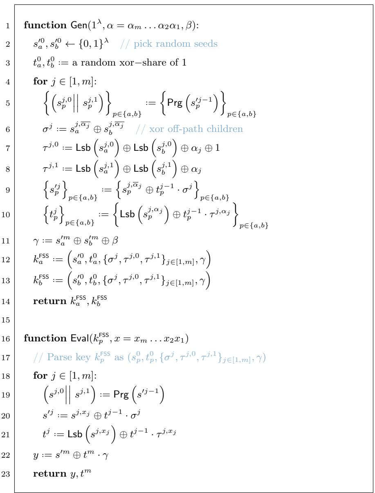  
Figure 1: Pseudocode for the Function Secret Sharing scheme. Our design follows Boyle et al. [11, 12].

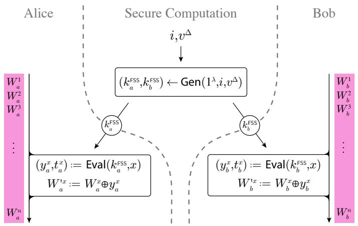

flowchart

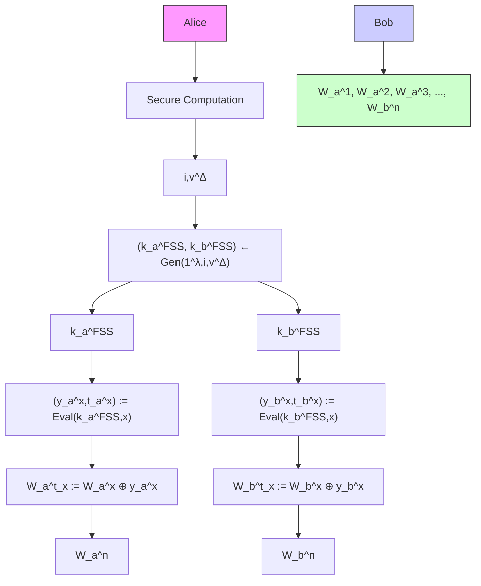
```mermaid
graph TD
    A["Alice"] --> B["Secure Computation"]
    B --> C["i,v^Δ"]
    C --> D["(k_a^FSS, k_b^FSS) ← Gen(1^λ,i,v^Δ)"]
    D --> E["k_a^FSS"]
    D --> F["k_b^FSS"]
    E --> G["(y_a^x,t_a^x) := Eval(k_a^FSS,x)"]
    F --> H["(y_b^x,t_b^x) := Eval(k_b^FSS,x)"]
    G --> I["W_a^t_x := W_a^x ⊕ y_a^x"]
    H --> J["W_b^t_x := W_b^x ⊕ y_b^x"]
    I --> K["W_a^n"]
    J --> L["W_b^n"]
    M["Bob"] --> N["W_a^1, W_a^2, W_a^3, ..., W_b^n"]
    style A fill:#f9f,stroke:#333
    style M fill:#ccf,stroke:#333
    style N fill:#cfc,stroke:#333
```

Figure 2: Diagram of Oblivious Write-only Memory. To perform a write, the secure computation generates shares of a DPF, $k _ { a } ^ { \mathsf { F S S } }$ and $k _ { b } ^ { \mathsf { F S S } }$ , which are distributed to Alice and Bob. Alice and Bob each evaluate the DPF at every value $x \in [ 1 , n ]$ and XOR the result into their respective corresponding shares of the OWOM memory.

More precisely, we represent the value at memory location i as $W ^ { i }$ , and party p’s share as $W _ { p } ^ { i } .$ where $W ^ { i } = W _ { a } ^ { i } \oplus W _ { b } ^ { i }$ . To write value $W ^ { \prime i }$ into the memory, the secure computation calculates $v ^ { \Delta } = W ^ { i } \oplus W ^ { \prime i }$ and then $( k _ { a } ^ { \mathsf { F S S } } , k _ { b } ^ { \mathsf { F S S } } ) \gets$ Gen $( 1 ^ { \lambda } , ( i , v ^ { \Delta } ) )$ , delivering $k _ { a } ^ { \mathsf { F S S } }$ to Alice and $k _ { b } ^ { \mathsf { F S S } }$ to Bob, who use these keys to derive $( y _ { p } ^ { x } , t _ { p } ^ { x } ) : = \mathsf { E v a l } ( k _ { p } ^ { \mathsf { F S S } } , x )$ for all $x \in [ 1 , n ]$ . For the purpose of writing, the parties will ignore $t _ { p } ^ { x }$ and use the main DPF output $y _ { p } ^ { x }$ , which they XOR into the underlying memory to perform the write, $W _ { p } ^ { \prime x } : = \dot { W } _ { p } ^ { x } \oplus y _ { p } ^ { x }$ .

Because write operations are performed by cumulatively XORing adjustment values with each $W ^ { i }$ , it is necessary to write the difference between the old and new values, rather than writing the new value directly. In absence of any mechanism for reading (or otherwise determining which values are currently stored), this limits our OWOM to use only in write-only, write-once situations. However, it will become a building block for a full ORAM in the next section. We depict this scheme in Figure 2.

Oblivious Read-Only Memory We implement read-only memory in a manner similar to classic PIR constructions. Alice and Bob, in their roles as the PIR servers, each hold identical copies of the memory, masked by the output of a pseudo-random function (PRF) using a key $k ^ { \mathsf { P R F } }$ that is known to the secure computation, but not to Alice or Bob individually. To read an element $R ^ { i }$ from the memory at a private index i (again, this index is given as private data within the protocol), Alice and Bob engage in a secure computation protocol to calculate $( k _ { a } ^ { \mathsf { F S S } } , k _ { b } ^ { \mathsf { F S S } } ) \gets \mathsf { G e n } ( 1 ^ { \lambda } , ( i , \beta ) )$ . Each party receives a $k _ { p } ^ { \mathsf { F S S } }$ and uses it to calculate $( y _ { p } ^ { x } , t _ { p } ^ { x } ) : = \mathsf { E v a l } ( k _ { p } ^ { \mathsf { F S S } } , x )$ for all $x \in [ 1 , n ]$ . Although the DPF $y _ { p } ^ { x }$ may have an arbitrary range $\beta ,$ for the purpose of reading, it is necessary that they hold a DPF of magnitude 1. Thus, the parties will use the final advice bits, $t _ { p } ^ { x } ,$ , which essentially represent the same DPF normalized to {0, 1}. Both parties compute $v _ { p } = \oplus _ { x } t _ { p } ^ { x } \cdot R ^ { x }$ . According to the properties of our FSS scheme, since $t _ { a } ^ { x } = t _ { b } ^ { x }$ for all $x \neq i .$ , it follows that $v _ { a } \oplus v _ { b } = R ^ { i }$ . Finally, Alice and Bob use a secure computation to evaluate $\mathsf { P r f } _ { k ^ { \mathsf { P R F } } } ( i ) \oplus R ^ { i }$ , effectively importing the semantic value of interest into the secure computation. We depict this scheme in Figure 3.

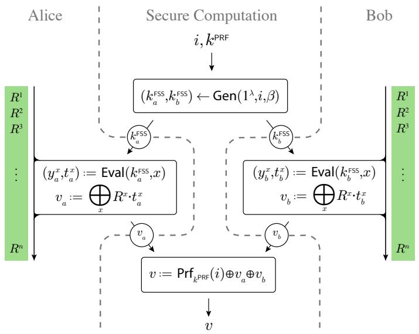

flowchart

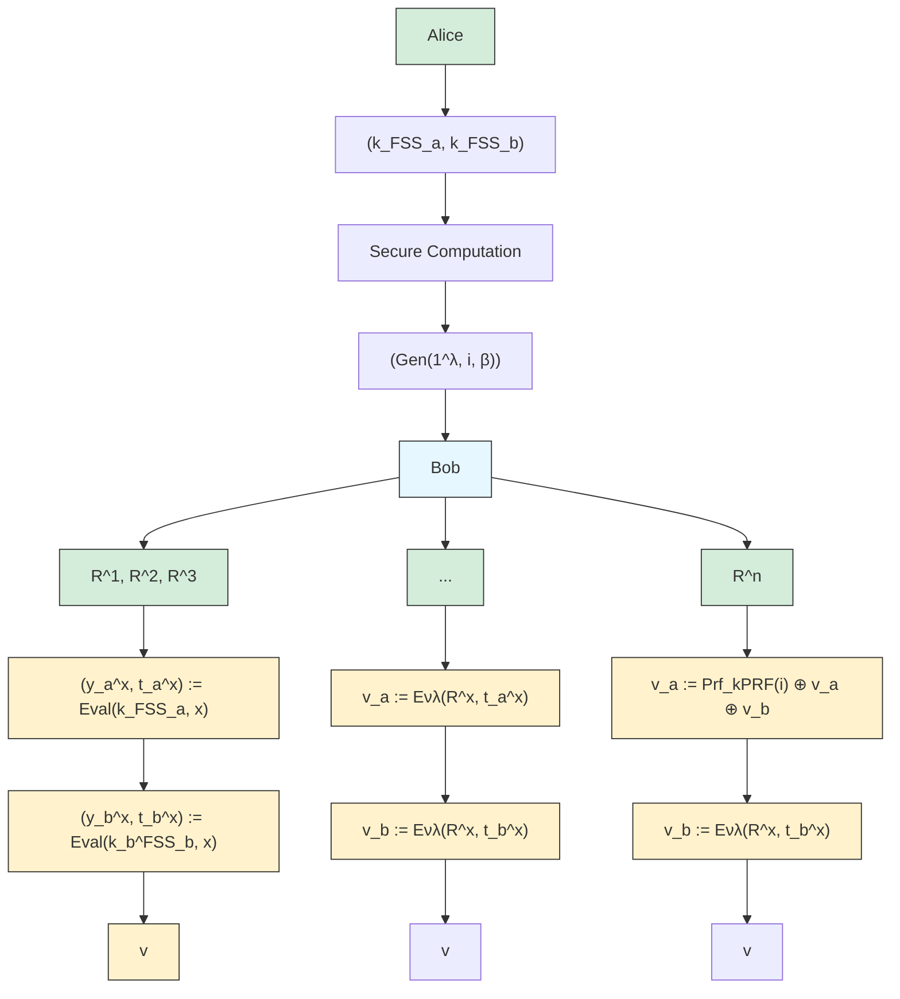
```mermaid
graph TD
    A["Alice"] --> B["(k_FSS_a, k_FSS_b)"]
    B --> C["Secure Computation"]
    C --> D["(Gen(1^λ, i, β))"]
    D --> E["Bob"]
    E --> F["R^1, R^2, R^3"]
    E --> G["..."]
    E --> H["R^n"]
    F --> I["(y_a^x, t_a^x) := Eval(k_FSS_a, x)"]
    G --> J["v_a := Ενλ(R^x, t_a^x)"]
    H --> K["v_a := Prf_kPRF(i) ⊕ v_a ⊕ v_b"]
    I --> L["(y_b^x, t_b^x) := Eval(k_b^FSS_b, x)"]
    J --> M["v_b := Ενλ(R^x, t_b^x)"]
    K --> N["v_b := Ενλ(R^x, t_b^x)"]
    L --> O["v"]
    M --> P["v"]
    N --> Q["v"]
    style A fill:#d4edda,stroke:#333
    style E fill:#e6f7ff,stroke:#333
    style F fill:#d4edda,stroke:#333
    style G fill:#d4edda,stroke:#333
    style H fill:#d4edda,stroke:#333
    style I fill:#fff2cc,stroke:#333
    style J fill:#fff2cc,stroke:#333
    style K fill:#fff2cc,stroke:#333
    style L fill:#fff2cc,stroke:#333
    style M fill:#fff2cc,stroke:#333
    style N fill:#fff2cc,stroke:#333
    style O fill:#fff2cc,stroke:#333
```

Figure 3: Diagram of Oblivious Read-Only Memory. To perform a read, the secure computation generates shares of a DPF, $k _ { a } ^ { \mathsf { F S S } }$ and $k _ { b } ^ { \mathsf { F S S } }$ , which are distributed to Alice and Bob. Alice and Bob each evaluate a normalized version of the DPF at every value $x \in [ 1 , n ]$ , calculate the dot product of the normalized DPF with their respective copies of the OROM memory, and feed the result back into the secure computation to compute the value v at location i.

Though this scheme permits an unlimited number of reads, it cannot be written. Each party stores a PRF-masked copy (i.e. an encryption) of the data rather than a secret share: were any single memory location to be changed by a write, the access pattern would be revealed; on the other hand, if all memory locations were changed during a write, the semantic values of those not being updated must be destroyed.

Complexity Analysis For both schemes, the secure FSS component (which forms the bulk of the secure computation) is identical. The computation of Gen $( 1 ^ { \lambda } , ( \alpha , \beta ) )$ requires $4 \log _ { 2 } ( n )$ evaluations of the PRG function, along with some basic boolean operations. It must be seeded with random data of length

$O ( \lambda )$ , and it produces an output of size $O ( \lambda \log n )$ where λ is the security parameter. This output can be revealed to the computation parties all at once, or incrementally, in log n chunks of λ bits, one for each layer of the FSS scheme. In the former case, the secure component incurs a memory complexity of $O ( \lambda \log n )$ 号 and $O ( 1 )$ communication rounds. In the latter case, the secure component incurs a memory complexity of $O ( \lambda )$ , and no additional rounds, as the secure computation does not need to wait for replies. In either case, the communication and computation complexities are $O ( \lambda \log n )$ .

Subsequently, a local computation is required to construct the DPF, $( y _ { p } ^ { x } , t _ { p } ^ { x } ) : =$ Eva ${ \mathsf { I } } ( k _ { p } ^ { \mathsf { F S S } } , x )$ for all $x \in [ 1 , n ]$ . If all n FSS evaluations are combined into a single operation, then the FSS tree can be constructed in its entirety only once, requiring $O ( n )$ PRG calls. In the case of a write, each of the n elements in the output DPF’s domain must be XORed into the corresponding memory location; in the case of a read, the dot product of the DPF and the memory must be taken instead. In either case, this incurs $O ( n )$ memory accesses. All of the operations performed by the local FSS evaluation and the application of the output DPF are highly parallelizable. We make extensive use of this fact in our concrete implementation, and in Section 7 we show experimentally that the local component does not become a significant burden until the amount of data stored is on the order of hundreds of megabytes.

# 4 Reading and Writing

We now combine the OWOM and OROM from Section 3 into an ORAM construction. We need a few building blocks in order to make this combination possible, and conjecture that these building blocks are sufficient for the combination of any PIR and PIR-writing schemes into an ORAM, assuming that the schemes themselves are suitable (that is, their access patterns and underlying memory formats are secure).

At a high level, the construction works as follows: we initialize both an OROM and an OWOM with the same data, and create a linear-scan stash that stores elements while they are waiting to be returned to the main memory. Read operations are performed by inspecting both the stash and the OROM, and returning the most recent data. Write operations are performed by first reading the current value at the specified index, using it to calculate the difference necessary to correctly update the OWOM, and finally writing the new value into both the OWOM and the stash. When the stash fills, we perform a refresh operation to convert the OWOM memory into OROM memory, and then clear the stash. The cost of this refresh can be amortized over the refresh period of the construction. Because we use this stash-and-refresh technique, our amortized secure computation complexity becomes $O ( \sqrt { n } )$ .

Refresh Procedure To refresh our ORAM construction, we need to convert the underlying memory of an OWOM into the underlying memory of an OROM. The former stores its data as XOR-shares, while the latter uses a masked copy of the data as the underlying format. We can avoid incurring any secure computation overhead at all if, instead of masking the OROM memory only once, using a key known only to the secure computation, we mask it first with a key known only to Alice, and then with a key known only to Bob. To convert the OWOM into an OROM, Alice and Bob mask their local OWOM memory shares using two PRFs with individual secret keys, $k _ { a } ^ { \mathsf { P R F } }$ and $k _ { b } ^ { \mathsf { P R F } }$ .

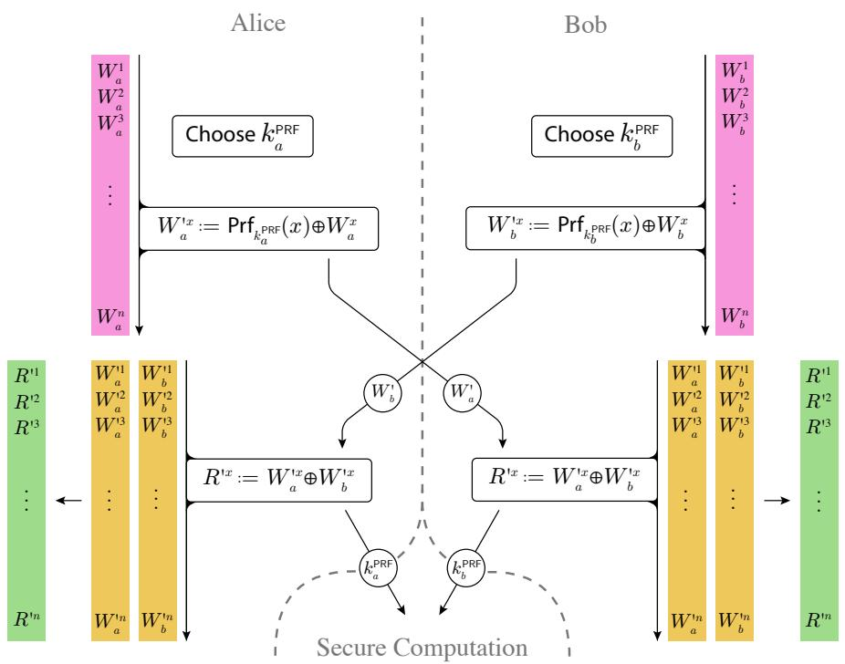

flowchart

```mermaid
graph TD
    subgraph Alice
        A1["W_a^1"] --> B1["Choose k_a^PRF"]
        A2["W_a^2"] --> B1
        A3["W_a^3"] --> B1
        A4["..."] --> B1
        A5["W_a^n"] --> B1
        B1 --> C1["W_a^t_x := Prf_k_a^PRF(x) ⊕ W_a^x"]
    end

    subgraph Bob
        C1 --> D1["Choose k_b^PRF"]
        C2["W_b^1"] --> D1
        C3["W_b^2"] --> D1
        C4["W_b^3"] --> D1
        C5["..."] --> D1
        C6["W_b^n"] --> D1
    end

    subgraph Secure Computation
        D1 --> E1["R'x := W_a^t_x ⊕ W_b^t_x"]
        D2["R'x := W_a^t_x ⊕ W_b^t_x"] --> E2["k_a^PRF"]
        D3["R'x := W_a^t_x ⊕ W_b^t_x"] --> E3["k_b^PRF"]
    end

    A1 --> B1
    A2 --> B1
    A3 --> B1
    A4 --> B1
    A5 --> B1
    A6 --> B1
    A7 --> B1
    A8 --> B1
    A9 --> B1
    A10 --> B1
    A11 --> B1
    A12 --> B1
    A13 --> B1
    A14 --> B1
    A15 --> B1
    A16 --> B1
    A17 --> B1
    A18 --> B1
    A19 --> B1
    A20 --> B1
    A21 --> B1
    A22 --> B1
    A23 --> B1
    A24 --> B1
    A25 --> B1
    A26 --> B1
    A27 --> B1
    A28 --> B1
    A29 --> B1
    A30 --> B1
    A31 --> B1
    A32 --> B1
    A33 --> B1
    A34 --> B1
    A35 --> B1
    A36 --> B1
    A37 --> B1
    A38 --> B1
    A39 --> B1
    A40 --> B1
    A41 --> B1
    A42 --> B1
    A43 --> B1
    A44 --> B1
    A45 --> B1
    A46 --> B1
    A47 --> B1
    A48 --> B1
    A49 --> B1
    A50 --> B1
    A51 --> B1
    A52 --> B1
    A53 --> B1
    A54 --> B1
    A55 --> B1
    A56 --> B1
    A57 --> B1
    A58 --> B1
    A59 --> B1
    A60 --> B1
    A61 --> B1
    A62 --> B1
    A63 --> B1
    A64 --> B1
    A65 --> B1
    A66 --> B1
    A67 --> B1
    A68 --> B1
    A69 --> B1
    A70 --> B1
    A71 --> B1
    A72 --> B1
    A73 --> B1
    A74 --> B1
    A75 --> B1
    A76 --> B1
    A77 --> B1
    A78 --> B1
    A79 --> B1
    A80 --> B1
```

Figure 4: Diagram of the Floram Refresh method. In addition to the operations illustrated here, the secure computation must clear the stash.

$$
W _ {p} ^ {\prime} := \left\{W _ {p} ^ {\prime x} := \operatorname * {P r f} _ {k _ {p} ^ {\text { PRF }}} (x) \oplus W _ {p} ^ {x} \right\} _ {x \in [ 1, n ]}
$$

They each transmit their masked OWOM memory share to the other party, and both parties calculate

$$
R ^ {\prime} := \left\{R ^ {\prime x} := W _ {a} ^ {\prime x} \oplus W _ {b} ^ {\prime x} \right\} _ {x \in [ 1, n ]}
$$

Finally, each party feeds their key $k _ { p } ^ { \mathsf { P R F } }$ into the secure computation, so that the OROM memory can be unmasked via $v : = \mathsf { P r f } _ { k _ { a } ^ { \mathsf { P R F } } } ( x ) \oplus \mathsf { P r f } _ { k _ { b } ^ { \mathsf { P R F } } } ( x ) \oplus R ^ { x }$ . This refresh procedure is illustrated in Figure 4. Unlike previous Square-root ORAM constructions [21, 56], our refresh procedure does not require access to the stash. Instead, we simply clear it. Our stash serves only the purpose of allowing updated elements to be accessed multiple times between refreshes.

Semi-private Access It may be the case that some algorithms call for both private (i.e. data-dependent) and data independent accesses to the same memory. Ostrovsky and Shoup refer to the latter type of accesses as semi-private [35]. To our knowledge, it has heretofore been necessary to implement all accesses as fully private accesses in such a scenario, or to perform costly import and export operations upon the entire ORAM. Floram, however, allows for a secondary, semi-private access mechanism, which has a significantly reduced asymptotic and practical cost. Unlike all other ORAMs of which we are aware, Floram stores each memory element at the physical address corresponding to its semantic index. Thus, to read the element at the publicly known semantic index i, the two parties feed their OWOM memory shares $W _ { a } ^ { i }$ and $\boldsymbol { W } _ { b } ^ { i }$ into the secure computation, which computes the value $W ^ { i }$ in $O ( 1 )$ complexity (and potentially using only free gates [29]). Semi-private writes must additionally append to the stash.

Private Read Access Read operations that are publicly known to be read operations can also be performed without invoking the full-access mechanism: neither a write to the stash nor a write to the OWOM is required. Because no write to the stash is required, ORAM reads do not contribute to the refresh period.

Full Private Access A full private access accepts some arbitrary oblivious function f and applies it to a single element within the ORAM. f takes an ORAM element and some auxiliary input $v ^ { f }$ , and produces a new element and some auxiliary output $y ^ { f }$ . We use this general-purpose mechanism to implement ORAM writes via simple $f _ { \mathrm { w r i t e } }$ that returns $v ^ { f }$ as the output element. To perform a full access, our scheme first retrieves the desired element from the OROM, then scans the stash to determine whether a newer version of the same element exists. f is then applied to it. Finally, the result is stored using an OWOM operation and appended to the stash. Because the OROM and OWOM access the same element, they can share a single FSS evaluation. This process is illustrated in Figure 5.

Initialization The initialization of our ORAM can be performed efficiently using the mechanism for refreshing that we described earlier. That is, assuming that the parties begin with some secret sharing of the data values with which the ORAM is to be filled, they may initialize it by copying those shares into the OWOM’s memory and performing a refresh. If the ORAM is hosted by a Yao’s Garbled Circuits protocol, then the point-and-permute technique of Beaver et al. [4] can be used to encode XOR shares of the data within the protocol’s wire labels, effectively making the generation of shares a free action. Furthermore, because this technique encodes the XOR sharing of each data bit only in the final bit of a much larger wire-label, it is actually a significant constant factor faster to initialize our ORAM than it is to perform a single linear scan on the same data. To our knowledge, this property is unique among all known ORAMs.

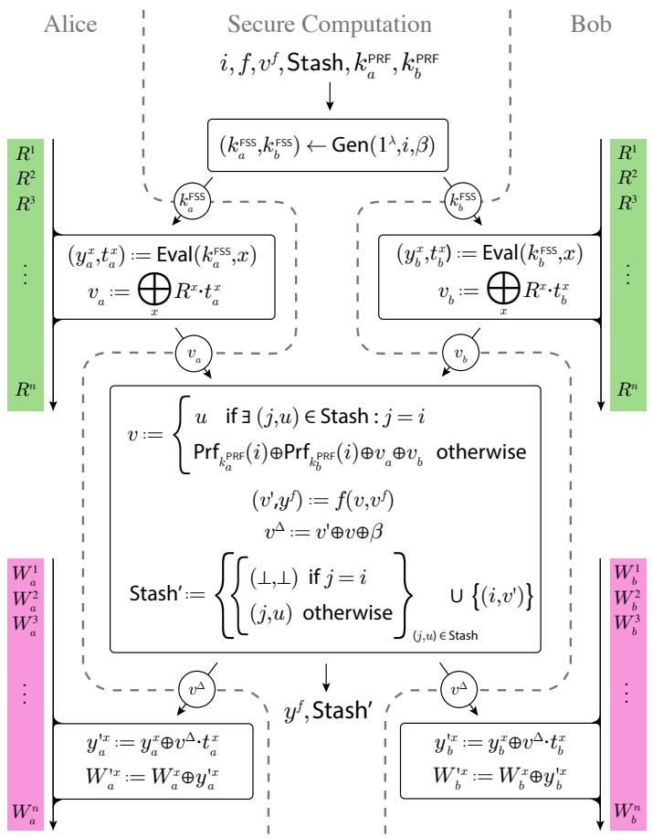

flowchart

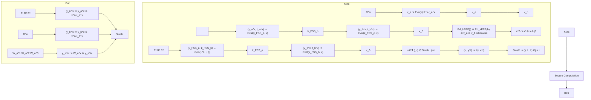
```mermaid
graph TD
    A["Alice"] --> B["Secure Computation"]
    B --> C["Bob"]
    subgraph Alice
        D1["R¹ R² R³"] --> E1["(k_FSS_a, k_FSS_b) ← Gen(1^λ, i, β)"]
        D2["..."] --> E2["(y_a^x, t_a^x) := Eval(k_FSS_a, x)"]
        D3["R^n"] --> E3["v_a := Ενα(x) R^x·t_a^x"]
        E1 --> F1["k_FSS_a"]
        E2 --> F2["k_FSS_b"]
        E3 --> F3["v_a"]
        F1 --> G1["(y_b^x, t_b^x) := Eval(k_FSS_b, x)"]
        F2 --> G2["(y_b^x, t_b^x) := Eval(k_FSS_c, x)"]
        F3 --> G3["v_b"]
        G1 --> H1["v_Δ"]
        G2 --> H2["v_Δ"]
        H1 --> I1["u if ∃ (j,u) ∈ Stash : j = i"]
        H2 --> I2["Prf_kPRF(i) ⊕ Prf_kPRF(b) ⊕ v_a ⊕ v_b otherwise"]
        I1 --> J1["(v', y^f) := f(v, v^f)"]
        I2 --> J2["v^Δ := v' ⊕ v ⊕ β"]
        J1 --> K1["Stash' := { (⊥,⊥) if j = i "]
    end
    subgraph Bob
        L1["R¹ R² R³"] --> M1["y_a^tx := y_a^x ⊕ v^Δ·t_a^x"]
        L2["R^n"] --> M2["y_b^tx := y_b^x ⊕ v^Δ·t_b^x"]
        L3["W_a^1 W_a^2 W_a^3"] --> M3["y_a^tx := W_a^x ⊕ y_a^tx"]
        M1 --> N["Stash'"]
        M2 --> N
        M3 --> N
    end
```

Figure 5: Diagram of the Floram Access method. Note that $\beta$ is randomly chosen on each access.

Complexity Analysis If we briefly set aside the stash, the complexities of our scheme for full access to private indices closely follow the complexities of the individual components described in Section 3. That is, each access requires a single FSS Gen execution within the secure context, incurring $O ( \log n )$ communication and secure computation, followed by the evaluation of the DPF at all points in its domain, incurring $O ( n )$ local computation by both parties. This is in turn followed by a memory scan for the ROM component, adding a further $O ( n )$ local computation, an unmasking within the secure computation context, which accounts for $O ( 1 )$ communication and secure computation complexity, and a local memory scan for the WOM component, which incurs a further $O ( n )$ local computation. Thus, still ignoring the stash, a standard access operation incurs $O ( \log n )$ secure computation and communication overall, as well as $O ( n )$ local computation.

The stash must be traversed on each access, and its length depends upon the refresh period of the ORAM. The refresh operation requires a simple masking (i.e. encryption), transmission, and element-wise XOR of n memory elements by each of the two parties, without any secure computation. Thus the total cost of a refresh is $O ( n )$ in terms of local computation and communication. This is optimally amortized over $O ( { \sqrt { n } } )$ accesses, and thus the cost of each access must include the cost of scanning $O ( { \sqrt { n } } )$ elements in the stash. The optimal constant can be determined by the relative costs of secure and local scans. Our concrete implementation uses a stash of size ${ \sqrt { n } } / 8$ . A summary of these costs, along with comparisons to other ORAM schemes, is provided in Table 1.

<table><tr><td></td><td colspan="4">Access</td></tr><tr><td></td><td>Floram</td><td>Florom</td><td>Square-root</td><td>Circuit</td></tr><tr><td>Secure Computation</td><td> $O(\sqrt{n})$ </td><td> $O(\log n)$ </td><td> $O(\sqrt{n\log^{3}n})$ </td><td> $O(\log^{3}n)$ </td></tr><tr><td>Local Computation</td><td> $O(n)$ </td><td> $O(n)$ </td><td> $O(\sqrt{n\log n})$ </td><td> $O(1)$ </td></tr><tr><td>Communication</td><td> $O(\sqrt{n})$ </td><td> $O(\log n)$ </td><td> $O(\sqrt{n\log^{3}n})$ </td><td> $O(\log^{3}n)$ </td></tr><tr><td>Rounds</td><td> $O(1)$ </td><td> $O(1)$ </td><td> $O(\log n)$ </td><td> $O(\log n)$ </td></tr></table>

<table><tr><td></td><td colspan="4">Initialization</td></tr><tr><td></td><td>Floram</td><td>Florom</td><td>Square-root</td><td>Circuit</td></tr><tr><td>Secure Computation</td><td>-</td><td>-</td><td> $O(n \log^2 n)$ </td><td> $O(n \log^3 n)$ </td></tr><tr><td>Local Computation</td><td> $O(n)$ </td><td> $O(n)$ </td><td> $O(n \log n)$ </td><td> $O(1)$ </td></tr><tr><td>Communication</td><td> $O(n)$ </td><td> $O(n)$ </td><td> $O(n \log^2 n)$ </td><td> $O(n \log^3 n)$ </td></tr><tr><td>Rounds</td><td> $O(1)$ </td><td> $O(1)$ </td><td> $O(\log n)$ </td><td> $O(n \log n)$ </td></tr></table>

Table 1: Access and Initialization Complexities. Complexities include amortized refresh operations where relevant. Florom refers an instantiation of Floram with a stash size of zero (i.e. one which has recently been refreshed); due to the fact that only writes increase the stash size, refreshes can be forced before long sequences of reads to achieve these complexities.

The asymptotic complexity of our initialization procedure is $O ( n )$ in terms of local computation, memory, and communication. Like the refresh procedure on which it is based, it requires no secure computation at all. This is optimal, at least from a complexity standpoint. Furthermore, as we shall see in Section 7, the practical costs of our initialization procedure are so low that it is actually faster in practice than a simple memcpy over the same data.

Comparison to other ORAM schemes Our ORAM scheme stands in contrast to those that have preceded it in a number of respects, as summarized in Table 1. Here we discuss their implications. We focus primarily on the secure component of our scheme (which cannot be parallelized), and explore the practical consequences of the local component in Section 7. Although our ORAM uses a simple stash that incurs square-root overhead, it does not use recursive position maps or permutations required by Zahur et al.’s construction [56], nor does it need the sorting and binary searching required by the classic Goldreich and Ostrovsky construction [21]. Consequently, its optimal stash size is much smaller. Moreover, our scheme can be refreshed more efficiently than that of Zahur et al., and much more efficiently than classic Square-root ORAM, which requires O(n) encryptions within the secure context as well as an oblivious sort for each refresh operation. In previous Square-root ORAM constructions, stash scan and amortized refresh operations accounted for the vast majority of per-access cost; in having provided asymptotic improvements to both (as well as significant constant cost improvements), we have made our new ORAM far more suitable than its predecessors for handling large data sizes. On the other hand, our ORAM requires O(log n) calls to a PRG within the secure context for each access. Because these PRG calls are expensive, our ORAM is less suitable than that of Zahur et al. for small data sizes. In Section 5, we describe a method for reducing the number of secure PRG calls to O(1) at the cost of incurring O(log n) communication rounds. This significantly improves our performance for small values of n, but for very small values, the construction of Zahur et al. remains more efficient in practice.

A comparison to Circuit ORAM (and other tree-based ORAMs) is somewhat less straightforward. Our ORAM enjoys an initialization procedure many orders of magnitude more efficient; however, in terms of access complexity, Circuit ORAM remains ahead. Nonetheless, as we shall discuss in Section 7, reduction in constant costs renders our scheme far more efficient in practice. Boyle et al. [10] propose a parallelization method for tree-based ORAMs, from which it is possible to derive an initialization procedure that uses permutations in place of individual writes. With this mechanism, Circuit ORAMs could achieve initialization performance similar to that of Zahur et al.’s construction, at best.3 Although the local component of our ORAM is highly parallelizable, no equivalent parallelization scheme for our secure component is possible.

Finally, it is worthwhile to acknowledge the distinctions between our scheme and the recent work of Abraham et al. [2], which also combined ORAM with PIR. Like Floram, their scheme is properly a Distributed ORAM, but in contrast, their scheme uses PIR to retrieve single elements along the branches of a larger recursive tree ORAM. Consequently, it shares more with Circuit ORAM and Onion ORAM [15] than it does with our scheme. They optimize for communication overhead, and their scheme achieves a communication complexity of O(log n) per access, which we can match only when no writes are performed. Furthermore, it is likely that PIR-server computation is significantly less burdensome in their scheme, since their PIR requires no PRG and is evaluated over only O(log n) elements. On the other hand, they primarily consider the outsourcing model, and do not account for costs in an MPC context. We find it likely4 that these would be similar to Circuit ORAM.

Security Analysis To argue that our scheme is semi-honest secureunder the definition of security given in Appendix A.2, we must present a simulator that produces a party’s view of an ORAM operation (without receiving any information about other parties’ private inputs) that is indistinguishable from the same party’s view of the real ORAM operation. Simulators for access and initialization, along with proofs of computational indistinguishability, are presented in Appendix B.1. Informally, the security of our scheme follows from the security properties of the MPC technique chosen to host the construction and the security of the FSS scheme, which guarantees that the neither the FSS key share nor the output leaks any information about the associated point function, other than its domain and range. The underlying memory itself reveals nothing about its contents due to its mechanism of representation: each party views an OROM memory that is masked by the output of a PRF for which they key is not known, as well as an information-theoretically secure secret-share of an OWOM memory

PRG and PRF Among several options for the PRG, we have chosen AES-128 [1]. Significant research effort has been put toward optimizing the booleancircuit representation of AES [8, 50], and these optimizations have naturally been adapted for the context of secure computation [26]. Specifically, we use the AES S-box circuit of Boyar and Peralta [9], which requires less than 5000 non-free gates per block, and we accelerate local AES evaluations using Intel’s AES-NI instruction set. In order to avoid the cost of repeated key expansion, we assume that AES satisfies the ideal cipher property and use the Davies-Meyer construction [49], with independent keys for left and right expansions in the FSS tree. We use AES in counter mode as the PRF that masks the OROM.

# 5 Constant Secure PRG Evaluations

The costliest single component of our scheme is the repeated evaluation of the PRG function within the secure computation of the FSS Gen algorithm. In this section, we present an optimization that can be used to achieve a significant constant-factor speed improvement relative to a naïve implementation by outsourcing the evaluations of the PRG in the FSS Gen algorithm to Alice and Bob. That is, instead of Alice and Bob performing a single secure computation which uses O(log n) PRG expansions to compute their shares of the FSS key (line 5 in Figure 1), we instead divide Gen into $m = \log _ { 2 } n$ iterative computations that compute the FSS key one part at a time. Surprisingly, we can divide the computation in a manner that requires no PRG evaluations inside the secure computation, and that also maintains the security properties of the original.5 Specifically, we devise an equivalent method of computing the value $\sigma ^ { j }$ (line 6 in Figure 1) that does not require the PRG to be evaluated in a secure computation. Hereafter, we refer to this as the Constant PRG or CPRG optimization.

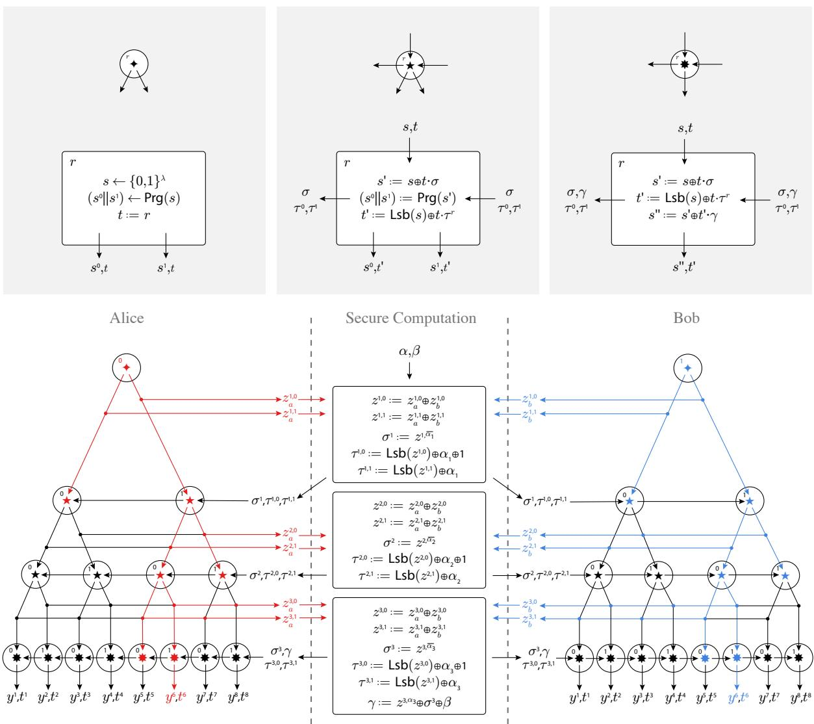

flowchart

```mermaid
graph TD
    subgraph Alice
        A1["0"] --> B1["z^1,0_a"]
        A1 --> B2["z^1,1_a"]
        A2["0"] --> B3["z^2,0_a"]
        A2 --> B4["z^2,1_a"]
        A3["0"] --> B5["z^3,0_a"]
        A3 --> B6["z^3,1_a"]
        A4["0"] --> B7["z^3,0_a"]
        A4 --> B8["z^3,1_a"]
        A5["0"] --> B9["z^3,0_a"]
        A5 --> B10["z^3,1_a"]
        A6["0"] --> B11["z^3,0_a"]
        A6 --> B12["z^3,1_a"]
        A7["0"] --> B13["z^3,0_a"]
        A7 --> B14["z^3,1_a"]
        A8["0"] --> B15["z^3,0_a"]
        A8 --> B16["z^3,1_a"]
        A9["0"] --> B17["z^3,0_a"]
        A9 --> B18["z^3,1_a"]
        A10["0"] --> B19["z^3,0_a"]
        A10 --> B20["z^3,1_a"]
        A11["0"] --> B21["z^3,0_a"]
        A11 --> B22["z^3,1_a"]
        A12["0"] --> B23["z^3,0_a"]
        A12 --> B24["z^3,1_a"]
        A13["0"] --> B25["z^3,0_a"]
        A13 --> B26["z^3,1_a"]
        A14["0"] --> B27["z^3,0_a"]
        A14 --> B28["z^3,1_a"]
        A15["0"] --> B29["z^3,0_a"]
        A15 --> B30["z^3,1_a"]
        A16["0"] --> B31["z^3,0_a"]
        A16 --> B32["z^3,1_a"]
        A17["0"] --> B33["z^3,0_a"]
        A17 --> B34["z^3,1_a"]
        A18["0"] --> B35["z^3,0_a"]
        A18 --> B36["z^3,1_a"]
        A19["0"] --> B37["z^3,0_a"]
        A19 --> B38["z^3,1_a"]
        A20["0"] --> B39["z^3,0_a"]
        A20 --> B40["z^3,1_a"]
        A21["0"] --> B41["z^3,0_a"]
        A21 --> B42["z^3,1_a"]
        A22["0"] --> B43["z^3,0_a"]
        A22 --> B44["z^3,1_a"]
        A23["0"] --> B45["z^3,0_a"]
        A23 --> B46["z^3,1_a"]
        A24["0"] --> B47["z^3,0_a"]
        A24 --> B48["z^3,1_a"]
        A25["0"] --> B49["z^3,0_a"]
        A25 --> B50["z^3,1_a"]
        A26["0"] --> B51["z^3,0_a"]
        A26 --> B52["z^3,1_a"]
        A27["0"] --> B53["z^3,0_a"]
        A27 --> B54["z^3,1_a"]
        A28["0"] --> B55["z^3,0_a"]
        A28 --> B56["z^3,1_a"]
        A29["0"] --> B57["z^3,0_a"]
        A29 --> B58["z^3,1_a"]
        A30["0"] --> B59["z^3,0_a"]
        A30 --> B60["z^3,1_a"]
        A31["0"] --> B61["z^3,0_a"]
        A31 --> B62["z^3,1_a"]
        A32["0"] --> B63["z^3,0_a"]
        A32 --> B64["z^3,1_a"]
        A33["0"] --> B65["z^3,0_a"]
        A33 --> B66["z^3,1_a"]
    end
    subgraph Secure Computation
        C1["a,b"] --> D1
    end
    subgraph Bob
        E1["b"] --> F1["b"]
    end
    style Alice fill:#f9f9f9,stroke:#ccc
    style Secure Computation fill:#e6f7ff,stroke:#ccc
```

Figure 6: Diagram of the modified Gen/Eval algorithm used by the CPRG optimization. Variables and processes for which Alice and Bob’s views are identical are rendered in black. Variables and processes for which Alice and Bob’s views differ are rendered in red for Alice and blue for Bob. In this example, $n = 8 , m = 3$ , and α is a three-bit number with value 6.

Thus far, our FSS notation has only identified seeds $s _ { p } ^ { j , \alpha _ { j } }$ that are on the path from the root to the leaf α in the FSS evaluation tree. We now introduce notation to identify all of the nodes in the evaluation tree. Let $S _ { p } ^ { j , \ell }$ denote the $\ell ^ { \mathrm { t h } }$ node from the left at level j of player p’s FSS evaluation tree, where $p \in \{ a , b \} , j \in [ 1 , m ]$ , and $\ell \in [ 0 , 2 ^ { j } )$ . Thus, seed $s _ { a } ^ { j , \alpha _ { j } }$ can also be identified as node $S _ { a } ^ { j , \alpha _ { j } ^ { * } }$ where $\alpha _ { j } ^ { * }$ is the integer with the binary representation $\alpha _ { j } \ldots \alpha _ { 2 } \alpha _ { 1 }$ .

Next, we observe that the FSS construction guarantees that at any level $j ,$ , $S _ { a } ^ { j , \ell } = \dot { S } _ { b } ^ { j , \ell }$ for all $\ell \neq \alpha ^ { * }$ (that is, for all nodes except the one along the path to leaf $\alpha )$ , and $S _ { a } ^ { j , \alpha _ { j } ^ { * } } \neq S _ { b } ^ { j , \dot { \alpha } _ { j } ^ { * } }$ . It follows that all of the PRG expansions of the nodes at level $j , \mathrm { i . e . }$ ., the uncorrected children at level $j + 1$ , are equal except for the two children of the node along the path to $\alpha .$ . Finally, consider the sum of the PRG expansions of $S _ { p } ^ { j , \ell }$ for $\ell \in [ 0 , 2 ^ { j } )$ :

$$
\left(z _ {p} ^ {j + 1, 0} \Big | \Big | z _ {p} ^ {j + 1, 1}\right) = \bigoplus_ {\ell \in [ 0, 2 ^ {j})} \operatorname{Prg} \left(S _ {p} ^ {j, \ell}\right)
$$

From the above, we have:

$$
z _ {a} ^ {j, 0} \oplus z _ {b} ^ {j, 0} = s _ {a} ^ {j, 0} \oplus s _ {b} ^ {j, 0}
$$

$$
z _ {a} ^ {j, 1} \oplus z _ {b} ^ {j, 1} = s _ {a} ^ {j, 1} \oplus s _ {b} ^ {j, 1}
$$

$$
\sigma^ {j} = z _ {a} ^ {j, \overline {{\alpha_ {j}}}} \oplus z _ {b} ^ {j, \overline {{\alpha_ {j}}}}
$$

Thus, we instruct Alice and Bob to locally compute $z _ { p } ^ { j , 0 }$ and $z _ { p } ^ { j , 1 }$ by accumulating the XOR of all left children and all right children at each level. These two values are submitted to a secure computation, which selects the correct sum using bit $\overline { { \alpha _ { j } } }$ , computes the next advice words $( \sigma ^ { j } , \tau ^ { j , 0 } , \tau ^ { j , 1 } )$ and returns them to both parties. Both parties can then apply these values (per lines 9–10 in Figure 1) to generate the corrected seeds for all nodes at the next level, and then continue the process until level $m$ . Revised pseudocode is presented in Figure 7. Although we model this function as returning a pair of key values $\left( k _ { a } ^ { \mathsf { F S S } } , k _ { b } ^ { \mathsf { F S S } } \right)$ , note that most components of each party’s key are revealed to them over the course of the function, and furthermore, that both parties will have had to perform most of the work of evaluating $\mathsf { E v a l } ( k _ { p } ^ { \mathsf { F S S } } , x )$ for all $x \in [ 1 , n ]$ in order to calculate $( z _ { p } ^ { j , 0 } , z _ { p } ^ { j , 1 } )$ . Consequently, in practice, the CPRG-optimized Gen algorithm returns only those key components that have not already been revealed, and Alice and Bob evaluate Eval simultaneously with the evaluation of Gen. This process is illustrated in Figure 6.

Security Analysis Relative to the original Gen algorithm, nothing additional is revealed to either party, i.e., the output of the CPRG-optimized Gen is exactly the same, and the view of each party can be easily simulated with the final key. The only difference is that the advice strings included in the output key are revealed one by one. In the honest-but-curious setting that we consider here, the adversary has no additional power when receiving outputs in this manner.

Efficiency Analysis The CPRG optimization requires no calls to the PRG function within the secure evaluation of Gen, and only two calls to the PRF to unmask the value retrieved from the OROM. We still perform O(log n) differencing and advice bit generation steps, but these require only a handful of gates each. On the other hand, our local stage now requires a reduction to be performed over all of the blocks in each layer of the FSS Eval algorithm. Consequently, this variant is significantly more efficient for small and medium sized memories, where secure computation dominates total runtime, but slightly less efficient for memories on the scale of gigabytes, as shown by our evaluations in Section 7.

function Gen(1 $^{\lambda}$ , $\alpha = \alpha_{m} \ldots \alpha_{2}\alpha_{1}, \beta$ ): $S_{a}^{\prime 0,0}, S_{b}^{\prime 0,0} \leftarrow \{0,1\}^{\lambda}$ // pick random seeds $t_{a}^{0,0}, t_{b}^{0,0} := \text{a random xor-share of } 1$ for $j \in [1,m]$ :
    for $p \in \{a,b\}$ : // local computations $\left\{ \left( S_{p}^{j,2\ell} \middle| S_{p}^{j,2\ell+1} \right) \right\}_{\ell \in [0,2^{j-1})} := \left\{ \text{Prg } \left( S_{p}^{\prime j-1,\ell} \right) \right\}_{\ell \in [0,2^{j-1})}$ $z_{p}^{j,0} := \left( \bigoplus_{\ell \in [0,2^{j-1})} S_{p}^{j,2\ell} \right)$ $z_{p}^{j,1} := \left( \bigoplus_{\ell \in [0,2^{j-1})} S_{p}^{j,2\ell+1} \right)$ $\sigma^{j} := z_{a}^{j,\overline{\alpha_{j}}} \oplus z_{b}^{j,\overline{\alpha_{j}}}$ // xor off-path children $\tau^{j,0} := \text{Lsb } (z_{a}^{j,0}) \oplus \text{Lsb } (z_{b}^{j,0}) \oplus \alpha_{j} \oplus 1$ $\tau^{j,1} := \text{Lsb } (z_{a}^{j,1}) \oplus \text{Lsb } (z_{b}^{j,1}) \oplus \alpha_{j}$ for $p \in \{a,b\}$ : // local computations $\left\{ S_{p}^{\prime j,\ell} \right\}_{\ell \in [0,2^{j})} := \left\{ S_{p}^{j,\ell} \oplus t_{p}^{j-1,\lfloor\ell/2\rfloor} \cdot \sigma^{j} \right\}_{\ell \in [0,2^{j})}$ $\left\{ t_{p}^{j,\ell} \right\}_{\ell \in [0,2^{j})} := \left\{ \text{Lsb } (S_{p}^{j,\ell}) \oplus t_{p}^{j-1,\lfloor\ell/2\rfloor} \cdot \tau^{j,\text{Lsb }(\ell)} \right\}_{\ell \in [0,2^{j})}$ $\gamma := z_{a}^{m,\alpha_{m}} \oplus z_{b}^{m,\alpha_{m}} \oplus \sigma^{m} \oplus \beta$ $k_{a}^{\text{FSS}} := (S_{a}^{\prime 0,0}, t_{a}^{0,0}, \{\sigma^{j}, \tau^{j,0}, \tau^{j,1}\}_{j \in [1,m]}, \gamma)$ $k_{b}^{\text{FSS}} := (S_{b}^{\prime 0,0}, t_{b}^{0,0}, \{\sigma^{j}, \tau^{j,0}, \tau^{j,1}\}_{j \in [1,m]}, \gamma)$ return $k_{a}^{\text{FSS}}, k_{b}^{\text{FSS}}$   
Figure 7: Pseudocode for the Constant PRG optimization applied to the FSS Gen method. This optimization is discussed in Section 5.

# 6 Techniques and Optimizations

In this section we present a few additional optimizations that we employ to improve the practical performance of Floram.

# 6.1 Tree Trimming

During private read operations (that is, accesses wherein the index i is private but the operation is publicly known to be a read), the scheme as previously described generates a full FSS tree with one leaf per ORAM element, but uses only the DPF t and never the DPF y. As an optimization, we can truncate the last $\log _ { 2 } ( \log _ { 2 } ( | G | ) )$ levels of the FSS tree, split each leaf into individual bits, and set $\beta = 2 ^ { ( i }$ mod $\log _ { 2 } ( | G | ) )$ such that the bits formed from y are equivalent to the bits t would otherwise have held. As can be seen in Figure 8, in both the standard FSS and CPRG cases these last levels (seven in our implementation) are by far the most expensive.

In the standard FSS case, we may save some additional time by trimming the root of the tree. The first five iterations of the loop in the FSS Gen algorithm expand a single seed into 32. In our implementation (without the CPRG optimization), these five loops account for roughly 100,000 non-free gates in the secure computation. As an optimization, we eliminate them, and instead collect enough random coins from each party to generate 32 seeds directly, and include all of them in the output keys. This increases the input size of the secure computation that evaluates Gen, but the savings are nonetheless substantial. The Eval method is similarly changed to index the correct starting seed from the 32 in the key.

# 6.2 Multithreading and Scheduling

We interleave several steps of our ORAM for efficiency. First, as the secure computation produces the output of Gen, we use separate threads to begin the local Eval steps. This interleaving incurs no additional round trips and does not increase communications costs, and thus it can only improve timing. Second, the stash scan does not depend on the FSS construction or the OROM and can be performed simultaneously with the final layer of the FSS Eval and the OROM memory scan. In the case of the CPRG optimization, it can also be interleaved with the secure FSS Gen function. Together, these optimizations allow non-dominant components of our ORAM scheme to effectively disappear behind dominant components, an effect that is illustrated in the concrete benchmarks that we present in Section 7. Using the benchmarking setup described in Section 7, and an instrumented version of our code-base, we recorded a detailed wall-clock profile, to illustrate both the temporal layout of our scheduling strategy as it appears in practice, and the relative costs of Floram’s various parts. We recorded this profile both for standard Floram, and for the CPRG variant, for ORAMs of $2 ^ { 2 0 }$ and $2 ^ { 3 0 }$ 4-byte elements. The results are presented as a diagram in Figure 8.

# 7 Evaluation

Experimental Setup We implemented and benchmarked Floram, using Obliv-C [54], a C derivate that compiles and executes Yao’s Garbled Circuits protocols [52] with many protocol-level optimizations [4, 5, 26, 29, 55]. Additionally, we made use of Obliv-C-based Square-root and Circuit ORAM implementations that were provided by the original authors of those works and are identical to the ones reported on previously by Zahur et al. [56].

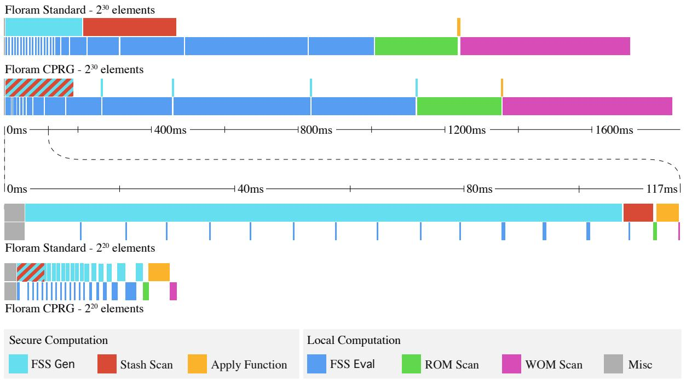

bar_stacked

| Category             | Component         | Time (ms) |
|----------------------|-------------------|-----------|
| Floram Standard - 2^30 | FSS Gen           | ~400      |
| Floram Standard - 2^30 | Stash Scan        | ~400      |
| Floram Standard - 2^30 | Apply Function   | ~400      |
| Floram Standard - 2^30 | FSS Eval          | ~1200     |
| Floram Standard - 2^30 | ROM Scan          | ~1200     |
| Floram Standard - 2^30 | WOM Scan          | ~1600     |
| Floram Standard - 2^30 | Misc              | ~1600     |
| Floram CPRG - 2^30    | FSS Gen           | ~400      |
| Floram CPRG - 2^30    | Stash Scan        | ~400      |
| Floram CPRG - 2^30    | Apply Function   | ~400      |
| Floram CPRG - 2^30    | FSS Eval          | ~1200     |
| Floram CPRG - 2^30    | ROM Scan          | ~1200     |
| Floram CPRG - 2^30    | WOM Scan          | ~1600     |
| Floram CPRG - 2^30    | Misc              | ~1600     |
| Floram Standard - 2^20 | FSS Gen           | ~1600     |
| Floram Standard - 2^20 | Stash Scan        | ~1600     |
| Floram Standard - 2^20 | Apply Function   | ~1600     |
| Floram Standard - 2^20 | FSS Eval          | ~80       |
| Floram Standard - 2^20 | ROM Scan          | ~80       |
| Floram Standard - 2^20 | WOM Scan          | ~80       |
| Floram Standard - 2^20 | Misc              | ~80       |
| Floram CPRG - 2^20     | FSS Gen           | ~40       |
| Floram CPRG - 2^20     | Stash Scan        | ~40       |
| Floram CPRG - 2^20     | Apply Function   | ~40       |
| Floram CPRG - 2^20     | FSS Eval          | ~40       |
| Floram CPRG - 2^20     | ROM Scan          | ~40       |
| Floram CPRG - 2^20     | WOM Scan          | ~40       |
| Floram CPRG - 2^20     | Misc              | ~40       |

Figure 8: Scheduling diagram for an ORAM access operation. This illustrates the way in which we interleave the various operations of our ORAM. The x-axis represents time, in milliseconds, and the y-axes represent the divide between secure computation, and local computation. Times are averages from a number of samples that is greater than 100 and a multiple of the refresh period. Elements are 4 bytes. Cross-hatching indicates regions wherein two components are scheduled to run simultaneously, and may preempt one another. The misc category includes time spent allocating and copying memory, managing threads, and performing other local setup tasks.

We created two variants of our ORAM, one using the basic construction described in Section 4, and the other using the CPRG method from Section 5. Both variants have optimized scheduling, as described in Section 6.2. Our concrete implementation uses a 128 bit block size, this being the block size of AES-128, our chosen PRG function. For ORAMs with element sizes smaller than 128 bits, we pack multiple elements into a single block and linearly scan them. For ORAMS with element sizes greater than 128 bits, we perform an additional expansion and correction stage after the last layer of the FSS in order to enlarge the blocks to the correct length.

Our benchmarks were performed under Ubuntu 16.04 with Linux kernel 4.4.0 64-bit, running on a pair of identical Amazon EC2 R4.4xlarge instances. All code was compiled using gcc version 5.4.0, with the -O3 flag enabled, OpenMP was used to manage multithreading and SIMD operations, and local AES com-

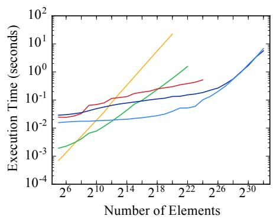

line

| Number of Elements | Execution Time (seconds) - Series 1 | Execution Time (seconds) - Series 2 | Execution Time (seconds) - Series 3 | Execution Time (seconds) - Series 4 |
| ------------------ | ----------------------------------- | ----------------------------------- | ----------------------------------- | ----------------------------------- |
| 2^6                | ~0.01                               | ~0.01                               | ~0.01                               | ~0.001                              |
| 2^10               | ~0.05                               | ~0.05                               | ~0.05                               | ~0.01                               |
| 2^14               | ~0.1                                | ~0.1                                | ~0.1                                | ~0.05                               |
| 2^18               | ~0.5                                | ~0.5                                | ~0.5                                | ~0.1                                |
| 2^22               | ~1.0                                | ~1.0                                | ~1.0                                | ~0.5                                |
| 2^26               | ~5.0                                | ~5.0                                | ~5.0                                | ~1.0                                |
| 2^30               | ~10.0                               | ~10.0                               | ~10.0                               | ~5.0                                |

(a) Access Wall-clock Time

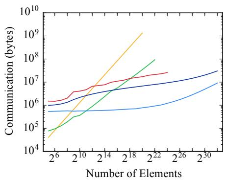

line

| Number of Elements | Communication (bytes) - Blue | Communication (bytes) - Red | Communication (bytes) - Green | Communication (bytes) - Orange |
| ------------------ | ---------------------------- | --------------------------- | ----------------------------- | ------------------------------ |
| 2^6                | ~10^5.5                      | ~10^6                       | ~10^4.5                       | ~10^4.5                        |
| 2^10               | ~10^5.8                      | ~10^6.5                     | ~10^5.5                       | ~10^5.5                        |
| 2^14               | ~10^6                        | ~10^7                       | ~10^6.5                       | ~10^7                          |
| 2^18               | ~10^6.5                      | ~10^7.5                     | ~10^7                         | ~10^8.5                        |
| 2^22               | ~10^7                        | ~10^8                       | ~10^7.5                       | ~10^9.5                        |
| 2^26               | ~10^7.5                      | ~10^8.5                     | ~10^8                         | ~10^10                         |
| 2^30               | ~10^8                        | ~10^9                       | ~10^8.5                       | ~10^10                         |

(b) Access Communication

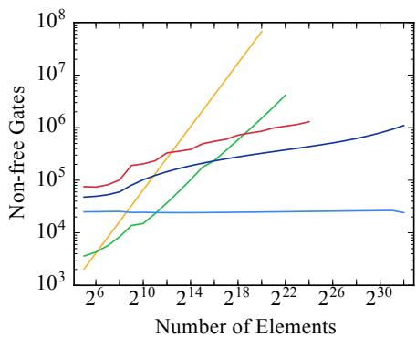

line

| Number of Elements | Non-free Gates (Red) | Non-free Gates (Blue) | Non-free Gates (Green) | Non-free Gates (Orange) |
| ------------------ | -------------------- | --------------------- | ---------------------- | ----------------------- |
| 2^6                | ~10^4.5              | ~10^4.5               | ~10^3.5                | ~10^3                   |
| 2^10               | ~10^5                | ~10^4.8               | ~10^4                  | ~10^4.5                 |
| 2^14               | ~10^5.5              | ~10^5                 | ~10^5                  | ~10^6                   |
| 2^18               | ~10^6                | ~10^5.5               | ~10^6                  | ~10^7.5                 |
| 2^22               | ~10^6.5              | ~10^6                 | ~10^6.5                | ~10^8                   |
| 2^26               | ~10^6.8              | ~10^6.5               | ~10^7                  | ~10^8                   |
| 2^30               | ~10^7                | ~10^7                 | ~10^7.5                | ~10^8                   |

(c) Access Yao Gates

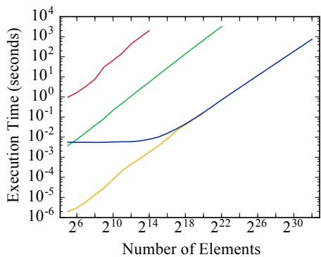

line

| Number of Elements | Execution Time (seconds) - Red | Execution Time (seconds) - Green | Execution Time (seconds) - Blue | Execution Time (seconds) - Orange |
| ------------------ | ------------------------------ | --------------------------------- | -------------------------------- | ---------------------------------- |
| 2^6                | 10^0                           | 10^-3                             | 10^-3                            | 10^-6                              |
| 2^10               | 10^1                           | 10^-1                             | 10^-3                            | 10^-4                              |
| 2^14               | 10^2                           | 10^1                              | 10^-3                            | 10^-3                              |
| 2^18               | 10^3                           | 10^2                              | 10^-2                            | 10^-2                              |
| 2^22               | 10^3                           | 10^3                              | 10^-1                            | 10^-1                              |
| 2^26               | 10^3                           | 10^3                              | 10^0                             | 10^0                               |
| 2^30               | 10^3                           | 10^3                              | 10^1                             | 10^1                               |

(d) Initialization Wall-clock Time

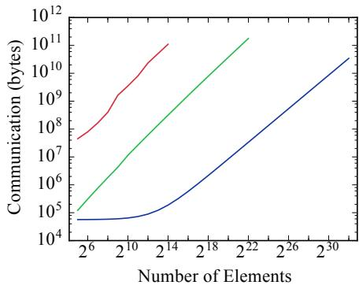

line

| Number of Elements | Communication (bytes) - Red Line | Communication (bytes) - Green Line | Communication (bytes) - Blue Line |
| ------------------ | --------------------------------- | ----------------------------------- | ---------------------------------- |
| 2^6                | ~10^7                             | ~10^5                               | ~10^4                              |
| 2^10               | ~10^9                             | ~10^7                               | ~10^4                              |
| 2^14               | ~10^11                            | ~10^9                               | ~10^5                              |
| 2^18               | ~10^11                            | ~10^10                              | ~10^6                              |
| 2^22               | ~10^11                            | ~10^11                              | ~10^7                              |
| 2^26               | ~10^11                            | ~10^11                              | ~10^8                              |
| 2^30               | ~10^11                            | ~10^11                              | ~10^9                              |

(e) Initialization Communication

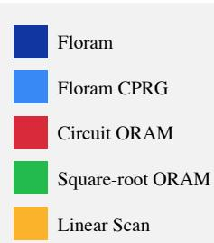

bar

| Category | Value |
|---|---|
| Floram | 100 |
| Floram CPRG | 95 |
| Circuit ORAM | 85 |
| Square-root ORAM | 75 |
| Linear Scan | 65 |

(f) Legend   
Figure 9: Microbenchmark Results. Access figures are averages from at least 100 samples; for refreshing ORAMs, the sample count was a multiple of the refresh period. Initialization figures are averages from 30 samples. For all benchmarks, elements were 4 bytes in size.

putations were implemented using Intel’s AES-NI instructions. Each machine had 122GB of DDR4 memory and eight physical cores partitioned from an Intel Xeon E5-2686 v4 CPU clocked at 2.3 GHz, each core being capable of executing two threads. We measured the bandwidth between our two instances to be roughly four gigabits per second. In order to ensure that the secure computation would be bandwidth-bound, as we would expect it to be in real-world conditions, we artificially restricted the bandwidth to 500 megabits per second, using the linux tool tc.

Multithreading Our two Floram implementations make extensive use of multithreading for their local components, but we have not attempted to multithread their secure components, nor have we multithreaded the other ORAMs against which we make comparisons. Multithreading a secure computation does not reduce the total communication between parties, and thus in bandwidthbound environments provides no advantage. Neither Square-root nor Circuit ORAM performs significant local computation, and so they cannot benefit significantly from local parallelism.

# 7.1 Full ORAM Microbenchmarks

Full Access We performed single-access microbenchmarks for Floram, as well as Floram with the CPRG optimization discussed in Section 5. For the purpose of comparison, we also performed benchmarks for the Square-root ORAM of Zahur et al. [56], Circuit ORAM [43], and linear scan. For all ORAMs, we used an element sizes of 4 bytes. For linear scan, we varied the number of ORAM elements between $2 ^ { 5 }$ and $2 ^ { 2 0 }$ , and for Square-root ORAM, between $2 ^ { 5 }$ and $2 ^ { 2 2 }$ . In both cases, this is far past the range in which those schemes are competitive. For Circuit ORAM, we performed benchmarks with up to $2 ^ { 2 4 }$ 4-byte elements, corresponding to 64 MiB of data; beyond this the ORAM’s physical size was so large that it could not be instantiated on our machine. We benchmarked Floram with sizes up to $2 ^ { 3 2 }$ 4-byte elements, corresponding to 16 GiB of data; these were the largest instances that our machine could handle. We recorded the wall-clock times for both parties, the number of bytes transmitted, and the number of non-free Yao gates executed. Our results are reported in Figures 9a, 9b, and 9c, respectively.

As we expected, the wall-clock time of our scheme exhibits a piecewise behavior. Up to roughly $2 ^ { 2 5 }$ 4-byte elements, secure computation (specifically, the FSS Gen algorithm) dominates the total access time, and thus the time grows with O(log n)—noticeably more slowly than any other ORAM. In this region, as expected, the CPRG optimization leads to a significant concrete performance gain, amounting to roughly a four-fold improvement. Beyond $2 ^ { 2 5 }$ elements, local computation becomes the dominant factor, and thus the wall-clock time grows with $O ( n )$ and the standard FSS scheme becomes more efficient. We estimate that the break-even point with Circuit ORAM lies at $2 ^ { 3 0 }$ elements.

Initialization We also performed initialization benchmarks. That is, beginning with an array of data, we evaluated each construction’s native mechanism for importing that data into a fresh ORAM instance. As before, we varied the number of elements for linear scan between $2 ^ { 5 }$ and $2 ^ { 2 0 }$ , and for Square-root ORAM between $2 ^ { 5 }$ and $2 ^ { 2 2 }$ . Circuit ORAM has the slowest initialization process by several orders of magnitude, and so we benchmarked only up to $2 ^ { 1 4 }$ elements, after which continuing was impractical. Both variants of Floram share the same initialization procedure, and we tested instances up to the largest size that our machines supported: $2 ^ { 3 2 }$ 4-byte elements, or 16 GiB of data in total. Results for wall-clock time and total communication are reported in Figures 9d and 9e respectively; gate counts are not reported, as our ORAM requires no gates to initialize.

As we expected, our ORAM has a clear asymptotic advantage over other schemes in terms of initialization. Moreover, at $2 ^ { 2 2 }$ elements, it has a 4500-fold concrete performance advantage over Square-root ORAM, the fastest previously known construction in this respect. In fact, in the context of garbled circuits, our construction even initializes somewhat faster than a linear scan, which requires only a simple memcpy by each party. Thus, so long as a single access in our scheme is faster than a single linear scan, the efficiency break-even point between the two is exactly one access. This is far better than other schemes, which require Ω(log n) accesses in order to reach their break-even points.

Thread-restricted Microbenchmarks Although our ORAM is bound by secure computation at small sizes, for very large instances, the local component becomes the dominant factor. Here we analyze its performance when a varying number of threads are used, in order to assess the performance of our algorithms in contexts where a high level of parallelism may not be available. We collected samples for each combination of ORAMs of $\cdot \mathrm { 2 ^ { 1 0 } , 2 ^ { 1 5 } , 2 ^ { 2 0 } , 2 ^ { 2 5 } }$ , and $2 ^ { 3 0 }$ 4-byte elements, and 1, 2, 4, 8, and 16 threads. The results are plotted in Figure 10.

At small ORAM sizes, where the entire computation might fit into the CPU cache, it is unsurprisingly the case that additional threads decrease performance. It is not until the linear component of our ORAM’s complexity becomes dominant that parallelism makes a significant difference. Note that at $2 ^ { 2 5 }$ elements and greater, the execution time decreases nearly linearly with threadcount, for threadcounts of eight and fewer. As our benchmark machines have only eight physical CPU cores, using more than eight threads offers little to no advantage.

# 7.2 Applications

In order to assess the performance of our ORAM construction in realistic scenarios, we implemented two secure applications, and benchmarked them with each of the ORAMs considered previously.

Binary Search In order to highlight the ways in which the novel properties of our ORAM differentiate it from previous ORAM constructions, we begin with a simple binary search benchmark. The use of ORAM for performing binary searches was first considered by Gordon et al. [25], who reported that searching a database of $2 ^ { 2 0 }$ 64-byte elements required roughly 1000 seconds.6 Our ORAM benchmark procedure is derived from that used by Square-root ORAM [56]: first, the data is loaded from secure computation into an ORAM, and then a number of searches are performed (each requiring $\log _ { 2 }$ n semantic accesses to complete). In this context, linear scan has a special advantage: because it touches each element in the memory, it requires only a single semantic access to perform a search. As a consequence of this property, ORAM has thus far yielded little improvement over the trivial solution for the problem of searching.

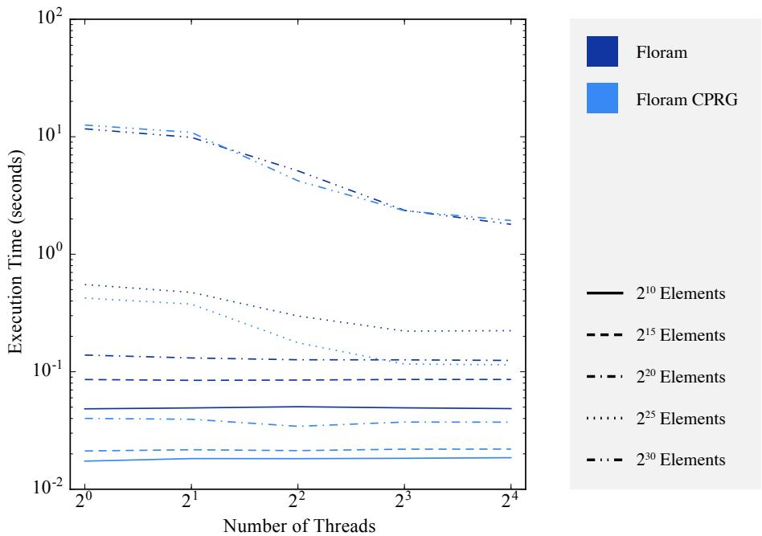

line

| Number of Threads | Floram (2^10 Elements) | Floram (2^15 Elements) | Floram (2^20 Elements) | Floram (2^25 Elements) | Floram (2^30 Elements) | Floram CPRG (2^10 Elements) | Floram CPRG (2^15 Elements) | Floram CPRG (2^20 Elements) | Floram CPRG (2^25 Elements) | Floram CPRG (2^30 Elements) |
| ----------------- | ---------------------- | ---------------------- | ---------------------- | ---------------------- | ---------------------- | ---------------------------- | ---------------------------- | ---------------------------- | ---------------------------- | ---------------------------- |
| 2^0               | ~0.05                  | ~0.1                   | ~0.1                   | ~0.5                   | ~10                    | ~0.01                        | ~0.1                         | ~0.5                         | ~10                          | ~10                          |
| 2^1               | ~0.05                  | ~0.1                   | ~0.1                   | ~0.5                   | ~10                    | ~0.01                        | ~0.1                         | ~0.5                         | ~10                          | ~10                          |
| 2^2               | ~0.05                  | ~0.1                   | ~0.1                   | ~0.5                   | ~5                     | ~0.01                        | ~0.1                         | ~0.5                         | ~5                           | ~5                           |
| 2^3               | ~0.05                  | ~0.1                   | ~0.1                   | ~0.5                   | ~2                     | ~0.01                        | ~0.1                         | ~0.5                         | ~2                           | ~2                           |
| 2^4               | ~0.05                  | ~0.1                   | ~0.1                   | ~0.5                   | ~1                     | ~0.01                        | ~0.1                         | ~0.5                         | ~1                           | ~1                           |

Figure 10: Thread-limited Access Wall-clock Time. Sample counts are multiples of the refresh period. Elements are 4 bytes.

We executed instances of this benchmark upon databases of $2 ^ { 1 5 }$ and $2 ^ { 2 0 }$ 16-byte elements, with 1, $2 ^ { 5 }$ , and $2 ^ { 1 0 }$ searches being performed. In addition, we benchmarked single searches of databases of $2 ^ { 2 \bar { 5 } }$ elements under Floram (due to exhaustion of memory, it was not possible to instantiate Square-root or Circuit ORAMs of this size). We do not include in our benchmark the cost of sorting the data, which is unnecessary for the linear scan solution. Sorting can be performed with a Batcher Mergesort [3] in $O ( n \log ^ { 2 } n )$ , with practical costs being lower than the that of instantiating any of the tested ORAMs, other than Floram. Results are reported in Table 2.

<table><tr><td>n</td><td>s</td><td>Linear</td><td>Circuit</td><td>Square-root</td><td>Floram</td><td>CPRG</td></tr><tr><td rowspan="3"> $2^{15}$ </td><td>1</td><td>2.80</td><td>5192.4</td><td>12.87</td><td>0.79</td><td>0.37</td></tr><tr><td> $2^5$ </td><td>89.75</td><td>5284.2</td><td>37.24</td><td>23.73</td><td>11.15</td></tr><tr><td> $2^{10}$ </td><td>2872.1</td><td>8126.8</td><td>1210.0</td><td>758.89</td><td>358.0</td></tr><tr><td rowspan="3"> $2^{20}$ </td><td>1</td><td>89.52</td><td>-</td><td>690.99</td><td>2.04</td><td>0.99</td></tr><tr><td> $2^5$ </td><td>2864.5</td><td>-</td><td>800.23</td><td>56.94</td><td>21.94</td></tr><tr><td> $2^{10}$ </td><td>91,663.</td><td>-</td><td>12,736.</td><td>1826.5</td><td>697.65</td></tr><tr><td> $2^{25}$ </td><td>1</td><td>2864.5</td><td>-</td><td>-</td><td>14.37</td><td>11.55</td></tr></table>

Table 2: Binary Search Benchmark Results. We measured the wall-clock time required for s searches through n 16-byte data elements, including initialization. Figures are averages in seconds from 30 samples for databases of $2 ^ { 1 5 }$ elements, or 3 samples for larger databases. Linear scan figures are estimated from results in Section 7.1. 

<table><tr><td></td><td>Square-root</td><td>Floram CPRG</td></tr><tr><td>Wall-clock Time (Hours)</td><td>28.98</td><td>15.78</td></tr><tr><td>Billions of Non-free Gates</td><td>226.87</td><td>143.29</td></tr></table>

Table 3: Roth-Peranson Benchmark Results. Our wall-clock time result for Square-root ORAM differs from that presented by Doerner et al. [16]; this is due to differences in benchmarking environments used.

Floram has the fastest access and initialization procedures at these sizes, and so, not surprisingly, it is the fastest among the ORAMs regardless of the number of searches performed. What is surprising, however, is that it is significantly faster than linear scan, even when only a single search is performed. To our knowledge, such a thing is not possible under any other ORAM scheme, at any data size. Our scheme achieves this due to the fact that, considering initialization and a single access, only two full scans of XOR shares are required, whereas in the context of Yao’s Garbled Circuits a linear scan requires iterating over wire labels that are at least eighty times larger than the equivalent secret-shared representation.

Stable Matching Many previous research efforts have sought to optimize the secure evaluation of the Gale-Shapley algorithm for stable matching. Recently, Doerner et al. [16] developed algorithmic improvements which yielded a significant increase in asymptotic and concrete performance, allowing them to execute a secure stable matching using the related Roth-Peranson algorithm on the scale of the stable matching performed annually by the National Resident Matching Program (NRMP) to match graduating doctors to medical residencies in the United States. This algorithm requires $O ( n r )$ ORAM accesses in n, the number of doctors, and $r ,$ the number of hospitals for which the doctors are allowed to submit rankings, to a comparatively small ORAM of size $O ( m )$ in $m ,$ the number of hospitals (in practice, around 5000 for NRMP-scale matchings). Nonetheless, in terms of gates, the NRMP matching is one of the largest secure computations ever reported. In other words, this is a benchmark for which Floram’s initialization advantage matters very little. The parameters of the benchmark were derived by Doerner et al. from the 2016 NRMP Statistical Report; specifically: 35,476 residents submitting up to 15 rankings each, and 4836 hospitals submitting up to 120 rankings each, and having at most 12 open positions. Individual preferences were generated at random. We collected one sample each for Square-root ORAM and Floram CPRG, and, following Doerner et al., we did not collect any data for Circuit ORAM or linear scan, which would not be competitive. The results are shown in Table 3, and demonstrate a factor of 1.83 improvement over prior work for a very small ORAM used in a real application.

# 7.3 Notes on Scalability

The title of this document is “Scaling ORAM for Secure Computation”, and so it is fitting that we should comment upon the limits of scaling, and how well we believe our implementation has fared relative to the theoretical possibilities. At $2 ^ { 3 2 }$ four-byte elements, we measured our scheme to require 6.3 seconds to complete an access, on average. During this time, it reads the underlying memories of both the WOM and the ROM, and writes the WOM. In the course of the FSS Eval algorithm, it both reads and writes an amount of data equal to twice the size of the WOM or ROM memory. The stash is negligible in size by comparison. Thus, the amount of data transferred to and from memory inside each local machine is $2 ^ { 3 2 }$ · 4 · 7 bytes in total, or 120.3 gigabytes, at 152.8 gigabits per second. For comparison, a single DDR4-2400 memory controller has a maximum bandwidth of 153.6 gigabits per second. We do not know exactly how resources are apportioned among EC2 instances, but we do know that we are renting eight of the 18 physical cores in a single CPU, and that those 18 physical cores share four memory controllers. If partitioning were perfectly fair, we would expect our instance to have access to slightly less than two memory controllers’ worth of bandwidth. Thus, we conjecture that we are within roughly a factor of two of the best possible performance on our test hardware. This is not bad, considering that the parallelization and scheduling of our implementation are not hand-tuned, and we have taken no pains to ensure proper affinity between CPU and memory.

At large sizes, local CPU and memory bandwidths are the definitive bottlenecks for our scheme. These are easily increased: in modern systems each additional processor has its own set of memory controllers. Furthermore, our algorithm is parallel in such a way that it can be run on a cluster with little performance loss: only log(n) synchronizations per access would be required, and each synchronization involves the transfer of a small, constant amount of data. We suggest that further scaling and performance improvement can be accomplished by the addition of computing hardware, which is typically cheap relative to the cost of additional bandwidth, as would be incurred were our scheme network bound.

# Acknowledgment

The authors would like to thank Yuval Ishai for his suggestion to truncate the FSS tree during reads. The authors would also like to thank the authors of the Square-root ORAM paper [56], and especially Samee Zahur, for his insight and technical expertise. This research was supported by NSF Grants TWC-1664445 and TWC-1646671.

# Code Availability

Complete reference implementations of the constructions described in this paper along with implementations of Square-root and Circuit ORAM sharing a common interface are available under the 3-clause BSD license from https: //gitlab.com/neucrypt/floram.

# References

[1] 2001. Advanced Encryption Standard. (2001).   
[2] Ittai Abraham, Christopher W. Fletcher, Kartik Nayak, Benny Pinkas, and Ling Ren. 2017. Asymptotically Tight Bounds for Composing ORAM with PIR. In PKC.   
[3] Ken Batcher. 1968. Sorting Networks and Their Applications. In Spring Joint Computer Conference.   
[4] Donald Beaver, Silvio Micali, and Phillip Rogaway. 1990. The Round Complexity of Secure Protocols. In ACM STOC.   
[5] Mihir Bellare, Viet Tung Hoang, Sriram Keelveedhi, and Phillip Rogaway. 2013. Efficient Garbling from a Fixed-Key Blockcipher. In IEEE S&P.   
[6] Marina Blanton, Aaron Steele, and Mehrdad Alisagari. 2013. Dataoblivious Graph Algorithms for Secure Computation and Outsourcing. In ACM Asia CCS.   
[7] Dan Boneh, David Mazieres, and Raluca Ada Popa. 2011. Remote Oblivious Storage: Making Oblivious RAM practical. http://dspace.mit.edu/bitstream/handle/1721.1/62006/MIT-CSAIL-TR-2011-018.pdf. (2011).

[8] Joan Boyar and René Peralta. 2010. A New Combinational Logic Minimization Technique with Applications to Cryptology. In Lecture Notes in Computer Science.   
[9] Joan Boyar and René Peralta. 2012. A Small Depth-16 Circuit for the AES S-Box.   
[10] Elette Boyle, Kai-Min Chung, and Rafael Pass. 2016. Oblivious Parallel RAM and Applications. In TCC.   
[11] Elette Boyle, Niv Gilboa, and Yuval Ishai. 2015. Function Secret Sharing. In EUROCRYPT.   
[12] Elette Boyle, Niv Gilboa, and Yuval Ishai. 2016. Function Secret Sharing: Improvements and Extensions. In ACM CCS.   
[13] Kai-Min Chung, Zhenming Liu, and Rafael Pass. 2013. Statistically-secure ORAM with ${ \tilde { O } } ( \log ^ { 2 } n )$ Overhead. arXiv preprint arXiv:1307.3699 (2013).   
[14] Ivan Damgård, Sigurd Meldgaard, and Jesper Buus Nielsen. 2011. Perfectly Secure Oblivious RAM without Random Oracles. In TCC.   
[15] Srinivas Devadas, Marten van Dijk, Christopher W. Fletcher, Ling Ren, Elaine Shi, and Daniel Wichs. 2016. Onion ORAM: A Constant Bandwidth Blowup Oblivious RAM. In TCC.   
[16] Jack Doerner, David Evans, and abhi shelat. 2016. Secure Stable Matching at Scale. In ACM CCS.   
[17] Niv Gilboa and Yuval Ishai. 2014. Distributed Point Functions and Their Applications.   
[18] Oded Goldreich. 1987. Towards a theory of software protection and simulation by oblivious RAMs. In ACM STOC.   
[19] Oded Goldreich. 2004. Foundations of Cryptography: Volume 2, Basic Applications. Cambridge University Press, New York, NY, USA.   
[20] Oded Goldreich, Shafi Goldwasser, and Silvio Micali. 1986. How to Construct Random Functions. J. ACM 33, 4 (Aug. 1986).   
[21] Oded Goldreich and Rafail Ostrovsky. 1996. Software Protection and Simulation on Oblivious RAMs. Journal of the ACM 43, 3 (1996).   
[22] Michael T. Goodrich and Michael Mitzenmacher. 2011. Privacy-Preserving Access of Outsourced Data via Oblivious RAM Simulation. In ICALP.   
[23] Michael T. Goodrich, Michael Mitzenmacher, Olga Ohrimenko, and Roberto Tamassia. 2011. Oblivious RAM Simulation with Efficient Worst-Case Access Overhead. In ACM CCSW.

[24] Michael T. Goodrich, Michael Mitzenmacher, Olga Ohrimenko, and Roberto Tamassia. 2012. Privacy-preserving group data access via stateless oblivious RAM simulation. In ACM-SIAM SODA.   
[25] Dov Gordon, Jonathan Katz, Vladimir Kolesnikov, Fernando Krell, Tal Malkin, Mariana Raykova, and Yevgeniy Vahlis. 2012. Secure Two-party Computation in Sublinear (Amortized) Time. In ACM CCS.   
[26] Yan Huang, David Evans, Jonathan Katz, and Lior Malka. 2011. Faster Secure Two-party Computation Using Garbled Circuits. In USENIX Security Symposium.   
[27] Zahra Jafargholi and Daniel Wichs. 2016. Adaptive Security of Yao’s Garbled Circuits.   
[28] Marcel Keller and Peter Scholl. 2014. Efficient, Oblivious Data Structures for MPC.   
[29] Vladimir Kolesnikov and Thomas Schneider. 2008. Improved Garbled Circuit: Free XOR Gates and Applications. In ICALP.   
[30] Eyal Kushilevitz, Steve Lu, and Rafail Ostrovsky. 2012. On the (In)security of Hash-based Oblivious RAM and a New Balancing Scheme. In ACM-SIAM SODA.   
[31] Yehuda Lindell and Benny Pinkas. 2009. A Proof of Security of Yao’s Protocol for Two-Party Computation. Journal of Cryptology 22, 2 (2009).   
[32] Steve Lu and Rafail Ostrovsky. 2013. Distributed Oblivious RAM for Secure Two-Party Computation.   
[33] Valeria Nikolaenko, Udi Weinsberg, Stratis Ioannidis, Marc Joye, Dan Boneh, and Nina Taft. 2013. Privacy-Preserving Ridge Regression on Hundreds of Millions of Records. In IEEE S&P.   
[34] Rafail Ostrovsky. 1990. Efficient computation on oblivious RAMs. In ACM STOC.   
[35] Rafail Ostrovsky and Victor Shoup. 1997. Private Information Storage (Extended Abstract). In ACM STOC.   
[36] Benny Pinkas and Tzachy Reinman. 2010. Oblivious RAM revisited. In CRYPTO.   
[37] Benny Pinkas, Thomas Schneider, Nigel P. Smart, and Stephen C. Williams. 2009. Secure Two-Party Computation Is Practical. In ASI-ACRYPT.   
[38] Adi Shamir. 1979. How to Share a Secret. Commun. ACM 22, 11 (Nov. 1979).

[39] Elaine Shi, T.-H. Hubert Chan, Emil Stefanov, and Mingfei Li. 2011. Oblivious RAM with O((log N )3) Worst-Case Cost. In ASIACRYPT.   
[40] Emil Stefanov, Marten Van Dijk, Elaine Shi, Christopher Fletcher, Ling Ren, Xiangyao Yu, and Srinivas Devadas. 2013. Path ORAM: an Extremely Simple Oblivious RAM Protocol. In ACM CCS.   
[41] Emil Stefanov, Marten van Dijk, Elaine Shi, Christopher Fletcher, Ling Ren, Xiangyao Yu, and Srinivas Devadas. 2013. Path ORAM: an Extremely Simple Oblivious RAM Protocol. In ACM CCS.   
[42] Abraham Waksman. 1968. A Permutation Network. Journal of the ACM 15, 1 (Jan. 1968).   
[43] Xiao Wang, Hubert Chan, and Elaine Shi. 2015. Circuit ORAM: On Tightness of the Goldreich-Ostrovsky Lower Bound. In ACM CCS.   
[44] Xiao Wang, Yan Huang, Hubert Chan, Abhi Shelat, and Elaine Shi. 2014. SCORAM: Oblivious RAM for Secure Computation. In ACM CCS.   
[45] Xiao Wang, Yan Huang, Yongan Zhao, Haixu Tang, XiaoFeng Wang, and Diyue Bu. 2015. Efficient Genome-Wide, Privacy-Preserving Similar Patient Query Based on Private Edit Distance. In ACM CCS.   
[46] Peter Williams and Radu Sion. 2008. Usable PIR. In NDSS.   
[47] Peter Williams and Radu Sion. 2012. Round-Optimal Access Privacy on Outsourced Storage. In ACM CCS.   
[48] Peter Williams, Radu Sion, and Bogdan Carbunar. 2008. Building castles out of mud: Practical access pattern privacy and correctness on untrusted storage. In ACM CCS.   
[49] R. S. Winternitz. 1984. A Secure One-Way Hash Function Built from DES. In IEEE S&P.   
[50] Johannes Wolkerstorfer, Elisabeth Oswald, and Mario Lamberger. 2002. An ASIC Implementation of the AES SBoxes. In RSA Conference on Topics in Cryptology.   
[51] David Woodruff and Sergey Yekhanin. 2005. A Geometric Approach to Information-Theoretic Private Information Retrieval. In Proceedings of the 20th Annual IEEE Conference on Computational Complexity.   
[52] Andrew Chi-Chih Yao. 1982. Protocols for Secure Computations. In IEEE FOCS.   
[53] Andrew Chi-Chih Yao. 1986. How to Generate and Exchange Secrets (Extended Abstract). In IEEE FOCS.

[54] Samee Zahur and David Evans. 2015. Obliv-C: A Lightweight Compiler for Data-Oblivious Computation. Cryptology ePrint Archive, Report 2015/1153. http://oblivc.org. (2015).   
[55] Samee Zahur, Mike Rosulek, and David Evans. 2015. Two Halves Make a Whole: Reducing Data Transfer in Garbled Circuits Using Half Gates. In EUROCRYPT.   
[56] Samee Zahur, Xiao Wang, Mariana Raykova, Adrià Gascón, Jack Doerner, David Evans, and Jonathan Katz. 2016. Revisiting Square Root ORAM: Efficient Random Access in Multi-Party Computation. In IEEE S&P.

# A Definitions

# A.1 Security

We first recall the semi-honest security model in which we claim our scheme is secure.

Definition (Semi-honest Security [19, 31]). Let $\mathcal { F } = ( \mathcal { F } _ { a } , \mathcal { F } _ { b } )$ be a probabilistic polynomial time functionality, and let π be a two party protocol for computing $\mathcal { F }$ such that party A supplies input $x _ { a }$ and receives output $\mathcal { F } _ { a } ( x _ { a } , x _ { b } )$ , while party B supplies input $x _ { b }$ and receives output $\mathcal { F } _ { b } ( x _ { a } , x _ { b } )$ , with $| x _ { a } | = | x _ { b } | . ~ \pi$ is considered secure in the presence of static semi-honest adversaries if there exist probabilistic polynomial-time simulators $\mathsf { S i m } _ { a }$ and $\mathsf { S i m } _ { b }$ such that

$$
\begin{array}{l} \left\{\left(\operatorname{Sim} _ {p} \left(1 ^ {\lambda}, x _ {p}, \mathcal {F} _ {p} \left(x _ {a}, x _ {b}\right)\right), \mathcal {F} \left(1 ^ {\lambda}, x _ {a}, x _ {b}\right)\right) \right\} _ {\lambda \in \mathbb {N}, x _ {a}, x _ {b} \in \{0, 1 \} ^ {*}} \\ \stackrel {{c}} {{=}} \left\{\left(\operatorname{View} _ {p} ^ {\pi} \left(1 ^ {\lambda}, x _ {a}, x _ {b}\right), \operatorname{Output} ^ {\pi} \left(1 ^ {\lambda}, x _ {a}, x _ {b}\right)\right) \right\} _ {\lambda \in \mathbb {N}, x _ {a}, x _ {b} \in \{0, 1 \} ^ {*}} \\ \end{array}
$$

for $p \in \{ a , b \}$ where $\mathsf { V i e w } _ { p } ^ { \pi } ( x _ { a } , x _ { b } ) = ( x _ { p } , r _ { p } , m _ { p } ^ { 1 } , \ldots , m _ { p } ^ { t } )$ is party p’s view of the computation, with $r _ { p }$ denoting party p’s internal random tape and $m _ { p } ^ { j }$ denoting the $\bar { \ j } ^ { \mathrm { t h } }$ message that party p received; and where $\mathsf { O u t p u t } ^ { \bar { \pi } } ( 1 ^ { \lambda } , x _ { a } , x _ { b } ^ { \bar { \kappa } } )$ denotes the union of the outputs of all parties; and where $\circeq$ denotes computational indistinguishability with security parameter λ. That is, a protocol π is secure in the semi-honest setting if the full view of a party can be simulated by a probabilistic polynomial time algorithm given only a record of that party’s input and output. Note we assume that all protocols and functionalities have access to the security parameter λ, and that computational indistinguishability is considered relative to this parameter. In proofs, we omit λ from our notation.

# A.2 Distributed ORAM

We deviate from the standard formulation of ORAM in order to align the security model of our scheme with the security model of multiparty computation (Definition A.1). We assume that the ORAM’s storage, like the protocols that implement its access an initialization methods, is split among multiple parties, and we guarantee security only against the corruption of some subset of those parties. In contrast, the standard ORAM definition [21] considers a context wherein there exists a single trusted CPU and a single untrusted memory, and assumes that an adversary has a full view of all memory accesses, but no insight into the CPU. Our variant of the ORAM definition is known as Distributed ORAM; it was originally proposed by Lu and Ostrovsky [32], and our definitions expound theirs.

Definition (Random Access Memory). For every $n , m \in \mathbb { N } ,$ a random access memory ${ \mathsf { R A M } } _ { n , m }$ is a functionality that associates an m-bit value with each unique integer index in [1, n] and can recall this value when queried with the index. Indexes are by default associated with values of $0 ^ { m }$ . A ${ \mathsf { R A M } } _ { n , m }$ receives instructions of the form $( o , i , v )$ , where $o \in \{ \mathsf { r e a d } , \mathsf { w r i t e } \}$ is an operation specifier, $i \in [ 1 , n ]$ is an index, and $v \in \{ 0 , 1 \} ^ { m }$ is a value. Additionally, a ${ \mathsf { R A M } } _ { n , m }$ may receive an initialization instruction of the form (init, V ), where $V \in \{ 0 , 1 \}$ n × m is an array of values. Upon receiving an instruction $( o , i , v )$ , a ${ \mathsf { R A M } } _ { n , m }$ must behave as follows:

1. if $o = { \mathsf { r e a d } }$ , then ${ \mathsf { R A M } } _ { n , m }$ immediately recalls and returns the value associated with index i, and ignores v.   
2. if o = write, then ${ \mathsf { R A M } } _ { n , m }$ remembers value v and associates it with index i, forgetting any previous associations that index i may have had, and returns nothing.

Upon Receiving an initialization instruction (init, V ), ${ \mathsf { R A M } } _ { n , m }$ immediately forgets all associations it has previously made, and associates the values in V with their corresponding indices.

Note Any structure that implements the write operation can implement the init operation as a sequence of writes. However, our construction has a dedicated initialization function which requires its own analysis. Therefore, we include init in our definition.

Definition (Distributed Random Access Memory). For every $n , m \in \mathbb { N } ,$ , a Distributed Random Access Memory ${ \mathsf { D R A M } } _ { n , m }$ is a protocol evaluated among two parties which correctly implements the ${ \mathsf { R A M } } _ { n , m }$ functionality. An implementation of ${ \mathsf { D R A M } } _ { n , m }$ may require that each party $p \in \{ a , b \}$ implements a private, local instance $M _ { p }$ of the $\mathsf { R A M } _ { \mathrm { p o l y } ( n ) , \mathrm { p o l y } ( m ) }$ functionality. For each instruction it receives, a ${ \mathsf { D R A M } } _ { n , m }$ may issue to each of its local memories a number of instructions bounded by poly(n). We assume that instructions issued to and replies received from the $M _ { p }$ of a non-corrupt party p are observable only by $p .$ . $\mathrm { ~ A ~ D R A M } _ { n , m }$ may additionally have access to a random tape.

Note For simplicity, we define DRAM for two parties and observe that it can be extended to many parties.

Definition (Access Patterns and Epochs). For any memory M that implements ${ \mathsf { R A M } } _ { n , m } ,$ an access pattern is a sequence $\{ x ^ { j } \} _ { j \in [ 1 , \ell ] }$ of length $\ell ,$ such that $x ^ { j }$ corresponds to the $j ^ { \mathrm { t h } }$ instruction received by M. An epoch is an access pattern $X = \{ x ^ { j } \} _ { j \in [ 1 , \ell ] }$ such that $x ^ { 1 }$ is an initialization instruction (init, V ) and all subsequent instructions are either read or write instructions. We use $\Xi _ { n , m , \lambda }$ to denote the set of all valid epochs for a ${ \mathsf { R A M } } _ { n , m }$ with lengths in $O ( { \mathsf { p o l y } } ( \lambda ) )$ ). A sequence of epochs is constructed by deriving the initialization vector for epoch $j$ from the final state in epocitialization vector. We use $\mathcal { X }$ $j - 1$ . Thus, a sequence of epochs has oepresent a sequence of epochs, and $\Xi _ { n , m , \lambda } ^ { * }$ to denote the set of all such sequences with total lengths in $O ( { \mathsf { p o l y } } ( \lambda ) )$ .

Note It is necessary to introduce the concept of epochs due to the existence of an initialization instruction. While we expect an ORAM to hide indices accessed and whether accesses are reads or writes, we cannot expect it to hide which instructions are initialization instructions. Consequently, in subsequent definitions, we will reason over sequences of epochs, each of which has exactly one initialization. While most ORAM schemes that require refreshing use fixed epoch lengths, this is seldom necessary, and in fact Floram can vary its refresh period to achieve greater practical efficiency. Consequently, we allow for arbitrary epoch lengths in our definitions and proofs.

Definition (Distributed Oblivious Random Access Memory). For every $n , m , \lambda \in$ N, a suite of multi-party protocols D is a $\mathsf { D O R A M } _ { n , m , \lambda }$ if it implements ${ \mathsf { D R A M } } _ { n , m }$ and there exists a simulator $\mathsf { S i m } _ { p } ^ { D }$ for $p \in \{ a , b \}$ such that for security parameter $\lambda { \mathrm { : } }$

$$
\left\{\mathsf {S i m} _ {p} ^ {D} \left(1 ^ {\lambda}, \left\{1 ^ {| X |} \right\} _ {X \in \mathcal {X}}, V _ {p}\right) \right\} _ {\mathcal {X} \in \Xi_ {n, m, \lambda} ^ {*}} \stackrel {{c}} {{=}} \left\{\mathsf {V i e w} _ {p} ^ {D} (1 ^ {\lambda}, \mathcal {X}) \right\} _ {\mathcal {X} \in \Xi_ {n, m, \lambda} ^ {*}}
$$

That is, the view of party p over a sequence of epochs can be simulated given only the lengths of those epochs and $p \mathrm { ^ s }$ share of the initialization vector $V$ associated with the first epoch. Note that $V _ { p }$ is an array of $n \times m$ bits.

Discussion Although ORAM is sometimes taken as an acronym for Oblivious Random Access Memory, Goldreich and Ostrovsky use it to stand for Oblivious Random Access Machine, and their model includes a trusted CPU capable of arbitrary computation in a data-oblivious fashion. Although our definitions do not explicitly call upon universal computation, they nonetheless imply a similar conclusion. Specifically, our definitions, in combination with MPC protocols, imply the ability to securely compute circuits with “memory gates”; that is, gates capable of storing and retrieving data in a black-box fashion while maintaining data-obliviousness. From such circuits, it is possible to construct CPUs that can execute secure instructions in a familiar way.

# B Proofs of Security

In this section, we prove that the standard Floram construction is a secure DORAM under Definition A.2. To do this, we prove the protocol security of our initialization and access methods under Definition A.1, and then compose these proofs to show security over the course of an epoch. Given security over an epoch, a standard hybrid proof can show security over a sequence of epochs. We do not consider semi-private access, data export, or any other nonstandard capabilities of our construction, nor do we consider any of the optimizations we have presented throughout this work. Nonetheless, we have no reason to suspect that they are insecure.

Mapping definitions to concrete schemes We have defined DORAM to implement three different methods: read, write, and init, but Floram only actually implements init and a generic access method, which applies an arbitrary function f to the target element. If $f _ { \mathrm { r e a d } }$ and $f _ { \mathrm { w r i t e } }$ are combined into a single circuit or constructed in such a way that they can be simulated by a single simulator, then accesses that perform reads will be indistinguishable from accesses that perform writes, as required.

# B.1 Proof of Security for Access

Notation and Real-world View Before we present our proof, we specify a convenient notation describing the same access algorithm given in Section 4. We refer to the functionality implemented by the algorithm as ${ \mathcal { F } } _ { A }$ , and the protocol as $\pi _ { A }$ . Party $p \mathrm { { s } }$ share of the output of the functionality ${ \mathcal { F } } _ { A }$ is ${ \mathcal { F } } _ { A p } .$ . Party p’s input to the algorithm is denoted by Inpu $\mathsf { t } _ { p } ^ { A }$ , and $p \mathrm { ^ { \prime } s }$ output of a protocol execution using that input is denoted Outpu $\mathsf { \Pi } _ { p } ^ { \pi _ { A } ^ { r } } ( \mathsf { I n p u t } ^ { A } )$ , while a complete transcript of the protocol execution for party $p$ is denoted by $\mathsf { V i e w } _ { p } ^ { \pi _ { A } } ( \mathsf { I n p u t } ^ { A } )$ . The access protocol can be decomposed into a four step process, $( \dot { \mathcal { C } } _ { 1 } , \mathcal { L } _ { 1 } , \mathcal { C } _ { 2 } , \mathcal { L } _ { 2 } )$ , where $\mathcal { C } _ { 1 }$ and $\mathcal { C } _ { 2 }$ are circuits evaluated by some MPC protocol (we use Yao’s Garbled Circuits), and $\mathcal { L } _ { 1 }$ and $\mathcal { L } _ { 2 }$ are party-local computations. These circuits receive some of their input values as secret-shares, and party $p \mathrm { { s } }$ secret share of value $x$ is denoted $x _ { p }$ . We omit special notation for share-creation and reconstruction operations, leaving them implicit. We use $x \gets X$ to signify the uniform random choice of element $x$ from the distribution $X , : =$ to signify deterministic assignment, $\circeq$ to signify computational indistinguishability, and $\circeq$ to signify statistical indistinguishability.

The first circuit, $\mathcal { C } _ { 1 }$ , implements the FSS Gen algorithm. $\mathcal { C } _ { 1 }$ receives shares of the target index $i ,$ as well as shares of a uniformly randomly chosen value $\beta ,$ , such that $\beta _ { p } \in \{ 0 , 1 \} ^ { \lambda }$ . To Alice, $\mathcal { C } _ { 1 }$ returns the FSS key $k _ { a } ^ { \mathsf { F S S } }$ , and to Bob, $k _ { b } ^ { \mathsf { F S S } }$ (these keys may be thought of as a sharing of the joint FSS key, $k ^ { \mathsf { F S S } } )$ ). Formally:

$$
\begin{array}{l} \operatorname{Input} _ {p} ^ {\mathcal {C} _ {1}} = \left(i _ {p}, \beta_ {p}\right) \\ \operatorname{Output} _ {p} ^ {\pi_ {\mathcal {C} _ {1}}} \left(\operatorname{Input} ^ {\mathcal {C} _ {1}}\right) = \left(k _ {p} ^ {\mathrm{FSS}}\right) \\ \end{array}
$$

Subsequent to $\mathcal { C } _ { 1 }$ , each party p executes a local computation, $\mathcal { L } _ { 1 }$ , which takes as input $k _ { p } ^ { \mathsf { F S S } }$ and also some local state R (the ROM memory), and produces $v _ { p } .$

The second circuit, $\mathcal { C } _ { 2 } .$ , implements the stash scan, function application, and FSS leaf adjustment procedures. This circuit receives shares from both parties of $i , \beta _ { ; }$ , and the stash state Stash. From Alice, it receives as input $v _ { a } , k _ { a } ^ { \mathsf { F S S } } , k _ { a } ^ { \mathsf { P R F } }$ and from Bob, $v _ { b } , k _ { b } ^ { \mathsf { F S S } } , k _ { b } ^ { \mathsf { P R F } }$ . A description of $f ,$ the function to be applied, is baked into the circuit $\mathcal { C } _ { 2 }$ . As output, the circuit returns $v ^ { \Delta }$ to both parties. In addition, it returns shares of the updated stash state Stash0. f may receive some auxiliary input $v ^ { f }$ as shares, and may produce some auxiliary output $y ^ { f }$ as shares. Formally:

$$
\operatorname{Input} _ {p} ^ {\mathcal {C} _ {2}} = \left(i _ {p}, v _ {p}, v _ {p} ^ {f}, \beta_ {p}, \operatorname{Stash} _ {p}, k _ {p} ^ {\mathrm{FSS}}, k _ {p} ^ {\mathrm{PRF}}\right)
$$

$$
\operatorname{Output} _ {p} ^ {\pi_ {\mathcal {C} _ {2}}} \left(\operatorname{Input} ^ {\mathcal {C} _ {2}}\right) = \left(v ^ {\Delta}, y _ {p} ^ {f}, \mathsf {S t a s h} _ {p} ^ {\prime}\right)
$$

Subsequent to $\mathcal { C } _ { 2 }$ , each party p executes a local computation, $\mathcal { L } _ { 2 }$ , which takes as input $k _ { p } ^ { \mathsf { F S S } } , v ^ { \Delta }$ , and some local state, $W _ { p }$ (a share of the WOM memory), and returns some updated local state, $W _ { p } ^ { \prime } .$ .

The sequence $( \mathcal { C } _ { 1 } , \mathcal { L } _ { 1 } , \mathcal { C } _ { 2 } , \mathcal { L } _ { 2 } )$ composes the access protocol, as illustrated in Figure 11. Party $p \mathrm { { s } }$ view of an access is equal to the union of $p \mathrm { { s } }$ internal random tape $r _ { p } .$ , its inputs, outputs, and the messages it receives. Using $\mathsf { M s g s } _ { p } ^ { \pi c } ( \mathsf { I n p u t } ^ { \mathcal { C } } )$ to denote the messages received during evaluation of circuit $\mathcal { C }$ via protocol $\pi _ { \mathcal { C } }$ (excepting the input and output), this give us:

$$
\mathsf {I n p u t} _ {p} ^ {A} = \left(i _ {p}, R, f, v _ {p} ^ {f}, \mathsf {S t a s h} _ {p}, k _ {p} ^ {\mathsf {P R F}}, W _ {p}\right)
$$

$$
\operatorname{Input} ^ {A} = \operatorname{Input} _ {a} ^ {A} \cup \operatorname{Input} _ {b} ^ {A}
$$

$$
\operatorname{Output} _ {p} ^ {\pi_ {A}} \left(\operatorname{Input} ^ {A}\right) = \left(y _ {p} ^ {f}, \operatorname{Stash} _ {p} ^ {\prime}, W _ {p} ^ {\prime}\right)
$$

$$
\mathsf {V i e w} _ {p} ^ {\pi_ {A}} \left(\mathsf {I n p u t} ^ {A}\right) = \binom{r _ {p}, \mathsf {V i e w} _ {p} ^ {\pi_ {\mathcal {C} _ {1}}} \left(\mathsf {I n p u t} ^ {\mathcal {C} _ {1}}\right), R,}{\mathsf {V i e w} _ {p} ^ {\pi_ {\mathcal {C} _ {2}}} \left(\mathsf {I n p u t} ^ {\mathcal {C} _ {2}}\right), W _ {p}, W _ {p} ^ {\prime}}
$$

$$
= \binom{r _ {p}, \mathsf {I n p u t} _ {p} ^ {A}, \beta_ {p}, \mathsf {M s g s} _ {p} ^ {\pi_ {\mathcal {C} _ {1}}} \left(\mathsf {I n p u t} ^ {\mathcal {C} _ {1}}\right), k _ {p} ^ {\mathsf {F S S}},}{\mathsf {M s g s} _ {p} ^ {\pi_ {\mathcal {C} _ {2}}} \left(\mathsf {I n p u t} ^ {\mathcal {C} _ {2}}\right), v ^ {\Delta}, y _ {p} ^ {f}, \mathsf {S t a s h} _ {p} ^ {\prime}, W _ {p} ^ {\prime}}
$$

Valid Inputs An input to the access protocol, InputA, is said to be valid if and only $\mathrm { i f } \ i \in [ 1 , n ] , \ | R | = | W | = n , k _ { a } ^ { \mathsf { P R F } }$ and $k _ { b } ^ { \mathsf { P R F } }$ are the two keys for the PRFs that were used to mask $R ,$ and the stash contains only those elements which differ between R and W when R is unmasked:

$$
(j, u) \in \text { Stash } \iff \left(u = W ^ {j}\right) \land \left(W ^ {j} \neq \operatorname{Prf} _ {k _ {a} ^ {\text { PRF }}} \oplus \operatorname{Prf} _ {k _ {b} ^ {\text { PRF }}} \oplus R ^ {j}\right)
$$

We denote the set of all valid inputs for A for an ORAM of n elements of size m as DomAn,m. $\mathsf { D o m } _ { n , m } ^ { A }$

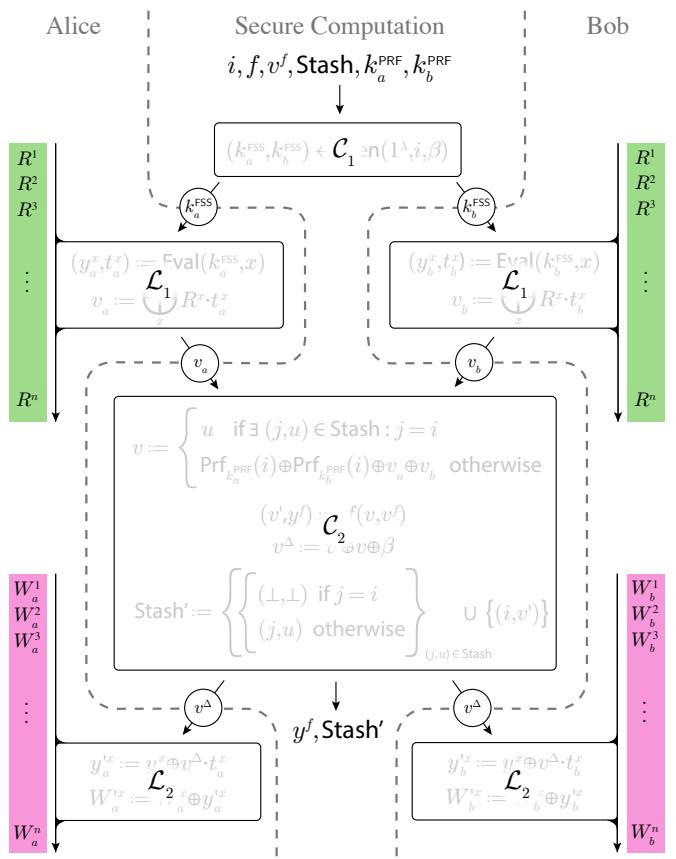

flowchart

```mermaid
graph TD
    A["Alice"] --> B["Secure Computation"]
    B --> C["Bob"]
    subgraph Alice
        D["R¹ R² R³"] --> E["(yₐˣ,tₐˣ) := Eval(kₐˣFSS,x)"]
        E --> F["vₐ := ∪ᵢ₌ᵢ₌ᵢ₌ᵢ₌ᵢ₌ᵢ₌ᵢ₌ᵢ₌ᵢ₌ᵢ₌ᵢ₌ᵢ₌ᵢ₌ᵢ₌ᵢ₌ᵢ₌ᵢ₌ᵢ₌ᵢ₌ᵢ₌ᵢ₌ᵢ₌ᵢ₌ᵢ₌ᵢ₌ᵢ₌ᵢ₌ᵢ₌ᵢ₌ᵢ₌ᵢ₌ᵢ₌ᵢ₌ᵢ₌₁₋₁₋₁₋₁₋₁₋₁₋₁₋₁₋₁₋₁₋₁₋₁₋₁₋₁₋₁₋₁₋₁₋₁₋₁₋₁₋₁₋₁₋₁₋₁₋₁₋₁₋₁₋₁₋₁₋₁₋₁₋₁₋₁₋₁₋₁₋₁₋₁₋₁₋₁₋₁₋₁₋₁₋₁₋₁₋₁₋₁₋₁₋₁₋₁₋₁₋₁₊₁₋₁₊₁₋₁₊₁₋₁₊₁₋₁₊₁₋₁₊₁₋₁₊₁₋₁₊₁₋₁₊₁₋₁₊₁₋₁₊₁₋₁₊₁₋₁₊₁₋₁₊₁₋₁₊₁₋₁₊₁₋₁₊₁₋₁₊₁₋₁₊₁₋₁₊₁₋₁₊₁₋₁₊₁₋₁₊₁₋₁₊₁₋₁₊₁₋₁₋₁₊₁₋₁₊₁₋₁₊₁₋₁₊₁₋₁₊₁₋₁₊₁₋₁₊₁₋₁₊₁₋₁₊₁₋₁₊₁₋₁₊₁₋₁₊₁₋₁₊₁₋₁₊₁₋₁₊₁₋₁₊₁₋₁₊₁₋₁₊₁₋₁₊₁₋₁₊₁₋₁₊₁₋₁₊₁₋₁₊₁₋₁₊₁₊₂₋₂₋₂₋₂₋₂₋₂₋₂₋₂₋₂₋₂₋₂₋₂₋₂₋₂₋₂₋₂₋₂₋₂₋₂₋₂₋₂₋₂₋₂₋₂₋₂₋₂₋₂₋₂₋₂₋₂₋₂₋₂₋₂₋₂₋₂₋₂₋₂₋₂₋₂₋₂₋₂₋₂₋₂₋₂₋₂₋₂₋₂₋₂₋₂₋₂₋₂-ₙ(1λ,i,β)<br>    end<br>    subgraph Bob<br>        D[R¹ R² R³"] --> E
        E --> F["vₐ"]
        F --> G["vₑ"]
        G --> H["Stash' := { (⊥,⊥) if j = i (j,u) otherwise } (v',y'f) = { (⊥,⊥) if j = i (j,u) otherwise } (vΔ := ∪{ (i,v') } (j,u) ∈ Stash "]
        H --> I["y'f,Stash'"]
        I --> J["vΔ"]
        J --> K["y'ₜ,Stash'"]
        K --> L["Stash' := { (⊥,⊥) if j = i (j,u) otherwise } (vΔ := ∪{ (i,v') } (j,u) ∈ Stash "]
        L --> M["Stash' := { (⊥,⊥) if j = i (j,u) otherwise } (vΔ := ∪{ (i,v') } (j,u) ∈ Stash "]
        M --> N["y'ₜ,Stash'"]
        N --> O["Stash' := { (⊥,⊥) if j = i (j,u) otherwise } (vΔ := ∪{ (i,v') } (j,u) ∈ Stash "]
        O --> P["Stash' := { (⊥,⊥) if j = i (j,u) otherwise } (vΔ := ∪{ (i,v') } (j,u) ∈ Stash "]
        P --> Q["y'ₜ,Stash'"]
        Q --> R["Stash' := { (⊥,⊥) if j = i (j,u) otherwise } (vΔ := ∪{ (i,v') } (j,u) ∈ Stash "]
        R --> S["Stash' := { (⊥,⊥) if j = i (j,u) otherwise } (vΔ := ∪{ (i,v') } (j,u) ∈ Stash "]
        S --> T["y'ₜ,Stash'"]
        T --> U["Stash' := { (⊥,⊥) if j = i (j,u) otherwise } (vΔ := ∪{ (i,v') } (j,u) ∈ Stash "]
        U --> V["Stash' := { (⊥,⊥) if j = i (j,u) otherwise } (vΔ := ∪{ (i,v') } (j,u) ∈ Stash "]
        V --> W["y'ₜ,Stash'"]
        W --> X["Stash' := { (⊥,⊥) if j = i (j,u) otherwise } (vΔ := ∪{ (i,v') } (j,u) ∈ Stash "]
        X --> Y["Stash' := { (⊥,⊥) if j = i (j,u) otherwise } (vΔ := ∪{ (i,v') } (j,u) ∈ Stash "]
        Y --> Z["y'ₜ,Stash'"]
        Z --> AA["Stash' := { (⊥,⊥) if j = i (j,u) otherwise } (vΔ := ∪{ (i,v') } (j,u) ∈ Stash "]
        AA --> AB["Stash' := { (⊥,⊥) if j = i (j,u) otherwise } (vΔ := ∪{ (i,v') } (j,u) ∈ Stash "]
        AB --> AC["y'ₜ,Stash'"]
        AC --> AD["Stash' := { (⊥,⊥) if j = i (j,u) otherwise } (vΔ := ∪{ (i,v') } (j,u) ∈ Stash "]
        AD --> AE["Stash' := { (⊥,⊥) if j = i (j,u) otherwise } (vΔ := ∪{ (i,v') } (j,u) ∈ Stash "]
        AE --> AF["y'ₜ,Stash'"]
        AF --> AG["Stash' := { (⊥,⊥) if j = i (j,u) otherwise } (vΔ := ∪{ (i,v') } (j,u) ∈ Stash "]
        AG --> AH["Stash' := { (⊥,⊥) if j = i (j,u) otherwise } (vΔ := ∪{ (i,v') } (j,u) ∈ Stash "]
        AH --> AI["y'ₜ,Stash'"]
        AI --> AJ["Stash' := { (⊥,⊥) if j = i (j,u) otherwise } (vΔ := ∪{ (i,v') } (j,u) ∈ Stash "]
        AJ --> AK["Stash' := { (⊥,⊥) if j = i (j,u) otherwise } (vΔ := ∪{ (i,v') } (j,u) ∈ Stash "]
        AK --> AL["y'ₜ,Stash'"]
        AL --> AM["Stash' := { (⊥,⊥) if j = i (j,u) otherwise } (vΔ := ∪{ (i,v') } (j,u) ∈ Stash "]
        AM --> AN["Stash' := { (⊥,⊥) if j = i (j,u) otherwise } (vΔ := ∪{ (i,v') } (j,u) ∈ Stash "]
        AN --> AO["y'ₜ,Stash'"]
        AO --> AP["Stash' := { (⊥,⊥) if j = i (j,u) otherwise } (vΔ := ∪{ (i,v') } (j,u) ∈ Stash "]
        AP --> AQ["Stash' := { (⊥,⊥) if j = i (j,u) otherwise } (vΔ := ∪{ (i,v') } (j,u) ∈ Stash "]
        AQ --> AR["y'ₜ,Stash'"]
        AR --> AS["Stash' := { (⊥,⊥) if j = i (j,u) otherwise } (vΔ := ∪{ (i,v') } (j,u) ∈ Stash "]
        AS --> AT["Stash' := { (⊥,⊥) if j = i (j,u) otherwise } (vΔ := ∪{ (i,v') } (j,u) ∈ Stash "]
        AT --> AU["y'ₜ,Stash'"]
        AU --> AV["Stash' := { (⊥,⊥) if j = i (j,u) otherwise } (vΔ := ∪{ (i,v') } (j,u) ∈ Stash "]
        AU --> AW["Stash' := { (⊥,⊥) if j = i (j,u) otherwise } (vΔ := ∪{ (i,v') } (j,u) ∈ Stash "]
        AW --> AX["y'ₜ,Stash'"]
        AX --> AY["Stash' := { y'ₐₓ ⊕ v'Δ·t'ₐₓ }<br>        AY --> AZ[W'ₐₓ : = y'ₐₓ ⊕ y'ₐₓ"]
    end
    subgraph W_a^1
        BA["W_a^2 W_a^3"]
        BB["..."]
        BC["W_n^a"]
    end
```

Figure 11: Diagram of the Floram Access method, illustrating the correspondence between the view described here and the algorithm presented in Section 4.

Lemma B.1 (Correctness for $\pi _ { A } )$ . $I f \ ( \mathsf { G e n } , \mathsf { E v a l } )$ is a secure FSS scheme for DPFs, $\pi _ { \mathcal { C } _ { 1 } }$ and $\pi _ { \mathcal { C } _ { 2 } }$ are secure multiparty computation protocols for $\mathcal { C } _ { 1 }$ and $\mathcal { C } _ { 2 }$ respectively, and Prf is a Pseudo-random Function Family, then:

$$
\left\{\mathcal {F} _ {A} \left(\operatorname{Input} ^ {A}\right) \right\} _ {\operatorname{Input} ^ {A} \in \operatorname{Dom} _ {n, m} ^ {A}} \stackrel {{s}} {{=}} \left\{\operatorname{Output} ^ {\pi_ {A}} \left(\operatorname{Input} ^ {A}\right) \right\} _ {\operatorname{Input} ^ {A} \in \operatorname{Dom} _ {n, m} ^ {A}} \tag {1}
$$

Proof. We specify the ideal functionality for $\pi _ { A }$ in Figure 12. First we consider the circuits $\mathcal { C } _ { 1 }$ and $\mathcal { C } _ { 2 }$ , implemented by MPC protocols $\pi _ { \mathcal { C } _ { 1 } }$ 1 and $\pi _ { \mathcal { C } _ { 2 } }$ respectively. Security under Definition A.1 implies that Outpu $\cdot ^ { \pi _ { c _ { 1 } } } ( \mathsf { I n p u t } ^ { \overline { { \boldsymbol { c } } } _ { 1 } } ) \overset { c } { \equiv } \mathcal { C } _ { 1 } ^ { \mathsf { \bar { \Pi } } } ( \mathsf { I n p u t } ^ { \mathcal { C } _ { 1 } } )$ ) and $\mathsf { O u t p u t } ^ { \bar { \boldsymbol { \pi } } _ { c _ { 2 } } } ( \mathsf { I n p u t } ^ { \mathcal { C } _ { 2 } } ) \stackrel { c } { \equiv } \mathcal { C } _ { 2 } ( \mathsf { I n p u t } ^ { \mathcal { C } _ { 1 } } )$ . Because we consider only the outputs and not the full views, the lengths of the elements in these ensembles remain fixed, even as the security parameter increases. If they are computationally indistinguishable then it follows that as the security parameter increases they must also become statistically close (i.e. correct with very high probability).

The remainder of the correctness proof follows by inspection. As shown in Figures 5 and 11, the functionality of $\mathcal { C } _ { 1 }$ is the FSS Gen algorithm. Because (Gen, Eval) is a correct FSS scheme per Definition 2, the output of the Eval function for party $p$ will be $p \mathrm { { s } }$ share of a pair of point functions y and t with values $\beta$ and 1 respectively at index i. Algorithm $\mathcal { L } _ { 1 }$ implements the dot product of t with $R ,$ and so $v _ { a }$ and $v _ { b }$ are shares of $R ^ { i }$ .

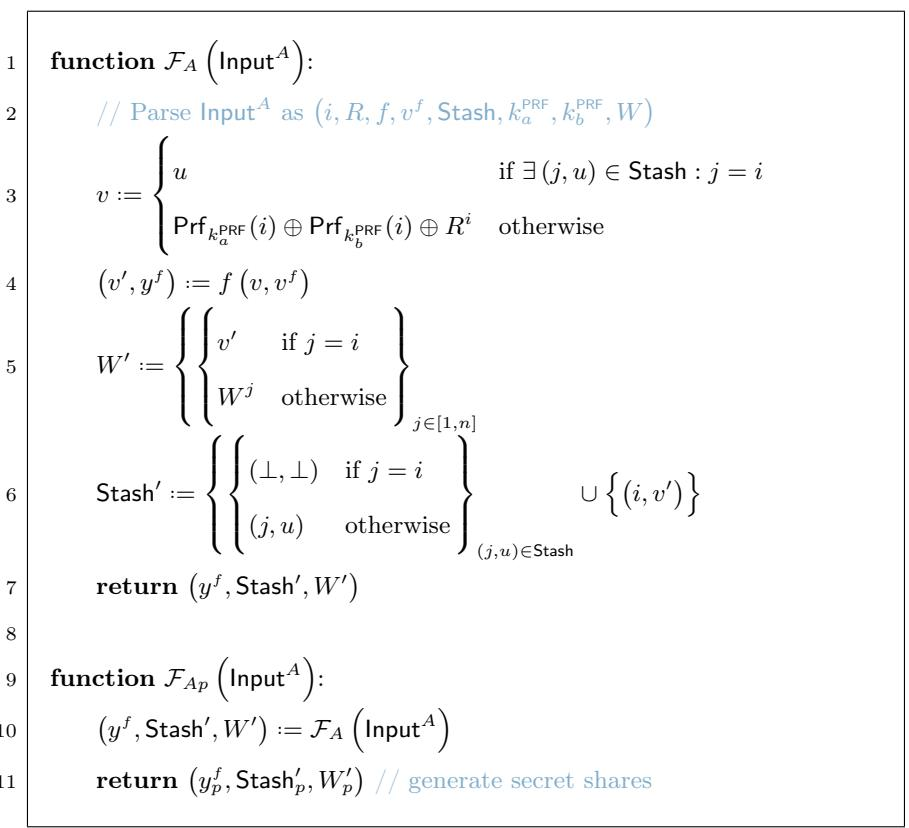

text_image

function F_A (Input^A):
    // Parse Input^A as (i, R, f, v^f, Stash, k_a^{PRF}, k_b^{PRF}, W)
    v := {u if ∃(j, u) ∈ Stash : j = i
    Prf_{k_a^{PRF}}(i) ⊕ Prf_{k_b^{PRF}}(i) ⊕ R^i otherwise
    (v', y^f) := f(v, v^f)
    W' := {v' if j = i
    W^j otherwise }_{j \in [1,n]} 
    Stash' := {((⊥,⊥) if j = i
    (j, u) otherwise }_{(j,u) ∈ Stash} ∪ {(i, v')} 
    return (y^f, Stash', W')
function F_Ap (Input^A):
    (y^f, Stash', W') := F_A (Input^A)
    return (y_p^f, Stash_p', W_p') // generate secret shares

Figure 12: Pseudocode for the ideal functionality of the access protocol $\pi A$

The functionality of $\mathcal { C } _ { 2 }$ is given in the appropriate sections of Figures 5 and 11. InputA is assumed to be valid, which implies that R was twice-masked by $\mathsf { P r f } ,$ and it follows that either

$$
W ^ {i} = \operatorname{Prf} _ {k _ {a} ^ {\mathrm{PRF}}} (i) \oplus \operatorname{Prf} _ {k _ {b} ^ {\mathrm{PRF}}} (i) \oplus R ^ {i}
$$

or $( i , W ^ { i } ) \in \mathsf { S t a s h }$ . Either way, we have $v = W ^ { i }$ , the correct value. Note that the stash read, function application, and stash write steps are specified identically between ${ \mathcal { F } } _ { A }$ and $\mathcal { C } _ { 2 }$ , and consequently

$$
\begin{array}{l} \left\{\left(y ^ {f}, \text {Stash} ^ {\prime}\right): \left(y ^ {f}, \text {Stash} ^ {\prime}, W ^ {\prime}\right) := \mathcal {F} _ {A} \left(\operatorname{Input} ^ {A}\right) \right\} _ {\operatorname{Input} ^ {A} \in \operatorname{Dom} _ {n, m} ^ {A}} \tag {2} \\ \stackrel {{s}} {{=}} \left\{\left(y ^ {f}, \operatorname{Stash} ^ {\prime}\right): \left(y ^ {f}, \operatorname{Stash} ^ {\prime}, W ^ {\prime}\right) := \operatorname{Output} ^ {\pi_ {A}} \left(\operatorname{Input} ^ {A}\right) \right\} _ {\operatorname{Input} ^ {A} \in \operatorname{Dom} _ {n, m} ^ {A}} \\ \end{array}
$$

Here we reason about only two of the three elements in $\mathsf { O u t p u t } ^ { \pi _ { A } }$ ; we must still reason about $W ^ { \prime }$ . Recall that $v = W ^ { i }$ , and that each party has shares of two point functions: y and t with values $\beta$ and 1 at index i respectively. $\mathcal { C } _ { 2 }$ calculates $v ^ { \Delta } = W ^ { i } \oplus v ^ { \prime } \oplus \beta$ . By inspection of $\mathcal { L } _ { 2 }$ , we see that both parties $\mathrm { { X O R \ } } v ^ { \Delta }$ into their shares of the point function $y ,$ conditioned element-wise on $t ,$ yielding shares of a new point function $y ^ { \prime }$ such that for $j \in [ 1 , n ]$ :

$$
y ^ {j} = \left\{ \begin{array}{l l} \beta \oplus v ^ {\Delta} = \beta \oplus \beta \oplus v ^ {\prime} \oplus W ^ {i} = v ^ {\prime} \oplus W ^ {i} & \text {if j = i} \\ 0 \oplus v ^ {\Delta} \oplus v ^ {\Delta} = 0 & \text {otherwise} \end{array} \right.
$$

The parties then combine their shares of $y ^ { \prime }$ with their shares of $W$ to yield $W ^ { \prime }$ as specified by ${ \mathcal { F } } _ { A }$ . For $j \in [ 1 , n ]$ :

$$
W ^ {\prime j} = \left\{ \begin{array}{l l} W ^ {j} \oplus y ^ {\prime j} = W ^ {j} \oplus W ^ {i} \oplus v ^ {\prime} = v ^ {\prime} & \text { if   } j = i \\ W ^ {j} \oplus 0 = W ^ {j} & \text { otherwise } \end{array} \right. \tag {3}
$$

By the conjunction of Equations 2 and 3 we have Equation 1, and thus Lemma B.1 holds.

Lemma B.2 (Security for $\pi _ { A } )$ . If (Gen, Eval) is a secure FSS scheme for $D P F s ,$ $\pi _ { \mathcal { C } _ { 1 } }$ and $\pi _ { \mathcal { C } _ { 2 } }$ are secure multiparty computation protocols for $\mathcal { C } _ { 1 }$ and $\mathcal { C } _ { 2 }$ respectively, and Prf is a Pseudo-random Function Family, then for each party $p \in \{ a , b \}$ there exists a simulator $\mathsf { S i m } _ { p } ^ { A }$ such that:

$$
\begin{array}{l} \left\{\left(\operatorname{Sim} _ {p} ^ {A} \left(\operatorname{Input} _ {p} ^ {A}, \mathcal {F} _ {A p} \left(\operatorname{Input} ^ {A}\right)\right), \mathcal {F} _ {A} \left(\operatorname{Input} ^ {A}\right)\right) \right\} _ {\operatorname{Input} ^ {A} \in \operatorname{Dom} _ {n, m} ^ {A}} \\ \stackrel {{c}} {{=}} \left\{\left(\operatorname{View} _ {p} ^ {\pi_ {A}} \left(\operatorname{Input} ^ {A}\right), \operatorname{Output} ^ {\pi_ {A}} (\operatorname{Input} ^ {A})\right) \right\} _ {\operatorname{Input} ^ {A} \in \operatorname{Dom} _ {n, m} ^ {A}} \\ \end{array}
$$

Proof. If $\left( \mathsf { G e n } , \mathsf { E v a l } \right)$ is a secure FSS scheme for DPFs, then by Definition 2 there must exist some simulator, $\mathsf { S i m } ^ { \mathsf { F S S } }$ , for FSS keys. Similarly, if $\pi _ { \mathcal { C } _ { 1 } }$ 1 and $\pi _ { \mathcal { C } _ { \Sigma } }$ are secure multiparty computation protocols, then by Definition A.1 for $p \in \{ a , b \}$ there must exist simulators $\mathsf { S i m } _ { \upsilon } ^ { \mathsf { \bar { C } _ { 1 } } }$ and $\mathsf { S i m } _ { p } ^ { \mathcal { C } _ { 2 } }$ for those protocols. We begin by specifying a simulator for $\pi _ { A } , \ \mathsf { S i m } _ { p } ^ { A }$ p, which has access to $\mathsf { S i m } ^ { \mathsf { F S S } }$ , $\mathsf { S i m } _ { p } ^ { \mathcal { C } _ { 1 } ^ { \mathrm { ~ \scriptsize ~  ~ } } }$ , and Sim $\boldsymbol { 1 } _ { p } ^ { \mathcal { C } _ { 2 } }$ , as well as $\mathcal { L } _ { 1 }$ and the inverse of $\mathcal { L } _ { 2 }$ with respect to $v ^ { \Delta }$ :

$$
v ^ {\Delta} = \mathcal {L} _ {2} ^ {- 1} \left(W _ {p}, W _ {p} ^ {\prime}\right) = \max \left(\left\{W _ {p} ^ {x} \oplus W _ {p} ^ {\prime x} \right\} _ {x \in [ 1, n ]}\right)
$$

Simulator $\mathsf { S i m } _ { p } ^ { A }$ is given party $p \mathrm { ^ s }$ share of the inputs for $\pi _ { A }$ , along with the output of ${ \mathcal { F } } _ { A }$ , upon which it performs the procedure given in Figure 13. Roughly speaking, it uses $\mathsf { S i m } ^ { \mathsf { F S S } }$ along with $\mathcal { L } _ { 1 }$ and $ { \mathcal { L } } _ { 2 } ^ { - 1 }$ to simulate the inputs and outputs for $\mathcal { C } _ { 1 }$ and $\mathcal { C } _ { 2 }$ given the known inputs and outputs for $\pi _ { A } .$ and then passes these to $\mathsf { S i m } _ { p } ^ { \mathcal { C } _ { 1 } }$ and $\mathsf { S i m } _ { p } ^ { \mathcal { C } _ { 2 } }$ . Our proof proceeds via a series of hybrid views.

<table><tr><td>1</td><td>function Sim_p^π_A (Input_p^A, F_Ap (Input^A)) :</td></tr><tr><td>2</td><td>// Parse Input_p^A as (i_p, R, f, v_p^f, Stash_p, k_p^{PRF}, W_p)</td></tr><tr><td>3</td><td>// Parse F_Ap (Input^A) as (y_p^f, Stash_p&#x27;, W_p&#x27;)</td></tr><tr><td>4</td><td>k_{Sim}^{FSS} ← Sim^{FSS}(p, 1^λ)</td></tr><tr><td>5</td><td>β_{Sim} ← {0, 1}^λ</td></tr><tr><td>6</td><td>Msgs_{Sim}^{C_1} ← Sim_{p}^{C_1}(i_p, β_{Sim}, k_{Sim}^{FSS})</td></tr><tr><td>7</td><td>v_{Sim} := L_1(k_{Sim}^{FSS}, R)</td></tr><tr><td>8</td><td>v_{Sim}^Δ := L_2^{-1}(W_p, W_p&#x27;)</td></tr><tr><td>9</td><td>Msgs_{Sim}^{C_2} ← Sim_{p}^{C_2}(i_p, k_{Sim}^{FSS}, β_{Sim}, v_{Sim}, f, v_p^f, Stash_p, k_p^{PRF}, v_{Sim}^Δ, y_p^f, Stash_p&#x27;)</td></tr><tr><td>10</td><td>return (r_{Sim}, i_p, β_{Sim}, Msgs_{Sim}^{C_1}, k_{Sim}^{FSS}, R, f, v_p^f, Stash_p, k_p^{PRF}, Msgs_{Sim}^{C_2}, v_{Sim}^Δ, y_p^f, Stash_p&#x27;, W_p, W_p&#x27;)</td></tr></table>

Figure 13: Pseudocode for a simulator for the access protocol $\pi A$ .

First Hybrid Our first hybrid, $\mathcal { H } _ { 1 } ,$ is identical to the real-world view, except that subsequent to the evaluation of circuit $\mathcal { C } _ { 1 }$ , we discard the messages produced by the real circuit and replace them with

$$
\operatorname{Msgs} _ {\text { Sim }} ^ {\mathcal {C} _ {1}} \leftarrow \operatorname{Sim} _ {p} ^ {\mathcal {C} _ {1}} \left(\operatorname{Input} _ {p} ^ {\mathcal {C} _ {1}}, \operatorname{Output} _ {p} ^ {\pi_ {\mathcal {C} _ {1}}} \left(\operatorname{Input} _ {p} ^ {\mathcal {C} _ {1}}\right)\right)
$$

Consequently, the view produced by $\mathcal { H } _ { 1 }$ for party $p$ is identical to $p \mathrm { { s } }$ view of the real protocol, except where these messages differ.

Suppose there were a probabilistic polynomial time (PPT) distinguisher, $D _ { 1 }$ , that could distinguish between the ensembles

$$
\begin{array}{l} E _ {p} ^ {\pi_ {A}} = \left\{\left(\operatorname{View} _ {p} ^ {\pi_ {A}} \left(\operatorname{Input} ^ {A}\right), \operatorname{Output} ^ {\pi_ {A}} \left(\operatorname{Input} ^ {A}\right)\right) \right\} \\ E _ {p} ^ {\mathcal {H} _ {1}} = \left\{\left(\operatorname{View} _ {p} ^ {\mathcal {H} _ {1}} \left(\operatorname{Input} ^ {A}\right), \operatorname{Output} ^ {\mathcal {H} _ {1}} \left(\operatorname{Input} ^ {A}\right)\right) \right\} \\ \end{array}
$$

for some input $\mathsf { I n p u t } ^ { A }$ with some advantage $\delta _ { 1 }$ . We could use $D _ { 1 }$ to construct a distinguisher $D _ { 2 }$ for the MPC protocol that evaluates $\mathcal { C } _ { 1 } , \ D _ { 2 }$ is given some $\mathsf { V i e w } _ { p } ^ { D _ { 2 } }$ D2 , produced either by a real evaluation of $\pi _ { \mathcal { C } _ { 1 } }$ or by $\mathsf { S i m } _ { p } ^ { \mathcal { C } _ { 1 } }$ . Additionally,

function D2 ViewD2p , OutputD2 , AuxD2 :

// Parse ViewD2p as ip, βp, MsgsC1p , kFSSp 

// Parse OutputD2 as kFSSp , kFSSq 

iq , βq , R, vfp , vfq , Stashp, Stashq , // Parse AuxD2 as kPRFp , kPRFq , Wp, Wq

$$
v _ {p} := \mathcal {L} _ {1} \left(k _ {p} ^ {\text { FSS }}, R\right)
$$

$$
v _ {q} := \mathcal {L} _ {1} \left(k _ {q} ^ {\text { FSS }}, R\right)
$$

$$
\mathsf {I n p u t} ^ {\mathcal {C} _ {2}} := \binom{i _ {p}, i _ {q}, v _ {p}, v _ {q}, v _ {p} ^ {f}, v _ {q} ^ {f}, \beta_ {p}, \beta_ {q},}{\mathsf {S t a s h} _ {p}, \mathsf {S t a s h} _ {q}, k _ {p} ^ {\mathsf {F S S}}, k _ {q} ^ {\mathsf {F S S}}, k _ {p} ^ {\mathsf {P R F}}, k _ {q} ^ {\mathsf {P R F}}}
$$

/ Evaluate both parties’ portions of the protocol for $\mathcal { C } _ { 2 }$

$$
\left(v ^ {\Delta}, y _ {p} ^ {f}, \operatorname{Stash} _ {p} ^ {\prime}\right) \leftarrow \operatorname{Output} _ {p} ^ {\pi_ {\mathcal {C} _ {2}}} \left(\operatorname{Input} ^ {\mathcal {C} _ {2}}\right)
$$

$$
\left(v ^ {\Delta}, y _ {q} ^ {f}, \operatorname{Stash} _ {q} ^ {\prime}\right) \leftarrow \operatorname{Output} _ {q} ^ {\pi_ {\mathcal {C} _ {2}}} \left(\operatorname{Input} ^ {\mathcal {C} _ {2}}\right)
$$

$$
W _ {p} ^ {\prime} := \mathcal {L} _ {2} \left(k _ {p} ^ {\mathrm{FSS}}, v ^ {\Delta}, W _ {p}\right)
$$

$$
W _ {q} ^ {\prime} := \mathcal {L} _ {2} \left(k _ {q} ^ {\text { FSS }}, v ^ {\Delta}, W _ {q}\right)
$$

$$
E _ {p} ^ {D _ {1}} := \left(\binom{\mathsf {V i e w} _ {p} ^ {D _ {2}}, \mathsf {V i e w} _ {p} ^ {\pi_ {\mathcal {C} _ {2}}} \left(\mathsf {I n p u t} ^ {\mathcal {C} _ {2}}\right),}{R, W _ {p}, W _ {p} ^ {\prime}}  ,   (y ^ {f}, \mathsf {S t a s h} ^ {\prime}, W ^ {\prime})\right)
$$

$$
\text { return } D _ {1} \left(E _ {p} ^ {D _ {1}}\right)
$$

Figure 14: Pseudocode for distinguisher $D _ { 2 }$ for MPC protocols. This distinguisher takes nonuniform input $\mathsf { A u x } ^ { \overline { { D } } _ { 2 } }$ and has access to a distinguisher $D _ { 1 }$ for the ensembles $E _ { p } ^ { \mathcal { H } _ { 1 } }$ and $E _ { p } ^ { \pi _ { A } }$ .

it is given the two-party output of the associated functionality, $\mathsf { O u t p u t } ^ { D _ { 2 } }$ , and unifor, and uxiliaryto give ormation, the best $\mathsf { A u x } ^ { D _ { 2 } }$ (chosen as a function of le advantage). Furtherm $\mathsf { V i e w } _ { p } ^ { D _ { 2 } }$ $\mathsf { O u t p u t } ^ { D _ { 2 } }$ $D _ { 1 }$ $D _ { 2 }$ $\mathbf { \bar { \boldsymbol { D } } _ { 2 } }$ has access to the circuit $\mathcal { C } _ { 2 } . ~ D _ { 2 }$ performs the procedure specified in Figure 14.

If $\mathsf { V i e w } _ { p } ^ { D _ { 2 } }$ was generated by $\mathsf { S i m } _ { p } ^ { \mathcal { C } _ { 1 } }$ , then $E _ { p } ^ { D _ { 1 } } \ = \ E _ { p } ^ { \mathcal { H } _ { 1 } }$ , whereas if it was generated by a real evaluation of the circuit $\mathcal { C } _ { 1 } .$ then $E _ { p } ^ { \vec { D _ { 1 } } } = E _ { p } ^ { \pi _ { A } } . ~ D _ { 2 }$ makes a single call to $D _ { 1 }$ , and all of the inputs to $D _ { 1 }$ that are not determined by $\mathsf { V i e w } _ { p } ^ { D _ { 2 } }$ or $\mathsf { \Gamma } _ { \mathsf { O u t p u t } } ^ { D _ { 2 } }$ are given as non-uniform advice to provide the best discriminatory power; thus it must be the case that $D _ { 2 }$ has advantage $\delta _ { 2 }$ such that $\delta _ { 2 } = \delta _ { 1 }$ . By

Definition A.1, for security parameter λ and all choices of $\mathsf { I n p u t } ^ { \mathcal { C } _ { 1 } }$ :

$$
\begin{array}{l} \delta_ {2} = \left| \begin{array}{c} \operatorname * {P r} \left[ D _ {2} \left(\text {View} _ {p} ^ {\pi_ {\mathcal {C} _ {1}}} \left(\text {Input} ^ {\mathcal {C} _ {1}}\right), \text {Output} ^ {\pi_ {\mathcal {C} _ {1}}} \left(\text {Input} ^ {\mathcal {C} _ {1}}\right)\right) = 1 \right] \\ - \operatorname * {P r} \left[ D _ {2} \left(\text {Sim} _ {p} ^ {\mathcal {C} _ {1}} \left(\text {Input} _ {p} ^ {\mathcal {C} _ {1}}\right), \mathcal {F} _ {\mathcal {C} _ {1}} \left(\text {Input} ^ {\mathcal {C} _ {1}}\right)\right) = 1 \right] \end{array} \right| \\ <   \frac {1}{\mathsf {p o l y} (\lambda)} \\ \end{array}
$$

Thus $\delta _ { 1 } = \delta _ { 2 } < 1 / \mathsf { p o l y } ( \lambda )$ , and $\mathcal { H } _ { 1 }$ is computationally indistinguishable from the real view.

Second Hybrid Our second hybrid, $\mathcal { H } _ { 2 } .$ is identical to the first, except that we omit the evaluation of $\mathcal { C } _ { 1 }$ , and replace its outputs as follows: choose $\beta _ { \mathsf { S i m } } \gets$ $\{ 0 , 1 \} ^ { \lambda }$ (Note that $\beta _ { \mathsf { { S i m } } }$ has the same distribution as the real value), and then generate the FSS key using a DPF simulator:

$$
k _ {\text { Sim }} ^ {\text { FSS }} \leftarrow \text { Sim } ^ {\text { FSS }} \left(p, 1 ^ {\lambda}\right)
$$

Suppose there were a probabilistic polynomial time (PPT) distinguisher, $D _ { 3 }$ , that could distinguish between the ensembles

$$
E _ {p} ^ {\mathcal {H} _ {1}} = \left\{\left(\operatorname{View} _ {p} ^ {\mathcal {H} _ {1}} \left(\operatorname{Input} ^ {A}\right), \operatorname{Output} ^ {\mathcal {H} _ {1}} \left(\operatorname{Input} ^ {A}\right)\right) \right\}
$$

$$
E _ {p} ^ {\mathcal {H} _ {2}} = \left\{\left(\operatorname{View} _ {p} ^ {\mathcal {H} _ {2}} \left(\operatorname{Input} ^ {A}\right), \operatorname{Output} ^ {\mathcal {H} _ {2}} \left(\operatorname{Input} ^ {A}\right)\right) \right\}
$$

for some input Inpu $\mathfrak { t } ^ { A }$ with some advantage $\delta _ { 3 }$ . We could use $D _ { 3 }$ to construct a distinguisher $D _ { 4 }$ for FSS keys. $D _ { 4 }$ has access to the simulator $\mathsf { S i m } _ { p } ^ { \mathcal { C } _ { 1 } }$ , as well as the real circuit $\mathcal { C } _ { 2 }$ . Given some FSS key, $k _ { D } ^ { \mathsf { F S S } }$ , created either by the real FSS Gen algorithm, or by its simulator, $\mathsf { S i m } ^ { \mathsf { F S S } }$ , and some nonuniform auxiliary information, $\mathsf { A u x } ^ { D _ { 4 } } , D _ { 4 }$ performs the procedure given in Figure 15.

If $k _ { D } ^ { \mathsf { F S S } }$ was generated by $\mathsf { S i m } ^ { \mathsf { F S S } }$ , then $E _ { p } ^ { D _ { 3 } } = E _ { p } ^ { \bar { \mathcal { H } } _ { 2 } }$ , whereas if it was generated by a real instance of the FSS Gen algorithm, then $E _ { p } ^ { D _ { 3 } } = E _ { p } ^ { \mathcal { H } _ { 1 } }$ . $D _ { 4 }$ makes a single call to $D _ { 3 }$ , and inputs to $D _ { 3 }$ that are not determined by $k _ { D } ^ { \mathsf { F S S } }$ or $\beta _ { \mathsf { { s i m } } }$ are given as non-uniform advice; thus it must be the case that $D _ { 4 }$ has advantage $\delta _ { 4 }$ such that $\delta _ { 4 } = \delta _ { 3 }$ . By Definition $^ { 2 , }$ for security parameter $\lambda$ and all $\alpha , \beta ,$ , and $p \mathrm { : }$

$$
\delta_ {4} = \left| \begin{array}{c} \operatorname * {P r} \left[ D _ {4} \left(\mathsf {G e n} \left(1 ^ {\lambda}, f _ {\alpha , \beta}\right): k _ {p} ^ {\mathrm{FSS}}\right) = 1 \right] \\ - \operatorname * {P r} \left[ D _ {4} \left(\mathsf {S i m} ^ {\mathrm{FSS}} \left(p, 1 ^ {\lambda}\right)\right) = 1 \right] \end{array} \right| <   \frac {1}{\mathsf {p o l y} (\lambda)}
$$

Thus $\delta _ { 3 } = \delta _ { 4 } < 1 / \mathsf { p o l y } ( \lambda )$ , and $\mathcal { H } _ { 2 }$ is computationally indistinguishable from $\mathcal { H } _ { 1 }$ .

<table><tr><td>1</td><td>function D4(kFSSD, AuxD4):</td></tr><tr><td>2</td><td>// Parse AuxD4as (ip, iq, βq, kFSSq, R, vpf, vqf, Stashp, Stashq, kpPRF, kpPRF, Wp, Wq)</td></tr><tr><td>3</td><td>βSim←{0,1}λ</td></tr><tr><td>4</td><td>ViewSimC1p ← SimC1p (ip, βSim, kFSSD)</td></tr><tr><td>5</td><td>vp := L1(kFSSD, R)</td></tr><tr><td>6</td><td>vq := L1(kFSSD, R)</td></tr><tr><td>7</td><td>InputC2:= (ip, iq, vp, vv, vpf, vv&#x27;, βSim, βq, Stashp, Stashq, kFSSD, kFSSq, kpPRF, kpPRF)</td></tr><tr><td>8</td><td>// Evaluate both parties&#x27; portions of the protocol for C2</td></tr><tr><td>9</td><td>(vΔ, ypf, Stashp&#x27;) ← OutputπC2p (InputC2p)</td></tr><tr><td>10</td><td>(vΔ, ypf, Stashq&#x27;) ← OutputπC2p (InputC2p)</td></tr><tr><td>11</td><td>Wp&#x27;: = L2(kFSSD, vΔ, Wp)</td></tr><tr><td>12</td><td>Wq&#x27;: = L2(kFSSD, vΔ, Wq)</td></tr><tr><td>13</td><td>EpD3:= ((ViewSimC1p, ViewπC2p (InputC2p), R, Wp, Wp&#x27;) , (yf, Stash&#x27;, W&#x27;) )</td></tr><tr><td>14</td><td>return D3(EpD3)</td></tr></table>

Figure 15: Pseudocode for distinguisher $D _ { 4 }$ for FSS keys. This distinguisher takes nonuniform input $\mathsf { A u x } ^ { D _ { 4 } }$ and has access to the distinguisher $D _ { 3 }$ for ensembles $E _ { p } ^ { \mathcal { H } _ { 1 } }$ and $E _ { p } ^ { \mathcal { H } _ { 2 } }$ .

Third Hybrid The third hybrid, $\mathcal { H } _ { 3 } ,$ is identical to the second, except that, subsequent to the evaluation of $\mathcal { C } _ { 2 } ,$ we discard its messages and replace them with

$$
\operatorname{Msgs} _ {\text { Sim }} ^ {\mathcal {C} _ {2}} \leftarrow \operatorname{Sim} _ {p} ^ {\mathcal {C} _ {2}} \left(f, \operatorname{Input} _ {p} ^ {\mathcal {C} _ {2}}, \operatorname{Output} _ {p} ^ {\pi_ {\mathcal {C} _ {2}}} \left(\operatorname{Input} _ {p} ^ {\mathcal {C} _ {2}}\right)\right)
$$

Suppose there were a PPT distinguisher, $D _ { 5 }$ , that could distinguish between

<table><tr><td>1</td><td>function D6(ViewpD6, OutputD6, AuxD6):</td></tr><tr><td>2</td><td>// Parse ViewpD6 as (ip, vp, vpf, βSim, Stashp, kFSSsim), kpPRF, MsgsC2p, vΔ, ypf, Stashp&#x27;</td></tr><tr><td>3</td><td>// Parse OutputD6 as (vΔ, yf, Stash&#x27;)</td></tr><tr><td>4</td><td>// Parse AuxD6 as (kFSSq, R, Wp, Wq)</td></tr><tr><td>5</td><td>ViewpSimC1← SimpC1(ip, βSim, kFSSsim)</td></tr><tr><td>6</td><td>vp := L1(kFSSsim, R)</td></tr><tr><td>7</td><td>Wp&#x27; := L2(kFSSsim, vΔ, Wp)</td></tr><tr><td>8</td><td>Wq&#x27; := L2(kFSSq, vΔ, Wq)</td></tr><tr><td>9</td><td>EpD5:=(ViewpSimC1, ViewpD6R, Wp, Wp&#x27;), (yf, Stash&#x27;, W&#x27;)</td></tr><tr><td>10</td><td>return D5(EpD5)</td></tr></table>

Figure 16: Pseudocode for distinguisher $D _ { 6 }$ for MPC protocols. This distinguisher takes nonuniform input $\mathsf { A u x } ^ { D _ { 6 } }$ and has access to the distinguisher $D _ { 5 }$ for ensembles $E _ { p } ^ { \mathcal { H } _ { 2 } }$ and $E _ { p } ^ { \mathcal { H } _ { 3 } }$ .

the ensembles

$$
E _ {p} ^ {\mathcal {H} _ {2}} = \left\{\left(\operatorname{View} _ {p} ^ {\mathcal {H} _ {2}} \left(\operatorname{Input} ^ {A}\right), \operatorname{Output} ^ {\mathcal {H} _ {2}} \left(\operatorname{Input} ^ {A}\right)\right) \right\}
$$

$$
E _ {p} ^ {\mathcal {H} _ {3}} = \left\{\left(\operatorname{View} _ {p} ^ {\mathcal {H} _ {3}} \left(\operatorname{Input} ^ {A}\right), \operatorname{Output} ^ {\mathcal {H} _ {3}} \left(\operatorname{Input} ^ {A}\right)\right) \right\}
$$

for some InputA with some advantage $\delta _ { 5 }$ . We could use $D _ { 5 }$ to construct a distinguisher $D _ { 6 }$ for the MPC protocol that evaluates $\mathcal { C } _ { 2 } . \quad D _ { 6 }$ has access to $\mathsf { S i m } _ { p } ^ { \mathcal { C } _ { 1 } }$ , and as input it is given some view, $\mathsf { V i e w } _ { p } ^ { D _ { 6 } }$ , which was produced either by a real evaluation of $\mathcal { C } _ { 2 }$ or by its simulator, $\mathsf { S i m } _ { p } ^ { \mathcal { C } _ { 2 } } .$ Given $\mathsf { V i e w } _ { p } ^ { D _ { 6 } }$ , the twoparty output of the associated functionality, $\mathsf { O u t p u t } ^ { D _ { 6 } }$ tD6 , and some non-uniform auxilliary information $\mathsf { A u x } ^ { D 6 } , D _ { 6 }$ follows the procedure given in Figure 16. Note that the distinguisher does not simulate the FSS key, because a simulation of a key is included in the view to be distinguished.

If $\mathsf { V i e w } _ { p } ^ { D _ { 6 } }$ was generated by $\mathsf { S i m } _ { p } ^ { \mathcal { C } _ { 2 } }$ , then $E _ { p } ^ { D _ { 5 } } \ = \ E _ { p } ^ { \mathcal { H } _ { 3 } }$ , whereas if it was generated by a real evaluation of the circuit $\mathcal { C } _ { 2 }$ , then $E _ { p } ^ { D _ { 5 } ^ { r } } = E _ { p } ^ { \varkappa _ { 2 } }$ . $D _ { 6 }$ makes a single call to $D _ { 5 }$ , and all of the inputs to $D _ { 5 }$ that are not determined by $\mathsf { V i e w } _ { p } ^ { D _ { 6 } }$ or $\mathsf { \bar { O } u t p u t } ^ { D _ { 6 } }$ are chosen non-uniformly to provide the best discriminatory power; thus it must be the case that $D _ { 6 }$ has advantage $\delta _ { 6 }$ such that $\delta _ { 6 } ~ = ~ \delta _ { 5 }$ . By

Definition A.1, for security parameter λ and all choices of $\mathsf { I n p u t } ^ { \mathcal { C } _ { 2 } }$ :

$$
\begin{array}{l} \delta_ {6} = \left| \begin{array}{c} \operatorname * {P r} \left[ D _ {6} \left(\text {View} _ {p} ^ {\pi_ {\mathcal {C} _ {2}}} \left(\text {Input} ^ {\mathcal {C} _ {2}}\right), \text {Output} ^ {\pi_ {\mathcal {C} _ {2}}} \left(\text {Input} ^ {\mathcal {C} _ {2}}\right)\right) = 1 \right] \\ - \operatorname * {P r} \left[ D _ {6} \left(\text {Sim} _ {p} ^ {\mathcal {C} _ {2}} \left(\text {Input} _ {p} ^ {\mathcal {C} _ {2}}\right), \mathcal {F} _ {\mathcal {C} _ {2}} \left(\text {Input} ^ {\mathcal {C} _ {2}}\right)\right) = 1 \right] \end{array} \right| \\ <   \frac {1}{\mathsf {p o l y} (\lambda)} \\ \end{array}
$$

Thus $\delta _ { 5 } = \delta _ { 6 } < 1 / \mathsf { p o l y } ( \lambda )$ , and $\mathcal { H } _ { 3 }$ is computationally indistinguishable from $\mathcal { H } _ { 2 }$ .

Fourth Hybrid Finally, we return to the full simulator, $\mathsf { S i m } _ { p } ^ { A }$ , which we specified in Figure 13. The simulator is identical to $\mathcal { H } _ { 3 } .$ , except that we omit $\mathcal { C } _ { 2 }$ entirely. The simulator is provided $\mathcal { F } _ { A p } ( \mathsf { I n p u t } ^ { A } )$ as input, from which it extracts the necessary values of $y _ { p } ^ { f } .$ , Stash0p, and $\dot { W } _ { p } ^ { \prime } . \ \mathcal { L } _ { 2 } ^ { - 1 }$ is employed to derive $v ^ { \Delta }$ (which is an input to the simulator for $\overline { { \boldsymbol { { \mathcal { C } } } _ { 2 } } } )$ from $W _ { p }$ and $W _ { p } ^ { \prime } .$ . We conclude that for all parties:

$$
\left\{\mathcal {F} _ {A p} \left(\text {Input} ^ {A}\right) \right\} _ {\text {Input} ^ {A} \in \text {Dom} _ {n, m} ^ {A}} = \left\{\text {Output} ^ {\mathcal {H} _ {3}} \left(\text {Input} ^ {A}\right) \right\} _ {\text {Input} ^ {A} \in \text {Dom} _ {n, m} ^ {A}} \implies
$$

$$
E _ {p} ^ {\mathcal {H} _ {3}} = \left\{\left(\operatorname{Sim} _ {p} ^ {A} \left(\operatorname{Input} _ {p} ^ {A}\right), \mathcal {F} _ {A} \left(\operatorname{Input} ^ {A}\right)\right) \right\} _ {\operatorname{Input} ^ {A} \in \operatorname{Dom} _ {n, m} ^ {A}}
$$

Thus by transitivity and Lemma B.1, Lemma B.2 holds.

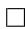

Corollary In order to call the access protocol multiple times upon the same data, it is necessary to show that the state it outputs is also a valid input state, input validity being assumed by Lemmas B.1 and B.2. Notice that in the specification of $\mathcal { C } _ { 2 }$ , we remove any existing elements from the stash that have the index $i ,$ and append $( i , v ^ { \prime } )$ . Consequently, we have a corollary:

Corollary B.2.1. Assuming that $\pi _ { A }$ is a secure protocol under Definition A.1, for any valid input,

$$
\operatorname{Input} ^ {A} = \left(i, R, f, v ^ {f}, \text { Stash }, k _ {a} ^ {\text { PRF }}, k _ {b} ^ {\text { PRF }}, W\right)
$$

if $( y ^ { f }$ , Stash0, $W ^ { \prime } ) : = \mathsf { O u t p u t } ^ { \pi _ { A } } ( \mathsf { I n p u t } ^ { A } )$ , then for any $f ^ { \prime }$ and any $v ^ { f ^ { \prime } }$ that is valid relative to $f ^ { \prime }$ , and any $i ^ { \prime } \in [ 1 , n ]$ ,

$$
\text { Input } ^ {\prime A} = \left(i ^ {\prime}, R, g ^ {\prime}, v ^ {f ^ {\prime}}, \text { Stash } ^ {\prime}, k _ {a} ^ {\text { PRF }}, k _ {b} ^ {\text { PRF }}, W ^ {\prime}\right)
$$

is a valid input for $\pi _ { A }$ .

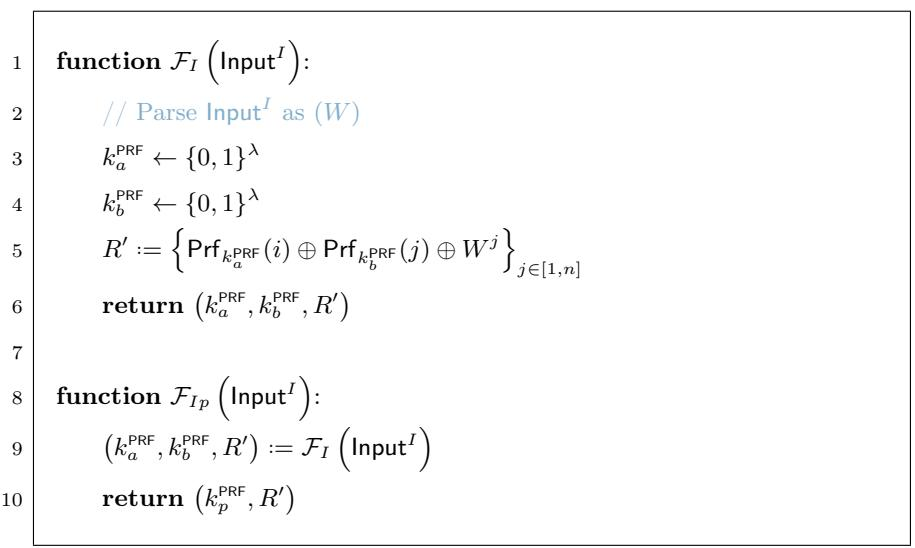

text_image

function F_I (Input^I):
    // Parse Input^I as (W)
    k_a^{PRF} ← {0,1}^λ
    k_b^{PRF} ← {0,1}^λ
    R' := {Prf_{k_a^{PRF}}(i) ⊕ Prf_{k_b^{PRF}}(j) ⊕ W^j}_{j∈[1,n]}
    return (k_a^{PRF}, k_b^{PRF}, R')
function F_I_p (Input^I):
    (k_a^{PRF}, k_b^{PRF}, R') := F_I (Input^I)
    return (k_p^{PRF}, R')

Figure 17: Pseudocode for the ideal functionality of the initialization protocol $\pi _ { I } .$ .

# B.2 Proof of Security for Initialization

Real-world View The real-world view of party p of the initialization protocol πI comprises $p \mathrm { { s } }$ random tape $r _ { p } .$ , the inputs and outputs of the protocol, and the messages received by $p .$ . As specified in Section 4 and illustrated in Figure 4, party p receives only one message, $W _ { q } ^ { \prime }$ (where $q$ is $p ? { \mathfrak { e } }$ s counterparty), which is a copy of $q \mathrm { { ^ { * } s } }$ local state, $W _ { q } ,$ that has been masked by a PRF under an unknown key. Thus we have

$$
\mathsf {I n p u t} _ {p} ^ {I} = \left(W _ {p}\right)
$$

$$
\operatorname{Input} ^ {I} = \left(W _ {p}, W _ {q}\right)
$$

$$
\operatorname{Output} _ {p} ^ {\pi_ {I}} \left(\operatorname{Input} ^ {I}\right) = \left(k _ {p} ^ {\text { PRF }}, R ^ {\prime}\right)
$$

$$
\operatorname{View} _ {p} ^ {\pi_ {I}} \left(\operatorname{Input} ^ {I}\right) = \left(r _ {p}, W _ {p}, k _ {p} ^ {\text { PRF }}, W _ {p} ^ {\prime}, W _ {q} ^ {\prime}, R ^ {\prime}\right)
$$

Lemma B.3 (Correctness for $\pi _ { I } )$ . For each party $p \in \{ a , b \}$

$$
\left\{\mathcal {F} _ {I} \left(\operatorname{Input} ^ {I}\right) \right\} _ {\operatorname{Input} ^ {I} \in \operatorname{Dom} _ {n, m} ^ {I}} = \left\{\operatorname{Output} ^ {\pi_ {I}} \left(\operatorname{Input} ^ {I}\right) \right\} _ {\operatorname{Input} ^ {I} \in \operatorname{Dom} _ {n, m} ^ {I}}
$$

Proof. The ideal functionality for initialization, $\mathcal { F } _ { I } \left( \mathsf { I n p u t } ^ { I } \right)$ , is specified in Figure 17. By comparison with the protocol specification given in Figure 4, we observe that in both the ideal functionality and the actual protocol, new PRF keys are chosen uniformly at random. We further observe that $R ^ { \prime }$ is calculated identically in both, the only difference being in the associativity of XOR operations. Thus, the output of the real initialization protocol is identical to that of the ideal functionality.

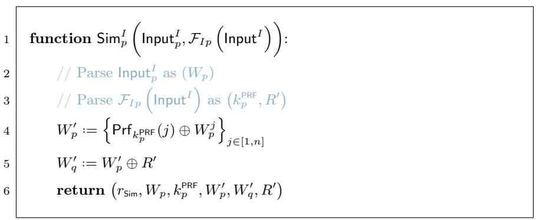

text_image

function Sim_p^I (Input_p^I, F_{Ip} (Input^I)):
    // Parse Input_p^I as (W_p)
    // Parse F_{Ip} (Input^I) as (k_p^{PRF}, R')
    W_p' := {Prf_k_{p}^{PRF}(j) ⊕ W_p^j}_{j \in [1,n]
    W_q' := W_p' ⊕ R'
    return (r_{Sim}, W_p, k_p^{PRF}, W_p', W_q', R')

Figure 18: Pseudocode for a simulator for the initialization protocol $\pi _ { I } .$

Lemma B.4 (Security for $\pi _ { I } )$ . If Prf is a pseudo-random function family, then for each party $p \in \{ a , b \}$ there exists of simulator $\mathsf { S i m } _ { p } ^ { I } \ f o r \ \pi _ { I }$ such that:

$$
\begin{array}{l} \left\{\left(\operatorname{Sim} _ {p} ^ {I} \left(\operatorname{Input} _ {p} ^ {I}, \mathcal {F} _ {I p} \left(\operatorname{Input} ^ {I}\right)\right), \mathcal {F} _ {I} \left(\operatorname{Input} ^ {I}\right)\right) \right\} _ {\operatorname{Input} ^ {I} \in \operatorname{Dom} _ {n, m} ^ {I}} \\ = \left\{\left(\operatorname{View} _ {p} ^ {\pi_ {I}} \left(\operatorname{Input} ^ {I}\right), \operatorname{Output} ^ {\pi_ {I}} \left(\operatorname{Input} ^ {I}\right)\right) \right\} _ {\operatorname{Input} ^ {I} \in \operatorname{Dom} _ {n, m} ^ {I}} \\ \end{array}
$$

Proof. We specify a simulator, $\mathsf { S i m } _ { p } ^ { I } .$ which receives as inputs both the inputs and outputs of the original protocol and performs the procedure given in ${ \mathrm { F i g } } -$ ure 18. The view produced by the simulator and the one generated by the real evaluation are actually identical, and thus by Lemma B.3, Lemma B.4 holds.

Corollary B.4.1. Assuming that $\pi _ { I }$ is a secure protocol under Definition $A . 1 ,$ for any input Inpu $\mathfrak { t } ^ { I } = ( W ) , \ : i f \left( k _ { a } ^ { \mathsf { P R F } } , k _ { b } ^ { \mathsf { P R F } } , R ^ { \prime } \right) : = \mathsf { O u t p u t } ^ { \pi _ { I } } \left( \mathsf { l n p u t } ^ { I } \right)$ and Stash ..= ∅ then for any f and any $v ^ { f }$ that is valid relative to $f ,$ and any $i \in [ 1 , n ]$ ,

$$
\operatorname{Input} ^ {A} = \left(i, R ^ {\prime}, f, v ^ {f}, \text { Stash }, k _ {a} ^ {\text { PRF }}, k _ {b} ^ {\text { PRF }}, W\right)
$$

is a valid input for $\pi _ { A }$

# B.3 Proof of Security for Floram

Real-world view Finally, we prove the security of Floram under Definition A.2. As we mentioned previously, our construction differs from DRAM as specified in Definition A.2 in that it accepts arbitrary functions as input rather than simple read and write commands. Thus

function View $^{\pi_F}$ (Input $^F$ ):
    // Parse Input $^F$ as $\left( W, \left\{ \left( f^j, i^j, v^{f^j} \right) \right\}_{j \in [2, \ell]} \right)$ $(k_a^{\text{FSS}}, k_b^{\text{FSS}}, R) \leftarrow \text{Output}^{\pi_I}(W)$ $\left\{ s_p^1 \right\}_{p \in \{a, b\}} \leftarrow \left\{ \text{View}_p^{\pi_I}(W) \right\}_{p \in \{a, b\}}$ Stash := ∅
    for j ∈ [2, ℓ]:
    Input $^{Aj} := \left( i_p^j, R, f^j, v^{f^j}, \text{Stash}, k_a^{\text{PRF}}, k_b^{\text{PRF}}, W \right)$ $(y^{f^j}, \text{Stash}', W') := \text{Output}^{\pi_A}(\text{Input}^{Aj})$ $\left\{ s_p^j \right\}_{p \in \{a, b\}} \leftarrow \left\{ \text{View}_p^{\pi_A}(\text{Input}^{Aj}) \right\}_{p \in \{a, b\}}$ W := W'
    Stash := Stash' $\{S_p\}_{p \in \{a, b\}} := \left\{ \left\{ s_p^j \right\}_{j \in [1, ℓ]} \right\}_{p \in \{a, b\}}$ return $(S_a, S_b)$ function View $_p^{\pi_F}$ (Input $^F$ ): $(S_a, S_b) \leftarrow \text{View}^{\pi_F}(\text{Input}^F)$ return $S_p$   
Figure 19: Pseudocode for a party’s view of Floram over an epoch.

$$
\operatorname{Input} _ {p} ^ {F} = \left(V _ {p}, \left\{\left(f ^ {j}, i _ {p} ^ {j}, v _ {p} ^ {f ^ {j}}\right) \right\} _ {j \in [ 2, \ell ]}\right)
$$

where \` is the length of the epoch. We formally specify a party’s view of Floram over an epoch in Figure 19, and we specify the ideal functionality $\mathcal { F } _ { F }$ in Figure 20. Note that the protocol specification $\pi _ { F }$ for Floram over an epoch is identical, except that it replaces the ideal functionalities $\mathcal { F } _ { I }$ and ${ \mathcal { F } } _ { A }$ with the protocols $\pi _ { I }$ and $\pi _ { A }$ respectively.

Theorem B.5 (Security for Floram). ${ \cal I } f \pi _ { I }$ is a secure initialization protocol and $\pi _ { A }$ is a secure access protocol and Prf is a Pseudo-random Function Family, then for each party $p \in \{ a , b \}$ , there exists a simulator $\mathsf { S i m } _ { p } ^ { F }$ such that:

<table><tr><td>1</td><td>function F_F (Input^F):</td></tr><tr><td>2</td><td>// Parse Input^F as (W, { (f^j, i^j, v^{f^j})}_{j \in [2,\ell]})</td></tr><tr><td>3</td><td>(k_a^FSS, k_b^FSS, R) := F_I(W)</td></tr><tr><td>4</td><td>Stash := ∅</td></tr><tr><td>5</td><td>for j ∈ [2, ℓ]:</td></tr><tr><td>6</td><td>Input^{Aj} := (i_p^j, R, f^j, v^{f^j}, Stash, k_a^PRF, k_b^PRF, W)</td></tr><tr><td>7</td><td>(y^{f^j}, Stash&#x27;, W&#x27;) := F_A (Input^{Aj})</td></tr><tr><td>8</td><td>W := W&#x27;</td></tr><tr><td>9</td><td>Stash := Stash&#x27;</td></tr><tr><td>10</td><td>return (W&#x27;, {y^{f^j}}_{j \in [2,\ell])})</td></tr><tr><td>11</td><td></td></tr><tr><td>12</td><td>function F_Fp (Input^F):</td></tr><tr><td>13</td><td>(W&#x27;, {y^{f^j}}_{j \in [2,\ell])} := F_F (Input^F)</td></tr><tr><td>14</td><td>return (W_p&#x27;, {y_p^{f^j}}_{j \in [2,\ell])})</td></tr></table>

Figure 20: Pseudocode for ideal functionality of Floram over an epoch.

$$
\begin{array}{l} \left\{\operatorname{Sim} _ {p} ^ {F} \left(\operatorname{Input} _ {p} ^ {F}, \mathcal {F} _ {F p} \left(\operatorname{Input} ^ {F}\right)\right) \right\} _ {\operatorname{Input} ^ {F} \in \operatorname{Dom} _ {n, m, \lambda} ^ {F}} \\ \stackrel {{c}} {{=}} \left\{\operatorname{View} _ {p} ^ {\pi_ {F}} \left(\operatorname{Input} ^ {F}\right) \right\} _ {\operatorname{Input} ^ {F} \in \operatorname{Dom} _ {n, m, \lambda} ^ {F}} \\ \end{array}
$$

where $\mathsf { D o m } _ { n , m , \lambda } ^ { F }$ is the set of valid epochs with lengths \` in $O ( { \mathsf { p o l y } } ( \lambda ) )$ .

Proof. We specify $\mathsf { S i m } _ { p } ^ { F }$ in Figure 21. Notice, first, that $k _ { \sin } ^ { \mathsf { P R F } }$ is drawn from an identical distribution to its counterpart in the real view, as are $\mathsf { S t a s h } _ { \mathsf { S i m } }$ , and $W _ { \mathsf { S i m } }$ for all iterations $j \in [ 2 , \ell ]$ (those counterparts being secret shares). The only distinguishing features in the simulated view are the messages exchanged in the course of $\pi _ { A }$ and $\pi _ { I } .$ , and $R _ { \mathsf { S i m } } .$ which is drawn uniformly from its domain, whereas in the real view it is the XOR of two PRF outputs with V . Our proof will proceed via a series of hybrids.

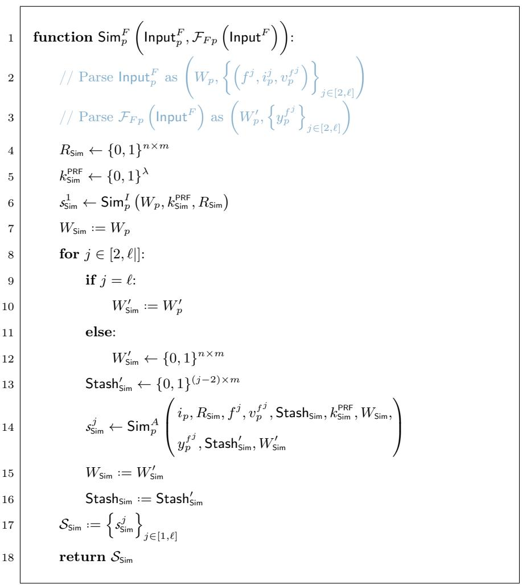

text_image

function Simp^F (Inputp^F, FFP (InputF)):
    // Parse Inputp^F as (Wp, { (f^j, i^j_p, v^f^j_p) } j∈[2,ℓ])
    // Parse FFP (InputF) as (Wp', { yp'p} j∈[2,ℓ])
    RSim ← {0,1}n×m
    kPRFSim ← {0,1}λ
    s1Sim ← Simp^I(Wp, kPRFSim, RSim)
    WSim := Wp
    for j ∈ [2,ℓ]:
        if j = ℓ:
            WSim' := WSp'
        else:
            WSim' ← {0,1}n×m
        Stash′Sim ← {0,1}^(j-2)×m
        sjSim ← Simp^A(p, RSim, f^j, v^f^j_p, StashSim, kPRFSim, WSim,
            yp^f^j, Stash′Sim, WSim')
        WSim := WSim'
        StashSim := Stash′Sim
        SSim := {sjSim} j∈[1,ℓ]
return SSim

Figure 21: Pseudocode for a simulator for Floram over an epoch.

First Hybrid The first hybrid, $\mathcal { H } _ { 4 }$ , is identical to the real view, except that after $\pi _ { I }$ is evaluated, ${ \mathsf { M s g s } } _ { p } ^ { \bar { \pi } _ { I } }$ is discarded and replaced with the output of the associated simulator, $\mathsf { S i m } _ { p } ^ { \pi _ { I } } .$ As the two views differ only insofar as the simulated view of $\pi _ { I }$ differs from a real one, it follows from Lemma B.4 that the two are computationally indistinguishable.

Second Hybrid The second hybrid, $\mathcal { H } _ { 5 }$ , is identical to $\mathcal { H } _ { 4 }$ , except that after each execution of $\pi _ { A } .$ , the corresponding instance of ${ \mathsf { M s g s } } _ { p } ^ { \pi _ { A } }$ is discarded, and $\mathsf { S i m } _ { p } ^ { \pi _ { A } }$ is called to replace it. $\mathcal { H } _ { 5 }$ differs from $\mathcal { H } _ { 4 }$ only insofar as the simulated views of $\pi _ { A }$ differ from the real ones. Thus, it follows from Lemma B.2 and Corollaries B.2.1 and B.4.1 (which provide that initialization and access protocols can be chained) that the two are computationally indistinguishable if the epoch length \` is in $O ( { \mathsf { p o l y } } ( \lambda ) )$ .

<table><tr><td>1</td><td>function D8(VD8, AuxD8):</td></tr><tr><td>2</td><td>// Parse AuxD8 as (kpPRF, V, Wp, { (fj, ipj, vpfj, ypfj) } j∈[2,ℓ])</td></tr><tr><td>3</td><td>RD8 := {VjD8 ⊕ PrfkpPRF(j) ⊕ Vj} j∈[1,n]</td></tr><tr><td>4</td><td>s1D8 ← SimIp(Wp, kpPRF, RD8)</td></tr><tr><td>5</td><td>WSim := Wp</td></tr><tr><td>6</td><td>for j ∈ [2, ℓ]:</td></tr><tr><td>7</td><td>W′Sim ← {0, 1}n×m</td></tr><tr><td>8</td><td>Stash′Sim ← {0, 1} (j-2)×m</td></tr><tr><td>9</td><td>sjD8 ← SimA_p(i_p, RD8, fj, vpfj, StashSim, kpPRF, WSim, ypfj, Stash′Sim, WSim)</td></tr><tr><td>10</td><td>WSim := W′Sim</td></tr><tr><td>11</td><td>StashSim := Stash′Sim</td></tr><tr><td>12</td><td>EpD7 := {sjD8}j∈[1,ℓ]</td></tr><tr><td>13</td><td>return D7(EpD7)</td></tr></table>

Figure 22: Pseudocode for distinguisher $D _ { 8 }$ for PRF outputs. This distinguisher takes nonuniform input $\mathsf { A u x } ^ { \breve { D } _ { 8 } }$ and has access to the distinguisher $D _ { 7 }$ for ensembles $E _ { p } ^ { \mathcal { H } _ { 5 } }$ 5 and E SimFp . $E _ { p } ^ { \mathsf { S i m } ^ { F } }$

Third Hybrid Finally, we return to the full simulation, which is identical to $\mathcal { H } _ { 5 }$ save for two details: First, $\pi _ { A }$ is omitted entirely, and shares of the stash and WOM (except for the final WOM state) are chosen uniformly from the appropriate domains, as in Figure 21. As the new values are distributed identically to the old, it is necessarily the case that they give a distinguisher no advantage. Second, R is replaced by $R _ { \mathsf { S i m } }$ and the evaluation of $\pi _ { I }$ is omitted. Suppose there existed a PPT algorithm $D _ { 7 }$ that could distinguish between the

ensembles

$$
E _ {p} ^ {\mathcal {H} _ {5}} = \left\{\left(\operatorname{View} _ {p} ^ {\mathcal {H} _ {5}} \left(\operatorname{Input} ^ {F}, \mathcal {F} _ {F p} \left(\operatorname{Input} ^ {F}\right)\right), \operatorname{Output} ^ {\mathcal {H} _ {5}} \left(\operatorname{Input} ^ {F}\right)\right) \right\}
$$

$$
E _ {p} ^ {\operatorname{Sim} ^ {F}} = \left\{\left(\operatorname{Sim} _ {p} ^ {F} \left(\operatorname{Input} _ {p} ^ {F}, \mathcal {F} _ {F p} \left(\operatorname{Input} ^ {F}\right)\right), \mathcal {F} _ {F} \left(\operatorname{Input} ^ {F}\right)\right) \right\}
$$

for some valid epoch $\mathsf { i n p u t } ^ { F }$ with advantage $\delta _ { 7 }$ . We could use $D _ { 7 }$ to construct a distinguisher $D _ { 8 }$ for PRF outputs, as specified in Figure 22, which accepts as input some value $V _ { D _ { 8 } } \in \{ 0 , 1 \} ^ { n \times m }$ , such that

$$
V _ {D _ {8}} = \{\mathsf {P r f} _ {k} (i) \} _ {i \in [ 1, n ]}
$$

where $k \gets \{ 0 , 1 \} ^ { \lambda }$ and $\mathsf { P r f } _ { \{ 0 , 1 \} ^ { \lambda } } : \{ 0 , 1 \} ^ { m } \to \{ 0 , 1 \} ^ { m }$ is a Pseudo-random Function Family, or

$$
V _ {D _ {8}} = \{x \leftarrow \{0, 1 \} ^ {m} \} _ {i \in [ 1, n ]}
$$

In the former case, $D _ { 8 }$ constructs an ensemble with a distribution identical to $E _ { p } ^ { \mathcal { H } _ { 5 } }$ he latter case it constructs an ensemble walso receives some non-uniform advice ution identicalimplements a $E _ { p } ^ { \mathsf { S i m } ^ { F } } . \ D _ { 8 }$ $\mathsf { A u x } ^ { D _ { 8 } } . \ D _ { 8 }$ statistical test for PRFs, which succeeds with advantage $\delta _ { 8 } = \delta _ { 7 }$ , and a Family of Pseudo-random Functions must admit the success of no statistical test with advantage greater than $1 / { \mathsf { p o l y } } ( \lambda )$ [20]. In other words, it must be the case that for any $n , \lambda \in \mathbb { N } , k \gets \{ 0 , 1 \} ^ { \lambda }$ ,

$$
\{\mathsf {P r f} _ {k} (i) \} _ {i \in [ 1, n ]} \stackrel {c} {\equiv} \{x \leftarrow \{0, 1 \} ^ {m} \} _ {i \in [ 1, n ]}
$$

Consequently, $\delta _ { 7 } = \delta _ { 8 } \leq 1 / \mathsf { p o l y } ( \lambda )$ , and by transitivity, over all valid epochs, the output of $\mathsf { S i m } _ { p } ^ { F }$ is computationally indistinguishable from a real view of party $p \mathrm { { s } }$ local memory, as required. □

Note A standard hybrid argument yields indistinguishability over sequences of epochs, as required by Definition A.2. The definition allowed the simulator knowledge only of the lengths of the epochs it was to simulate, whereas in this proof we have given the simulator function descriptions for each access as well as shares of inputs and outputs for those functions. However, if a single circuit is constructed to implement both the read and write functionalities, and all accesses in an epoch make use of this circuit (i.e. the functionality of Floram is reduced to simple read and write operations), and if the inputs and outputs are information-theoretic secret shares, then it is unnecessary to pass this extra information, and the statement in Theorem B.5 collapses to that in Definition A.2.