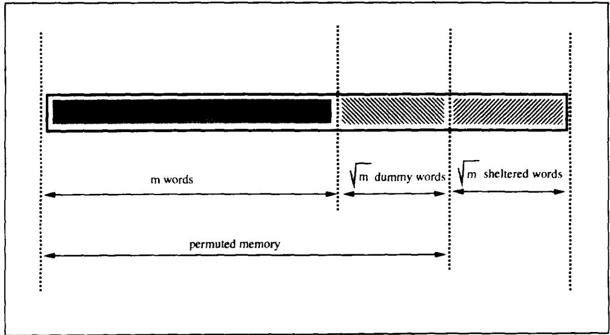
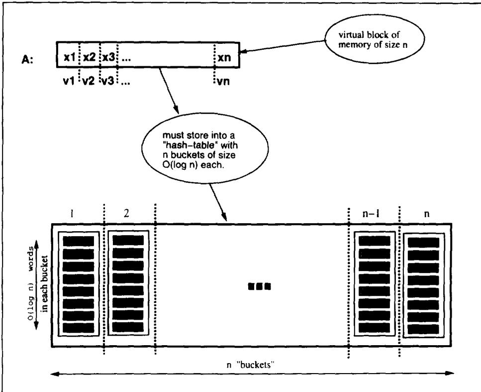
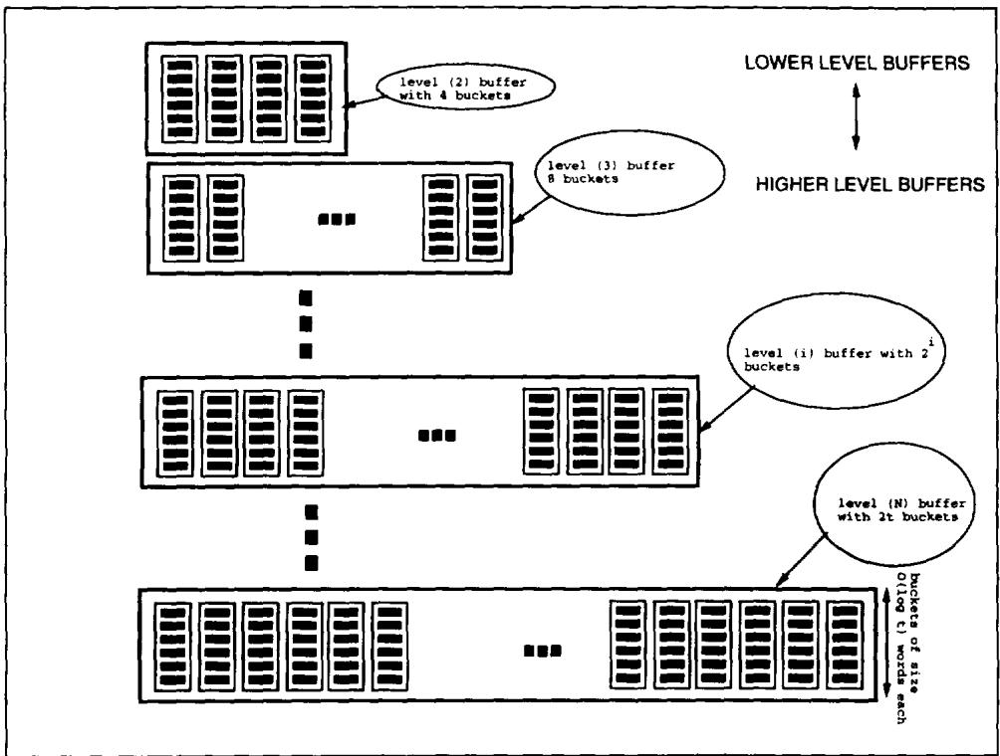

# Software Protection and Simulation on Oblivious RAMs

ODED GOLDREICH

Weizmann Institute of Science, Rehovot, Israel

AND

RAFAIL OSTROVSKY

Bell Communications Research, Morristown, New Jersey

Software protection is one of the most important issues concerning computer practice. There exist many heuristics and ad-hoc methods for protection, but the problem as a whole has not received the theoretical treatment it deserves. In this paper, we provide theoretical treatment of software protection. We reduce the problem of software protection to the problem of efficient simulation on oblivious RAM.

A machine is oblivious if the sequence in which it accesses memory locations is equivalent for any two inputs with the same running time. For example, an oblivious Turing Machine is one for which the movement of the heads on the tapes is identical for each computation. (Thus, the movement is independent of the actual input.) What is the slowdown in the running time of a machine, if it is required to be oblivious? In 1979, Pippenger and Fischer showed how a two-tape oblivious Turing Machine can simulate, on-line, a one-tape Turing Machine, with a logarithmic slowdown in the running time. We show an analogous result for the random-access machine (RAM) model of computation. In particular, we show how to do an on-line simulation of an arbitrary RAM by a probabilistic oblivious RAM with a polylogarithmic slowdown in the running time. On the other hand, we show that a logarithmic slowdown is a lower bound.

Categories and Subject Descriptors: C.2.0 [Computer-Communication Networks]: General—security and protection; E.3 [Data Encryption]; F.1.1 [Computation by Abstract Devices]: Models of Computation—bounded-action devices

General Terms: Security, Theory

Additional Key Words and Phrases: Pseudorandom functions, simulation of random access machines, software protection

## 1. Introduction

In this paper, we present a theoretical treatment of software protection. In particular, we distill and formulate the key problem of learning about a program from its execution, and reduce this problem to the problem of on-line simulation of an arbitrary program on an oblivious RAM. We then present our main result: an efficient simulation of an arbitrary (RAM) program on a probabilistic oblivious RAM. Assuming that one-way functions exist, we show how one can make our software protection scheme robust against a polynomial-time adversary who is allowed to alter memory contents during execution in a dynamic fashion. We begin by discussing software protection.

1.1. Software Protection. Software is very expensive to create and very easy to steal. "Software piracy" is a major concern (and a major loss of revenue) to all software-related companies. Software pirates borrow/rent the software they need, copy it to their computer and use it without paying anything for it. Thus, the question of software protection is one of the most important issues concerning computer practice. The problem is to sell programs that can be executed by the buyer, yet cannot be redistributed by the buyer to other users. Much engineering effort is put into trying to provide software protection, but this effort seems to lack theoretical foundations. In particular, there is no crisp definition of what the problems are and what should be considered as a satisfactory solution. In this paper, we provide a theoretic treatment of software protection, by distilling a key problem and solving it efficiently.

Before going any further, we distinguish between two “folklore” notions: the problem of protection against illegitimate duplication and the problem of protection against redistribution (or fingerprinting software). Loosely speaking, the first problem consists of ensuring that there is no efficient method for creating executable copies of the software; while the second problem consists of ensuring that only the software producer can prove in court that he has designed the program. In this paper, we concentrate on the first problem.

1.1.1. THE ROLE OF HARDWARE. Let us examine various options that any computer-related company has when considering how to protect its software. We claim that a purely software-based solution is impossible. This is so, as any software (no matter how encrypted) is just a binary sequence which a pirate can copy (bit by bit) and run on his own machine. Hence, to protect against duplication, some hardware measures must be used: mere software (which is not physically protected) can always be duplicated. Carried to an extreme, the trivial solution is to rely solely on hardware. That is, to sell physically protected special-purpose computers for each task. This “solution” has to be rejected as infeasible (in current technology) and contradictory to the paradigm of general purpose machines. We conclude that a real solution to protecting software from duplication should combine feasible software and hardware measures. Of course, the more hardware we must physically protect, the more expensive our solution is. Hence, we must also consider what is the minimal amount of physically protected hardware that we really need.

It has been suggested [Best 1979; Kent 1980] that to protect software against duplication a Software-Hardware-package (SH-package) consisting of a physically shielded Central Processing Unit (CPU) and an encrypted program could be sold.

The CPU will contain a small ROM (Read-Only Memory unit) that stores the corresponding decryption key. The SH-package will be installed in a conventional computer system by connecting the shielded CPU to the address and data buses of the system and loading the encrypted program into the memory devices. Once installed and activated, the (shielded) CPU will run the (encrypted) program using the memory, I/O devices and other components of the computer. An instruction cycle of the (shielded) CPU will consist of fetching the next instruction, decrypting the instruction (using the decryption key stored in the CPU), and executing the instruction. In case the execution consists of reading from (respectively, writing to) a memory location—the contents may be decrypted after reading it (respectively, encrypted before writing). It should be stressed that the CPU itself will contain only a small amount of storage space. In particular, the CPU contains a constant number of registers, each capable of specifying memory addresses (i.e., the size of each register is at least equal to the logarithm of the number of storage cells), and a special register with a cryptographic key. Only the CPU (with a fixed number of registers) is required to be physically shielded, while all the other components of the computer, including the memory in which the encrypted program and data are stored, need not be shielded. We note that the technology to physically shield (at least to some degree) the CPU (which, in practice, is a single computer chip) does already exist—indeed, every ATM bank machine has such a protected chip. Thus, the SH-package employs feasible software and hardware measures [Best 1979; Kent 1980].

Using encryption to keep the contents of the memory secret is certainly a step in the right direction. However, as we will shortly see, this does not provide the protection one may want. In particular, the addresses of the memory cells accessed during the execution are not kept secret. This may reveal to an observer essential properties of the program (e.g., its loop structure), and in some cases may even allow him to easily reconstruct it. Thus, we view the above setting (i.e., the SH-package) as the starting point for the study of software protection, rather than as a satisfactory solution. In fact, we will use this setting as the framework for our investigations, which are concerned with the following key question: What can the user learn about the SH-package he bought?

1.1.2. LEARNING BY EXECUTING THE SH-PACKAGE. Our setting consists of an encrypted program, a shielded CPU (containing a constant number of registers), a memory module, and an “adversary” user trying to learn about the program. The CPU and memory communicate through a channel in the traditional manner. That is, in response to a $FETCH(i)$ message the memory answers with the contents of the ith cell; while in response to a $STORE(v, j)$ the memory stores value v in cell j. We consider an adversary that can read and alter the communication between CPU and memory, as well as inspect and modify the contents of the memory. However, the adversary cannot inspect or modify the contents of the CPU’s registers.

The adversary tries to learn by conducting experiments with the hardware-software configuration. An experiment consists of initiating an execution of the (shielded) CPU on the encrypted program and a selected (by the adversary) input, and watching (and possibly modifying) both the memory contents and the communication between CPU and memory.

Given the above setting the question is what information should the adversary be prevented from learning, when conducting such experiments? To motivate the answer to this question, let us consider the following hypothetical scenario. Suppose you are a software producer selling a protected program that took you an enormous effort to write. Your competitor purchases your program, experiments with it widely and learns some partial information about your implementation. Intuitively, if the information he gains, through experimentation with your protected program, simplifies his task of writing a competing software package then the protection scheme has to be considered insecure. Thus, informally, software protection should mean that the task of reconstructing functionally equivalent copies of the SH-package is not easier when given the SH-package than when only given the specification for the package. That is, software protection is secure if, whatever any polynomial-time adversary can do when having access to an (encrypted) program running on a shielded CPU, he can also do when having access to a “specification oracle” (such an oracle, on any input, answers with the “corresponding” output and running-time). Essentially, the protected program must behave like a black box which, on any input, “hums” for a while and returns an output such that no information except its I/O behavior and running time can be extracted. Jumping ahead, we note that in order to meet such security standards, not only the values stored in the general-purpose memory must be hidden (e.g., by using encryption), but also the sequence in which memory locations are accessed during program execution. In fact, if the “memory access pattern” is not hidden then program characteristics such as its “loop structure” may be revealed to the adversary, and such information may be very useful in some cases for simplifying the task of writing a competing program. To prevent this, the memory access pattern should be independent of the program that is being executed.

Informally, we say that a CPU defeats experiments with corresponding encrypted programs if no probabilistic polynomial-time adversary can distinguish $^{1}$ the following two cases when given an encrypted program as input:

—The adversary is experimenting with the genuine shielded CPU, which is trying to execute the encrypted program through the memory.

—The adversary is experimenting with a fake CPU. The interactions of the fake CPU with the memory are almost identical to those that the genuine CPU would have had with the memory when executing a (fixed) dummy program (e.g., while true do skip.) The execution of the dummy program is timed-out by the number of steps of the real program. When timed-out, the fake CPU (magically) writes to the memory the same output that the genuine CPU would have written on the “real” program (and the same input).

We stress that, in the general case, the adversary may modify the communication between CPU and memory (as well as modify the contents of memory cells) in any way he wants. When we wish to stress that the SH-package defeats experiments by such adversaries, we say that the SH-package defeats tampering experiments. A special case of interest consists of adversaries restricted to only inspect the message exchange between CPU and memory, but not to modify it. A

SH-package defeating experiments by such adversaries is said to defeat non-tampering experiments.

1.1.3. AN EFFICIENT CPU THAT DEFEATS EXPERIMENTS. The problem of constructing a CPU that defeats experiments is not an easy one. There are two issues: The first issue is to hide from the adversary the values stored and retrieved from memory, and to prevent the adversary's attempts to change these values. This is done by use of traditional cryptographic techniques (e.g., probabilistic encryption [Goldwasser and Micali 1984] and message authentication [Goldreich et al. 1986]). The second issue is to hide (from the adversary) the sequence of addresses accessed during the execution (hereafter referred to as hiding the access pattern).

Hiding the (original) memory access pattern is a completely new problem and traditional cryptographic techniques are not applicable to it. The goal is to make it infeasible for the adversary to learn anything useful about the program from its access pattern. To this end, the CPU will not execute the program in the ordinary manner, but instead will replace each original fetch/store cycle by many fetch/store cycles. This will hopefully “confuse” the adversary and prevent him from “learning” the original sequence of memory-accesses (from the actual sequence of memory accesses). Consequently, the adversary can not improve his ability of reconstructing the program.

Nothing comes without a price. What is the price one has to pay for protecting the software? The answer is “speed”. The protected program will run slower than the unprotected one. What is the minimal slowdown we can achieve without sacrificing the security of the protection? Informally, software protection overhead is defined as the number of steps the protected program makes per each step of the source-code program. In this paper, we show that this overhead is polynomially related to the security parameter of a one-way function. Namely,

THEOREM 1.1.3.1 (INFORMAL STATEMENT): Suppose that one-way functions exist, and let k be a security parameter. Then, there exists an efficient way of transforming programs into pairs consisting of a physically protected CPU, with k bits of internal-(“shielded”)-memory, and a corresponding “encrypted” program, so that the CPU defeats poly(k)-time experiments with the “encrypted” program. Furthermore, t instructions of the original program are executed using less than $t \cdot k^{O(1)}$ instructions (of the “encrypted” program), and the blowup in the size of the external memory is also bounded by a factor of k. (We stress that this scheme defeats tampering experiments.)

The above result is proved by reducing the problem of constructing a CPU that defeats (tampering) experiments to the problem of hiding the access pattern, and solving the later problem efficiently. As a matter of fact, we formulate the latter problem as an on-line simulation of arbitrary RAMs by an oblivious RAM (see below).

1.2. SIMULATIONS BY OBLIVIOUS RAMS. A machine is oblivious if the sequence in which it accesses memory locations is equivalent for any two inputs with the same running time. For example, an oblivious Turing Machine is one for which the movement of the heads on the tapes is identical for each computation (i.e., is independent of the actual input). We are interested in transformations of arbitrary machines into equivalent oblivious machines (i.e., oblivious machines computing the same function). For every reasonable model of computation such a transformation does exist. The question is its cost: namely, the slowdown in the running time of the oblivious machine (when compared to the original machine). Pippenger and Fischer [1979] showed how a one-tape Turing Machine can be simulated, on-line, by a two-tape oblivious Turing Machine, with a logarithmic slowdown in the running time. We study an analogue question for random-access machine (RAM) model of computation.

To see that it is possible to completely hide the access pattern consider the following solution: when a variable needs to be accessed, we read and rewrite the contents of every memory cell (in some fixed order). If the program terminates after t steps, and the size of memory is m, the above solution runs for $t \cdot m$ steps, thus, having a factor m overhead. $^{2}$ Can the same level of “security” be achieved at a more moderate cost?

The answer is no if the scheme is deterministic. That is, the simulation is optimal if the CPU is not allowed random moves (or if obliviousness is interpreted in a deterministic manner). Fortunately, much more efficient simulation exists when allowing CPU to be probabilistic. $^{3}$ Thus, in defining an oblivious RAM, we interpret obliviousness in a probabilistic manner. Namely, we require that the probability distribution of certain actions (defined over the RAM's input and coin tosses) is independent of the input. Specifically, we define an oblivious RAM to be a probabilistic RAM for which the probability distribution of the sequence of (memory) addresses accessed during an execution depends only on the input length (i.e., is independent of the particular input.) In other words, suppose the inputs are chosen with some arbitrary fixed distribution D. Then, for any D, the conditional probability for a particular input given a sequence of memory accesses which occurs during an execution on that input, equals the a-priori probability for that particular input according to D.

The solution of Pippenger and Fischer [1979] for making a single-tape Turing Machine oblivious, heavily relies on the fact that the movement of the (single-tape Turing Machine) head is very “local” (i.e., immediately after accessing location i, a single-tape Turing-Machine is only able to access either location i - 1 or $i + 1$ ). On the other hand, the main strength of a random-access machine (RAM) model is its ability to instantaneously access arbitrary locations of its memory. Nevertheless, we show an analogue result for the random-access machine model of computation:

THEOREM 1.2.1 (MAIN RESULT—INFORMAL STATEMENT). Let $RAM(m)$ denote a RAM with $m$ memory locations and access to a random oracle. Then $t$ steps of an arbitrary $RAM(m)$ program can be simulated (on-line) by less than $O(t \cdot (\log_2 t)^3)$ steps of an oblivious $RAM(m \cdot (\log_2 m)^2)$ .

That is, we show how to do an on-line simulation of an arbitrary RAM program by an Oblivious RAM incurring only a polylogarithmic slowdown. We stress that the slowdown is a (polylogarithmic) function of the program's running time, rather than being a (polylogarithmic) function of the memory size (which is typically much bigger than the program's running time).

On the negative side, a simple combinatorial argument shows that any oblivious simulation of arbitrary RAMs should have an average $\Omega(\log t)$ overhead:

THEOREM 1.2.2 (INFORMAL STATEMENT). Let $RAM(m)$ be as in Theorem 1.2.1. Every oblivious simulation of $RAM(m)$ must make at least $\max\{m, (t - 1) \cdot \log m\}$ accesses in order to simulate $t$ steps.

So far, we have discussed the issue of oblivious computation in a setting in which the observer is passive. A more challenging setting, motivated by some applications (e.g., software protection as treated in this paper), is one in which the observer (or adversary) is actively trying to get information by tampering with (i.e., modifying) the memory locations during computation. Clearly, such an active adversary can drastically alter the computation (e.g., by erasing the entire contents of the memory). Yet, the question is whether even in such a case we can guarantee that the effect of the adversary is oblivious of the input. Informally, we say that the simulation of a RAM on an oblivious RAM is tamper-proof if the simulation remains oblivious (i.e., does not reveal anything about the input except its length) even in the case when an arbitrary powerful adversary examines and alters memory contents.

THEOREM 1.2.3 (INFORMAL STATEMENT). Let $RAM(m)$ be as in Theorem 1.2.1. Then $t$ steps of an arbitrary $RAM(m)$ program can be tamper-proof simulated (on-line) by less than $O(t \cdot (\log_2 t)^3)$ steps of an oblivious $RAM(m \cdot (\log_2 m)^2)$ .

We stress that there are no complexity-theoretic assumptions in Theorems 1.2.1 and 1.2.3. However, these theorems refer to a RAM with access to a random oracle. To derive results for the more realistic model of a probabilistic RAM, we replace the random oracle used in the above theorems, by a pseudorandom function. The latter can be implemented, assuming the existence of one-way functions, $^{4}$ by using a short randomly chosen seed and the results remain valid with respect to adversaries running in time polynomial in the length of this seed.

Our construction yields a technique of efficiently hiding the access pattern into any data-structure. In addition to software protection, our technique can be applied to the problem of hiding the traffic pattern of a distributed database and to the problem of data-structure checking.

1.3. NOTES CONCERNING THE EXPOSITION. For simplicity of exposition, we present all the definitions and results in the rest of the paper in terms of machines having access to a random oracle. In practice, such machines can be implemented using pseudorandom functions, and the results will remain valid provided that the corresponding adversary is restricted to efficient computations. Detailed comments concerning such implementations will be given in the corresponding sections. Here, we merely recall that pseudorandom functions can be constructed using pseudorandom generators (cf. Goldreich et al. [1986]), and that the later can be constructed provided that one-way functions exist. $^{5}$ Specifically, assuming the existence of one-way functions, one can construct a collection of pseudorandom functions with the following properties:

—For every n, the collection contains $2^{n}$ functions, each mapping n-bit strings to n-bit strings, and furthermore each function is represented by a unique n-bit long string.

—There exists a polynomial-time and linear-space algorithm that on input a representation of a function $f$ and an admissible argument $x$ , returns $f(x)$ .

—No probabilistic polynomial-time machine can, on input $1^{n}$ and access to a function $f : \{0, 1\}^{n} \mapsto \{0, 1\}^{n}$ , distinguish the following two cases:

(1) The function $f$ is uniformly chosen in the pseudo-random collection (i.e., among the $2^n$ functions mapping $n$ -bit strings to $n$ -bit strings).

(2) The function $f$ is uniformly chosen among all $(2^{n2^n})$ functions mapping $n$ -bit strings to $n$ -bit strings.

Another simplifying convention, used in this paper, is the association of the size of the physically protected work space (internal to the CPU) with the structure of the main memory. Specifically, we commonly consider a CPU with $O(k)$ bits of physically protected work space together with a main memory consisting of $2^{k}$ words, each holding $O(k)$ bits. In practice, the gap, between the size of protected work space and the number of (unprotected) memory words, may be smaller (especially since the protected space is used to store “cryptographic keys”). Specifically, we may consider a protected work space of size n and a physically unprotected memory consisting of $2^{k}$ words, provided $n \geq k$ (which guarantees that the CPU can hold pointers into the memory). It is easy to extend our treatment to this setting. In particular, all the transformations presented in the sequel do not depend on the size of the CPU (but rather on the size of the memory and on the running time).

## 2. Model and Definitions

In this chapter, we define the notions discussed in the introduction. To this end, we first present a definition that regards the RAM model as a pair of (appropriately resource bounded) interactive machines. This definition is presented in Subsection 2.1. Using the new way of looking at the RAM model, we define the two notions that are central to this paper: the notion of software protection (see Subsection 2.2), and simulation by an oblivious RAM (see Subsection 2.3). Subsections 2.2 and 2.3 can be read independently of each other.

## 2.1. RAMS AS INTERACTIVE MACHINES

2.1.1. The Basic Model. Our concept of a RAM is the standard one (e.g., as presented in Aho et al. [1974]). However, we decouple the RAM into two interactive machines, the CPU and the memory module, and explicitly discuss the interaction between the two. We begin with a definition of an Interactive Turing-Machine (ITM). The basic formulation is due to Manuel Blum (private communication in Goldwasser et al. [1985]). We augment this basic formulation by adding explicit bounds on the length of “messages” and on the size of work tape.

Definition 2.1.1.1 (Interactive Machines with Bounded Messages and Bounded Work Space). An Interactive Turing Machine is a multi-tape Turing Machine having the following tapes:

—a read-only input tape;

—a write-only output tape;

—a read-and-write work tape;

—a read-only communication tape; and

—a write-only communication tape.

By $ITM(c, w)$ we denote a machine as specified above with a work tape of length $w$ , and communication tapes each partitioned into c-bit long blocks, which operates as follows: The execution of $ITM(c, w)$ on input $y$ starts with the ITM copying $y$ into the first $|y|$ cells of its work tape. (In case $|y| > w$ , execution is suspended immediately.) Afterwards, the machine works in rounds. At the beginning of each round, the machine reads the next c-bit block from its read-only communication tape. The block is called the message received in the current round. After some internal computation (utilizing its work tape), the round is completed with the machine writing $c$ bits (called the message sent in the current round) onto its write-only communication tape. The execution of the machine may terminate at some point with the machine copying a prefix of its work tape to its output tape.

Now, we can define both the CPU and the memory as Interactive Turing Machines which “interact” with each other. To this end, we define both the CPU and the MEMORY as ITMS, and associate the read-only communication tape of the CPU with the write-only communication tape of the MEMORY, and vice versa (cf. Goldwasser et al. [1985]). In addition, both CPU and MEMORY will have the same message length (i.e., the parameter c above), however they will have drastically different work-tape size and different finite control. The MEMORY will have a work-tape of size exponential in the message length, whereas the CPU will have a work-tape of size linear in the message length. Intuitively, the MEMORY’s work-tape corresponds to a “memory” module in the ordinary sense; whereas the work-tape of the CPU corresponds to a constant number of “registers”, each capable of holding a pointer into the MEMORY’s work-tape. Each message may contain an “address” in the MEMORY’s work-tape and/or the contents of a CPU “register”. The finite control of the MEMORY is unique, representing the traditional responses to the CPU “requests”, whereas the finite control of the CPU varies from one CPU to another. Intuitively, different CPUs correspond to different universal machines. Finally, we use k as a parameter determining both the message length and work-tape size of both MEMORY and CPU. Specifically, the message length is $k + 2 + k'$ and the size of the work-tape is $2^{k} \cdot k'$ , where $k' = O(k)$ . (This allows a message to contain both an address in memory and a contents for this address.)

Definition 2.1.1.2 (Memory). For every $k \in \mathcal{N}$ , let $MEM_k$ be an $ITM(k + 2 + O(k), 2^k \cdot O(k))$ operating as hereby specified. It partitions its work tape into $2^k$ words, each of size $O(k)$ . After copying its input to its work tape, machine $MEM_k$ is message-driven. Upon receiving a message $(i, a, v)$ , where $i \in \{0, 1\}^2 \equiv \{"store", "fetch", "halt"\}$ (an instruction), $a \in \{0, 1\}^k$ (an address) and $v \in \{0, 1\}^{O(k)}$ (a value), machine $MEM_k$ acts as follows:

—if $i =$ "store", then machine $MEM_k$ copies the value $v$ from the current message into word number $a$ of its work tape. (For sake of uniformity, we postulate that $MEM_k$ sends an acknowledgment message in return.)

—if $i =$ "fetch", then machine $MEM_{k}$ sends a message consisting of the current contents of word number $a$ (of its work tape).

—if $i =$ "halt", then machine $MEM_{k}$ copies a prefix of its work tape (until a special symbol) to its output tape, and halts.

The $2^{k}$ words of MEMORY correspond to a “virtual memory” consisting of all possible $2^{k}$ addresses that can be specified by a k-bit long “register”. We remark that the “actual memory” available in hardware may be much smaller (say, have size polynomial in k). Clearly, “actual memory” of size S suffice in applications which do not require the concurrent storage of more than S items.

Definition 2.1.1.3 (CPU). For every $k \in \mathcal{N}$ , let $CPU_k$ be an $ITM(k + 2 + O(k), O(k))$ operating as hereby specified. After copying its input to its work tape, machine $CPU_k$ conducts a poly(k)-time computation on its work tape, and sends a message determined by this computation. In subsequent rounds, $CPU_k$ is message driven. Upon receiving a new message, machine $CPU_k$ copies the message to its work tape, and based on its computation on the work tape, sends a message. In case the $CPU_k$ sends a “halt” message, the $CPU_k$ halts immediately (with no output). The number of steps in each computation on the work tape is bounded by a fixed polynomial in $k$ .

The only role of the input to CPU is to trigger its execution with CPU registers initialized, and this input may be ignored in the subsequent treatment. $^{6}$ The (“internal”) computation of the CPU, in each round, corresponds to elementary register operations. Hence, the number of steps taken in each such computation is a fixed polynomial in the register length (which in turn is $O(k)$ ). We can now define the RAM model of computation. We define RAM as a family of $RAM_{k}$ machines for every k:

Definition 2.1.1.4 (RAM). For every $k \in \mathcal{N}$ , let $RAM_k$ be a pair of $(CPU_k, MEM_k)$ , where $CPU_k$ 's read-only message tape coincides with $MEM_k$ 's write-only message tape, and $CPU_k$ 's write-only message tape coincides with $MEM_k$ 's read-only message tape. The input to $RAM_{k}$ is a pair $(s, y)$ , where s is an (initialization) input for $CPU_{k}$ , and y is input to $MEM_{k}$ . (Without loss of generality, s may be a fixed “start symbol”.) The output of $RAM_{k}$ on input $(s, y)$ , denoted $RAM_{k}(s, y)$ , is defined as the output of $MEM_{k}(y)$ when interacting with $CPU_{k}(s)$ .

To view RAM as a universal machine, we separate the input, y, to $MEM_{k}$ into “program” and “data”. That is, the input y to the memory is partitioned (by a special symbol) into two parts, called the program (denoted by $\Pi$ ) and the data (denoted x).

Definition 2.1.1.5 (Running Programs on RAM). Let $RAM_{k}$ and $s$ be fixed, and $y = (\Pi, x)$ . We define the output of program $\Pi$ on data $x$ , denoted $\Pi(x)$ , as $RAM_{k}(s, y)$ . We define the running time of $\Pi$ on $x$ , denoted $t_{\Pi}(x)$ , as the sum of $|y| + |\Pi(x)|$ and the number of rounds in the computation $RAM_{k}(s, y)$ . We define the storage-requirement of program $\Pi$ on data $x$ , denote $s_{\Pi}(x)$ , as the sum of $|y|$ and the number of different addresses appearing in messages sent by $CPU_{k}$ to $MEM_{k}$ during the computation $RAM_{k}(s, y)$ .

It is easy to see that the above formalization directly corresponds to Random-Access Machine model of computation. Hence, the “execution of II on x” corresponds to the message exchange rounds in the computation of $RAM_{k}(\cdot, (\Pi, x))$ . The additive term $|y| + |\Pi(x)|$ in $t_{II}(x)$ accounts for the time spent in reading the input and writing the output, whereas each message exchange round represents a single cycle in the traditional RAM model. The term $|y|$ in $s_{II}(x)$ accounts for the initial space taken by the input, whereas the other term accounts for “memory cells accessed by CPU during the actual computation”.

Remark 2.1.1.6. Without loss of generality, we can assume that the running time, $t(y)$ , is always greater than the length of the input (i.e., $|y|$ ). Under this assumption, we may ignore the "loading time" (represented by $|y| + |\Pi(x)|$ ), and count only the number of machine cycles in the execution of II on $x$ (i.e., the number of rounds of message exchange between $CPU_k$ and $MEM_k$ ).

Remark 2.1.1.7. The memory consumption of $\Pi$ at a particular point during the execution on data $x$ , is defined in the natural manner. Initially the memory consumption equals $|( \Pi, x)|$ , and the memory consumption may grow as computation progresses. However, after executing $t$ machine cycles, the memory consumption is bounded by $t + |(\Pi, x)|$ .

## 2.1.2. Augmentations to the Basic Model

2.1.2.1. PROBABILISTIC RAMS. Probabilistic computations play a central role in this work. In particular, our results are stated for RAMS which are probabilistic in a very strong sense. Namely, the CPU in these machines has access to a random oracle. We stress that providing RAM with access to a random oracle is more powerful than providing it with ability to toss coins. Intuitively, access to a random oracle allows the CPU to "record" the outcome of its coin tosses "for free"! However, as stated in the introduction, assuming the existence of one-way functions, random oracles (functions) can be efficiently implemented by pseudorandom functions (and these can be constructed at the cost of tossing and storing in CPU registers only a small number of coins). $^{7}$

Definition 2.1.2.1.1 (Oracle/Probabilistic CPU). For every $k \in \mathcal{N}$ , we define an oracle- $CPU_k$ as a $CPU_k$ with two additional tapes, called the oracle tapes. One of these tapes is read-only, whereas the other is write-only. Each time the machine enters a special oracle invocation state, the contents of the read-only oracle tape is changed instantaneously (i.e., in a single step), and the machine passes to another special state. The string written on the write-only oracle tape between two oracle invocations is called the query corresponding to the latter invocation. We say that this $CPU_k$ has access to the function $f$ if when invoked with query $q$ , the oracle replies by changing the contents of the read-only oracle tape to $f(q)$ . A probabilistic- $CPU_k$ is an oracle $CPU_k$ with access to a uniformly selected function $f: \{0, 1\}^{O(k)} \mapsto \{0, 1\}$ .

Definition 2.1.2.1.2 (Oracle/Probabilistic RAM). For every $k \in \mathcal{N}$ , we define an oracle-RAM $_k$ as a RAM $_k$ in which CPU $_k$ is replaced by an oracle-CPU $_k$ . We say that this RAM $_k$ has access to the function $f$ if its CPU $_k$ has access to the function $f$ and we write RAM $_k^f$ . A probabilistic-RAM $_k$ is a RAM $_k$ in which CPU $_k$ is replaced by a probabilistic-CPU $_k$ . (In other words, a probabilistic-RAM $_k$ is an oracle-RAM $_k$ with access to a uniformly selected function.)

Remark 2.1.2.1.3. In the sequel, we take the liberty of utilizing random functions mapping strings of various lengths (bounded by $O(k)$ ) into strings of possibly different lengths. Clearly, all these functions can be simultaneously implemented by a single uniformly selected function $f: \{0, 1\}^{O(k)} \mapsto \{0, 1\}$ .

2.1.2.2. REPEATED EXECUTIONS OF RAMs. For our treatment of software protection, we use repeated execution of the "same" RAM on several inputs. Our intention is that the RAM starts its next execution with the work tapes of both CPU and MEMORY having contents identical to their contents at termination of the previous execution. This is indeed what happens in practice, yet the standard abstract formulation usually ignores this point, which requires cumbersome treatment.

Definition 2.1.2.2.1 (Repeated Executions of RAM). For every $k \in \mathcal{N}$ , by repeated executions of $RAM_k$ , on the inputs sequence $y_1, y_2, \ldots$ , we mean a sequence of computations of $RAM_k$ so that the first computation starts with input $y_1$ when the work tapes of both $CPU_k$ and $MEM_k$ are empty, and the $i$ th computation starts with input $y_i$ when the work tape of each machine (i.e., $CPU_k$ and $MEM_k$ ) contains the same string it has contained at the termination of the $i - 1$ st computation.

2.2. DEFINITION OF SOFTWARE PROTECTION. In this section, we define software protection. Loosely speaking, a scheme for software protection is a transformation of RAM programs into functionally equivalent programs for a corresponding RAM so that the resulting program-RAM pair "foils adversarial attempts to learn something substantial about the original program (beyond its specifications)". Our formulation of software protection should answer the following questions:

(1) What can the adversary do (in the course of its attempts to learn)?

(2) What is substantial knowledge about a program?

(3) What is a specification of a program?

Our approach in answering the above questions is the most pessimistic (and hence conservative) one: among all possible malicious behavior, we consider the most difficult, and most malicious, worst-case scenario. That is, we assume that the adversary can run the transformed program on the RAM on arbitrary data of its choice, and can modify the messages between the CPU and MEMORY in an arbitrary and adaptive manner. $^{8}$ Moreover, since we consider the worst-case scenario, we interpret the release of any information about the original program, which is not implied by its input/output relation and time/space complexity as substantial learning. The input/output relation and time/space complexity of the program are not considered secret (as the software is purchased based on an announcement of this information).

2.2.1. Experimenting with a RAM. We consider two types of adversaries. Both can repeatedly initiate the RAM on inputs of their choice. The difference between the two types of adversaries is in their ability to modify the CPU-MEMORY communication tapes during these computation (which correspond to interactions of CPU with MEMORY). A tampering adversary is allowed both to read and write to these tapes (i.e., inspect and alter the messages sent in an adaptive fashion), whereas a nontampering adversary is only allowed to read these tapes (i.e., inspect the messages).

Remark. In both cases it is not necessary to allow the adversary to have the same access rights to the MEMORY's work tape, since the contents of this tape are totally determined by the initial input and the messages sent by the CPU.

We stress that in both cases the adversary has no access to the internal tapes of the CPU (i.e., the work tape and the oracle tape of the CPU). Furthermore, the adversary has no oracle access to the CPU's oracle.

For the sake of simplicity, we concentrate on adversaries with exponentially bounded running-time. Specifically, the running-time of the adversary is bounded above by $2^{n}$ , where n is the size of the CPU's work tape. We note that the time bound on the adversary is used only in order to bound the number of steps taken by the RAM with which the adversary experiments. In practice, the adversary will be even more restricted (specifically to working in time polynomial in the length of the CPU's work tape).

Definition 2.2.1.1 (Nontampering Adversary). A nontampering adversary, denoted ADV, is a probabilistic machine that, on input k (a parameter) and $\alpha$ (an “encrypted program”), is given the following access to an oracle- $RAM_{k}$ . Machine ADV can initiate repeated executions of $RAM_{k}$ on inputs of its choice, as long as its total running time is bounded by $2^{k}$ . During each of these executions, machine ADV has read-only access to the communication tapes between $CPU_{k}$ and $MEM_{k}$ .

Definition 2.2.1.2 (Tampering Adversary). A tampering adversary, is defined analogously to a non-tampering adversary except that during the repeated executions it has read and write access to the communication tapes between $CPU_{k}$ and $MEM_{k}$ .

2.2.2. Software Protecting Transformations. We define transformations on programs (i.e., compilers) which given a program, $\Pi$ , produce a pair $(f, \Pi_{f})$ so that f is a randomly chosen function and $\Pi_{f}$ is an “encrypted program” which corresponds to $\Pi$ and f. Here, we have in mind an oracle-RAM that on input $(\Pi_{f}, x)$ and access to oracle f, simulates the execution of $\Pi$ on data x, so that this simulation “protects” the original program $\Pi$ . At this point, the reader may be annoyed by the fact that the transformation produces a random function f that may have an unbounded (or “huge”) description. However, in practice, the function f will be pseudo-random [Goldreich et al. 1986], and will have a succinct description as discussed in the introduction.

We start by defining compilers as transformations of programs into (program, oracle)-pairs, which when executed by an oracle-RAM are functionally equivalent to executions of the original programs.

Definition 2.2.2.1 (Compiler). A compiler, denoted C, is a probabilistic mapping that on input an integer parameter k and a program $\Pi$ for $RAM_{k}$ , returns a pair $(f, \Pi_{f})$ , so that

$-f: \{0, 1\}^{O(k)} \mapsto \{0, 1\}$ is a randomly selected function;

$$
- | \Pi_ {f} | = O (| \Pi |).
$$

—For $k' = k + O(\log k)$ , there exists an oracle- $RAM_{k'}$ so that, for every $\Pi$ , every $f$ and every $x \in \{0, 1\}^*$ , initiating $RAM_{k'}$ on input $(\Pi_f, x)$ and access to the oracle $f$ yields output $\Pi(x)$ .

The oracle- $RAM_{k'}$ differs from $RAM_{k}$ in several aspects. Most noticeably, $RAM_{k'}$ has access to an oracle whereas $RAM_{k}$ does not. It is also clear that $RAM_{k'}$ has a larger memory: $RAM_{k'}$ 's memory consists of $2^{k'} = \text{poly}(k) \cdot 2^k$ words, whereas $RAM_{k'}$ 's memory consists of $2^k$ words. In addition, the length of the memory words in the two RAMs may differ (and in fact will differ in the transformations we present), and so may the internal computations of the CPU conducted in each round. Still, both RAMs have memory words of length linear in the parameter (i.e., $k'$ and $k$ , respectively), and conduct internal CPU computations that are polynomial in this parameter.

Compilers as defined above transform deterministic programs into “encrypted programs” which run on a probabilistic-RAM (i.e., into “probabilistic programs”). It is worthwhile to note that we can extend the above definition so that compilers can be applied also to programs that make calls to oracles, and in particular to programs that make calls to random oracles. The results in this paper will remain valid for such probabilistic programs as well. However, for simplicity of exposition, we restrict ourselves to compilers that are applied to deterministic programs.

We now turn to defining software-protecting compilers. Intuitively, a compiler protects software if whatever can be computed after experimenting with the "encrypted program" can be computed, in about the same time, by a machine which merely has access to a specification of the original program. We first define what is meant by access to a specification of a program.

Definition 2.2.2.2 (Specification of Programs). A specification oracle for a program $\Pi$ is an oracle that on query $x$ returns the triple $(\Pi(x), t_{11}(x), s_{11}(x))$ .

Recall that $t_{\mathrm{II}}(x)$ and $s_{\mathrm{II}}(x)$ denote the running-time and space requirements of program II on data x. We are now ready for the main definition concerning software protection. In this definition ADV may be either a tampering or a non-tampering adversary.

Definition 2.2.2.3 (Software-Protecting against a Specific Adversary). Given a compiler (denoted C) and an adversary (denoted ADV), we say that C protects software against the adversary ADV if there exists a probabilistic oracle machine (in the standard sense), M, satisfying the following:

—(M operates in about the same time as ADV): There exists a polynomial $p(\cdot)$ so that, for every string $\alpha$ , the running-time of M on input $(k', |\alpha|)$ (and access to an arbitrary oracle) is bounded by $p(k') \cdot T$ , where T denotes the running time of ADV when experimenting with $RAM_{k'}$ on input $\alpha$ .

—(M with access to a specification oracle produces output almost identical to the output of ADV after experimenting with the result of the compiler): For every program, $\Pi$ , the statistical distance between the following two probability distributions is bounded by $2^{-k'}$ .

(1) The output distribution of ADV when experimenting with $RAM_{k'}^f$ on input $\Pi_f$ , where $(f, \Pi_f) \leftarrow C(\Pi)$ . Recall that $RAM_{k'}^f$ denotes an interactive pair, $(CPU_{k'}, MEM_{k'})$ , where $CPU_{k'}$ has access to oracle $f$ . The distribution is over the probability space consisting of all possible choices of the function $f$ , and all possible outcomes of the coin tosses of ADV, with uniform probability distribution.

(2) The output distribution of the oracle machine M on input $(k', O(|\Pi|))$ and access to a specification oracle for $\Pi$ . The distribution is over the probability space consisting all possible outcomes of the coin tosses of machine M, with uniform probability distribution.

Definition 2.2.2.4 (Software-Protecting Compilers). A compiler, C, provides (weak) software protection if C protects software against any nontampering adversary. The compiler, C, provides tamper-proof software protection if C protects software against any tampering adversary.

Next, we define the cost of software protection. We remind the reader that for the sake of simplicity, we are confining ourselves to programs $\Pi$ with running time, $t_{\Pi}$ , satisfying $t_{\Pi}(x) > |\Pi| + |x|$ , for all x.

Definition 2.2.2.5 (Overhead of Compilers). Let $C$ be a compiler, and $g: \mathcal{N} \mapsto \mathcal{N}$ be a function. We say that the overhead of $C$ is at most $g$ if for every $\Pi$ , every $x \in \{0,1\}^*$ , and randomly selected $f$ , the expected running time of $RAM_{k'}$ , on input $(\Pi_f, x)$ and access to the oracle $f$ , is bounded above by $g(T) \cdot T$ , where $T = t_{\Pi}(x)$ .

Remark. An alternative definition of the overhead of compilers follows: We say that the overhead of C is at most g if for every $\Pi$ , every $x \in \{0, 1\}^{*}$ , and a randomly selected f, the running time of $RAM_{k'}$ , on input $(\Pi_{f}, x)$ and access to the oracle f, is greater than $g(T) \cdot T$ with probability bounded above by $2^{-T}$ , where $T = t_{\Pi}(x)$ . The results presented in this paper hold for this definition as well.

2.3. DEFINITION OF OBLIVIOUS RAM AND OBLIVIOUS SIMULATIONS. The final goal of this section is to define oblivious simulations of RAMS. To this end, we first define oblivious RAMS. Loosely speaking, the “memory access pattern” in an oblivious RAM, on each input, depends only on its running time (on this input). We next define what is meant by a simulation of one RAM on another. Finally, we define oblivious simulation as having a “memory access pattern” that depends only on the running time of the original (i.e., “simulated”) machine.

2.3.1. Oblivious RAMs. We begin by defining the access pattern as the sequence of MEMORY locations that the CPU accesses during computation. This definition applies also to an oracle-CPU. (Recall that by Definitions 2.1.1.2-2.1.1.4, the CPU interaction with MEMORY is a sequence of triples $(i, a, v)$ of "instruction", "address", and "value", respectively.)

Definition 2.3.1.1 (Access Pattern). The access pattern, denoted $\mathcal{A}^k(y)$ , of a (deterministic) $RAM_k$ on input $y$ is a sequence $(a_1, \ldots, a_i, \ldots)$ , such that for every $i$ , the $i$ th message sent by $CPU_k$ , when interacting with $MEM_k(y)$ , is of the form $(\cdot, a_i, \cdot)$ . (Similarly, we can define the access pattern of an oracle- $RAM_k$ on a specific input $y$ and access to a specific function $f$ .)

Considering probabilistic-RAMS, we define a random variable that for every possible function f assigns the access pattern that corresponds to computations in which the RAM has access to this function. Namely,

Definition 2.3.1.2 (Access Pattern of a Probabilistic-RAM). The access pattern, denoted $\tilde{\mathcal{A}}^k(y)$ , of a probabilistic- $RAM_k$ on input $y$ is a random variable that assumes the value of the access pattern of $RAM_k$ on a specific input $y$ and access to a uniformly selected function $f$ .

Now, we are ready to define an oblivious RAM. We define an oblivious RAM to be a probabilistic RAM for which the probability distribution of the sequence of (memory) addresses accessed during an execution depends only on the running time (i.e., is independent of the particular input).

Definition 2.3.1.3 (Oblivious RAM). For every $k \in \mathcal{N}$ , we define an oblivious $RAM_k$ as a probabilistic- $RAM_k$ satisfying the following condition. For every two strings, $y_1$ and $y_2$ , if $|\tilde{\mathcal{A}}^k(y_1)|$ and $|\tilde{\mathcal{A}}^k(y_2)|$ are identically distributed then so are $\tilde{\mathcal{A}}^k(y_1)$ and $\tilde{\mathcal{A}}^k(y_2)$ .

Intuitively, the sequence of memory accesses of an oblivious $RAM_{k}$ reveals no information about the input (to the $RAM_{k}$ ), beyond the running-time for the input.

2.3.2. Oblivious Simulation. Now, that we have defined both RAM and oblivious RAM, it is left only to specify what is meant by an oblivious simulation of an arbitrary RAM program on an oblivious RAM. Our notion of simulation is a minimal one: it only requires that both machines compute the same function. The RAM simulations presented in the sequel are simulations in a much stronger sense: specifically, they are “on-line”. On the other hand, an oblivious simulation of a RAM is not merely a simulation by an oblivious RAM. In addition we require that inputs having identical running time on the original RAM, maintain identical running-time on the oblivious RAM (so that the obliviously condition applies to them in a nonvacuous manner). For the sake of simplicity, we present only definitions for oblivious simulation of deterministic RAMs.

Definition 2.3.2.1 (Oblivious Simulation of RAM). Given probabilistic- $RAM'_{k'}$ , and $RAM_{k}$ , we say that a probabilistic- $RAM'_{k'}$ , obliviously simulates $RAM_{k}$ if the following conditions hold.

—The probabilistic- $RAM'_{k'}$ simulates $RAM_{k}$ with probability 1. In other words, for every input y, and every choice of a (oracle) function f, the output of oracle- $RAM'_{k'}$ , on input y and access to oracle f, equals the output of $RAM_{k}$ on input y.

—The probabilistic- $RAM'_{k'}$ is oblivious. (We stress that we refer here to the access pattern of $RAM'_{k'}$ on a fixed input and randomly chosen oracle function.)

—The random variable representing the running-time of probabilistic- $RAM'_{k'}$ (on input y) is fully specified by the running-time of $RAM_{k}$ (on input y). (Here again we refer to the behavior of $RAM'_{k'}$ on a fixed input and a randomly chosen oracle function.)

Hence, the access pattern in an oblivious simulation (which is a random variable defined over the choice of the random oracle) has a distribution depending only on the running-time of the original machine. Namely, let $\tilde{\mathcal{A}}^{k'}(y)$ denote the access pattern in an oblivious simulation of the computation of $RAM_{k}$ on input y. Then, $\tilde{\mathcal{A}}^{k'}(y_{1})$ and $\tilde{\mathcal{A}}^{k'}(y_{2})$ are identically distributed if the running time of $RAM_{k}$ on these inputs (i.e., $y_{1}$ and $y_{2}$ ) is identical.

We note that in order to define oblivious simulations of oracle-RAMS, we have to supply the simulating RAM with two oracles (i.e., one identical to the oracle of the simulated machine and the other being a random oracle). Of course, these two oracles can be incorporated into one, but in any case the formulation will be slightly more cumbersome.

We now turn to define the overhead of oblivious simulations.

Definition 2.3.2.2 (Overhead of Oblivious Simulations). Given probabilistic- $RAM'_{k'}$ , $RAM_{k}$ , and suppose that a probabilistic- $RAM'_{k'}$ obliviously simulates the computations of $RAM_{k}$ , and let $g: N \mapsto N$ be a function. We say that the overhead of the simulation is at most g if, for every y, the expected running time of $RAM'_{k'}$ on input y is bounded above by $g(T) \cdot T$ , where T denotes the running-time of $RAM_{k}$ on input y.

2.3.3. Time-Labeled Simulations. Finally, we present a property of some RAM simulations. This property is satisfied by the oblivious simulations we present in the sequel, and is essential to our solution for tamper-proof software-protection $^{9}$ (since this solution is reduced to oblivious simulations having this extra property). Loosely speaking, the property requires that whenever retrieving a value from a MEMORY cell, the CPU “knows” how many times the contents of this cell has been updated. $^{10}$ That is, given any MEMORY address a, and the total number of instructions, denoted j, executed by the CPU so-far, the total number of times CPU executed a “store” command into location a can be efficiently computed by an algorithm $Q(j, a)$ . Again, we consider only simulation of deterministic RAMS.

Definition 2.3.3.1 (Time-Labeled Simulation of RAM). Given oracle- $RAM'_{k'}$ , $RAM_{k}$ , and suppose that an oracle- $RAM'_{k'}$ , with access to oracle $f'$ , simulates the computations of $RAM_{k}$ . We say that the simulation is time-labeled if there exists an $O(k')$ -time algorithm $Q(\cdot, \cdot)$ such that the following holds. Let $(i, a, v)$ be the jth message sent by $CPU'_{k'}$ (during repeated executions of $RAM'_{k'}$ ). Then, the number of previous messages of the form (store, $a, \cdot$ ), sent by $CPU'_{k'}$ is exactly $Q(j, a)$ . In the sequel, we refer to $Q(j, a)$ as to the version(a) number at round j.

Thus, in order to “know” the version number of any address at a particular time, it suffices for the CPU to keep count of the number of steps executed so far. We stress that the CPU could not afford keeping the version number of all memory addresses and so time-labeling is important for obtaining tamper-proof software-protection. $^{11}$

## 3. Reducing Software Protection to Oblivious Simulation of RAMs

In this section, we reduce the problem of software protection to the problem of simulating a RAM on an Oblivious RAM. Note that the problem of simulation of RAM on Oblivious RAM only deals with the problem of hiding the access pattern, and completely ignores the fact that the memory contents and communication between CPU and memory is accessible to the adversary. To make matters worse, a tampering adversary is not only capable of inspecting the interaction between CPU and memory during the simulation, but is also capable of modifying them. We start by reducing the problem of achieving weak software protection (i.e., protection against non-tampering adversaries) to the construction of oblivious RAM simulation. We later augment our argument so that (tamper-proof) software protection is reduced to the construction of oblivious time-labeled simulation.

3.1. SOFTWARE PROTECTION AGAINST NONTAMPERING ADVERSARIES. Recall that an adversary is called nontampering if all it does is selects inputs, initiates executions of the program on them and reads memory contents and communications between the CPU and the memory in such executions. Without loss of generality, it suffices to consider adversaries which only read the communication tapes (since the contents of memory cells is determined by the input and the communication with the CPU). Using an oblivious simulation of a universal RAM, it only remains to hide the contents of the "value field" in the messages exchanged between CPU and MEMORY. This is done using encryption, which in turn is implemented using the random oracle.

THEOREM 3.1.1. Let $\{RAM_k\}_{k\in N}$ be a probabilistic RAM that constitutes an oblivious simulation of a universal RAM. Furthermore, suppose that $t$ steps of the original RAM are simulated by less than $t\cdot g(t)$ steps of the oblivious RAM. Then there exists a compiler, that protects software against nontampering adversaries, with overhead at most $O(g(\cdot))$ .

PROOF. The information available to a non-tampering adversary consists of the messages exchanged between CPU and MEMORY. Recall that messages from $CPU_{k}$ to $MEM_{k}$ have the form $(i, a, v)$ , where $i \in \{fetch, store, halt\}$ , $a \in \{1, 2, \ldots, 2^{k}\}$ and $v \in \{0, 1\}^{O(k)}$ , whereas the messages from $MEM_{k}$ to $CPU_{k}$ are of the form $v \in \{0, 1\}^{O(k)}$ . In an oblivious simulation, by definition, the “address field” (i.e., a) yields no information about the input $y = (\Pi_{f}, x)$ . It is easy to eliminate the possibility that the “instruction field” (i.e., i) yields any information, by modifying the CPU so that it always accesses a memory location by first fetching it and next storing in it (possibly the same but “re-encrypted” value). Hence, all that is left is to “encrypt” the contents of the value field (i.e., v), so that CPU can retrieve the original value. The idea is to implement an encryption, using the oracle available to the CPU. In particular, the “encrypted program” will consist of the original program encrypted in the same manner.

For encryption purposes, $CPU_{k}$ maintains a special counter, denoted encount, initialized to 0. We modify $RAM_{k}$ by providing it with an additional random oracle, denoted f. Clearly, the new random oracle can be combined with the random oracle used in the oblivious simulation $^{12}$ . Whenever $CPU_{k}$ needs to store a value (either an old value which was just read or a new value) into memory $MEM_{k}$ , the counter encount is incremented, and the value v is encrypted by the pair $(v \oplus f(\text{encount}), \text{encount})$ (where $\oplus$ denotes the bit-by-bit exclusive-or operation). When retrieving a pair $(u, j)$ , the encrypted value is retrieved by computing $u \oplus f(j)$ . We stress that both encryption and decryption can be easily implemented when given access to the oracle f.

Hence, the software protecting compiler, C, operates as follows. On input a parameter k and a program $\Pi$ , consisting of a sequence of instructions $\pi_{1},\ldots,\pi_{n}$ , the compiler uniformly selects a function f, and sets

$$
\Pi_ {f} = \left(\pi_ {1} \oplus f \left(2 ^ {k} + 1\right), 2 ^ {k} + 1\right), \dots , \left(\pi_ {n} \oplus f \left(2 ^ {k} + n\right), 2 ^ {k} + n\right).
$$

Since the total running time of $RAM_{k}$ , in all experiments initiated by the adversary, is at most $2^{k}$ , we never use the same argument (to f) for two different encryptions. It follows that the encryption (which is via a “one-time pad”) is perfectly secure (in the information theoretic sense), and hence the adversary gains no information about the original contents of the value field. ☐

We remark that, in practice, one has to substitute the random oracle by a pseudorandom one. Consequently, the result will hold only for adversaries restricted to polynomial-time. Specifically, the compiler on input parameter k and program $\Pi$ uniformly selects a pseudorandom function f, and the description of f is hard-wired into $CPU_{k}$ . Hence, $CPU_{k}$ is able to evaluate f on inputs of length k, and no poly(k)-time adversary can distinguish the behavior of this CPU from the CPU described in the proof of the theorem above. Hence, whatever a poly(k)-time adversary can compute after a non-tampering experiment, can be computed in poly(k)-time with access to only the specification oracle (i.e., the two are indistinguishable in poly(k)-time). A similar remark will apply to the following theorem as well.

## 3.2. SOFTWARE PROTECTION AGAINST TAMPERING ADVERSARIES

THEOREM 3.2.1. Let $\{RAM_k\}_{k\in N}$ be a probabilistic RAM which constitutes an oblivious time-labeled simulation of a universal RAM. Furthermore, suppose that $t$ steps of the original RAM are simulated by less than $t\cdot g(t)$ steps of the oblivious RAM. Then there exists a compiler, that protects software against tampering adversaries, with overhead at most $O(g(\cdot))$ .

PROOF. In addition to the ideas used above, we have to prevent the adversary from modifying the contents of the messages exchange between CPU and MEMORY. This is achieved by using authentication. Without loss of generality, we may restrict our attention to adversaries that only alter messages in the MEMORY-to-CPU direction.

Authentication is provided by augmenting the values stored in MEMORY with authentication tags. The authentication tag will depend on the value to be stored, on the actual MEMORY location (in which the value is to be stored), and on the number of previous store instructions to this location. (Hence, the fact that the simulation is time-labeled is crucial to our solution.) Intuitively, such an authentication tag will prevent the possibility of modifying the value, substituting it by a value stored in a different location, or substituting it by a value that has been stored in the past in the same location.

The $CPU_{k}$ resulting from the previous theorem is hence further modified as follows: The modified $CPU_{k}$ has access to yet another random function, denoted f. (Again this function can be combined with the other ones.) In case $CPU_{k}$ needs to store the (encrypted) value v, in MEMORY location a, it first determines the current version number of location a. (Notice that the version(a) number can be computed by the $CPU_{k}$ according to the definition of time-labeled simulation). The modified $CPU_{k}$ now sends the message (store, a, (v, f(a, version(a), v))) (instead of the message (store, a, v) sent originally). Upon receiving a message (v, t) from MEMORY, in response to a (fetch, a, ·) request, the modified $CPU_{k}$ determines the current version(a) number, and compares t against f(a, version(a), v). In case the two values are equal, $CPU_{k}$ proceeds as before. Otherwise, $CPU_{k}$ halts immediately (and “forever”) notifying that a tampering-attack has been detected. Thus, attempts to alter the messages from MEMORY to CPU will be detected with very high probability. ☐

## 4. Towards Oblivious Simulation: The "Square Root" Solution

Recall that the trivial solution to oblivious simulation of a RAM is to scan the entire actual $RAM_{k}$ memory for each virtual memory access (that needs to be implemented for the original RAM). We now describe the first nontrivial oblivious simulation of $RAM_{k}$ on probabilistic $RAM'_{k'}$ in order to develop some intuition about the more efficient solution. We further simplify our problem by assuming that we know, ahead of time, the amount of memory, denoted m, required by the program. $^{13}$ We show below how to simulate such a RAM by an oblivious RAM of size $m + 2\sqrt{m}$ , such that t steps of the original RAM are simulated by $\tilde{O}(t \cdot \sqrt{m})$ steps of the oblivious RAM.

  
FIG. 1. Data structure for "square root" solution.

In the sequel, whenever we talk of virtual memory access we mean a memory access required by the original RAM being simulated. The memory accesses of the (oblivious) simulating RAM are referred to as actual memory accesses. In addition we treat, without loss of generality, only virtual accesses which consists of updating the contents of a single memory cell (i.e., a $fetch(i)$ followed by $store(i, \cdot)$ commands, for some i).

4.1. OVERVIEW OF THE "SQUARE ROOT" ALGORITHM. Intuitively, to completely hide the virtual access pattern, we must hide the following

(1) which virtual locations are accessed, and in what order?

(2) how many times is a particular virtual location accessed (in case it were accessed)?

Informally, to deal with the first problem, it is sufficient to somehow “shuffle” the memory, so that the adversary does not know which actual memory address corresponds to which virtual address. To deal with the second problem, we make sure that any (shuffled) memory location is accessed at most once. The high-level steps of the simulation are as follows:

—Initialization. The first $m + \sqrt{m}$ words of the simulating RAM are allocated to hold the contents of the m virtual addresses (which the original RAM accesses during its execution) and $\sqrt{m}$ “dummy” words. The remaining $\sqrt{m}$ words are allocated to serve as auxiliary (“short-term”) storage hereafter called shelter. See Figure 1.

—Simulation of RAM Steps. until the simulated RAM halts do begin The simulation proceeds in epochs each consisting of $\sqrt{m}$ steps of the original/simulated machine. In each such epoch, the following steps are taken:

(1) Randomly permute the contents of locations 1 through $m + \sqrt{m}$ . That is, uniformly select a permutation $\pi$ over the integers 1 through $m + \sqrt{m}$ and (obliviously) relocate the contents of (virtual) word $i$ into the (actual) word $\pi(i)$ . (Later, we show how to do this efficiently and obliviously.) We stress that the shelter (i.e., locations $(m + \sqrt{m} + 1)$ through $(m + 2\sqrt{m})$ ) does not participate in this random shuffling. Thus, the actual addresses 1 through $m + \sqrt{m}$ are called permuted memory.

(2) Simulate $\sqrt{m}$ virtual memory accesses of the original RAM. During the simulation we maintain the values (of virtual accesses) retrieved (and updated) during the current epoch in the shelter. (Since the shelter size equals the number of virtual accesses in one epoch, we can maintain all values retrieved during the current epoch in the shelter.) A memory access of the original RAM, say access to virtual word i, is simulated as follows:

—First, we scan through the entire shelter and check whether the contents of the virtual word i is in one of the shelter's words. (We stress that here we access each shelter location in a predetermined order regardless of whether or when we found the virtual word that we are looking for.)

—In case the ith virtual word is not found in the shelter, we retrieve it from the actual word $\pi(i)$ (which is the current location of the ith virtual word during this epoch).

—Otherwise (i.e., in case the ith virtual word is found in the shelter), we access the next “dummy word” in the permuted memory (e.g., we access the actual address $\pi(m + j)$ , where j is the number of steps simulated in the current epoch).

—In any case the updated value for the ith virtual location is written (obliviously) to the shelter, by scanning (again) all the shelter's words.

(3) Update the permuted memory: At the end of an epoch, we use the values stored in the shelter to obliviously update the contents of the permuted memory.

Before getting to the implementation details of the above steps, we provide some hints as to why they constitute an oblivious simulation. We are going to show how to make memory accesses of Step (1) fixed and thus independent of the input and the (virtual) access pattern of the original RAM. The memory accesses executed in Step (2) are of two types: scanning through the entire shelter (i.e., accessing each of its words twice per each virtual access $^{14}$ ), and accessing $\sqrt{m}$ locations in the permuted memory during each epoch. For each possible $\sqrt{m}$ virtual accesses, the latter $\sqrt{m}$ actual accesses are uniformly distributed among all $\sqrt{m}$ -subsets of $\{1, \ldots, m + \sqrt{m}\}$ , where the probability distribution is induced by the choice of the permutation $\pi$ . Thus, the actual accesses performed in Step (2) yield no information about the virtual accesses performed in this step. It is easy to see that Step (3) creates no new difficulties, as it can be handled by performing the actual accesses of Steps (1) and (2) in reversed order. $^{15}$

4.2. IMPLEMENTATION OF THE "SQUARE ROOT" ALGORITHM. We now turn to details. First, we show how to choose and store (in the CPU) a random permutation over $\{1, 2, \ldots, n\}$ , using $O(\log n)$ storage and a random oracle. The idea is to use the oracle in order to tag the elements with randomly chosen and distinct (with high probability) integers from a set of tags, denoted $T_n$ . The permutation is obtained by sorting the elements according to their tags. It suffices to have the tags being drawn at random from the set $T_n = \{1, 2, \ldots, n^2/\epsilon\}$ , provided that we are willing to tolerate a collision probability of $\epsilon$ (i.e., for our application $\epsilon = 2^{-2k}$ ). Let $\tau: \{1, 2, \ldots, n\} \to T_n$ be a random function trivially constructed by the random oracle. Then $\pi(i) = k$ if and only if $\tau(i)$ is the $k$ th smallest element in $\{\tau(j) : 1 \leq j \leq n\}$ . In our case $n = m + \sqrt{m}$ ; namely, the $n$ elements consists of the $m$ virtual addresses, associated with the integers $1, \ldots, m$ , and the $\sqrt{m}$ dummies associated with $\{m + 1, \ldots, m + \sqrt{m}\}$ .

Now we face the problem of obliviously sorting n elements by tags. The crucial condition is that the RAM that executes the sorting can store only a fixed number of values (say 2) at a time. The idea is to “implement” Batcher’s Sorting Network [Batcher 1968], which allows one to sort n elements by performing $n \cdot \lceil \log_{2} n \rceil^{2}$ comparisons. Each comparison is “implemented” by accessing both corresponding words, reading their contents, and then writing these values back in the desired order. The sequence of memory accesses generated for this purpose is fixed and independent of the input. Note that the oblivious RAM can easily compute at each point which comparison it needs to implement next. This is due to the simple structure of Batcher’s network, which is uniform with respect to logarithmic space. $^{16}$ All this works, provided we store the tag of each element together with the element (be it a virtual word or a dummy). Clearly, we can afford doing so and we indeed do so.

Next, we specify how to access a virtual location or a dummy i. Notice that after Step (1), the virtual locations 1 through m (as well as the dummies $m + 1$ through $m + \sqrt{m}$ ) are sorted according to their tags (i.e., $\tau(\cdot)$ ). Thus, the actual accesses into the permuted memory at Step (2) are performed by binary search for the desired tag. Namely, suppose we want to access element $i \in \{1, \ldots, m + \sqrt{m}\}$ . Then, instead of reaching directly to actual location $\pi(i)$ as suggested by the high-level description, we perform a binary search for the tag $\tau(i)$ . This binary search terminates at the actual location $\pi(i)$ . Furthermore, the (possibly) other actual accesses performed during the search are totally determined by $\pi(i)$ . Thus, these additional actual accesses yield no information to an observer.

We now present two alternative implementations of Step (3). The first alternative is by reversing the access pattern of Step (2). The second alternative is sort the entire actual memory (i.e., all $m + 2\sqrt{m}$ words including the shelter)

twice as is hereby described. The first sorting is performed according to the key $(v, \sigma)$ , where v is the virtual address ( $\infty$ for dummies) and $\sigma \in \{0, 1\}$ indicates whether this word comes from the shelter or from the permuted memory. Thus, the sorted list has virtual addresses appearing in order with some of them appearing in duplicate, one next to the other (one version from the shelter and the other from the permuted memory). Next, we scan this list and for each virtual address appearing in duplicate mark the second occurrence (originating from the permuted memory) as dummy (i.e., $\infty$ ). Finally, we sort the entire memory again, this time by virtual addresses. (Actually, this additional sorting is unnecessary as the memory will be resorted anyhow by the next execution of Step (1).)

We conclude this subsection by providing a detailed description of Step (2). We remind the reader that the main idea of this simulation is that we access each virtual memory location in the “permuted memory” only once during each epoch step. Once we access some virtual location, we keep a version of this virtual location in the shelter. Throughout Step (2) the variable count, kept in the CPU, maintains the number of virtual accesses simulated in the current epoch. The variable count is initially 0 and is incremented until it reaches $\sqrt{m}$ . The Boolean variable found (also kept in the CPU) will record whether the required value was found in the shelter. When the original RAM accesses its ith virtual word, the oblivious RAM proceeds as follows:

(2a) Scans through the shelter looking for virtual address i. Namely, for $j = m + \sqrt{m} + 1$ to $m + 2\sqrt{m}$ , the oblivious RAM accesses actual memory location j setting found to true and storing the value in the CPU, if virtual address i is in actual location j. (The variable found is initialized to false before this scanning and remains so if virtual address i was not found.)

(2b) If found = false, then the oblivious RAM accesses the word with tag $\pi(i)$ , and stores its contents in the CPU. As explained above, this is implemented by binary search for the tag $\tau(i)$ .

(2c) If found = true, then the oblivious RAM accesses the word with tag $\pi(m + count)$ (which is a “dummy”). Also this is implemented by binary search for the tag $\tau(m + count)$ .

(2d) The oblivious RAM scans through shelter again and writes the (possibly) updated value of the virtual ith word to the shelter. Namely, for $j = m + \sqrt{m} + 1$ to $m + 2\sqrt{m}$ , accesses actual memory location j storing in it the updated value of virtual address i if either address j contains the (older) value of virtual address i (and found = true) or found = false and j is the first empty word in the shelter. (One can use found to avoid writing the value of the virtual address into several empty shelter words.)

## —Increment count by 1.

We stress that an observer cannot see whether CPU has internally stored a value or not and so it cannot distinguish the execution of Step (2b) from the execution of Step (2c). Clearly, Steps (2a) and (2d) have a fixed access pattern and thus leak no information.

4.3. ANALYSIS OF THE "SQUARE ROOT" ALGORITHM. As argued above the sequence of actual memory accesses (of the oblivious RAM) indeed yields no information about the sequence of virtual memory accesses (of the original

RAM). This is so, since during Steps (1), (2a), (2d), and (3), the actual access-pattern is fixed, whereas during Steps (2b) and (2c) the actual access-patterns are indistinguishable and “random”. $^{17}$

It is left to calculate the overhead of the simulation (i.e., the ratio of number of accesses done by the oblivious RAM over the number of original accesses). To this end we calculate the total number of actual accesses performed per epoch (i.e., $\sqrt{m}$ virtual accesses). The number of actual accesses in Step (1) is determined by the number of comparisons in Batcher's Sorting Network; namely, $O(m \cdot \log^{2} m)$ . The same holds also for Step (3). As for Step (2), each virtual access is implemented by $2\sqrt{m} + \log_{2}(m + \sqrt{m}) = O(\sqrt{m})$ actual accesses. This amounts to an amortized overhead $^{18}$ of $O(\sqrt{m} \cdot \log^{2} m)$ .

In the next section, we present an exponential improvement over the above scheme, reducing the overhead from a $\sqrt{m}$ factor to a poly(log m) factor.

## 5. The Hierarchical Solution

In this section, we prove the main result of the paper:

THEOREM 5.1 (MAIN RESULT). For all $k \in \mathcal{N}$ , for any $RAM_k$ and for all $y$ of length $\leq 2^k$ , any $t \leq 2^k$ steps of the computation of $RAM_k$ on $y$ can be obliviously simulated by probabilistic- $RAM'_{k+2\log\log k}$ with overhead $O((\log t)^3)$ . Furthermore, the simulation is on-line and time-labeled.

5.1. OVERVIEW. The hierarchical solution presented in this section is a generalization of the solution presented in the previous section. One can view the solution of the previous section as consisting of two parts: the random shuffling and reshuffling of the actual memory contents every $\sqrt{m}$ virtual accesses (i.e., Steps (1) and (3)), and the very simulation of the virtual accesses through their randomized locations (i.e., Step (2)). Substeps (2a) and (2d) can be thought of as simulating a “powerful RAM” $^{19}$ in which the CPU can hold up to $\sqrt{m}$ values in its local registers at any time. In these terms the “Square Root” solution is as follows: The CPU decides whether it already holds the required value in its $\sqrt{m}$ registers (which we call a “buffer”). If the answer is negative then the CPU fetches the value, else it reaches for a new “dummy” cell. When trying to generalize the solution, we want to decrease the amortized cost of the random shuffling. An over-simplified approach is to first consider simulating a RAM by a “even more powerful RAM” that can hold $f(m)$ words in its internal registers, where f is a suitably selected function, and then to recurse. This approach does improve over the $\sqrt{m}$ overhead (cf., Goldreich [1987]), but falls short of obtaining a polylogarithmic overhead. Our polylogarithmic solution is based on storing the virtual memory in a random-hash table, rather than as a randomly sorted array and to recurse more carefully. However, we believe that an explicit presentation that avoids recursion is more clear. Using such a presentation, the idea is to have buffers (i.e., hash tables) of different sizes according to the frequency with which they are reshuffled. That is, we will have a small-size buffer that we frequently shuffle. We will have bigger and bigger buffers that will not have to be shuffled as frequently, striking a balance in the (amortized) cost. Thus, we introduce a hierarchy of buffers of different sizes, where essentially we are going to shuffle buffers with frequency inversely proportional to their sizes.

For exposition purposes, we make a simplifying assumption about the possible access pattern and first present a solution for this simpler problem. At first reading, it may not be clear why we select this particular solution for the simplified problem. The reason, however, will become obvious, once we show how to extend it to the general case.

5.2. THE RESTRICTED PROBLEM. Suppose we are guaranteed that each memory location in a virtual memory containing n words is going to be accessed at most once. For concreteness, let $A = ((\mathcal{V}_{1}, \mathcal{X}_{1}), \ldots, (\mathcal{V}_{n}, \mathcal{X}_{n}))$ be an array/block of virtual memory locations, denoted by $V_{i}s$ , together with their values, denoted by $X_{i}s$ . We consider the problem of hiding the access pattern into A. Further assuming that each entry of A is to be accessed, we merely need to hide the order in which words in A are accessed. Instead of taking the approach of the previous section, we introduce a new data-structure, which will prove to be useful for our general problem. In particular, instead of randomly permuting memory contents, we create a hash-table with n buckets, numbered from 1 to n, where each bucket contains $O(\log n)$ words (see Figure 2).

We are going to map virtual memory addresses to the hash table, using the random oracle to compute our hash function, denoted k. The preprocessing step works as follows:

(1) Allocate a block of memory of size $n \cdot O(\log n)$ words. In this block, we call each consecutive subblock of size $O(\log n)$ a bucket, and we number our buckets from 1 to n.

(2) Oblivious hashing. For $i = 1$ to $n$ , obliviously store the pair $(\mathcal{V}_i, \mathcal{X}_i)$ . into bucket $\hbar(\mathcal{V}_i)$ (i.e., into the first available word in a bucket $\hbar(\mathcal{V}_i)$ ).

Remark. At this point, we do not describe how Step (2) could be implemented obliviously and efficiently. We merely hint that extending techniques developed in the previous section, Step (2) can be implemented obliviously by $O(n \cdot (\log n)^{2})$ actual accesses.

Remark. Notice that we store n items into a hash table with n entries according to a random mapping. Hence, the probability that any bucket will overflow (taken over the choice of the random mapping) is 1/poly(n). In case an overflow occurs, we may select a new random hash function and rehash the items into the table. In the sequel, we assume that the hashing is such that no bucket overflows. (We also remark that this is the main reason why we talk about expected running time of the simulation.)

  
FIG. 2. The restricted problem.

Recall that we are dealing with the restricted problem, where we assume the virtual access pattern is a permutation of $\{1,\ldots,n\}$ . After the preprocessing step, we can easily hide the access pattern, utilizing this assumption. The solution is straightforward: when asked to access virtual address V we scan the entire bucket $h(V)$ looking for a tuple $(V,\cdot)$ . We claim that the actual access pattern is identically distributed for all virtual access patterns. Furthermore,

LEMMA 5.2.1. Let h be uniformly selected among all functions mapping the items $V_{1}, \ldots, V_{n}$ into $\{1, \ldots, n\}$ so that no range element has more than $l \stackrel{\operatorname{def}}{=} O(\log n)$ preimages. A t-legal sequence is a virtual access pattern in which t virtual addresses are accessed and each is accessed once. Then for every $t \leq n$ , and for every t-legal sequence, the actual access pattern of the above scheme is distributed identically.

PROOF. The key observation is that for every integer l and for every $t \leq n$ and permutation $\pi$ on $\{1, \ldots, n\}$ , the sequence $h(\mathcal{V}_{\pi(1)}), \ldots, h(\mathcal{V}_{\pi(t)})$ and the sequence $h(\mathcal{V}_{1}), \ldots, h(\mathcal{V}_{t})$ are identically distributed. $^{20}$ The lemma follows by observing that the actual access pattern for the virtual access pattern $\mathcal{V}_{\pi(1)}, \ldots, \mathcal{V}_{\pi(t)}$ is determined by the sequence $h(\mathcal{V}_{\pi(1)}), \ldots, h(\mathcal{V}_{\pi(t)})$ . ☐

  
FIG. 3. Hierarchical data-structure.

Remark 5.2.2. We emphasize a crucial aspect of the above solution: our procedure is allowed to access the same bucket more than once. In fact, it will do so when collisions occur. Notice, however, that the distribution is the same as if we select (for n times) one of the n buckets uniformly (conditioned on not selecting the same bucket more that $O(\log n)$ times) and sequentially scan it. We stress that the bucket size is set to be logarithmic in n for efficiency purposes (i.e., in order to make the probability of overflow small and consequently reduce the effect of rehashing on the complexity). The bucket size has no bearing on the validity of Lemma 5.2.1 (i.e., on the obliviousness of the actual access pattern once a random non-overflowing hash function is used).

5.3. ALGORITHM FOR THE GENERAL CASE. We now waive all the previous restrictions, and in particular allow multiple accesses to the same location. In addition, we do not rely on the a-priori knowledge of the total virtual memory size.

Instead of a single hash-table introduced in the previous subsection, we use several hash-tables of different sizes. With each hash-table, we associate a different hash-function. We call these hash-tables buffers and number them from 1 to N so that the ith buffer (also referred to as level (i) buffer) has $2^{i}$ buckets; see Figure 3. We “obliviously hash” contents of buffers at different frequencies, according to their sizes (for smaller buffers we do so more often than for bigger ones). Specifically, we (obliviously) rehash the ith buffer every $2^{i-1}$ virtual accesses and this is done by using a new hash function for this buffer. The idea is to ensure that for each buffer, no element in that buffer is accessed more than once in between two consecutive “oblivious hashes”, thus reducing the general problem to the restricted problem of the previous subsection.

Let $t$ be the current length of the access sequence (i.e., the current running time of the program which is being simulated). Actually, we initialize $t$ to equal the input length and increment it every time we perform a virtual access. We allocate memory for $N = (1 + \lceil \log_2 t \rceil)$ distinct buffers, where the $i$ th buffer is a hash-table consisting of $2^i$ buckets. $i = 1, \ldots, N$ . Each bucket, regardless of the buffer to which it belongs, consists of $m \stackrel{\text{def}}{=} O(\log t)$ ) actual memory words. With each buffer we associate a partition of time into epochs so that the length of the epoch corresponds to the size of the buffer. Specifically, the $i$ th buffer, holding $2^i$ buckets, has an epoch of length $2^{i-1}$ , so that its $j$ th epoch is the time interval $[(j - 1) \cdot 2^{i-1} + 1, j \cdot 2^{i-1}]$ . The buffer parameters are tabulated below. For each buffer and each epoch, we associate a (random) hash function mapping the set of all virtual addresses into the buckets of this buffer. Specifically, the hash function associated with the $j$ th epoch of the $i$ th buffer is denoted $h_{i,j}$ and has range $\{1, \ldots, 2^i\}$ . All these hash functions are defined and computed via the random oracle $f$ ; for example, we can let $h_{i,j}(\mathcal{V}) \stackrel{\text{def}}{=} (f(i, j, \mathcal{V}) \mod 2^i) + 1$ . We stress that these hash functions are totally random and independent of one another.

<table><tr><td></td><td>size</td><td>epoch length</td><td>moved “down” $^{21}$ </td></tr><tr><td> $i^{th}$  buffer</td><td> $2^{i}$  buckets</td><td> $2^{i-1}$ </td><td>every  $2^{i}$  virtual accesses</td></tr></table>

Before we describe our algorithm, let us motivate it by stating how our access pattern is going to look to an “adversary” (i.e., what is the distribution of actual memory accesses). During the simulation we will be introducing more and more buffers at some predetermined intervals of time (i.e., the $i + 1$ st buffer is introduced at time $2^{i}$ ). Furthermore, the size of the buckets in these buffers will grow with time so that at time $2^{i}$ all buckets are of size $O(i)$ . For any virtual memory access, we scan all (i.e., both) buckets of the first buffer, and for each the other buffer (currently existing) we scan a single bucket, which appears to be randomly chosen. By scanning a bucket, we mean accessing all the m actual memory words associated with the buckets.

Initially, all the buffers are empty. $^{22}$ In the beginning of the simulation, we obliviously hash the program and the data into the Nth buffer (according to the hash function $h_{N,1}$ ), where N equals the logarithm of the input (i.e., program+data) length. In addition, we initialize t to $2^{N-1}$ . The on-line simulation proceeds according to the epoch structure of all buffers. When treating the tth virtual memory access, we first perform some actual accesses in order to implement this virtual access and next re-hash (obliviously) all buffers the epoch of which has just ended. Let us start by describing the first part.

Suppose that at time t we need to access the virtual memory address V. Then, we first scan both buckets of the 1th buffer (i.e., access all actual memory words belonging to the first buffer), looking for $(\mathcal{V}, \cdot)$ . In case we have not found $(\mathcal{V}, \cdot)$ in this buffer, we scan bucket $h_{2,\lceil t/2\rceil}(\mathcal{V})$ of the second buffer. If we have not found it there either, we scan bucket $h_{3,\lceil t/4\rceil}(\mathcal{V})$ of the third buffer, and so on. Say we found the virtual memory address V in the ith buffer, then for all the bigger buffers (i.e., buffers $i + 1, i + 2, \ldots, N$ ), we scan a randomly chosen bucket. Actually, for every j > i, we scan bucket $h_{j,\lceil t/2^{j-1}\rceil}$ (“dummy”, t) of the jth buffer. Having the contents of virtual address V, the CPU can store it in its registers and update it. In any case, at the end, we store the updated value of the virtual address V in the first buffer (e.g., in bucket $h_{1,t}(\mathcal{V})$ ). $^{23}$ We stress that we store in the 1st buffer only the “address-value” pair we have been looking for, and not the entire bucket in which we have found it. Nor do we store any other information retrieved during the search (i.e., in the buckets that were scanned but did not contain the virtual address V).

The following is a more detailed description of the actual accesses done in time t in order to implement a virtual memory access to location V:

—Reset the Boolean variable found to false. (We stress that found is an internal variable of the CPU.)

(1) Access all actual memory words associated with each of the two buckets of the 1st buffer. In case a pair of the form $(\mathcal{V},\mathcal{X})$ is found, store it in the CPU and set found to true. (We stress that the adversary cannot see the internal actions of the CPU and thus it cannot tell if a pair has been stored in it or if found has been set.)

(2) For $i$ from 2 to $N \stackrel{\mathrm{def}}{=} 1 + \lceil \log_2 t \rceil$ do:

(2.1) if not found (i.e., the virtual address V has not been found yet), then access all actual memory words associated with the $h_{i,\lceil t/2^{t-1}\rceil}(\mathcal{V})$ th bucket of the ith buffer. In case a pair of the form $(\mathcal{V},\mathcal{X})$ is found, store it in the CPU and set found to true.

(2.2) if found (i.e., the virtual address V has already been found), then access all actual memory words associated with the $h_{i,\lceil t/2^{t-1}\rceil}(0,t)$ th bucket of the ith buffer. We assume that the virtual addresses are encoded as integers and thus that they are disjoint of pairs of the form $(0,t)$ .

(3) The CPU updates the contents of the virtual address V and stores the update pair $(\mathcal{V}, \mathcal{X})$ in the first buffer. This storing is done while accessing each actual memory word associated with the 1st buffer and so that if V appears in the 1th buffer the new value overwrites on it.

Note that in the above description, the data is always “moved up” to the 1th buffer. Thus, after several accesses, the 1st buffer may become full. To avoid potential “overflow” we must frequently “move” the contents of the first buffer to the second buffer. Then (at longer intervals) we must move contents of the second buffer to the third buffer, and so on. When we “move” contents of the ith buffer into the $i + 1$ st buffer, we “obliviously hash” the contents of the ith buffer and the contents of $i + 1$ st buffer to the $i + 1$ st buffer, according to a new, random hash function; namely, $h_{i+1,j}$ where j is an index of a new epoch for the $i + 1$ st buffer. Further details for the oblivious hashing operation are postponed to Subsection 5.5. At this point we merely state that the contents of the ith buffer are moved into the $i + 1$ st buffer and the latter buffer is rehashed every $2^{i}$ virtual accesses (i.e., at the end of an epoch of the $i + 1$ st buffer). Thus, every time the ith buffer becomes potentially $^{24}$ full, we move its contents into the next bigger buffer. If this larger buffer does not yet exist, we allocate it. Thus, the following actions take place (after implementing the ith virtual access as described above).

(4) For $i$ from 1 to $\max\{j:2^{j}\text{ divides }t\}$ , obliviously rehash the current contents of the $i$ th buffer and the $i+1$ st buffer into the $i+1$ st buffer, using the hash function $h_{i+1,(t/2^{i})+1}$ .

The implementation of Step (4) is given in Subsection 5.5. We stress that if the contents of a virtual address appears in both the ith and the $i + 1$ st buffers then the value in the $i + 1$ st buffer is to be ignored since it is older.

Remarks. After implementing exactly $(2q + 1) \cdot 2^{i}$ virtual accesses, the total number of virtual memory words in the first i buffers is at most $2^{i}$ , and hence merging their contents into the $i + 1$ st buffer (which also contains at most $2^{i}$ virtual words) is unlikely to cause overflow. We stress again that when implementing the oblivious re-hash, we act as if these $i + 1$ buffers contain exactly $2^{i+1}$ virtual words. We remark that we could have merged the contents of all i smaller buffers directly into the $i + 1$ st buffer rather than merge the 1st buffer into the 2nd, merge the 2nd into the 3rd and so on till merging the ith buffer into the $i + 1$ st.

When we move contents of a smaller buffer into the larger buffer, we pick a new hash function and place into the bigger buffer the contents of the smaller buffer and the contents of the bigger buffer, according to this new hash function. Thus, the collisions which might have occurred in the smaller buffer do not influence collisions which may occur in the bigger buffer. That is, collisions do not accumulate.

Note that we do not need to know a priori the length of the virtual access sequence. Instead, we do an adaptive simulation, starting with twice the size of the input and adding more memory “as needed” (but obliviously of the real access.) That is, after t steps we use $O(t \cdot (\log t)^{2})$ memory. Notice that this does not reveal the rate at which the memory is actually used up by the program.

Our scheme can be generalized as follows: For any integer b > 1, we may let the ith buffer contain $b^{i}$ buckets (each of the same size as above). The epoch of the ith buffer will have length $b^{i-1}$ ; that is, it will be obliviously rehashed every $b^{i-1}$ virtual accesses (each time using a new random hash function). Analogously, the contents of the ith buffer will be merged into the $i + 1$ st buffer every $b^{i}$ virtual accesses. In practice, using large values of b may yield a reduced overhead; see Subsection 5.6.

5.4. OBLIVIOUSNESS OF ACCESS PATTERN. Let us start with an overview of our proof. The key observation underlying the proof of the obliviousness of the access pattern in Steps (1) through (3) is taken from the analysis of the restricted problem (see Subsection 5.2). The observation is that as long as we never try to access the same virtual memory address (or the same dummy) twice, from the same buffer during the same buffer epoch, our actual access pattern in Step (2) reveals no information to the adversary. As Steps (1) and (3) are clearly oblivious, as they amount to scanning all words in the first buffer regardless of the virtual access request, we are done. A more elaborate justification, to the obliviousness of the actual accesses made in Step (2), follows.

LEMMA 5.4.1. Let $i > 1, j \geq 1$ , $t \stackrel{\text{def}}{=} (j-1) \cdot 2^i$ and $n \stackrel{\text{def}}{=} 2^i$ . Consider the $j$ th epoch of the $i$ th buffer and suppose that at the beginning of this epoch the buffer contains $v \leq n$ virtual addresses, denoted $\mathcal{V}_1, \ldots, \mathcal{V}_v$ . Further suppose that $h_{i,j}$ is selected uniformly among all functions mapping the items $\mathcal{V}_1, \ldots, \mathcal{V}_v$ , $(0, t + 1), \ldots, (0, t + 2n - v)$ into $\{1, \ldots, n\}$ so that no range element has more than $m \stackrel{\text{def}}{=} O(\log t)$ preimages. Then, the actual accesses made into the $i$ th buffer during the $j$ th epoch are oblivious (i.e., do not reveal any information on the virtual access pattern). $^{25}$

PROOF. The proof is analogous to the proof of Lemma 1. All that we need to do is prove that during Step (2), the same item (be it a virtual address $\mathcal{V}_u$ or a dummy $(0, t + u))$ is never used twice as a target for access within the same epoch. That is, we claim that during the $j$ th epoch of the $i$ th buffer we access the buckets $h_{i,j}(T_1), \ldots, h_{i,j}(T_{n/2})$ , where $T_1$ through $T_{n/2}$ are $n/2$ distinct elements from the $2n$ -item set $\{\mathcal{V}_1, \ldots, \mathcal{V}_v\} \cup \{(0, t + 1), \ldots, (0, t + 2n - v)\}$ .

The claim is proven by reviewing Step (2). Firstly, if a virtual address $V_{u}$ is ever used as a target during the jth epoch (i.e., if at some time $t'$ , $t < t' < t + (n/2)$ , we evaluate $h_{i,j}(\mathcal{V}_{u})$ and access the resulting bucket) then by Step (3) the (updated) contents of $V_{u}$ is moved to the first bucket. Furthermore, according to Step (4), during the remaining $t + (n/2) - t' < (n/2)$ virtual accesses $V_{u}$ may be moved only up to the i - 1st buffer (as $i - 1 = \log_{2}(n/2)$ ). It follows that in the remaining $t + (n/2) - t'$ virtual accesses, if sought at all, $V_{u}$ may be found in one of the first i - 1 buffers and thus is never used again as a target in buffer (2). This establishes that the same virtual address is used at most once as a target for search in the ith bucket during its jth epoch.

By definition the virtual addresses and the dummies (i.e., the items $(t + u)$ ) are disjoint. Thus, it remains to show that no dummy is twice a target for search in the ith bucket during its jth epoch. But this is apparent from the description of Step b (2.2) and so the claim follows and so does the lemma. ☐

We stress that the above proof holds regardless of whether the virtual access made in Step (2) corresponds to a virtual word that resides in the ith buffer during the jth epoch. In particular, the argument does not depend on whether a virtual word that resides in the ith buffer also resides in larger buffers. As for every buffer and each of its epochs, the actual access pattern into this buffer during this epoch reveals no information on the virtual access pattern being simulated, we get

COROLLARY 5.4.2. The actual access pattern in Steps (1), (2), and (3) is oblivious of the virtual access pattern.

5.5. HOW TO PERFORM THE OBLIVIOUS HASH. In this subsection, we provide an efficient implementation of Step (4) (of Subsection 5.3 above); namely, we show how to perform oblivious hash.

Recall that in our algorithm, the data is always “moved up” to the smallest (level 1) buffer. Thus, after several virtual accesses, the level 1 buffer may become full. To avoid potential “overflow” we must “move” the contents of the first level buffer to the second level buffer. Then (at longer intervals) we must move contents of the second level buffer to the third level buffer, and so on. When we “move” contents of buffer level i to buffer level $i + 1$ , every $2^{i}$ virtual accesses, we “obliviously hash” the contents of buffer level i and the contents of buffer level $i + 1$ into buffer $i + 1$ according to a new hashing function. We stress that if this is time to move the contents of buffer $i + 1$ up (to buffer $i + 2$ ) too, then we perform this latter activity after completing the rehashing into level $i + 1$ (which in fact has been done in vain). $^{26}$ Thus, the problem is always as follows: we have two hash-tables, A and B. Table A has n buckets, while table B has 2n buckets, and each bucket has size m words. Jointly, both A and B contain no more than 2n values, where each (nonempty) value is a pair ( $V_{i}, X_{i}$ ).

Our goal is to efficiently and obliviously transfer all these pairs into B, using a new random hash-function h, so that all non-empty entries $(\mathcal{V}_{i}, \mathcal{X}_{i})$ from both A or B end-up in the corresponding buckets $h(\mathcal{V}_{i})$ . Before getting into details of how this is done, let us discuss two issues. The first issue is that we wish h to be a nonoverflowing hash function in the sense that no element in its range has more than m preimages in the set of 4n elements mentioned in Lemma 5.4.1 (i.e., the upto 2n $V_{i}$ 's, residing in A and B, augmented by upto 4n elements of the form $(0, j)$ ). The reader may wonder how we can know ahead of time whether h is nonoverflowing. The answer is that we do not know (a-priori whether h is overflowing or not). Instead, h is a random mapping defined by the random oracle (as well as the buffer number and its epoch number) and we try to use it. With very high probability (i.e., at least $1 - 2n \cdot 2^{-m/2} > 1 - 1/n$ ), the function h is nonoverflowing. Yet, with nonnegligible probability, we find out, during the rehashing that h is overflowing. In such a case, we select a new hashing function and redo the entire process. This does not increase the expected number of operations by much (as overflow occurs with probability smaller than the inverse of the number of actions it causes). Finally, we remark that a new hashing function is determined by (artificially) incrementing the epoch number (or equivalently, increasing the counter of virtual accesses by the corresponding amount).

The second issue to be addressed is that both A and B may contain an entry of the form $(\mathcal{V}, \cdot)$ for the same virtual address V. In this case the value stored with $\mathcal{V}$ in $A$ is newer than the value stored in $B$ . Thus, during the re-hashing we need to get rid of the older value and this should be done obliviously.

Our Oblivious Hashing of A and B into B proceeds in 12 steps each employing one of the following primitives. The first primitive, called scanning, consists of scanning all words in a memory array and possibly modifying their value. We stress that we scan all these words one by one (in a predetermined order) and thus this process is oblivious. In particular, each word is accessed twice; the first time for reading its contents and the second time for writing new contents (which may be identical to the old contents). Thus, the access pattern is the same regardless of whether we have changed the contents of some words or not. The second primitive is oblivious sorting. Here we use the procedure introduced in the previous section (i.e., on the “Square-Root” Solution). In different steps we will be sorting the array of words according to possibly different sorting keys. Yet, each of these oblivious sorting procedures can be implemented while making $\ell\log_{2}^{2}\ell$ actual accesses (to fixed locations independent of the sorted values), where $\ell$ is the number of words in the array. (We remark again that the above uses the Batcher Sorting Network [Batcher 1968], whereas, for an asymptotically superior result, one may use the AKS Sorting Network [Ajtai et al. 1983] yielding $O(\ell\log\ell)$ actual accesses.)

(H1) Write all words of both buffers into one (temporary) array of 3mn words, denoted C. (Recall the above two buffers contain $n + 2n = 3n$ buckets each containing m words. At most 2n of these words contain virtual words, that is, have contents (V, X).) While copying the words into C, mark the virtual words appearing in A by “N” (standing for new) and mark the virtual words appearing in B by “O” (for old).

(H2) Obliviously sort the words in array C giving priority to virtual words, among them by the virtual address, and among those with the same virtual address—putting the one labeled “N” first. (At the end of this step, the virtual addresses are in the first part of the array and in case the same virtual address has appeared in both A and B these occurrences appear adjacent in the sorted array with the word originating in A appearing first.)

(H3) Scan array C, “erasing” each virtual word mark “O” which is preceded by the same virtual word marked “N”. Namely, while dealing with a specific actual word, if the current contents of this word is $(\mathcal{V}, \mathcal{X}, \mathcal{N})$ then update it to $(\mathcal{V}, \mathcal{X})$ (omitting the marking “N”) and save V (in the CPU) as the last virtual address scanned. In case the current contents of the actual word is $(\mathcal{V}, \mathcal{X}', \mathcal{O})$ and the last virtual word scanned is V then update the actual memory word to “empty” (i.e., erase it). Finally, in case the current contents of the actual word is $(\mathcal{V}, \mathcal{X}', \mathcal{O})$ and the last virtual word scanned is not V then update the actual memory word to $(\mathcal{V}, \mathcal{X}')$ (omitting the marking “O”). (At the end of this step, array C contains at most 2n virtual words each appearing exactly once. Furthermore, the virtual words in C are exactly the newest versions of each virtual word in either A or B, excluding the out-of-date versions that might appear in B.)

(H4) Add $j < 4n$ dummies (i.e., words of the form $(0, t + j)$ , where $t$ is the number of virtual accesses simulated so far) to complete the number of nonempty words in $C$ to $4n$ . All the other $3nm - 4n$ actual words are empty. This can be done as follows: First, scan the first $2n$ words of $C$ counting the number of virtual words residing in them. (Here, we take advantage of the fact that after Step (H2) only the first 2n actual words may contain virtual words.) Next, without loss of generality, scan the last 4n actual words of C writing the necessary dummies into (some of) these locations. (Here, we use $4n \leq 3nm - 2n$ .)

(H5) Scanning C, augment each of the 4n nonempty words by a tag obtained by applying the new hash function, $^{27}$ h, to the appropriate contents. Namely, if the words contain a virtual word $(\mathcal{V}, \mathcal{X})$ then the tag is $h(\mathcal{V})$ . Otherwise, the nonempty word has contents $(0, t + j)$ and the tag will be $h(0, t + j)$ .

(H6) Obliviously sort the array C giving priority to nonempty words and among them to words with lower tag (i.e., hash value). (At the end of this step, the nonempty words appear in the 4n-long prefix of the array in order corresponding to their tags.)

(H7) Scanning array C, check if some tag was given to more than m words. If so repeat Step (H5) (while increasing the value of t to $t + n$ ). $^{28}$ Otherwise, continue. (Note that the outcome of the current step, namely the “bit” indicating whether overflow has occurred or not, yields no information about the virtual words in array C.)

(H8) Scanning array $C$ , tag $2nm$ of the empty words, so that for $i = 1, \ldots, 2n$ , exactly $m$ such words are tagged $i$ . This can be done by tagging, for each $i = 1, \ldots, 2n$ and $j = 1, \ldots, m$ , the actual word $(n + i - 1) \cdot m + j$ with the value $i$ . (Here, we take advantage of the fact that only the first $4n < nm$ words are nonempty. At the end of the current step, for each $i = 1, \ldots, 2n$ , there are at least $m$ words having tag $i$ and at most $m$ virtual words have tag $i$ .)

(H9) Obliviously sort the array C giving priority to tagged words (regardless if they belong to the 4n nonempty words or not), among them to words with a lower tag (i.e., hash value), and among those of the same tag—to nonempty words. (At the end of this step, the tagged words appear in the prefix of the array in order corresponding to their tags.)

(H10) Scan array $C$ , leaving exactly $m$ words with tag $i$ , per each $i \in \{1, \ldots, 2n\}$ . This is done by 'erasing' some of the tags made at Step (H8). Furthermore, tags of nonempty words are never erased. Here we rely on the fact that $C$ was sorted so that nonempty words appear first among all words of the same tag. Specifically, the above is implemented by scanning the array $C$ and counting the number of occurrences of the current tag. Once the count reaches the value $m$ , the excess occurrences are erased. (At the end of the current step, for each $i = 1, \ldots, 2n$ , there are exactly $m$ words having tag $i$ . Furthermore, the words with tag $i$ reside in locations $j + 1, \ldots, j + m$ , where $(i - 1) \cdot m \leq j \leq (i - 1) \cdot 2m$ . In fact, we expect $j \approx (i - 1) \cdot (m + 2)$ .)

(H11) Obliviously sort the array C (for the last time), giving priority to tagged words and among them to words with a lower tag (i.e., hash value). (At the end of the current step, the tagged words reside in the 2nm-prefix of

C and furthermore they appear in consecutive blocks, each containing m words, so that the words of the ith block are all tagged by i.)

(H12) Scan array C, “removing” all tags and “erasing” the contents of actual words that do not contain a virtual word (and thus making them empty). Finally, move the 2nm-prefix of the array C into the 2n-bucket buffer B (in the natural manner).

LEMMA 5.5.1. Suppose that h is nonoverflowing. Then, the above procedure obliviously moves the 4n nonempty words into the 2n buckets specified by the hash value (i.e., the virtual word V is moved to bucket $h(V)$ whereas the dummy $(0, j)$ is moved to bucket $h(0, j)$ ). Furthermore, the procedure can be implemented using $O(nm \log(nm))$ actual memory accesses and a uniformly selected h is overflowing with probability at most $n \cdot \exp\{-m\}$ .

PROOF. Correctness follows by observing that things may go wrong in the above process only if some tag is assigned in Step (H5) to more than m virtual addresses. This cannot happen if h is nonoverflowing. The obliviousness of the entire process follows from the obliviousness of each of its 12 steps. The complexity estimate is obtained by using the AKS Sorting Network as a basis for the oblivious sorting. Finally, the probability bound, for overflowing hash functions, is obtained by applying a multiplicative Chernoff Bound. □

5.6. Cost. Lemmata 5.4.1 and 5.5.1 establish the obliviousness of the Hierarchical Simulation presented above. To complete the proof of the main part of Theorem 5.1, it remains to consider the overhead/cost of this simulation. For sake of clarity, we analyze the cost of our simulation using the generalized construction in which the ith buffer is of size $b^{i}$ , where b > 1 is some fixed integer (see remark at the end of Subsection 5.3). Our presentation above used b = 2.

Using this notation, a computation of length t (i.e., involving t virtual accesses) is simulated using $N = 1 + \lceil \log_{b} t \rceil$ buffers. The bucket size at the last steps is $m = O(\log t)$ . We now bound the number of actual accesses performed in each step of the simulation. For Steps (1) and (3) (i.e., scanning the first buffer) we use bm actual accesses per virtual access. For Step (2) (scanning one bucket in each bigger buffer), we use at most $N \cdot m$ such actual accesses. Now we get to the cost of rehashing. Here we compute the amount of work done per each rehashing of each buffer (and later amortize by the length of the epoch of this buffer). Considering the ith buffer, we observe that the dominating cost is due to the oblivious hashing of a temporary array of $(b^{i-1} + b^i) \cdot m$ entries. This cost, in turn, amounts to $O(b^i m \cdot \log(b^i m))$ . Thus, the amortized complexity of rehashing the ith buffer is

$$
\frac {O (b ^ {i} m \cdot \log_ {2} (b ^ {i} m))}{b ^ {i - 1}} = O (b m \cdot (\log_ {2} m + i \log_ {2} b)).
$$

Thus, we get

LEMMA 5.6.1. The expected number of actual accesses performed by the above procedure for simulating t virtual accesses is $O(t \log^{3} t)$ .

PROOF. The bound on the complexity of rehashing was computed assuming that the hashing function is nonoverflowing. However, since the probability of this event is at least 1/2, the expected complexity (for a uniformly selected hashing function) is at most twice this bound. The lemma follows by summing-up together the contributions of Steps (1)-(3) and the contributions of all buffers to the complexity of Step (4). Specifically, we get the following upper bound on amortized complexity

$$
\begin{array}{r l} 2 b m + N m + \sum_ {i = 2} ^ {N} O (b m \log_ {2} m + i b m \log_ {2} b) & \\ = 2 b m + N m + O (N b m \log_ {2} m) + O (N ^ {2} b m \log_ {2} b) \end{array}
$$

and the lemma follows by setting $b = 2$ , $N = 2 + \log_2 t$ , and $m = O(\log t)$ .

Remarks. If one uses Batcher's Sorting Network instead of the AKS Network used in the above complexity bounds, then one gets an overhead factor of $O(\log_{2}^{4}t)$ (instead of the $O(\log_{2}^{3}t)$ factor stated in the lemma). However, the constant in the O-notation for the Batcher variant will be of the order of 10 whereas the constant in the lemma has the AKS constant hidden in it.

Our oblivious simulation uses a small number of CPU registers. Typically, we use only three registers—one for holding the number of steps simulated so far and two for holding the contents of at most two actual words recently retrieved. Clearly, if the CPU can hold more data in its protected, internal memory then the simulation can be done while incurring lower overhead. One obvious thing is to keep some of the smaller buffers inside the CPU rather than in unprotected memory. Another saving is possible when basing the Oblivious Sorting on a sorting network with components that may sort several elements rather than two (cf., [Ajtai et al. 1992]).

5.7. MAKING HIERARCHICAL SIMULATION TIME-LABELED. In order to establish the Furthermore Clause of Theorem 5.1, we need to make our simulation time-labeled. (This is needed in order to be able to invoke Theorem 3.2.1.) Recall that the simulation is time-labeled if there exists a linear space computable function $Q(\cdot, \cdot)$ so that $Q(w, t)$ is the number of times we've written a value into the actual word address $w$ during the first $t$ actual accesses done in the simulation.

LEMMA 5.7.1. The hierarchical simulation can be implemented in a time-labeled manner (while preserving its obliviousness and its complexity bounds).

PROOF. A key observation towards this goal is that, for any i > 1, during our (hierarchical) simulation, the contents of the ith buffer are only changed during the oblivious hashing (i.e., Step (4)). This observation is proven by inspecting the various steps of the simulation. Steps (1) and (3) only refer to the first buffer. As to Step (2), during this step the contents of some words in the ith buffer may be read, but nothing is ever written to this buffer.

Another easy observation is that the access pattern to the words of the first buffer, during Steps (1) and (3) is fixed and easily computable (in linear space). Thus, Steps (1) through (3) are time-labeled.

Next we note that if the hash function is nonoverflowing, then the accesses structure in Step (4) is fixed and linear space computable. It follows that if no hash function is ever overflowing, then the entire simulation would be time-labeled. Thus, we are left to deal with the case in which Step (H7) detects that the hash function in use is overflowing. In order to simplify the analysis, we modify the rehashing procedure as follows. In the modified Step (H7), we will not return to Step (H5) in case overflow is detected but rather proceed to Step (H8). The remaining Steps (H8) through (H12) will be executed with the following modifications. (We stress that these modifications apply only to the case in which we found the hash function to be overflowing.) In the modified Step (H8), we scan the array but do not tag any word. In the modified Step (H9), we sort the array giving priority to nonempty words. Likewise, in Step (H10) we scan the array but do nothing and in Step (H11) we sort again as in Step (H9). Note that the access pattern in all these modified steps is exactly as in the original steps (i.e., the access pattern in scanning and in sorting are oblivious to what is being searched for or sorted by). Once the rehashing is done for the ith buffer, that is the buffer in which an overflow has occurred, we perform $2^{i-1}$ dummy virtual accesses and simulate them as usual. (The actual access pattern will be time-labeled here, too.) This will now bring us to rehash the ith buffer again, which was our original goal. Note that all these redundant operations do not change the asymptotic cost of our oblivious simulation (due to the low probability of overflow and the moderate cost incurred in this case). ☐

The Furthermore Clause of Theorem 5.1 now follows.

5.8. SOFTWARE PROTECTION. We can now combine Theorems 5.1 and 3.2.1 to establish

THEOREM 5.8.1 SOFTWARE PROTECTION (INFORMATION-THEORETIC CASE). There exists a software-protecting compiler C such that for any probabilistic-RAM C protects software against tampering adversaries with overhead $O((\log_{2}\cdot)^{3})$ .

We stress that the above theorem holds in the information-theoretic sense on a probabilistic-RAM (which uses a random oracle.) As noted in the introduction, instead of random oracle, we can use pseudorandom functions [Goldreich et al. 1986], and state a practical analogue of the above theorem. That is, assuming the existence of a one-way function, the above algorithm can be implemented in practice using $O(t \cdot (\log_2 t)^3 \cdot \text{poly}(k))$ steps, where $k$ is the security parameter as well as the word length (note that the CPU registers should be able to hold keys of length equal to the security parameter). Thus, we get

THEOREM 5.8.2 SOFTWARE PROTECTION (POLYNOMIAL-TIME CASE). Suppose one-way functions exist. Then there exists a fixed polynomial p and a software-protecting compiler C with overhead p(k) which is secure against all poly(k)-time tampering adversaries. (Recall: k denotes the size of the CPU's protected registers.)

PROOF. We start by assuming, for simplicity, that there exists one-way functions that can be computed in linear space. (This follows from the existence of arbitrary one-way functions by a trivial padding argument.) Next, we invoke the constructions of Hastad [1990], Impagliazzo et al. [1989], and Goldreich et al. [1986] to obtain a family of pseudorandom functions. We note that the resulting pseudorandom functions will be also computable in linear space.

Using the compiler of Theorem 5.8.1, we replace all calls to the random oracle by computations of a uniformly selected (and fixed) pseudorandom function. We stress that the seed specifying such a function will be uniformly selected in $\{0, 1\}^k$ , by the compiler and stored in the CPU. By definition, no poly(k)-time adversary can distinguish such a pseudorandom function from a truly random function and thus it cannot distinguish a simulation in which a pseudorandom function is used from one in which a random function is used. The software-protection property of the new compiler thus follows from the software-protection property of the compiler of Theorem 5.8.1.

The overhead of the new compiler is at most a factor poly(k) bigger than the overhead of the original compiler. (The extra factor comes from the time required to evaluate a pseudorandom function compared to the unit cost per an oracle access to the random function.) Finally, recalling that we have restricted (in our definitions) all adversaries to run no more than $2^{k}$ steps, we have $\log t \leq k$ and thus $\text{poly}(k) \cdot \log^{3} t = \text{poly}(k)$ , justifying the overhead claim. ☐

## 6. A Lower Bound

THEOREM 6.1. Every oblivious simulation of RAM on input y by probabilistic-RAM must make at least (max{|y|, Ω(t · log t)} accesses in order to simulate t steps.

PROOF. The task of simulating RAM on an oblivious RAM can be modeled by the following game between three entities:

—a player who, at each time, can hold at most b balls and who can take probabilistic moves. (The player impersonates the CPU.)

-a request sequence: $(r_1, \ldots, r_t)$ of length $t$ , where each $r_i$ is in $[m] \stackrel{\mathrm{def}}{=} \{1, \ldots, m\}$ . (The request sequence models the virtual memory accesses required by the program. In contrast to the situation in an on-line simulation, we consider an arbitrary, but fixed, request sequence and allow the player (CPU) to have full a priori knowledge of the request sequence.)

## —an observer.

The game is played with m balls that are located in m nontransparent cells, each capable of holding a single ball. Initially, ball i is in the ith cell. The actions that the player may take at any time is stick its hand to a cell and either fetch the ball residing in it (in case such exists) or place a ball in the cell (in case it is currently empty) or just leave things in the cell as they were. The observer sees to which cell the player sticks his hand, but cannot tell which action (i.e., “take ball,” “place ball,” or “nothing”) was taken. (The balls model virtual words and the cells actual memory locations. We relax the conditions of oblivious simulation by allowing the player to remember “for free” which ball is in which cell. For this reason, we may replace the CPU’s access to a random oracle by merely allowing the player to toss coins—he can record the outcome for free and thus simulate a random function.)

The game proceeds for t rounds. In round $i = 1, \ldots, t$ , the request sequence (secretly) specifies to the player a request $r_{i}$ that is a ball number from 1 to m. (The observer is not told this request.) The goal of the player is to end-up holding ball $r_{i}$ (at the end of the current round), yet the player should achieve this goal without letting the observer gain information on the value of $r_{i}$ . That is, the obliviousness condition requires that the observer can learn nothing about the request sequence from the sequence of cells accessed by the player. We stress that the player should be able to handle any request sequence. Our aim is to show that in order to meet these requirements the player should take at least $\max\{m, \Omega(t \log t)\}$ actions. The lower bound of m is obvious (by considering only the first round and recalling that initially ball i resides in the ith cell). It thus remains to establish the lower bound of $\Omega(t \log t)$ .

Consider a probabilistic mapping of t-element long sequence over [m] (i.e., all possible request sequences) into a pair of two q-element sequences determining the behavior of the player as follows. The first sequence $V = (v_{1}, \ldots, v_{q})$ describes the visible access pattern, that is a sequence of cells to which the player has stick in his hand. This sequence is visible by the observer. The second sequence $H = (h_{1}, \ldots, h_{q})$ describes the hidden actions that the player makes and the observer cannot see (i.e., taking a ball from the cell, placing a ball in the cell, or doing nothing). Note that there are, at most, $b + 2$ possibilities as in case a ball is placed in the cell it can be one of the upto b balls held by the player at that time. Hence, in response to request sequence $(r_{1}, \ldots, r_{t})$ and possibly some probabilistic choices, the player conducts actions $(v_{1}, h_{1}), \ldots, (v_{q}, h_{q})$ , where $v_{i}$ is a cell number (i.e., element of [m]) and $h_{i}$ is one of the $b + 2$ (hidden) actions mentioned above. Clearly, this action sequence must satisfy the request sequence. Namely, there exists a sequence $1 \leq j_{1} \leq j \cdot \leq j_{t} = q$ (i.e., when rounds are “finished”) so that, for every (round) i ( $1 \leq i \leq t$ ), after actions $(v_{1}, h_{1}), \ldots, (v_{j_{i}}, h_{j_{t}})$ the player holds ball $r_{j}$ in his hand. In such a case we say that the action sequence $(v_{1}, h_{1}), \ldots, (v_{q}, h_{q})$ satisfies the request sequence $r_{1}, \ldots, r_{t}$ .

An important observation is that a fixed sequence of player actions $(v_{1}, h_{1}), \ldots, (v_{q}, h_{q})$ may satisfy at most $b^{q}$ request sequences, as after each step the player holds at most b balls. $^{29}$ Another important observation is that each visible q-long sequence, V, may be coupled with at most $(b + 2)^{q}$ possible hidden action sequences. Thus, each such V may satisfy at most $b^{q} \cdot (b + 2)^{q}$ request sequences, where we say that a visible access pattern V satisfies a request sequence if there exists a hidden sequence H so that $(V, H)$ is a legitimate action sequence satisfying the request sequence. Finally, by the obliviousness condition, the visible sequence V must be statistically independent of the particular request sequence (except for its length). It follows, in particular, that it must be able to satisfy all $m^{t}$ possible request sequences. We thus get

$$
b ^ {q} \cdot (b + 2) ^ {q} > m ^ {t}
$$

and so $q > t \log_{b(b + 2)} m$ . The lemma follows by considering $m = t$ .

Remark. The above bound does not rely on the fact that the simulation needs to be done on-line. That is, the above lower bound holds, even if the simulation is performed with the entire program request sequence given to the oblivious RAM before the simulation begins.

## 7. Concluding Remarks

We have presented a compiler which translates RAM-programs to equivalent programs that defeat attempts to learn anything about the program by executing it. The translation was carried-out on the instruction level: namely, we have replaced the memory access of each instruction by a sequence of redundant memory accesses. Clearly, all statements and results appearing above, apply to any other level of execution granularity. For example, on the “paging” level this would mean dealing with “get page” and “store page” as atomic access instructions, and substituting single “page access” by a sequence of “page accesses”. In general, we have provided a mechanism for obliviously accessing a large number of unprotected sites when using a single protected site. The application to software protection was the only application discussed above, but other applications are possible as well. Below, we discuss two such applications.

One possible application of our work is for a secure/private management of a distributed database in a network of trusted sites connected by insecure channels. No site can hold the entire database and so the database is distributed among the sites. Users are connected to single sites to retrieve information from the database in a way that does not allow an adversary (that monitors the channels) to learn which part of the database is more useful, or, more generally, to learn the access pattern of any user to the database. In this application, we are not required to hide the fact that a database request was done by some site at some time, we merely need to hide any information regarding the piece of data required. We also assume that we are allowed to handle the users' requests one-by-one (rather than in parallel). It is easy to see that an oblivious simulation of a RAM can be applied to this application by associating the sites with memory cells. The role of the CPU will be played by the site that currently requests data from the database, and information regarding the simulation can be passed between the sites in an oblivious manner. We note that the above application differs from the problem of Traffic Analysis as treated by Rackoff and Simon [1993]. A telling special case of their setting consists of 2n parties wishing to communicate concurrently, in n disjoint pairs, and wanting to hide information regarding the matching (the pairing).

Another application of our technique is for data-structure checking as treated in Blum et al. [1991] (which in turn follows Blum's notion of program checking, as introduced in Blum and Kannan [1989]). In this setting, it is desirable to maintain a data-structure while using only a small amount of reliable memory. Most of the data-structure is to maintained on an unreliable memory that can be thought of as being tampered with by an adversary. The goal is to provide a mechanism for checking the integrity of the data so stored. As observed by Blum et al. [1991], an oblivious simulation of RAM certainly solves the general problem (i.e., protecting any “data structure”); however it is somewhat of an overkill and a more efficient solution for this case is given by them. Further efficiency improvements are possible for particular data structures, such as queues and stacks, and indeed Blum et al. [1991] provide such solutions.

ACKNOWLEDGMENTS. The authors wish to thank Leonid Levin for introducing them to one another. The second author wishes to thank Silvio Micali, his Ph.D. advisor, for his generous help and his wise counsel.

We wish to thank many friends and colleagues for their contributions to this work and its presentation. In particular, we wish to thank Baruch Awerbuch, Alok Aggarwal, Manuel Blum, Benny Chor, Shimon Even, Shafi Goldwasser, Hugo Krawczyk, Mike Luby, Silvio Micali, Noam Nisan, Charlie Rackoff, John Rompel, Ron Rivest, Yacov Yacobi, Moti Yung, and Ramarathanam Venkatesan.

## REFERENCES

AHO, A. V., HOPCROFT, J. E., AND ULLMAN, J. D. 1974. The Design and Analysis of Computer Algorithms, Addison-Wesley, Reading, Pa.

AJTAL, M., KOMLOS, J., AND SZEMEREDI, E. 1983. An $O(n \log n)$ sorting network. In Proceedings of the 15th Annual ACM Symposium on Theory of Computing (Boston, Mass., Apr. 25-27). ACM, New York, pp. 1-9.

AJTAI, M., KOMLOS, J., AND SZEMEREDI, E. 1992. Halvers and Expanders. In Proceedings of the 33rd Annual IEEE Symposium on Foundations of Computer Science. (Pittsburgh, Pa., Oct. 24–27). IEEE, New York, pp. 686–692.

BATCHER, K. 1968. Sorting networks and their applications. In AFIPS Spring Joint Computer Conference, Vol. 32 AFIPS Press, Richmond, Va., pp. 307–314.

BEST, R. 1979. Microprocessor for executing encrypted programs. US Patent 4, 168396.

BLUM, M. Designing programs to check their work. manuscript.

BLUM, M., AND KANNAN, S. 1989. Designing programs that check their work. In Proceedings of the 21st Annual ACM Symposium on Theory of Computing (Seattle, Wash., May 15–17). ACM, New York, pp. 86–92.

BLUM, M., EVANS, W., GEMMELL, P., KANNAN, S., AND NAOR, M. 1991. Checking the correctness of memories. In Proceedings of the 32nd Annual IEEE Symposium on Foundations of Computer Science (San Juan, P.R., Oct. 1–4). IEEE, New York, pp. 90–97.

BLUM, M., AND MICALI, S. 1984. How to generate cryptographically strong sequences of pseudorandom bits. SIAM J. Comput. 13, 850–864.

CARTER, J. L., AND WEGMAN, M. N. 1979. Universal classes of hash functions. J. Comput. Syst. Sci. 18, 143–154.

GOLDREICH, O. 1987. Towards a theory of software protection and simulation by oblivious RAMs. In Proceedings of the 19th Annual ACM Symposium on Theory of Computing (New York, N.Y., May 25–27). ACM, New York, pp. 182–194.

GOLDREICH, O., AND OSTROVSKY, R. Comprehensive software protection system U.S. Patent, Serial No. 07/395.882.

GOLDREICH, O., GOLDWASSER, S., AND MICALI, S. 1986. How to construct random functions. J. ACM 33, 4 (Oct.), 792–807.

GOLDWASSER, S., AND MICALI, S. 1984. Probabilistic encryption J. Comput. Syst. Sci. 28, 2, 270–299.

GOLDWASSER, S., MICALI, S., AND RACKOFF, C. 1985. The knowledge complexity of interactive proof-systems. In Proceedings of the 17th Annual ACM Symposium on Theory of Computing (Providence, R.I., May 6–8). ACM, New York, pp. 291–304.

HÄSTAD, J. 1990. Pseudo-random generators under uniform assumptions. In Proceedings of the 22nd Annual ACM Symposium on Theory of Computing (Baltimore, Md., May 12–14). ACM, New York, pp. 395–404.

IMPAGLIAZZO, R., LEVIN, L., AND LUBY, M. 1989. Pseudo-random generation from one-way functions. In Proceedings of the 21st Annual ACM Symposium on Theory of Computing (Seattle, Wash., May 17–19). ACM, New York, pp. 12–24.

KENT, S. T., 1980. Protecting externally supplied software in small computers. Ph.D. dissertation. MIT/LCS/TR-255. MIT, Cambridge, Mass.

LUBY, M., AND RACKOFF, C. 1986. Pseudo-random permutation generators and cryptographic composition. In Proceedings of the 18th Annual ACM Symposium on Theory of Computing (Berkeley, Calif., May 28–30). ACM, New York, pp. 356–363.

OSTROVSKY, R. 1990. Efficient computation on oblivious RAMs. In Proceedings of the 22nd Annual ACM Symposium on Theory of Computing (Baltimore, Md., May 12–14). ACM, New York, pp. 514–523.

PIPPENGER, N., AND FISCHER, M. J. 1979. Relations among complexity measures. J. ACM, 26, 2 (Apr.), 361–381.

RACKOFF, C., AND SIMON, M. 1993. Cryptographic defense against traffic analysis. In Proceedings of the 25th Annual ACM Symposium on Theory of Computing (San Diego, Calif., May 16–18). ACM, New York, pp. 672–681.

YAO, A. C. 1982. Theory and Applications of Trapdoor Functions. In Proceedings of the 23rd Annual IEEE Symposium on Foundations of Computer Science (Chicago, Ill., Nov. 3–5). IEEE, New York, pp. 80–91.

RECEIVED JANUARY 1993; REVISED JULY 1994; ACCEPTED DECEMBER 1995