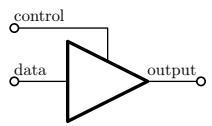
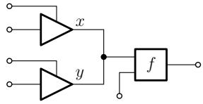
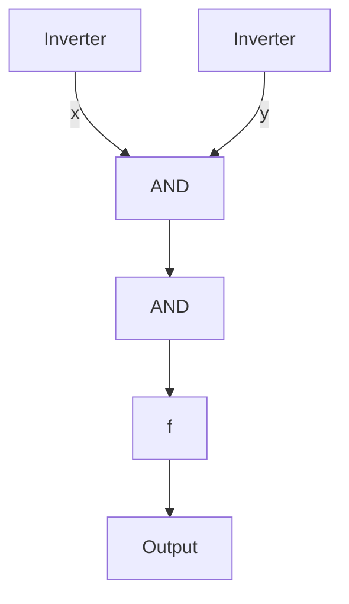
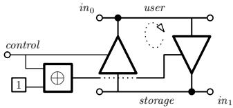
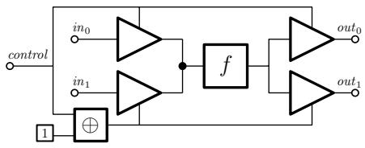
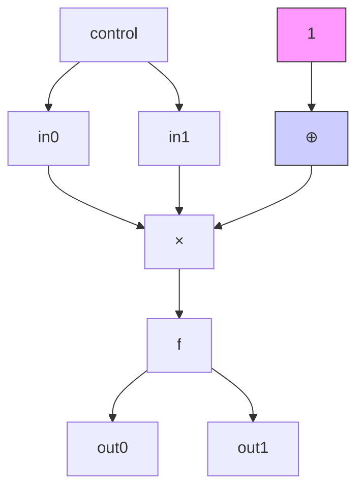
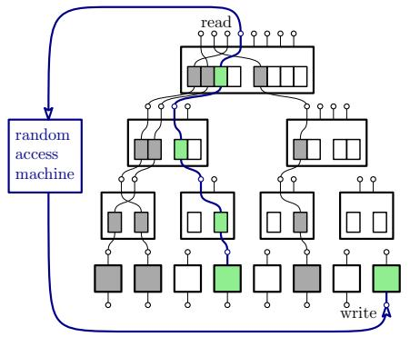
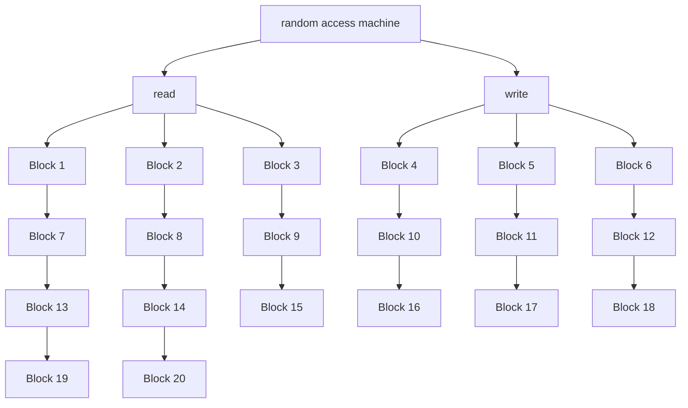
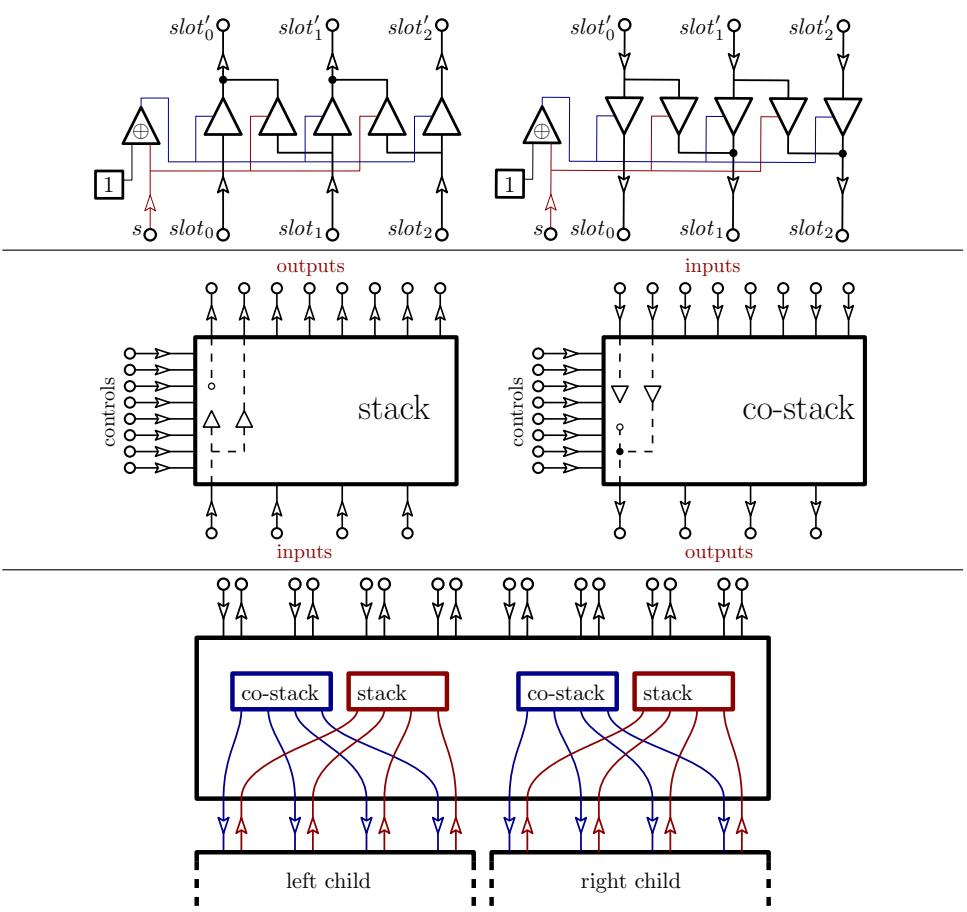

# Tri-State Circuits A Circuit Model that Captures RAM⋆

David Heath1, Vladimir Kolesnikov2, and Rafail Ostrovsky3

1 daheath@illinois.edu, UIUC 2 kolesnikov@gatech.edu, Georgia Tech 3 rafail@cs.ucla.edu, UCLA

Abstract. We introduce tri-state circuits (TSCs). TSCs form a natural model of computation that, to our knowledge, has not been considered by theorists. The model captures a surprising combination of simplicity and power. TSCs are simple in that they allow only three wire values (0, 1, and undefined – Z) and three types of fan-in two gates; they are powerful in that their statically placed gates fire (execute) eagerly as their inputs become defined, implying orders of execution that depend on input. This behavior is sufficient to efficiently evaluate RAM programs.

We construct a TSC that emulates T steps of any RAM program and that has only O(T · log3 T · log log T ) gates. Contrast this with the reduction from RAM to Boolean circuits, where the best approach scans all of memory on each access, incurring quadratic cost.

We connect TSCs with cryptography by using them to improve Yao’s Garbled Circuit (GC) technique. TSCs capture the power of garbling far better than Boolean Circuits, offering a more expressive model of computation that leaves per-gate cost essentially unchanged.

As an important application, we construct authenticated Garbled RAM (GRAM), enabling constant-round maliciously-secure 2PC of RAM programs. Let λ denote the security parameter. We extend authenticated garbling to TSCs; by simply plugging in our TSC-based RAM, we obtain authenticated GRAM running at cost $O ( T \cdot \log ^ { 3 } T \cdot \log \log T \cdot \lambda )$ , outperforming all prior work, including prior semi-honest GRAM.

We also give semi-honest garbling of TSCs from a one-way function (OWF). This yields OWF-based GRAM at cost O(T ·log3 T ·log log T ·λ), outperforming the best prior OWF-based GRAM by more than factor λ.

Keywords: Models of Computation, Random Access Machines, Circuits, Oblivious Computation, MPC, Garbled RAM.

## 1 Introduction

Boolean circuits form perhaps our simplest complete model of computation. The model allows only a small set of gate types, each of which computes a basic function. Moreover, a circuit’s structure is static and explicit. This simplicity is ideal for both theory and practice, making them popular in complexity theory and, in particular, in cryptography.

On the other hand, random access machine programs (RAM programs)4 form our most ubiqituous practical model of computation. The random access capability approximates the power of real-world devices, so theoretical advances in RAM can more readily translate to real-world impact.

Unfortunately, it is difficult to connect Boolean circuits and RAM. Indeed, the two models seem inherently at odds. RAMs are inherently dynamic, allowing the program to quickly and arbitrarily access one element in an immense array; circuits are inherently static, requiring that the program fix the order in which it manipulates data before input is known.

It is therefore unsurprising that reductions from RAMs to Boolean gates are expensive. The straightforward reduction emulates each memory access by linearly scanning the entire RAM memory. This simple approach is also the best known. Since RAMs access memory at each step, this reduction yields a circuit that grows quadratically in the RAM runtime T .

Motivation for introducing tri-state circuits: Constant round 2PC. It is unfortunate that reductions from RAMs to circuits are so expensive. Many technologies are more compatible with circuits than with RAMs, and a concretely efficient reduction would automatically connect real-world RAM programs with circuitbased technologies.

As our crucial example, we consider Yao’s Garbled Circuit (GC) [Yao86], a multiparty computation (MPC) technology that achieves symmetric-key-based constant-round protocols.

The GC literature is extensive, see [NPS99,ZRE15,HJO+16,GLNP18,RR21] and many more. Most GC works, including all listed above, garble Boolean gates only, suggesting a natural connection between garbling and circuits. On the other hand, the goal of GC is to enable secure computation of arbitrary programs, and many programs are best handled by RAMs, not by circuits.

It is possible – though challenging – to garble RAM programs. Garbled RAM (GRAM) [LO13] does so without reducing to circuits. GRAM also has a rich literature [GHL+14,GLO15,GLOS15,CH16,CCHR16,LO17,HKO22,PLS22]. The basic observation of GRAM is that it is possible to garble interconnected collections of circuits that execute in an order decided at runtime. This dynamic ordering breaks from the circuit model, where the order of execution is static.

Advancing GRAM was challenging. The problem was that reasoning about GRAM required reasoning simultaneously about multiple complex topics, including gate garbling techniques, the above dynamic circuit execution, and constructions of Oblivious RAM [GO96]. Worse still, the community lacked an effective vocabulary for discussing the dynamic mechanisms of GRAM; prior work explained these mechanisms via a concept they called dynamic language translation, see e.g. [GLO15,GLOS15,HKO22,PLS22]. Language translation is deeply intertwined with the specifics of circuit garbling, and thus understanding even the basic ideas of GRAM required intimate GC knowledge.

Matching the power of garbling to a model of computation. The mere existence of non-trivial GRAM, which leverages dynamic behavior, demonstrates that the circuit model poorly approximates the power of garbling. Clearly some additional expressive power is available, sufficient to efficiently execute RAM programs.

Thus, it is interesting to search for another model of computation – cheap to garble, simpler than RAM, and more expressive than Boolean circuits – that captures the dynamic power of garbling. Such a model would be useful, since it would decompose the GRAM problem into pieces, allowing us to think modularly about RAM constructions, untethered from garbling-specific concerns.

## 1.1 Our Contribution

We demonstrate that there exists a simple, circuit-like model of computation that closely approximates (within a polylogarithmic factor) the expressive power of RAM. Our tri-state circuit (TSC) model is strongly compatible with our target use-case of garbling, in the sense that it admits efficient and natural protocols.

Like a Boolean circuit, a TSC is composed from statically connected gates, each of which has one of only a small number (three) of possible gate types. Each gate computes a basic function of its two tri-value input wires. Despite their simplicity, TSCs are distinctly more powerful than Boolean circuits; they admit a primitive form of control flow where the order in which gates fire depends on the input. This basic control flow can efficiently emulate RAM computation. Thus, TSCs capture a surprising combination of conceptual simplicity and expressive power which, to our knowledge, has not been explored by theorists.56

We emphasize that while we feel the tri-state circuit model has intrinsic value, we are motivated by the concrete objective of improving symmetric-key-based constant-round secure computation (i.e., garbling).

Our contributions include:

We formalize the tri-state circuit model.

We reduce RAM programs to (deterministic) tri-state circuits. Let T denote a runtime. We construct a tri-state circuit of size $O ( T \cdot \log ^ { 4 } T )$ that can emulate T steps of any RAM program.

We formalize randomized and oblivious tri-state circuits. In cryptography, data-independent orders of execution are useful for protecting privacy. Basic tri-state circuits discard input independence, losing cryptographic utility. Oblivious tri-state circuits reclaim this utility. A tri-state circuit is oblivious if its order of execution appears (to a distinguisher) independent of the input.

We reduce RAM programs to oblivious tri-state circuits. We construct an oblivious tri-state circuit of size $O ( T \cdot \log ^ { 3 } T$ · log log T ) that can simulate T steps of any RAM program. This oblivious reduction improves over our deterministic reduction by leveraging randomness.

We apply tri-state circuits to secure 2PC. Let λ denote the computational security parameter. We achieve two results:

– Our most exciting application is authenticated GRAM, a maliciously-secure constant-round 2PC RAM protocol. Our authenticated GRAM executes T RAM steps at cost $O ( T \cdot \log ^ { 3 } T \cdot \log \log T \cdot \lambda )$ . Prior malicious GRAM relied on the expensive cut and choose technique, and was more than factor σ slower, for statistical security parameter σ.  
– Our second application is improved semi-honest Garbled RAM from only one-way functions. Prior to our work, the best GRAMs were based on randomoracle-like assumptions [HKO22,PLS22]. The best GRAM avoiding such an assumption had quadratic scaling in λ [PLS22]. Our construction outperforms all prior RO-based GRAMs, and it relies only on one-way functions. It runs at cost $O ( T \cdot \log ^ { 3 } T$ · log log T · λ).

TSC garbling is lean. For example, Boolean circuits can be compiled to tristate gates, and the communication cost of our resulting authenticated TSC protocol is less than 2× that of state-of-the-art authenticated garbling of Boolean gates [DILO22], and with effort this overhead can likely be removed.

Impact on Garbled RAM. While [HKO22] and follow-on work [PLS22] substantially improved GRAM, these works left pressing and challenging open questions, including efficient malicious GRAM and standard-assumption-based GRAM.

We abstract garbled computation as tri-state circuits, not Boolean circuits, and the payoff is a modular approach to GRAM. This modularity allows us to make significant advances that would have been highly technically involved if expressed in the prior GRAM framework of language translation. We demonstrate that the above more challenging versions of GRAM can be constructed with overhead similar to basic GRAM. Going further, we discovered compatibility between a state-of-the-art Oblivious RAM construction [WCS15] and tri-state circuits, further improving GRAM’s asymptotic cost.

Perhaps best of all, tri-state circuits markedly simplify GRAM fundamentals. Indeed, our new garbling procedures are extremely similar in complexity to their Boolean-circuit-based counterparts. This reduced complexity will allow a broader cryptographic audience to understand, improve, and apply GRAM.

## 2 Background and Related Work

## 2.1 Garbled Circuits and Garbled RAM

Garbled Circuit (GC) [Yao86] is a fundamental MPC primitive that allows two parties – a garbler G and an evaluator E – to securely execute a program of their choice on their private inputs. GC is distinct from other secure computation primitives in that it allows for protocols that (1) run in a constant number of rounds and (2) rely almost entirely on fast symmetric key primitives.

Roughly speaking, GC splits program execution into two steps: garbling and evaluation. Garbling is independent of the input, and evaluation of the garbled program appears independent of the input. When these two steps are carried out by two different parties, we can arrange that each party’s execution hides the input of the other, allowing privacy-preserving protocols.

While GC traditionally works in the Boolean circuit model, a number of works starting with [LO13] developed Garbled RAM (GRAM), an extension to the more expressive RAM model. [LO13] demonstrates that for a word-RAM program running in time T and for computational security parameter λ, we can garble the program at the following cost:

$$
O (T \cdot \log^ {3} T \cdot \log^ {c} \log T \cdot | \mathcal {C} _ {p r f} | \cdot \lambda) [ \mathrm{LO13} ]
$$

Here, c is an unspecified constant, and $| \mathcal { C } _ { p r f } |$ is the circuit size of a PRF with λ bits of output (asymptotic analysis by [PLS22]).

A sequence of works subsequently improved the Garbled RAM primitive, e.g. [GHL+14,GLOS15,GLO15,HKO22,PLS22]. The most recent garbled RAM constructions achieve the following costs:

$$
O (T \cdot \log^ {4} T \cdot \lambda) [ \mathrm{HKO22} ]
$$

$$
O (T \cdot \log^ {3} T \cdot (\log \log T) ^ {2} \cdot \lambda) [ \mathrm{PLS22} ]
$$

[HKO22] and follow-on work [PLS22] far surpass prior GRAMs, bringing the technique’s overhead in line with what is expected from more traditional Booleancircuit-based GC.

Improving GRAM remains a crucial direction. In particular, it is interesting to (1) improve asymptotic cost, (2) extend GRAM to interesting and challenging settings, and (3) simplify the GRAM formalism, easing further exploration and application. Our work simultaneously achieves each of these goals.

Malicious GRAM. GC provides natural protection against malicious evaluator E, but protecting against malicious garbler G is more challenging. G can incorrectly garble the program, causing the program to, for instance, erroneously output bits of E’s input. It is difficult to arrange that E can detect incorrectly garbled programs, because E’s inability to reason about garbled programs is exactly the property that protects G’s input.

Despite this challenge, prior work developed powerful techniques for efficient handling of malicious garbled circuits (see later discussion of authenticated garbling). Until this work, malicious garbled RAM was far less effective.

Prior work, e.g. [GGMP16,HY16,Mia20], demonstrated feasibility of malicious GRAM, but performance was poor, especially as compared to semi-honest GRAM. The best prior GRAM could be constructed by combining semi-honest GRAM [HKO22] (or the asymptotically more efficient [PLS22], framed as a garbling scheme [BHR12]) with the classic cut and choose technique, see e.g. [Lin13].

Cut and choose upgrades semi-honest garbling to the malicious setting. The idea is to have G garble many copies of the same program, then allow E to challenge a randomly selected subset of those programs. While this works, G must garble a number of copies that grows with the statistical security parameter σ, leading to highly undesirable factor σ slowdown as compared to the semihonest execution. The best malicious GRAM had the following asymptotic cost:

$$
O (T \cdot \log^ {3} T \cdot (\log \log T) ^ {2} \cdot \lambda \cdot \sigma) \quad [ \text { PLS22 } ] \text {   with   Cut   and   Choose }
$$

We avoid this factor σ slowdown by implementing tri-state circuits via the techniques of authenticated garbling (see next). Our maliciously secure GRAM dramatically improves over prior state of the art, achieving the following cost:

$$
O (T \cdot \log^ {3} T \cdot \log \log T \cdot \lambda) \quad \text { Our   maliciously   secure   GRAM }
$$

Authenticated Garbling. The breakthrough work [WRK17] introduced a far superior approach to malicious GC. Their authenticated garbling technique achieves performance that asymptotically matches semi-honest garbling, incurring only O(n · λ) cost for an n-gate circuit. The approach is also practically performant.

In classic GC, each wire value is represented by a length-λ label. These labels are used as keys to encrypt/decrypt subsequent labels in a way that achieves the program semantics. Authenticated GC extends each GC label with an additional σ bits, forming a MAC on the wire value. These MACs allow G to reveal particular wire values to E such that E is confident the value is indeed correct.

To securely evaluate each AND gate, the parties require an authenticated multiplication triple. Multiplication triples can be computed offline in a functionindependent preprocessing phase. Improving the efficiency of authenticated garbling is the subject of a growing body of works [KRRW18,YWZ20,DILO22].

We demonstrate natural compatibility between authenticated garbling and tri-state circuits. Our construction achieves cost O(n · λ) for an n-gate tri-state circuit. While formal treatment of any non-trivial malicious technique is complex, authenticated garbling of tri-state circuits is – at least at an intuitive level – a straightforward extension of the core ideas given by the above prior works.

Standard-Assumption-Based GRAM. In the semi-honest setting, the fastest garbling techniques rely on a non-standard random-oracle-like assumption called a circular correlation robust hash (CCRH) function [CKKZ12]. This assumption stems from the classic “Free XOR” extension [KS08] whereby each GC wire has two labels related by a global correlation. The CCRH assumption is needed to achieve security in the presence of this correlation.

It is interesting to remove this assumption and to garble assuming only oneway functions (OWFs) [GLNP18].7 Prior to our work, Garbled RAM from oneway functions was far inferior to GRAM based on Free XOR. Indeed, the best construction had the following cost (note the problematic scaling in λ):

$$
O (T \cdot \log^ {3} T \cdot (\log \log T) ^ {2} \cdot \lambda^ {2}) \tag {PLS22}
$$

We demonstrate that classic OWF-based techniques from the literature can be almost directly applied to tri-state circuits. Indeed, our standard-assumptionbased garbling scheme is relatively obvious, once the tri-state circuit model is understood. Applying this scheme in conjunction with our RAM constructions, we as a corollary achieve the best standard-assumption-based GRAM:

$$
O (T \cdot \log^ {3} T \cdot \log \log T \cdot \lambda) \quad \text { Our   OWF - based   semi - honest   GRAM }
$$

## 2.2 Oblivious RAM

Oblivious RAM (or ORAM, [GO96]) is a powerful technology that allows a weak client to outsource its database to a powerful untrusted server. The client can repeatedly query its sensitive database without the server learning what data is accessed, or even the pattern in which data elements are accessed. In ORAM, for each logical access, the client issues a sequence of queries to physical locations. These physical locations reveal nothing about the logical accesses, which can be formalized by showing that the server’s view can be simulated.

ORAM is highly relevant to our notion of oblivious tri-state circuits. In particular, our reduction from RAM programs to oblivious tri-state circuits directly leverages the Circuit Oblivious RAM construction of [WCS15], implementing their ORAM algorithms via tri-state gates. Our reduction leverages this construction to hide memory access patterns, allowing for a circuit that executes RAM programs and whose gates execute in an order that can be simulated.

## 2.3 Other models of computation

The tri-state circuit model shows that, surprisingly, there exists a concrete set of gates that can efficiently (with polylog overhead) implement RAM. Said another way, tri-state circuits admit a small statically defined structure whose collection of use-once components jointly implement RAM. This capability distinguishes the model from other widely considered models.

Other models either inefficiently support RAM (e.g., Turing Machines, decision trees, Boolean circuits, arithmetic circuits, etc.), or have implicitly specified “static structure” that is either large or involves components that can be used repeatedly. For instance, while RAM can, of course, efficiently implement itself, it in some sense involves a very large static structure, where each RAM step is implicitly connected to each memory cell. Similarly pointer machines form a model of computation that proceeds by editing a directed graph, see e.g. [Sch80]; because of the large number of possible graphs that can emerge at runtime, pointer machines similarly have large implicit static structure.

Said yet another way, tri-state circuits require that we statically define a fixed “stage” that establishes explicit connections between computational elements and explicitly named memory cells. Runtime execution may only proceed within the connection constraints of this stage, and we measure cost in terms of the size of the stage, namely, the number of connections. Indeed, in GC, the garbler must account for each possible action and state of the evaluator. This accounting corresponds to generation of garbled tables – garbling the stage.

Despite these constraints, the model is expressive. It has sufficient freedom to (obliviously) implement RAM. This expressiveness in the presence of GCcompatible constraints is what makes tri-state circuits so useful in garbling.

While our focus is on secure computation and garbling, we envision that the tri-state circuit model may be interesting in other settings as well. For instance, it is intriguing that our tri-state circuit constructions can – at least in principle – be implemented via digital circuits, and the model may also have interesting connections to complexity theory.

## 3 Notation

Word RAM Model. In the word RAM model [Hag98], an abstract machine operates on length-w words. Basic operations, such as addition, comparisons, and, in particular, memory reads/writes are assumed to take constant time.

Let T denote RAM program runtime. We assume w is large enough to point into the program input $( \mathrm { i . e . , ~ } w ~ \geq ~ \log _ { 2 } n )$ and, for simplicity of analysis, we assume $w = \theta ( \log T )$ . We assume that each non-memory-accessing instruction can be implemented by a Boolean circuit of size $O ( w ^ { 2 } ) = O ( \log ^ { 2 } { \bar { T } } )$ , sufficient to capture powerful operations such as multiplication. Throughout this work, we refer to word RAMs as RAMs.

Common Notation. $x \ | | \ y$ denotes the concatenation of strings x and y. We denote by $\langle x \rangle$ a Boolean encoding of the value x. E.g., if P is a RAM program, then ⟨P ⟩ denotes a Boolean encoding of that RAM program. We leave the details of such encodings unspecified, as they are not interesting. σ denotes a statistical security parameter (e.g. 40 or 60). λ denotes a computational security parameter (e.g. 128). $X { \overset { s } { = } } Y$ denotes that distributions X and Y are statistically close.

Tri-state notation. Section 4 introduces the following; we catalog for reference.

Based on notation from digital circuits, Z denotes the distinguished tri-state high impedance value. Z can be pronounced $^ { \circ } \mathrm { n i l } ^ { \circ }$ , and can be informally understood as the value of a wire that is not yet defined. A wire carrying 0 or 1 is set; a wire carrying Z is not set. We denote buffers by division8 (written / or $\textstyle { \frac { x } { u } } \int$ , and joins by ▷◁. The second argument to each buffer is called its control. The symbol ⊕ denotes XOR. XOR is extended to tri-state values in a natural manner. Namely, if either XOR input is Z, then the output is Z (see Figure 1).

<table><tr><td> $\oplus$ </td><td> $\mathcal{Z}$ </td><td>0</td><td>1</td><td> $\times$ </td><td>/</td><td> $\mathcal{Z}$ </td><td>0</td><td>1</td><td> $\times$ </td><td> $\bowtie$ </td><td> $\mathcal{Z}$ </td><td>0</td><td>1</td><td> $\times$ </td></tr><tr><td> $\mathcal{Z}$ </td><td> $\mathcal{Z}$ </td><td> $\mathcal{Z}$ </td><td> $\mathcal{Z}$ </td><td> $\times$ </td><td> $\mathcal{Z}$ </td><td> $\mathcal{Z}$ </td><td> $\mathcal{Z}$ </td><td> $\mathcal{Z}$ </td><td> $\times$ </td><td> $\mathcal{Z}$ </td><td> $\mathcal{Z}$ </td><td>0</td><td>1</td><td> $\times$ </td></tr><tr><td>0</td><td> $\mathcal{Z}$ </td><td>0</td><td>1</td><td> $\times$ </td><td>0</td><td> $\mathcal{Z}$ </td><td> $\mathcal{Z}$ </td><td>0</td><td> $\times$ </td><td>0</td><td>0</td><td>0</td><td> $\times$ </td><td> $\times$ </td></tr><tr><td>1</td><td> $\mathcal{Z}$ </td><td>1</td><td>0</td><td> $\times$ </td><td>1</td><td> $\mathcal{Z}$ </td><td> $\mathcal{Z}$ </td><td>1</td><td> $\times$ </td><td>1</td><td>1</td><td> $\times$ </td><td>1</td><td> $\times$ </td></tr><tr><td> $\times$ </td><td> $\times$ </td><td> $\times$ </td><td> $\times$ </td><td> $\times$ </td><td> $\times$ </td><td> $\times$ </td><td> $\times$ </td><td> $\times$ </td><td> $\times$ </td><td> $\times$ </td><td> $\times$ </td><td> $\times$ </td><td> $\times$ </td><td> $\times$ </td></tr></table>

Fig. 1: The semantics of tri-state gates. Tri-state circuits have three types of fan-in two gates: XORs (⊕), buffers ( /), and joins (▷◁). Each gate implements a binary operation on the set {0, 1, Z, ✗}. The value Z denotes that a wire has not yet acquired a Boolean value; 0, 1 are standard Boolean values; ✗ denotes an illegal state and is disallowed in legal (Definition 2) tri-state circuits.

## 4 Tri-State Circuits

This section describes and formalizes the tri-state circuit model. Sections 5 and 6 later shows that tri-state circuits can efficiently implement RAM programs.

Tri-state circuits center on a non-Boolean gate that we call a buffer. A buffer takes two inputs, a control wire and a data wire:



If the control is set to 1, then the output wire acquires the value of the data wire; if the control is set to 0, then the output wire remains unassigned, which we denote by stating the output wire has value $\mathcal { Z } . { } ^ { 9 }$ If the control is set to 1, we say that the buffer is active and that the output is set; else the buffer is inactive and the output is not set.

Because a buffer might not set its output, it is possible to implement interesting circuit arrangements, such as the following:



<details>
<summary>flowchart</summary>


</details>

Here, we connect the two buffer outputs x, y via the black circle that we formalize as a gate referred to as a join. The join polls its two inputs, forwarding an input to its output as soon as either x or y is set. We connect the join’s output to a subcircuit labelled f .

The crucial point is that subcircuit f eagerly fires as soon as either x or y is set. Thus, for instance, it is possible to run f before the value of y is even computable from values stored on the circuit wires. Eagerly executing gates before their inputs are fully available enables a primitive form of control flow. Namely, executing one circuit on two different inputs can lead to two completely different orders of gate evaluation. This input-dependent order of execution is the crucial distinction between tri-state circuits and Boolean circuits.

We later discuss that this simple control flow is sufficient to build small circuits for RAM.

Definition 1 (Tri-state Circuit). A tri-state circuit is a circuit allowing cycles (i.e., its graph need not be acyclic) with three gate types: XORs, buffers, and joins. Each tri-state wire carries a value in the set {0, 1, Z, ✗}. The semantics of each gate type are specified in Figure 1. A tri-state circuit has n input wires and m output wires. Tri-state circuits may use two distinguished wires, named 0 and 1, which respectively carry the corresponding constants 0 and 1. Circuit execution on input $x \in \{ 0 , 1 \} ^ { n }$ proceeds as follows:

1. Store Z on each non-input wire.  
2. Store x on the input wires.  
3. Choose a gate arbitrarily, execute it, and update its output wire.  
4. Repeat Item 3 until there is no gate whose execution changes the wires.  
5. Halt, and output the state of the output wires.

We denote execution of tri-state circuit C with input x by C(x).

Definition 1 allows gates to fire in any order. Note, it is straightforward and cheap to compute an evaluation order of tri-state circuits (Lemma 2).

Looking forward, we will consider constrained classes of tri-state circuits satisfying (combinations of) additional properties (see Definitions 2, 5, 6 and 9).

Four values; tri-state circuits. Our formalization of tri-state circuits considers wires ranging over a set of four values {0, 1, Z, ✗}. The name ‘tri-state circuit’ remains sensible because the value ✗ is simply a distinguished error state, and such states are not allowed in legal tri-state circuits; see next.

Preventing short circuits. Definition 1 includes the possibility of illegal states, denoted ✗. One can erroneously join two wires where one wire holds 0 and the other holds 1. This causes a ‘short circuit’, and is ill defined. We restrict ourselves to circuit designs that cannot enter an illegal state:

Definition 2 (Legal tri-state circuit). A tri-state circuit C is considered illegal if there exists some input $x \in \{ 0 , 1 \} ^ { * }$ such that upon executing C(x), there is some circuit wire that holds ✗. If C is not illegal, it is considered legal.

From here on, considered tri-state circuits are legal.

Dynamic execution. The dynamic nature of tri-state circuits is formalized by the fact that gates may fire in an arbitrary order. At initialization, each non-input wire holds Z. As gates fire, wire values can change from Z to 0 or 1. Once set, a legal tri-state circuit wire value cannot change again.

Indeed, it turns out that tri-state gate semantics (Figure 1) enforce a partial order on how wire assignments may evolve during execution:

$$
\mathcal {Z} <   0 \quad \mathcal {Z} <   1 \quad 0 <   \mathsf {X} \quad 1 <   \mathsf {X}
$$

Each gate respects the above ordering in the sense that increasing a gate input correspondingly increases (or leaves the same) the gate output; i.e., tri-state gates are monotone with respect to this ordering. Since each gate can only increase its output wire, it is not possible to, for example, change a 0 to a 1.

Each time a gate is executed and increases a wire value, the circuit takes a step forward in its computation. By repeatedly taking such steps, the circuit quickly converges to a final configuration, which we call its halt-time state.

Definition 3 (Halt-time state). The halt-time state of a tri-state circuit C on input $x \in \{ 0 , 1 \} ^ { * }$ is the configuration of C’s wires w (i.e., a map from circuit wires to wire values) after executing C(x).

Tri-state gates may fire in any arbitrary order, including firing each gate an arbitrary number of times. This is potentially concerning, as it might seem there is ambiguity in the definition. Namely, given different orders of gate execution, it might seem possible that C(x) could compute more than one possible output.

Not so. The monotone nature of gates ensures that the halt-time state of a tri-state circuit C and a particular input x is unique, independent of the order that gates fire. Indeed, in Appendix A we prove the following:

Lemma 1 (Halt-Time State Unique). Let C be a TSC that, on input x and for some sequence of executed gates, reaches a halt-time state w. Any sequence of gate executions reaching a halt-time state will reach the same state w.

Moreover, the unique halt-time state can always be reached in linear time:

Lemma 2. For any n-gate tri-state circuit C and for any input x, there exists an order of gate execution of length at most 2n that reaches the halt-time state for C(x). Moreover, if C is legal (Definition 2), then there exists an order of gate execution of length at most n.

Proof. We can simply execute each gate as its inputs become available. More precisely, we execute a join if at least one input is set, and we execute an XOR/join if both of its inputs are set.

Note, if C is illegal, we may need to fire each gate a second time, since wire values can change from 0, 1 to ✗. However, if C is legal, after firing a gate once, that gate’s output cannot possibly change (by a simple inductive argument), completing the proof. □

An implementation can easily track gates that are ready to execute next by tracking connections between gates and maintaining a queue of ‘ready’ gates.

Circuits with cycles. Definition 1 explicitly allows circuit graphs with cycles. Indeed, cycles seem to be essential for implementing efficient RAM with TSCs.

Consider two executions of a RAM program. In the first execution, suppose we first access some memory cell i, then we access some cell j; in the second execution, suppose we first access index cell j, then cell i. Ideally, we would store memory cells i and j on particular collections of wires such that the two executions read the same two collections of wires, just in different orders. To achieve this, we must admit cycles in our circuits: there is a possible data path from the i wires to the j wires, and from the j wires to the i wires.

There is no inherent inconsistency in allowing circuits with cycles, so long as we are careful in our circuit designs. Namely, tri-state circuits are allowed to have cycles, but their runtime data paths are not. Consider the following example:



<details>
<summary>text_image</summary>

control
in0 user
1 storage in1
</details>

Here, we connect a wire named user to a wire named storage, allowing user to read from/write to storage. At first glance, the circuit appears to allow user to write to itself, a potentially problematic arrangement (especially when proving GC security). On closer inspection, it becomes clear that the wire control statically rules out this possibility: at most one buffer can activate, so there is no way for user to write to itself. This circuit has a cycle, but there is no possible cycle in the runtime data paths through the circuit.

We rule out runtime cycles by considering circuits that are runtime acyclic:

Definition 4 (Runtime Dependency). A tri-state gate g is runtime dependent on another gate g′ with respect to a circuit input x if:

– g is an XOR, a join, or a buffer with control 1, and g takes as input the output wire of g′.  
– g is a buffer with control 0 or Z (at halt-time), and g′ outputs the control wire of g.

We explicitly emphasize that a buffer with control 0 or Z (at halt-time) is not runtime dependent on the gate that outputs its data wire.

Definition 5 (Runtime Acyclic). A tri-state circuit C is runtime acyclic if for all inputs x, there exists a winning strategy to a graph pebbling game with the following rules:

– The player is allowed to place a pebble on each circuit input.  
– The player is allowed to place a pebble on a gate g iff there is a pebble on each of g’s runtime dependencies with respect to x (Definition 4).  
– The player wins if it successfully places a pebble on each gate.

Roughly speaking, Definition 5 guarantees that for any input, there is no data cycle; if there were, then it would be impossible to win the pebbling game, since pebbling a gate requires first pebbling each of that gate’s runtime dependencies.10 Note, the above example circuit is runtime acyclic. Indeed, if control = 0, then the left buffer is inactive, and we can pebble the cycle by first pebbling this left buffer; if instead control = 1, then we can first pebble the right buffer.

For the rest of this work, we only consider tri-state circuits that are runtime acyclic, and our formal security theorems (see Appendices C and D) require runtime acyclicity.

Runtime acyclicity neither implies nor is implied by legality (Definition 2).

Subcircuit sharing. Because tri-state gates run dynamically, we can arrange a trick that we call subcircuit sharing. Consider the following circuit:



<details>
<summary>flowchart</summary>


</details>

For sake of argument, suppose subcircuit f is composed from a large number of gates. Our example allows f to be called in two different ways: we can either set control = 1, running circuit f on input port $i n _ { 0 }$ and setting output port out0, or we can symmetrically set control = 0, running $f$ on input port in1 and setting output port out1. Since we can only set control to either 0 or 1, we can only activate one of the pairs of buffers, and so $f$ is used only once. We again emphasize that the time at which f fires depends on control: $i n _ { 0 }$ and in1 might each be set by the calling circuit at an arbitrary time.

Thus, f can be used in a conditional manner, solving a subproblem at one of two very different points in time. Crucially, our example is efficient in the sense that it contains only enough gates to implement f once; the gates in $f$ are shared across the two call sites.

RAM from cyclic circuits with subcircuit sharing. Subcircuit sharing is the key idea of our RAM reductions. In short – and as we later explain in detail – we arrange our RAM memory as a collection of small subcircuits, each of which stores RAM elements and is shared across many accesses. By sharing each such subcircuit via a tree structure, we allow each data-dependent access to consume only the subcircuit storing its desired element. Thus, the number of required gates is amortized across accesses; in total, we only need a number of gates that grows quasilinearly in the number of accesses. Each memory cell subcircuit in our RAM can be used to satisfy a variety of different accesses because our RAM circuits feature cycles. In particular, at read time, the access index is used to specify a path of buffers down the RAM tree which “open” and allow the read data to flow back up the tree to the place where it is needed.

The complexity of our RAM constructions arises from arranging subcircuit sharing at a large scale. We ultimately share each of a large number of subcircuits across a large number of memory accesses. This is achieved by arranging subcircuits in a binary tree where each node is itself a shared subcircuit providing shared access to further subcircuits. Section 5 explains in detail.

Non-nil output. As defined, a tri-state circuit C can output the value Z. However, we are primarily interested in circuits that ultimately output some Boolean value. Hence, we focus on tri-state circuits that compute Boolean functions:

Definition 6 (Computing a Boolean function). Let $f : \{ 0 , 1 \} ^ { n }  \{ 0 , 1 \} ^ { m }$ denote a Boolean function and C denote a legal tri-state circuit. We say that C computes f if for all $x \in \{ 0 , 1 \} ^ { n } , \mathcal { C } ( x ) = f ( x )$ .

Completeness. Definition 1 does not include AND gates. Even without AND, tri-state circuits are as expressive as Boolean circuits. Indeed, for every Boolean circuit, there is a similarly-sized tri-state circuit computing the same function:

Theorem 1 (Emulating Boolean circuits; tri-state AND gates). For any Boolean circuit C, there exists a tri-state circuit C′ such that:

$$
\mathcal {C} ^ {\prime} \text {   computes   } \mathcal {C} \quad \text {   and   } \quad | \mathcal {C} ^ {\prime} | = O (| \mathcal {C} |)
$$

Proof. By constructing Boolean gates from tri-state gates.

Indeed, it suffices to construct AND gates; XORs and constants are part of the tri-state circuit definition, and $\{ \land , \oplus , 1 \}$ is a complete Boolean basis. We use division to denote the buffer operation (Section 3). An AND gate can be constructed as follows:

$$
A N D (x, y) \triangleq \left(\frac {x}{y}\right) \bowtie \left(\frac {0}{y \oplus 1}\right)
$$

The above definition can be read as follows: When the value of y is 1, the result is x; when the value of $y \oplus 1$ is 1, the result is 0. □

## 4.1 Randomized and Oblivious Tri-State Circuits

In cryptographic settings, one of the principal advantages of non-tri-state circuits is their input independent order of execution. However, the entire point of the tri-state circuit model is its dependence on the input. This leads to a natural question: can we construct tri-state circuits where orders of execution – which depend on inputs – appear to be independent of the input?

Indeed, we can meaningfully define oblivious tri-state circuits. This definition is sufficient for cryptographic applications, as we demonstrate in Section 7. The definition of oblivious tri-state circuits is analogous to that of oblivious Turing Machines and of oblivious RAMs (ORAM, [GO96]).

In short, a tri-state circuit is oblivious if we can simulate all of its buffer control wires. I.e., there exists a poly-time simulator that outputs a distribution of control bits which – on every input – is close to the distribution of the real controls. This idea is reasonable because the order in which gates are executed can be deduced from the controls alone. Indeed, buffer control wires are the only mechanism in a tri-state circuit that can set a wire conditionally, and hence they determine the order of execution. Thus, if the controls can be simulated, then the order of gate execution hides the input.

Given our definitions so far, we cannot construct non-trivial oblivious circuits. So far, there is no mechanism for deviating from an order of execution that is deterministically prescribed by the input. Thus, the value on each control wire is a determined by the input, and we cannot simulate. Somehow we must mask each sensitive wire value before using it to control a buffer, e.g. by applying a one-time pad. Thus, we consider tri-state circuits with randomized inputs:

Definition 7 (Randomized Tri-State Circuit). A randomized tri-state circuit is a pair consisting of a tri-state circuit C and a distribution of bitstrings D. The execution of a randomized tri-state circuit on input x is defined by randomly sampling a string r from D, then running C on x and r:

$$
(\mathcal {C}, \mathcal {D}) (x) \triangleq \mathcal {C} (x; r) \quad \text { where } r \in_ {\mathbb {S}} \mathcal {D}
$$

A randomized tri-state circuit obliviously computes f if its controls (Definition 8) can be simulated:

Definition 8 (Controls). Let C be a tri-state circuit with input $x \in \{ 0 , 1 \} ^ { n }$ . The controls of C on x, denoted controls $( \mathcal { C } , x ) \in \{ 0 , 1 , \mathcal { Z } , \pmb { x } \} ^ { * }$ , is the set of all buffer control wire values (each labeled by its gate ID) at halt-time.

Definition 9 (Obliviously computing a function). Let $f : \{ 0 , 1 \} ^ { n } $ $\{ 0 , 1 \} ^ { m }$ be a Boolean function. Let $\sigma \in \mathbb { N }$ be the statistical security parameter. Let $( \mathcal { C } _ { i } , \mathcal { D } _ { i } ) ~ f o r ~ i ~ \in ~ [ \mathbb { N } ]$ denote a family of randomized tri-state circuits where each $\mathcal { C } _ { i }$ is legal. The family obliviously computes f if:

1. For all $x \in \{ 0 , 1 \} ^ { n } , ( \mathcal { C } _ { \sigma } , { \mathcal { D } } _ { \sigma } )$ outputs $f ( x )$ with overwhelming probability:

$$
\operatorname * {P r} _ {r \in {} _ {\mathcal {D} _ {\sigma}}} [ \mathcal {C} _ {\sigma} (x; r) = f (x) ] > 1 - \operatorname{negl} (\sigma)
$$

2. The distribution of controls of $( \mathcal { C } _ { \sigma } , \mathcal { D } _ { \sigma } )$ can be simulated. I.e., there exists a simulator S such that for all inputs $x \in \{ 0 , 1 \} ^ { n }$ the following holds:

$$
\mathcal {S} (1 ^ {\sigma}) \stackrel {{s}} {{=}} \left\{ \begin{array}{l} c o n t r o l s (\mathcal {C} _ {\sigma}, (x; r)) \end{array} \mid r \in_ {} \mathcal {D} _ {\sigma} \right\}
$$

While only tri-state circuit families obliviously compute functions, we will sometimes slightly abuse notation and omit the explicit mention of families.

As a warm up, we show that for every Boolean circuit, there exists a similarlysized randomized tri-state circuit obliviously computing the same function:

Theorem 2 (Obliviously Emulating Boolean Circuits). For any Boolean circuit ${ \mathcal { C } } ,$ there exists a randomized tri-state circuit (C′, D) s.t.:

$$
\left(\mathcal {C} ^ {\prime}, \mathcal {D}\right) \text {   obliviously   computes   } \mathcal {C} \quad \text {   and   } \quad | \mathcal {C} ^ {\prime} | = O (| \mathcal {C} |)
$$

Proof. $\mathrm { B y }$ reducing Boolean gates to tri-state gates with randomized input.

As in Theorem 1, we need only demonstrate how to build an oblivious AND gate, since XOR gates are part of the tri-state circuit definition.

To construct each AND gate, we use the classic idea of Beaver multiplication triples [Bea92]. For each AND gate, we define a distribution D as follows:

$$
\mathcal {D} \triangleq \left\{ \begin{array}{l} \alpha , \beta , \alpha \cdot \beta \end{array} \mid \alpha , \beta \in_ {} \{0, 1 \} \right\}
$$

Our oblivious AND gate uses the multiplication triple to mask its input bits before using them as buffer controls:

$$
\begin{array}{l} A N D _ {o b v} (x, y; \alpha , \beta , \gamma = \alpha \cdot \beta) \triangleq \\ \left(\left(\frac {y}{x \oplus \alpha} \bowtie \frac {0}{(x \oplus \alpha) \oplus 1}\right) \oplus \left(\frac {\alpha}{y \oplus \beta} \bowtie \frac {0}{(y \oplus \beta) \oplus 1}\right)\right) \oplus \gamma \\ \end{array}
$$

Both x ⊕ α and y ⊕ $\beta$ (and their complements) are controls, so to prove this gate is oblivious, we must simulate these values. This is straightforward: α and $\beta$ act as one-time pads, masking x and y:

$$
\mathcal {S} (1 ^ {\sigma}) \triangleq \left\{r _ {0}, r _ {0} \oplus 1, r _ {1}, r _ {1} \oplus 1 \mid r _ {0}, r _ {1} \in_ {} \{0, 1 \} \right\}
$$

Formally, the full circuit (C, D) consists of many such AND gates, each with its own triple, and we must jointly simulate all controls. This is trivial: multiplication triples are mutually independent and each is used only once. □

Simple Distributions. The formal definition of randomized tri-state circuits allows arbitrary distributions D. In practice, we cannot handle any distribution. For instance, some distributions are not computable. Moreover, in some settings – and in particular in the authenticated garbling setting – we wish to consider distributions that are as simple as possible, such that they are easy to sample.

Constructions presented in this work use simple distributions. In particular, our distributions can be described as the concatenation of independent copies of the following two sub-distributions: (1) a uniformly sampled bit $r \in _ { \mathbb { S } } \left\{ 0 , 1 \right\}$ and (2) a uniform multiplication triple $\left\{ \begin{array} { l } { \alpha , \beta , \alpha \cdot \beta \mid \alpha , \beta \in _ { \mathfrak { S } } \left\{ 0 , 1 \right\} } \end{array} \right.$ . Uniform bits and multiplication triples suffice for our oblivious tri-state RAM.

Simple distributions are important because, as we will see, our approach to authenticated garbled tri-state circuits samples D via a (malicious) preprocessing functionality. Efficient protocols exist for our considered class of distributions [WRK17,KRRW18,YWZ20,DILO22].

## 5 Deterministic Tri-State RAM

In this section, we reduce RAM execution to deterministic tri-state circuits. We emphasize that this section constructs only RAM, not oblivious RAM.

Our focus is our later oblivious reduction (Section 6), which has utility in 2PC. We give a deterministic reduction here for two reasons. First, it explores the theoretical capabilities of TSCs. Second – and more importantly – our deterministic reduction is simpler than our oblivious reduction. Our deterministic RAM sets the stage for our more complex oblivious reduction, which mixes the same high-level ideas with the Oblivious RAM construction of [WCS15].

We set the stage by defining what it means for a TSC to emulate a RAM:

Definition 10 (T -Emulation). Let $T \in \mathbb { N }$ denote a runtime. A tri-state circuit C T -emulates a RAM if C computes (Definition 6) the following function: Let P denote a word RAM program and x $\in \{ 0 , 1 \} ^ { n }$ denote a string. ⟨x⟩ denotes a Boolean encoding of value x.

$$
\mathcal {C} (\langle P \rangle , x) = \left\{ \begin{array}{l l} P (x) & \text {if P halts on input x within T steps} \\ \langle \bot \rangle & \text {otherwise} \end{array} \right.
$$

Theorem 3 (Deterministic Tri-State RAM). For any runtime $T \in \mathbb { N } .$ there is a tri-state circuit C s.t. C T -emulates a RAM and $| \mathcal { C } | = O ( T \cdot \log ^ { 4 } T )$ .

We describe our deterministic RAM. Our oblivious construction (Section 6) is more sophisticated, but builds on the ideas developed in this section.

The challenge of emulating a RAM is in accessing a large main memory. Other details – including operating on machine words and managing internal state – are straightforward, even without tri-state-specific capabilities. Thus we focus on repeatedly and arbitrarily accessing main memory.

Our approach is strongly inspired by the GRAM construction of [HKO22]; we show that their high level ideas are compatible with tri-state circuits, replacing their complex language translation mechanism by simple tri-state gates. We later asymptotically improve over [HKO22]’s construction.

Throughout the following discussion, we refer the reader to Figure 2, which depicts our deterministic RAM construction.

## 5.1 Deterministic Tri-State RAM Overview

Our main idea is to construct inside a tri-state circuit a binary tree of nodes, where each leaf holds one memory element, and where each internal node contains machinery needed to access its descendants.

On an access, the emulated RAM uses this machinery to dynamically traverse a path towards the particular leaf holding the target memory element. By leveraging subcircuit sharing, we ensure that while each traversal uses up some gates, it crucially does not use any gates off of its path. Thus, those gates can be used later. This basic idea leads to single circuit structure that is amortized across all RAM accesses.



<details>
<summary>flowchart</summary>


</details>

Fig. 2: Our deterministic tri-state RAM is arranged as a binary tree where memory elements are stored in the leaves. Each inner node has two stacks (concatenated rectangles) which allow the node to dynamically communicate with its two children. On each access, the RAM sets the desired leaf address on a top port of the RAM. This causes the circuit to dynamically traverse a path to the addressed leaf (example depicted in green). At each node, the RAM pops one stack and not the other, allowing the RAM to proceed either left or right. This establishes a path through which the requested element will flow back up to the root. Traversing the tree uses up parts of the circuit (previously used up components are in grey). Since the accessed memory element might be needed again later, the RAM writes an element back to a statically chosen and unused leaf.

Note that Boolean circuits cannot realize the above amortization since there is no mechanism by which to set aside a portion of the circuit for later use. In contrast, TSCs can, based on their dynamic order of execution and support for cyclic graphs. This is the expressive advantage of TSCs.

Communicating nodes. Leveraging this ability to amortize gates, the next crucial insight of our deterministic RAM is to view each tree node as an object that can dynamically send messages to and receive messages from its two children, consuming only “on-the-path” TSC gates. (Boolean circuits do not have this ability, and each access to a child requires processing both children, ultimately resulting in a linear scan.) Messages are passed by setting particular collections of wires that we refer to as ports. By setting a child’s input port, a parent can send a message to its child; by setting its own output port, the child can respond to its parent. The challenge is in allowing each parent to communicate with its children dynamically. Namely, we must arrange that a parent sends a message to its child if and only if that child is on a dynamically traversed path.

Circuit-based stacks. Like [HKO22], we arrange this dynamic communication via circuit-based stacks [ZE13]. Namely, there exists a Boolean-circuit-based analog of a stack data structure. These stacks are created with n elements and can support up to m conditional pop (cpop) operations. On each cpop, a stack takes as argument a single control bit $p .$ If $p = 1$ , then the stack indeed pops, returning and removing its top element; if $p = 0$ , then the stack instead returns the all zeros string and its contents remain unchanged.

We can port stacks to tri-state gates by simply substituting ANDs by buffers and XORs by joins.11 A stack with n w-bit elements supporting m cpop operations requires O(w ·m·log n) tri-state gates. Thus, each of the m cpop operations requires only an amortized log number of gates. This straightforward substitution unlocks substantial utility. Leveraging tri-state semantics, we can use stacks as dynamic communication channels between nodes; see next.

Using stacks. A parent node and its child communicate via a stack. The parent manages the stack’s control bits and outputs. The child manages the stack’s content: it appropriately connects the stack’s content wires to its input/output ports. To communicate with its child, the parent pops the stack (the call to cpop with $p = 1$ is non-oblivious). This establishes a chain of buffers whose control wires are each set to 1, but whose data wires are not yet set. As soon as we set the data wire of the first buffer in the chain, the buffers will one-by-one fire, sending the data through the chain, from parent to child.

To enable two-way communication, we place two kinds of buffers in the stack. Some buffers are oriented from parent to child, allowing messages to flow from the parent into the input port of the child; other buffers are oriented from child to parent, allowing the child to set messages on its output port which will flow through the stack to its parent. (In Appendix B.1, we formalize this notion by giving two variants of a stack, one that sends messages from inputs to outputs and the other that sends messages from outputs to inputs.) Thus, by calling cpop with $p = 1$ , the parent dynamically connects itself to one input port and one output port of its child.

Now that ports are connected, the parent can send a message to its child by setting data wires on its side of the stack. These values automatically flow through the stack into the child’s input port, causing gates in the child to fire, compute the relevant response, and load the response onto an output port, where it, again, automatically flows through the stack back to the parent.

Crucially, if the parent instead calls cpop with $p = 0$ , no communication occurs. The parent does not connect to its child’s port, and hence no gates inside the child fire, so all gates in the unused child remain ready for later use.

Inner nodes. Let tree level 0 denote the root; level i has $2 ^ { i }$ nodes. Let level ℓ denote the tree’s largest level. Each node on level i has two stacks, each supporting $2 ^ { \ell - i }$ calls to cpop, of which half can be called with $p = 1$ . I.e., each stack allows the node to communicate with its respective child up to $2 ^ { \ell - i - 1 }$ times.

Each node also consists of $2 ^ { \ell - i }$ subcircuits, each of which performs the following task: (1) receive the address of some leaf from an input port, (2) use the first bit of this address as a stack control bit such that we pop only the stack corresponding to the subtree that stores the requested address, (3) save the remaining bits of the address on the output wires of each stack (sending the bits to the active child), (4) read the response from each child, (5) join the responses together, and (6) save the joined response on the output port. We note that as we inspect nodes closer and closer to the leaves, the nodes become progressively smaller, until the leaves are subcircuits capable of handling exactly one request.

Read Traversals. The RAM can read elements from memory by traversing full root-to-leaf paths through the tree. To do so, the RAM loads into the root the address of the target leaf. The root strips the most significant bit from this address and uses it to conditionally communicate with its two children, indeed popping (i.e. calling cpop with $p = 1 )$ the stack for the child on the target path, and not popping (i.e. calling cpop with $p = 0 )$ the other child’s stack. The root can now forward a message to its child, so it forwards the address’s remaining bits. The child then recursively computes this same procedure, and so on, until we reach the target leaf.

This leaf stores a single element, and it sets its single output port to this element. Based on the semantics of tri-state circuits, this automatically triggers a cascade of events. The element flows through the stack of its immediate parent, causing the parent to fire and set its own output port to this newly received element. This causes the element to flow through a stack in the next level of the tree, and so on until the element reaches the root. At this point, the RAM can read the element from the root, completing the memory read.

Direct Writes. Now that the RAM has read its desired element, it must write something back. Note, we require this even if the goal of the memory access is simply to read. The problem is that we have now used up the gates associated with the accessed leaf, so we cannot reach that same leaf again. Thus, we need to write back to a fresh leaf, allowing later reads to access the same element again.

It is straightforward to arrange that each step of the RAM is statically and directly connected to one leaf, allowing it to directly write back without a dynamic traversal. Note, these connections induce cycles in the circuit graph, but not at runtime (Definition 5).

Recursive Position Map. As just discussed, each time we read a memory element, we write it back to a fresh location. This introduces a problem: how does the RAM remember where it last placed a particular element? This problem is typical in Oblivious RAM constructions, e.g. [SvS+13,WCS15], and can be solved via recursion. Namely, we explicitly store the current position of each memory element in a smaller, recursively-instantiated position map.

We can ensure that each recursively instantiated memory holds half the number of elements as the last, so only O(log T ) levels of memory are needed. To achieve this, we arrange that each position map element holds the positions of (at least) two elements in memory. To terminate the recursion, we instantiate the smallest, constant-sized memory via Boolean-logic-based linear scans.

In sum, the RAM construction is binary tree where each node on level i is capable of handling $2 ^ { \ell - i } \ \mathrm { R A M }$ read requests. We dynamically traverse the tree via tri-state-circuit-based stacks; each node holds two stacks, and on each access we pop only the stack on the path to the desired element.

## 5.2 Sources of Logarithmic Overhead

Our deterministic tri-state RAM has $O ( T \cdot \log ^ { 4 } T )$ gates. We characterize four distinct sources of cost, each of which adds a logarithmic factor:

1. Word size. The first source of scaling is unavoidable, as it stems simply from the size of RAM words. Words are assumed to have size $\theta ( \log T )$ , and tri-state gates operate on only one bit at a time. Hence, each action on a word requires ${ \cal O } ( \log T )$ gates. This factor simply highlights that the comparison between the word RAM model and the circuit model is “unfair”. Word RAMs can manipulate entire words at unit cost; tri-state circuits cannot.  
2. Binary Tree. On each access, our RAM traverses a path through a binary tree of size $O ( T )$ . Each traversal touches ${ \cal O } ( \log T )$ nodes.  
3. Stacks. During each traversal and at each tree node, our RAM calls cpop on a constant number (two) of stacks, each of size $O ( T )$ ). Circuit-based stacks of size n have O(log n) overhead per cpop, yielding an additional ${ \cal O } ( \log T )$ factor. Our oblivious construction leverages randomness to reduce the size of stacks from $O ( T )$ to only $O ( \log T ) )$ , and hence reduces stack overhead from ${ \cal O } ( \log T )$ to only O(log log T ). This is how our oblivious construction is able to improve over our deterministic RAM.  
4. Recursion. To track positions of elements, we use ${ \cal O } ( \log T )$ position maps.

It is difficult to foresee methods for achieving a tri-state RAM with fewer than $O ( T \cdot \log ^ { 3 } T$ · log log T ) gates. Indeed, each above source of scaling seems relatively inherent to our constructions, so further asymptotic improvement will likely require fundamentally new techniques.

## 5.3 Formal Construction

We present our formal reduction from RAM to deterministic tri-state circuits in Appendix B.2. We emphasize that the circuit described there is simply a formalism of the key ideas explained in Section 5.1.

## 6 Oblivious Tri-State RAM

In this section, we reduce RAM programs to oblivious tri-state circuits. At the highest level, we demonstrate that techniques in Section 5 can be combined with the Circuit Oblivious RAM construction of [WCS15].

We note that as a proof of concept, one can achieve oblivious tri-state RAM by simply employing off-the-shelf ORAM. Namely, use our deterministic RAM construction to emulate an ORAM server, and use oblivious tri-state Boolean gates (Theorem 2) to emulate an ORAM client. This works, but introduces high overhead which we would like to avoid. Here, we give a direct construction that is far more efficient than this proof of concept.

We begin by formalizing our claim:

Definition 11 (Oblivious T -Emulation). Let $T \in \mathbb { N }$ denote a runtime. A randomized tri-state circuit family $( \mathcal { C } _ { i } , \mathcal { D } _ { i } )$ obliviously T -emulates a RAM if it obliviously computes the following function: Let P denote a word RAM program and $x \in \{ 0 , 1 \} ^ { n }$ denote a string.

$$
\mathcal {C} (\langle P \rangle , x) = \left\{ \begin{array}{l l} P (x) & \text {if P halts on input x within T steps} \\ \langle \bot \rangle & \text {otherwise} \end{array} \right.
$$

Theorem 4 (RAM to Oblivious Tri-State Circuits). For any runtime $T = \theta ( { \mathrm { p o l y } } ( \sigma ) )$ , there is a randomized tri-state circuit family $( \mathcal { C } _ { i } , \mathcal { D } _ { i } )$ that obliviously T -emulates a RAM such that $| \mathcal { C } _ { \sigma } | = O ( T \cdot \log ^ { 3 } T \cdot \log \log T )$

## 6.1 Circuit ORAM [WCS15] Review

Our key idea is to implement inside a tri-state circuit the Circuit Oblivious RAM construction of [WCS15]. We thus review the relevant ideas of Circuit ORAM.

Circuit ORAM is a statistically-secure ORAM: it hides memory access patterns without computational assumptions. This property is achieved because the Circuit ORAM client does not use cryptographic primitives to choose its queries. The simplicity of the ORAM client is compatible with the tri-state circuit setting where implementing cryptographic primitives via gates is expensive.

Circuit ORAM arranges memory elements in a binary tree with $O ( T )$ leaves. Each node holds up to a constant number $\left( \mathrm { e . g . , 3 } \right)$ of memory elements. The root is the only exception: it stores a larger stash with capacity $\theta ( \log T \cdot \log \log T )$ .

When the ORAM client accesses an element, that element is retrieved from its node and moved to the stash. To prevent the stash from overflowing, Circuit ORAM consistently moves elements away from the root in a process called eviction. The key invariant – originally proposed by Path ORAM $\mathrm { [ S v S ^ { + } 1 3 ] \Omega ^ { - } }$ – is that even as an element is evicted, it remains on the path to a fixed leaf.

To access an element, we scan only those nodes along that element’s path. By the invariant, this scan is guaranteed to find the target element, and because each non-root node holds only a few elements, the scan is relatively cheap: the entire path – including the stash – holds only $O ( \log T \cdot \log \log T )$ total elements. Once the element is accessed, the ORAM places that element in the stash and reassigns the element to a fresh, uniformly chosen (with replacement) path.

Because each path is chosen randomly, it is easy to simulate Circuit ORAM’s access pattern: the simulator handles each access by choosing a uniform path.

Remembering paths. To access an element, the ORAM client must somehow remember that element’s path. Recall that each element’s path was chosen when it was last accessed, and there might be long gaps between accesses of a particular element. There are too many data elements for the client to remember paths locally, so the client remembers paths by recursively instantiating a smaller ORAM called the position map. See also our discussion of recursion in Section 5.

Eviction. After each access, the RAM deterministically chooses two paths and evicts elements along those paths. Each node on a chosen path evicts up to one RAM element to its child. To ensure that the RAM does not get ‘stuck’ with too many elements in the stash, the identity of evicted elements must be chosen carefully. The goal is to move elements towards the leaves – where there is more space – as quickly as possible. [WCS15]’s key contribution is an efficient procedure for deciding which element each node should evict.

Some details of this eviction strategy are highly relevant here, because we must implement the procedure with tri-state gates within our asymptotic budget.

[WCS15]’s Eviction Strategy. During eviction, [WCS15] first computes metadata, deciding for each path node which element to evict. This metadata computation scans the path twice, starting at the root, performing a (cheap) step of computation at each node towards the leaf, then performing a second scan starting from the leaf and returning to the root. Crucially, this metadata computation has high locality: each step only considers local information stored in the currently considered node, plus O(log T ) bits from the previous step.

Jumping ahead to our construction, this locality is absolutely essential, because it bounds the amount of information that needs to be passed from a tree node to its parent/child, and hence bounds the amount of information that needs to pass through circuit-based stacks (see discussion in Section 5). Thus, our reduction can use stacks of small items, each of size O(log T ) bits.

The remaining details of metadata computation are not crucial for understanding our construction, except that they ensure eviction prevents the stash from overflowing (except with negligible probability). For further detail, we refer the reader to [WCS15] (see their Algorithms 2 and 3 as well as their Figure 2).

After metadata is computed, Circuit ORAM again performs a scan from root to leaf where each node evicts (up to) one element to its child. The identity of this child is chosen according to the metadata.

By evicting elements this way, Circuit ORAM maintains its crucial path invariant while ensuring that the root will never overflow.

## 6.2 Overview of our Oblivious Tri-State RAM

In short, our oblivious tri-state RAM reuses almost every idea explained in Section 5. It similarly maintains a binary tree of nodes, each of which conditionally communicates with its two children via circuit-based stacks, and our RAM reads elements by traversing paths through the tree. Our oblivious construction improves over our deterministic RAM in two ways: it is oblivious, making it suitable for crytographic use, and it is asymptotically smaller.

These properties are achieved by using tri-state circuits to directly implement the Circuit ORAM construction [WCS15]. We also leverage an insight described by [PLS22] that allows us to use smaller circuit-based stacks, reducing asymptotic cost. We describe our oblivious tri-state RAM by highlighting the differences as compared to our deterministic reduction (Section 5).

Storage in every node. In our deterministic RAM, only the leaves store memory elements. Our oblivious construction follows Circuit ORAM, where each node can hold O(1) elements and where the root stores O(log T · log log T ) elements. When the RAM accesses an element, that element is written back to the root (and not written directly to a leaf). These elements subsequently move down the tree via Circuit ORAM’s eviction strategy, implemented via tri-state gates.

Multi-purpose node subcircuits. In our deterministic construction, each node holds O(T ) subcircuits, each of which completes a basic task: conditionally pop both stacks, then join the resulting values and send them back to the parent. Our oblivious construction’s subcircuits are more complex. They each conditionally perform various tasks, depending on the current need of the ORAM construction.

Each subcircuit conditionally performs one of three tasks: (1) read, including scanning the node’s local content, (2) evict, including computing appropriate metadata and sending an element to a child, or (3) do nothing (the need for this option is explained when we discuss “smaller stacks”). While each subcircuit must include enough circuitry to complete any of these tasks, the subcircuit is small. This is achieved by reusing parts of the circuit across the different possible tasks. In particular, we need only two total calls to cpop per subcircuit.

Multiple scans. In our deterministic RAM, each access scans a path twice, from root to leaf and then back to the root. Our oblivious tri-state RAM performs three scans. While only two scans are needed to read, three are needed to evict. When evicting, the RAM uses two scans to compute Circuit ORAM’s relevant metadata, and it uses the third scan to evict elements from parent to child.

Our tri-state stacks are thus used multiple times per access: the parent sends a message to its child, receives a message back, and then sends a second message. We emphasize that there is no technical challenge in using a circuit-based stack to communicate more than once: just increase the size of stack elements and leverage tri-state semantics to send bits at the right time.

Even though our nodes use three scans, the total information flowing through stacks remains small. In total, each node sends/receives O(log T ) bits of information. Keeping this amount of information small is crucial, because transmitted bits pass through stacks, and hence we must pay in additional gates for every bit of information transmitted between parent and child.

Smaller stacks. In our deterministic RAM, each node communicates with each of its children via a circuit-based stack of size $O ( T )$ . Our oblivious construction improves on this by leveraging an elegant idea demonstrated by [PLS22], allowing much smaller stacks that hold only $O ( \log T ) )$ elements. The smaller stacks account for our oblivious construction’s improved asymptotic size.

We explain [PLS22]’s observation – which is derived from an observation of $\mathrm { [ F N R ^ { + } 1 5 ] ~ - }$ in the context of Circuit ORAM. Recall that in Circuit ORAM, each memory access scans a uniformly chosen path.

Let $B = \varTheta ( \log ^ { 1 + \epsilon } \sigma )$ denote a parameter super-logarithmic in the security parameter for constant $\epsilon > 0$ . We call $B$ the batch parameter. Let level 0 denote the root of the RAM tree; each level i has $2 ^ { i }$ nodes. Consider: how often will a particular node on level i be scanned over the course of $2 ^ { i }$ · B accesses?

$[ \mathrm { F N R ^ { + } 1 5 } ] \backslash$ s insight is that because elements are randomly assigned to leaves, accesses should be roughly evenly distributed amongst nodes on level i. Indeed, it is incredibly unlikely that a particular node will be scanned significantly more often than its peers. $[ \mathrm { F N R ^ { + } 1 5 } ]$ proved that it is only negligibly likely that over $2 ^ { i } \cdot B$ accesses any node on level i will be used more than 2 · B times.

The upshot is that we need never instantiate a stack with more than $O ( B )$ entries (e.g., 256 entries in practice), since it is unlikely that we will exhaust its entries over the course of $2 ^ { i } \cdot B$ accesses. Instead, every $2 ^ { i } \cdot B$ accesses, we insert a reset step, forcibly clearing all stacks on level i and instantiating fresh stacks. Since each cpop operation is made to a smaller stack, this strategy reduces stack overhead from factor log $T$ to factor log log $T .$ .

Smaller stacks introduce nuance in implementing node subcircuits. Consider a particular node, consisting of many sequentially composed subcircuits. [PLS22]’s strategy partitions these subcircuits into generations of size $2 \cdot B .$ . After each generation, we insert a statically scheduled reset, preparing for the next generation. For this to work, we must ensure that over the course of $2 ^ { i } \cdot B$ accesses, every subcircuit in the current generation is consumed. If not, the circuit is not well defined, since our reset will manipulate wires coming out of the generation’s last subcircuit, and the wires of this last subcircuit are defined only if it and all of its predecessors have been used. Thus we must ensure that each subcircuit is ultimately used. Since subcircuits are used only if they are on a randomly chosen path, it is highly unlikely that every subcircuit will be used up naturally.

To account for this problem, we insert additional logic allowing a parent to burn through subcircuits in its children’s current generations. This is the role of the do nothing subcircuit task. When a parent calls its child with a particular flag set, the child’s subcircuit simply calls cpop on each of its respective stacks with $p = 0$ , and no further action is taken. This burns the subcircuit.

Because we reset level i every $2 ^ { i } \cdot B$ accesses, we reset level $i + 1$ in synchrony with one out of every two resets of level i. On each second reset of level $i ,$ we add circuitry that causes each node on level i to call cpop on each of its stacks $2 \cdot B$ additional times, sending a message that instructs the corresponding child to burn a subcircuit (once all subcircuits are burned, the parent stops forwarding this message by instead calling cpop with p = 0). This ensures that each child is in a statically known state, and we can correctly wire gates.

Oblivious Circuitry. To allow a simulator, our oblivious reduction uses oblivious Boolean gates (see Theorem 2). There is nuance here: circuit-based stacks continue to elide obliviousness, and the role each subcircuit ends up executing (read, evict, or do nothing) is leaked by the circuit. This leakage is fine, however, since this information is implied by the RAM’s physical access pattern, and Circuit ORAM ensures that the physical access pattern hides the logical access pattern.

On the other hand, some oblivious gates are required. In particular, any circuitry that actually scans the content of a RAM node is oblivious. It is cheap to instantiate these components with oblivious ANDs (Theorem 2).

In sum, our oblivious reduction builds on the basic ideas of Section 5, and then layers in the key ideas of Circuit ORAM [WCS15] and of [PLS22]. Circuit ORAM’s eviction procedure can be implemented by tri-state gates, allowing for a lean memory structure whose access pattern can be simulated. The resulting memory features an access pattern that touches nodes on each tree level uniformly, allowing us to use smaller stacks, reducing the size of circuitry required to support intra-node communication. Together, these ideas yield a circuit that obliviously simulates RAM and that has low poly-logarithmic overhead.

## 6.3 Formal Construction

We present our formal reduction from RAM to oblivious tri-state circuits in Appendix B.3. We emphasize that the circuit described there is simply a formalism of the key ideas explained in Section 6.2.

## 7 Garbling Tri-State Circuits

In this section, we demonstrate how to garble tri-state circuits. We give two constructions. Our first construction garbles tri-state gates based only on one-way functions, achieving a garbling scheme [BHR12] suited to semi-honest protocols. Our second construction builds on authenticated garbling [WRK17] to achieve malicious security. Both constructions leverage similar high level ideas.

Intuition. In short, garbling of tri-state circuits is similar to classic garbling of Boolean circuits. Just as in classic garbling, the garbler G chooses two keys per wire. One key encodes logical zero, the other encodes one. To garble the circuit, G proceeds gate by gate. At each gate, G uses appropriate combinations of input keys to encrypt output keys according to the gate’s function.

At runtime, the evaluator E obtains at most one key per wire. E walks the circuit, using keys to decrypt subsequent keys until obtaining output keys.

The crucial point is this: G only chooses keys that encode 0 and 1; the distinguished value Z is encoded by the lack of a key. If a particular wire holds

Z at halt-time, then E will never learn a key for that wire. The inability to decrypt certain wires differentiates tri-state garbling from classic garbling.

As a side note, the distinguished error state ✗ is encoded by a situation where E obtains This compromises GC security, which is why we restrict ourselves to legal tri-state circuits (Definition 2), where ✗ is impossible.

Throughout evaluation, E will keep track of which wires are set and which are not set. To arrange this, we reveal to E the cleartext value of every buffer control wire. (It is easy to arrange that E learns the cleartext values of particular wires.) Because E knows which wires hold Z and which do not, E can execute the circuit in a dynamic order, at each step handling those gates for which input keys are available. It is safe to reveal controls because the obliviousness (Definition 9) of the circuit ensures that these bits give E no information about the input.

Note the fit between garbling and the out-of-order nature of tri-state circuits: E can, of course, decrypt each GC gate as soon as matching keys are obtained, making it easy to execute gates in an arbitrary order.

The following sections show how we garble tri-state gates. Our approaches build on known techniques for garbling from one-way functions (e.g., see [LP09]) and for authenticated garbling [WRK17].

## 7.1 Tri-State Garbling from One-Way Functions

Recall that tri-state circuits include XORs, buffers, and joins. We present our semi-honest garbling of each gate type from one-way functions.

Wire keys; point and permute. For each wire $w , G$ uniformly samples two lengthλ keys $K _ { w } ^ { 0 }$ and $K _ { w } ^ { 1 }$ . The first key encodes logical zero; the second encodes one.

We use the classic point and permute trick [NPS99]. In GC, each gate uses several ciphertexts, of which E should decrypt one. Point and permute allows E to decrypt the correct ciphertext without using awkward tricks like trying to decrypt a ciphertext and then checking if it decrypted correctly or not.

The trick requires that for each wire w, the least significant bits of $K _ { w } ^ { 0 }$ and $K _ { w } ^ { 1 }$ differ. G conditionally flips the least significant bit of $K _ { w } ^ { 1 }$ to ensure it differs from that of $K _ { w } ^ { 0 } . \ G$ then permutes gate ciphertexts according to these keys.

In the following, we elide details of point and permute, opting for a simpler presentation. Appendix C presents a formal construction.

Gate Handling. With keys chosen, G garbles each gate one at a time. Consider a gate with input wires x and y and with output wire z. Let $E n c ( \cdot , \cdot )$ denote CPA-secure encryption (which can be instantiated from one-way functions).

– XOR. For each XOR gate, G classically garbles the gate by encrypting each output key according to the appropriate combination of inputs keys:

$$
E n c (K _ {x} ^ {0}, E n c (K _ {y} ^ {0}, K _ {z} ^ {0})) \quad E n c (K _ {x} ^ {0}, E n c (K _ {y} ^ {1}, K _ {z} ^ {1}))
$$

$$
E n c (K _ {x} ^ {1}, E n c (K _ {y} ^ {0}, K _ {z} ^ {1})) \qquad E n c (K _ {x} ^ {1}, E n c (K _ {y} ^ {1}, K _ {z} ^ {0}))
$$

These four ciphertexts are shuffled according to point and permute and sent to E. At runtime and when two input keys become available, E decrypts one ciphertext, obtaining the corresponding output key.

– Buffer. For each buffer, G ensures that E can obtain an output key iff E holds the one key for the control. Recall, E must learn the value of each control. To achieve this, G send to E the least significant bit of $K _ { y } ^ { 0 } ; E$ y ; can compare this to its own lsb and learn y. Altogether, G sends:

$$
l s b (K _ {y} ^ {0}) \qquad E n c (K _ {x} ^ {0}, E n c (K _ {y} ^ {1}, K _ {z} ^ {0})) \qquad E n c (K _ {x} ^ {1}, E n c (K _ {y} ^ {1}, K _ {z} ^ {1}))
$$

The two encryptions are shuffled according to point and permute.

– Join. For each join, G ensures E obtains an output key if E holds any input key. G sends the following rows (shuffled wire-wise with point-and-permute):

$$
E n c (K _ {x} ^ {0}, K _ {z} ^ {0}) \qquad E n c (K _ {x} ^ {1}, K _ {z} ^ {1}) \qquad E n c (K _ {y} ^ {0}, K _ {z} ^ {0}) \qquad E n c (K _ {y} ^ {1}, K _ {z} ^ {1})
$$

As soon as E obtains any input key, E decrypts the appropriate ciphertext, obtaining a corresponding output key. Here it is essential that C is legal, preventing the possibility of a short circuit which would allow E to learn both output keys.

Sampling D. Recall that an oblivious tri-state circuit includes a distribution on bits D. In the semi-honest setting, it is trivial to handle input randomness: G locally samples $r \in _ { \mathbb { S } } { \mathcal { D } }$ , then sends to E wire keys corresponding to r.

In sum, our OWF-based garbling scheme is simple: we gate-by-gate garble the circuit, and each garbled gate has size $O ( \lambda )$ bits. E evaluates the circuit as keys become available, implementing the dynamic behavior of the tri-state model.

Formal Construction. We defer formal presentation of our OWF-based tri-state garbling scheme to Appendix C. We emphasize that the presentation there is just a formalization of the ideas presented above.

In terms of security, our proof gives a simulator and a hybrid argument demonstrating that the garbled circuit hides the input. This proof is similar to classic proofs of GC security, e.g. [LP09], with two key exceptions: we use our oblivious tri-state circuit’s simulator (Definition 9) to argue that the E’s observed order of execution can be simulated, and we use runtime acyclicity (Definition 5) to guide our hybrid argument.

By combining facts of Appendix C with Theorem 4, we obtain:

Corollary 1 (Garbled RAM from one-way functions). Assuming one-way functions and in the OT-hybrid model, there exists a constant-round, semi-honest secure 2PC protocol for word-RAM programs such that for any program halting in T steps, communication cost is ${ \bar { O ( T \cdot \log ^ { 3 } T } }$ · log log T · λ) bits.

## 7.2 Authenticated Garbling of Tri-State Circuits

In this section, we extend authenticated garbling [WRK17] to tri-state circuits. This extension implies an efficient constant-round maliciously-secure 2PC protocol for RAM programs.

Our authenticated handling is similar to that of our standard-assumptionbased garbling (Section 7.1). We highlight the key differences:

– Doubly-authenticated labels. In standard GC, we encode each wire by a pair of keys chosen by G. In authenticated GC, each key contains components chosen by each party. In particular, each key includes a MAC, allowing E to authenticate that certain values are well formed.  
– Preprocessing. In Section 7.1, we allowed G to sample randomness $r \in _ { \mathbb { S } } { \mathcal { D } }$ . In the authenticated setting, we instead require that G and E jointly sample r via a preprocessing functionality. This achieves two goals. First, it ensures that r is indeed sampled from D, and not arbitrarily chosen by malicious G. Second it ensures that neither G nor E knows r. This (1) prevents E from learning wire values and (2) prevents G from performing selective abort attacks. Note, prior work on authenticated garbling also leverages preprocessed randomness in the form of doubly authenticated multiplication triples.  
– Correlations; Random Oracle Assumption. In Section 7.1, we garbled tri-state gates using only one-way functions. Our authenticated approach uses a function H modeled as a random oracle. The use of RO stems from correlations in wire labels. It is typical to use RO for authenticated GC.

We next describe authenticated garbling in more detail.

Garblings. The crucial authenticated GC invariant [WRK17] is that on each wire, G and E hold XOR secret shares of two MACs, one that authenticates the cleartext value to G and one that authenticates the cleartext value to E.

These garblings are defined over two global secrets:

– $- \ \varDelta \in _ { \mathbb { S } } \ \{ 0 , 1 \} ^ { \lambda }$ is a global key drawn by G and hidden from E. G uses ∆ as a key with which to encrypt gates.  
$- \ \mu \in _ { \mathfrak { s } } \{ 0 , 1 \} ^ { \sigma }$ is a global MAC drawn by E and hidden from G. E uses µ to check that values opened by G are honestly constructed.

For convenience of notation, we define a value $T \triangleq \varDelta \parallel \mu \parallel 1$ .

As the circuit executes, for each wire holding value x, G and E will hold XOR secret shares of the value x · Γ . We refer to these shares as garblings:

Notation 1 (Distributed Pair). We denote by $\langle \langle x , y \rangle \rangle$ a distributed pair of values, where G holds value x and E holds value y.

Definition 12 (Garbling). Let $x \in \{ 0 , 1 , \mathcal { Z } \}$ be a legal tri-state value. The garbling of x is a secret share held between G and E. G’s share is a string $\bar { X } \in \lbrace 0 , 1 \rbrace ^ { \lambda + \sigma + 1 }$ . E’s share is either (1) the symbol $\mathcal { Z } \ i f \ x \ = \ \mathcal { Z } \ o r \ ( \mathcal { Q } )$ the following:

$$
X \oplus (x \cdot \Delta | | x \cdot \mu | | x) = X \oplus x \cdot \Gamma
$$

We denote a garbling of x by x :

$$
\llbracket x \rrbracket \triangleq \left\langle \left\langle X, \left\{ \begin{array}{l l} \mathcal {Z} & \text {   if   } x = \mathcal {Z} \\ X \oplus x \cdot \Gamma & \text {   otherwise   } \end{array} \right. \right\rangle \right\rangle
$$

For values x $\neq { \mathcal { Z } } ,$ , we refer to the ∆ component of a garbling as the key part of the garbling, to the $\mu$ component as the MAC part, and to the third component as the value part. We use key, mac, val to denote appropriate projections. I.e., when x $\neq \mathcal { Z }$ , we define the following projections:

$$
\begin{array}{l} k e y ([   [ x ]   ]) = \langle \langle X _ {0}, X _ {0} \oplus x \cdot \Delta \rangle \rangle \quad \text { where } X _ {0} \in \{0, 1 \} ^ {\lambda} \\ m a c ([   [ x ]   ]) = \langle \langle X _ {1}, X _ {1} \oplus x \cdot \mu \rangle \rangle \quad \text { where } X _ {1} \in \{0, 1 \} ^ {\sigma} \\ v a l ([   [ x ]   ]) = \langle \langle X _ {2}, X _ {2} \oplus x \rangle \rangle \quad \text { where } X _ {2} \in \{0, 1 \} \\ \text { and } X _ {0} \mid \mid X _ {1} \mid \mid X _ {2} = X \\ \end{array}
$$

Garbling XORs. Garblings are linearly homomorphic. Namely, if each party locally XORs the shares of two garbled bits, the result is itself a garbled bit. XOR gates are ‘free’ [KS08]:

Lemma 3 (Free XOR). $[ [ x ] ] \oplus [ [ y ] ] = [ x \oplus y ]$

Revealing Values to E. Recall that in tri-state execution we reveal to E the cleartext value of each control bit. In the authenticated setting, we must be careful when revealing values. In particular, we must preserve two properties:

– Privacy. Revealed values should not leak G’s input to E. Data privacy is preserved via tri-state obliviousness (Definition 9).  
– Authenticity. Even a malicious G should not be able to reveal the wrong value. We prevent G from cheating via the $\mathrm { M A C } \ \mu$ on the revealed wire.

It is relatively straightforward for G to reveal a circuit value x to E. The parties first compute:

$$
\langle \langle X _ {1}, X _ {1} \oplus x \cdot \mu \rangle \rangle \leftarrow m a c ([   [ x ]   ]) \quad \langle \langle X _ {2}, X _ {2} \oplus x \rangle \rangle \leftarrow v a l ([   [ x ]   ])
$$

If G is honest, G can reveal x by sending to E the strings $X _ { 1 }$ and $X _ { 2 }$ . Of course, G might attempt to cheat, so it may be the case that G sends $X _ { 1 } ^ { \prime } \neq X _ { 1 }$ and $X _ { 2 } ^ { \prime } \neq X _ { 2 }$ . Thus, E must check that the strings are well formed. Recall that E knows the $\mathrm { M A C } \ \mu$ . E checks the following:

$$
X _ {1} ^ {\prime} \oplus x ^ {\prime} \cdot \mu \stackrel {?} {=} X _ {1} \oplus x \cdot \mu \quad \text { where } x ^ {\prime} = (X _ {2} \oplus x) \oplus X _ {2} ^ {\prime} \tag {1}
$$

If this passes, E is convinced that the wire indeed holds $x ^ { \prime } ;$ otherwise, E aborts.

The above check passes whenever G indeed sends $X _ { 1 }$ and $X _ { 2 } .$ . Moreover, if G attempts to cheat, then the above check will only pass with probability negligible in $\sigma .$ . Indeed, to successfully reveal x ⊕ 1, G must send $X _ { 2 } ^ { \prime } = X _ { 2 }$ ⊕ 1 and $X _ { 1 } ^ { \prime } = X _ { 1 }$ ⊕ $\mu .$ . However, $G$ does not know $\mu ,$ and so $G \mathrm { { } s }$ attempt to send $X _ { 1 }$ ⊕ $\mu$ requires guessing $\mu ,$ which succeeds with probability at most $1 / 2 ^ { \sigma }$ .

Authenticated handling of TSC gates. We now show how to garble each TSC gate. Our scheme will be proved secure under a mild additional TSC property, which we call totality. Totality ensures that all wires ultimately resolve to a Boolean value when the function of the (two-input/one-output) join gate is modified to be symmetric and to propagate the value on any connected wire to all other connected wires. Intuitively, this modified join combines its inputs/output into a single wire. This ensures that there is never a Z wire that is joined with both zero and one:

Definition 13 (Total Tri-State Circuit). A tri-state circuit C is total if on every input x, the following condition holds. Change the semantics of joins such that they are multidirectional. Namely, to execute gate z ← x ▷◁ y, update the value of each wire x, y, z with joined value (x ▷◁ y ▷◁ z). C is total if after completing circuit execution with these semantics, every circuit wire is assigned a Boolean value.

Totality is important because our authenticated handling of joins will allow E to solve for join gate input labels based on the gate output label. Totality ensures that this will not allow E to learn both keys on any particular wire.

As long as our RAM-based constructions consume all of their RAM accesses, our circuit constructions are all total. Indeed, our constructions evaluate each of their gates. Moreover, by inspection we can see that our join gates each join the output of a constant number of buffers where at most one such buffer is active, and where the output of each such buffer is not used as input to any other gate; see Theorem 1 and Figure 4.

Recall that TSC handling will reveal control wire values, and that TSC obliviousness ensures that each revealed value x can be simulated. This is important not only for protecting G’s privacy, but also for protecting $E { \mathrm { : } } { \mathrm { s } } .$ . In particular, G cannot employ a selective abort attack. Without obliviousness, G could cause E’s check to fail iff x has a particular value; E’s choice to abort/not abort reveals to G information about x. Indeed, G can still attempt such an “attack”. However, the attempt is useless, since it only reveals information about a control wire which, by obliviousness, can be simulated anyway. Note that this argument crucially relies on the fact that G does not know the circuit randomness $r \in _ { \mathbb { S } } { \mathcal { D } }$ , which is one reason r must be jointly computed in preprocessing.

Authenticated $B u f f e r s .$ Consider a buffer with data input x and control s . Suppose $s \neq \mathcal { Z }$ and $x \neq \mathcal { Z }$ J K. We show how the parties compute $[ [ x \ / \ s ] ]$ .

First, the parties reveal the control s to E, as described above. Now, let:

$$
\langle \langle S, S \oplus s \cdot \Delta \rangle \rangle = k e y ([   [ s ]   ]) \quad \langle \langle X, X \oplus x \cdot \Gamma \rangle \rangle = [   [ x ]   ]
$$

Honest G wishes to let E propagate x to the gate output iff $s = 1$ . The parties publicly agree on gate-specific nonce $\nu ,$ and G sets its output share as follows:

$$
Y \triangleq H (S \oplus \Delta , \nu) \oplus X
$$

At runtime, E checks if $s = 1$ . Note that if $s = 1$ , in an honest execution E holds $S \oplus \varDelta$ . In this case, E computes:

$$
H (S \oplus \Delta , \nu) \oplus (X \oplus x \cdot \Gamma) = (Y \oplus X) \oplus (X \oplus x \cdot \Gamma) = Y \oplus x \cdot \Gamma
$$

E places this value on the output wire, matching $G \mathrm { { } s }$ share Y . Thus, if $s = 1$ the output wire holds x , as prescribed by buffer semantics. If instead $s = 0$ then the gate is indeed inactive: E cannot compute $H ( S \oplus \varDelta , \nu )$ without S ⊕ ∆.

Thus, a buffer is implemented by G revealing one value and having each party compute H at most once.

Authenticated Joins. Consider a join with inputs x and y and suppose that J K J Kat runtime at least one input is set. We show how the parties compute x ▷◁ y .

Let the shares of x , y be as follows:

$$
[   [ x ]   ] = \langle   \langle X, X _ {E} \rangle   \rangle = \langle   \langle X, X \oplus x \cdot \Gamma \rangle   \rangle \qquad [   [ y ]   ] = \langle   \langle Y, Y _ {E} \rangle   \rangle = \langle   \langle Y, Y \oplus y \cdot \Gamma \rangle   \rangle
$$

G sets its output share as X. Thus, if $x \neq \mathcal { Z }$ is set, then E simply copies its share $X \oplus x \cdot I$ onto the gate output wire. If instead $x = { \mathcal { Z } } .$ , then E must translate its share $Y \oplus y \cdot T$ to a format compatible with G’s share. Hence, G includes in the GC the message $X \oplus Y$ , which E can use to compute a matching share:

$$
\left(\left\{ \begin{array}{l l} X _ {E} & \text {if y = \mathcal {Z}} \\ Y _ {E} \oplus X \oplus Y & \text {otherwise} \end{array} \right.\right) = \left(\left\{ \begin{array}{l l} X \oplus x \cdot \varGamma & \text {if y = \mathcal {Z}} \\ X \oplus y \cdot \varGamma & \text {otherwise} \end{array} \right.\right) = X \oplus (x \bowtie y) \cdot \varGamma
$$

Thus, a join is implemented by having G send one correction value, which E conditionally XORs with its local value.

In sum, the authenticated garbling of tri-state gates is a relatively straightforward extension of existing techniques. Adding a MAC to each key prevents G from arbitrarily flipping wire values. Crucially, it remains possible for G to reveal values to E, allowing E to execute the dynamic behavior of the tri-state model.

Communication cost of our protocol is low. For example, plugging in Theorem 2, we evaluate an oblivious AND gate using an authenticated triple and $2 \lambda + 4 \sigma + 2$ additional communicated bits (two buffers, two joins). This is only slightly worse than the authenticated AND garbling of [KRRW18], which consumes an authenticated triple and 2λ + 1 additional bits. For typical parameters $\lambda = 1 2 8$ and $\sigma = 4 0$ , our approach is less than 2× worse. Optimizations of [KRRW18] can likely be integrated with TSC handling, improving performance.

Formal Construction. We defer our full malicious protocol to Appendix D. Our protocol and its security proof are very similar to those of [WRK17], with the crucial difference that we use the above gate handling.

By combining facts proved in Appendix D with Theorem 4, we trivially obtain the following corollary:

Corollary 2 (Authenticated Garbled RAM). In the random oracle/OThybrid model, there exists a constant-round, maliciously-secure 2PC protocol for word RAMs such that for any program halting in T steps, communication cost is $O ( T \cdot \log ^ { 3 } T \cdot \log \log T \cdot \lambda )$ bits.

Acknowledgements. We would like the thank Cruz Barnum for pointing out a small problem in our of authenticated garbling of TSCs, which led to the inclusion of totality (Definition 13).

Distribution Statement “A”: (Approved for Public Release, Distribution Unlimited). This research was developed with funding from the Defense Advanced Research Projects Agency (DARPA), supported in part by DARPA under Cooperative Agreement HR0011-20-2-0025, and DAPRA Contract No. HR001120C0087, Algorand Centers of Excellence programme managed by Algorand Foundation, NSF grants CCF-2217070, CNS-2246353, CNS-2246354, CNS-2246355, CNS-2001096 and CCF-2220450, US-Israel BSF grant 2015782, Amazon Faculty Award, Cisco Research Award and Sunday Group. Any views, opinions, findings, conclusions or recommendations contained herein are those of the author(s) and should not be interpreted as necessarily representing the official policies, either expressed or implied, of DARPA, the Department of Defense, the Algorand Foundation, or the U.S. Government. The U.S. Government is authorized to reproduce and distribute reprints for governmental purposes not withstanding any copyright annotation therein.

## References

[Bea92] Donald Beaver. Efficient multiparty protocols using circuit randomization. In Joan Feigenbaum, editor, CRYPTO’91, volume 576 of LNCS, pages 420– 432. Springer, Heidelberg, August 1992.  
[BHR12] Mihir Bellare, Viet Tung Hoang, and Phillip Rogaway. Foundations of garbled circuits. In Ting Yu, George Danezis, and Virgil D. Gligor, editors, ACM CCS 2012, pages 784–796. ACM Press, October 2012.  
[CCHR16] Ran Canetti, Yilei Chen, Justin Holmgren, and Mariana Raykova. Adaptive succinct garbled RAM or: How to delegate your database. In Martin Hirt and Adam D. Smith, editors, TCC 2016-B, Part II, volume 9986 of LNCS, pages 61–90. Springer, Heidelberg, October / November 2016.  
[CH16] Ran Canetti and Justin Holmgren. Fully succinct garbled RAM. In Madhu Sudan, editor, ITCS 2016, pages 169–178. ACM, January 2016.  
[CKKZ12] Seung Geol Choi, Jonathan Katz, Ranjit Kumaresan, and Hong-Sheng Zhou. On the security of the “free-XOR” technique. In Ronald Cramer, editor, TCC 2012, volume 7194 of LNCS, pages 39–53. Springer, Heidelberg, March 2012.  
[DILO22] Samuel Dittmer, Yuval Ishai, Steve Lu, and Rafail Ostrovsky. Authenticated garbling from simple correlations. In Yevgeniy Dodis and Thomas Shrimpton, editors, CRYPTO 2022, Part IV, volume 13510 of LNCS, pages 57–87. Springer, Heidelberg, August 2022.  
[FNR+15] Christopher Fletcher, Muhammad Naveed, Ling Ren, Elaine Shi, and Emil Stefanov. Bucket ORAM: Single online roundtrip, constant bandwidth oblivious RAM. Cryptology ePrint Archive, Report 2015/1065, 2015. https://eprint.iacr.org/2015/1065.  
[GGMP16] Sanjam Garg, Divya Gupta, Peihan Miao, and Omkant Pandey. Secure multiparty RAM computation in constant rounds. In Martin Hirt and Adam D. Smith, editors, TCC 2016-B, Part I, volume 9985 of LNCS, pages 491–520. Springer, Heidelberg, October / November 2016.  
[GHL+14] Craig Gentry, Shai Halevi, Steve Lu, Rafail Ostrovsky, Mariana Raykova, and Daniel Wichs. Garbled RAM revisited. In Phong Q. Nguyen and Elisabeth Oswald, editors, EUROCRYPT 2014, volume 8441 of LNCS, pages 405–422. Springer, Heidelberg, May 2014.  
[GLNP18] Shay Gueron, Yehuda Lindell, Ariel Nof, and Benny Pinkas. Fast garbling of circuits under standard assumptions. Journal of Cryptology, 31(3):798–844, July 2018.  
[GLO15] Sanjam Garg, Steve Lu, and Rafail Ostrovsky. Black-box garbled RAM. In Venkatesan Guruswami, editor, 56th FOCS, pages 210–229. IEEE Computer Society Press, October 2015.  
[GLOS15] Sanjam Garg, Steve Lu, Rafail Ostrovsky, and Alessandra Scafuro. Garbled RAM from one-way functions. In Rocco A. Servedio and Ronitt Rubinfeld, editors, 47th ACM STOC, pages 449–458. ACM Press, June 2015.  
[GO96] Oded Goldreich and Rafail Ostrovsky. Software protection and simulation on oblivious RAMs. J. ACM, 43(3):431–473, 1996.  
[Hag98] Torben Hagerup. Sorting and searching on the word ram. In Michel Morvan, Christoph Meinel, and Daniel Krob, editors, STACS 98, pages 366–398, Berlin, Heidelberg, 1998. Springer Berlin Heidelberg.  
[HJO+16] Brett Hemenway, Zahra Jafargholi, Rafail Ostrovsky, Alessandra Scafuro, and Daniel Wichs. Adaptively secure garbled circuits from one-way functions. In Matthew Robshaw and Jonathan Katz, editors, CRYPTO 2016, Part III, volume 9816 of LNCS, pages 149–178. Springer, Heidelberg, August 2016.  
[HKO22] David Heath, Vladimir Kolesnikov, and Rafail Ostrovsky. EpiGRAM: Practical garbled RAM. In Orr Dunkelman and Stefan Dziembowski, editors, EUROCRYPT 2022, Part I, volume 13275 of LNCS, pages 3–33. Springer, Heidelberg, May / June 2022.  
[HY16] Carmit Hazay and Avishay Yanai. Constant-round maliciously secure twoparty computation in the RAM model. In Martin Hirt and Adam D. Smith, editors, TCC 2016-B, Part I, volume 9985 of LNCS, pages 521– 553. Springer, Heidelberg, October / November 2016.  
[KRRW18] Jonathan Katz, Samuel Ranellucci, Mike Rosulek, and Xiao Wang. Optimizing authenticated garbling for faster secure two-party computation. In Hovav Shacham and Alexandra Boldyreva, editors, CRYPTO 2018, Part III, volume 10993 of LNCS, pages 365–391. Springer, Heidelberg, August 2018.  
[KS08] Vladimir Kolesnikov and Thomas Schneider. Improved garbled circuit: Free XOR gates and applications. In Luca Aceto, Ivan Damgård, Leslie Ann Goldberg, Magnús M. Halldórsson, Anna Ingólfsdóttir, and Igor Walukiewicz, editors, ICALP 2008, Part II, volume 5126 of LNCS, pages 486–498. Springer, Heidelberg, July 2008.  
[Lin13] Yehuda Lindell. Fast cut-and-choose based protocols for malicious and covert adversaries. In Ran Canetti and Juan A. Garay, editors, CRYPTO 2013, Part II, volume 8043 of LNCS, pages 1–17. Springer, Heidelberg, August 2013.  
[LO13] Steve Lu and Rafail Ostrovsky. How to garble RAM programs. In Thomas Johansson and Phong Q. Nguyen, editors, EUROCRYPT 2013, volume 7881 of LNCS, pages 719–734. Springer, Heidelberg, May 2013.  
[LO17] Steve Lu and Rafail Ostrovsky. Black-box parallel garbled RAM. In Jonathan Katz and Hovav Shacham, editors, CRYPTO 2017, Part II, volume 10402 of LNCS, pages 66–92. Springer, Heidelberg, August 2017.  
[LP09] Yehuda Lindell and Benny Pinkas. A proof of security of Yao’s protocol for two-party computation. Journal of Cryptology, 22(2):161–188, April 2009.  
[LY18] Yehuda Lindell and Avishay Yanai. Fast garbling of circuits over 3-valued logic. In Michel Abdalla and Ricardo Dahab, editors, PKC 2018, Part I, volume 10769 of LNCS, pages 620–643. Springer, Heidelberg, March 2018.  
[Mia20] Peihan Miao. Cut-and-choose for garbled RAM. In Stanislaw Jarecki, editor, CT-RSA 2020, volume 12006 of LNCS, pages 610–637. Springer, Heidelberg, February 2020.  
[NPS99] Moni Naor, Benny Pinkas, and Reuban Sumner. Privacy preserving auctions and mechanism design. In Proceedings of the 1st ACM conference on Electronic commerce, pages 129–139. ACM, 1999.  
[PLS22] Andrew Park, Wei-Kai Lin, and Elaine Shi. NanoGRAM: Garbled RAM with O(log N) overhead. Cryptology ePrint Archive, Report 2022/191, 2022. https://eprint.iacr.org/2022/191.  
[RR21] Mike Rosulek and Lawrence Roy. Three halves make a whole? Beating the half-gates lower bound for garbled circuits. In Tal Malkin and Chris Peikert, editors, CRYPTO 2021, Part I, volume 12825 of LNCS, pages 94– 124, Virtual Event, August 2021. Springer, Heidelberg.  
[Sch80] A. Schönhage. Storage modification machines. SIAM Journal on Computing, 9(3):490–508, 1980.  
[SvS+13] Emil Stefanov, Marten van Dijk, Elaine Shi, Christopher W. Fletcher, Ling Ren, Xiangyao Yu, and Srinivas Devadas. Path ORAM: an extremely simple oblivious RAM protocol. In Ahmad-Reza Sadeghi, Virgil D. Gligor, and Moti Yung, editors, ACM CCS 2013, pages 299–310. ACM Press, November 2013.  
[WCS15] Xiao Wang, T.-H. Hubert Chan, and Elaine Shi. Circuit ORAM: On tightness of the Goldreich-Ostrovsky lower bound. In Indrajit Ray, Ninghui Li, and Christopher Kruegel, editors, ACM CCS 2015, pages 850–861. ACM Press, October 2015.  
[WRK17] Xiao Wang, Samuel Ranellucci, and Jonathan Katz. Authenticated garbling and efficient maliciously secure two-party computation. In Bhavani M. Thuraisingham, David Evans, Tal Malkin, and Dongyan Xu, editors, ACM CCS 2017, pages 21–37. ACM Press, October / November 2017.  
[Yao86] Andrew Chi-Chih Yao. How to generate and exchange secrets (extended abstract). In 27th FOCS, pages 162–167. IEEE Computer Society Press, October 1986.  
[YWZ20] Kang Yang, Xiao Wang, and Jiang Zhang. More efficient MPC from improved triple generation and authenticated garbling. In Jay Ligatti, Xinming Ou, Jonathan Katz, and Giovanni Vigna, editors, ACM CCS 2020, pages 1627–1646. ACM Press, November 2020.  
[ZE13] Samee Zahur and David Evans. Circuit structures for improving efficiency of security and privacy tools. In 2013 IEEE Symposium on Security and Privacy, pages 493–507. IEEE Computer Society Press, May 2013.  
[ZRE15] Samee Zahur, Mike Rosulek, and David Evans. Two halves make a whole - reducing data transfer in garbled circuits using half gates. In Elisabeth Oswald and Marc Fischlin, editors, EUROCRYPT 2015, Part II, volume 9057 of LNCS, pages 220–250. Springer, Heidelberg, April 2015.

## Appendices

## A Tri-State Circuit Properties

Lemma 1 (Halt-Time State Unique). Let C be a TSC that, on input x and for some sequence of executed gates, reaches a halt-time state w. Any sequence of gate executions reaching a halt-time state will reach the same state w.

Proof. By the monotone semantics of tri-state gates.

We induce a partial order on values computed by tri-state gates:

$$
\mathcal {Z} <   0 \quad \mathcal {Z} <   1 \quad 0 <   \mathsf {X} \quad 1 <   \mathsf {X}
$$

We extend this partial order to wirings (collections of tri-state values) in the natural manner: one wiring is less or equal to another iff each of its wires is less than or equal to those of the other.

We argue that while executing a gate can update C’s wiring, it can only do so by increasing wire values according to this order. We show that this means that the halt-time state is a function of C and x alone, not a function of the order in which we execute gates.

By inspection of Figure 1, we see that each gate function $\{ \oplus , / , \bowtie \}$ is monotone with respect to our partial order: if we increase a gate input, its output also increases (or stays the same).

For each gate gate, let exec(w, gate) denote an induced function that takes as input one wiring w and outputs a new wiring $w ^ { \prime }$ updated by the effect of gate. I.e., exec executes a particular gate. Because the function of gate is monotone, the function exec(·, gate) is also monotone:

$$
w _ {0} \leq w _ {1} \implies e x e c (w _ {0}, g a t e) \leq e x e c (w _ {1}, g a t e)
$$

Monotone functions are closed under composition, so any sequence of calls to exec is also monotone.

Let $f$ denote the monotone function computing the considered sequence of calls to exec leading to halt-time state wires. Now, consider an arbitrary sequence of calls to exec leading to some halt-time state, and let $g$ be a function computing this sequence. Let wires0 denote the initial state of the wiring for $\mathcal { C } ;$ i.e., the input wires are set to x and all non-inputs are Z. By definition, we have that $f ( w i r e s _ { 0 } ) = w i r e s$ . Our overall goal is to prove that $g ( w i r e s _ { 0 } ) = w i r e s$ .

First, note that wires $_ { \mathrm { ~ 0 ~ } } \leq$ wires because $f$ is monotone. Now, consider executing gates in the order specified by $f ,$ then by $g .$ . First, we observe that $g$ can always be applied to $f ( w i r e s _ { 0 } )$ . This is because $f$ is monotone and in particular never reverts a non-Z value to Z. We claim that the following must hold:

$$
g (w i r e s _ {0}) \leq g (f (w i r e s _ {0}))
$$

This is immediate by the fact that f and g are monotone. And wires is a halttime state, so by definition it must be that:

$$
g (f (w i r e s _ {0})) = g (w i r e s) = w i r e s
$$

Thus, g(wires0) ≤ wires.

To close, we must rule out the possibility that $g ( w i r e s _ { 0 } ) < w i r e s$ . In particular, this would imply that there is some sequence of calls to exec that reaches some halt-time state which is strictly less than wires.

This is impossible. Indeed, suppose, for sake of deriving a contradiction, that $g ( w i r e s _ { 0 } ) <$ < wires. Note that $w i r e s _ { 0 } \leq g ( w i r e s _ { 0 } )$ because g is monotone. Now, suppose we apply f to the halt-time state $g ( w i r e s _ { 0 } )$ . The following holds by monotonicity:

$$
f (g (\text { wires } _ {0})) \geq f (\text { wires } _ {0})
$$

Thus, $f ( g ( w i r e s _ { 0 } ) ) \ge w i r e s$ . In other words, $g ( w i r e s _ { 0 } ) \ <$ wires cannot hold, because we can still change the wiring by applying f, and this will take us to a state at least as high as wires, a contradiction.

In sum, it must be that $g ( w i r e s _ { 0 } ) = w i r e s _ { ; }$ , so a tri-state circuit reaches a unique halt-time state, regardless of the order in which we execute gates. □

## B Tri-State RAM Constructions

In this section, we formalize our reductions from RAM to deterministic and oblivious tri-state circuits. The main ideas of these reductions are explained in Sections 5 and 6.

## B.1 Stacks and Co-Stacks

As described in Section 5.1, circuit-based stacks are essential components in our RAM constructions. Prior work has demonstrated how to construct (Boolean) circuit-based stacks, see [ZE13].

Recall that a stack of size n supports m conditional pop operations. We define a tri-state-circuit-based stack’s cpop operation. Let w denote the bit-width of stack elements. Each cpop operation takes as argument a single bit p and a stack with content $x _ { 0 } , x _ { 1 } , . . . ,$ and computes:

$$
\mathsf {c p o p} (p, S t a c k (x _ {0}, x _ {1}, \ldots)) = \left\{ \begin{array}{l l} \mathcal {Z} ^ {w}, S t a c k (x _ {0}, x _ {1}, \ldots) & \text { if } p = 0 \\ x _ {0}, S t a c k (x _ {1}, \ldots) & \text { otherwise } \end{array} \right.
$$

I.e., if $p = 0$ , the stack returns nothing and its contents remain unchanged; if $p = 1$ , the stack indeed pops: it evicts and returns its top element.

In short, our handling of tri-state stacks is identical to that of the Booleancircuit-based construction of [ZE13], except that we replace AND gates by buffers and we replace XOR gates by joins. For completeness, we provide a procedure that constructs a tri-state-circuit-based stack in full formal detail in Figure 3.

```txt
1 procedure stack(w, ps, xs) :
2 if |xs| = 0 :
3    return empty-string
4    n ← |xs|/w ; m ← |ps|
5    slot₀ ← xs[0 : w] ; slot₁ ← xs[w : 2w] ; slot₂ ← xs[2w : 3w]
6    vac₀ ← 0 ; vac₁ ← 0 ; vac₂ ← 0
7 subprocedure slide-vacs(s) :
8    vac₀ ← (vac₁/s) ≡ (vac₀/¬s)
9    vac₁ ← (vac₂/s) ≡ (vac₁/¬s)
10    vac₂ ← (1/s) ≡ (vac₂/¬s)
11    ss ← 0^{m/2} ; ps' ← 0^{m/2}
12 for i ∈ [n] :
13    out ← out || (slot₀/ps[i])
14    slide-slots(ps[i])
15    if i is odd :
16    ss[i/2] ← vac₀
17    ps'[i/2] ← vac₁
18    vac₁ ← 0
19    vac₂ ← (0/ps'[i/2]) ≡ (vac₂/¬ps'[i/2])
20    slide-slots(vac₀)
21 reload ← stack(2w, ps', xs[3w :])
22 subprocedure slide-slots(s) :
23    slot₀ ← (slot₁/s) ≡ (slot₀/¬s)
24    slot₁ ← (slot₂/s) ≡ (slot₁/¬s)
25    slot₂ ← slot₂/¬s
26 out ← empty-string
27 for i ∈ [n] :
28    out ← out || (slot₀/ps[i])
29    slide-slots(ps[i])
30    if i is odd :
31    slot₁ ← refill[(i - 1)w : iw] ≡ (slot₁/¬ps'[i/2])
32    slot₂ ← refill[iw : (i + 1)w] ≡ (slot₂/¬ps'[i/2])
33    slide-slots(ss[i/2])
34 return out
```  
Fig. 3: A tri-state circuit construction of a stack data structure. Our construction is based on the Boolean stack structure described of [ZE13].

  
Fig. 4: Top left: This particular tri-state circuit, which we denote slide, is a useful sub-circuit in the construction of tri-state stacks. The subcircuit takes three data inputs $\ : - \ : s l o t _ { 0 } , \ : s l o t _ { 1 } , \ : s l o t _ { 2 } \ : - \ :$ and one control input s. Depending on $s ,$ the circuit either slides each slot one position to the left, or leaves them as is. Top right: our tri-state co-stack is constructed by simply reversing the direction of buffers that operate on stack content and placing joins appropriately. We demonstrate this by showing the $_ { c o - s l i d e }$ component of our co-stack. Middle: Stacks take as input $n$ data elements and spread them out over $m > n$ pops. The controls of the stack activate certain combinations of buffers to transport data to the correct output wires. Co-stacks run the stack mechanisms backwards, compressing n data elements into $m < n$ locations. Bottom: Our RAM nodes use co-stacks to send messages to their children and stacks to receive responses.

Co-Stacks. Stacks take n elements and spread them across $m > n$ pops. In our RAM constructions, this mechanism allows a parent node to receive messages from its children. However, stacks are not useful for allowing a parent to send messages to its children. For this, we want a capability whereby – instead of spreading messages out – we can compress messages together, allowing the parent to send only a subset of its outgoing messages to each of its children.

While the intuition of the need of this capability is somewhat unnatural, the solution is almost trivial: just reverse the direction of buffers inside the stack (see Figure 4). This immediately arranges that each message sent by the parent can be routed to the appropriate input port of a child. We call this reversed construction a co-stack.

Our RAM constructions each utilize stacks and co-stacks to allow binary tree nodes to communicate.

## B.2 A Deterministic Tri-State Circuit for RAM Programs

Construction 1 (Deterministic Tri-State RAM). Our reduction from RAM to a deterministic tri-state circuit is the circuit described in the following text of this subsection.

WLOG, assume that T is a power of two. Our RAM construction consists of several components:

– T state machine steps, implementing basic instruction handling.  
– A main memory allowing T accesses.  
– ${ \cal O } ( \log T )$ position maps, allowing the machine to remember where in memory it stored each memory element.

In the following formalism, we focus only on the main memory. Each state machine step can be implemented from Boolean logic alone, and the position maps are simply recursive instantiations of the following procedure.

Since runtime is bounded by T , we know there are at most T memory accesses. We will initialize a binary tree of tri-state circuits where data elements are stored at the leaves of the tree.

The RAM binary tree. Initialize a binary tree of circuits with $2 \cdot T$ leaves, sufficient for T reads. Let level 0 denote the root. Hence, level i consists of $2 ^ { i }$ nodes. Let level ℓ denote the largest level of the tree; level ℓ holds $2 ^ { \ell } = 2 \cdot T$ nodes.

We initialize memory by storing 0 in each of the first T leaves; the remaining T leaves are reserved for storing updated elements. We similarly initialize the position map by indicating that each element i is stored at position i.

We arrange that each node on level i can handle $2 ^ { \ell - i }$ RAM reads, corresponding to the number of elements stored in the subtree rooted at that node. To do so, we equip each node with two stacks and two co-stacks, each storing $2 ^ { \ell - i - 1 }$ elements and allowing $2 ^ { \ell - i }$ pops. Each node on level i is also equipped with $2 ^ { \ell - i }$ input ports and $2 ^ { \ell - i }$ output ports.

Connections between nodes. Notice that we have arranged that the number of outputs of each co-stack in each node matches the number of input ports of each child; similarly, the number of inputs to each stack matches the number of output ports. We connect these stack wires to these ports. Namely, for each node, we connect each output $j$ of its left co-stack with input port $j$ of its left child. Similarly, we connect each input $j$ of its left stack with output port $j$ of its left child. Symmetrically connect the right stack/co-stack to the right child.

For each non-leaf node, we construct $2 ^ { \ell - i }$ internal subcircuits, each of which is responsible for reading from one input port and writing to one output port. Each j-th such circuit performs the following task:

1. Read the $\ell - i$ bits on input port $j$ and interpret them as an address.

2. Split the address into (1) its most significant bit and (2) all other bits. Let $p _ { j }$ denote the most significant bit and let ${ r e s t } _ { j }$ denote all other bits.

3. Call cpop on each stack and co-stack using $p _ { j }$ as a control bit such that the left stack/co-stack pops iff $p _ { j } = 0$ , and the right ones iff $p _ { j } = 1$ .

4. Load ${ r e s t } _ { j }$ into input j of each co-stack, forwarding the remaining bits of the address to the active child node. Note: formally, we are simply describing the static structure of a tri-state circuit. Crucially, during evaluation, once this node loads a value into each co-stack, all relevant inputs are delivered to an input port of (only!) the active child. The dynamic nature of tri-state circuit semantics will kick in, causing (only) a circuit inside the active child to run. This will recursively invoke the currently described circuit in the active child node. Once execution reaches the appropriate leaf, we have set up a path from that leaf to the root. The leaf node’s value will then flow back up the tree, through each stack on the active path, eventually reaching the stack of this node.

5. Since the left stack is connected to the left child, the j-th output port of the left stack will hold the output of the left child, if the left child is active. If the left child is not active, this output port will instead hold $\mathcal { Z } .$ The same respectively holds for the right stack/right child.

Read the output j-th port of each stack, join those wires together, and store the result in the j-th output port.

Leaf nodes are different. Each leaf node has a single input port and a single output port. Each leaf’s input port is not connected to the co-stack of its parent. Later, we will instead connect leaf input ports to the RAM state machine circuit, allowing the RAM to write to some leaf at each step. Leaf nodes simply connect their input ports to their output ports. Note that each leaf output port is connected to its parent’s stack, allowing each written element to flow to the parent.

Thus, main memory consists simply of a tree of nodes, each of which holds two stack/co-stacks. The leaves hold memory elements, and the RAM state machine can read from a particular leaf by passing its index to the tree root.

Theorem 5. For runtime $T \in \mathbb { N } .$ , let C denote Construction 1 instantiated for runtime $T$ .

1. C T -emulates a RAM.  
2. C is quasilinear in size. Namely, $| \mathcal { C } | = O ( T \cdot \log ^ { 4 } T )$ .  
3. C is runtime acyclic (Definition 5)

Proof. The fact that Construction 1 achieves RAM has already been argued extensively. However, we briefly restate the main points.

C achieves RAM because the machine’s state machine can at each step read an arbitrary element from a memory of size T , achieving the crucial random access capability. Other operations, such as addition/comparison/multiplication of words are achieved by Boolean circuits implemented as part of the machine’s basic step operation.

C’s circuit size is dominated by the memory structure itself. As argued in Section 5.2, there are four sources of this scaling: (1) word size, (2) the depth of the binary tree, (3) the size of the stack circuit structure, and (4) the number of position maps. Each of these sources contribute factor log T scaling, leading to a circuit with total $O ( T \cdot \log ^ { 4 } T )$ total gates.

The fact that C is runtime acyclic (Definition 5) is based on the fact that each traversal of the binary tree is determined by a value accessed prior to that traversal. Note that the main concern that a runtime cycle might exist is that it might be possible for a step of RAM computation to read its own (future) write. However, this possibility is ruled out by the internal logic of the RAM circuit, which uses position maps to store the locations of the current memory elements. At the time a RAM step reads from memory, it is not possible that the position map stores the position where the current RAM step will later write, since only after the RAM step writes do we write back the new position to the position map. Thus, it is not possible for the RAM step to read its own write. This implies a pebbling strategy by which we can pebble gates following traversal paths through the RAM tree. □

## B.3 An Oblivious Tri-State Circuit for RAM Programs

Construction 2 (Oblivious Tri-State RAM). Our reduction from RAM to a oblivious tri-state circuit is the circuit described in the following text of this subsection.

As with Construction 1, we focus only on the handling of main memory, ignoring the details of position maps and state machine execution.

WLOG, let T be a power of two. Set batch parameter $B = \varTheta ( \log ^ { 1 + \epsilon } \sigma )$ . Set node storage parameter $Z = O ( 1 )$ .

Arrange a binary tree of 2 · T leaves. Equip each node with a local storage sufficient for Z data elements. Each slot of local storage consists of three values:

– A single bit that denotes whether or not this slot is vacant.  
– An (ℓ − i)-bit address, indicating which element (if any) is stored here.  
– A ${ \cal O } ( \log T )$ -bit data element.

Let level 0 denote the tree root; each level i has $2 ^ { i }$ nodes. Let level $\ell ,$ which holds $2 ^ { \ell }$ nodes, denote the largest level of the tree.

Consider a node on level i. This node contains $2 ^ { \ell - i + 1 }$ internal subcircuits. We split these subcircuits into generations, where each generation has 2B subcircuits. We equip each generation with two stacks and two co-stacks, each storing 2B elements and allowing 4B pops. Each subcircuit additionally has one input port of size ${ \cal O } ( \log T )$ and one output port of size ${ \cal O } ( \log T )$ which will be later connected to the node’s parent.

As an additional detail, we equip each stack/co-stack with a length log $\mathsection ( 2 B +$ 1) Boolean-circuit-based $O ( \log B )$ -bit counter. When the stack is popped with $p = 1$ , we increment the counter; otherwise we leave the counter as is. These counters allow us to track the number of elements remaining in each stack.

Consider the j-th subcircuit in a generation. This j-th circuit performs the following task:

1. Read the input port. Split the first two bits from the input and interpret them as a type indicator type. type can take on three different values:

$$
t y p e \in \{d u m m y, r e a d, e v i c t \}
$$

2. Depending on type, the circuit conditionally performs one of three possible tasks. Since this is a circuit, we in fact perform actions corresponding to all three tasks, but we must propagate the changes corresponding to the requested task only. We present the tasks from least to most complex:

3. Dummy.

(a) Note: a circuit is instructed to perform a dummy operation when its parent needs to burn a child subcircuit.  
(b) To implement a dummy operation, set control bit $j$ of each stack/costack to $0 ,$ indicating a pop should not occur.  
(c) Store the all $\mathcal { Z }$ string on the output port.

4. Read.

(a) Split the next $\ell - i$ bits from the input port and interpret them as an address addr .  
(b) Further split addr into its most significant bit $p _ { j }$ and the remaining bits rest .  
(c) Set the j-th control bit of its left stack/co-stack to $1 \oplus p _ { j }$ and of the right stack/co-stack to $p _ { j }$ .  
(d) Store rest onto the j-th output of each co-stack, forwarding the remaining bits of the address to the active child.  
(e) Split ${ \cal O } ( \log T )$ bits from the j-th output of the left stack, and call these bits $c h i l d _ { 0 }$ . Similarly, split ${ \cal O } ( \log T )$ bits from the j-th output of the right stack, and call these bits $c h i l d _ { 1 }$ .  
(f) Compute $v a l = c h i l d _ { 0 }$ ▷◁ child 1.  
(g) This node’s local storage might hold the desired RAM element. If so, we should remove that value from local storage and return. We use oblivious Boolean gates to scan local storage, searching for a matching address.

I.e., for each $k \in [ Z ]$ , let $( v a c _ { k } , a d d r _ { k } , v a l _ { k } )$ denote the k-th entry. Then update (using oblivious Boolean gates) val and $v a c _ { k }$ via the following computation:

$$
\begin{array}{l} \operatorname{match} _ {k} \leftarrow \neg v a c _ {k} \wedge (a d d r \stackrel {?} {=} a d d r _ {k}) \\ v a l \leftarrow m a t c h _ {k}? v a l _ {k}: v a l \\ v a c _ {k} \leftarrow m a t c h _ {k}? 1: v a c _ {k} \\ \end{array}
$$

I.e., either (1) val holds a value propagated by a child or (2) local storage contains exactly the desired element, and now val stores a copy of that element.

(h) Store val on the output port.

## 5. Evict.

(a) Split the next $\ell - i$ bits from the input port and interpret them as an address addr.

(b) Further split addr into its most significant bit $p _ { j }$ and the remaining bits rest .

(c) Metadata scan 1. We refer the reader to [WCS15], Algorithm 2 for details of the following. Split the next ${ \cal O } ( \log T )$ bits from the input port and interpret them as two values: (1) src, which indicates an element currently residing higher up a path passing through this node and (2) goal, which indicates ‘along this path, what is the maximum tree depth that an element currently residing above the considered node can legally reside (according to the path invariant)’. Update src and goal, and compute a value deepest by scanning local storage and using oblivious Boolean gates (recall, i denotes the tree level of this node):

$$
d e e p e s t \leftarrow \left\{ \begin{array}{l l} s r c & \text { if } g o a l \geq i \\ \bot & \text { otherwise } \end{array} \right.
$$

ℓ ← deepest level that a local element can legally reside

$$
g o a l ^ {\prime}, s r c ^ {\prime} \leftarrow \left\{ \begin{array}{l l} \ell , i & \text { if } \ell > g o a l \\ g o a l, s r c & \text { otherwise } \end{array} \right.
$$

Store deepest in the subcircuit, ready to be used in Metadata scan 2. Set $g o a l ^ { \prime }$ and $s r c ^ { \prime }$ on the co-stack output wires, sending these values to the active child.

(d) Set the j-th control bit of its left stack/co-stack to $1 \oplus p _ { j }$ and of the right stack/co-stack to $p _ { j }$ .

(e) Split ${ \cal O } ( \log T )$ bits from the j-th output of the left stack, and call these bits $c h i l d _ { 0 }$ . Similarly, split ${ \cal O } ( \log T )$ bits from the j-th output of the right stack, and call these bits $c h i l d _ { 1 }$ .

(f) Compute $v a l = c h i l d _ { 0 }$ ▷◁ $c h i l d _ { 1 }$

(g) Metadata scan 2. We refer the reader to [WCS15], Algorithm 3 for detail of the following. Split the first ${ \cal O } ( \log T )$ bits from val . Interpret these bits as two values: (1) src, which indicates a level which should evict an element and (2) dest, which indicates the level to which the evicting level should send its element to. Recall, in Metadata scan 1, we computed a value deepest. Update src and dest, and compute a value target by scanning local storage and using oblivious Boolean gates:

$$
t a r g e t, d e s t ^ {\prime}, s r c ^ {\prime} \leftarrow \left\{ \begin{array}{l l} d e s t, \bot , \bot & \text { if } i = s r c \\ \bot , d e s t, s r c & \text { otherwise } \end{array} \right.
$$

$c a n \ – d r o p \gets ( d e s t ^ { \prime } = \perp )$ and there is a vacancy in local storage

$$
s r c ^ {\prime \prime}, d e s t ^ {\prime \prime} \leftarrow \left\{ \begin{array}{l l} d e e p e s t, i & \text { if } (c a n - d r o p \lor (t a r g e t \neq \bot)) \land (d e e p e s t \neq \bot) \\ s r c ^ {\prime}, d e s t ^ {\prime} & \text { otherwise } \end{array} \right.
$$

Store target in the subcircuit, ready to be used in the Eviction scan. Append $s r c ^ { \prime \prime } .$ , dest′′ to the output port, sending them back to the parent. (h) Eviction scan. We refer the reader to [WCS15], Algorithm 4 for detail of the following. Split the next ${ \cal O } ( \log T )$ bits from the input port, and interpret them as two values: (1) hold , which stores an evicted element from the parent and (2) dest, which indicates the level where the held element should be dropped. Use oblivious Boolean circuitry and target (saved from Metadata scan 2) to appropriately update hold, dest, and the local storage:

$$
t o - w r i t e, h o l d ^ {\prime}, d e s t ^ {\prime} \leftarrow \left\{ \begin{array}{l l} h o l d, \bot , \bot & \text {if (hold\neq\bot\land(i = dest)} \\ \bot , h o l d, d e s t & \text {otherwise} \end{array} \right.
$$

Next, the subcircuit obliviously scans local storage. If target $\neq \bot$ , then this scan reads and removes the element that can legally be placed lowest in the tree, storing the evicted element in evicted . Else, evicted is set to ⊥. If to-write $\neq \bot$ , then the subcircuit obliviously saves to-write in the first vacant slot of local storage. The node computes one more update:

$$
h o l d ^ {\prime \prime}, d e s t ^ {\prime \prime} \leftarrow \left\{ \begin{array}{l l} e v i c t e d, t a r g e t & \text { if   } t a r g e t \neq \bot \\ h o l d ^ {\prime}, d e s t ^ {\prime} & \text { otherwise } \end{array} \right.
$$

The subcircuit appends $h o l d ^ { \prime \prime }$ and $\boldsymbol { d e s t ^ { \prime \prime } }$ to the output ports of the costacks, sending these values to the active child.

Each internal node additionally consists of reset steps between generations of subcircuits. The following idea handling was described by [PLS22]. Between every 2B subcircuits, we place a piece of circuitry that resets the node’s stacks/costacks. These reset steps alternate in their behavior:

– Odd reset steps. On each odd reset, we flush the stacks/co-stacks by calling cpop with $p = 1$ until the local counters indicate the stacks are empty. Then, we continue calling cpop with $p = 0$ until we have exhausted all allocated cpop operations. We use the flushed content to initialize fresh stacks/costacks. This connects the next generation of subcircuits in this node to the inputs/outputs of the current generation of each child.

– Even reset steps. On each even reset step, the reset synchronizes with the reset step of each child. We first burn child subcircuits by sending a dummy signal to each child until the local counters indicate we have burned all child subcircuits. Then, we continue calling cpop until all allocated cpops are used. Next, we construct fresh stacks/co-stacks that connect to the input/output ports of the next generations of child subcircuits.

After the reset step is complete, we move to the next generation of node subcircuits.

The root of the tree is implemented differently only in that its local storage is a stash of size O(log T · log log T ). On any scan of local storage, the root scans its entire larger storage.

On each access, our state machine first consults the position map to learn the path corresponding to the desired memory element. It then loads this address into the root of the tree. The tree attaches a read tag to this message, then the read scan begins. Based on the above described structure, this scans the target path and returns the target element. The write-back element is stored in the stash.

The element is assigned a leaf uniformly at random. Thus, the ORAM-specific randomness is just uniformly random values between 0 and 2T , which is easily arranged by sampling uniform bits. This ensures that the circuit’s random distribution D is simple.

Next, two paths are evicted. We employ [WCS15]’s deterministic eviction strategy ([WCS15], Algorithm 6). This strategy ensures that each node on level i is evicted only once every 2i evictions. This infrequent eviction is crucial, as it ensures that [PLS22]’s sparse node usage argument still holds, and we can get away with stacks of size B.

Theorem 6. For runtime $T \in \mathbb { N } ,$ let (C, D) denote Construction 2 instantiated for runtime T .

1. (C, D) obliviously T -emulates a RAM.  
2. C is quasilinear in size. Namely, $| { \mathcal { C } } | = O ( T \cdot \log ^ { 3 } T \cdot \log \log T )$  
3. C is runtime acyclic (Definition 5).

Proof Sketch. There are two basic ideas that need to be argued: (1) the probability of failure is low and (2) the circuit has a simulator.

We sketch the proof at a high level. First, the circuit can ‘fail’ in two ways:

1. The stash overflows.  
2. We exhaust a stack early.

Each of these events are negligibly unlikely in T . The first is argued in detail by [WCS15]; the second is argued in detail by [PLS22].

We emphasize again that our circuit verbatim implements the Circuit ORAM algorithm, which ensures each path is traversed randomly. This ensures that each node is accessed only infrequently, and allows us to compress our stacks to size O(B) while avoiding non-negligible failure probability [PLS22].

The fact that we employ Circuit ORAM is also the basis of our circuit’s simulator. In short, our simulator uses the Circuit ORAM simulator to simulate access patterns, and then within each access is simulates AND gate behavior via the simulator given in Theorem 2.

We argue that C is ‘small’. As argued in Section 5.2, there are four sources of this scaling: (1) word size, (2) the depth of the binary tree, (3) the size of the stack circuit structure, and (4) the number of position maps. As compared to Construction 1, Construction 2 uses smaller stacks, and hence incurs only $O ( \log B ) = O ( \log$ log T ) cost per cpop operation. The other three sources of scaling continue to contribute ${ \cal O } ( \log T )$ scaling. In total, the T steps require $O ( T \cdot \log ^ { 3 } T$ · log log T ) gates.

Finally, the fact that C is runtime acyclic follows exactly the same argument as in Theorem 5: the logic of position maps mean that it is impossible for a RAM step to read its own write, ruling out cycles. The pebbling strategy follows the traversal order of the RAM tree. □

## C Standard-Assumption-Based Tri-State Circuit Garbling Scheme

In this section, we formalize our standard-assumption-based garbling scheme for tri-state circuits.

## C.1 Garbling Scheme Definitions

A garbling scheme [BHR12] is a collection of procedures, not a protocol. Its procedures specify $G \mathrm { { } s }$ and E’s handling, and can be used as a building block for achieving secure protocols.

Definition 14 (Garbling Scheme [BHR12]). A garbling scheme for a class of programs is a tuple of procedures:

## (Garble, Encode, Eval, Decode)

– Garble $( 1 ^ { \lambda } , P ) \mapsto ( { \hat { P } } , e , d )$ takes as input a program P and outputs (1) a garbled program ${ \hat { P } } , \left( { \mathcal { Q } } \right)$ an input encoding string $e ,$ and (3) an output encoding string d. Informally, Garble specifies how G garbles the program.  
– Encode $( e , x ) \mapsto { \hat { x } }$ takes as input an input encoding string e and a cleartext input x. It outputs an encoded input X. Note: Encode acts as a specification, formalizing how cleartext inputs should be encoded. In protocols, the parties typically implement Encode via oblivious transfer.  
– Eval $( P , \hat { P } , \hat { x } ) \mapsto \hat { y }$ takes as input (1) a program $P , \ ( { \mathcal { Q } } )$ a garbled program $\hat { P } ,$ and $( 3 )$ an encoded input xˆ. It outputs an encoded output yˆ. Informally, Eval specifies how E evaluates the garbled circuit.

– Decode $( d , \hat { y } ) \mapsto y$ takes as input (1) an output decoding string d and (2) an encoded output yˆ. It outputs either y, the encoded output, or ⊥, indicating a failure to correctly decode.

[BHR12] consider the garbling scheme properties of correctness, obliviousness, authenticity, and privacy:

Definition 15 (Scheme Correctness). A garbling scheme is correct if for all programs P and all input strings x of appropriate length:

$$
\operatorname{Decode} (d, \operatorname{Eval} (P, \hat {P}, \operatorname{Encode} (e, x))) = P (x) \quad \text { where } (\hat {P}, e, d) \leftarrow \operatorname{Garble} (1 ^ {\lambda}, P)
$$

Definition 16 (Scheme Obliviousness). A garbling scheme is oblivious if there exists a simulator $ { \boldsymbol { S } } _ { o b v }$ such that for any program P and all inputs x of appropriate length, the following are indistinguishable:

$$
(\hat {P}, \operatorname{Encode} (e, x)) \stackrel {{c}} {{=}} \mathcal {S} _ {o b v} (1 ^ {\lambda}, P) \quad \text { where } (\hat {P}, e, \cdot) \leftarrow \operatorname{Garble} (1 ^ {\lambda}, P)
$$

Definition 17 (Scheme Authenticity). A garbling scheme is authentic if for all programs P , all inputs x of appropriate length, and all PPT adversaries A the following probability is negligible in λ:

$$
P r (y ^ {\prime} \neq \operatorname{Eval} (P, \hat {P}, \operatorname{Encode} (e, x)) \wedge \operatorname{Decode} (d, y ^ {\prime}) \neq \bot)
$$

$$
\text { where } (\hat {P}, e, d) \leftarrow \operatorname{Garble} (1 ^ {\lambda}, P) \text { and   where } y ^ {\prime} \leftarrow \mathcal {A} (P, \hat {P}, \operatorname{Encode} (e, x))
$$

Definition 18 (Scheme Privacy). A garbling scheme is private if there exists a simulator $ { \boldsymbol { S } } _ { p r v }$ such that for any program P and all inputs x of appropriate length, the following are computationally indistinguishable:

$$
(\hat {P}, \mathsf {E n c o d e} (e, x), d) \stackrel {{c}} {{=}} \mathcal {S} _ {p r v} (1 ^ {\lambda}, P, P (x)) \quad w h e r e (\hat {P}, e, d) \leftarrow \mathsf {G a r b l e} (1 ^ {\lambda}, P)
$$

In practice, the most interesting of these is obliviousness. Obliviousness ensures that the garbled circuit reveals no information to E, a basic property needed to achieve secure protocols. While privacy and authenticity do not technically follow from obliviousness, in typical garbling schemes (including ours), these properties do follow straightforwardly from obliviousness. We refer the reader to [HKO22] for proofs of these properties.

In the following sections, we construct our standard-assumption-based scheme, then prove it satisfies obliviousness.

## C.2 Standard-assumption-based tri-state garbling.

Construction 3 (One-Way-Function-Based Tri-State Garbling Scheme). Our one-way-function-based garbling scheme for tri-state circuits is the collection of procedures defined in the remainder of this section. We assume a procedure Enc(·, ·) which takes as argument a key and a message satisfying the notion of CPA security. Enc can be instantiated from one-way functions.

Garble $\{ 1 ^ { \lambda } , ( \mathcal { C } , \mathcal { D } ) ) \mapsto ( \hat { \mathcal { C } } , e , d )$ . Garbling proceeds in several steps:

– Set wire keys. G begins by sampling two keys per wire. For each wire w, G uniformly samples two length-λ keys $K _ { w } ^ { 0 }$ and $K _ { w } ^ { 1 }$ . G then conditionally flips the least significant bit of $K _ { w } ^ { 1 }$ , ensuring that $l s \tilde { b } ( K _ { w } ^ { 0 } ) \ne l s b ( K _ { w } ^ { 1 } )$ . Differing least significant bits enable the classic point and permute trick [NPS99].

– Garble gates. Next, for each gate $g$ with input wires $x , y$ and output wire z. G proceeds as follows. Let $\alpha = l s b ( K _ { x } ^ { 0 } )$ and $\beta = l s b ( K _ { y } ^ { 0 } )$ denote the least significant bits of the zero keys. G conditionally dispatches on the gate type of $^ { g , }$ setting up appropriate garbled circuit material as follows:

• If $g$ is an XOR, G sets up a standard four-row encrypted truth table:

$$
\begin{array}{l} E n c (K _ {x} ^ {\alpha}, E n c (K _ {y} ^ {\beta}, K _ {z} ^ {\alpha \oplus \beta})) \quad E n c (K _ {x} ^ {\alpha}, E n c (K _ {y} ^ {\bar {\beta}}, K _ {z} ^ {\alpha \oplus \bar {\beta}})) \\ E n c (K _ {x} ^ {\bar {\alpha}}, E n c (K _ {y} ^ {\beta}, K _ {z} ^ {\bar {\alpha} \oplus \beta})) \qquad E n c (K _ {x} ^ {\bar {\alpha}}, E n c (K _ {y} ^ {\bar {\beta}}, K _ {z} ^ {\bar {\alpha} \oplus \bar {\beta}})) \\ \end{array}
$$

• If $g$ is a buffer, G attaches $\beta ,$ , allowing E to learn the value of $y ,$ as well as two additional encrypted rows that allow $E$ to propagate the value on x to $z ,$ iff y = 1. I.e., G sets up:

$$
\beta \qquad E n c (K _ {x} ^ {\alpha}, E n c (K _ {y} ^ {1}, K _ {z} ^ {\alpha})) \qquad E n c (K _ {x} ^ {\bar {\alpha}}, E n c (K _ {y} ^ {1}, K _ {z} ^ {\bar {\alpha}}))
$$

• If $g$ is a join, G sets up four encrypted rows that allow $E$ to propagate x to z or y to z, regardless of which input is set:

$$
E n c (K _ {x} ^ {\alpha}, K _ {z} ^ {\alpha}) \qquad E n c (K _ {x} ^ {\bar {\alpha}}, K _ {z} ^ {\bar {\alpha}}) \qquad E n c (K _ {y} ^ {\beta}, K _ {z} ^ {\beta}) \qquad E n c (K _ {y} ^ {\bar {\beta}}, K _ {z} ^ {\bar {\beta}})
$$

– Input randomness. G samples randomness $r \in _ { \mathbb { S } } { \mathcal { D } }$ . For each input wire w corresponding to a random input r[i], G attaches key $K _ { w } ^ { r [ i ] }$ to the GC:

Formally, Garble outputs (1) the assembled GC as well as (2) the input encoding string $e ,$ consisting of the pair of keys for each (non-randomized) input wire, and (3) the output decoding string $d ,$ consisting of the pair of keys for each output wire.

Encode $( e , x ) \mapsto { \hat { x } }$ . e stores each key for each non-random input key, and Encode just selects the correct key for each wire. Namely, for each (non-random) input $x [ i ]$ $K _ { w } ^ { x [ i ] }$ this handling is standard in GC.

Eval $( \mathcal { C } , \hat { \mathcal { C } } , \hat { x } ) \mapsto \hat { y }$ . Recall, the input encoding $\hat { x }$ contains keys for each input wire, and the GC Cˆ contains keys for each randomized input wire. E proceeds gate by gate through C, executing gates as their input keys become available. Note that this dynamic evaluation is possible because E learns the value of each control wire.

More precisely, for each gate g with input wires x, y and output wire $z ,$ E proceeds as follows. Let $K _ { x } , K _ { y }$ denote the keys on the input values. Let $( x \oplus \alpha ) = l s b ( K _ { x } )$ and let $\grave { ( y \oplus \beta ) ) } = l s b ( K _ { y } )$ . Note that these least significant bits are indeed consistent with $\alpha , \beta$ chosen by G as part of garbling, based on the point and permute trick [NPS99].

– If g is an XOR, then, per Garble, E holds four encrypted rows. E fetches the following row and decrypts it using the input keys:

$$
E n c (K _ {x} ^ {x}, E n c (K _ {y} ^ {y}, K _ {z} ^ {x \oplus y}))
$$

– If g is a buffer, then E first fetches β from the GC and computes $\beta \oplus ( y \oplus \beta )$ decrypting y. Iff $y = 1$ , E fetches and decrypts the following row:

$$
E n c (K _ {x} ^ {x}, E n c (K _ {y} ^ {1}, K _ {z} ^ {x}))
$$

– If g is a join, then E holds (at least) one input. WLOG, suppose E holds $K _ { x }$ (if E instead holds $K _ { y }$ , handling is symmetric). E fetches and decrypts the following row:

$$
E n c (K _ {x} ^ {x}, K _ {z} ^ {x})
$$

Formally, Eval returns the collection of keys on each circuit output wire.

Decode $( d , \hat { y } ) \mapsto y$ . For each output wire w, let $K _ { w }$ denote the corresponding wire key in yˆ. d holds two corresponding keys $K _ { w } ^ { 0 } , K _ { w } ^ { 1 }$ . Decode computes the following:

$$
\left\{ \begin{array}{l l} 0 & \text { if } K _ {w} = K _ {w} ^ {0} \\ 1 & \text { if } K _ {w} = K _ {w} ^ {1} \\ \bot & \text { otherwise } \end{array} \right.
$$

We emphasize that this handling is standard in GC.

## C.3 Security

We prove that Construction 3 satisfies the notion of obliviousness (Definition 16).

Theorem 7 (Security of Construction 3). Assuming one-way functions exist, assuming the randomized tri-state circuit family $( \mathcal { C } _ { i } , \mathcal { D } _ { i } )$ obliviously computes a function (Definition 9), assuming C is runtime acyclic (Definition 5), and if D can be sampled in polynomial time, there exists a simulator S such that for all inputs x the following indistinguishability holds:

$$
(\hat {\mathcal {C}}, \operatorname{Encode} (e, x)) \stackrel {{c}} {{=}} \mathcal {S} \left(1 ^ {\lambda}, \left(\mathcal {C} _ {\lambda}, \mathcal {D} _ {\lambda}\right)\right) \quad \text { where } (\hat {\mathcal {C}} _ {\lambda}, e, \cdot) \leftarrow \operatorname{Garble} \left(1 ^ {\lambda}, \left(\mathcal {C} _ {\lambda}, \mathcal {D} _ {\lambda}\right)\right)
$$

Proof. Recall, the definition of oblivious tri-state circuits requires the existence of a simulator for control bits $\boldsymbol { S _ { c t r l } }$ . We use $\boldsymbol { S _ { c t r l } }$ to construct a simulator ${ \mathcal { S } } .$ .

We first construct S, then argue indistinguishability via hybrids.

Simulator. S proceeds as follows:

– Choose keys. Just as in Garble and for each wire w, S uniformly samples two length-λ strings $K _ { w } ^ { 0 }$ and $K _ { w } ^ { 1 }$ , then conditionally flips the least significant bit of $K _ { w } ^ { 1 }$ to ensure that the least significant bits differ.

– Sample wire values. S chooses wire keys that appear consistent with a real-world execution. In particular, S first samples ctrl $ S _ { c t r l } ( 1 ^ { \sigma } )$ . Consider each control bit ctrl [i] associated with wire w. S sets Kw = Kctrl[i]w . For each $c t r l [ i ]$ $K _ { w } = K _ { w } ^ { c t r l [ i ] }$ non-control wire $w , s$ sets $K _ { w } = K _ { w } ^ { 0 }$ .

– Garble. For each gate g with inputs $x , y$ and output $z , S$ hard-codes the gate such that it decrypts to $K _ { z }$ under appropriate combinations of input keys. More precisely, let $\alpha = l s b ( K _ { x } ^ { 0 } )$ and let $\beta = l s b ( K _ { y } ^ { 0 } )$ :

• If g is an XOR, S sets up a fake four-row encrypted truth table:

$$
E n c (K _ {x} ^ {\alpha}, E n c (K _ {y} ^ {\beta}, K _ {z})) \qquad E n c (K _ {x} ^ {\alpha}, E n c (K _ {y} ^ {\bar {\beta}}, K _ {z}))
$$

$$
E n c (K _ {x} ^ {\bar {\alpha}}, E n c (K _ {y} ^ {\beta}, K _ {z})) \quad E n c (K _ {x} ^ {\bar {\alpha}}, E n c (K _ {y} ^ {\bar {\beta}}, K _ {z}))
$$

• If g is a buffer, S attaches $\beta ,$ as well as two encrypted rows that, when $y = 1$ , always decrypt to z:

$$
\beta \qquad E n c (K _ {x} ^ {\alpha}, E n c (K _ {y} ^ {1}, K _ {z})) \qquad E n c (K _ {x} ^ {\bar {\alpha}}, E n c (K _ {y} ^ {1}, K _ {z}))
$$

• If g is a join, S sets up four fake rows that map x to z or y to z:

$$
E n c (K _ {x} ^ {\alpha}, K _ {z}) \qquad E n c (K _ {x} ^ {\bar {\alpha}}, K _ {z}) \qquad E n c (K _ {y} ^ {\beta}, K _ {z}) \qquad E n c (K _ {y} ^ {\bar {\beta}}, K _ {z})
$$

Hybrids. Our hybrid argument follows the structure of classic GC proofs of security (see [LP09]) with one important exception. In classic GC, S arbitrarily assigns wire values, e.g. setting each wire to zero. S then hard-codes GC gates that always output a key corresponding to this assignment, regardless of the combination of gate input keys. This enables a relatively straightforward hybrid argument, based on (1) the CPA security of Enc and (2) the fact that for each wire, one key is hidden.

The crucial exception in tri-state circuits is that we cannot arbitrarily assign control wires. Indeed, each control wire is revealed during evaluation. The fix is relatively simple: S first invokes $\boldsymbol { S _ { c t r l } }$ , sampling an appropriate setting for each control wire. S then chooses its assignment of wire values according to this sample. Now, revealing control bits is safe, because these control bits are indistinguishable from the real-world distribution of control bits.

We emphasize: the fact that (C, D) computes a function ensures that no join gate will have two input keys that encode two different values (see discussion of Definition 6).

We describe our hybrids more formally. We find it convenient to “meet in the middle”, showing that both the simulation and the real-world view are indistinguishable from some intermediate hybrid distribution. Recall, our goal is the following indistinguishability:

$$
(\hat {\mathcal {C}}, \operatorname{Encode} (e, x)) \stackrel {{c}} {{=}} \mathcal {S} (1 ^ {\lambda}, (\mathcal {C}, \mathcal {D})) \quad \text { where } (\hat {\mathcal {C}}, e, \cdot) \leftarrow \operatorname{Garble} (1 ^ {\lambda}, (\mathcal {C}, \mathcal {D}))
$$

– Simulated controls s= real-world controls. Our first step is also the most crucial, in that it differs significantly from classic GC proofs. We adjust the definition of our simulator, replacing the call to the control simulator $\boldsymbol { S _ { c t r l } } ( 1 ^ { \sigma } )$ by the following:

$$
c t r l \leftarrow c o n t r o l s (\mathcal {C}, (x; r)) \quad \text { where } r \in_ {\mathbb {S}} \mathcal {D}
$$

This adjusted ensemble is indistinguishable from the simulation precisely because of the obliviousness of (C, D) (Definition 9). This step is crucial, because it means that this hybrid chooses all control wire values (i.e. values that are revealed in the execution) according to the real-world input.

– Simulated labels ≡ real-world labels. In the second step, recall that S associates zero with each non-control wire. We replace this handling by instead associating each non-control wire with its real-world value, based on x and r. This remains indistinguishable because each gate simply discards its input anyway, so gate handling has not changed. See also [LP09]. Each gate now outputs a key consistent with the real-world input. This hybrid is our “meet-in-the-middle” ensemble.

Real gates c= input dependent simulated gates. From here, we start from the real world view and work towards the previous hybrid. To do this, we one by one replace real-world gates by simulated gates. These simulated gates each ignore their input wire values and output a key consistent with the real-world wire output wire value under all inputs (see also [LP09]). Each such substitution is trivially indistinguishable by the CPA security of Enc. Note, there is significant nuance in the order in which we replace real gates by simulated gates. Recall that we assume the circuit is runtime acyclic (Definition 5), meaning that for every input there is a winning strategy to a pebbling game that respects the runtime dependencies of the circuit. Our hybrid argument proceeds in an order consistent with this pebbling strategy. This ensures that by the time we substitute a gate by its simulator, that gate’s input inactive keys are no longer encrypted by any other gate (i.e., all such encryptions have already been substituted out by prior hybrid steps). Thus, we can indeed use CPA security to argue indistinguishability. We note that the reason we use this ordering is analogous to the reason classic proofs of security start at the input gates and work their way towards the outputs, rather than arbitrarily substituting gates in the middle of the circuit.

At this point, we have met in the middle, so the ideal-world simulation is indistinguishable from the real-world view. □

We do not formally prove our scheme satisfies privacy and authenticity, as the proof of these is straightforward and uninteresting. We refer the reader to [HKO22] for proofs of these properties.

Inputs:  
- Parties agree on $n$ , the number of required multiplication triples.
- Parties agree on $m$ , the number of required authenticated random bits.
- $G$ inputs $\Delta \in \{0,1\}^{\lambda}$ - $E$ inputs $\mu \in \{0,1\}^{\sigma}$

Outputs:  
- Let $\Gamma \in \{0,1\}^{\lambda + \sigma + 1}$ be defined as the concatenation $\Gamma \triangleq \Delta ||\mu ||$ 1.
- For each $i \in [n]$ :
    - Uniformly sample $\alpha, \beta \in_{\mathbb{S}} \{0,1\}$ .
    - Uniformly sample $A, B, C \in_{\mathbb{S}} \{0,1\}^{\lambda + \sigma + 1}$ .
    - Send to $G$ the strings $A, B, C$ .
    - Send to $E$ the following three strings:

$$
A \oplus \alpha \cdot \Gamma = [   [ \alpha ]   ] \quad B \oplus \beta \cdot \Gamma = [   [ \beta ]   ] \quad C \oplus (\alpha \cdot \beta) \cdot \Gamma = [   [ \alpha \cdot \beta ]   ]
$$

– For each $i \in [ m ] \colon$  
- Uniformly sample $\alpha \in_{\mathbb{S}} \{0,1\}$ .
- Uniformly sample $A \in_{\mathbb{S}} \{0,1\}^{\lambda + \sigma + 1}$ .
- Send to $G$ the string $A$ .
- Send to $E$ the string $A \oplus \alpha \cdot \Gamma = [\alpha]$ .  
Fig. 5: The preprocessing functionality $\mathcal { F } _ { p r e }$ used to generate randomness for our authenticated GRAM.

## D Authenticated Garbling of Tri-State Circuits

In this section, we construct and then prove secure our protocol for maliciously secure handling of tri-state circuits. Our handling is a relatively straightforward extension of existing techniques [WRK17,KRRW18,YWZ20,DILO22], with the very notable addition of tri-state-circuit-based out-of-order execution.

Construction 4 (Authenticated Garbling Protocol for Tri-State Circuits). Our authenticated garbling protocol is the protocol described in the remainder of this section. We assume a function H modeled as a random oracle. Our protocol is described in the $\mathcal { F } _ { p r e }$ (see Figure 5) hybrid model.

In our protocol, G and E agree on a randomized tri-state circuit (C, D) that obliviously computes some function $f . ~ G$ holds input $x \in \{ 0 , 1 \} ^ { n }$ and E holds input $y \in \{ 0 , 1 \} ^ { m }$ . Our goal is to deliver to E the output $f ( x , y )$ (note, it is typical in authenticated garbling to deliver output only to E).

The parties proceed as follows:

Preprocess. The parties first need to preprocess a garbled random string $r \in _ { \mathbb { S } } { \mathcal { D } }$ . To do so, the parties invoke the preprocessing functionality ${ \mathcal { F } } _ { p r e } . ~ G$ uniformly $\varDelta \gets \{ 0 , 1 \} ^ { \lambda }$ $\varDelta$ $\bar { \mathcal { F } } _ { p r e } ^ { n + m , \mathcal { D } }$

samples a MAC $\mu  \{ 0 , 1 \} ^ { \sigma }$ and sends $\mu$ to $\mathcal { F } _ { p r e } ^ { n + m , D }$ . Let ${ \cal T } = \varDelta \ | | \ \mu \ | | \ 1$ $\mathcal { F } _ { p r e } ^ { n + m , D }$ $G$ $E .$

Parties split $r$ into three strings $r _ { 0 } \parallel r _ { 1 } \parallel r _ { 2 }$ as follows: Let $r _ { 0 }$ denote the first n bits of $r ,$ corresponding to masks on $G \mathrm { { } s }$ input. Let $r _ { 1 }$ denote the next m bits of $r ,$ corresponding to masks on $E \mathrm { { s } }$ input. Let $r _ { 2 }$ denote the remaining bits of $r ,$ corresponding to random bits needed for circuit evaluation.

Garble. G next garbles the circuit gate by gate.

For each input wire w corresponding to a randomized input $r [ i ]$ , let $W$ denote $G \mathrm { { } s }$ share of r[i] . G stores $W$ on wire w. For every other (non-random) input J Kwire w, G uniformly samples a label ${ \cal W } \in _ { \mathfrak { S } } \{ 0 , 1 \} ^ { \lambda + \bar { \sigma } + 1 }$ and stores $W$ on wire w.

G now proceeds gate by gate through the circuit. For each gate with input wires x, y respectively holding zero labels X, Y , G proceeds as follows:

– XOR. G computes $X \oplus Y$ and stores this label on the output wire.

– Buffer. G first attaches messages to the GC that reveal to $E$ the control wire $y .$ In particular, G attaches:

$$
m a c (Y) \quad v a l (Y)
$$

Let $\nu$ denote a public gate-specific nonce. $G$ sets the output wire label as folows:

$$
H (k e y (Y) \oplus \Delta , \nu) \oplus X
$$

– Join. G attaches $X \oplus Y$ to the GC, allowing E to map either input x or y to the output wire. G stores $X$ on the output wire.

G’s Input. The parties reveal $r _ { 0 }$ to $G .$ . Consider each bit $[ [ r _ { 0 } [ i ] ]$ . We define the following for convenience:

$$
\langle \langle R, R \oplus \Gamma \rangle \rangle = [   [ r _ {0} [ i ] ]   ]
$$

$$
\langle \langle R _ {0}, R _ {0} \oplus r _ {0} [ i ] \cdot \Delta \rangle \rangle = k e y ([   [ r _ {0} [ i ]   ]) ]
$$

$$
\langle \langle R _ {2}, R _ {2} \oplus r _ {0} [ i ] \rangle \rangle = v a l ([   [ r _ {0} [ i ]   ]) ]
$$

E sends its above shares of the key and value parts to $G ,$ revealing $r _ { 0 } [ i ]$ . Call these messages $R _ { 0 } ^ { \prime }$ and $R _ { 2 } ^ { \prime }$ . G computes $r ^ { \prime } \gets R _ { 2 } \oplus R _ { 2 } ^ { \prime }$ G does not trust that $r ^ { \prime }$ is well formed, so it checks the following equality using its key $\varDelta { : }$

$$
r ^ {\prime} \cdot \Delta \stackrel {?} {=} R _ {0} \oplus R _ {0} ^ {\prime}
$$

If not, G aborts. Otherwise, G trusts that $r ^ { \prime } = r _ { 0 } [ i ]$ .

Now, G wishes to use $r _ { 0 }$ to mask its input. More specifically, for each bit of G’s inputs $x [ i ]$ , G wishes to convert the garbling of $r _ { 0 } [ i ]$ to a garbling of $x [ i ]$ . G computes a correction bit $\delta _ { i } \gets x [ i ] \oplus r _ { 0 } [ i ]$ . Recall, G sampled a label $W$ for this input wire. $\operatorname { I . e . }$ , the parties currently hold the following two shares:

$$
\langle \langle R, R \oplus r _ {0} [ i ] \cdot \Gamma \rangle \rangle \quad \langle \langle W, \ref {e q : 1 . 2} \rangle \rangle
$$

G wishes to set $E \ ' \mathrm { s }$ share to $W \oplus x [ i ] \cdot r$ . It sends the following string to $E \colon$

$$
R \oplus W \oplus (\delta_ {i} \cdot \Delta | | 0 ^ {\sigma} | | \delta_ {i})
$$

G also sends $\delta _ { i }$ to $E , E$ uses its knowledge of $\delta _ { i }$ and $\mu$ to complete the following offset string:

$$
R \oplus W \oplus (\delta_ {i} \cdot \Delta | | \mu | | \delta_ {i}) = R \oplus W \oplus \delta_ {i} \cdot \Gamma
$$

It then adds this to $R \oplus r _ { 0 } [ i ] \cdot { \cal { r } }$ , obtaining $W \oplus x [ i ] \cdot r$ (without learning x[i]). Thus, $E$ now holds a garbling of G’s input.

E’s Input. Parties symmetrically reveal $r _ { 1 }$ to $E _ { : }$ , and $E$ uses $r _ { 1 }$ to mask its own input. For each bit of $r _ { 1 } , G$ sends its $\mathrm { M A C }$ part and value part to convincingly reveal the value; E checks consistency of the MAC.

For each of $E \ ' \mathrm { s }$ input bits $y [ i ]$ , E wishes to change the garbling of $r _ { 1 } [ i ]$ to a garbling of $y [ i ]$ that matches the corresponding input wire with label W . For each i, E computes a correction bit $\delta _ { i }  y [ i ] \oplus r _ { 1 } [ i ]$ . E sends each $\delta _ { i }$ to $G ,$ and G sends back an appropriate label difference (see G’s input discussion). Thus, E now holds a garbling of $E \ ' \mathrm { s }$ input.

Evaluate. For each input wire w, E now holds label $W \oplus w \cdot { \cal { T } } ,$ . Additionally, E holds all GC messages. E proceeds in the order prescribed by tri-state semantics (Figure 1). At each gate with inputs $x , y$ respectively holding labels $X \oplus x \cdot I$ and $Y \oplus y \cdot T ,$ E proceeds as follows:

– XOR. E computes $( X \oplus Y ) \oplus ( ( x \oplus y ) \cdot r )$ and stores this label on the output wire (Lemma 3).

– Buffer. E first decrypts the control wire. We define the following:

$$
Y _ {0} = \operatorname{key} (Y \oplus y \cdot \Gamma) \quad Y _ {1} = \operatorname{mac} (Y \oplus y \cdot \Gamma) \quad Y _ {2} = \operatorname{val} (Y \oplus y \cdot \Gamma)
$$

E retrieves $G \mathrm { { } s }$ messages $Y _ { 1 } ^ { \prime } , Y _ { 2 } ^ { \prime }$ from the GC. Recall that if G is honest, these respectively contain the MAC part and value part of $G \mathrm { { } s }$ label. E computes $y ^ { \prime }  Y _ { 2 } ^ { \prime } \oplus Y _ { 2 }$ . E does not trust that G is honest, so E checks the following:

$$
Y _ {1} \oplus Y _ {1} ^ {\prime} \stackrel {?} {=} y ^ {\prime} \cdot \mu
$$

If this succeeds, E is convinced that the wire indeed holds $y ^ { \prime } ;$ else, E aborts. E now proceeds conditionally, depending on $y ^ { \prime }$ . If $y ^ { \prime } = 0 ,$ E sets the output wire as $\mathcal { Z }$ and proceeds to the next gate. Otherwise, E computes an output label as follows:

$$
H (Y _ {0}, \nu) \oplus X \oplus x \cdot \Gamma
$$

Note that if indeed G proceeds honestly and $y = 1$ , this matches G’s share. – Join. E proceeds conditionally, depending on if x is set or if y is set. If both input wires are set, E arbitrarily proceeds as if only x is set. Recall, honest G attaches X ⊕ Y to the GC. E computes the following output label:

$$
\left\{ \begin{array}{l l} X \oplus x \cdot \Gamma & \text { if } x \text { is set } \\ (X \oplus Y) \oplus Y \oplus y \cdot \Gamma & \text { if } y \text { is set } \end{array} \right.
$$

As one additional detail, handling is needed to close cycles in the circuit graph. Specifically, note that the handling of each tri-state gate produces a fresh garbling. We have not yet demonstrated how to connect two wires each of which already has a garbling as defined by a previous gate. This handling is necessary for cycles. Connecting wires. G can connect input wire $\| x \| = \langle \langle \overset { \cdot } { X } , X \oplus x \cdot \varGamma \rangle \rangle$ to output wire with sharing $\langle \langle Y , ? ? ? \rangle \rangle$ by sending to $E X \oplus Y$ . When E reaches this connection, it can use this single XOR to compute:

$$
(X \oplus x \cdot \Gamma) \oplus (X \oplus Y) = Y \oplus x \cdot \Gamma
$$

This matches G’s share $Y ,$ constructing a valid share $[ [ x ] ]$ on the output wire.

J KAt the end of an honest execution, for each output wire w, E holds a label $W \oplus w \cdot { \cal { T } }$ .

Output. For each output wire w with label $W , G$ sends the following to $E \colon$

$$
m a c (W) \qquad v a l (W)
$$

E, who holds $W \oplus w \cdot \boldsymbol { \Gamma }$ checks that each such message is well formed and obtains w. This handling is identical to how G opens buffer controls to E.

E now outputs the collection of all output wire values, and G outputs ⊥.

## D.1 Security

Theorem 8. If H is modeled as a random oracle, $i f \left( \mathcal { C } _ { i } , \mathcal { D } _ { i } \right)$ is a randomized tri-state circuit family that obliviously computes f (Definition 9), if each $\mathcal { C } _ { i }$ is total (Definition 13) and runtime acyclic (Definition $5 )$ , and if each $\mathcal { D } _ { i }$ can be described as the concatenation of independent sub-distributions each of which either (1) is a uniform bit or (2) is a uniformly sampled multiplication triple, then Construction $\it 4$ securely implements $f$ in the presence of a malicious adversary in the $\mathcal { F } _ { p r e } - h y b r i d$ model.

Proof. By construction of ideal-world simulators $\cal { S } _ { G }$ and $\scriptstyle { \mathcal { S } } _ { E }$ that respectively simulate corrupted $G _ { / }$ /corrupted E.

Recall that the oblivious circuit (C, D) comes with a simulator $\boldsymbol { S _ { c t r l } }$ that generates convincing settings of control bits (Definition 9). We will use this simulator to construct fake garbled circuits.

Let $\mathcal { F }$ denote the ideal world functionality. Recall that the ideal-world protocol is as follows: (1) the honest party sends its input x to ${ \mathcal { F } } , ( 2 )$ the ideal-world adversary $s$ either aborts or sends an input $y ^ { \prime }$ to ${ \mathcal { F } } , ( 3 ) { \mathcal { F } }$ sends $f ( x , y ^ { \prime } )$ to $s ,$ (4) S sends either abort or continue to $\mathcal { F }$ , and (5) if continue, F sends $f ( x , y ^ { \prime } )$ to the honest party, completing the protocol. To demonstrate security, we construct simulators that each output a distribution of values indistinguishable from its corresponding real-world adversary.

Simulating E. Let A denote the real-world adversarial E. $\scriptstyle { \mathcal { S } } _ { E }$ simulates A by interacting with A.

– Preprocessing. $\boldsymbol { \mathcal { S } } _ { E }$ begins by implementing $\mathcal { F } _ { p r e }$ . A attempts to send $\mu$ to $\mathcal { F } _ { p r e }$ , and $\boldsymbol { S _ { E } }$ collects this value. $\boldsymbol { S _ { E } }$ uniformly samples $\varDelta \in _ { \mathfrak { s } } \{ 0 , 1 \} ^ { \lambda }$ . For each random input wire w, $\scriptstyle { \mathcal { S } } _ { E }$ samples a uniform zero label $R \in _ { \mathbb { S } } \{ 0 , 1 \}$ λ+σ+1 and sends R to ${ \mathcal { A } } . ~ S _ { E }$ remembers each sampled label.

– Garbling. $\boldsymbol { S _ { E } }$ constructs a fake garbled circuit. $\boldsymbol { S _ { E } }$ begins by sampling a setting of control bits:

$$
c t r l \leftarrow \mathcal {S} _ {c t r l} (1 ^ {\sigma})
$$

For each input wire w, $\boldsymbol { \mathcal { S } } _ { E }$ samples a uniform zero label ${ \cal W } \in _ { \mathfrak { S } } \{ 0 , 1 \} ^ { \lambda + \sigma + 1 }$ $\boldsymbol { \mathcal { S } } _ { E }$ then traverses gates, building up a garbled circuit that it will later send to A. To construct a convincing fake, $\scriptstyle { \mathcal { S } } _ { E }$ keeps track of labels that honest E would see while evaluating the fake ${ \mathrm { G C } } ,$ and uses this knowledge to reveal wire values consistent with the control bits ctrl . Consider a gate with input wires x and $y ,$ populated by labels X and $Y , S _ { E }$ conditionally dispatches on the gate type:

• XOR. $\scriptstyle { \mathcal { S } } _ { E }$ just computes X ⊕ Y and stores it on the gate output wire.

• Buffer. $\boldsymbol { S _ { E } }$ adds bits to the GC that convincingly reveal an appropriate control value. Let c denote the bit in ctrl corresponding to this buffer’s control wire. We assign names to the parts of the control label:

$$
Y _ {0} \leftarrow k e y (Y) \quad Y _ {1} \leftarrow m a c (Y) \quad Y _ {2} \leftarrow v a l (Y)
$$

$\boldsymbol { \mathcal { S } } _ { E }$ computes $c \oplus Y _ { 2 }$ and attaches this bit to the GC; this attempts to reveal that the control wire indeed holds c. To make this convincing, $\scriptstyle { \mathcal { S } } _ { E }$ also attaches an appropriate MAC: $Y _ { 1 } \oplus c \cdot \mu$ . Here it is crucial that $\boldsymbol { \mathcal { S } } _ { E }$ knows $\mu .$ Note, honest E would indeed accept that the control wire must hold $c . \ S _ { E }$ sets the gate output label by querying a random oracle R with input $Y _ { 0 } \oplus \bar { c } \cdot \varDelta , \nu$ (where ν is the public gate-specific nonce):

$$
\mathcal {R} (Y _ {0} \oplus \bar {c} \cdot \Delta , \nu) \oplus X
$$

When $c = 1$ , this is consistent with honest $E \ ' \mathrm { s }$ output label.

• Join. $\boldsymbol { S _ { E } }$ attaches $X \oplus Y$ to the GC. This is essential, as it is a convincing fake for the scenario where E holds two inputs to a join, each of which encodes the same value. $\boldsymbol { \mathcal { S } } _ { E }$ stores X on the gate output wire. Note here that the totality (Definition 13) of C is crucial, as it ensures that in the real world E cannot use join gate outputs to solve for join gate inputs in a way that causes E to learn two labels per wire.

• Connection. For each connection between input wire X and output wire $Y , S _ { E }$ attaches $X \oplus Y$ to the GC, matching the handling in the real-world protocol.

$\boldsymbol { \mathcal { S } } _ { E }$ sends the fake GC to A.

– G’s input. $\boldsymbol { S _ { E } }$ next plays G’s role in setting up $G " \mathrm { s }$ s input using input $x = 0 ^ { n }$ For each G input wire w, let R denote the label chosen in preprocessing and let W denote the circuit input label. A must send the following two values to $\scriptstyle { S _ { E } } \colon$ :

$$
k e y (R) \quad v a l (R)
$$

If not, $\scriptstyle { \mathcal { S } } _ { E }$ aborts. $\scriptstyle { \mathcal { S } } _ { E }$ sends R ⊕ W to $\mathcal { A } ;$ for honest $E ,$ , this message would allow E to convert its random label R to input label $W$ .

– $E ^ { \prime } { \bf s }$ input. $\scriptstyle { \mathcal { S } } _ { E }$ takes advantage of the protocol step for setting up $E \mathrm { { ^ { * } s } }$ input to extract A’s input $y ^ { \prime }$ . For each E input wire $w ,$ let R denote the label chosen in preprocessing and let $W$ denote the circuit input label. $\boldsymbol { \mathcal { S } } _ { E }$ convincingly reveals uniform bits masking $E \mathrm { { ^ { * } s } }$ input by sampling $r \in _ { \mathfrak { S } } \{ 0 , 1 \}$ and then sending to $\mathcal { A }$ the following:

$$
m a c (R) \oplus r \cdot \mu \quad v a l (R) \oplus r
$$

$\boldsymbol { \mathcal { S } } _ { E }$ next receives $r \oplus y ^ { \prime } [ i ]$ from A and hence learns a bit of $y ^ { \prime } .$ . For each such wire, $\boldsymbol { S _ { E } }$ sends $R \oplus W$ to ${ \mathcal { A } } ,$ , replacing label R by $W .$ .

– Output. $\boldsymbol { S _ { E } }$ sends $y ^ { \prime }$ to $\mathcal { F }$ and $\mathcal { F }$ responds with $z = f ( x , y ^ { \prime } )$ . For each output wire corresponding to output bit $z [ i ] , S _ { E }$ uses its knowledge of $z [ i ]$ , $\mu ,$ and $E \ ' \mathrm { s }$ label $Z$ to send:

$$
m a c (Z) \oplus z [ i ] \cdot \mu \quad v a l (Z) \oplus z [ i ]
$$

This convincingly reveals the correct output value. If A does not abort, $\boldsymbol { \mathcal { S } } _ { E }$ sends continue to $\mathcal { F }$ , allowing the ideal world protocol to complete. $\boldsymbol { \mathcal { S } } _ { E }$ outputs whatever A outputs.

Hybrids for E’s simulation. We argue the above simulation is indistinguishable from the real-world output. We find it convenient to work backwards, starting from the simulation and working towards the real-world distribution.

– Simulated controls $\underline { { \underline { { s } } } }$ real-world controls. We first replace the call to the simulator $\boldsymbol { S _ { c t r l } } ( 1 ^ { \sigma } )$ by the following:

$$
c t r l \leftarrow c o n t r o l s (\mathcal {C}, (x; r)) \quad \text { where } r \in_ {\mathbb {S}} \mathcal {D}
$$

The indistinguishability of this step follows precisely from the obliviousness of (C, D) (Definition 9).

– Simulated labels ≡ real-world labels. Our simulation ensures that for each wire $w ,$ honest $E$ views the zero label W . However, our hybrids are in a position to instead ensure that $E$ views the correct label $W \oplus w \cdot { \cal { T } }$ . Note that this change can be viewed simply as changing the notation with which wire labels are written, so the distributions are the same.

– Remove call to controls. We note that each wire label is now consistent with the real-world input $( x ; r )$ , and hence it is unnecessary to sample ctrl $\gets$ controls $( \mathcal { C } , ( x ; r ) )$ : this call just produces values that match the real-world values already on the wires.

This last hybrid is now identical to the real-world $\mathcal { F } _ { p r e }$ hybrid model where $s$ garbles the circuit as described by the real-world protocol and implements the $\mathcal { F } _ { p r e }$ functionality. Thus, our protocol is indeed secure against a corrupt $E .$ .

Simulating G. Let A denote the real-world adversarial G. $\mathit { S _ { G } }$ simulates A by interacting with A.

– Preprocessing. $\mathit { S } _ { \mathit { G } }$ begins by implementing the $\mathcal { F } _ { p r e }$ functionality. A thus sends $\varDelta$ to $S _ { G } , \ S _ { G }$ uniformly samples $\mu \in _ { \mathfrak { s } } \{ 0 , 1 \} ^ { \sigma }$ , and draws $r \in _ { \mathbb { S } } \mathcal { D }$ . For each bit $r [ i ] , S _ { G }$ samples $R _ { i } \in _ { \mathfrak { s } } \{ 0 , 1 \} ^ { \lambda + \sigma + \mathrm { i } }$ , sends $R _ { i }$ to ${ \mathcal { A } } ,$ and keeps $R _ { i } \oplus r [ i ] \cdot r$ for itself.  
– Garbling. $\cal { S } _ { G }$ plays $E \ ' \mathrm { s }$ role in the garbling step, receiving from A all garbled circuit messages.  
– G’s input. $\mathit { S } _ { \mathit { G } }$ plays E’s role in setting up A’s input. In addition, $\mathit { S } _ { \mathit { G } }$ extracts A’s input: Let $r _ { 0 }$ denote the mask corresponding to G’s input and let δ denote the string of correction bits sent by $A . \ : S _ { G }$ computes $x = r _ { 0 }$ ⊕ δ. $\mathit { S } _ { \mathit { G } }$ sends x to ${ \mathcal F } .$ .  
– $E ^ { \prime } { \bf s }$ input. $\mathit { S } _ { \mathit { G } }$ plays E’s role in setting up E’s input by sending correction bits δ consistent with an arbitrarily chosen input $y = 0 ^ { m }$ .  
– Evaluate. Now that $\mathit { S } _ { \mathit { G } }$ has the GC and the garbled input, it proceeds gate by gate, evaluating each gate as prescribed by the protocol. Note that when handling buffers, $\cal { S } _ { G }$ thus receives messages from A that should reveal the controls. Hence, $\mathit { S } _ { \mathit { G } }$ aborts if the message from $\mathcal { A }$ is ill formed. We emphasize that such an abort is not selective, because tri-state obliviousness ensures that each revealed value is statistically independent of the input (Definition 9).  
– Output. $\mathit { S } _ { \mathit { G } }$ plays E’s role in receiving output. For each wire, it plays E when receiving opening messages from ${ \mathcal { A } } ,$ aborting if any message from A is ill formed. Again, this does not allow a selective abort. If at any point A aborts, then $\mathit { S } _ { \mathit { G } }$ aborts Otherwise, $\mathit { S } _ { \mathit { G } }$ sends continue to ${ \mathcal { F } } ,$ allowing the ideal world protocol to complete. $\mathit { S } _ { \mathit { G } }$ outputs whatever A outputs.

Hybrids for $G \ ' _ { s }$ simulation. It is relatively straightforward to prove the above simulation indistinguishable from the $\mathcal { F } _ { p r e }$ hybrid world. Indeed, the only difference between the above simulation and the hybrid is that the hybrid simulator uses $E \mathrm { { ^ { * } s } }$ real input. This substitution simply swaps the meaning of zero and one labels, and hence is identical to the simulated distribution.

Thus, our protocol is secure against a malicious corruption of $G .$ .

