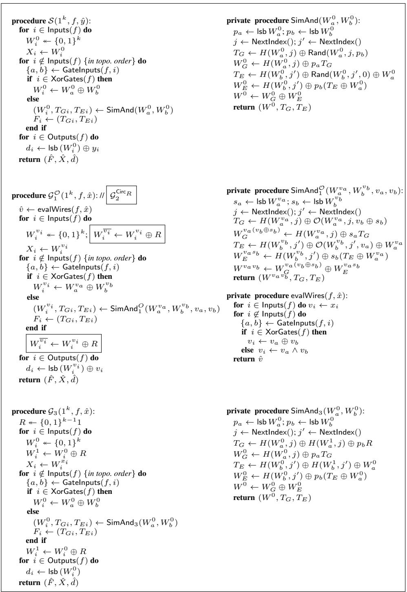

# Two Halves Make a Whole Reducing Data Transfer in Garbled Circuits using Half Gates

Samee Zahur, Mike Rosulek, and David Evans

http://MightBeEvil.com/halfgates

University of Virginia {samee,evans}@virginia.edu

Oregon State University rosulekm@eecs.oregonstate.edu

Abstract. The well-known classical constructions of garbled circuits use four ciphertexts per gate, although various methods have been proposed to reduce this cost. The best previously known methods for optimizing AND gates (two ciphertexts; Pinkas et al., ASIACRYPT 2009) and XOR gates (zero ciphertexts; Kolesnikov and Schneider, ICALP 2008) were incompatible, so most implementations used the best known method compatible with free-XOR gates (three ciphertexts; Kolesnikov and Schneider, ICALP 2008). In this work we show how to simultaneously garble AND gates using two ciphertexts and XOR gates using zero ciphertexts, resulting in smaller garbled circuits than any prior scheme. The main idea behind our construction is to break an AND gate into two half-gates — AND gates for which one party knows one input. Each half-gate can be garbled with a single ciphertext, so our construction uses two ciphertexts for each AND gate while being compatible with free-XOR gates. The price for the reduction in size is that the evaluator must perform two cryptographic operations per AND gate, rather than one as in previous schemes. We experimentally demonstrate that our garbling scheme leads to an overall decrease in time (up to 25%), bandwidth (up to 33%), and energy use (up to 20%) over several benchmark applications. We show that our construction is optimal for a large class of garbling schemes encompassing all known practical garbling techniques.

## 1 Introduction

Yao’s garbled circuit technique remains one of the most promising and actively studied methods for secure multi-party computation. The first implementation of secure twoparty computation (2PC) [26] used Yao’s basic garbled circuit approach, and it remains the primary (but not only) paradigm for the many 2PC implementations that have been developed over the past ten years [25, 28, 10, 14, 21, 12]. Because the generation and execution of gates benefits from advances in processor speed (in particular, hardware support for cryptographic operations) as well as the increasing availability of large numbers of cores, the computation time and cost for garbled circuit protocols has dropped dramatically. Thus, the main bottleneck for 2PC protocols is network bandwidth which is predominantly due to the transmission of garbled gates. Many optimizations in 2PC have focused on reducing the size of the garbled circuits themselves [27, 20, 19] and reducing the number of circuits required (in the case of malicious security) [24, 29, 22, 15, 6]. Our work reduces the overall size of garbled circuits by reducing the amount of data that needs to be transferred for each garbled gate.

## 1.1 Background

We assume some familiarity with garbled circuit constructions (for a comprehensive treatment of Yao’s classical construction see Lindell and Pinkas [23]). In a garbled gate, each wire of the (Boolean) circuit is associated with two random strings/keys called wire labels which encode TRUE and FALSE. In the “classical” construction of garbled circuits, the sender provides a garbled truth table for each gate, where each combination of input wire labels is used to encrypt the appropriate output wire label. Hence, there are four “ciphertexts” per gate — one for each input combination to the gate — and the evaluator who only knows one label for each input wire can only open one of them. In general, we will measure the size of a garbled gate in units of such “ciphertexts.”

We now give a brief history of work reducing the data needed to transmit a garbled gate, summarized in Table 1. In the point-and-permute optimization, introduced by Beaver, Micali and Rogaway [3], a select bit is appended to each wire label, so that the two labels on each wire have opposite select bits. The association between select bits and logical truth values is random and secret, but the garbled truth table can be arranged by these public select bits. While the result is still four ciphertexts per gate, the ciphertexts no longer need to be from a CPA-secure encryption scheme (and this indeed leads to a reduction in concrete size). Rather, they can be of the form $H ( A \| B ) \mathbb { \oplus }$ $C ,$ where A, B, and $C$ are wire labels, and H is a hash function or key-derivation function. Further, instead of trying all four ciphertexts, the evaluator can simply select the appropriate one based on the select bits of visible wire labels.

Naor, Pinkas and Sumner introduced garbled row-reduction as a way to reduce the number of ciphertexts per gate [27]. Instead of choosing random wire labels for each wire, one of the wire labels is chosen as $H ( A \| B )$ , where A and B are labels of the input wires. Thus, one of the four ciphertexts in each gate (say, the first one) will always be the all-zeroes string and does not need to be sent. We call this method GRR3 since only three ciphertexts need to be transmitted for each gate. Going even further, Pinkas et al. [28] describe a way, which we denote GRR2, to further reduce each gate to 2 ciphertexts, applying a polynomial interpolation at each gate.

<table><tr><td rowspan="3">technique</td><td colspan="2">size per gate</td><td colspan="4">calls to H per gate</td></tr><tr><td></td><td></td><td colspan="2">generator</td><td colspan="2">evaluator</td></tr><tr><td>XOR</td><td>AND</td><td>XOR</td><td>AND</td><td>XOR</td><td>AND</td></tr><tr><td>classical [31]</td><td>4</td><td>4</td><td>4</td><td>4</td><td>4</td><td>4</td></tr><tr><td>point-permute [3]</td><td>4</td><td>4</td><td>4</td><td>4</td><td>1</td><td>1</td></tr><tr><td>row reduction (GRR3) [27]</td><td>3</td><td>3</td><td>4</td><td>4</td><td>1</td><td>1</td></tr><tr><td>row reduction (GRR2) [28]</td><td>2</td><td>2</td><td>4</td><td>4</td><td>1</td><td>1</td></tr><tr><td>free XOR + GRR3 [20]</td><td>0</td><td>3</td><td>0</td><td>4</td><td>0</td><td>1</td></tr><tr><td>fleXOR [19]</td><td>{0, 1, 2}</td><td>2</td><td>{0, 2, 4}</td><td>4</td><td>{0, 1, 2}</td><td>1</td></tr><tr><td>half gates [this work]</td><td>0</td><td>2</td><td>0</td><td>4</td><td>0</td><td>2</td></tr></table>

Table 1. Optimizations of garbled circuits. Size is number of “ciphertexts” (multiples of k bits).

Kolesnikov and Schneider [20] introduced the free-XOR technique. The idea is to choose all wire labels of the form $( A , A \oplus R )$ , where R is secret and common to all wires. An evaluator who has one of $( A , A \oplus R )$ and one of $( B , B \oplus R )$ , can perform the XOR operation simply by XORing the two wire labels. The result will be either C or C ⊕ R (where $C = A \oplus B )$ , which correctly represents the result. Hence, no ciphertexts are required at all for an XOR gate. This technique is compatible with GRR3 for AND gates, but not GRR2. The reason is that the GRR2 technique chooses both output wire labels of a gate as fixed pseudorandom functions of the input wire labels. Hence, it is not possible to guarantee that the output wire labels are of the form $( C , C \oplus R )$ for some pre-specified R.

Kolesnikov, Mohassel, and Rosulek [19] proposed a generalization of free-XOR caled fleXOR. In fleXOR, an XOR gate can be garbled using 0, 1, or 2 ciphertexts, depending on structural and combinatorial properties of the circuit. However, fleXOR can be made compatible with GRR2 applied to the AND gates. For circuits with many AND gates, this method results in smaller circuits than with free-XOR (while the construction can actually collapse to free-XOR in other cases).

## 1.2 Our Contributions

Half-gates. We present a method for garbling AND gates that requires only two ciphertexts. However, unlike the GRR2 method, our method is compatible with free-XOR. That is, our method can guarantee that the output wires of an AND gate are indeed of the form $( C , C \oplus R )$ , when the input wires are also of this form.

The main insight is to employ what we call half-gates: AND gates for which one party knows one of the inputs. We show how to garble generator half-gates and evaluator half-gates using one ciphertext each, in a way that is compatible with free-XOR. We then show how an AND gate can be written as a combination of XORs and two halfgates of opposite orientations. Hence, the resulting AND gate uses only two ciphertexts in combination with free-XOR. We prove the security of our scheme in Section 4.

For all circuits, our half-gate technique leads to smaller garbled circuits than all previous methods (i.e., our row of Table 1 dominates all other rows). For many circuits (i.e., those for which free-XOR previously gave the smallest garbled circuits), our work gives a 33% reduction in garbled circuit size (and thus a similar reduction in cost for most protocols that rely on garbled circuits). This leads to reductions in overall latency (up to 25% in our benchmarks), as well as energy (which is the primary concern for data centers as well as mobile devices) since the extra computation required to compute the hash function twice is more than offset by the energy savings of reduced bandwidth. We provide experimental results in Section 5.

Privacy-free garbling. Frederiksen, Nielsen, and Orlandi [8] showed that garbling schemes that satisfy only the authenticity security property (i.e., not the privacy property) can be significantly smaller than their fully-secure counterparts. These privacyfree schemes are useful in settings where the evaluator knows the entire (cleartext) input to the garbled circuit, as in the highly efficient zero-knowledge proof protocol of Jawurek, Kerschbaum and Orlandi [18].

<table><tr><td rowspan="3">technique</td><td colspan="2">size per gate</td><td colspan="4">calls to H per gate</td></tr><tr><td></td><td></td><td colspan="2">sender</td><td colspan="2">receiver</td></tr><tr><td>XOR</td><td>AND</td><td>XOR</td><td>AND</td><td>XOR</td><td>AND</td></tr><tr><td>row reduction (GRR1)</td><td>1</td><td>1</td><td>0</td><td>3</td><td>0</td><td>1</td></tr><tr><td>free XOR + GRR2</td><td>0</td><td>2</td><td>0</td><td>3</td><td>0</td><td>1</td></tr><tr><td>fleXOR</td><td>{0, 1, 2}</td><td>1</td><td>0</td><td>3</td><td>0</td><td>1</td></tr><tr><td>half gates [this work]</td><td>0</td><td>1</td><td>0</td><td>2</td><td>0</td><td>1</td></tr></table>

Table 2. Optimizations of privacy-free garbled circuits. Size is number of ciphertexts (multiples of k bits). The three prior schemes are from Frederiksen, Nielsen, and Orlandi [8].

Table 2 summarizes the three privacy-free garbling schemes introduced by Frederiksen, Nielsen, and Orlandi [8], which are adaptations of fully-secure schemes. Their GRR1 construction garbles all gates at a cost of one ciphertext each. Their free-XOR adaptation garbles AND gates at a cost of two ciphertexts each (with XOR gates free). Their fleXOR adaptation garbles AND gates using one ciphertext each, with XOR gates costing 0, 1, or 2 ciphertexts each.

In Section 6, we show that our approach with half-gates also gives a similar improvement in this setting. We can simply garble all AND gates using our evaluator half-gate. In this setting, the evaluator knows both inputs to all gates, but we only need to take advantage of its knowledge of one of the inputs to reduce the size of garbled AND gates to one ciphertext. Overall, we achieve a privacy-free garbled circuit containing one ciphertext per AND gate, and no ciphertexts for XOR gates. As for standard grabled circuits, our half-gates approach is strictly better than all previous constructions. For example, we reduce the size of a privacy-free garbled circuit for AES by 50%.

Optimality. For prior garbling schemes that we described above, it was always possible to reduce the size of garbled AND gates by one ciphertext by sacrificing compatibility with free-XOR. Given that we can now garble AND gates with two ciphertexts in a way that is compatible with free-XOR, one might wonder whether it is possible to garble an AND gate with just one ciphertext, in a way that is incompatible with free-XOR.

In Section 7, we show that in a reasonable model that captures all existing techniques, it is not possible to garble an AND gate (with privacy) using just one ciphertext, even if compatibility with free-XOR is sacrificed. Hence, our construction gives optimally-sized garbled circuits, among garbling schemes whose gate-by-gate operations fall within our model.

To show optimality, we introduce a new methodology for stating and proving such quantitative lower bounds on the size of garbled gates. We observe that all existing techniques for practical garbling (including our own) are linear in a certain sense. We formalize these techniques in a linear class of garbling schemes, and show that these schemes require two ciphertexts for a single AND gate. These lower bounds suggest that any practical improvement over our scheme will require a dramatically different approach to garbled circuits in general.

## 2 Preliminaries

We use the garbling schemes abstraction introduced by Bellare, Hoang, and Rogaway [5]. Roughly speaking, a garbling scheme consist of the following algorithms:1

Gb: On input $1 ^ { k }$ and a boolean circuit $f ,$ outputs $( F , e , d )$ , where $F$ is a garbled circuit, e is encoding information, and d is decoding information.

En: On input $( e , x )$ , where $e$ is as above and x is an input suitable for $f ,$ outputs a garbled input X.

Ev: On input $( F , X )$ as above, outputs a garbled output $Y$

De: On input $( d , Y )$ as above, outputs a plain output y.

The correctness property is that, if $( F , e , d ) \gets \mathsf { G b } ( 1 ^ { k } , f )$ then for all x:

$$
\mathsf {D e} (d, \mathsf {E v} (F, \mathsf {E n} (e, x))) = f (x)
$$

Additionally, several security properties are described:

Privacy $( \mathsf { p r v } . \mathsf { s i m } _ { s } ) \colon$ Intuitively, the collection $( F , X , d )$ should not reveal any more information about x than $f ( x )$ . More concretely, there must exist a simulator $s$ that takes input $( 1 ^ { k } , f , f ( x ) )$ and whose output is indistinguishable from $( F , X , d )$ generated the usual way.

Obliviousness (obv.simS ): Intuitively, $( F , X )$ should reveal no information about $x .$ More concretely, there must exist a simulator $s$ that takes input $( 1 ^ { k } , f )$ and whose output is indistinguishable from $( F , X )$ generated the usual way.

Authenticity (aut): Given input $( F , X )$ alone, no adversary should be able to produce $\tilde { Y } \neq \mathsf { E v } ( F , X )$ such that $\mathsf { D e } ( d , \tilde { Y } ) \neq \perp$ , except with negligible probability.

A garbling scheme may satisfy any combination of these security properties. See Bellare, Hoang, and Rogaway [5] for the complete treatment of garbling schemes and further relations among the security properties.

## 3 Half-Gates Garbling Scheme

First, we give a high-level and self-contained overview of our construction of half-gates, which form the basis of our improved garbling schemes. Then, we present the details more formally.

## 3.1 Approach

Recall that a half-gate is a garbled AND gate for which one of the parties knows one of the inputs (in the clear). Let’s say we want to compute the gate $c = a \wedge b$ . We are in the free-XOR setting, so let $( A , A \oplus R )$ and $( B , B \oplus R )$ denote the input wire labels to this gate, and $( C , C \oplus R )$ denote the output wire labels, with A, B, and $C$ each encoding FALSE. R is the free-XOR offset common to all wires. Finally, H will denote a hash (or key derivation) function.

We describe how to construct half-gates for two cases: when the garbled-circuit generator knows one of the inputs, and when the evaluator knows one of the inputs.

Generator half-gate. We consider the case of an AND gate $c = a \wedge b ,$ where a and b are intermediate wires in the circuit and the generator somehow knows in advance what the value a will be. Conceptually, when $a = 0$ , the generator will garble a unary gate that always outputs false; when $a = 1$ , the generator will garble a unary identity gate. This idea was also used implicitly by Kolesnikov and Schneider [20, Fig. 2], in the context of programming components of a universal circuit.

Hence, the generator produces the two ciphertexts:

$$
H (B) \oplus C
$$

$$
H (B \oplus R) \oplus C \oplus a R
$$

These are then suitably permuted according to the select bits of B. The evaluator takes a hash of its wire label for B and decrypts the appropriate ciphertext. If $a = 0 ;$ it obtains output wire label C in both values of b. If $a = 1$ , the evaluator obtains either $C$ or $C \oplus R ,$ , depending on the bit b. Intuitively, the evaluator will never know both B and B ⊕ R, hence the other ciphertext appears completely random.

Next, we eliminate one of the ciphertexts by applying a standard idea of garbled row-reduction [27]. Instead of choosing C uniformly, we choose C so that the first of the two ciphertexts is the all-zeroes ciphertext (we choose C as $H ( B ) , H ( B \oplus R )$ , or $H ( B \oplus R ) \oplus R$ , depending on the select bits and the value a). As such, the first ciphertext does not actually need to be sent; in the case where the evaluator would have decrypted the first ciphertext, it infers it to be the all-zeroes string. Overall, this garbled half-gate consists of one ciphertext (k bits). The generator calls H twice; the evaluator calls H once.

Evaluator half-gate. We now consider the case of an AND gate $c = a \wedge b ,$ where a and b are intermediate wires in the circuit and the evaluator will somehow already know the value of a at the time of evaluation.

We exploit the fact that the evaluator can behave differently based on the truth value of a. Intuitively, when $a = 0$ the evaluator should always obtain output wire label $C ;$ when $a = 1$ , it is enough for the evaluator to obtain $\varDelta = C \oplus B$ . It can then XOR ∆ with the other wire label (either B or $B \oplus R )$ to obtain either C or $C \oplus R$ appropriately.

Hence, the generator provides the two ciphertexts:

$$
H (A) \oplus C
$$

$$
H (A \oplus R) \oplus C \oplus B
$$

The ciphertexts do not have to be permuted here. They can be arranged according to the truth value of a as shown here, since the evaluator already knows a. If $a = 0$ , the evaluator uses wire label A to decrypt the first ciphertext. If $a = 1$ , the evaluator uses wire label $A \oplus R$ to decrypt the second ciphertext and XORs the result with the wire label for b.

Again, we can remove the first ciphertext using garbled row-reduction. We choose $C = H ( A )$ so that the first ciphertext becomes all-zeroes and is not sent. Overall, the cost of this garbled half-gate is the same as above: it consists of one ciphertext (k bits). The generator calls H twice; the evaluator calls H once.

Two halves make a whole. Now consider the case where we want to garble an AND gate $c = a \wedge$ b where both inputs are secret. Consider:

$$
\begin{array}{l} c = a \wedge b \\ = a \wedge (r \oplus r \oplus b) \\ = (a \wedge r) \oplus (a \wedge (r \oplus b)) \\ \end{array}
$$

Suppose the generator chooses a uniformly random bit r. In that case, the first AND gate $( a \wedge r )$ can be garbled with a generator-half-gate. If we further arrange for the evaluator to learn the value $r \oplus b ,$ then the second AND gate $( a \land ( r \oplus b ) )$ can be garbled with an evaluator-half-gate. Leaking this extra bit $r \oplus b$ to the evaluator is safe, as it carries no information about the sensitive value b. The remaining XOR is free, and the total cost is two ciphertexts.

We can actually convey $r \oplus b$ to the evaluator without any overhead. The generator will choose r to be the select bit of the false wire label on wire b. For security, select bits of wires are chosen (pseudo)randomly already. Then when a particular value b is on that wire, the evaluator will hold a wire label whose select bit is $b \oplus r$ .

Thus, we garble a (full) AND gate with two ciphertexts, taking the XOR of two half-gates. The generator calls H four times; the evaluator calls H twice.

## 3.2 Details of Our Scheme

We now give a formal description of our garbling scheme, following the basic approach outlined above.

Notation and concepts. For a boolean circuit $f ,$ we associate each wire in the circuit with a numeric index. We let Inputs $( f )$ , Outputs(f ), and $\mathsf { X o r G a t e s } ( f )$ denote the set of wire indices of the input wires, output wires, xor gate output wires, respectively, in $f .$ We abuse notation slightly and extend these functions as Inputs $( { \hat { F } } )$ , $\mathsf { O u t p u t s } ( \hat { F } )$ and $\mathsf { X o r G a t e s } ( \hat { F } )$ , where $\hat { F }$ is a garbled version of $f .$ We use $v _ { i }$ to denote the single-bit plaintext value of the ith wire in a circuit, when the input is understood from context. For non-input wires, we also refer to the ith gate to mean the logic gate whose output wire has index i.

Our garbling scheme follows standard paradigms of the free-XOR & point-andpermute optimizations. We use $W _ { i } ^ { 0 } , W _ { i } ^ { 1 } \in \{ 0 , 1 \} ^ { k }$ to denote the wire labels for FALSE and TRUE, respectively, on the ith wire. Here, and throughout the paper, k denotes the scheme’s security parameter. For each wire label $W$ , its least significant bit lsb $W$ is reserved as a select bit that is used as in the point-and-permute technique. For the ith wire, define $p _ { i } = | { \mathsf { s b } } W _ { i } ^ { 0 }$ . This value, which we call the permute bit of the wire, is a secret known only to the generator. Intuitively, when the evaulator holds a wire label for wire i whose select bit is $s _ { i } ,$ that wire label is $W _ { i } ^ { s _ { i } \oplus p _ { i } }$ , corresponding to truth value $v _ { i } ~ = ~ s _ { i } \oplus p _ { i }$ . In the context of evaluating a garbled circuit, we typically omit the superscript from the wire label notation and write just $W _ { i }$ to indicate the fact that the evaluator indeed does not know $v _ { i }$ .

The value $R \in \{ 0 , 1 \} ^ { k - 1 } 1$ is a circuit-global, randomly chosen free-XOR offset; hence, $W _ { i } ^ { 0 }$ ⊕ $W _ { i } ^ { 1 } ~ = ~ R$ holds for each i in the circuit. We have lsb $R = 1$ so that lsb $W _ { i } ^ { 0 } \neq { }$ lsb $W _ { i } ^ { 1 }$ and complementary wires have opposite select bits.

<table><tr><td>Computes:  $f_{G}(v_{a},p_{b}):=$  $(v_{a} \oplus \alpha_{a})(p_{b} \oplus \alpha_{b}) \oplus \alpha_{c}$ </td></tr><tr><td>Before GRR and permutation: $H(W_{a}^{0}) \oplus f_{G}(0,p_{b})R \oplus W_{Gc}^{0}$  $H(W_{a}^{1}) \oplus f_{G}(1,p_{b})R \oplus W_{Gc}^{0}$ </td></tr><tr><td>After GRR and permutation: $T_{Gc} \leftarrow H(W_{a}^{0}) \oplus H(W_{a}^{1}) \oplus (p_{b} \oplus \alpha_{b})R$  $W_{Gc}^{0} \leftarrow H(W_{a}^{p_{a}}) \oplus f_{G}(p_{a},p_{b})R$ </td></tr><tr><td>Generator sends  $T_{Gc}$ </td></tr></table>

(a) Generator half-gate: $v _ { a }$ known to generator.

<table><tr><td>Computes:  $f_{E}(v_{a}, v_{b} \oplus p_{b}) := (v_{a} \oplus \alpha_{a})(v_{b} \oplus p_{b})$ </td></tr><tr><td>Before GRR: $H(W_{b}^{p_{b}}) \oplus W_{Ec}^{0}$  $H(W_{b}^{p_{b} \oplus 1}) \oplus W_{Ec}^{0} \oplus W_{a}^{\alpha_{a}}$ </td></tr><tr><td>After GRR (permutation not needed): $T_{Ec} \leftarrow H(W_{b}^{0}) \oplus H(W_{b}^{1}) \oplus W_{a}^{\alpha_{a}}$  $W_{Ec}^{0} \leftarrow H(W_{b}^{p_{b}})$ </td></tr><tr><td>Generator sends  $T_{Ec}$ </td></tr></table>

(b) Evaluator half-gate: $v _ { b }$ ⊕ $p _ { b }$ known to evaluator.

Fig. 1. The construction of a non-free binary gate for computing $( v _ { a } , v _ { b } ) \mapsto ( v _ { a } \oplus \alpha _ { a } ) ( v _ { b } \oplus$ $\alpha _ { b } ) \oplus \alpha _ { c } ,$ where $\alpha _ { a } , \alpha _ { b } , \alpha _ { c }$ determines the type of the gate. After the two half-gates are evaluated, output label is obtained by computing $W _ { c } = W _ { G c } \oplus W _ { E c }$ c

Frequently, we will omit ∧ and just juxtapose two symbols to indicate logical AND. So $a b = a \wedge b .$ When a is a single bit and R is a long string, we write aR to mean R when $a \ = \ 1$ and $0 ^ { | R | }$ when $a = ~ 0$ . We write sequences or tuples with a ‘hat’; for example, $\hat { F } = ( F _ { 1 } , F _ { 2 } , \ldots )$ or $\hat { X } = ( X _ { 1 } , X _ { 2 } , . . . )$ .

Finally, we will use $H : \{ 0 , 1 \} ^ { k } \times \mathbb { Z } \mapsto \{ 0 , 1 \} ^ { k }$ to indicate a hash-function suitable for use in garbled circuits (see Section 4 for suitability criteria). In informal discussions, we will often shorten $H ( W _ { i } ^ { b } , j )$ to just $H ( W _ { i } ^ { b } )$ , and it will be implicitly understood that we are using unique, but public, $j$ for different groups of calls to H. In the formal descriptions, the value of $j$ is always explicit.

Arbitrary gates. The approach just described can be used to garble any gate whose truth table contains an odd number of ones (e.g., AND, NAND, OR, NOR, etc.). All such gates can be expressed as the form

$$
\left(v _ {a}, v _ {b}\right) \mapsto \left(\alpha_ {a} \oplus v _ {a}\right) \wedge \left(\alpha_ {b} \oplus v _ {b}\right) \oplus \alpha_ {c}
$$

for constants $\alpha _ { a } , \alpha _ { b } , \alpha _ { c }$ . For example, setting all to 0 results in an AND gate; setting all to 1 results in an OR gate. These α values need not (but can) be secret. We describe the general construction of these gates in Figure 1. We note that the evaluator’s logic does not depend on the α values.

Following the description in Section 3.1, we garble each gate using a composition of two half-gates. Conceptually, $W _ { G i } ^ { b }$ and $W _ { E i } ^ { b }$ denote the output wire labels for these two half-gates (generator-side and evaluator-side, respectively) that comprise the ith gate. $W _ { i } ^ { 0 } = W _ { G i } ^ { 0 } \oplus W _ { E i } ^ { 0 }$ Similarly, we use $T _ { G i }$ and $T _ { E i }$ to denote the single garbled row transmitted for each half gate used in the ith gate.

The first rows of Figure 1 show the function being computed by each half gate. In (a), generator knows $p _ { b }$ while in (b) the evaluator knows $v _ { b } \oplus p _ { b } =$ lsb $W _ { b }$ . The second rows show the two ciphertexts of each half-gate, before they are permuted according to their select bits (in case of (a)) and before garbled row reduction (GRR) is applied. Here, $W _ { G c } ^ { f ( x , p _ { b } ) }$ $W _ { G c } ^ { 0 } \oplus f ( x , p _ { b } ) R$ the next step. The third rows show the final result.

The complete scheme. The full garbling procedure for an entire circuit is shown in Figure 2. The scheme works for any binary gate, but for simplicity of discussion and proof we assume all gates are either AND or XOR.

procedure Gb(1 $^{k}$ , f):
    R ← {0, 1} $^{k-1}$ 1
    for i ∈ Inputs(f) do
    W $_{i}^{0}$ ← {0, 1} $^{k}$ W $_{i}^{1}$ ← W $_{i}^{0}$ ⊕ R
    e $_{i}$ ← W $_{i}^{0}$ for i∉Inputs(f) {in topo. order} do
    {a, b} ← GateInputs(f, i)
    if i ∈ XorGates(f) then
    W $_{i}^{0}$ ← W $_{a}^{0}$ ⊕ W $_{b}^{0}$ else
    (W $_{i}^{0}$ , T $_{Gi}$ , T $_{Ei}$ ) ← GbAnd(W $_{a}^{0}$ , W $_{b}^{0}$ )
    F $_{i}$ ← (T $_{Gi}$ , T $_{Ei}$ )
    end if
    W $_{i}^{1}$ ← W $_{i}^{0}$ ⊕ R
    for i ∈ Outputs(f) do
    d $_{i}$ ← lsb(W $_{i}^{0}$ )
    return (F, e, d)
private procedure GbAnd(W $_{a}^{0}$ , W $_{b}^{0}$ ):
    p $_{a}$ ← lsb W $_{a}^{0}$ ; p $_{b}$ ← lsb W $_{b}^{0}$ j ← NextIndex(); j' ← NextIndex()
    {First half gate}
    T $_{G}$ ← H(W $_{a}^{0}$ , j) ⊕ H(W $_{a}^{1}$ , j) ⊕ p $_{b}$ R
    W $_{G}^{0}$ ← H(W $_{a}^{0}$ , j) ⊕ p $_{a}$ T $_{G}$ {Second half gate}
    T $_{E}$ ← H(W $_{b}^{0}$ , j') ⊕ H(W $_{b}^{1}$ , j') ⊕ W $_{a}^{0}$ W $_{E}^{0}$ ← H(W $_{b}^{0}$ , j') ⊕ p $_{b}$ (T $_{E}$ ⊕ W $_{a}^{0}$ )
    {Combine halves}
    W $^{0}$ ← W $_{G}^{0}$ ⊕ W $_{E}^{0}$ return (W $^{0}$ , T $_{G}$ , T $_{E}$ )
procedure En(e, x):
    for e_i ∈ ê do
    X_i ← e_i ⊕ x_i R
    return X̂
procedure De(d, Y):
    for d_i ∈ d̂ do
    y_i ← d_i ⊕ lsb Y_i
    return ŷ
procedure Ev(F, X̂):
    for i ∈ Inputs(F̂) do
    W_i ← X_i
    for i∉Inputs(F̂) {in topo. order} do
    {a, b} ← GateInputs(F̂, i)
    if i ∈ XorGates(F̂) then
    W_i ← W_a ⊕ W_b
    else
    s_a ← lsb W_a; s_b ← lsb W_b
    j ← NextIndex(); j' ← NextIndex()
    (T_Gi, T_Ei) ← F_i
    W_Gi ← H(W_a, j) ⊕ s_a T_Gi
    W_Ei ← H(W_b, j') ⊕ s_b(T_Ei ⊕ W_a)
    W_i ← W_Gi ⊕ W_Ei
end if
for i ∈ Outputs(F̂) do
    Y_i ← W_i
return Ŷ  
Fig. 2. Our complete garbling scheme. NextIndex is a stateful procedure that simply increments an internal counter.

## 4 Security

We now prove the security of our scheme, using the prv.simS and obv.simS security definitions of Bellare, Hoang, and Rogaway [5]. The scheme shown in Figure 2 does not provide authenticity, simply because authenticity is not required in many use cases including semi-honest Yao’s circuits. However, there are well-known, standard modifications to the decoding procedure that can add authenticity, which we describe separately in Section 4.3. Finally, since we only consider circuits with just AND and XOR gates, everything about the function f is public and we do not define a separate function $\varPhi ( f )$ to extract public information about $f .$ .

## 4.1 Circular Correlation Robustness for Naturally Derived Keys

We first describe the security property required of the hash/key-derivation function H. Roughly speaking, we can use either a circular-correlation-robust hash function, as defined by Choi et al. [7], or a Davis-Meyer construction in the ideal random permutation model [4]. Note that a result of using half gates is we need arguably simpler singlekey functions instead of the previously proposed dual-key ones. So, we first present the single-key analogs of these two definitions. Then we define a weaker notion of security that is satisfied by both these classes of hash functions. Functions satisfying this new notion of security will be said to have circular correlation robustness for naturally derived keys. Finally we show that our garbling scheme is secure given any hash function that satisfies this new, weaker notion of security.

Circular correlation robustness. We revisit the definition of circular correlation robustness. The definition is the same as the one introduced in [7], except that we are able to simplify the notation for H that takes only one wire label / key. Given a hash function H, we define two oracles:

$- \ \mathsf { C i r c } _ { R } ( x , i , b ) = H ( x \oplus R , i ) \oplus b R ,$ , where $R \in \{ 0 , 1 \} ^ { k - 1 } 1$  
– Rand(x, i, b): random function with k-bit output.

Definition 1. Say that a sequence of oracle queries of the form $( x , i , b )$ is legal if the same value of $( x , i )$ is never queried with different values of b. Then H is circular correlation robust if, for all all polynomial-time adversaries A making legal queries,

$$
\left| \operatorname * {P r} _ {R} [ \mathcal {A} ^ {\text { Circ } _ {R}} (1 ^ {k}) = 1 ] - \operatorname * {P r} _ {\text { Rand }} [ \mathcal {A} ^ {\text { Rand }} (1 ^ {k}) = 1 ] \right| \text {   is   negligible. }
$$

The restriction to legal queries prevents the adversary from trivially finding R. Note that for the single-key version here we do not need an extra parameter a to produce values of the form $H ( x \oplus a R , i ) \oplus b R$ , since the definitions in Choi et al. [7] would have made it illegal to use $a = 0$ anyway.

Finally, we emphasize that the adversary is allowed unrestricted access to H. Thus, modeling H as a random oracle, the adversary has oracle access to H in addition to the oracle in the experiment. In the standard model, the adversary is allowed to depend arbitrarily on H.

Constructions from ideal permutations. Bellare et al. [4] construct a gate-level cipher in the ideal random permutation model. In this model, all parties have access to a randomly chosen permutation $\pi : \{ 0 , 1 \} ^ { k } \to \{ 0 , 1 \} ^ { k }$ and its inverse $\pi ^ { - 1 }$ . This is meant to model a setting where a garbling scheme is based on AES with a (public) fixed key, which can be implemented very efficiently with AES-NI instructions.

Bellare et al. [4] do not abstract a concrete security property that their hash function must satisfy. Instead, they describe how to construct their hash function, and prove security of the entire garbling scheme directly from the underlying assumption of a random permutation. Our ultimate abstraction (robustness for naturally derived keys) can be seen as a formalization of the properties of H actually used in their proofs.

We first describe the hash function of [4], altered for our single-key setting:

Definition 2. For a random permutation $\pi : \{ 0 , 1 \} ^ { k } \mapsto \{ 0 , 1 \} ^ { k }$ , we define the hash function $H _ { \pi } ( x , i )$ to be $\pi ( K ) \oplus K$ where $K = 2 x \oplus i .$

For concreteness, 2x refers to doubling in $\mathrm { G F } ( 2 ^ { k } )$ . However, there are many alternative ways of constructing $H _ { \pi }$ from π, which do not affect our proof. We refer the reader to Bellare et al. [4] for these alternate constructions and how they affect the exact constants on the security bounds. We also point out that in the following, the adversary is assumed to have access to π and π−1. $\pi ^ { - 1 }$

Our abstraction. We now define a security notion that is satisfied by both of the above constructions.

Definition 3. Say that a sequence of queries of the form $( x , i , b )$ to an oracle O are natural if they satisfy the following:

– for the qth query, we have $i = q .$ .  
$- \ b \in \{ 0 , 1 \}$  
– x is naturally derived, meaning that it is obtained from one of these operations:

• $x \gets \{ 0 , 1 \} ^ { k }$  
• $x  x _ { 1 } \oplus x _ { 2 } ,$ , where $x _ { 1 }$ and $x _ { 2 }$ are naturally derived  
• $x \gets H ( x _ { 1 } , i )$ , where $x _ { 1 }$ is naturally derived and $i \in \mathbb { Z }$  
• $x  \mathcal { O } ( x _ { 1 } , i , b )$ where $x _ { 1 }$ is naturally derived.

Then H is circular correlation robust for natural keys $i f ,$ for all all polynomial-time adversaries A making natural queries,

$$
\left| \operatorname * {P r} _ {R} [ \mathcal {A} ^ {\text { Circ } _ {R}} (1 ^ {k}) = 1 ] - \operatorname * {P r} _ {\text { Rand }} [ \mathcal {A} ^ {\text { Rand }} (1 ^ {k}) = 1 ] \right| \text {   is   negligible. }
$$

Note that these restrictions only apply when querying O — the adversary is still allowed to make unrestricted queries to H directly (and $\pi , \pi ^ { - 1 }$ in the ideal permutation model). While it is a weak notion of security (since the adversary is very restricted), it turns out to be enough to prove security of our garbling scheme (Section 4.2).

Achieving the definition. While it is evident that circular correlation robustness against naturally derived keys is a restricted version of circular correlation robustness defined in Definition 1, it may not be as obvious that the $H _ { \pi }$ ideal permutation construction satisfies this notion.

Intuitively, the purpose of the naturally-derived restrictions is to make it unlikely that the adversary can ever query O with both $( x , i , b )$ and $( x ^ { \prime } , i ^ { \prime } , b ^ { \prime } )$ where $2 x \oplus i =$ $2 x ^ { \prime } \oplus i ^ { \prime }$ even though $( x , i ) \neq ( x ^ { \prime } , i ^ { \prime } )$ . That would have created a problem in the case where $\mathcal { O }$ uses $H _ { \pi }$ . This would in turn invoke $\pi ( 2 x \oplus 2 R \oplus i ) = \pi ( 2 x ^ { \prime } \oplus 2 R \oplus i ^ { \prime } )$ . If the adversary uses $b \neq b ^ { \prime }$ then the responses to these queries reveal $R .$

The proof that the $H _ { \pi }$ construction achieves our definition in the ideal permutation model basically follows directly from the security proofs in Bellare et al. [4]. There, the bulk of the proofs are devoted to bounding the probability of the adversary making a query of the above form. They use only the fact that wire labels in their constructions are naturally derived, in our terminology (or, at least, the obvious generalization of naturally-derived to the two-key setting).

Following their proofs, one can work out the advantage of an adversary that makes q queries to the oracle O and Q queries to $\pi , \pi ^ { - 1 }$ , in our security game. The advantage comes out to be $O ( ( q Q + q ^ { 2 } ) / 2 ^ { k } )$ ). The quadratic terms in that expression come from the birthday bounds of hash functions with k-bit output. We did not derive the exact constants since, in practice, much larger constants are likely to arise when π is replaced by a concrete function (e.g. AES). In any case, it is negligible in $k ,$ and therefore satisfies our notion of security.

## 4.2 Proof of Privacy and Obliviousness

The first thing to note is that we can easily rewrite the scheme in Figure 2 such that it only uses R through the oracle Circ ${ \bf \nabla } \cdot R \cdot { \bf \nabla }$ . In particular, we can rewrite the assignments to $T _ { G i }$ and $T _ { E i }$ as:

$$
T _ {G i} \leftarrow H (W _ {a} ^ {0}, j) \oplus \operatorname{Circ} _ {R} (W _ {a} ^ {0}, j, p _ {b})
$$

$$
T _ {E i} \leftarrow H (W _ {b} ^ {0}, j ^ {\prime}) \oplus \mathsf {C i r c} _ {R} (W _ {b} ^ {0}, j ^ {\prime}, 0) \oplus W _ {a} ^ {0}
$$

Moreover, observe that we are only ever invoking $\mathsf { C i r c } _ { R }$ with naturally derived keys, assuming NextIndex returns sequential integers. This is partly why we did not write the assignments to $W _ { G i } ^ { 0 }$ and $W _ { E i } ^ { 0 }$ in Figure 2 more naturally using if statements conditioned on $p _ { a }$ and $p _ { b } -$ we did not want to repeat $j$ values between oracle calls. Second, we no longer need to explicitly use $R$ anywhere in Gb outside of the oracle $( W _ { i } ^ { 1 }$ values are no longer needed).

Theorem 1. Our scheme satisfies the security notion of obv.simS and prv.sim $\mathsf { I } _ { \boldsymbol { S } }$ with any H that has correlation robustness for naturally derived keys.

Proof. The proof for obv.simS is identical to that of prv.sim $^ { 1 } s \cdot$ except that the simulator does not receive $\hat { y }$ and does not need to compute ${ \hat { d } } .$ So we will only provide the proof for prv.sim $\mathsf { \Pi } _ { \mathsf { \Lambda } } ^ { \mathsf { \Lambda } } \mathsf { \Lambda } ^ { \mathsf { \Lambda } }$ . To prove indistinguishability between the simulator (Figure 3) and the real protocol (Figure 1) we use the following chain of hybrids:

  
Fig. 3. The simulator for prv.simS security, and the hybrids used in the proof.

1. ${ \mathcal { S } } \equiv { \mathcal { G } } _ { 1 } ^ { \mathsf { R a n d } }$ : Both generate uniformly random values for each of the components in $( \hat { F } , \hat { X } , \hat { d } )$ , and are therefore identically distributed. More concretely, $\mathcal { G } _ { 1 }$ uses $\hat { x }$ to determine a truth value $v _ { i }$ on each wire (via evalWires). Yet these truth values vˆ are used only as a superscript for $W _ { i } ^ { v }$ . We could have obtained the same result if we had named these variables $W _ { i } ^ { 0 }$ for all i instead of $W _ { i } ^ { v _ { i } }$ . In Figure $3 , { \mathcal { G } } _ { 1 }$ does not include the boxed statements.  
2. $\mathcal { G } _ { 1 } ^ { \mathsf { R a n d } } \approx \mathcal { G } _ { 1 } ^ { \mathsf { C i r c } _ { R } }$ : We have just changed the oracle O from Rand to $\mathsf { C i r c } _ { R } .$ . These two hybrids are indistinguishable simply by our assumption about the hash function.  
3. $\check { \mathcal { G } } _ { 1 } ^ { \mathsf { C i r c } _ { R } } \equiv \mathcal { G } _ { 2 } ^ { \mathsf { C i r c } _ { R } } ;$ $\mathcal { G } _ { 2 }$ $\mathcal { G } _ { 1 }$ We let the variable R in $\mathcal { G } _ { 2 }$ refer to the R of the oracle $\mathsf { C i r c } _ { R } .$ .  
The only difference between these two is that $\mathcal { G } _ { 2 }$ computes some extra values that are never used (they will be used in $\mathcal { G } _ { 3 } )$ . We couldn’t compute these earlier since we couldn’t use R while performing the previous step of the hybrid.  
4. $\mathcal { G } _ { 2 } ^ { \sf C i r c _ { R } } \equiv \mathcal { G } _ { 3 } \colon \mathcal { G } _ { 3 }$ induces identical distributions on all of the variables $( W _ { i } ^ { 0 } , W _ { i } ^ { 1 }$ , $T _ { G i } ,$ , and $T _ { E i } )$ , but does so without explicitly having to compute $v _ { i }$ for non-input wires. For example, instead of randomly sampling $\bar { W } _ { i } ^ { v _ { i } }$ and then setting ${ W _ { i } ^ { \overline { { { v _ { i } } } } ^ { - } } } $ $W _ { i } ^ { v _ { i } } \oplus R , \mathcal { G } _ { 3 }$ randomly samples $W _ { i } ^ { 0 }$ and then sets $W _ { i } ^ { 1 }  W _ { i } ^ { 0 } \oplus R$ . The algebraic relationships between each variable are still unchanged. We have also expanded the oracle calls in $\mathsf { S i m A n d _ { 3 } }$ to correspond to $\mathcal { O } = \mathsf { C i r c } _ { R }$ .

Finally, $\mathcal { G } _ { 3 }$ computes $( \hat { F } , \hat { X } , \hat { d } )$ as $( \hat { F } , \hat { e } , \hat { d } ) \gets \mathsf { G b } ( 1 ^ { k } , f ) ; \hat { X } \gets \mathsf { E n } ( \hat { e } , x )$ . This is precisely how these values are computed in the real interaction in the prv.sim $^ { 1 } { s }$ game. This completes our proof.

## 4.3 Obtaining Authenticity

In the aut security game defined by Bellare et al. [5], an adversary is given $( \hat { F } , \hat { X } )$ . It is necessary to show that the adversary cannot produce $\tilde { Y } \neq \mathsf { E v } ( \hat { F } , \hat { X } )$ such that $\mathsf { D e } ( \hat { d } , \tilde { Y } ) \neq \perp$ , except with negligible probability. This is clearly not the case for the scheme as we present it in Figure 2; in fact, De never returns ⊥.

To achieve authenticity, we modify the scheme as described in Figure 4.

Theorem 2. Our modified scheme (Figure 4) satisfies the security notion of aut with any H that has correlation robustness for naturally derived keys.

<table><tr><td colspan="3">procedure De(ˆd,ˆY):</td></tr><tr><td>{modify final loop of Gb:}</td><td>for d_i ∈ˆdo</td><td>{modify final loop of S:}</td></tr><tr><td>for i ∈ Outputs(f) do</td><td>j ← NextIndex()</td><td>for i ∈ Outputs(f) do</td></tr><tr><td>j ← NextIndex()</td><td>parse (h0,h1) ← di</td><td>j ← NextIndex(); h ← {0,1}^k</td></tr><tr><td>di← (H(Wi0,j), H(Wi1,j))</td><td>if H(Yi,j) = h0 then yi← 0</td><td>if yi=0</td></tr><tr><td></td><td>else if H(Yi,j) = h1 then yi← 1</td><td>then di← (H(Wi0,j),h)</td></tr><tr><td></td><td>else return ⊥</td><td>else di← (h,H(Wi0,j))</td></tr><tr><td></td><td>returnˆy</td><td></td></tr></table>

Fig. 4. Changes to our scheme required to achieve authenticity.

Proof (Proof Sketch). Consider an interaction in which we run the prv.sim-simulator S (with the change described in Figure 4) to generate $( \hat { F } , \hat { X } , \hat { d } )$ . We give $( \hat { F } , \hat { X } )$ to the adversary and use ˆd to run De and check whether the adversary succeeded in violating authenticity. In order to do so, the adversary would have to guess a value h that was chosen in the final loop of S. But these values are independent of the adversary’s view, so this can happen with probability at most $1 / 2 ^ { k }$ . The rest of the proof follows an identical sequence of hybrids as the proof of Theorem 1. Eventually, we reach an interaction that is identical to the aut game played against the adversary. By the indistinguishability of the hybrids, the adversary’s success probability must be negligible. Note that the changes we have made to the scheme and simulator still allow the steps in the proof to retain naturally derived accesses to the oracles.

## 5 Performance Comparison

We evaluate the performance of our scheme in comparison to previous garbling schemes using both analytical and experimental measurements.

Table 3 shows computations of the raw garbled circuit size in our scheme, calculated for several circuit designs. The table is derived from the one provided with fleXOR [19]; the circuits were obtained from [30, 11]. Our technique outperforms all previous garbling schemes in this metric, achieving the expected maximum of 33% gain for most circuits. There are some AND-intensive circuits (e.g., the DES circuit used here) for which the previous fleXOR technique already does well, but we manage to improve a little upon that as well.

We selected a smaller, well-studied set of benchmark circuits for experimental evaluation. The aim here was to understand the cost tradeoffs for our scheme more clearly, in the context of a secure two-party computation protocol. In our scheme the evaluator performs one extra hash operation per gate while reducing network usage. Therefore, it is possible that we end up paying more in terms of computational resources, such as energy used.

Table 4 shows our measurements. Details of our experimental setup are provided below. We see that our scheme significantly reduces the total time and energy used by the evaluator in every test of the protocol. In our tests, we found that our scheme actually increased the power usage (i.e., higher wattage), but the increase was more than offset by the reduced runtime (i.e., lower total energy). It is conceivable that a very slow evaluator connected to a very fast LAN may not enjoy the same reduction in energy usage, but we did not have the equipment to run such a test and such a scenario seems unlikely to occur in practice. If the two parties have symmetric computational power, however, our protocol should always be better since the computational bottleneck would be the generator, who is performing four calls to H per AND gate in all schemes.

<table><tr><td>circuit</td><td colspan="3">GRR2 [28] free-XOR [20] fleXOR [19]</td><td colspan="2">this work ↓%</td></tr><tr><td>DES</td><td>2.0</td><td>2.79</td><td>1.89</td><td>1.86</td><td>1%</td></tr><tr><td>AES</td><td>2.0</td><td>0.64</td><td>0.72</td><td>0.42</td><td>33%</td></tr><tr><td>SHA-1</td><td>2.0</td><td>1.82</td><td>1.39</td><td>1.21</td><td>12%</td></tr><tr><td>SHA-256</td><td>2.0</td><td>2.05</td><td>1.56</td><td>1.37</td><td>12%</td></tr><tr><td>Hamming distance</td><td>2.0</td><td>0.50</td><td>0.50</td><td>0.33</td><td>33%</td></tr><tr><td>minimum in set</td><td>2.0</td><td>0.87</td><td>0.87</td><td>0.58</td><td>33%</td></tr><tr><td>32 × 32 fast mult</td><td>2.0</td><td>0.90</td><td>0.94</td><td>0.60</td><td>33%</td></tr><tr><td>1024-bit millionaires</td><td>2.0</td><td>1.00</td><td>1.00</td><td>0.67</td><td>33%</td></tr></table>

Table 3. Comparison of garbled circuit size, for selected circuits of interest. Size measured in average number of ciphertexts per gate.

<table><tr><td rowspan="2">Benchmark</td><td colspan="3">Time (s)</td><td colspan="3">Bandwidth (MB)</td><td colspan="3">Energy (kJ)</td></tr><tr><td>Whole</td><td>Half</td><td>↓%</td><td>Whole</td><td>Half</td><td>↓%</td><td>Whole</td><td>Half</td><td>↓%</td></tr><tr><td>Edit distance [14]</td><td>17.8</td><td>13.2</td><td>25.7%</td><td>200.4</td><td>133.6</td><td>33.3%</td><td>1.13</td><td>0.89</td><td>21.0%</td></tr><tr><td>AES [14]</td><td>18.2</td><td>17.0</td><td>7.0%</td><td>115.6</td><td>77.1</td><td>33.3%</td><td>1.25</td><td>1.18</td><td>5.3%</td></tr><tr><td>Set intersection [13]</td><td>37.0</td><td>29.7</td><td>19.7%</td><td>324.5</td><td>219.9</td><td>32.2%</td><td>2.41</td><td>2.03</td><td>15.5%</td></tr></table>

Table 4. Resource usage for three common programs. Edit distance refers to the Levenstein distance between two 200-byte strings. AES refers to 1 block of encryption and key expansion, iterated 10 times. Set intersection is performed on set of 1024, 32-bit integers, iterated 10 times. Each of these 3 jobs were in turn executed 5 times and measured separately, and the numbers are averages over these 5 runs. Whole denotes experimental setup using free-XOR with GRR2, while Half denotes a setup using our half-gates construction.

Experimental Setup. The experiments were performed using the Obliv-C system [32], where we hooked into the protocol execution to implement our own garbling scheme. This allowed us to easily reuse the exact same benchmark programs for both schemes. We executed Yao’s standard semi-honest protocol for 2PC, with a security of 80-bit keys, and compared our scheme to Free-XOR with GRR3 AND gates. In both experimental setups, we used pipelining optimizations [14] and instantiated the H hash function in the garbling scheme using the fixed-key AES construction of [4] (described in Section 4). All measurements (time, network and energy) include the time for performing oblivious transfers and output sharing (which are not affected by the garbling scheme), hence the overall reductions support the argument that bulk of the bandwidth and computation is due to the garbled circuit execution.

The compilation was done using GCC 4.8.2, linked with libgcrypt 1.6.1 (older versions are much slower). We executed the protocol between an Intel Core i7-2600S at 2.8 GHz, running Ubuntu 14.04, and an i7-2600 at 3.4 GHz running Ubuntu 13.10, connected over a LAN. Energy consumption was measured by using an electrical meter plugged in to the wall power outlet for one of the machines — the power meter had an USB interface that allowed us to measure power only for the duration of the job. For all jobs we report the average (time/energy) measurement over five runs, which was more than enough for obtaining statistically significant results (at p < 0.05).

## 6 Privacy-Free Garbling

Jawurek, Kerschbaum, and Orlandi [18] described an elegant and practical zero-knowledge protocol based on garbled circuits. It allows a prover to prove statements of the form $\ { } ^ { \ast } \exists x : C ( x ) = 1 { } ^ { \mathfrak { v } }$ , at a cost of just one garbled circuit for C.

In their protocol, the garbled circuit is evaluated by a prover who knows the entire input to the garbled circuit and the truth value along each wire. Hence, only the authenticity property of garbled circuits is required, and not the privacy property (in the terminology of Bellare et al. [5]). We call a garbling scheme privacy-free if it only satisfies the authenticity property. Frederiksen, Nielsen, and Orlandi [8] showed that privacy-free garbled circuits can be significantly smaller than their full-fledged counterparts.

Very roughly speaking, removing the privacy requirement saves one ciphertext per gate. Frederiksen et al. [8] adapt three garbling schemes to the privacy-free setting: GRR2, free-XOR, and fleXOR. Mirroring the situation with full-fledged garbled circuits, they showed how to garble an AND gate using just one ciphertext (i.e., GRR1), but in a way that is incompatible with free-XOR. When using free-XOR, it was necessary to garble AND gates using two ciphertexts.

Our approach using half-gates can also give a direct improvement in this privacyfree setting. Namely, one can garble a circuit with free-XOR gates, and garble AND gates using our evaluator-half-gate construction. In this setting, the evaluator knows both inputs to every AND gate, though our half-gate only takes advantage of the evaluator’s knowledge of one input. Overall, we can perform privacy-free garbling at a cost of only one ciphertext per AND gate, and no cost for XOR gates. Interestingly, our construction of privacy-free garbling also results in less overall computation than the previous schemes — only two calls to H instead of three.

A summary of our results for privacy-free garbling is given in Table 5. As before, our best improvements in this setting are on circuits for which free-XOR was previously the best approach. Here, the relative improvement is more dramatic: we cut the size of the garbled circuit in half. Concretely, using the protocol of Jawurek, Kerschbaum, and Orlandi [18], it is possible to prove in zero knowledge a statement of the form “I know k such that $\mathrm { A E S } ( k , m ) = c ^ { \ast }$ (for public m, c) by sending only 108 kilobytes of garbled circuit (using 128-bit wire labels; for 80-bit wire labels, the garbled circuit is 68 kilobytes).

<table><tr><td>circuit</td><td colspan="2">GRR1 free-XOR</td><td>fleXOR</td><td>this work</td><td>↓%</td></tr><tr><td>DES</td><td>1.0</td><td>1.86</td><td>0.96</td><td>0.93</td><td>3%</td></tr><tr><td>AES</td><td>1.0</td><td>0.43</td><td>0.51</td><td>0.21</td><td>50%</td></tr><tr><td>SHA-1</td><td>1.0</td><td>1.21</td><td>0.78</td><td>0.61</td><td>22%</td></tr><tr><td>SHA-256</td><td>1.0</td><td>1.37</td><td>0.87</td><td>0.68</td><td>22%</td></tr></table>

Table 5. Comparison of privacy-free garbled circuit size, for selected circuits of interest. Previous constructions and their statistics are from Frederiksen, Nielsen, and Orlandi [8]. Size measured in average number of ciphertexts per gate.

## 7 Lower Bounds on Garbled Circuits

This section introduces a methodology for reasoning about lower bounds on the size of garbled gates and shows that our construction is size-optimal for a large class of garbling schemes, which encompasses all known practical techniques.

When thinking about the size of garbled gates, instead of thinking about free-XOR compatibility, it turns out to be more instructive to think about the degrees of freedom available for choosing a gate’s output wire labels. In the classical scheme that uses four ciphertexts, both output wire labels can be arbitrary; there are two degrees of freedom. In the GRR3 scheme that uses three ciphertexts, one of the output wire labels is fixed as soon as the input wire labels are fixed (since one output wire label is a hash of some input wire labels). Hence there is just one degree of freedom, for choosing the other wire label, and this is typically exploited to ensure free-XOR compatibility. In the GRR2 scheme that uses two ciphertexts, both output wire labels are fixed as soon as the input wire labels are fixed; there are no degrees of freedom. In our construction also, there are no degrees of freedom on the output wire labels. One is chosen as a hash of input wire labels, and, furthermore, the two output wire labels must have the same offset as one of the input wires.

## 7.1 Basic Methodology

There are many techniques that fall under the category of garbling schemes. We wish to focus on techniques based on (fast, practical) symmetric-key primitives only. Hence, in this section we model parties as computationally unbounded entities that can make polynomially many queries to a random oracle. This is the standard setting (initiated by Impagliazzo and Rudich [17]) for proving lower bounds about Minicrypt.2

We wish to prove lower bounds relating to concrete efficiency; for example, prove that it is possible to garble an AND-gate with 2k bits of ciphertext but not with k bits. We say that a garbling scheme has ideal security if no adversary of the above form (computationally unbounded, with bounded queries to a random oracle) has advantage better than $\mathrm { p o l y } ( k ) / 2 ^ { k }$ (rather than negligible) in the security games, where k is the security parameter and output length of the random oracle.

To see why it makes sense to restrict to ideal security in our setting, consider a garbling scheme where, with security parameter $k ,$ we apply our “two-ciphertext” construction for AND gates but with a $k / 2 \AA$ -bit random oracle. The resulting garbled gate is then only k bits, and indeed, no adversary has better than negligible advantage in the appropriate security games. However, it is possible to achieve advantage $\mathrm { p o l y } ( k ) / 2 ^ { k / 2 }$ .

Intuitively, a random oracle with security parameter (output length) k is an object that gives security poly $( k ) / 2 ^ { k }$ . We wish to consider only garbling schemes which do not “cheat” the size of the garbled gates by artificially degrading the security parameter of the random oracle relative to the security parameter of the garbling scheme.

Still, consider a garbling scheme that on security parameter k instantiates an ideally secure garbling scheme on security parameter $k - O ( \log k )$ . The result yields security $\mathrm { p o l y } ( k ) / 2 ^ { { \bar { k } } - O ( \log k ) } = \mathrm { p o l y } ( k ) / 2 ^ { k }$ , satisfying our ideal security definition as well. Hence, even with our model one cannot prove a clean lower bound of the form “2k bits are required for an AND gate.” Rather, one must prove something like $^ { \mathrm { \scriptsize ~ \mathfrak { s e } ~ 2 } k } - O ( \log k )$ bits are required for an AND gate.”3 The special case we consider below, however, is already restricted to schemes whose gates are an integer multiple of k bits.

## 7.2 Linear Garbling Schemes

We first observe that, to the best of our knowledge, all techniques for practical garbling schemes share certain features. Roughly speaking, the Gb and Ev procedures use only linear operations apart from queries to the random oracle (in this setting, we assume a random-oracle instantiation of the scheme), and choosing which linear operation to apply based on select bits of given wire labels (in the case of Ev) or on the association of select bits to TRUE/FALSE (in the case of Gb).

For example:

– In the classical garbling scheme, ciphertexts that comprise the garbled gate are all formed by taking an XOR of oracle responses with wire labels. Similarly, in most other schemes the garbled gate consists of values of the form $H ( A \| B ) \oplus C$ , $H ( A ) \oplus C$ , where $A , B ,$ , and $C$ are wire labels. The select bits and permute bits are used to decide which linear operations to apply (which ciphertext to decrypt in $\mathsf { E v }$ .  
– When using GRR3 row-reduction, one output wire label is chosen as $H ( A \| B )$ , hence linearly in the sense described above. Then behavior in Ev depends on the select bits of the given wire labels (i.e., whether to decrypt a ciphertext or simply take a hash of the input wire labels as the output), but in each case the resulting behavior is linear.  
– In the GRR2 construction [28], generating and evaluating a gate involves interpolating polynomials that pass through points of the form $( t , H ( A \| B ) )$ . Since the values t are fixed, interpolation is a linear operation on outputs of H. Both the garbled gate itself and the output wire labels are the result of such interpolation. In Gb, the choice of which points to interpolate (hence, the choice of which linear operation to perform) depends on the assocation of select bits to TRUE/FALSE.  
– In our scheme, Ev performs an additional XOR depending on the select bits of wire labels.  
– When using free-XOR, wire labels are chosen subject to a linear relation $A _ { 0 } \oplus A _ { 1 } =$ $B _ { 0 } \oplus B _ { 1 }$ .

We also observe the following properties common to existing garbling techniques:

– When garbling a circuit, the gates are processed in topological order. At the time a gate is processed, the labels of its input wires have already been determined, but the output wire labels may be determined as a result of garbling this gate.

– When restricted to operate on a single gate, the queries to the random oracle are made statically. That ${ \mathrm { i s } } ,$ neither Ev nor Gb ever use the result of an oracle query to determine a future oracle query. For many schemes, this property is not true when garbling a larger circuit (an oracle query is used to determine an output wire label, which is then used to determine another oracle query in a downstream gate).

We argue that restrictions of this form capture all existing practical approaches for garbled circuits. Of course, we exclude techniques based on specific algebraic assumptions (e.g., [1, 2]) or more exotic tools like multilinear maps (e.g., [9]) which are arguably impractical and already ruled out by restricting our focus to Minicrypt.

The model. We formalize the observations above as follows. We restrict our focus to garbling schemes that garble a single AND gate. We say that a garbling scheme is linear if its procedures have the following form:

Gb: Parameterized by integers $m , r , q$ and vectors $A _ { 0 } , A _ { 1 } , B _ { 0 } , B _ { 1 } , \{ C _ { a , b , 0 } ~ | ~ a , b \in$ {0, 1}}, $\{ C _ { a , b , 1 } \mid a , b \in \{ 0 , 1 \} \}$ , and $\{ G _ { a , b } ^ { ( i ) } \mid a , b \in \{ 0 , 1 \} , i \in [ m ] \}$ . Each vector is of length $r + q ,$ , with entries in $G F ( 2 ^ { k } )$ .

1. For $i \in [ r ]$ , choose $R _ { i }  G F ( 2 ^ { k } )$  
2. Make q distinct queries to the random oracle (which can be chosen as a deterministic function of the $R _ { i }$ values). Let $Q _ { 1 } , \ldots , Q _ { q }$ denote the responses to these queries. Define $\pmb { S } = ( R _ { 1 } , \ldots , R _ { r } , Q _ { 1 } , \ldots , Q _ { q } )$ . These are the values on which the algorithm acts linearly.  
3. Choose random permute bits $a , b \gets \{ 0 , 1 \}$ for the two input wires.  
4. For $i \in \{ 0 , 1 \}$ , compute $A _ { i } = \langle A _ { i } , { \cal S } \rangle ; B _ { i } = \langle B _ { i } , { \cal S } \rangle ; C _ { i } = \langle C _ { a , b , i } , { \cal S } \rangle$ . Then $\left( A _ { 0 } \| 0 , A _ { 1 } \| 1 \right)$ and $\left( B _ { 0 } \| 0 , B _ { 1 } \| 1 \right)$ ) are taken as the input wire labels to the gate (i.e., the subscripts denote the public select bits), with $A _ { a }$ and $B _ { b }$ corresponding to FALSE. $( C _ { 0 } , C _ { 1 } )$ are the output wire labels with $C _ { 1 }$ corresponding to TRUE.

$i \in [ m ] ,$ $G _ { i } = \langle G _ { a , b } ^ { ( i ) } , S \rangle$ $G _ { 1 } , \ldots , G _ { m }$ garbled circuit.

En: On input $x _ { a } , x _ { b } \in \{ 0 , 1 \}$ , set $\alpha = x _ { a } \oplus a$ and $\beta = x _ { b } \oplus b .$ , where a and b are the permute bits chosen above. Output $A _ { \alpha } \| _ { \alpha }$ and $B _ { \beta } \| \beta$ .

Ev: Parameterized by integer q and vectors $\{ V _ { \alpha , \beta } \mid \alpha , \beta \in \{ 0 , 1 \} \}$ , where each vector is of length $q + m + 2$ .

1. The input are wire labels $A _ { \alpha } \| \alpha , B _ { \beta } \| \beta _ { \mathrm { \scriptsize { t } } }$ , tagged with their corresponding select bits, and the garbled circuit $G _ { 1 } , \ldots , G _ { m }$ .

2. Make $q$ distinct queries to the random oracle (which can be chosen as a deterministic function of the input wire labels). Let $Q _ { 1 } ^ { \prime } , \ldots , Q _ { q } ^ { \prime }$ denote the responses to these queries, and define $\pmb { T } = ( A _ { \alpha } , B _ { \beta } , Q _ { 1 } ^ { \prime } , \dots , Q _ { q } ^ { \prime } , G _ { 1 } , \dots , G _ { m } )$ . These are the values on which Ev acts linearly.

3. Output the inner product $\langle V _ { \alpha , \beta } , T \rangle$ .

In Appendix A we show how well-known previous practical garbling schemes are linear in the above sense.

Limitations. We emphasize that our linear model of garbling schemes is most meaningful when garbling a single atomic gate. This is due to the issue regarding adaptive queries to the random oracle that happen when combining several garbled gates in a larger circuit.

For example, the best known way to garble an N-input AND gate is to garble it as a circuit of $N - 1$ , 2-input AND gates, for a total cost of $2 N - 2$ ciphertexts. But garbling in this way results in adaptive oracle queries, and the resulting scheme is not covered by our current model.

We suspect that it may be possible to augment our proof techniques for larger garbled circuits while accounting for adaptive oracle queries, but we leave this investigation to future work.

## 7.3 Lower Bound

Theorem 3. Every ideally secure garbling scheme for AND gates that is linear in the above sense must have m $\geq 2 .$ . That is, the garbled gate consists of at least 2k bits.

Proof. From the correctness of the scheme, we must have $C _ { ( a \oplus \alpha ) \wedge ( b \oplus \beta ) } = \langle V _ { \alpha , \beta } , { \pmb T } \rangle$ . Let us divide the vector T into a public and private part:

– The public part ${ \pmb T } ^ { p u b }$ of T consists of the wire labels and oracle responses. Without loss of generality, the oracle queries made by Ev are a subset of the queries made by Gb. Any query made by Ev but not Gb will have an answer that is independent of all the activity of Gb. As such, correctness is violated if this oracle response is actually used in the evaluator’s inner product. Hence the public portion of $_ { \mathbf { T } }$ is linear function of S, and that linear function depends only on $\alpha , \beta ,$ , and not the secret permute bits a, b. We write $\pmb { T } ^ { p u b } = \mathbb { M } _ { \alpha , \beta } \stackrel { - } { \times } \pmb { S } ^ { \top }$ .

– The private part $\mathbf { \Delta } \mathbf { T } ^ { p r v }$ of T consists of the garbled circuit components $G _ { i }$ . These are a linear function of S that can depend on the secret permute bits $a , b .$ . In particular, $\mathbb { G } _ { a , b }$ $G _ { a , b } ^ { ( 1 ) } , \ldots , G _ { a , b } ^ { ( m ) }$ $\pmb { T } ^ { p r v } = \mathbb { G } _ { a , b } \times$ $S ^ { \top }$ . Our goal is to show that $\mathbb { G } _ { a , b }$ must have at least 2 rows.

Let us also divide $V _ { \alpha , \beta }$ into a public and private portion, in an analogous way. We may thus rewrite the correctness condition as follows:

$$
\begin{array}{l} \langle \boldsymbol {C} _ {a, b, (a \oplus \alpha) \wedge (b \oplus \beta)}, \boldsymbol {S} \rangle = C _ {(a \oplus \alpha) \wedge (b \oplus \beta)} = \left\langle \boldsymbol {V} _ {\alpha , \beta}, \boldsymbol {T} \right\rangle \\ = \langle \boldsymbol {V} _ {\alpha , \beta} ^ {p u b}, \boldsymbol {T} ^ {p u b} \rangle + \langle \boldsymbol {V} _ {\alpha , \beta} ^ {p r v}, \boldsymbol {T} ^ {p r v} \rangle \\ = \left\langle \boldsymbol {V} _ {\alpha , \beta} ^ {p u b}, \mathbb {M} _ {\alpha , \beta} \times \boldsymbol {S} ^ {\top} \right\rangle + \left\langle \boldsymbol {V} _ {\alpha , \beta} ^ {p r v}, \mathbb {G} _ {a, b} \times \boldsymbol {S} ^ {\top} \right\rangle \\ = \left\langle \boldsymbol {Z} _ {\alpha , \beta}, \boldsymbol {S} \right\rangle + \left\langle \boldsymbol {V} _ {\alpha , \beta} ^ {p r v} \times \mathbb {G} _ {a, b}, \boldsymbol {S} \right\rangle \\ \end{array}
$$

where Zα,β = V pubα,β $\begin{array} { r } { \pmb { Z } _ { \alpha , \beta } = \pmb { V } _ { \alpha , \beta } ^ { p u b } \times \mathbb { M } _ { \alpha , \beta } } \end{array}$ is a vector that depends only on $\alpha , \beta$

Now, the vector S is uniformly distributed. For this correctness probability to hold with probability 1 (or even noticeable probability) over the choice of S, we must have the following equality of vectors:

$$
\boldsymbol {C} _ {a, b, (a \oplus \alpha) \wedge (b \oplus \beta)} = \boldsymbol {Z} _ {\alpha , \beta} + \boldsymbol {V} _ {\alpha , \beta} ^ {p r v} \times \mathbb {G} _ {a, b}
$$

Claim: Matrices $\left\{ \mathbb { G } _ { a , b } \mid a , b \in \{ 0 , 1 \} \right\}$ are all distinct. Fix some permute bits $a , b ,$ , then by the correctness condition, the values $\{ Z _ { \alpha , \beta } + V _ { \alpha , \beta } ^ { p r v } \times \mathbb { G } _ { a , b } \}$ which one element has multiplicity 3 and the other element has multiplicity 1. The element of multiplicity 1 is associated with a unique pair $\alpha , \beta .$ . Changing the permute bits (and thus changing $\mathbb { G } _ { a , b } )$ must change which $\alpha , \beta$ is associated with the multiplicity-1 element. Hence the matrices $\mathbb { G } _ { a , b }$ must be distinct.

Claim: Vectors $\{ Z _ { \alpha , \beta } \mid \alpha , \beta \in \{ 0 , 1 \} \}$ are pairwise linearly independent. To see why, suppose to the contrary that (by symmetry) ${ Z _ { \mathrm { 0 , 1 } } } = \sigma { Z _ { \mathrm { 0 , 0 } } }$ for some scalar σ. Then consider an adversary given input wire labels corresponding to $\alpha = \beta = 0$ . Instead of $\langle V _ { 0 , 0 } , T \rangle$ $\underline { { \tilde { \sigma } } } { \cdot } \langle V _ { 0 , 0 } ^ { p \bar { u } b } , T ^ { p u b } \rangle + \langle V _ { 0 , 1 } ^ { p r v } , T ^ { p r v } \rangle =$ $\langle V _ { 0 , 1 } , T \rangle$ i. The result will reveal what the output of the garbled circuit would be if she had instead had input wires $\alpha = 0 , \beta = 1$ . For an AND gate, this is a violation of the privacy property (the output changes if and only if $A _ { \alpha }$ encodes true).4

Claim: Vectors $\{ V _ { \alpha , \beta } ^ { p r v } \ | \ \alpha , \beta \in \{ 0 , 1 \} \}$ are all distinct. To see why, consider the $V _ { 0 , 0 } ^ { p r v }$ $V _ { 0 , 1 } ^ { p r \ i }$ (0, 0), the garbled gate should evaluate to false. Hence:

$$
\boldsymbol {Z} _ {0, 0} + \boldsymbol {V} _ {0, 0} ^ {p r v} \times \mathbb {G} _ {0, 0} = \boldsymbol {C} _ {0, 0, 0}
$$

$$
\boldsymbol {Z} _ {0, 1} + \boldsymbol {V} _ {0, 1} ^ {p r v} \times \mathbb {G} _ {0, 0} = \boldsymbol {C} _ {0, 0, 0}
$$

$$
\Longrightarrow \left(\mathbf {Z} _ {0, 0} - \mathbf {Z} _ {0, 1}\right) + \left(\mathbf {V} _ {0, 0} ^ {p r v} - \mathbf {V} _ {0, 1} ^ {p r v}\right) \mathbb {G} _ {0, 0} = \mathbf {0}
$$

Since ${ Z _ { 0 , 0 } } - { Z _ { 0 , 1 } }$ is nonzero, $V _ { 0 . 0 } ^ { p r v } - V _ { 0 . 1 } ^ { p r v }$ for any two elements of {V prvα,β $\{ V _ { \alpha , \beta } ^ { p r v } \mid \overset { \sim } \alpha , \overset { \sim } \beta \in \{ 0 , \overset { \sim } 1 \} \}$ }, one can choose permute bits $a , b$ that cause those two input combinations to give the same output to the garbled gate.5

We now prove the theorem. Consider two choices of select bits $( \alpha , \beta ) \in \{ ( 0 , 0 )$ , (0, 1)}, and two choices of permute bits $( a , b ) \in \{ ( 0 , 0 ) , ( 0 , 1 ) \}$ }. For all such combinations, the garbled gate must evaluate to false. Hence, we have:

$$
\boldsymbol {C} _ {0, 0, 0} = \boldsymbol {Z} _ {0, 0} + \boldsymbol {V} _ {0, 0} ^ {p r v} \times \mathbb {G} _ {0, 0} \tag {a}
$$

$$
\boldsymbol {C} _ {0, 0, 0} = \boldsymbol {Z} _ {0, 1} + \boldsymbol {V} _ {0, 1} ^ {p r v} \times \mathbb {G} _ {0, 0} \tag {b}
$$

$$
\boldsymbol {C} _ {0, 1, 0} = \boldsymbol {Z} _ {0, 0} + \boldsymbol {V} _ {0, 0} ^ {p r v} \times \mathbb {G} _ {0, 1} \tag {c}
$$

$$
\boldsymbol {C} _ {0, 1, 0} = \boldsymbol {Z} _ {0, 1} + \boldsymbol {V} _ {0, 1} ^ {p r v} \times \mathbb {G} _ {0, 1} \tag {d}
$$

If we combine these four equations as $( \mathrm { a } ) \ – ( \mathrm { b } ) – ( \mathrm { c } ) + ( \mathrm { d } )$ , we obtain:

$$
\mathbf {0} = \mathbf {0} + (\boldsymbol {V} _ {0, 0} ^ {p r v} - \boldsymbol {V} _ {0, 1} ^ {p r v}) \times \mathbb {G} _ {0, 0} - (\boldsymbol {V} _ {0, 0} ^ {p r v} - \boldsymbol {V} _ {0, 1} ^ {p r v}) \times \mathbb {G} _ {0, 1}
$$

$$
= \left(\boldsymbol {V} _ {0, 0} ^ {p r v} - \boldsymbol {V} _ {0, 1} ^ {p r v}\right) \times \left(\mathbb {G} _ {0, 0} - \mathbb {G} _ {0, 1}\right)
$$

$V _ { 0 , 0 } ^ { p r v } - V _ { 0 , 1 } ^ { p r v }$ is a nonzero vector in the left kernel of the nonzero matrix $\mathbb { G } _ { 0 , 0 } - \mathbb { G } _ { 0 , 1 }$ . This implies that $\mathbb { G } _ { 0 , 0 } - \mathbb { G } _ { 0 , 1 }$ 1 must have at least 2 rows. Hence, each $\mathbb { G } _ { a , b }$ has at least 2 rows, and garbled gates consist of at least 2k bits, as desired.

Discussion. Let us define the parity of a binary boolean gate as the number of 1s in its truth table. XOR, for instance, has even parity, while AND has odd parity. The proof of Theorem 3 applies to any odd-parity gate. We frequently used the facts that (a) the gate has one output with multiplicity 3 and another with multiplicity 1, and (b) depending on the permute bits, the output with multiplicity 1 could be associated with any of the 4 possible input combinations.

We are currently unable to prove a lower bound for completely arbitrary garbling schemes. As such, we cannot rule out the possibility of garbling an AND gate with only k bits. Yet, our lower bound shows that if such a method exists, then it must use (expensive) public-key primitives or be significantly non-linear in how it uses wire labels and outputs from the random oracle. Any non-linearity outside our model would represent an entirely new technical approach for garbled circuits.

What about the privacy-free setting? In arguing that the $\mathbb { G } _ { a , b }$ matrices were distinct, we did not use the privacy property of the scheme. Privacy was only used to establish the other claims. Hence, for privacy-free garbled circuits we still have that the $\mathbb { G } _ { a , b }$ matrices are distinct. As such, these cannot all be the empty matrix; they must contain at least one row. So for privacy-free garbling on an AND gate, we must have m $\geq 1$ (as in our construction); in other words, the garbled gate must contain at least k bits.

## Availability

The source code for our half gates implementation and the benchmarks used in this paper is available under an open source license at http://MightBeEvil.com/halfgates.

## Acknowledgements

We thank Jonathan Dorn for providing the energy usage metering apparatus for our experiments and helping us use it. Mike Rosulek was supported by NSF Award 1149647. David Evans and Samee Zahur were supported by NSF Award 1111781.

## References

1. Applebaum, B.: Garbling XOR gates “for free” in the standard model. In: Theory of Cryptography Conference (2013)  
2. Applebaum, B., Ishai, Y., Kushilevitz, E.: How to garble arithmetic circuits. In: 52nd Symposium on Foundations of Computer Science (2011)  
3. Beaver, D., Micali, S., Rogaway, P.: The round complexity of secure protocols. In: 22nd Symposium on Theory of Computing (1990)  
4. Bellare, M., Hoang, V.T., Keelveedhi, S., Rogaway, P.: Efficient garbling from a fixed-key blockcipher. In: 34th IEEE Symposium on Security and Privacy (2013)  
5. Bellare, M., Hoang, V.T., Rogaway, P.: Foundations of garbled circuits. In: 19th ACM Conference on Computer and Communications Security (2012)  
6. Brandao, L.T.A.N.: Secure two-party computation with reusable bit-commitments, via a cut- ˜ and-choose with forge-and-lose technique. In: 19th ASIACRYPT (2013)  
7. Choi, S.G., Katz, J., Kumaresan, R., Zhou, H.S.: On the security of the “free-XOR” technique. In: TCC 2012 (2012)  
8. Frederiksen, T.K., Nielsen, J.B., Orlandi, C.: Privacy-free garbled circuits with applications to efficient zero-knowledge. In: EUROCRYPT (2014)  
9. Goldwasser, S., Kalai, Y.T., Popa, R.A., Vaikuntanathan, V., Zeldovich, N.: Reusable garbled circuits and succinct functional encryption. In: 45th ACM STOC (2013)  
10. Henecka, W., Kogl, S., Sadeghi, A.R., Schneider, T., Wehrenberg, I.: TASTY: tool for au- ¨ tomating secure two-party computations. In: 17th ACM Conference on Computer and Communications Security (2010)  
11. Henecka, W., Schneider, T.: Memory efficient secure function evaluation, https://code. google.com/p/me-sfe/  
12. Holzer, A., Franz, M., Katzenbeisser, S., Veith, H.: Secure two-party computations in ANSI C. In: 19th ACM Conference on Computer and Communications Security (2012)  
13. Huang, Y., Evans, D., Katz, J.: Private set intersection: Are garbled circuits better than custom protocols? In: 19th Network and Distributed System Security Symposium (2012)  
14. Huang, Y., Evans, D., Katz, J., Malka, L.: Faster secure two-party computation using garbled circuits. In: 20th USENIX Security Symposium (2011)  
15. Huang, Y., Katz, J., Evans, D.: Efficient secure two-party computation using symmetric cutand-choose. In: CRYPTO 2013, Part II (2013)  
16. Impagliazzo, R.: A personal view of average-case complexity. In: 10th Structure in Complexity Theory Conference (1995)  
17. Impagliazzo, R., Rudich, S.: Limits on the provable consequences of one-way permutations. In: Goldwasser, S. (ed.) CRYPTO’88. LNCS, vol. 403, pp. 8–26. Springer (Aug 1988)  
18. Jawurek, M., Kerschbaum, F., Orlandi, C.: Zero-knowledge using garbled circuits: how to prove non-algebraic statements efficiently. In: ACM CCS 13 (2013)  
19. Kolesnikov, V., Mohassel, P., Rosulek, M.: Flexor: Flexible garbling for XOR gates that beats free-xor. In: CRYPTO (2014)  
20. Kolesnikov, V., Schneider, T.: Improved garbled circuit: Free XOR gates and applications. In: ICALP 2008, Part II (2008)  
21. Kreuter, B., Shelat, A., Shen, C.: Billion-gate secure computation with malicious adversaries. In: 21st USENIX Security Symposium (2012)  
22. Lindell, Y.: Fast cut-and-choose based protocols for malicious and covert adversaries. In: CRYPTO (2013)  
23. Lindell, Y., Pinkas, B.: A proof of security of Yao’s protocol for two-party computation. Journal of Cryptology 22(2) (2009)  
24. Lindell, Y., Pinkas, B.: Secure two-party computation via cut-and-choose oblivious transfer. In: TCC 2011 (2011)  
25. Lindell, Y., Pinkas, B., Smart, N.P.: Implementing two-party computation efficiently with security against malicious adversaries. In: SCN 08 (2008)  
26. Malkhi, D., Nisan, N., Pinkas, B., Sella, Y.: Fairplay - secure two-party computation system. In: 13th USENIX Security Symposium (2004)  
27. Naor, M., Pinkas, B., Sumner, R.: Privacy preserving auctions and mechanism design. In: 1st ACM Conference on Electronic Commerce (1999)  
28. Pinkas, B., Schneider, T., Smart, N.P., Williams, S.C.: Secure two-party computation is practical. In: ASIACRYPT (2009)  
29. Shelat, A., Shen, C.H.: Two-output secure computation with malicious adversaries. In: EU-ROCRYPT (2011)  
30. Tillich, S., Smart, N.: Circuits of basic functions suitable for MPC and FHE, http://www.cs. bris.ac.uk/Research/CryptographySecurity/MPC/  
31. Yao, A.C.C.: How to generate and exchange secrets. In: 27th FOCS (1986)  
32. Zahur, S.: Obliv-C: A lightweight compiler for data-oblivious computation (2014), https: //github.com/samee/obliv-c

## A Linear Garbling Schemes

In this section we show that all existing garbling schemes are linear in the sense of Section 7.2. We show only the garbling procedure for AND gates, and use the notation of Section $7 \colon ( A _ { 0 } , A _ { 1 } )$ and $( B _ { 0 } , B _ { 1 } )$ are the input wire labels, and $( C _ { 0 } , C _ { 1 } )$ are the output wire labels. Bits a and b are secret so that $A _ { a }$ and $B _ { b }$ encode false. $C _ { 0 }$ always encodes false.

Classical garbling: In a “classical” garbled circuit (with point-and-permute) optimization, the four ciphertexts comprising a garbled gate have the form $H ( A \| B ) \oplus C$ , where the choice of $C _ { 0 }$ or $C _ { 1 }$ depends on the association between select bits and truth values. Below is an example of the linear operation of the scheme’s operations. Highlighted entries are the positions that will vary based on $^ { a , }$ , b in Gb, or $\alpha , \beta$ in Ev.

$$
\mathbf {G b}: \quad \left[ \begin{array}{l} A _ {0} \\ A _ {1} \\ B _ {0} \\ B _ {1} \\ C _ {0} \\ C _ {1} \\ G _ {1} \\ G _ {2} \\ G _ {3} \\ G _ {4} \end{array} \right] = \left[ \begin{array}{l l l l l l l l l l} 1 & 0 & 0 & 0 & 0 & 0 & 0 & 0 & 0 & 0 \\ 0 & 1 & 0 & 0 & 0 & 0 & 0 & 0 & 0 & 0 \\ 0 & 0 & 1 & 0 & 0 & 0 & 0 & 0 & 0 & 0 \\ 0 & 0 & 0 & 1 & 0 & 0 & 0 & 0 & 0 & 0 \\ 0 & 0 & 0 & 0 & 1 & 0 & 0 & 0 & 0 & 0 \\ 0 & 0 & 0 & 0 & 0 & 1 & 0 & 0 & 0 & 0 \\ 0 & 0 & 0 & 0 & 1 & 0 & 1 & 0 & 0 & 0 \\ 0 & 0 & 0 & 0 & 1 & 0 & 0 & 1 & 0 & 0 \\ 0 & 0 & 0 & 0 & 1 & 0 & 0 & 0 & 1 & 0 \\ 0 & 0 & 0 & 0 & 0 & 1 & 0 & 0 & 0 & 1 \end{array} \right] \left[ \begin{array}{c} A _ {0} \\ A _ {1} \\ B _ {0} \\ B _ {1} \\ C _ {0} \\ C _ {1} \\ H (A _ {0} \| B _ {0}) \\ H (A _ {0} \| B _ {1}) \\ H (A _ {1} \| B _ {0}) \\ H (A _ {1} \| B _ {1}) \end{array} \right] \quad \text {for a = b = 0}
$$

$$
\mathsf {E v}: \qquad C = \left[ \begin{array}{c c c c c c} 0 & 0 & 1 & 0 & 1 & 0 & 0 \end{array} \right] \left[ \begin{array}{c} A _ {\alpha} \\ B _ {\beta} \\ H (A _ {\alpha} \| B _ {\beta}) \\ G _ {1} \\ G _ {2} \\ G _ {3} \\ G _ {4} \end{array} \right] \qquad \qquad \text {for} \alpha = 0, \beta = 1
$$

Row-reduction (GRR3). The row-reduction optimization of [27] sets one of the output wire labels to be $H ( A \| B )$ , so that one of the ciphertexts is no longer required (it becomes the all-zeroes string). Modifying the example from above, we have:

$$
\mathbf {G b}: \quad \left[ \begin{array}{l} A _ {0} \\ A _ {1} \\ B _ {0} \\ B _ {1} \\ C _ {0} \\ C _ {1} \\ G _ {2} \\ G _ {3} \\ G _ {4} \end{array} \right] = \left[ \begin{array}{l l l l l l l l l l} 1 & 0 & 0 & 0 & 0 & 0 & 0 & 0 & 0 \\ 0 & 1 & 0 & 0 & 0 & 0 & 0 & 0 & 0 \\ 0 & 0 & 1 & 0 & 0 & 0 & 0 & 0 & 0 \\ 0 & 0 & 0 & 1 & 0 & 0 & 0 & 0 & 0 \\ 0 & 0 & 0 & 0 & 0 & 1 & 0 & 0 & 0 \\ 0 & 0 & 0 & 0 & 1 & 0 & 0 & 0 & 0 \\ 0 & 0 & 0 & 0 & 0 & 1 & 1 & 0 & 0 \\ 0 & 0 & 0 & 0 & 0 & 1 & 0 & 1 & 0 \\ 0 & 0 & 0 & 0 & 1 & 0 & 0 & 0 & 1 \end{array} \right] \left[ \begin{array}{c} A _ {0} \\ A _ {1} \\ B _ {0} \\ B _ {1} \\ C \\ H (A _ {0} \| B _ {0}) \\ H (A _ {0} \| B _ {1}) \\ H (A _ {1} \| B _ {0}) \\ H (A _ {1} \| B _ {1}) \end{array} \right] \qquad \text {for a = b = 0}
$$

$$
\mathsf {E v}: \qquad C = \left[ \begin{array}{c c c c c} 0 & 0 & 1 & 1 & 0 & 0 \end{array} \right] \left[ \begin{array}{c} A _ {\alpha} \\ B _ {\beta} \\ H (A _ {\alpha} \| B _ {\beta}) \\ G _ {2} \\ G _ {3} \\ G _ {4} \end{array} \right] \qquad \qquad \text { for } \alpha = 0, \beta = 1
$$

$$
\mathsf {E v}: \qquad C = \left[ \begin{array}{c c c c c} 0 & 0 & 1 & 0 & 0 & 0 \end{array} \right] \left[ \begin{array}{c} A _ {\alpha} \\ B _ {\beta} \\ H (A _ {\alpha} \| B _ {\beta}) \\ G _ {2} \\ G _ {3} \\ G _ {4} \end{array} \right] \qquad \text {for} \alpha = \beta = 0
$$

In this example, output wire label $C _ { 0 }$ is chosen as $H ( A _ { 0 } \| B _ { 0 } )$ because input combination $A _ { 0 } , B _ { 0 }$ should lead to the false wire label in this case $( a = b = 0 )$ . The other output wire label $C _ { 1 }$ is chosen randomly. In the case that $a = b = 1$ , the two darkly shaded rows would be exchanged (and the three rows below would be changed accordingly).

In $\mathsf { E v } ,$ we compute the output wire label as $H ( A _ { \alpha } \| B _ { \beta } )$ ) directly, when $\alpha = \beta = 0$ . In other cases, we compute $H ( A _ { \beta } \| B _ { \beta } )$ and use it to unmask one of the 3 ciphertexts.

Free- $X O R + G R R 3$ . In the free-XOR optimization [20], all wire label pairs are chosen as $( X , X \oplus R )$ , where $R$ is common to all wires. To achieve this, Gb is modified (from the previous example) as follows:

$$
\mathbf {G b}: \qquad \left[ \begin{array}{c} A _ {0} \\ A _ {1} \\ B _ {0} \\ B _ {1} \\ C _ {0} \\ C _ {1} \\ G _ {2} \\ G _ {3} \\ G _ {4} \end{array} \right] = \left[ \begin{array}{c c c c c c c c} 1 & 0 & 0 & 0 & 0 & 0 & 0 \\ 1 & 0 & 1 & 0 & 0 & 0 & 0 \\ 0 & 1 & 0 & 0 & 0 & 0 & 0 \\ 0 & 1 & 1 & 0 & 0 & 0 & 0 \\ 0 & 0 & 0 & 1 & 0 & 0 & 0 \\ 0 & 0 & 1 & 1 & 0 & 0 & 0 \\ 0 & 0 & 0 & 1 & 1 & 0 & 0 \\ 0 & 0 & 0 & 1 & 0 & 1 & 0 \\ 0 & 0 & 1 & 1 & 0 & 0 & 1 \end{array} \right] \left[ \begin{array}{c} A _ {0} \\ B _ {0} \\ R \\ H (A _ {0} \| B _ {0}) \\ H (A _ {0} \| B _ {1}) \\ H (A _ {1} \| B _ {0}) \\ H (A _ {1} \| B _ {1}) \end{array} \right] \qquad \text {for a = b = 0}
$$

Advanced row-reduction (GRR2). The garbled row-reduction optimization of [28] results in only 2 ciphertexts per AND gate. The idea is the following. For simplicity, assume $a = b = 0$ , so that $A _ { 0 } , B _ { 0 }$ represent false. Then the evaluator should be able to obtain $C _ { 0 }$ if he obtains any of $\{ K _ { 1 } = H ( A _ { 0 } \| B _ { 0 } ) , K _ { 2 } = H ( A _ { 0 } \| B _ { 1 } ) , K _ { 3 } = H ( A _ { 1 } \| B _ { 0 } ) \}$ , and obtain $C _ { 1 }$ if he obtains $K _ { 4 } = H ( A _ { 1 } \| B _ { 1 } )$ .

We let P denote the unique degree-3 polynomial (over $G F ( 2 ^ { k } ) )$ passing through points $\{ ( 1 , K _ { 1 } ) , ( 2 , K _ { 2 } ) , ( 3 , K _ { 3 } ) \}$ . We then let Q denote the unique degree-3 polynomial passing through points $\{ ( 4 , K _ { 4 } ) , ( 5 , P ( 5 ) ) , ( 6 , P ( 6 ) ) \}$ . We give out values $P ( 5 )$ and $P ( 6 )$ . Then if the evaluator who has input wire labels $A _ { \alpha } , B _ { \beta }$ interpolates a polynomial through $\{ ( 2 \alpha + \beta + 1 , H ( A _ { \alpha } \| B _ { \beta } ) ) , ( 5 , P ( 5 ) ) , ( 6 , P ( 6 ) ) \}$ , she will obtain either P or Q depending on the logic of the AND gate. Hence, we can set output wire labels $C _ { 0 } = P ( 0 )$ and $C _ { 1 } = Q ( 0 )$ .

Let $V _ { x , y , z }$ denote the $3 { \times } 3$ Vandermonde matrix that evaluates a polynomial-coefficient $x , y ,$ $V _ { x , y , z } ^ { - 1 }$ coefficients given its value at points x, y, and z. Hence, we have:

$$
\mathsf {G b}: \qquad \left[ \begin{array}{c} C _ {0} \\ P _ {5} \\ P _ {6} \end{array} \right] = V _ {0, 5, 6} \times V _ {1, 2, 3} ^ {- 1} \times \left[ \begin{array}{c} H (A _ {0} \| B _ {0}) \\ H (A _ {0} \| B _ {1}) \\ H (A _ {1} \| B _ {0}) \end{array} \right] \qquad \text {   for   } a = b = 0
$$

$$
\left[ C _ {1} \right] = \left[ 1 0 0 \right] \times V _ {4, 5, 6} ^ {- 1} \times \left[ \begin{array}{c} H (A _ {1} \| B _ {1}) \\ P _ {5} \\ P _ {6} \end{array} \right]
$$

$$
\mathsf {E v}: \qquad C = \left[ \begin{array}{c c c} 1 & 0 & 0 \end{array} \right] \times V _ {2 \alpha + \beta + 1, 5, 6} ^ {- 1} \times \left[ \begin{array}{c} H (A _ {\alpha} \| B _ {\beta}) \\ P _ {5} \\ P _ {6} \end{array} \right]
$$

For different choices of $a , b ,$ different corresponding Vandermonde matrices are used in Gb.

For simplicity in Gb, we have written $C _ { 1 }$ as a linear function of $P _ { 5 } , P _ { 6 }$ . Clearly the linear operations compose, but we have not written out the tedious full expression for $C _ { 1 }$ in terms of the $H ( A _ { \alpha } \| B _ { \beta } )$ values.

Our scheme. In our scheme, the output wires of an AND gate will be $H ( A _ { 0 } ) \oplus H ( B _ { 0 } )$ and ${ \cal H } ( A _ { 0 } ) \oplus { \cal H } ( B _ { 0 } ) \oplus { \cal R } .$ . The first (sender)half-gate is garbled as $H ( A _ { 0 } ) \oplus H ( A _ { 1 } ) \oplus b R$ . The second (receiver)half-gate is garbled as $H ( B _ { 0 } ) \oplus H ( B _ { 1 } ) \oplus A _ { 0 }$ ⊕ aR.

Gb :

$$
\left[ \begin{array}{c} A _ {0} \\ A _ {1} \\ B _ {0} \\ B _ {1} \\ C _ {0} \\ C _ {1} \\ G _ {1} \\ G _ {2} \end{array} \right] = \left[ \begin{array}{c c c c c c c} 1 & 0 & 0 & 0 & 0 & 0 & 0 \\ 1 & 0 & 1 & 0 & 0 & 0 & 0 \\ 0 & 1 & 0 & 0 & 0 & 0 & 0 \\ 0 & 1 & 1 & 0 & 0 & 0 & 0 \\ 0 & 0 & a b & 1 & 0 & 1 & 0 \\ 0 & 0 & 1 - a b & 1 & 0 & 1 & 0 \\ 0 & 0 & b & 1 & 1 & 0 & 0 \\ 1 & 0 & a & 0 & 0 & 1 & 1 \end{array} \right] \left[ \begin{array}{c} A _ {0} \\ B _ {0} \\ R \\ H (A _ {0}) \\ H (A _ {1}) \\ H (B _ {0}) \\ H (B _ {1}) \end{array} \right]
$$

$$
\mathsf {E v}: \qquad C = \left[ \begin{array}{c c c c} \beta & 0 & 1 & 1 \alpha \beta \end{array} \right] \left[ \begin{array}{c} A _ {\alpha} \\ B _ {\beta} \\ H (A _ {\alpha}) \\ H (B _ {\beta}) \\ G _ {1} \\ G _ {2} \end{array} \right]
$$

We can show the correctness of the scheme as follows. Recall that the result of evaluation should be $\gamma = ( \alpha \oplus a ) \wedge ( \beta \oplus b )$ . Since we are working in a field of characteristic 2, we have:

$$
\left[ \begin{array}{c c c c} \beta & 0 & 1 & 1 \alpha \beta \end{array} \right] \left[ \begin{array}{c} A _ {\alpha} \\ B _ {\beta} \\ H (A _ {\alpha}) \\ H (B _ {\beta}) \\ G _ {1} \\ G _ {2} \end{array} \right] = \left( \begin{array}{c c c c c c c} \beta [ 1   0   \alpha & 0 & 0 & 0 & 0 ] \\ + [ 0   0   0   1 - \alpha   \alpha & 0 & 0 ] \\ + [ 0   0   0 & 0 & 0   1 - \beta   \beta ] \\ + \alpha [ 0   0   b & 1 & 1 & 0 & 0 ] \\ + \beta [ 1   0   a & 0 & 0 & 1 & 1 ] \end{array} \right) \left[ \begin{array}{c} A _ {0} \\ B _ {0} \\ R \\ H (A _ {0}) \\ H (A _ {1}) \\ H (B _ {0}) \\ H (B _ {1}) \end{array} \right]
$$

$$
= \left[ \begin{array}{c c c} 0 & 0 & \alpha \beta + \alpha b + \beta a \\ 1 & 0 & 1 \end{array} \right] \left[ \begin{array}{c} A _ {0} \\ B _ {0} \\ R \\ H (A _ {0}) \\ H (A _ {1}) \\ H (B _ {0}) \\ H (B _ {1}) \end{array} \right]
$$

$$
= \left[ \begin{array}{c c} 0 & 0 \underbrace {(\alpha + a) (\beta + b)} _ {\gamma} + a b 1 0 1 0 \\ \hline \end{array} \right] \left[ \begin{array}{c} A _ {0} \\ B _ {0} \\ R \\ H (A _ {0}) \\ H (A _ {1}) \\ H (B _ {0}) \\ H (B _ {1}) \end{array} \right] = C _ {\gamma}
$$